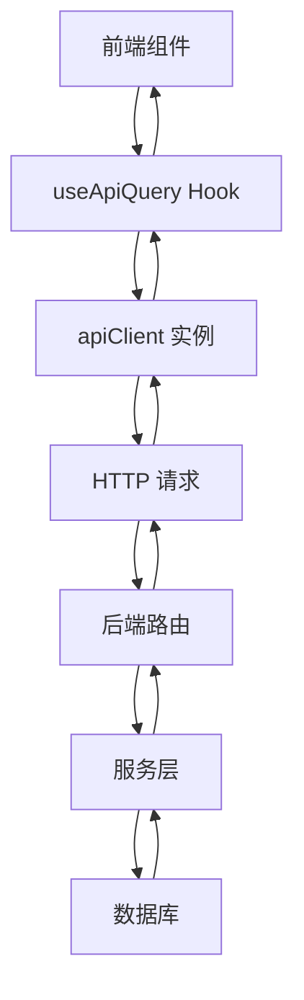
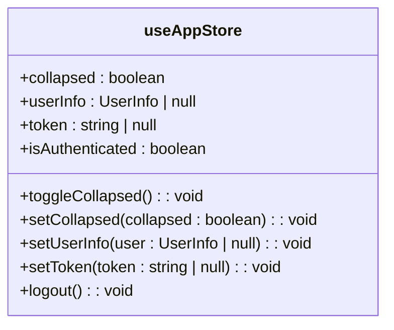
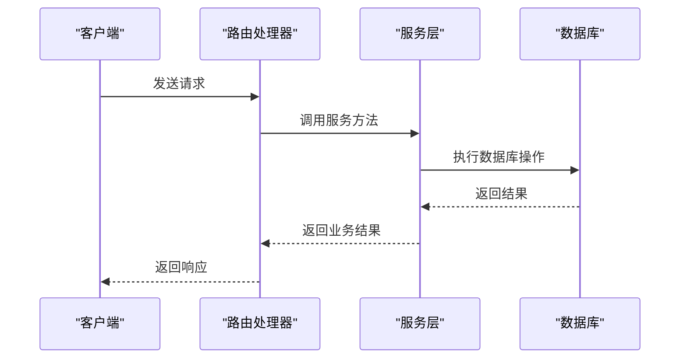
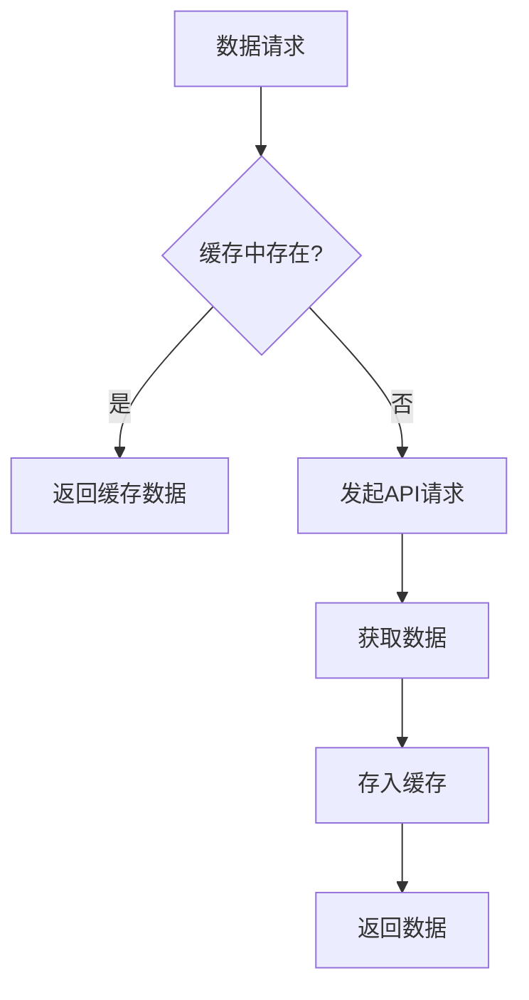

# 开发指南

<cite>
**本文档引用的文件**
- [cache.ts](file://frontend/src/config/cache.ts)
- [cache.ts](file://frontend/src/utils/cache.ts)
- [useAppStore.ts](file://frontend/src/store/useAppStore.ts)
- [useApiQuery.ts](file://frontend/src/utils/useApiQuery.ts)
- [http.ts](file://frontend/src/api/http.ts)
- [api.ts](file://frontend/src/config/api.ts)
- [di.ts](file://backend/src/middleware/di.ts)
- [errors.ts](file://backend/src/utils/errors.ts)
- [EmployeeService.ts](file://backend/src/services/EmployeeService.ts)
- [employees.ts](file://backend/src/routes/employees.ts)
- [useEmployees.ts](file://frontend/src/hooks/business/useEmployees.ts)
- [EmployeeManagement.tsx](file://frontend/src/features/hr/pages/EmployeeManagement.tsx)
- [permission.ts](file://backend/src/middleware/permission.ts)
- [errorHandler.ts](file://frontend/src/utils/errorHandler.ts)
- [playwright.config.ts](file://frontend/playwright.config.ts)
- [vitest.config.ts](file://backend/vitest.config.ts)
</cite>

## 目录
1. [代码风格与目录结构](#代码风格与目录结构)
2. [API调用模式](#api调用模式)
3. [前端数据获取与缓存](#前端数据获取与缓存)
4. [全局状态管理](#全局状态管理)
5. [后端服务层规范](#后端服务层规范)
6. [测试策略](#测试策略)
7. [性能优化技巧](#性能优化技巧)

## 代码风格与目录结构

项目采用TypeScript和React技术栈，遵循统一的代码风格和目录结构约定。前端代码位于`frontend`目录，后端代码位于`backend`目录。前端采用功能模块化组织，`src/features`目录下按业务功能划分模块，每个模块包含页面、组件和相关逻辑。后端采用分层架构，`src/routes`目录存放路由定义，`src/services`目录存放业务服务，`src/db`目录存放数据库相关代码。

**Section sources**
- [EmployeeManagement.tsx](file://frontend/src/features/hr/pages/EmployeeManagement.tsx)

## API调用模式

前端通过`src/api/http.ts`中的`ApiClient`类封装HTTP请求，统一处理认证、错误处理和响应解析。API端点在`src/config/api.ts`中集中定义，采用模块化组织，便于维护和引用。后端使用Hono框架，通过OpenAPI规范定义路由和请求验证，确保API接口的一致性和可文档化。

**Diagram sources**
- [http.ts](file://frontend/src/api/http.ts)
- [api.ts](file://frontend/src/config/api.ts)
- [employees.ts](file://backend/src/routes/employees.ts)
- [EmployeeService.ts](file://backend/src/services/EmployeeService.ts)

## 前端数据获取与缓存

前端使用React Query进行数据获取和缓存管理。`src/utils/useApiQuery.ts`封装了`useApiQuery`和`useApiMutation`等自定义Hook，统一处理查询和变更操作。查询结果根据数据类型设置不同的缓存时间，通过`staleTime`参数控制数据新鲜度。对于报表数据，使用`useReportQuery` Hook，设置较短的缓存时间以保证数据实时性。

**Section sources**
- [useApiQuery.ts](file://frontend/src/utils/useApiQuery.ts)
- [useEmployees.ts](file://frontend/src/hooks/business/useEmployees.ts)

## 全局状态管理

使用Zustand进行全局状态管理，在`src/store/useAppStore.ts`中定义全局状态，包括用户信息、认证状态和UI状态。状态持久化通过`persist`中间件实现，将关键状态存储在localStorage中，确保页面刷新后状态不丢失。状态更新采用不可变方式，通过`set`函数进行状态变更。

**Diagram sources**
- [useAppStore.ts](file://frontend/src/store/useAppStore.ts)

## 后端服务层规范

后端服务层遵循依赖注入原则，在`src/middleware/di.ts`中通过中间件初始化所有服务实例，并注入到请求上下文中。每个服务类负责特定业务领域的逻辑处理，如`EmployeeService`处理员工相关业务。异常处理采用统一的`AppError`类，在`src/utils/errors.ts`中定义，通过`errorHandler`中间件捕获和处理异常，返回结构化的错误响应。

**Diagram sources**
- [di.ts](file://backend/src/middleware/di.ts)
- [errors.ts](file://backend/src/utils/errors.ts)
- [EmployeeService.ts](file://backend/src/services/EmployeeService.ts)
- [employees.ts](file://backend/src/routes/employees.ts)

## 测试策略

项目采用多层次测试策略。单元测试使用Vitest，位于`backend/test`和`frontend/src/test`目录，测试业务逻辑和工具函数。集成测试验证模块间协作，如服务层与数据库的交互。端到端测试使用Playwright，位于`frontend/tests`目录，模拟用户操作流程。测试配置在`playwright.config.ts`和`vitest.config.ts`中定义，支持并行执行和覆盖率报告。

**Section sources**
- [playwright.config.ts](file://frontend/playwright.config.ts)
- [vitest.config.ts](file://backend/vitest.config.ts)

## 性能优化技巧

前端采用多级缓存策略，根据数据类型设置不同缓存时间。在`src/config/cache.ts`中定义了主数据、业务数据、交易数据等的缓存时长。使用`src/utils/cache.ts`中的`DataCache`类实现内存缓存，减少重复请求。对于频繁访问的数据，采用预加载和懒加载结合的方式，平衡性能和资源消耗。API批处理通过批量接口减少网络请求次数，提高操作效率。

**Diagram sources**
- [cache.ts](file://frontend/src/config/cache.ts)
- [cache.ts](file://frontend/src/utils/cache.ts)
- [useApiQuery.ts](file://frontend/src/utils/useApiQuery.ts)