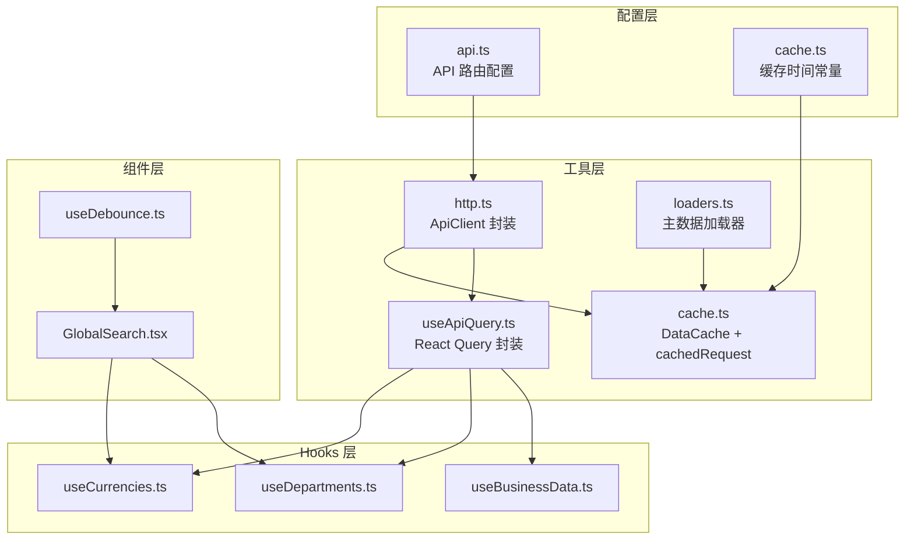
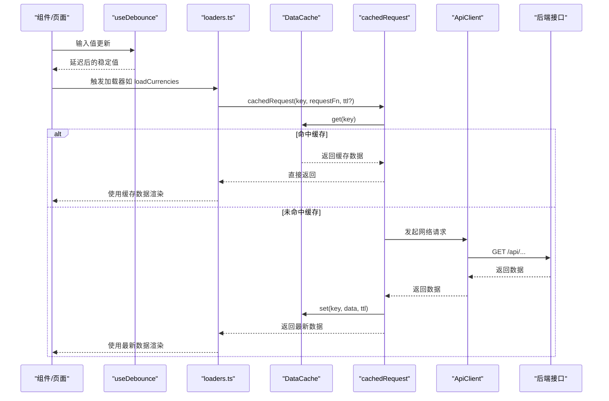
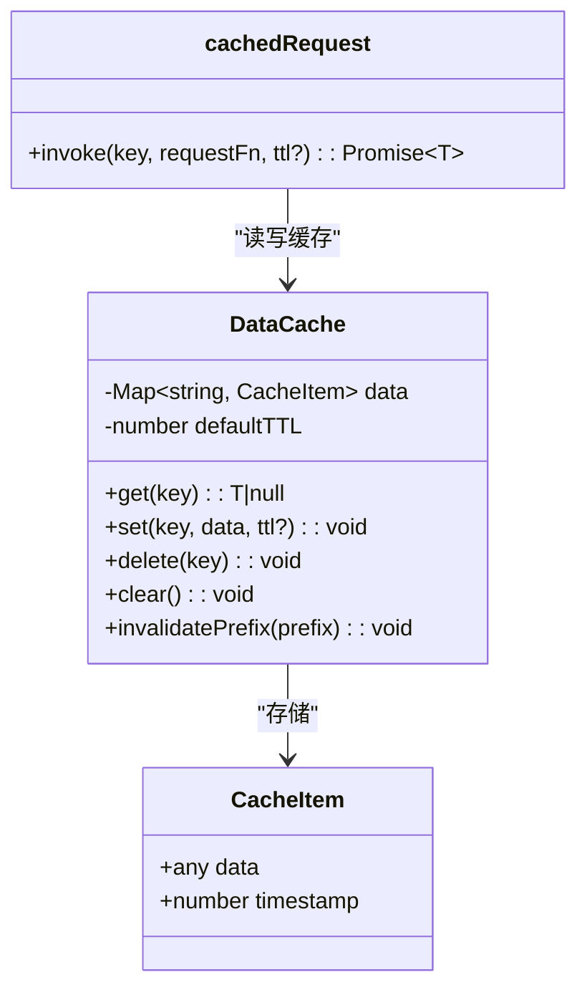
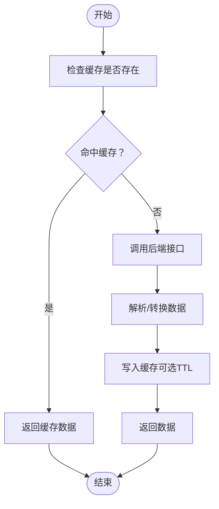
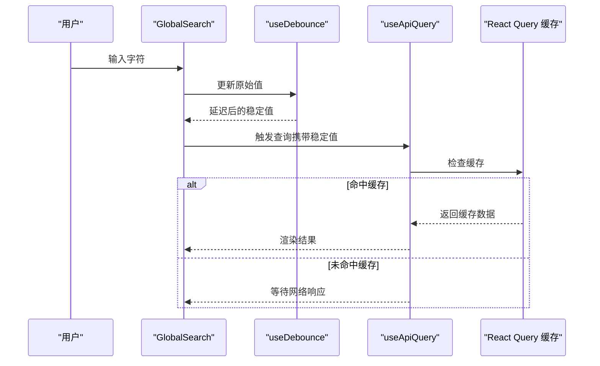
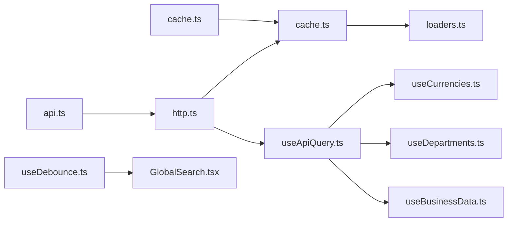

# 前端性能优化

<cite>
**本文引用的文件**
- [frontend/src/utils/cache.ts](file://frontend/src/utils/cache.ts)
- [frontend/src/config/cache.ts](file://frontend/src/config/cache.ts)
- [frontend/src/utils/loaders.ts](file://frontend/src/utils/loaders.ts)
- [frontend/src/hooks/useDebounce.ts](file://frontend/src/hooks/useDebounce.ts)
- [frontend/src/utils/useApiQuery.ts](file://frontend/src/utils/useApiQuery.ts)
- [frontend/src/hooks/business/useCurrencies.ts](file://frontend/src/hooks/business/useCurrencies.ts)
- [frontend/src/hooks/business/useDepartments.ts](file://frontend/src/hooks/business/useDepartments.ts)
- [frontend/src/hooks/useBusinessData.ts](file://frontend/src/hooks/useBusinessData.ts)
- [frontend/src/api/http.ts](file://frontend/src/api/http.ts)
- [frontend/src/config/api.ts](file://frontend/src/config/api.ts)
- [frontend/src/components/GlobalSearch.tsx](file://frontend/src/components/GlobalSearch.tsx)
</cite>

## 目录
1. [引言](#引言)
2. [项目结构](#项目结构)
3. [核心组件](#核心组件)
4. [架构总览](#架构总览)
5. [详细组件分析](#详细组件分析)
6. [依赖关系分析](#依赖关系分析)
7. [性能考量](#性能考量)
8. [故障排查指南](#故障排查指南)
9. [结论](#结论)
10. [附录](#附录)

## 引言
本文件围绕前端性能优化展开，重点说明如何通过 dataCache 类实现数据缓存以减少重复 API 调用；结合 loadCurrencies、loadDepartments 等加载器函数，展示预加载与懒加载的实现模式；解释 cachedRequest 的工作机制及其在提升用户体验中的作用；指导使用 useDebounce 优化搜索输入等高频交互场景的响应性能；提供缓存失效策略（如 invalidatePrefix）的最佳实践；并给出 React Query 与自定义缓存机制协同使用的建议及性能监控与基准测试方法。

## 项目结构
前端采用分层组织方式：
- 配置层：集中管理 API 地址与缓存时间常量
- 工具层：封装缓存、HTTP 请求、React Query 封装、加载器
- Hooks 层：业务查询与变更 Hook，统一数据获取与缓存策略
- 组件层：高频交互组件（如全局搜索）结合防抖与查询缓存

图表来源
- [frontend/src/config/api.ts](file://frontend/src/config/api.ts#L1-L179)
- [frontend/src/config/cache.ts](file://frontend/src/config/cache.ts#L1-L21)
- [frontend/src/api/http.ts](file://frontend/src/api/http.ts#L1-L99)
- [frontend/src/utils/cache.ts](file://frontend/src/utils/cache.ts#L1-L118)
- [frontend/src/utils/loaders.ts](file://frontend/src/utils/loaders.ts#L1-L111)
- [frontend/src/utils/useApiQuery.ts](file://frontend/src/utils/useApiQuery.ts#L1-L94)
- [frontend/src/hooks/business/useCurrencies.ts](file://frontend/src/hooks/business/useCurrencies.ts#L1-L109)
- [frontend/src/hooks/business/useDepartments.ts](file://frontend/src/hooks/business/useDepartments.ts#L1-L63)
- [frontend/src/hooks/useBusinessData.ts](file://frontend/src/hooks/useBusinessData.ts#L1-L67)
- [frontend/src/hooks/useDebounce.ts](file://frontend/src/hooks/useDebounce.ts#L1-L18)
- [frontend/src/components/GlobalSearch.tsx](file://frontend/src/components/GlobalSearch.tsx#L1-L139)

章节来源
- [frontend/src/config/api.ts](file://frontend/src/config/api.ts#L1-L179)
- [frontend/src/config/cache.ts](file://frontend/src/config/cache.ts#L1-L21)
- [frontend/src/api/http.ts](file://frontend/src/api/http.ts#L1-L99)
- [frontend/src/utils/cache.ts](file://frontend/src/utils/cache.ts#L1-L118)
- [frontend/src/utils/loaders.ts](file://frontend/src/utils/loaders.ts#L1-L111)
- [frontend/src/utils/useApiQuery.ts](file://frontend/src/utils/useApiQuery.ts#L1-L94)
- [frontend/src/hooks/business/useCurrencies.ts](file://frontend/src/hooks/business/useCurrencies.ts#L1-L109)
- [frontend/src/hooks/business/useDepartments.ts](file://frontend/src/hooks/business/useDepartments.ts#L1-L63)
- [frontend/src/hooks/useBusinessData.ts](file://frontend/src/hooks/useBusinessData.ts#L1-L67)
- [frontend/src/hooks/useDebounce.ts](file://frontend/src/hooks/useDebounce.ts#L1-L18)
- [frontend/src/components/GlobalSearch.tsx](file://frontend/src/components/GlobalSearch.tsx#L1-L139)

## 核心组件
- DataCache：基于内存 Map 的轻量缓存，支持 TTL 过期与前缀失效
- cachedRequest：统一的带缓存请求包装，优先命中缓存，未命中再发起网络请求
- cacheKeys：集中管理缓存键，便于统一失效与复用
- ApiClient：统一的 HTTP 客户端，内置鉴权头、错误处理与 401 自动登出
- useApiQuery：React Query 封装，提供 staleTime、refetchInterval、select 等性能参数
- loaders：主数据加载器（币种、部门、账户、类别、员工等），统一走 cachedRequest
- useDebounce：通用防抖 Hook，降低高频输入触发的请求压力
- GlobalSearch：结合 useDebounce 与多个业务查询，演示懒加载与缓存协同

章节来源
- [frontend/src/utils/cache.ts](file://frontend/src/utils/cache.ts#L1-L118)
- [frontend/src/utils/loaders.ts](file://frontend/src/utils/loaders.ts#L1-L111)
- [frontend/src/hooks/useDebounce.ts](file://frontend/src/hooks/useDebounce.ts#L1-L18)
- [frontend/src/utils/useApiQuery.ts](file://frontend/src/utils/useApiQuery.ts#L1-L94)
- [frontend/src/api/http.ts](file://frontend/src/api/http.ts#L1-L99)
- [frontend/src/components/GlobalSearch.tsx](file://frontend/src/components/GlobalSearch.tsx#L1-L139)

## 架构总览
下图展示了“缓存 + 查询 + 请求”三层协作的性能优化架构，体现预加载与懒加载的组合策略。

图表来源
- [frontend/src/utils/cache.ts](file://frontend/src/utils/cache.ts#L80-L118)
- [frontend/src/utils/loaders.ts](file://frontend/src/utils/loaders.ts#L1-L111)
- [frontend/src/api/http.ts](file://frontend/src/api/http.ts#L1-L99)

## 详细组件分析

### DataCache 与 cachedRequest：减少重复 API 调用
- 设计要点
  - 使用 Map 存储键值对，每个条目包含数据与时间戳
  - 支持可选 TTL，到期自动清理
  - 提供 invalidatePrefix 前缀失效，便于批量清理
- 性能收益
  - 避免短时间内重复请求相同数据
  - 降低网络与 CPU 开销，改善首屏与切换体验
- 最佳实践
  - 为高频读取的主数据设置较长 TTL（如主数据 1 小时）
  - 对实时性要求高的数据设置较短 TTL 或 0
  - 使用 cacheKeys 统一键名，避免散乱命名导致的冲突

图表来源
- [frontend/src/utils/cache.ts](file://frontend/src/utils/cache.ts#L1-L78)

章节来源
- [frontend/src/utils/cache.ts](file://frontend/src/utils/cache.ts#L1-L118)

### 预加载与懒加载：loadCurrencies、loadDepartments 等加载器
- 预加载（Preload）
  - 在应用启动或进入关键页面前，提前调用加载器，将常用主数据放入缓存
  - 优点：首次渲染更快，交互更顺滑
- 懒加载（Lazy Load）
  - 在用户真正需要时才触发加载器，避免不必要的网络与内存占用
  - 优点：节省带宽与内存，适合低频数据
- 实现模式
  - 加载器内部统一使用 cachedRequest，确保缓存一致性
  - 通过 cacheKeys 保证键名稳定，便于后续失效与复用
  - 结合 React Query 的 staleTime，形成“双缓存”策略

图表来源
- [frontend/src/utils/cache.ts](file://frontend/src/utils/cache.ts#L80-L118)
- [frontend/src/utils/loaders.ts](file://frontend/src/utils/loaders.ts#L1-L111)

章节来源
- [frontend/src/utils/loaders.ts](file://frontend/src/utils/loaders.ts#L1-L111)
- [frontend/src/config/cache.ts](file://frontend/src/config/cache.ts#L1-L21)

### cachedRequest 的工作机制与用户体验提升
- 工作流程
  - 以 key 为索引先查缓存，命中则立即返回
  - 未命中则执行 requestFn 并将结果写入缓存（可选 TTL）
- 用户体验
  - 避免重复点击导致的重复请求
  - 在弱网环境下显著提升交互流畅度
  - 与 React Query 的 staleTime 配合，既保证新鲜度又减少网络开销

章节来源
- [frontend/src/utils/cache.ts](file://frontend/src/utils/cache.ts#L80-L118)

### useDebounce：优化高频交互（如搜索）的响应性能
- 适用场景
  - 文本输入、筛选条件变更、远程搜索等高频触发事件
- 机制
  - 将输入值延迟到稳定后再触发查询，减少请求次数
- 实际应用
  - GlobalSearch 组件使用 500ms 防抖，结合多路查询，避免每次按键都发起请求
  - 与 React Query 的 enabled/refetchInterval 协同，进一步控制刷新节奏

图表来源
- [frontend/src/hooks/useDebounce.ts](file://frontend/src/hooks/useDebounce.ts#L1-L18)
- [frontend/src/components/GlobalSearch.tsx](file://frontend/src/components/GlobalSearch.tsx#L1-L139)
- [frontend/src/utils/useApiQuery.ts](file://frontend/src/utils/useApiQuery.ts#L1-L94)

章节来源
- [frontend/src/hooks/useDebounce.ts](file://frontend/src/hooks/useDebounce.ts#L1-L18)
- [frontend/src/components/GlobalSearch.tsx](file://frontend/src/components/GlobalSearch.tsx#L1-L139)

### 缓存失效策略（invalidatePrefix）最佳实践
- 前缀失效
  - 通过 invalidatePrefix(prefix) 批量删除匹配前缀的缓存键
  - 适合在批量更新、导入、权限变更等场景统一清理相关缓存
- 与 React Query 协同
  - 在成功回调中调用 queryClient.invalidateQueries，配合自定义缓存的前缀失效，确保前后端缓存一致
- 建议
  - 为不同业务域设计稳定的前缀规则（如 “currencies_”、“departments_”）
  - 对于实时性要求高的数据，尽量缩短 TTL 或使用 0，避免脏读

章节来源
- [frontend/src/utils/cache.ts](file://frontend/src/utils/cache.ts#L62-L74)
- [frontend/src/hooks/business/useCurrencies.ts](file://frontend/src/hooks/business/useCurrencies.ts#L58-L109)
- [frontend/src/hooks/business/useDepartments.ts](file://frontend/src/hooks/business/useDepartments.ts#L1-L63)
- [frontend/src/hooks/useBusinessData.ts](file://frontend/src/hooks/useBusinessData.ts#L1-L67)

### React Query 与自定义缓存协同使用建议
- 双缓存策略
  - React Query：负责查询生命周期、去重、并发、失效与重验证
  - 自定义 DataCache：负责细粒度 TTL 与跨页面持久化（如页面刷新后仍可用）
- 参数选择
  - staleTime：控制“新鲜度”，避免频繁网络请求
  - refetchInterval：定时刷新，适合报表等允许延迟的数据
  - select：在缓存层做数据转换，减少渲染成本
- 失效时机
  - 新增/编辑/删除成功后，优先调用 queryClient.invalidateQueries，再根据需要调用 dataCache.invalidatePrefix

章节来源
- [frontend/src/utils/useApiQuery.ts](file://frontend/src/utils/useApiQuery.ts#L1-L94)
- [frontend/src/hooks/business/useCurrencies.ts](file://frontend/src/hooks/business/useCurrencies.ts#L58-L109)
- [frontend/src/hooks/business/useDepartments.ts](file://frontend/src/hooks/business/useDepartments.ts#L1-L63)
- [frontend/src/hooks/useBusinessData.ts](file://frontend/src/hooks/useBusinessData.ts#L1-L67)

## 依赖关系分析
- 配置层
  - api.ts 提供统一 API 路由
  - cache.ts 提供缓存时间常量
- 工具层
  - http.ts 提供统一 HTTP 客户端
  - cache.ts 提供 DataCache 与 cachedRequest
  - loaders.ts 提供主数据加载器
  - useApiQuery.ts 提供 React Query 封装
- Hooks 层
  - useCurrencies.ts、useDepartments.ts 等业务查询 Hook
  - useBusinessData.ts 通用主数据查询封装
- 组件层
  - GlobalSearch.tsx 结合防抖与多查询，演示懒加载与缓存协同

图表来源
- [frontend/src/config/api.ts](file://frontend/src/config/api.ts#L1-L179)
- [frontend/src/config/cache.ts](file://frontend/src/config/cache.ts#L1-L21)
- [frontend/src/api/http.ts](file://frontend/src/api/http.ts#L1-L99)
- [frontend/src/utils/cache.ts](file://frontend/src/utils/cache.ts#L1-L118)
- [frontend/src/utils/loaders.ts](file://frontend/src/utils/loaders.ts#L1-L111)
- [frontend/src/utils/useApiQuery.ts](file://frontend/src/utils/useApiQuery.ts#L1-L94)
- [frontend/src/hooks/business/useCurrencies.ts](file://frontend/src/hooks/business/useCurrencies.ts#L1-L109)
- [frontend/src/hooks/business/useDepartments.ts](file://frontend/src/hooks/business/useDepartments.ts#L1-L63)
- [frontend/src/hooks/useBusinessData.ts](file://frontend/src/hooks/useBusinessData.ts#L1-L67)
- [frontend/src/hooks/useDebounce.ts](file://frontend/src/hooks/useDebounce.ts#L1-L18)
- [frontend/src/components/GlobalSearch.tsx](file://frontend/src/components/GlobalSearch.tsx#L1-L139)

## 性能考量
- 缓存策略
  - 主数据（币种、部门等）：长 TTL（如 1 小时）
  - 业务数据（员工、供应商等）：中 TTL（如 30 分钟）
  - 交易/流水等：短 TTL（如 5 分钟）
  - 报表：允许一定延迟（如 10 分钟）
  - 实时数据：TTL=0，避免缓存污染
- 请求去重与并发
  - React Query 默认去重同一 queryKey 的请求
  - 自定义缓存避免重复写入
- 错误与 401 处理
  - ApiClient 对 401 自动登出，防止无效请求堆积
- 防抖与节流
  - useDebounce 降低高频输入触发的请求频率
- 渲染优化
  - 使用 select 在缓存层做数据转换，减少渲染成本
  - 合理拆分查询，避免单次查询过大

[本节为通用性能建议，不直接分析具体文件]

## 故障排查指南
- 常见问题
  - 缓存未生效：确认 key 是否一致、TTL 是否过短或过长
  - 数据不更新：确认 staleTime 是否过长，或是否正确调用 invalidateQueries/invalidatePrefix
  - 401 登出异常：检查 ApiClient 的 401 处理逻辑
  - 防抖导致响应慢：适当降低延迟或在关键路径关闭防抖
- 排查步骤
  - 使用浏览器开发者工具 Network 面板观察请求重复情况
  - 在控制台打印 queryKey 与缓存命中情况
  - 在变更成功回调中显式调用失效与清理
- 相关实现参考
  - ApiClient 的 401 自动登出与错误提示
  - useApiQuery 的 staleTime、refetchInterval、select
  - useDebounce 的延迟与清理

章节来源
- [frontend/src/api/http.ts](file://frontend/src/api/http.ts#L1-L99)
- [frontend/src/utils/useApiQuery.ts](file://frontend/src/utils/useApiQuery.ts#L1-L94)
- [frontend/src/hooks/useDebounce.ts](file://frontend/src/hooks/useDebounce.ts#L1-L18)

## 结论
通过 DataCache 与 cachedRequest 的统一缓存、React Query 的查询生命周期管理、useDebounce 的输入优化，以及合理的缓存失效策略，可以显著降低重复请求、提升渲染性能与用户体验。建议在主数据加载中采用预加载+懒加载混合策略，在高频交互场景中引入防抖，并在变更成功后同步清理前后端缓存，确保数据一致性与性能平衡。

[本节为总结性内容，不直接分析具体文件]

## 附录
- 性能监控与基准测试建议
  - 使用浏览器性能面板记录关键路径（首屏、路由切换、搜索）的渲染耗时
  - 使用 React DevTools Profiler 分析组件渲染热点
  - 使用 Vitest/Jest 测试查询与缓存行为，确保失效逻辑正确
  - 对高频输入场景（如搜索）进行压力测试，评估防抖阈值与查询并发

[本节为通用建议，不直接分析具体文件]