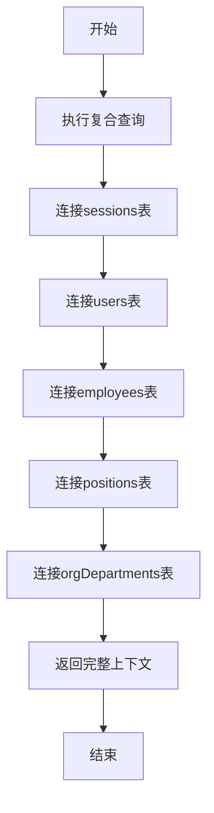
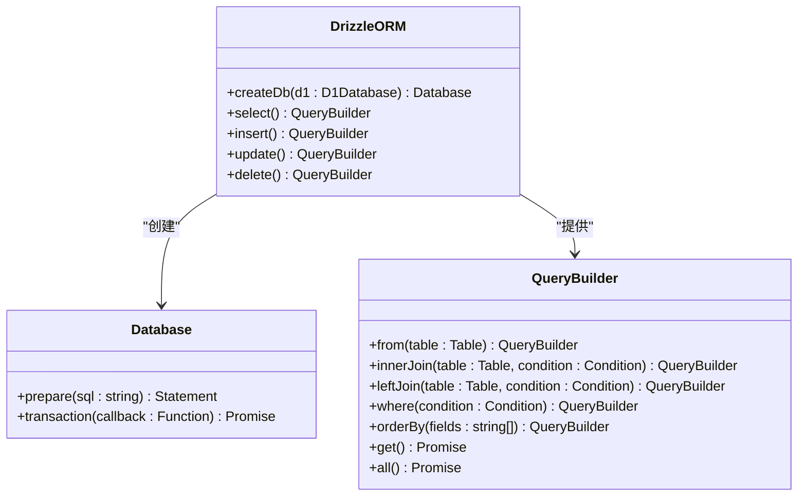
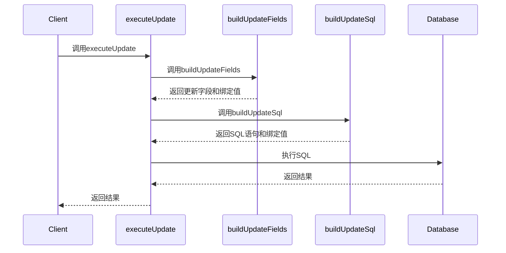
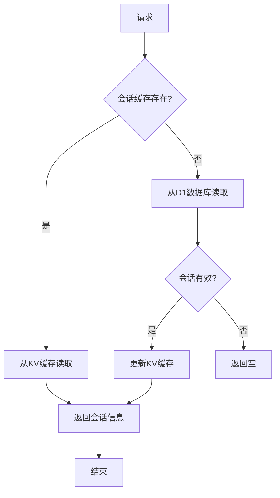

# 后端性能优化

<cite>
**本文档引用的文件**
- [migration_performance_indexes.sql](file://backend/src/db/archive/migration_performance_indexes.sql)
- [sql.ts](file://backend/src/utils/sql.ts)
- [db.ts](file://backend/src/utils/db.ts)
- [AuthService.ts](file://backend/src/services/AuthService.ts)
- [schema.ts](file://backend/src/db/schema.ts)
- [di.ts](file://backend/src/middleware/di.ts)
</cite>

## 目录
1. [复合查询优化](#复合查询优化)
2. [Drizzle ORM 高效使用模式](#drizzle-orm-高效使用模式)
3. [动态SQL工具函数](#动态sql工具函数)
4. [索引设计优化](#索引设计优化)
5. [数据库连接管理与缓存](#数据库连接管理与缓存)
6. [性能压测与慢查询分析](#性能压测与慢查询分析)

## 复合查询优化

在财务系统中，会话管理是高频操作，需要同时获取用户、职位、员工和部门信息。系统通过`getSessionWithUserAndPosition`函数实现了单次数据库查询获取所有相关信息，显著减少了I/O开销。

该函数通过Drizzle ORM的连接查询功能，一次性从`sessions`、`users`、`employees`、`positions`和`orgDepartments`五个表中获取数据，避免了传统的N+1查询问题。这种复合查询方式将原本需要5次数据库往返的操作减少为1次，大大提升了会话验证的性能。



**图表来源**
- [db.ts](file://backend/src/utils/db.ts#L117-L222)

**章节来源**
- [db.ts](file://backend/src/utils/db.ts#L117-L222)

## Drizzle ORM 高效使用模式

系统采用Drizzle ORM作为数据库访问层，充分利用其类型安全和查询优化特性。通过合理的连接查询和批量数据处理，实现了高效的数据库操作。

### 连接查询优化

Drizzle ORM支持复杂的连接查询，允许在单个查询中关联多个表。在`getUserPosition`函数中，系统通过内连接`users`、`employees`和`positions`表，一次性获取用户的职位信息，避免了多次查询的开销。

### 批量数据处理

对于需要处理大量数据的场景，系统采用批量操作模式。通过Drizzle ORM的批量插入和更新功能，将多个数据库操作合并为单个事务，减少了事务开销和网络往返次数。



**图表来源**
- [db.ts](file://backend/src/utils/db.ts#L9-L11)
- [schema.ts](file://backend/src/db/schema.ts)

**章节来源**
- [db.ts](file://backend/src/utils/db.ts)
- [schema.ts](file://backend/src/db/schema.ts)

## 动态SQL工具函数

系统提供了`buildUpdateSql`和`executeUpdate`等动态SQL工具函数，用于减少查询解析开销和提高代码复用性。

### buildUpdateSql函数

`buildUpdateSql`函数用于构建动态更新SQL语句。它接收表名、记录ID、更新字段数组和绑定值数组作为参数，生成标准的UPDATE语句。通过预编译的SQL模板和参数绑定，避免了SQL注入风险，同时减少了查询解析的开销。

### executeUpdate函数

`executeUpdate`函数封装了更新操作的完整流程。它首先调用`buildUpdateFields`处理字段映射，然后调用`buildUpdateSql`生成SQL语句，最后执行数据库操作。这种分层设计提高了代码的可维护性和复用性。



**图表来源**
- [sql.ts](file://backend/src/utils/sql.ts#L16-L73)

**章节来源**
- [sql.ts](file://backend/src/utils/sql.ts#L16-L73)

## 索引设计优化

系统的`migration_performance_indexes.sql`文件包含了关键的性能优化索引，通过合理的索引设计显著提升了查询性能。

### 现金流相关索引

为`cash_flows`表创建了多个复合索引，包括`idx_cash_flows_biz_date_dept`、`idx_cash_flows_biz_date_site`等。这些索引针对常见的查询模式（按业务日期和部门/站点查询）进行了优化，使相关查询能够快速定位数据。

### 借款相关索引

为`borrowings`表创建了`idx_borrowings_user_currency`和`idx_borrowings_user_id`等索引，优化了按用户和货币查询借款记录的性能。同时为`repayments`表的`borrowing_id`字段创建索引，加速了还款记录的查询。

### 请假和报销相关索引

为`employee_leaves`和`expense_reimbursements`表创建了针对状态和日期的复合索引，优化了审批流程中常见的查询操作。例如`idx_employee_leaves_emp_status_date`索引可以快速找到特定员工在特定状态下的请假记录。

```mermaid
erDiagram
cash_flows ||--o{ indexes : "has"
borrowings ||--o{ indexes : "has"
employee_leaves ||--o{ indexes : "has"
expense_reimbursements ||--o{ indexes : "has"
class cash_flows {
biz_date
department_id
site_id
}
class indexes {
idx_cash_flows_biz_date_dept
idx_cash_flows_biz_date_site
idx_cash_flows_dept_date
idx_cash_flows_site_date
}
class borrowings {
user_id
currency
created_at
}
class borrowings_indexes {
idx_borrowings_user_currency
idx_borrowings_user_id
idx_borrowings_created_at
}
```

**图表来源**
- [migration_performance_indexes.sql](file://backend/src/db/archive/migration_performance_indexes.sql)

**章节来源**
- [migration_performance_indexes.sql](file://backend/src/db/archive/migration_performance_indexes.sql)

## 数据库连接管理与缓存

系统采用了多层次的数据库连接管理和缓存策略，以提高整体性能。

### 连接池管理

通过Drizzle ORM的连接管理功能，系统实现了数据库连接的高效复用。在`di.ts`文件中，每个请求都会获取一个数据库实例，该实例在请求生命周期内被所有服务共享，避免了频繁创建和销毁连接的开销。

### 多级缓存策略

系统实现了多级缓存策略，包括KV缓存和数据库缓存。在`AuthService`中，会话信息首先存储在Cloudflare KV中，作为高性能缓存层。同时，会话信息也会持久化到D1数据库中，作为备份和审计用途。这种双重存储策略既保证了高性能，又确保了数据可靠性。

### 读写分离

对于会话管理等高频读操作，系统优先从KV缓存读取数据。只有当缓存未命中时，才会降级到D1数据库查询。这种读写分离策略有效减轻了数据库的读取压力。



**图表来源**
- [AuthService.ts](file://backend/src/services/AuthService.ts#L177-L198)
- [di.ts](file://backend/src/middleware/di.ts#L25-L75)

**章节来源**
- [AuthService.ts](file://backend/src/services/AuthService.ts)
- [di.ts](file://backend/src/middleware/di.ts)

## 性能压测与慢查询分析

系统提供了完善的性能压测和慢查询分析机制，确保在高负载下仍能保持良好的性能表现。

### 性能压测

通过Vitest框架，系统实现了全面的单元测试和集成测试。测试用例覆盖了核心业务逻辑，包括用户认证、权限控制、财务处理等。通过持续的性能测试，可以及时发现性能瓶颈并进行优化。

### 慢查询分析

系统通过日志记录和监控工具，持续跟踪数据库查询性能。对于执行时间超过阈值的查询，系统会记录详细的执行计划和统计信息，便于开发人员分析和优化。

### 监控指标

系统监控关键性能指标，包括：
- 数据库查询响应时间
- 缓存命中率
- 会话创建和验证时间
- API端点响应时间

这些指标通过定期报告和告警机制，帮助运维团队及时发现和解决性能问题。

**章节来源**
- [package.json](file://backend/package.json)
- [AuthService.ts](file://backend/src/services/AuthService.ts)