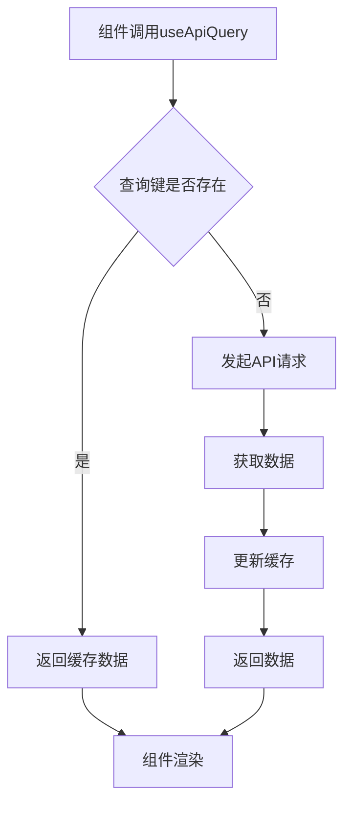
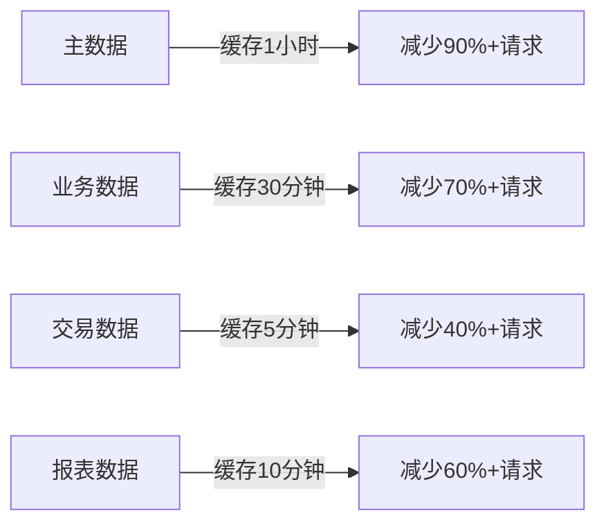
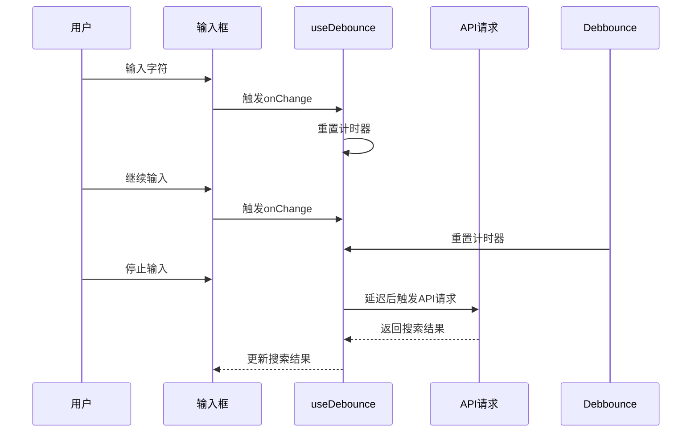
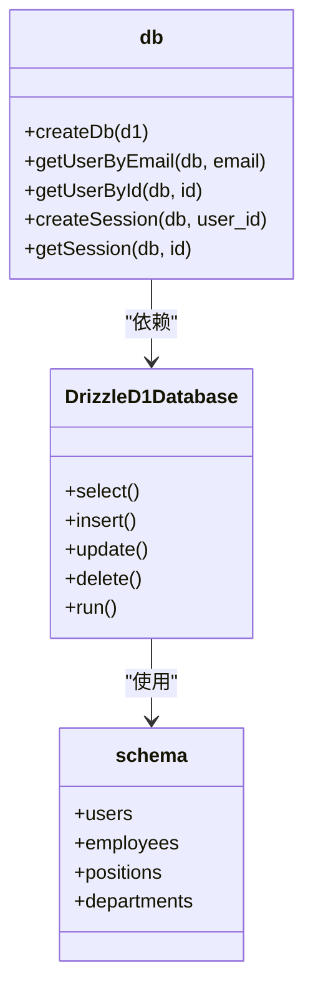
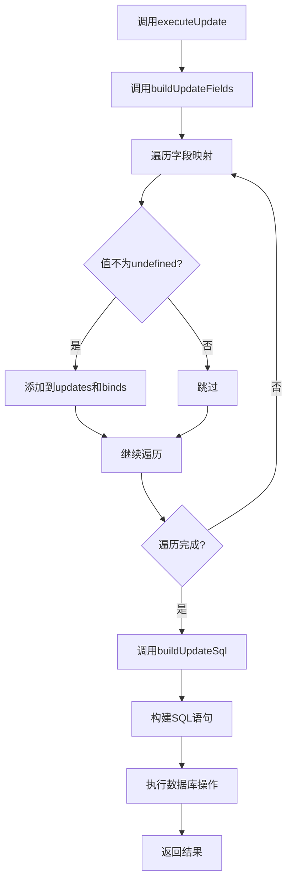
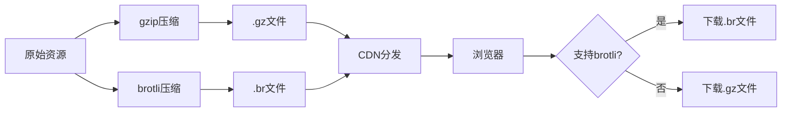
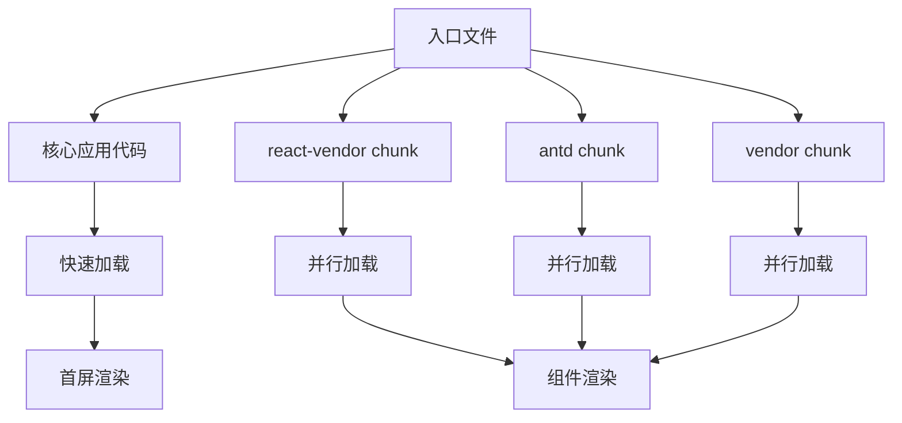
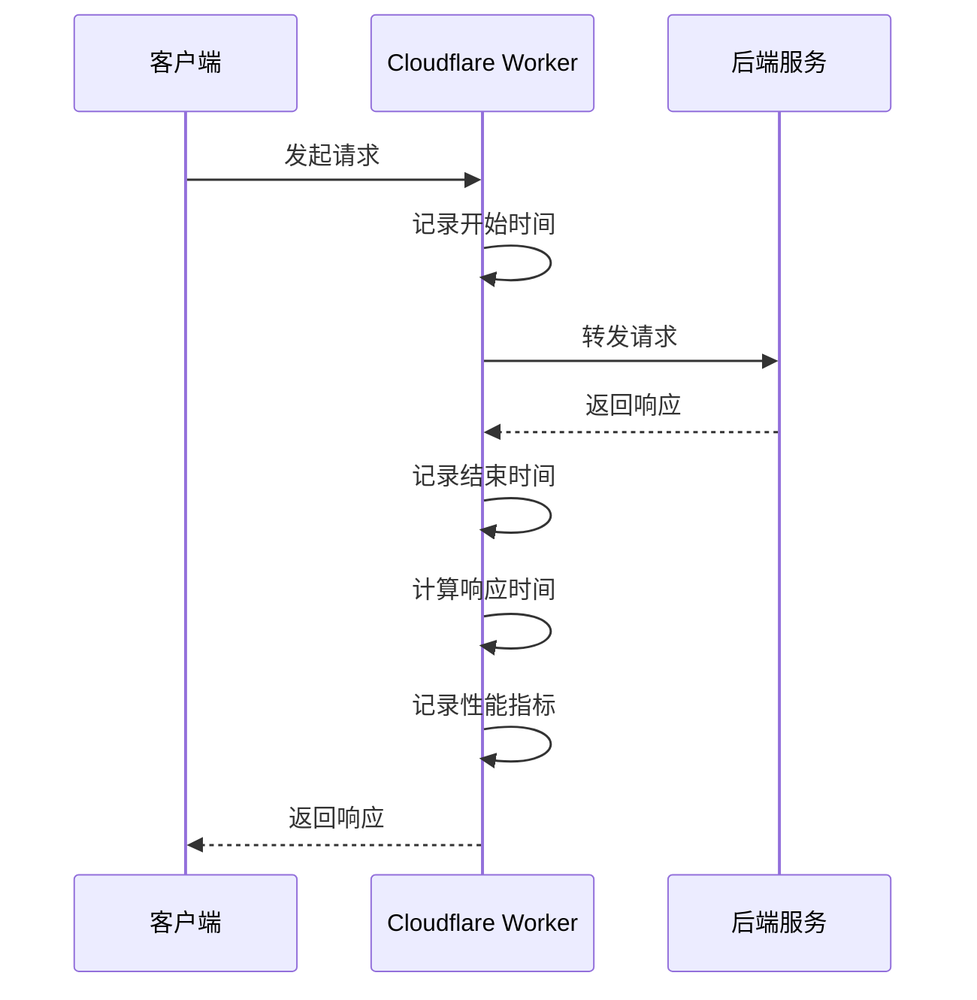

# 性能优化

<cite>
**本文档引用的文件**
- [cache.ts](file://frontend/src/config/cache.ts)
- [useDebounce.ts](file://frontend/src/hooks/useDebounce.ts)
- [cache.ts](file://frontend/src/utils/cache.ts)
- [useApiQuery.ts](file://frontend/src/utils/useApiQuery.ts)
- [schema.ts](file://backend/src/db/schema.ts)
- [migration_performance_indexes.sql](file://backend/src/db/archive/migration_performance_indexes.sql)
- [sql.ts](file://backend/src/utils/sql.ts)
- [db.ts](file://backend/src/utils/db.ts)
- [http.ts](file://frontend/src/api/http.ts)
- [vite.config.ts](file://frontend/vite.config.ts)
</cite>

## 目录
1. [前端性能优化](#前端性能优化)
2. [后端性能优化](#后端性能优化)
3. [网络层面优化](#网络层面优化)
4. [性能监控与基准测试](#性能监控与基准测试)

## 前端性能优化

### React Query缓存机制

本系统通过React Query的缓存机制有效减少API调用次数。`useApiQuery` Hook封装了React Query的`useQuery`，实现了统一的数据获取和缓存策略。通过配置不同的`staleTime`，可以控制数据的缓存时间，避免频繁的网络请求。



**Diagram sources**
- [useApiQuery.ts](file://frontend/src/utils/useApiQuery.ts)

**Section sources**
- [useApiQuery.ts](file://frontend/src/utils/useApiQuery.ts)

### 数据预加载与懒加载策略

通过`cache.ts`配置文件，系统定义了不同类型数据的缓存时间，实现了智能的预加载与懒加载策略：

- **主数据**（变化极少）：币种、类别、部门等 - 缓存1小时
- **业务数据**（变化较少）：员工、供应商、账户等 - 缓存30分钟
- **交易数据**（变化频繁）：流水、单据、审批等 - 缓存5分钟
- **报表数据**（允许一定延迟）：各类报表 - 缓存10分钟
- **实时数据**（不允许延迟）：状态检查、实时监控等 - 不缓存

这种分级缓存策略确保了数据的实时性与性能之间的平衡，对于不常变化的主数据进行长时间缓存，减少重复请求；对于频繁变化的交易数据则设置较短的缓存时间。



**Diagram sources**
- [cache.ts](file://frontend/src/config/cache.ts)

**Section sources**
- [cache.ts](file://frontend/src/config/cache.ts)

### 搜索输入响应优化

系统通过`useDebounce` Hook优化搜索输入的响应性能，避免在用户输入过程中频繁触发搜索请求。该Hook利用`setTimeout`和`useEffect`实现防抖功能，只有当用户停止输入指定延迟时间后，才会触发搜索操作。



**Diagram sources**
- [useDebounce.ts](file://frontend/src/hooks/useDebounce.ts)

**Section sources**
- [useDebounce.ts](file://frontend/src/hooks/useDebounce.ts)

## 后端性能优化

### Drizzle ORM高效使用

系统采用Drizzle ORM作为数据库操作工具，通过其类型安全的查询构建器实现高效的数据库操作。在`db.ts`中，通过`drizzle(d1, { schema })`创建数据库实例，实现了类型安全的数据库访问。



**Diagram sources**
- [db.ts](file://backend/src/utils/db.ts)
- [schema.ts](file://backend/src/db/schema.ts)

**Section sources**
- [db.ts](file://backend/src/utils/db.ts)
- [schema.ts](file://backend/src/db/schema.ts)

### SQL索引优化

通过`migration_performance_indexes.sql`文件，系统实施了全面的SQL索引优化策略，针对高频查询场景创建了复合索引，显著提升了查询性能：

```sql
-- 现金流相关索引优化
CREATE INDEX IF NOT EXISTS idx_cash_flows_biz_date_dept ON cash_flows(biz_date, department_id);
CREATE INDEX IF NOT EXISTS idx_cash_flows_biz_date_site ON cash_flows(biz_date, site_id);
CREATE INDEX IF NOT EXISTS idx_cash_flows_dept_date ON cash_flows(department_id, biz_date);

-- 借款相关索引优化
CREATE INDEX IF NOT EXISTS idx_borrowings_user_currency ON borrowings(user_id, currency);
CREATE INDEX IF NOT EXISTS idx_borrowings_user_id ON borrowings(user_id);
CREATE INDEX IF NOT EXISTS idx_borrowings_created_at ON borrowings(created_at);

-- 请假相关索引优化
CREATE INDEX IF NOT EXISTS idx_employee_leaves_emp_status_date ON employee_leaves(employee_id, status, start_date);
CREATE INDEX IF NOT EXISTS idx_employee_leaves_status_date ON employee_leaves(status, start_date, end_date);
```

这些索引覆盖了系统中最常见的查询模式，如按日期范围查询现金流、按用户ID查询借款记录、按状态和日期查询请假记录等，有效避免了全表扫描。

```mermaid
erDiagram
cash_flows ||--o{ indexes : "索引优化"
borrowings ||--o{ indexes : "索引优化"
employee_leaves ||--o{ indexes : "索引优化"
expense_reimbursements ||--o{ indexes : "索引优化"
class indexes {
+idx_cash_flows_biz_date_dept
+idx_cash_flows_biz_date_site
+idx_borrowings_user_currency
+idx_employee_leaves_emp_status_date
+idx_expense_reimbursements_emp_status
}
```

**Diagram sources**
- [migration_performance_indexes.sql](file://backend/src/db/archive/migration_performance_indexes.sql)

**Section sources**
- [migration_performance_indexes.sql](file://backend/src/db/archive/migration_performance_indexes.sql)

### 批量操作处理

系统通过`sql.ts`中的工具函数实现了高效的批量操作处理。`buildUpdateSql`和`executeUpdate`函数支持动态构建更新SQL语句，避免了重复的代码逻辑，同时确保了操作的原子性和一致性。



**Diagram sources**
- [sql.ts](file://backend/src/utils/sql.ts)

**Section sources**
- [sql.ts](file://backend/src/utils/sql.ts)

## 网络层面优化

### API响应压缩

系统在`vite.config.ts`中配置了响应压缩，通过`viteCompression`插件同时支持gzip和brotli两种压缩算法，有效减少了网络传输的数据量。

```typescript
export default defineConfig({
  plugins: [
    react(),
    viteCompression({
      algorithm: 'gzip',
      ext: '.gz',
    }),
    viteCompression({
      algorithm: 'brotliCompress',
      ext: '.br',
    })
  ],
})
```

这种双重压缩策略确保了在不同浏览器环境下都能获得最佳的压缩效果，现代浏览器优先使用压缩率更高的brotli算法，而旧版浏览器则回退到广泛支持的gzip算法。



**Diagram sources**
- [vite.config.ts](file://frontend/vite.config.ts)

**Section sources**
- [vite.config.ts](file://frontend/vite.config.ts)

### 资源加载优先级控制

通过`vite.config.ts`中的`manualChunks`配置，系统实现了资源的分块加载，将第三方库拆分为独立的chunk，优化了资源加载优先级：

```typescript
build: {
  rollupOptions: {
    output: {
      manualChunks: {
        'react-vendor': ['react', 'react-dom', 'react-router-dom'],
        'antd': ['antd'],
        'antd-icons': ['@ant-design/icons'],
        'vendor': ['@tanstack/react-query', 'dayjs', 'zustand', 'qrcode.react'],
      },
    },
  }
}
```

这种分块策略确保了核心应用代码可以优先加载，而大型第三方库则可以并行加载，提高了首屏渲染速度。



**Diagram sources**
- [vite.config.ts](file://frontend/vite.config.ts)

**Section sources**
- [vite.config.ts](file://frontend/vite.config.ts)

## 性能监控与基准测试

### 性能监控方法

系统通过Cloudflare Pages的函数代理机制实现了全面的性能监控。`_worker.ts`文件中的代理逻辑不仅处理API请求，还记录了关键的性能指标：



此外，`public/_headers`中的Content-Security-Policy配置了`https://static.cloudflareinsights.com`，集成了Cloudflare的性能监控服务，可以收集页面加载性能、资源加载时间等关键指标。

**Section sources**
- [_worker.ts](file://frontend/_worker.ts)
- [_headers](file://frontend/public/_headers)

### 基准测试建议

为了确保系统性能的持续优化，建议实施以下基准测试策略：

1. **API响应时间测试**：使用自动化测试工具定期测试关键API的响应时间，建立性能基线
2. **数据库查询性能测试**：针对高频查询场景进行压力测试，监控查询执行时间
3. **缓存命中率监控**：统计React Query的缓存命中率，评估缓存策略的有效性
4. **前端资源加载测试**：使用Lighthouse等工具定期评估前端性能指标
5. **并发用户测试**：模拟多用户并发场景，测试系统的负载能力

通过持续的基准测试，可以及时发现性能瓶颈，验证优化措施的效果，确保系统在高负载下仍能保持良好的响应性能。