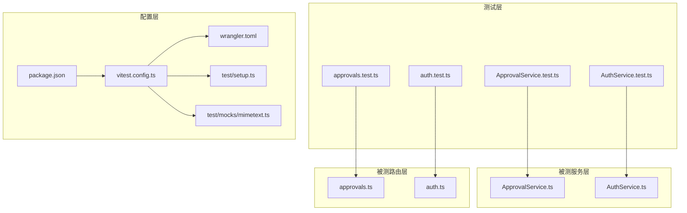
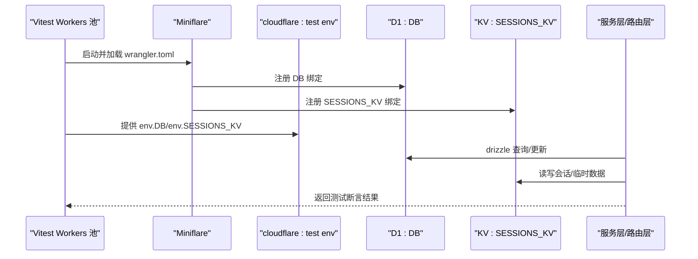
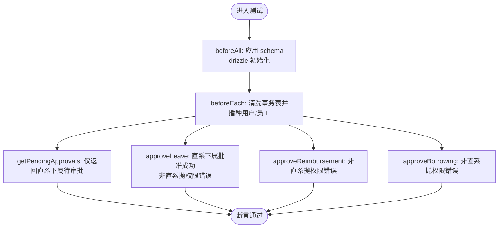
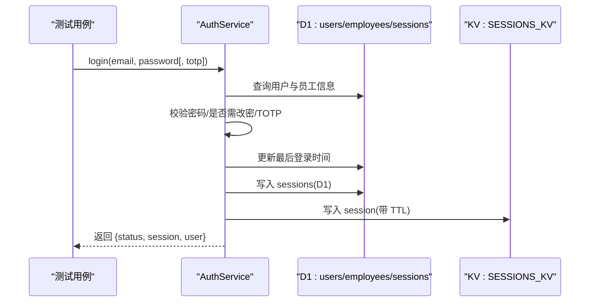
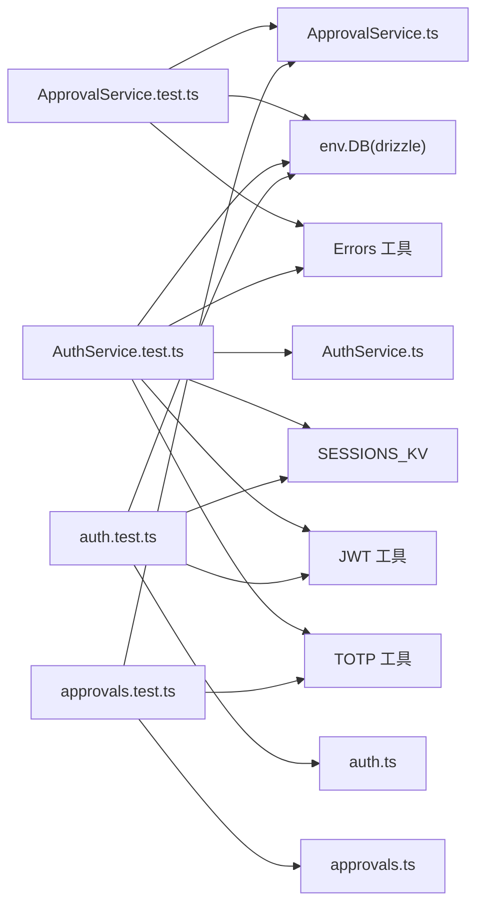

# 单元测试

<cite>
**本文引用的文件**
- [vitest.config.ts](file://backend/vitest.config.ts)
- [wrangler.toml](file://backend/wrangler.toml)
- [package.json](file://backend/package.json)
- [setup.ts](file://backend/test/setup.ts)
- [mimetext.ts](file://backend/test/mocks/mimetext.ts)
- [ApprovalService.test.ts](file://backend/test/services/ApprovalService.test.ts)
- [AuthService.test.ts](file://backend/test/services/AuthService.test.ts)
- [approvals.test.ts](file://backend/test/routes/approvals.test.ts)
- [auth.test.ts](file://backend/test/routes/auth.test.ts)
- [ApprovalService.ts](file://backend/src/services/ApprovalService.ts)
- [AuthService.ts](file://backend/src/services/AuthService.ts)
- [approvals.ts](file://backend/src/routes/approvals.ts)
- [auth.ts](file://backend/src/routes/auth.ts)
- [errors.ts](file://backend/src/utils/errors.ts)
- [jwt.ts](file://backend/src/utils/jwt.ts)
- [auth.util.ts](file://backend/src/utils/auth.ts)
</cite>

## 目录
1. [简介](#简介)
2. [项目结构](#项目结构)
3. [核心组件](#核心组件)
4. [架构总览](#架构总览)
5. [详细组件分析](#详细组件分析)
6. [依赖关系分析](#依赖关系分析)
7. [性能与覆盖率](#性能与覆盖率)
8. [故障排查指南](#故障排查指南)
9. [结论](#结论)
10. [附录](#附录)

## 简介
本指南聚焦于后端单元测试体系，围绕 Vite 测试框架在 Cloudflare Workers 环境下的配置与实践，系统讲解服务层与路由层的测试策略。文档重点覆盖：
- Vitest 在 Cloudflare Workers 环境中的配置要点（D1 数据库与 KV 命名空间）。
- 服务层测试（ApprovalService、AuthService）中的依赖注入模拟与数据库交互隔离。
- 路由层测试（auth、approvals）中的请求模拟、中间件注入与权限校验。
- 异步函数、错误处理与 JWT 认证逻辑的测试方法。
- 断言最佳实践、测试生命周期钩子使用与测试套件组织建议。

## 项目结构
后端测试位于 backend/test 目录，按“服务层”和“路由层”分组，分别对应 src/services 与 src/routes 的被测模块。Vitest 使用 @cloudflare/vitest-pool-workers 在 Workers 环境下执行测试，wrangler.toml 提供 D1 与 KV 的绑定配置，vitest.config.ts 定义池选项与路径别名。

图表来源
- [vitest.config.ts](file://backend/vitest.config.ts#L1-L26)
- [wrangler.toml](file://backend/wrangler.toml#L1-L45)
- [package.json](file://backend/package.json#L1-L43)
- [setup.ts](file://backend/test/setup.ts#L1-L27)
- [mimetext.ts](file://backend/test/mocks/mimetext.ts#L1-L10)
- [ApprovalService.test.ts](file://backend/test/services/ApprovalService.test.ts#L1-L332)
- [AuthService.test.ts](file://backend/test/services/AuthService.test.ts#L1-L144)
- [auth.test.ts](file://backend/test/routes/auth.test.ts#L1-L115)
- [approvals.test.ts](file://backend/test/routes/approvals.test.ts#L1-L133)
- [ApprovalService.ts](file://backend/src/services/ApprovalService.ts#L1-L283)
- [AuthService.ts](file://backend/src/services/AuthService.ts#L1-L306)
- [approvals.ts](file://backend/src/routes/approvals.ts#L1-L393)
- [auth.ts](file://backend/src/routes/auth.ts#L1-L418)

章节来源
- [vitest.config.ts](file://backend/vitest.config.ts#L1-L26)
- [wrangler.toml](file://backend/wrangler.toml#L1-L45)
- [package.json](file://backend/package.json#L1-L43)

## 核心组件
- Vitest Workers 池配置：通过 defineWorkersConfig 指定 wrangler.toml 路径、Miniflare 选项（D1 与 KV）、兼容标志等；resolve.alias 将 mimetext 指向测试专用模拟。
- 服务层测试：
  - ApprovalService.test.ts：基于 cloudflare:test 的 env.DB 与 drizzle 初始化，beforeAll 应用 schema，beforeEach 清洗事务表并播种用户/员工数据，覆盖审批查询与审批动作的正反用例。
  - AuthService.test.ts：同 schema 初始化，使用 vi.mock 对 verifyTotp 进行统一返回，构造 SystemConfigService 的最小依赖对象，验证登录流程、TOTP 绑定与变更密码首登场景。
- 路由层测试：
  - auth.test.ts：直接调用 Hono 应用实例，构造执行上下文与环境变量（含 AUTH_JWT_SECRET），验证登录与 me 接口返回值与鉴权头提取。
  - approvals.test.ts：使用 vitest-mock-extended 构造 D1 与服务层的深度 mock，通过中间件注入 userId 与 services，验证审批路由的参数解析、权限校验与服务调用断言。

章节来源
- [ApprovalService.test.ts](file://backend/test/services/ApprovalService.test.ts#L1-L332)
- [AuthService.test.ts](file://backend/test/services/AuthService.test.ts#L1-L144)
- [auth.test.ts](file://backend/test/routes/auth.test.ts#L1-L115)
- [approvals.test.ts](file://backend/test/routes/approvals.test.ts#L1-L133)

## 架构总览
下图展示了测试执行在 Workers 环境中的关键交互：Vitest Workers 池启动 Miniflare，加载 wrangler.toml 中的 D1 与 KV 绑定；测试代码通过 cloudflare:test 的 env 访问 DB 与 KV；服务层通过 drizzle 访问 D1；路由层通过 Hono 路由与中间件注入的服务对象协作。

图表来源
- [vitest.config.ts](file://backend/vitest.config.ts#L1-L26)
- [wrangler.toml](file://backend/wrangler.toml#L1-L45)

## 详细组件分析

### Vitest Workers 配置与环境隔离
- 池选项
  - workers.wrangler: 指向 wrangler.toml，确保 Miniflare 加载 D1 与 KV。
  - workers.miniflare: d1Databases 与 kvNamespaces 明确绑定名称；compatibilityFlags=nodejs_compat 支持 Node 生态依赖。
- 路径别名
  - resolve.alias.mimetext 指向测试目录下的模拟实现，便于替换外部依赖（如邮件库）。
- 测试脚本
  - package.json 中 scripts.test 指向 vitest，配合 Workers 池运行。

章节来源
- [vitest.config.ts](file://backend/vitest.config.ts#L1-L26)
- [wrangler.toml](file://backend/wrangler.toml#L1-L45)
- [package.json](file://backend/package.json#L1-L43)
- [mimetext.ts](file://backend/test/mocks/mimetext.ts#L1-L10)

### 服务层测试：ApprovalService
- 数据库初始化与隔离
  - beforeAll：读取 schema.sql 并逐条执行，应用到 env.DB；随后 drizzle 初始化并注入 schema；为兼容事务封装 db.transaction 为非事务执行。
  - beforeEach：清空 employeeLeaves、expenseReimbursements、borrowings、employees、users 等事务表，播种 manager/subordinate/other 用户与员工数据，确保每轮用例独立。
- 权限与业务逻辑验证
  - getPendingApprovals：验证仅返回直系下属的待审批项，跨部门不应返回。
  - approveLeave/rejectLeave：校验非直系下属时抛出权限错误；批准后状态与审批人、备注更新。
  - approveReimbursement：注释指出服务层内部未显式校验权限，依赖上层控制器或调用方；测试中验证非直系下属应抛出权限错误。
  - approveBorrowing：针对按 userId 关联的借支记录，需先映射到员工再判断是否直系，否则拒绝。
- 断言与错误处理
  - 使用 expect 断言返回结构与状态字段；使用 expect(...).rejects.toThrow 验证业务错误与权限错误。

图表来源
- [ApprovalService.test.ts](file://backend/test/services/ApprovalService.test.ts#L1-L332)
- [ApprovalService.ts](file://backend/src/services/ApprovalService.ts#L1-L283)

章节来源
- [ApprovalService.test.ts](file://backend/test/services/ApprovalService.test.ts#L1-L332)
- [ApprovalService.ts](file://backend/src/services/ApprovalService.ts#L1-L283)

### 服务层测试：AuthService
- Mock 策略
  - vi.mock 对 verifyTotp 进行统一返回，简化 TOTP 校验分支。
  - 构造 SystemConfigService 的最小依赖对象，返回固定配置值，隔离外部配置影响。
- 登录流程验证
  - 无 TOTP：登录返回 need_bind_totp。
  - 有 TOTP：登录成功，返回 token 与用户信息，并在 KV 中写入会话。
  - 密码错误：抛出未授权错误。
  - 首次登录需改密：返回 must_change_password。
  - 变更密码首登：校验通过后清除 mustChangePassword 标记并更新密码哈希。
- 会话管理
  - createSession：单点登录策略（删除旧会话 KV/D1），同时写入 KV 与 D1；KV TTL 基于过期时间换算。
  - getSession/logout：优先 KV 读取，降级 D1；登出清理 KV 与 D1。

图表来源
- [AuthService.test.ts](file://backend/test/services/AuthService.test.ts#L1-L144)
- [AuthService.ts](file://backend/src/services/AuthService.ts#L1-L306)

章节来源
- [AuthService.test.ts](file://backend/test/services/AuthService.test.ts#L1-L144)
- [AuthService.ts](file://backend/src/services/AuthService.ts#L1-L306)

### 路由层测试：auth
- 请求模拟
  - 直接调用 Hono 应用实例 app.request，构造执行上下文 executionCtx（包含 waitUntil/passThroughOnException）与测试环境 env（注入 AUTH_JWT_SECRET）。
- 鉴权与响应
  - 登录接口：校验返回 ok 与 token 存在；me 接口：携带 Bearer Token 请求，断言返回用户信息。
- 错误处理
  - 通过路由层的错误处理器，统一返回结构化错误体，便于测试断言。

章节来源
- [auth.test.ts](file://backend/test/routes/auth.test.ts#L1-L115)
- [auth.ts](file://backend/src/routes/auth.ts#L1-L418)
- [jwt.ts](file://backend/src/utils/jwt.ts#L1-L119)
- [errors.ts](file://backend/src/utils/errors.ts#L1-L114)

### 路由层测试：approvals
- 依赖注入与中间件
  - beforeEach 中间件注入 userId、services（approval/employee）、userPosition（含权限），模拟路由上下文。
- 参数解析与权限校验
  - 路由参数 id 与请求体 memo 解析；针对报销与借支审批，使用 hasPermission 校验 HR/Finance 权限，不满足则抛权限错误。
- 服务调用断言
  - 使用 vitest-mock-extended 的 deep mock，断言服务方法被正确调用且参数匹配。

章节来源
- [approvals.test.ts](file://backend/test/routes/approvals.test.ts#L1-L133)
- [approvals.ts](file://backend/src/routes/approvals.ts#L1-L393)

## 依赖关系分析
- 测试对被测模块的耦合
  - 服务层测试直接依赖 drizzle 与 schema，通过 env.DB 与 schema 注入，避免真实数据库依赖。
  - 路由层测试通过中间件注入服务对象，隔离外部依赖（如数据库、KV），专注于路由行为与权限校验。
- 外部依赖模拟
  - vi.mock 与 vitest-mock-extended：前者用于函数级模拟，后者用于对象/类的深度 mock。
  - resolve.alias：将第三方库替换为测试模拟，降低外部服务依赖。
- 错误与工具
  - Errors 工具集中化错误类型；JWT 工具提供签发与校验；TOTP 工具提供验证码生成与校验。

图表来源
- [ApprovalService.test.ts](file://backend/test/services/ApprovalService.test.ts#L1-L332)
- [AuthService.test.ts](file://backend/test/services/AuthService.test.ts#L1-L144)
- [auth.test.ts](file://backend/test/routes/auth.test.ts#L1-L115)
- [approvals.test.ts](file://backend/test/routes/approvals.test.ts#L1-L133)
- [ApprovalService.ts](file://backend/src/services/ApprovalService.ts#L1-L283)
- [AuthService.ts](file://backend/src/services/AuthService.ts#L1-L306)
- [auth.ts](file://backend/src/routes/auth.ts#L1-L418)
- [approvals.ts](file://backend/src/routes/approvals.ts#L1-L393)
- [errors.ts](file://backend/src/utils/errors.ts#L1-L114)
- [jwt.ts](file://backend/src/utils/jwt.ts#L1-L119)
- [auth.util.ts](file://backend/src/utils/auth.ts#L1-L18)

## 性能与覆盖率
- 测试性能
  - 使用 Workers 池在 Miniflare 中运行，避免真实网络与外部服务开销；drizzle 与 schema 注入减少数据库连接成本。
  - beforeEach 清洗与播种采用批量删除/插入，尽量缩短准备时间。
- 覆盖率要求与实现
  - 仓库未提供覆盖率配置文件；建议在 vitest.config.ts 中启用 coverage 选项，并结合最小权限与边界条件用例提升覆盖率。
  - 对关键路径（权限校验、错误分支、JWT 签发/校验、会话读写）补充断言，确保高覆盖率与高质量。

[本节为通用指导，不直接分析具体文件]

## 故障排查指南
- 未授权/权限不足
  - 确认中间件注入的 userId 与 userPosition 是否正确；路由层 hasPermission 的权限键是否匹配。
- JWT 校验失败
  - 确保测试环境 env 中 AUTH_JWT_SECRET 设置为足够长度的密钥；路由层 verifyAuthToken 会校验签名与过期时间。
- 会话读取异常
  - KV 与 D1 的写入/删除顺序是否一致；KV TTL 是否正确换算；getSession 的降级逻辑是否生效。
- TOTP 校验问题
  - vi.mock 的 verifyTotp 返回值是否符合预期；AuthService 中的设备指纹与信任设备逻辑是否触发。

章节来源
- [auth.test.ts](file://backend/test/routes/auth.test.ts#L1-L115)
- [auth.ts](file://backend/src/routes/auth.ts#L1-L418)
- [jwt.ts](file://backend/src/utils/jwt.ts#L1-L119)
- [AuthService.test.ts](file://backend/test/services/AuthService.test.ts#L1-L144)
- [AuthService.ts](file://backend/src/services/AuthService.ts#L1-L306)

## 结论
本测试体系通过 Vitest Workers 池与 Miniflare 实现了对 Cloudflare Workers 环境的完整覆盖，服务层与路由层测试分别采用依赖注入模拟与深度 mock，有效隔离数据库与 KV 交互，确保测试的稳定性与可维护性。建议在现有基础上补充覆盖率配置与更多边界用例，持续提升测试质量。

[本节为总结性内容，不直接分析具体文件]

## 附录

### 测试生命周期与断言最佳实践
- 生命周期
  - beforeAll：一次性应用 schema，初始化 drizzle。
  - beforeEach：清洗事务表并播种数据，保证用例独立。
  - afterEach：可选清理额外资源（如 KV 中的临时键）。
- 断言
  - 使用 expect(value).toBe(...)、expect(object).toBeDefined()、expect(promise).rejects.toThrow(...)。
  - 对路由返回体进行结构化断言，包括 ok、error、code 字段。
  - 对服务层返回对象进行字段断言（如 counts、列表长度、状态值）。

章节来源
- [ApprovalService.test.ts](file://backend/test/services/ApprovalService.test.ts#L1-L332)
- [AuthService.test.ts](file://backend/test/services/AuthService.test.ts#L1-L144)
- [auth.test.ts](file://backend/test/routes/auth.test.ts#L1-L115)
- [approvals.test.ts](file://backend/test/routes/approvals.test.ts#L1-L133)

### 异步函数与错误处理测试方法
- 异步函数
  - 使用 await service.method(...)；对返回值进行断言。
- 错误处理
  - 使用 expect(...).rejects.toThrow(...) 验证业务错误与权限错误；结合 Errors 工具的错误类型断言。
  - 路由层通过 errorHandler 统一返回结构化错误体，便于测试断言。

章节来源
- [errors.ts](file://backend/src/utils/errors.ts#L1-L114)
- [AuthService.test.ts](file://backend/test/services/AuthService.test.ts#L1-L144)
- [auth.test.ts](file://backend/test/routes/auth.test.ts#L1-L115)

### JWT 认证逻辑测试要点
- 登录签发
  - 使用 signAuthToken 生成 token，断言返回体包含 token 与用户信息。
- 鉴权提取
  - 通过 Authorization 头或自定义 x-caiwu-token 头传递 token；verifyAuthToken 校验签名与过期。
- 会话管理
  - createSession 单点登录策略与 KV/D1 写入；logout 清理会话。

章节来源
- [auth.ts](file://backend/src/routes/auth.ts#L1-L418)
- [jwt.ts](file://backend/src/utils/jwt.ts#L1-L119)
- [AuthService.ts](file://backend/src/services/AuthService.ts#L1-L306)