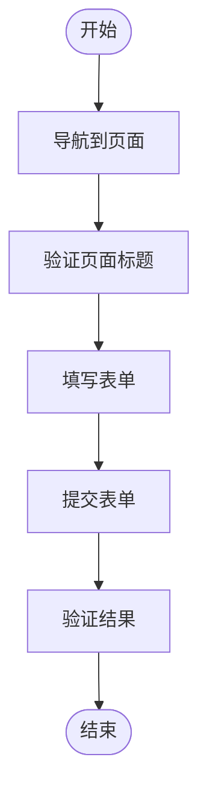

# 测试策略

<cite>
**本文档中引用的文件**  
- [vitest.config.ts](file://backend/vitest.config.ts)
- [playwright.config.ts](file://frontend/playwright.config.ts)
- [setup.ts](file://backend/test/setup.ts)
- [ApprovalService.test.ts](file://backend/test/services/ApprovalService.test.ts)
- [AuthService.test.ts](file://backend/test/services/AuthService.test.ts)
- [login.spec.ts](file://frontend/tests/login.spec.ts)
- [employee-management.spec.ts](file://frontend/tests/employee-management.spec.ts)
- [finance-flows.spec.ts](file://frontend/tests/finance-flows.spec.ts)
- [auth.test.ts](file://backend/test/routes/auth.test.ts)
- [approvals.test.ts](file://backend/test/routes/approvals.test.ts)
- [mimetext.ts](file://backend/test/mocks/mimetext.ts)
- [env.d.ts](file://backend/test/env.d.ts)
- [vite-env.d.ts](file://backend/test/vite-env.d.ts)
- [package.json](file://backend/package.json)
- [package.json](file://frontend/package.json)
</cite>

## 目录
1. [简介](#简介)
2. [测试体系架构](#测试体系架构)
3. [后端单元测试](#后端单元测试)
4. [后端集成测试](#后端集成测试)
5. [前端端到端测试](#前端端到端测试)
6. [测试配置最佳实践](#测试配置最佳实践)
7. [测试数据准备与断言策略](#测试数据准备与断言策略)
8. [异步操作处理](#异步操作处理)
9. [测试覆盖率要求](#测试覆盖率要求)
10. [结论](#结论)

## 简介
本指南旨在建立一个完整的测试体系，涵盖单元测试、集成测试和端到端测试。文档详细说明了如何使用Vitest编写后端服务层和路由的单元测试，包括Mock策略和测试覆盖率要求。同时指导前端如何使用Playwright编写E2E测试，覆盖用户登录、员工管理、财务流程等关键业务路径。此外，还提供了测试配置的最佳实践，如vitest.config.ts中的环境设置和playwright.config.ts中的多浏览器测试配置。

## 测试体系架构
该财务系统采用分层测试策略，包括后端单元测试、后端集成测试和前端端到端测试。后端测试主要使用Vitest框架，结合Cloudflare Workers环境进行测试。前端测试使用Playwright进行端到端测试，模拟真实用户操作。测试体系通过合理的Mock策略和测试数据准备，确保测试的独立性和可重复性。

**Diagram sources**
- [vitest.config.ts](file://backend/vitest.config.ts)
- [playwright.config.ts](file://frontend/playwright.config.ts)

**Section sources**
- [package.json](file://backend/package.json)
- [package.json](file://frontend/package.json)

## 后端单元测试
后端单元测试主要针对服务层组件，使用Vitest框架进行测试。测试文件位于`backend/test/services/`目录下，如`ApprovalService.test.ts`和`AuthService.test.ts`。这些测试通过Mock数据库和外部依赖，确保测试的独立性和快速执行。

### ApprovalService单元测试
`ApprovalService.test.ts`文件测试了审批服务的核心功能，包括获取待审批事项、批准请假、拒绝请假、批准报销和批准借款等。测试通过模拟数据库操作，验证服务层逻辑的正确性。

**Diagram sources**
- [ApprovalService.test.ts](file://backend/test/services/ApprovalService.test.ts)

**Section sources**
- [ApprovalService.test.ts](file://backend/test/services/ApprovalService.test.ts)

### AuthService单元测试
`AuthService.test.ts`文件测试了认证服务的核心功能，包括用户登录、密码验证、TOTP验证等。测试通过Mock验证函数，确保认证逻辑的正确性。

**Diagram sources**
- [AuthService.test.ts](file://backend/test/services/AuthService.test.ts)

**Section sources**
- [AuthService.test.ts](file://backend/test/services/AuthService.test.ts)

## 后端集成测试
后端集成测试主要针对路由层，使用Vitest框架进行测试。测试文件位于`backend/test/routes/`目录下，如`auth.test.ts`和`approvals.test.ts`。这些测试通过模拟HTTP请求，验证路由层和中间件的正确性。

### 认证路由集成测试
`auth.test.ts`文件测试了认证路由的核心功能，包括用户登录和获取用户信息。测试通过模拟HTTP请求，验证路由层逻辑的正确性。

**Diagram sources**
- [auth.test.ts](file://backend/test/routes/auth.test.ts)

**Section sources**
- [auth.test.ts](file://backend/test/routes/auth.test.ts)

### 审批路由集成测试
`approvals.test.ts`文件测试了审批路由的核心功能，包括获取待审批事项、批准请假、拒绝请假等。测试通过Mock服务层，验证路由层逻辑的正确性。

**Diagram sources**
- [approvals.test.ts](file://backend/test/routes/approvals.test.ts)

**Section sources**
- [approvals.test.ts](file://backend/test/routes/approvals.test.ts)

## 前端端到端测试
前端端到端测试使用Playwright框架进行测试，模拟真实用户操作。测试文件位于`frontend/tests/`目录下，如`login.spec.ts`、`employee-management.spec.ts`和`finance-flows.spec.ts`。这些测试通过浏览器自动化，验证用户界面和业务流程的正确性。

### 登录流程E2E测试
`login.spec.ts`文件测试了用户登录流程，包括填写登录表单、提交表单和验证登录结果。测试通过Mock API响应，确保测试的独立性和可重复性。

**Diagram sources**
- [login.spec.ts](file://frontend/tests/login.spec.ts)

**Section sources**
- [login.spec.ts](file://frontend/tests/login.spec.ts)

### 员工管理E2E测试
`employee-management.spec.ts`文件测试了员工管理流程，包括创建员工、填写员工信息和提交表单。测试通过Mock API响应，验证员工创建流程的正确性。

**Diagram sources**
- [employee-management.spec.ts](file://frontend/tests/employee-management.spec.ts)

**Section sources**
- [employee-management.spec.ts](file://frontend/tests/employee-management.spec.ts)

### 财务流程E2E测试
`finance-flows.spec.ts`文件测试了财务流程，包括创建收入记账、填写记账信息和提交表单。测试通过Mock API响应，验证财务流程的正确性。

**Diagram sources**
- [finance-flows.spec.ts](file://frontend/tests/finance-flows.spec.ts)

**Section sources**
- [finance-flows.spec.ts](file://frontend/tests/finance-flows.spec.ts)

## 测试配置最佳实践
测试配置是确保测试体系稳定运行的关键。后端使用Vitest配置，前端使用Playwright配置，两者都遵循最佳实践。

### Vitest配置
`vitest.config.ts`文件配置了Vitest测试框架，包括Workers池选项、D1数据库和KV命名空间。配置确保测试在Cloudflare Workers环境中正确运行。

**Diagram sources**
- [vitest.config.ts](file://backend/vitest.config.ts)

**Section sources**
- [vitest.config.ts](file://backend/vitest.config.ts)

### Playwright配置
`playwright.config.ts`文件配置了Playwright测试框架，包括测试目录、并行执行、重试机制和多浏览器测试。配置确保E2E测试的稳定性和可靠性。

**Diagram sources**
- [playwright.config.ts](file://frontend/playwright.config.ts)

**Section sources**
- [playwright.config.ts](file://frontend/playwright.config.ts)

## 测试数据准备与断言策略
测试数据准备和断言策略是确保测试质量的关键。后端测试通过种子数据准备测试环境，前端测试通过API Mock准备测试数据。

### 后端测试数据准备
后端测试使用`setup.ts`文件中的`initTestDb`和`applySchema`函数准备测试数据。测试通过插入种子数据，确保测试环境的一致性。

**Diagram sources**
- [setup.ts](file://backend/test/setup.ts)

**Section sources**
- [setup.ts](file://backend/test/setup.ts)

### 前端断言策略
前端测试使用Playwright的断言API，确保UI元素的状态和内容正确。测试通过`expect`函数验证页面标题、URL、元素可见性和文本内容。

**Diagram sources**
- [login.spec.ts](file://frontend/tests/login.spec.ts)
- [employee-management.spec.ts](file://frontend/tests/employee-management.spec.ts)

**Section sources**
- [login.spec.ts](file://frontend/tests/login.spec.ts)
- [employee-management.spec.ts](file://frontend/tests/employee-management.spec.ts)

## 异步操作处理
异步操作处理是测试中的关键挑战。后端测试使用Vitest的异步测试功能，前端测试使用Playwright的等待机制。

### 后端异步测试
后端测试使用`async/await`语法处理异步操作，确保测试按预期顺序执行。测试通过`beforeAll`和`beforeEach`钩子函数准备测试环境。

**Diagram sources**
- [ApprovalService.test.ts](file://backend/test/services/ApprovalService.test.ts)
- [AuthService.test.ts](file://backend/test/services/AuthService.test.ts)

**Section sources**
- [ApprovalService.test.ts](file://backend/test/services/ApprovalService.test.ts)
- [AuthService.test.ts](file://backend/test/services/AuthService.test.ts)

### 前端异步等待
前端测试使用Playwright的等待API，确保页面元素加载完成后再进行操作。测试通过`waitForSelector`和`waitForResponse`函数处理异步操作。

**Diagram sources**
- [login.spec.ts](file://frontend/tests/login.spec.ts)
- [employee-management.spec.ts](file://frontend/tests/employee-management.spec.ts)

**Section sources**
- [login.spec.ts](file://frontend/tests/login.spec.ts)
- [employee-management.spec.ts](file://frontend/tests/employee-management.spec.ts)

## 测试覆盖率要求
测试覆盖率是衡量测试质量的重要指标。项目要求核心业务逻辑的测试覆盖率达到80%以上，关键路径的测试覆盖率达到100%。

### 覆盖率目标
- 核心服务层：80%以上
- 关键路由：100%
- 前端关键流程：100%
- 边界条件：全面覆盖

### 覆盖率工具
使用Vitest内置的覆盖率工具，生成详细的覆盖率报告。报告包括行覆盖率、函数覆盖率、分支覆盖率和语句覆盖率。

**Diagram sources**
- [vitest.config.ts](file://backend/vitest.config.ts)

**Section sources**
- [vitest.config.ts](file://backend/vitest.config.ts)

## 结论
本指南详细介绍了财务系统的完整测试体系，涵盖了单元测试、集成测试和端到端测试。通过合理的测试策略和配置，确保了系统的质量和稳定性。建议团队遵循本指南的最佳实践，持续改进测试体系，提高软件质量。