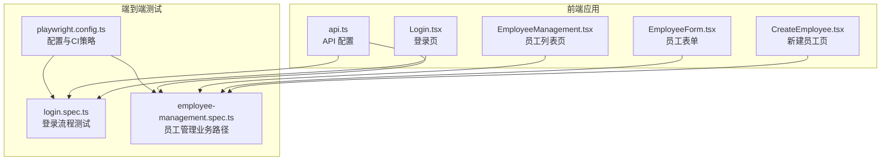
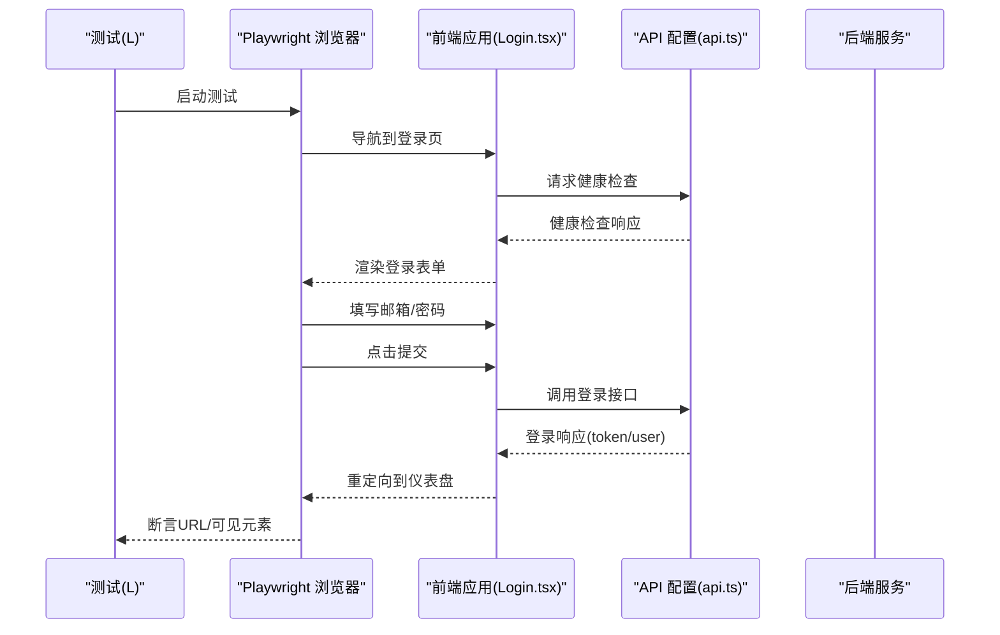
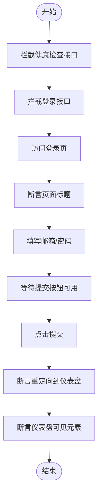
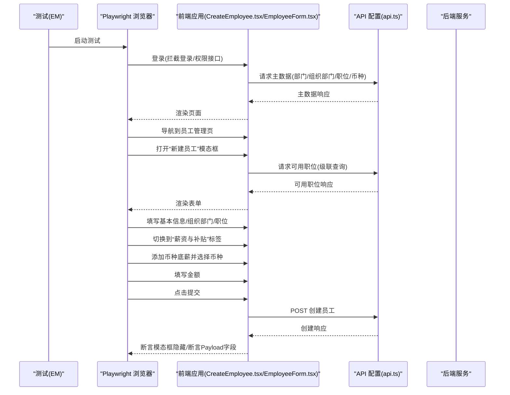
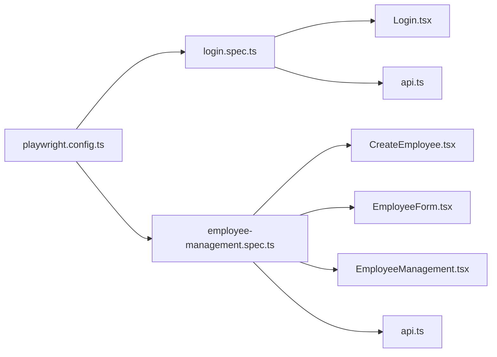

# 端到端测试

<cite>
**本文引用的文件**
- [playwright.config.ts](file://frontend/playwright.config.ts)
- [login.spec.ts](file://frontend/tests/login.spec.ts)
- [employee-management.spec.ts](file://frontend/tests/employee-management.spec.ts)
- [Login.tsx](file://frontend/src/features/auth/pages/Login.tsx)
- [CreateEmployee.tsx](file://frontend/src/features/hr/pages/CreateEmployee.tsx)
- [EmployeeForm.tsx](file://frontend/src/features/employees/components/forms/EmployeeForm.tsx)
- [EmployeeManagement.tsx](file://frontend/src/features/hr/pages/EmployeeManagement.tsx)
- [api.ts](file://frontend/src/config/api.ts)
</cite>

## 目录
1. [简介](#简介)
2. [项目结构](#项目结构)
3. [核心组件](#核心组件)
4. [架构总览](#架构总览)
5. [详细组件分析](#详细组件分析)
6. [依赖关系分析](#依赖关系分析)
7. [性能考量](#性能考量)
8. [故障排查指南](#故障排查指南)
9. [结论](#结论)
10. [附录](#附录)

## 简介
本指南面向使用 Playwright 的前端团队，围绕仓库中的端到端测试进行系统化讲解。重点覆盖：
- 在 login.spec.ts 中编写用户登录流程测试，包含表单提交、重定向与会话保持验证；
- 在 employee-management.spec.ts 中模拟完整的员工管理业务路径，涵盖创建、编辑、转正、离职、重新入职与删除等操作；
- 解析 playwright.config.ts 的多浏览器配置与 CI/CD 集成策略（失败重试、追踪记录）；
- 提供处理异步加载、动态元素与复杂表单交互的最佳实践，确保测试的健壮性与可重复性。

## 项目结构
前端端到端测试位于 frontend/tests 目录，Playwright 配置位于 frontend/playwright.config.ts。登录页与员工管理页面分别位于 frontend/src/features/auth/pages 与 frontend/src/features/hr/pages。

图表来源
- [playwright.config.ts](file://frontend/playwright.config.ts#L1-L80)
- [login.spec.ts](file://frontend/tests/login.spec.ts#L1-L45)
- [employee-management.spec.ts](file://frontend/tests/employee-management.spec.ts#L1-L312)
- [Login.tsx](file://frontend/src/features/auth/pages/Login.tsx#L1-L258)
- [CreateEmployee.tsx](file://frontend/src/features/hr/pages/CreateEmployee.tsx#L1-L317)
- [EmployeeForm.tsx](file://frontend/src/features/employees/components/forms/EmployeeForm.tsx#L1-L272)
- [EmployeeManagement.tsx](file://frontend/src/features/hr/pages/EmployeeManagement.tsx#L1-L200)
- [api.ts](file://frontend/src/config/api.ts#L1-L179)

章节来源
- [playwright.config.ts](file://frontend/playwright.config.ts#L1-L80)
- [login.spec.ts](file://frontend/tests/login.spec.ts#L1-L45)
- [employee-management.spec.ts](file://frontend/tests/employee-management.spec.ts#L1-L312)

## 核心组件
- Playwright 配置与 CI/CD 集成：定义测试目录、并行策略、失败重试、追踪记录、本地服务启动与浏览器项目。
- 登录流程测试：拦截健康检查与登录接口，断言标题、表单填充、按钮可用性、提交后重定向与页面可见元素。
- 员工管理测试：通过 API 拦截构建完整业务路径，覆盖登录、导航、打开模态框、填写复杂表单、切换标签页、提交与断言结果。

章节来源
- [playwright.config.ts](file://frontend/playwright.config.ts#L1-L80)
- [login.spec.ts](file://frontend/tests/login.spec.ts#L1-L45)
- [employee-management.spec.ts](file://frontend/tests/employee-management.spec.ts#L1-L312)

## 架构总览
下图展示登录与员工管理两条端到端测试链路与前端页面、API 配置之间的关系。

图表来源
- [login.spec.ts](file://frontend/tests/login.spec.ts#L1-L45)
- [Login.tsx](file://frontend/src/features/auth/pages/Login.tsx#L1-L258)
- [api.ts](file://frontend/src/config/api.ts#L1-L179)

## 详细组件分析

### 登录流程测试（login.spec.ts）
- 行为要点
  - 拦截健康检查与登录接口，返回稳定响应以保证测试可重复性；
  - 访问登录页，断言标题包含应用标识；
  - 填充邮箱与密码，等待提交按钮可用后点击；
  - 断言重定向到仪表盘，并验证页面可见元素。
- 关键实现位置
  - 登录页渲染与导航逻辑：[Login.tsx](file://frontend/src/features/auth/pages/Login.tsx#L1-L258)
  - API 接口定义：[api.ts](file://frontend/src/config/api.ts#L1-L179)
  - 测试脚本：[login.spec.ts](file://frontend/tests/login.spec.ts#L1-L45)

图表来源
- [login.spec.ts](file://frontend/tests/login.spec.ts#L1-L45)
- [Login.tsx](file://frontend/src/features/auth/pages/Login.tsx#L1-L258)
- [api.ts](file://frontend/src/config/api.ts#L1-L179)

章节来源
- [login.spec.ts](file://frontend/tests/login.spec.ts#L1-L45)
- [Login.tsx](file://frontend/src/features/auth/pages/Login.tsx#L1-L258)
- [api.ts](file://frontend/src/config/api.ts#L1-L179)

### 员工管理业务路径（employee-management.spec.ts）
- 行为要点
  - 登录阶段：拦截登录与当前用户权限接口，确保具备 HR 员工管理权限；
  - 主数据拦截：部门、组织部门、职位、可用职位、币种、员工汇总等；
  - 列表拦截：创建员工时拦截 POST 请求并记录请求体；列表 GET 请求返回空数据；
  - 登录后导航到员工管理页，等待菜单可见；
  - 打开“新建员工”模态框，按步骤填写基本信息、组织部门、职位、联系方式、薪资与补贴；
  - 切换标签页（系统账号、薪资与补贴），使用稳健的选择器定位下拉选项；
  - 提交后断言模态框隐藏，并断言创建 Payload 字段值。
- 关键实现位置
  - 新建员工页与表单：[CreateEmployee.tsx](file://frontend/src/features/hr/pages/CreateEmployee.tsx#L1-L317)、[EmployeeForm.tsx](file://frontend/src/features/employees/components/forms/EmployeeForm.tsx#L1-L272)
  - 员工列表页与业务动作（编辑、转正、离职、重新入职、删除）：[EmployeeManagement.tsx](file://frontend/src/features/hr/pages/EmployeeManagement.tsx#L1-L200)
  - API 接口定义：[api.ts](file://frontend/src/config/api.ts#L1-L179)
  - 测试脚本：[employee-management.spec.ts](file://frontend/tests/employee-management.spec.ts#L1-L312)

图表来源
- [employee-management.spec.ts](file://frontend/tests/employee-management.spec.ts#L1-L312)
- [CreateEmployee.tsx](file://frontend/src/features/hr/pages/CreateEmployee.tsx#L1-L317)
- [EmployeeForm.tsx](file://frontend/src/features/employees/components/forms/EmployeeForm.tsx#L1-L272)
- [api.ts](file://frontend/src/config/api.ts#L1-L179)

章节来源
- [employee-management.spec.ts](file://frontend/tests/employee-management.spec.ts#L1-L312)
- [CreateEmployee.tsx](file://frontend/src/features/hr/pages/CreateEmployee.tsx#L1-L317)
- [EmployeeForm.tsx](file://frontend/src/features/employees/components/forms/EmployeeForm.tsx#L1-L272)
- [EmployeeManagement.tsx](file://frontend/src/features/hr/pages/EmployeeManagement.tsx#L1-L200)
- [api.ts](file://frontend/src/config/api.ts#L1-L179)

### 复杂表单交互最佳实践
- 稳健选择器
  - 使用带文本内容的定位器（如按钮/标签页），并在不可见时显式等待；
  - 对于级联选择器（项目归属/部门/职位），先定位包裹容器，再在容器内查找选择器与选项；
  - 对于 Ant Design 下拉选项，优先使用可见文本匹配，必要时等待选项出现后再点击。
- 异步加载与动态元素
  - 使用 waitForLoadState('networkidle') 或显式等待元素可见；
  - 对于 Form.List 动态字段，先触发添加按钮，再定位新增项内的输入框或选择器；
  - 对于多币种底薪等列表，区分“试用期”和“转正”块，使用父级容器限定作用域。
- 表单提交策略
  - 先关闭可能遮挡的下拉框，再定位提交按钮；
  - 若文本存在空格或分隔符，使用正则匹配按钮文本；
  - 提交前打印所有按钮文本以便调试。

章节来源
- [employee-management.spec.ts](file://frontend/tests/employee-management.spec.ts#L1-L312)
- [CreateEmployee.tsx](file://frontend/src/features/hr/pages/CreateEmployee.tsx#L1-L317)
- [EmployeeForm.tsx](file://frontend/src/features/employees/components/forms/EmployeeForm.tsx#L1-L272)

## 依赖关系分析
- 测试对应用的依赖
  - login.spec.ts 依赖 Login 页面的表单与导航逻辑，以及 api.ts 中的登录与健康检查接口；
  - employee-management.spec.ts 依赖 CreateEmployee 页面、EmployeeForm 表单、EmployeeManagement 列表页与 API 配置。
- 配置对测试的影响
  - playwright.config.ts 控制测试并行、失败重试、追踪记录与本地服务启动；
  - 项目注释展示了可扩展的浏览器项目（Firefox、WebKit、移动设备、品牌浏览器通道）。

图表来源
- [login.spec.ts](file://frontend/tests/login.spec.ts#L1-L45)
- [employee-management.spec.ts](file://frontend/tests/employee-management.spec.ts#L1-L312)
- [Login.tsx](file://frontend/src/features/auth/pages/Login.tsx#L1-L258)
- [CreateEmployee.tsx](file://frontend/src/features/hr/pages/CreateEmployee.tsx#L1-L317)
- [EmployeeForm.tsx](file://frontend/src/features/employees/components/forms/EmployeeForm.tsx#L1-L272)
- [EmployeeManagement.tsx](file://frontend/src/features/hr/pages/EmployeeManagement.tsx#L1-L200)
- [api.ts](file://frontend/src/config/api.ts#L1-L179)
- [playwright.config.ts](file://frontend/playwright.config.ts#L1-L80)

章节来源
- [playwright.config.ts](file://frontend/playwright.config.ts#L1-L80)
- [login.spec.ts](file://frontend/tests/login.spec.ts#L1-L45)
- [employee-management.spec.ts](file://frontend/tests/employee-management.spec.ts#L1-L312)

## 性能考量
- 并行与重试
  - 在 CI 环境启用失败重试与串行执行，降低偶发失败对构建的影响；
  - 在本地环境允许并行测试，提升迭代效率。
- 追踪与报告
  - 首次重试时收集追踪，便于定位失败原因；
  - 使用 HTML 报告器输出测试结果，便于回溯。
- 本地服务
  - 自动启动本地开发服务器，避免手动管理服务带来的不稳定因素。

章节来源
- [playwright.config.ts](file://frontend/playwright.config.ts#L1-L80)

## 故障排查指南
- 登录失败或按钮不可用
  - 检查健康检查拦截是否返回可用状态；
  - 确认登录接口拦截返回的 token 与用户信息结构与前端期望一致；
  - 使用断言等待按钮可用，避免过早点击导致失败。
- 员工管理页面元素缺失
  - 确保主数据拦截已覆盖部门、组织部门、职位、可用职位、币种等；
  - 使用 waitForLoadState('networkidle') 与显式等待元素可见；
  - 若按钮文本包含空格或特殊字符，使用正则匹配或更精确的选择器。
- 表单提交失败
  - 先关闭可能遮挡的下拉框；
  - 使用更稳健的选择器定位提交按钮，必要时打印按钮文本辅助调试；
  - 对于 Form.List 字段，先添加再填写，确保 DOM 已生成。
- 权限不足导致无法操作
  - 在登录拦截中注入具备 HR 员工管理权限的用户信息；
  - 确保权限校验接口拦截返回的权限结构与前端 hooks 期望一致。

章节来源
- [login.spec.ts](file://frontend/tests/login.spec.ts#L1-L45)
- [employee-management.spec.ts](file://frontend/tests/employee-management.spec.ts#L1-L312)
- [Login.tsx](file://frontend/src/features/auth/pages/Login.tsx#L1-L258)
- [CreateEmployee.tsx](file://frontend/src/features/hr/pages/CreateEmployee.tsx#L1-L317)
- [EmployeeForm.tsx](file://frontend/src/features/employees/components/forms/EmployeeForm.tsx#L1-L272)

## 结论
通过在 login.spec.ts 与 employee-management.spec.ts 中采用 API 拦截与稳健的选择器策略，可以构建高可重复性的端到端测试。结合 playwright.config.ts 的 CI/CD 集成与追踪机制，能够有效提升测试质量与稳定性。建议在后续维护中持续补充更多业务场景（如编辑、删除、批量操作）与浏览器兼容性测试，以进一步完善测试矩阵。

## 附录
- 多浏览器配置与扩展
  - 当前配置仅启用 Chromium，其他浏览器（Firefox、WebKit）与移动设备视口、品牌浏览器通道可通过取消注释进行扩展；
  - 在 CI 环境中建议限制并发 worker 数量，确保资源稳定。
- API 接口参考
  - 登录、健康检查、员工、部门、组织部门、职位、可用职位、币种等接口均在 api.ts 中集中定义，便于测试拦截与维护。

章节来源
- [playwright.config.ts](file://frontend/playwright.config.ts#L1-L80)
- [api.ts](file://frontend/src/config/api.ts#L1-L179)