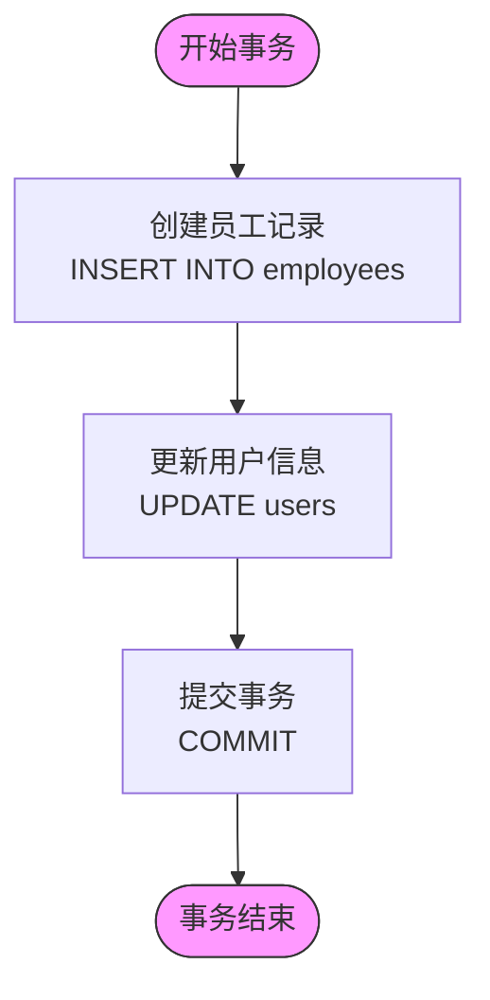

# 集成测试

<cite>
**本文档引用的文件**   
- [employees.test.ts](file://backend/test/employees.test.ts)
- [finance-core.test.ts](file://backend/test/routes/finance-core.test.ts)
- [EmployeeService.ts](file://backend/src/services/EmployeeService.ts)
- [FinanceService.ts](file://backend/src/services/FinanceService.ts)
- [SalaryService.ts](file://backend/src/services/SalaryService.ts)
- [employees.ts](file://backend/src/routes/employees.ts)
- [employee-salaries.ts](file://backend/src/routes/employee-salaries.ts)
- [setup.ts](file://backend/test/setup.ts)
- [schema.ts](file://backend/src/db/schema.ts)
</cite>

## 目录
1. [简介](#简介)
2. [测试环境搭建](#测试环境搭建)
3. [跨服务调用测试](#跨服务调用测试)
4. [事务管理与数据一致性](#事务管理与数据一致性)
5. [边界条件与异常测试](#边界条件与异常测试)
6. [性能考量与优化](#性能考量与优化)
7. [资源清理与测试稳定性](#资源清理与测试稳定性)
8. [结论](#结论)

## 简介
本文档深入探讨了财务系统后端的集成测试策略，重点分析了多个API端点之间的协同工作验证。文档详细说明了如何在`employees.test.ts`和`finance-core.test.ts`中测试跨服务调用，例如员工创建后自动触发薪资配置的流程。同时，文档还涵盖了测试环境的搭建、数据库状态重置、会话管理、服务依赖初始化、事务管理、数据一致性验证、边界条件测试以及性能优化策略，旨在确保测试的稳定性和可靠性。

## 测试环境搭建

集成测试的首要任务是搭建一个稳定、可重复的测试环境。本系统通过`vitest`框架和Cloudflare Workers环境进行测试，利用`setup.ts`文件中的工具函数来初始化数据库并应用模式。

测试环境的搭建过程包括以下几个关键步骤：
1.  **数据库初始化**：在`beforeAll`钩子中，测试首先应用完整的数据库模式（`schema.sql`），确保每次测试运行前数据库结构都是最新的。
2.  **服务依赖注入**：测试通过模拟中间件和直接注入服务实例的方式，将`EmployeeService`、`FinanceService`等核心服务注入到应用实例中，从而绕过复杂的依赖链，实现对特定服务的隔离测试。
3.  **数据预置**：在`beforeEach`钩子中，测试会清理相关数据表（如`employees`、`users`等），然后预置一组已知的初始数据，为每个测试用例提供一个干净、一致的起点。

**Diagram sources**
- [setup.ts](file://backend/test/setup.ts#L20-L27)
- [employees.test.ts](file://backend/test/employees.test.ts#L64-L75)
- [finance-core.test.ts](file://backend/test/routes/finance-core.test.ts#L61-L153)

**Section sources**
- [setup.ts](file://backend/test/setup.ts#L1-L27)
- [employees.test.ts](file://backend/test/employees.test.ts#L1-L195)
- [finance-core.test.ts](file://backend/test/routes/finance-core.test.ts#L1-L312)

## 跨服务调用测试

跨服务调用是系统集成的核心，测试的重点是验证不同服务之间的协同工作是否符合预期。以“员工创建”流程为例，该流程涉及`EmployeeService`和`SalaryService`等多个服务的协同。

### 员工创建与薪资配置流程

当通过`/api/employees`端点创建一名新员工时，系统会触发一系列跨服务调用。前端在创建员工后，会紧接着调用`/api/employee-salaries/batch`端点来配置该员工的薪资。集成测试需要验证这一完整流程。

**Diagram sources**
- [employees.ts](file://backend/src/routes/employees.ts#L93-L161)
- [employee-salaries.ts](file://backend/src/routes/employee-salaries.ts#L158-L214)
- [EmployeeService.ts](file://backend/src/services/EmployeeService.ts#L15-L410)
- [SalaryService.ts](file://backend/src/services/SalaryService.ts#L86-L133)

**Section sources**
- [employees.test.ts](file://backend/test/employees.test.ts#L132-L174)
- [finance-core.test.ts](file://backend/test/routes/finance-core.test.ts#L155-L311)

## 事务管理与数据一致性

在集成测试中，确保数据一致性至关重要。系统通过服务层的事务管理来保证操作的原子性。

### 服务层事务实现

`EmployeeService`和`FinanceService`等服务在执行关键操作时，会使用数据库的事务功能。例如，在`migrateFromUser`方法中，创建员工记录和更新用户信息被包裹在一个事务中，确保这两个操作要么全部成功，要么全部失败。

**Diagram sources**
- [EmployeeService.ts](file://backend/src/services/EmployeeService.ts#L342-L420)
- [FinanceService.ts](file://backend/src/services/FinanceService.ts#L86-L127)

**Section sources**
- [EmployeeService.ts](file://backend/src/services/EmployeeService.ts#L342-L420)
- [FinanceService.ts](file://backend/src/services/FinanceService.ts#L86-L127)

## 边界条件与异常测试

除了验证正常流程，集成测试还必须覆盖各种边界条件和异常情况，以确保系统的健壮性。

### 常见的边界与异常场景

1.  **数据冲突**：测试尝试创建一个已存在的员工或用户，验证系统是否能正确抛出`DUPLICATE`错误。
2.  **关联数据缺失**：测试在创建员工时，传入一个不存在的`orgDepartmentId`或`positionId`，验证系统是否能正确抛出`NOT_FOUND`错误。
3.  **权限验证**：虽然在集成测试中权限常被模拟，但测试应确保在调用需要特定权限的API时，服务层的权限检查逻辑被正确执行。

**Section sources**
- [EmployeeService.ts](file://backend/src/services/EmployeeService.ts#L61-L65)
- [EmployeeService.ts](file://backend/src/services/EmployeeService.ts#L67-L71)
- [employees.ts](file://backend/src/routes/employees.ts#L119-L120)

## 性能考量与优化

集成测试的执行效率直接影响开发和部署的速度。通过优化测试执行顺序和资源管理，可以显著提升测试性能。

### 测试执行顺序优化

-   **并行执行**：`vitest`支持测试用例的并行执行。通过将独立的测试用例（如`GET /api/employees`和`POST /api/flows`）放在不同的`describe`块中，可以充分利用多核CPU，缩短总测试时间。
-   **减少数据库操作**：在`beforeEach`中，只清理测试用例实际需要的表，避免不必要的`DELETE`操作，可以减少数据库I/O开销。

**Section sources**
- [finance-core.test.ts](file://backend/test/routes/finance-core.test.ts#L52-L311)

## 资源清理与测试稳定性

确保每个测试用例结束后资源被正确清理，是维持测试稳定性的关键。

### 资源清理策略

1.  **数据库清理**：在`beforeEach`钩子中，使用`DELETE`语句清除上一个测试用例产生的数据，为下一个测试提供一个干净的数据库状态。
2.  **服务状态重置**：通过`vi.mock`模拟的服务，其内部状态（如调用计数）会在每个测试用例后自动重置。
3.  **避免全局状态污染**：测试应避免修改全局环境变量或产生持久化副作用，所有操作都应在测试数据库中进行。

**Section sources**
- [employees.test.ts](file://backend/test/employees.test.ts#L77-L85)
- [finance-core.test.ts](file://backend/test/routes/finance-core.test.ts#L61-L153)

## 结论
本文档详细阐述了财务系统后端集成测试的各个方面。通过精心设计的测试环境搭建、对跨服务调用的全面验证、严格的事务管理、对边界条件的充分覆盖以及对性能和稳定性的持续优化，可以构建一个强大、可靠的测试套件。这不仅能够有效保障代码质量，还能为系统的持续集成和交付提供坚实的信心。