# 前端编码规范

<cite>
**本文档引用的文件**
- [main.tsx](file://frontend/src/main.tsx)
- [useBusinessData.ts](file://frontend/src/hooks/useBusinessData.ts)
- [useApiQuery.ts](file://frontend/src/utils/useApiQuery.ts)
- [FormModal.tsx](file://frontend/src/components/FormModal.tsx)
- [VirtualTable.tsx](file://frontend/src/components/VirtualTable.tsx)
- [useAppStore.ts](file://frontend/src/store/useAppStore.ts)
- [cache.ts](file://frontend/src/config/cache.ts)
- [variables.css](file://frontend/src/styles/variables.css)
- [components.css](file://frontend/src/styles/components.css)
- [useFormModal.ts](file://frontend/src/hooks/forms/useFormModal.ts)
- [useZodForm.ts](file://frontend/src/hooks/forms/useZodForm.ts)
- [router/index.tsx](file://frontend/src/router/index.tsx)
- [EmployeeForm.tsx](file://frontend/src/features/employees/components/forms/EmployeeForm.tsx)
- [MainLayout.tsx](file://frontend/src/layouts/MainLayout.tsx)
- [api.ts](file://frontend/src/config/api.ts)
- [errorHandler.ts](file://frontend/src/utils/errorHandler.ts)
</cite>

## 目录
1. [项目结构](#项目结构)
2. [函数式组件设计原则](#函数式组件设计原则)
3. [Hooks使用规范](#hooks使用规范)
4. [状态管理策略](#状态管理策略)
5. [样式管理](#样式管理)
6. [UI组件设计规范](#ui组件设计规范)
7. [数据请求与错误处理](#数据请求与错误处理)
8. [表单验证](#表单验证)
9. [响应式布局](#响应式布局)

## 项目结构

本项目采用功能驱动的目录结构，将代码按功能模块组织，提高可维护性和可扩展性。

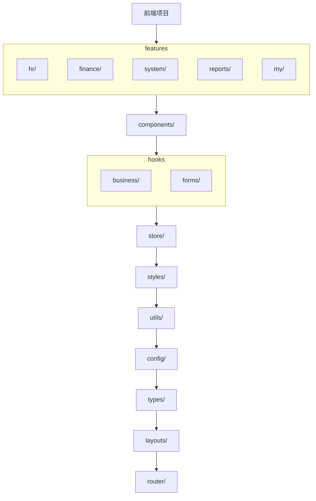

**Diagram sources**
- [router/index.tsx](file://frontend/src/router/index.tsx)
- [main.tsx](file://frontend/src/main.tsx)

**Section sources**
- [router/index.tsx](file://frontend/src/router/index.tsx)
- [main.tsx](file://frontend/src/main.tsx)

## 函数式组件设计原则

函数式组件是本项目的主要构建单元，遵循以下设计原则：

1. **单一职责原则**：每个组件只负责一个特定的功能或UI部分
2. **可复用性**：设计通用组件，通过props实现灵活配置
3. **类型安全**：使用TypeScript接口定义组件props和状态
4. **性能优化**：合理使用React.memo、useCallback和useMemo

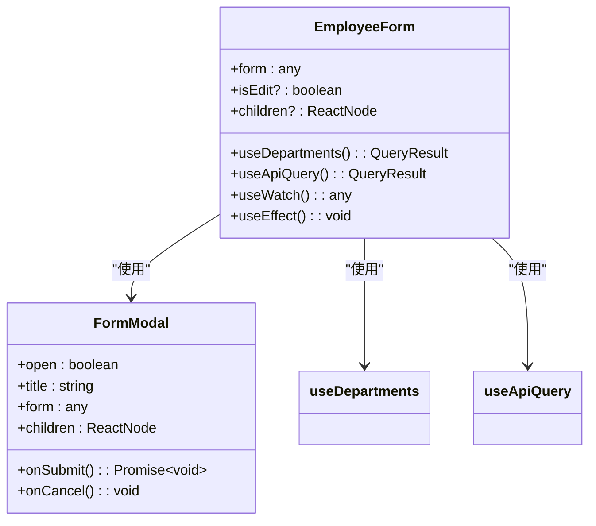

**Diagram sources**
- [EmployeeForm.tsx](file://frontend/src/features/employees/components/forms/EmployeeForm.tsx)
- [FormModal.tsx](file://frontend/src/components/FormModal.tsx)

**Section sources**
- [EmployeeForm.tsx](file://frontend/src/features/employees/components/forms/EmployeeForm.tsx)
- [FormModal.tsx](file://frontend/src/components/FormModal.tsx)

## Hooks使用规范

### 自定义Hook设计原则

自定义Hook遵循以下设计原则：
- 以`use`开头命名
- 封装可复用的逻辑和状态
- 保持单一职责
- 提供清晰的TypeScript类型定义

### useApiQuery规范

`useApiQuery`是数据获取的核心Hook，用于封装React Query的查询逻辑：

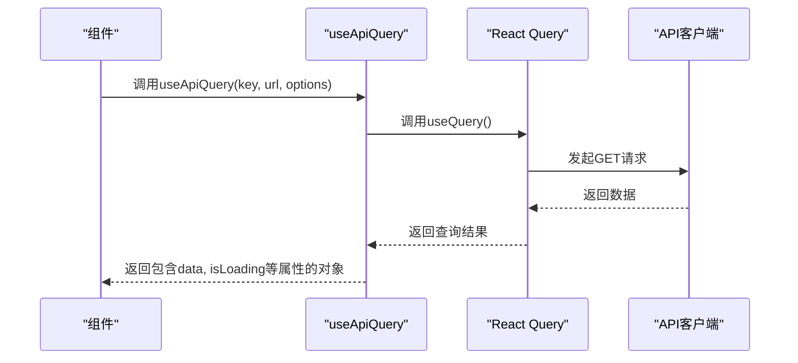

**Diagram sources**
- [useApiQuery.ts](file://frontend/src/utils/useApiQuery.ts)
- [http.ts](file://frontend/src/api/http.ts)

**Section sources**
- [useApiQuery.ts](file://frontend/src/utils/useApiQuery.ts)

### useBusinessData规范

`useBusinessData`系列Hook用于获取业务数据，遵循以下规范：

1. **缓存策略**：根据数据类型设置不同的缓存时间
2. **数据转换**：在select函数中进行数据格式化
3. **依赖管理**：正确设置查询依赖

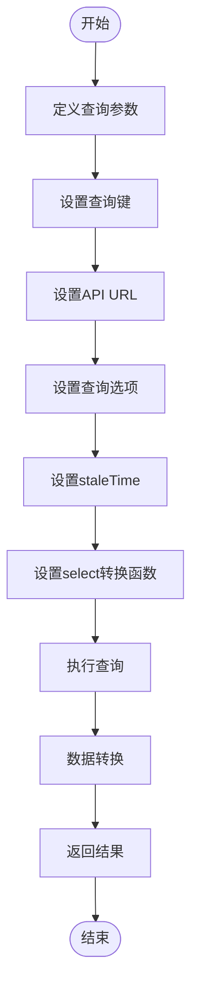

**Diagram sources**
- [useBusinessData.ts](file://frontend/src/hooks/useBusinessData.ts)
- [cache.ts](file://frontend/src/config/cache.ts)

**Section sources**
- [useBusinessData.ts](file://frontend/src/hooks/useBusinessData.ts)

### useFormModal规范

`useFormModal`用于统一管理表单模态框的状态：

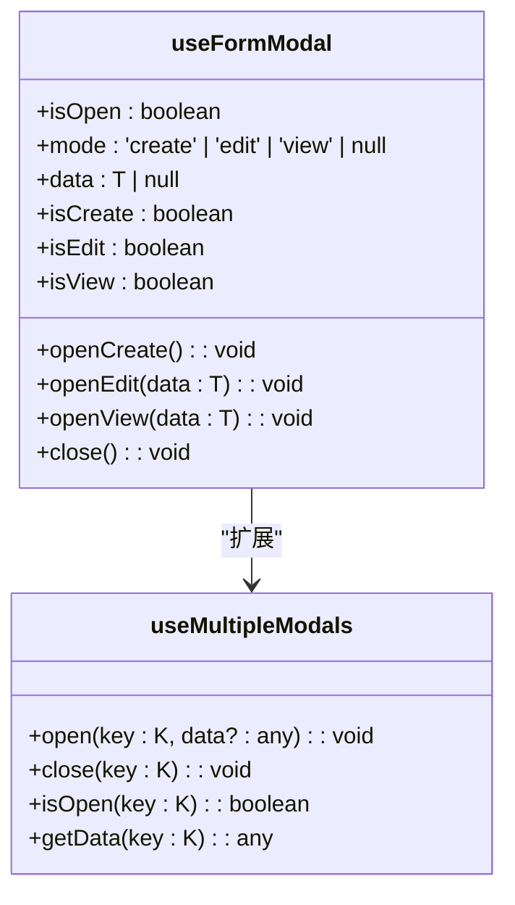

**Diagram sources**
- [useFormModal.ts](file://frontend/src/hooks/forms/useFormModal.ts)

**Section sources**
- [useFormModal.ts](file://frontend/src/hooks/forms/useFormModal.ts)

### useZodForm规范

`useZodForm`结合Ant Design Form和Zod验证：

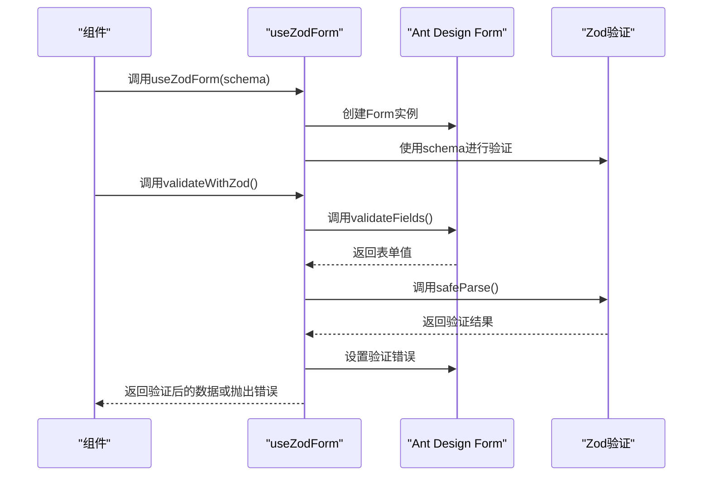

**Diagram sources**
- [useZodForm.ts](file://frontend/src/hooks/forms/useZodForm.ts)

**Section sources**
- [useZodForm.ts](file://frontend/src/hooks/forms/useZodForm.ts)

## 状态管理策略

### Zustand与React Query分工

本项目采用Zustand和React Query的组合状态管理策略，两者分工明确：

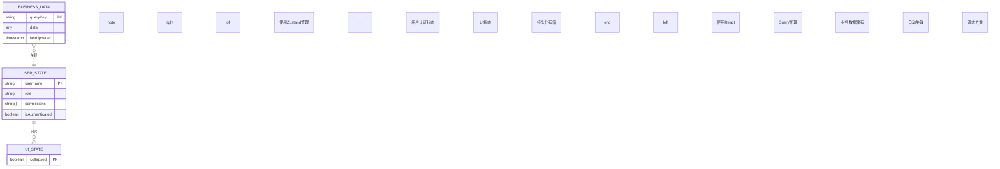

**Diagram sources**
- [useAppStore.ts](file://frontend/src/store/useAppStore.ts)
- [main.tsx](file://frontend/src/main.tsx)

**Section sources**
- [useAppStore.ts](file://frontend/src/store/useAppStore.ts)

### Zustand使用规范

Zustand主要用于管理应用级别的状态：

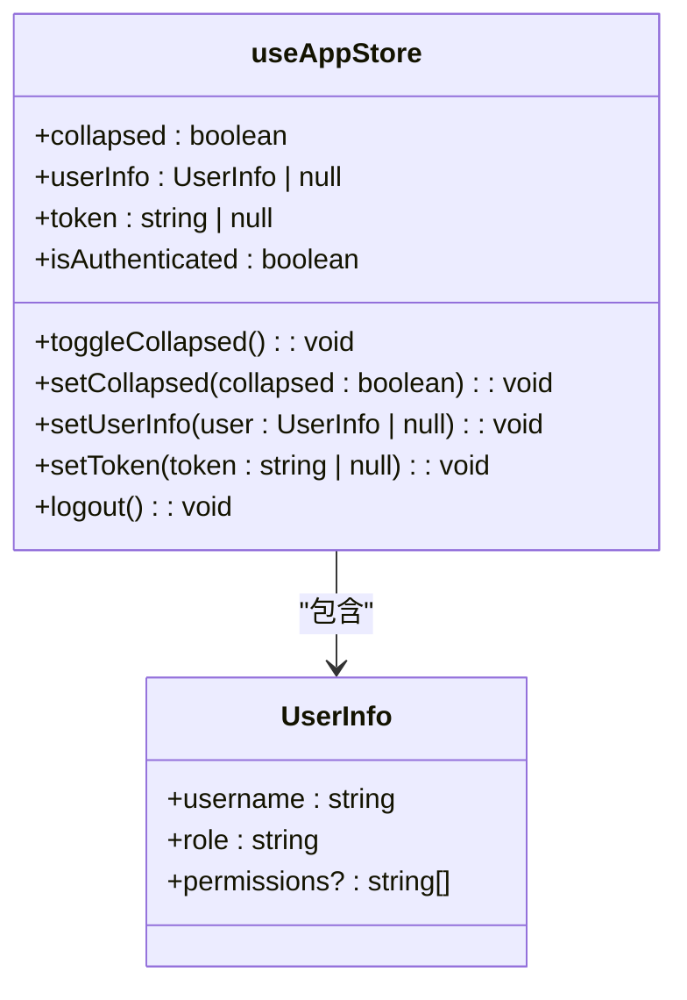

**Diagram sources**
- [useAppStore.ts](file://frontend/src/store/useAppStore.ts)

**Section sources**
- [useAppStore.ts](file://frontend/src/store/useAppStore.ts)

### React Query配置

React Query在应用入口进行全局配置：

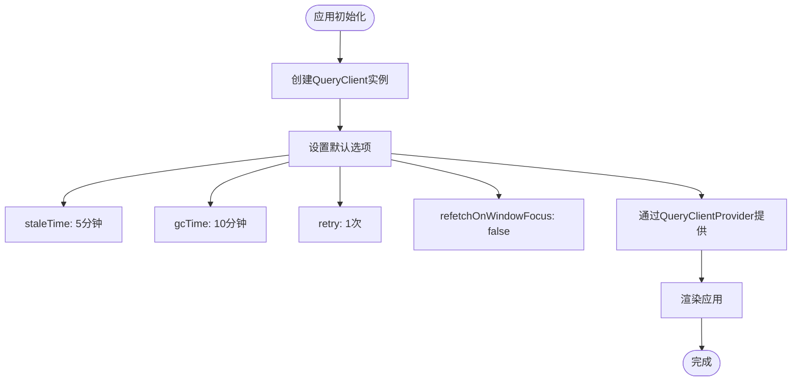

**Diagram sources**
- [main.tsx](file://frontend/src/main.tsx)

**Section sources**
- [main.tsx](file://frontend/src/main.tsx)

## 样式管理

### CSS Modules与变量复用

本项目采用CSS Modules与CSS变量结合的方式进行样式管理：

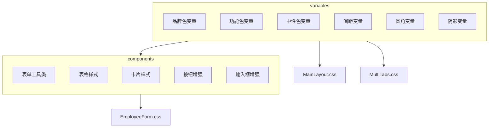

**Diagram sources**
- [variables.css](file://frontend/src/styles/variables.css)
- [components.css](file://frontend/src/styles/components.css)

**Section sources**
- [variables.css](file://frontend/src/styles/variables.css)
- [components.css](file://frontend/src/styles/components.css)

### 样式变量规范

CSS变量定义遵循以下规范：

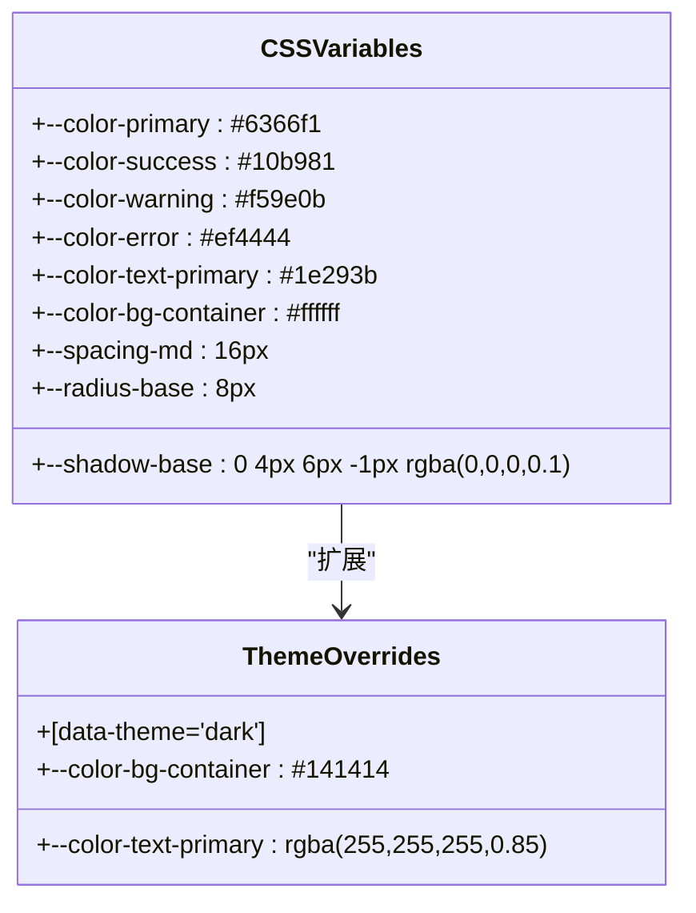

**Diagram sources**
- [variables.css](file://frontend/src/styles/variables.css)

**Section sources**
- [variables.css](file://frontend/src/styles/variables.css)

## UI组件设计规范

### VirtualTable使用规范

`VirtualTable`用于处理大量数据的表格展示：

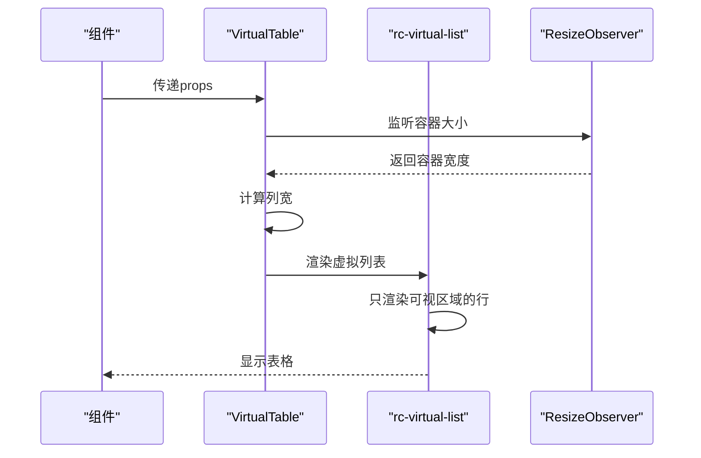

**Diagram sources**
- [VirtualTable.tsx](file://frontend/src/components/VirtualTable.tsx)

**Section sources**
- [VirtualTable.tsx](file://frontend/src/components/VirtualTable.tsx)

### FormModal使用规范

`FormModal`是通用的表单模态框组件：

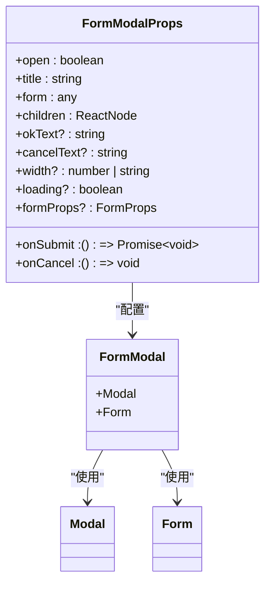

**Diagram sources**
- [FormModal.tsx](file://frontend/src/components/FormModal.tsx)

**Section sources**
- [FormModal.tsx](file://frontend/src/components/FormModal.tsx)

## 数据请求与错误处理

### 数据请求流程

数据请求遵循统一的流程和规范：

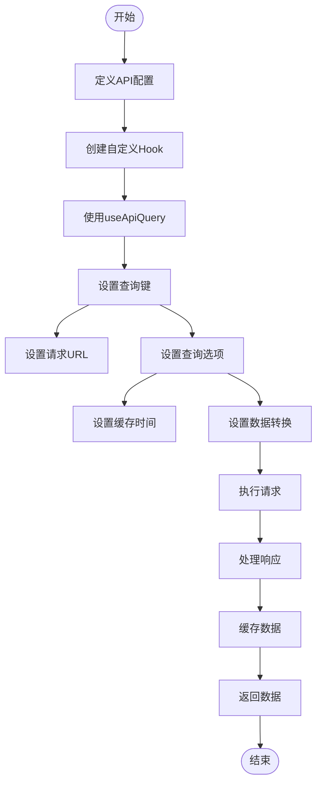

**Diagram sources**
- [api.ts](file://frontend/src/config/api.ts)
- [useApiQuery.ts](file://frontend/src/utils/useApiQuery.ts)

**Section sources**
- [api.ts](file://frontend/src/config/api.ts)
- [useApiQuery.ts](file://frontend/src/utils/useApiQuery.ts)

### 错误处理机制

统一的错误处理机制确保用户体验一致性：

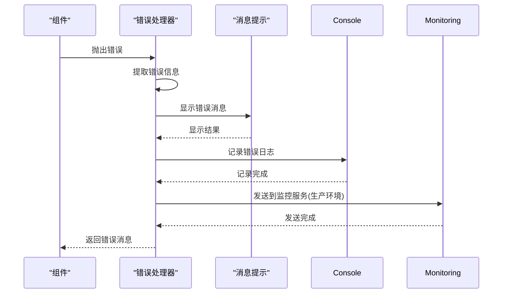

**Diagram sources**
- [errorHandler.ts](file://frontend/src/utils/errorHandler.ts)

**Section sources**
- [errorHandler.ts](file://frontend/src/utils/errorHandler.ts)

## 表单验证

### 表单验证流程

表单验证采用Zod与Ant Design Form结合的方式：

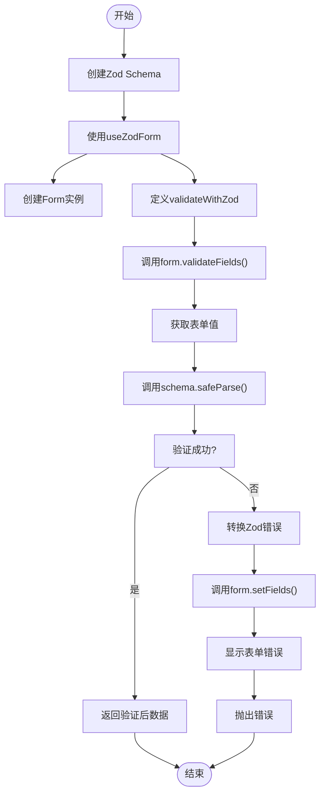

**Diagram sources**
- [useZodForm.ts](file://frontend/src/hooks/forms/useZodForm.ts)

**Section sources**
- [useZodForm.ts](file://frontend/src/hooks/forms/useZodForm.ts)

## 响应式布局

### 响应式布局实现

响应式布局通过多种技术实现：

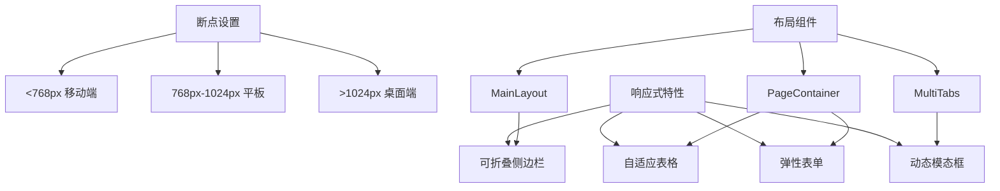

**Diagram sources**
- [MainLayout.tsx](file://frontend/src/layouts/MainLayout.tsx)
- [PageContainer.tsx](file://frontend/src/components/PageContainer.tsx)

**Section sources**
- [MainLayout.tsx](file://frontend/src/layouts/MainLayout.tsx)