# 后端编码规范

<cite>
**本文档引用的文件**
- [index.ts](file://backend/src/index.ts)
- [middleware.ts](file://backend/src/middleware.ts)
- [di.ts](file://backend/src/middleware/di.ts)
- [permission.ts](file://backend/src/middleware/permission.ts)
- [errors.ts](file://backend/src/utils/errors.ts)
- [validation.ts](file://backend/src/utils/validation.ts)
- [permissions.ts](file://backend/src/utils/permissions.ts)
- [logger.ts](file://backend/src/utils/logger.ts)
- [db.ts](file://backend/src/utils/db.ts)
- [auth.ts](file://backend/src/routes/auth.ts)
- [paths.ts](file://backend/src/config/paths.ts)
- [types.ts](file://backend/src/types.ts)
- [sql.ts](file://backend/src/utils/sql.ts)
- [AuthService.ts](file://backend/src/services/AuthService.ts)
</cite>

## 目录
1. [项目架构概述](#项目架构概述)
2. [服务层与路由层职责划分](#服务层与路由层职责划分)
3. [中间件设计模式](#中间件设计模式)
4. [工具函数模块化原则](#工具函数模块化原则)
5. [API响应格式与错误处理](#api响应格式与错误处理)
6. [日志记录规范](#日志记录规范)
7. [Hono框架中的业务实现示例](#hono框架中的业务实现示例)

## 项目架构概述

本项目采用分层架构设计，基于Hono框架构建TypeScript后端服务。系统主要分为路由层、服务层和工具函数层，通过依赖注入和中间件机制实现各层之间的解耦和协作。

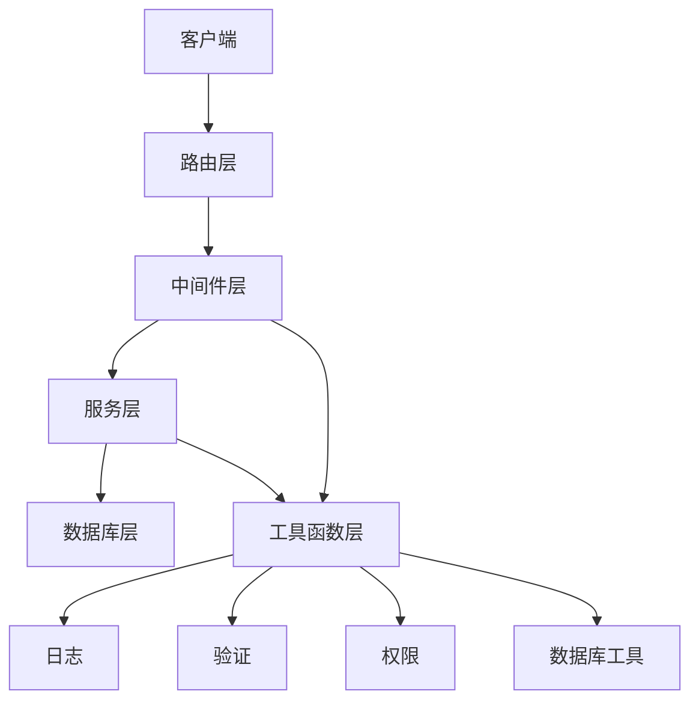
```mermaid
graph TD
A[客户端] --> B[路由层]
B --> C[中间件层]
C --> D[服务层]
D --> E[数据库层]
C --> F[工具函数层]
D --> F
F --> G[日志]
F --> H[验证]
F --> I[权限]
F --> J[数据库工具]
```

**图示来源**
- [index.ts](file://backend/src/index.ts#L43-L136)
- [middleware.ts](file://backend/src/middleware.ts#L11-L72)
- [di.ts](file://backend/src/middleware/di.ts#L25-L75)

**本节来源**
- [index.ts](file://backend/src/index.ts#L1-L137)
- [middleware.ts](file://backend/src/middleware.ts#L1-L82)

## 服务层与路由层职责划分

在本项目中，服务层与路由层有明确的职责划分，遵循单一职责原则。

### 路由层职责

路由层主要负责HTTP请求的接收、路由分发和响应返回。它不包含业务逻辑，仅作为服务层的调用入口。

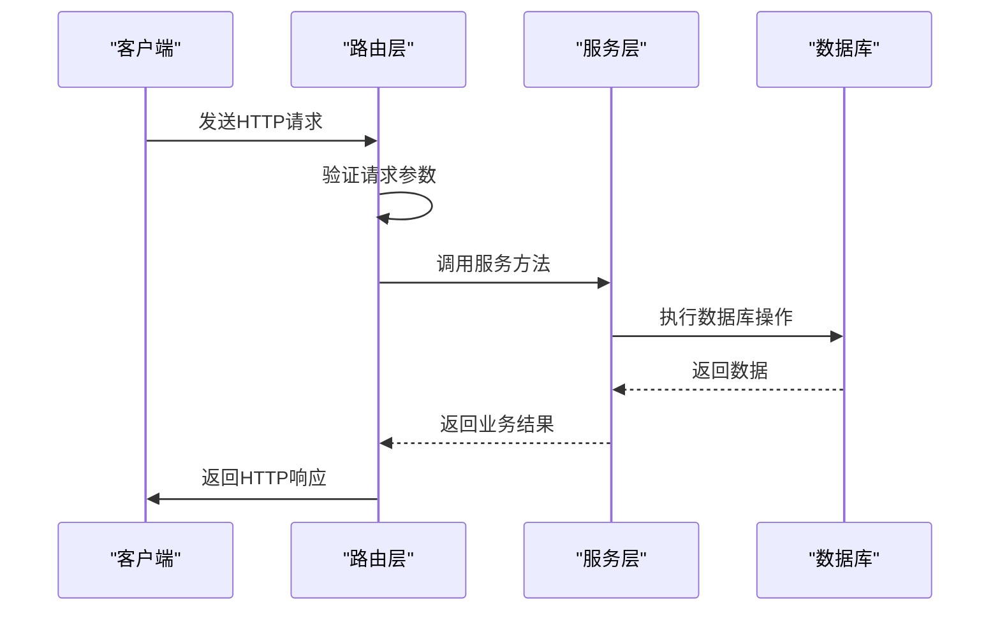
```mermaid
sequenceDiagram
participant Client as "客户端"
participant Route as "路由层"
participant Service as "服务层"
participant DB as "数据库"
Client->>Route : 发送HTTP请求
Route->>Route : 验证请求参数
Route->>Service : 调用服务方法
Service->>DB : 执行数据库操作
DB-->>Service : 返回数据
Service-->>Route : 返回业务结果
Route->>Client : 返回HTTP响应
```

**图示来源**
- [auth.ts](file://backend/src/routes/auth.ts#L12-L417)
- [AuthService.ts](file://backend/src/services/AuthService.ts#L16-L305)

### 服务层职责

服务层封装了核心业务逻辑，负责处理具体的业务规则和数据操作。它不直接处理HTTP请求，而是提供可重用的业务方法。

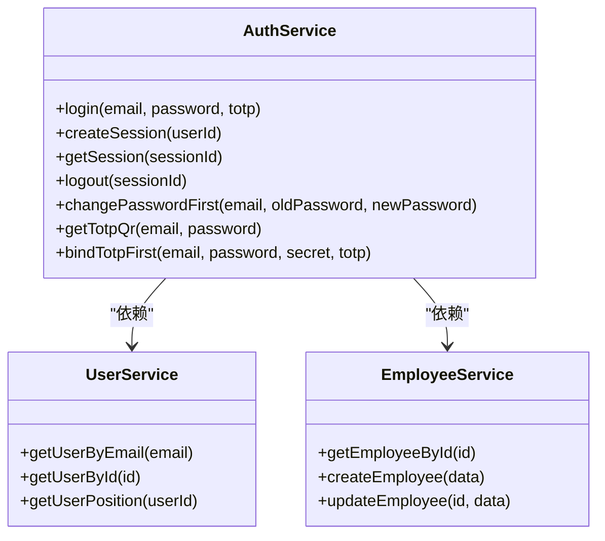
```mermaid
classDiagram
class AuthService {
+login(email, password, totp)
+createSession(userId)
+getSession(sessionId)
+logout(sessionId)
+changePasswordFirst(email, oldPassword, newPassword)
+getTotpQr(email, password)
+bindTotpFirst(email, password, secret, totp)
}
class UserService {
+getUserByEmail(email)
+getUserById(id)
+getUserPosition(userId)
}
class EmployeeService {
+getEmployeeById(id)
+createEmployee(data)
+updateEmployee(id, data)
}
AuthService --> UserService : "依赖"
AuthService --> EmployeeService : "依赖"
```

**图示来源**
- [AuthService.ts](file://backend/src/services/AuthService.ts#L16-L305)
- [UserService.ts](file://backend/src/services/UserService.ts)
- [EmployeeService.ts](file://backend/src/services/EmployeeService.ts)

**本节来源**
- [auth.ts](file://backend/src/routes/auth.ts#L12-L417)
- [AuthService.ts](file://backend/src/services/AuthService.ts#L16-L305)

## 中间件设计模式

本项目采用多种中间件设计模式来实现横切关注点的处理，包括认证、权限校验和依赖注入。

### 认证中间件

认证中间件负责用户身份验证，通过JWT和数据库session组合的方式校验用户身份，并将用户信息写入context以降低后续查询开销。

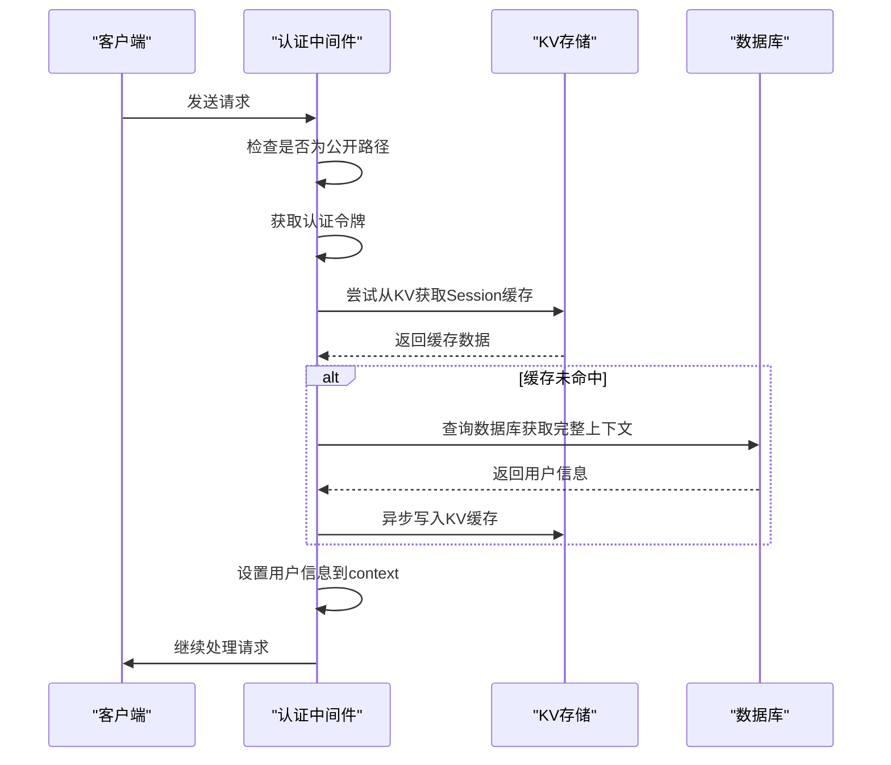
```mermaid
sequenceDiagram
participant Client as "客户端"
participant Auth as "认证中间件"
participant KV as "KV存储"
participant DB as "数据库"
Client->>Auth : 发送请求
Auth->>Auth : 检查是否为公开路径
Auth->>Auth : 获取认证令牌
Auth->>KV : 尝试从KV获取Session缓存
KV-->>Auth : 返回缓存数据
alt 缓存未命中
Auth->>DB : 查询数据库获取完整上下文
DB-->>Auth : 返回用户信息
Auth->>KV : 异步写入KV缓存
end
Auth->>Auth : 设置用户信息到context
Auth->>Client : 继续处理请求
```

**图示来源**
- [middleware.ts](file://backend/src/middleware.ts#L11-L72)
- [di.ts](file://backend/src/middleware/di.ts#L25-L75)

### 权限校验中间件

权限校验中间件基于职位权限系统，检查用户是否有访问特定资源的权限。

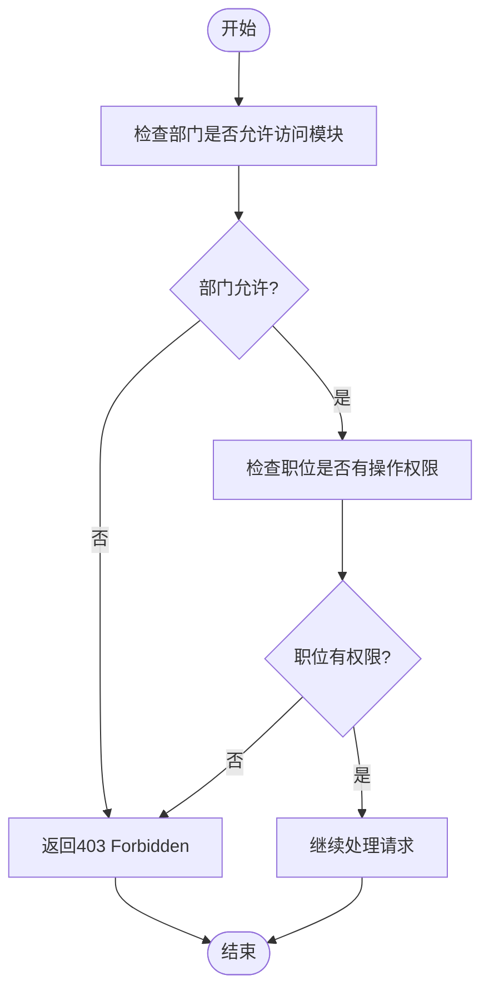
```mermaid
flowchart TD
Start([开始]) --> CheckDepartment["检查部门是否允许访问模块"]
CheckDepartment --> DepartmentValid{"部门允许?"}
DepartmentValid --> |否| ReturnForbidden["返回403 Forbidden"]
DepartmentValid --> |是| CheckPosition["检查职位是否有操作权限"]
CheckPosition --> PositionValid{"职位有权限?"}
PositionValid --> |否| ReturnForbidden
PositionValid --> |是| Continue["继续处理请求"]
ReturnForbidden --> End([结束])
Continue --> End
```

**图示来源**
- [permission.ts](file://backend/src/middleware/permission.ts#L12-L38)
- [permissions.ts](file://backend/src/utils/permissions.ts#L88-L114)

### 依赖注入中间件

依赖注入中间件负责创建和注入服务实例，实现控制反转。

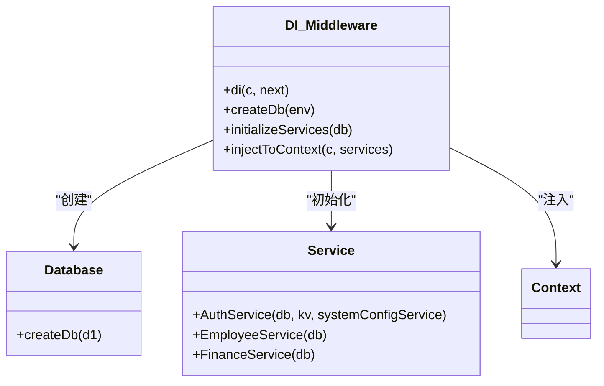
```mermaid
classDiagram
class DI_Middleware {
+di(c, next)
+createDb(env)
+initializeServices(db)
+injectToContext(c, services)
}
class Database {
+createDb(d1)
}
class Service {
+AuthService(db, kv, systemConfigService)
+EmployeeService(db)
+FinanceService(db)
}
DI_Middleware --> Database : "创建"
DI_Middleware --> Service : "初始化"
DI_Middleware --> Context : "注入"
```

**图示来源**
- [di.ts](file://backend/src/middleware/di.ts#L25-L75)
- [types.ts](file://backend/src/types.ts#L20-L61)

**本节来源**
- [middleware.ts](file://backend/src/middleware.ts#L11-L72)
- [di.ts](file://backend/src/middleware/di.ts#L1-L76)
- [permission.ts](file://backend/src/middleware/permission.ts#L12-L38)

## 工具函数模块化原则

本项目将工具函数按功能模块化，每个模块负责特定的功能，便于维护和复用。

### 验证模块

验证模块负责数据验证，包括IP地址验证等。

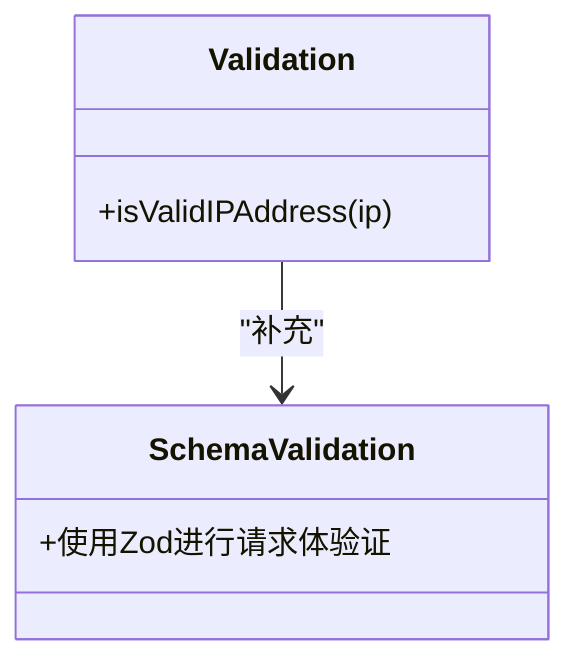
```mermaid
classDiagram
class Validation {
+isValidIPAddress(ip)
}
class SchemaValidation {
+使用Zod进行请求体验证
}
Validation --> SchemaValidation : "补充"
```

**图示来源**
- [validation.ts](file://backend/src/utils/validation.ts#L1-L21)
- [business.schema.ts](file://backend/src/schemas/business.schema.ts)

### 权限模块

权限模块提供权限检查的辅助函数，支持细粒度的权限控制。

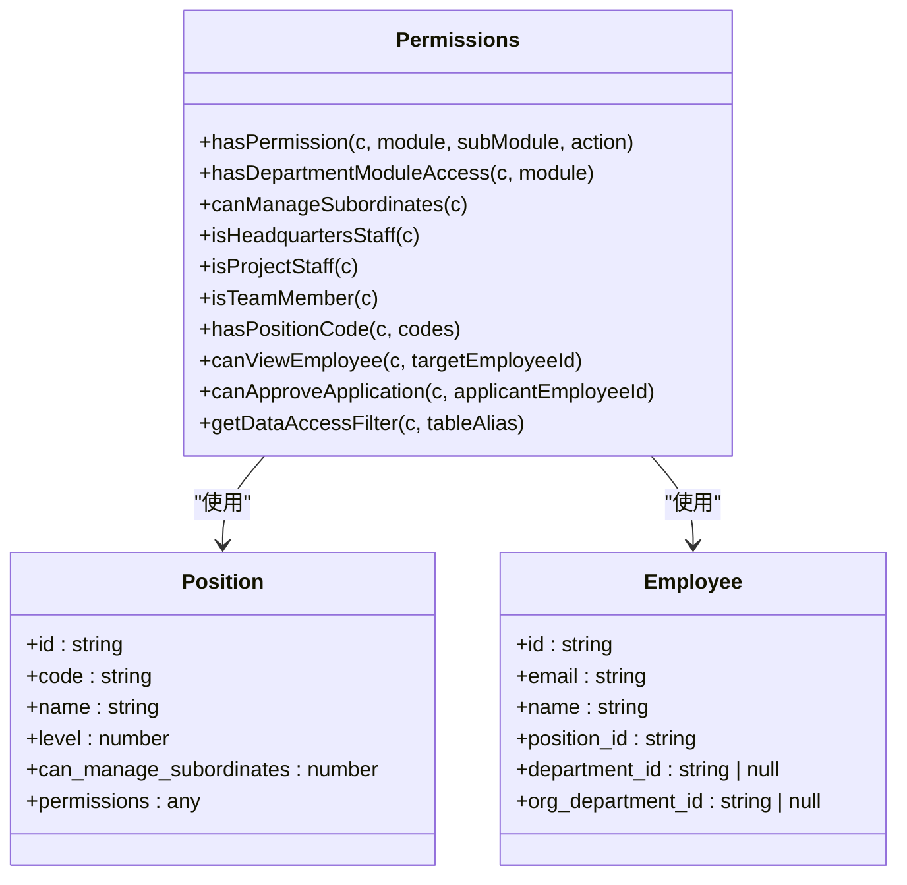
```mermaid
classDiagram
class Permissions {
+hasPermission(c, module, subModule, action)
+hasDepartmentModuleAccess(c, module)
+canManageSubordinates(c)
+isHeadquartersStaff(c)
+isProjectStaff(c)
+isTeamMember(c)
+hasPositionCode(c, codes)
+canViewEmployee(c, targetEmployeeId)
+canApproveApplication(c, applicantEmployeeId)
+getDataAccessFilter(c, tableAlias)
}
class Position {
+id : string
+code : string
+name : string
+level : number
+can_manage_subordinates : number
+permissions : any
}
class Employee {
+id : string
+email : string
+name : string
+position_id : string
+department_id : string | null
+org_department_id : string | null
}
Permissions --> Position : "使用"
Permissions --> Employee : "使用"
```

**图示来源**
- [permissions.ts](file://backend/src/utils/permissions.ts#L9-L330)

### 日志模块

日志模块提供结构化日志输出，支持不同日志级别。

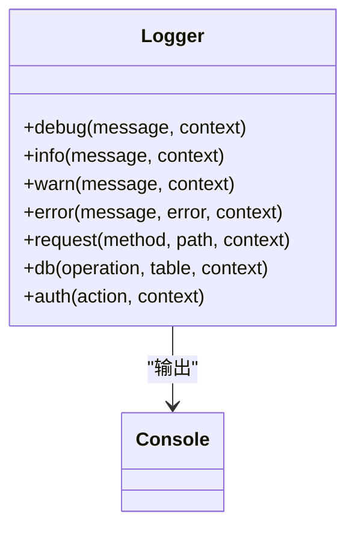
```mermaid
classDiagram
class Logger {
+debug(message, context)
+info(message, context)
+warn(message, context)
+error(message, error, context)
+request(method, path, context)
+db(operation, table, context)
+auth(action, context)
}
Logger --> Console : "输出"
```

**图示来源**
- [logger.ts](file://backend/src/utils/logger.ts#L35-L83)

### 数据库工具模块

数据库工具模块提供数据库操作的辅助函数。

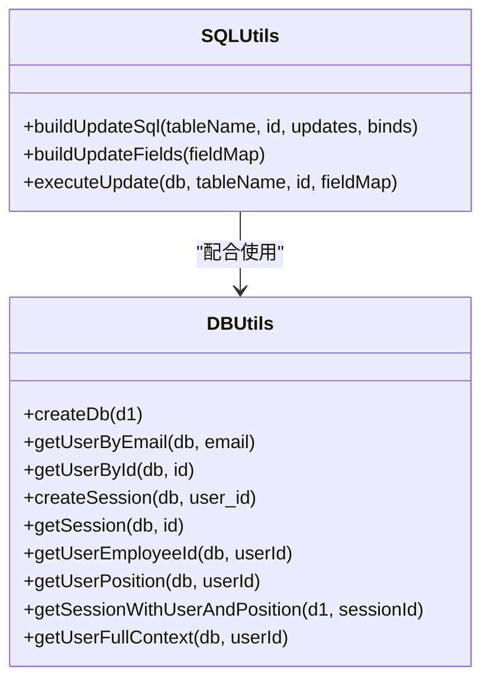
```mermaid
classDiagram
class SQLUtils {
+buildUpdateSql(tableName, id, updates, binds)
+buildUpdateFields(fieldMap)
+executeUpdate(db, tableName, id, fieldMap)
}
class DBUtils {
+createDb(d1)
+getUserByEmail(db, email)
+getUserById(db, id)
+createSession(db, user_id)
+getSession(db, id)
+getUserEmployeeId(db, userId)
+getUserPosition(db, userId)
+getSessionWithUserAndPosition(d1, sessionId)
+getUserFullContext(db, userId)
}
SQLUtils --> DBUtils : "配合使用"
```

**图示来源**
- [sql.ts](file://backend/src/utils/sql.ts#L16-L75)
- [db.ts](file://backend/src/utils/db.ts#L9-L314)

**本节来源**
- [validation.ts](file://backend/src/utils/validation.ts#L1-L21)
- [permissions.ts](file://backend/src/utils/permissions.ts#L9-L330)
- [logger.ts](file://backend/src/utils/logger.ts#L35-L83)
- [sql.ts](file://backend/src/utils/sql.ts#L16-L75)
- [db.ts](file://backend/src/utils/db.ts#L9-L314)

## API响应格式与错误处理

本项目采用统一的API响应格式和错误处理机制，确保API的一致性和可预测性。

### 统一响应格式

所有API响应都遵循统一的格式，便于前端处理。

```mermaid
classDiagram
class SuccessResponse {
+ok : boolean
+token? : string
+expiresIn? : number
+user? : object
+mustChangePassword? : boolean
+needTotp? : boolean
+needBindTotp? : boolean
+message? : string
}
class ErrorResponse {
+error : string
+code : string
+details? : any
}
class ValidationError {
+error : '验证失败'
+code : 'VALIDATION_ERROR'
+details : { errors : Array<{ path : string, message : string, code : string }> }
}
SuccessResponse <|-- Response
ErrorResponse <|-- Response
ValidationError <|-- ErrorResponse
```

**图示来源**
- [auth.ts](file://backend/src/routes/auth.ts#L140-L151)
- [errors.ts](file://backend/src/utils/errors.ts#L81-L101)

### 错误处理机制

错误处理机制通过全局错误处理中间件实现，能够处理不同类型的错误并返回适当的响应。

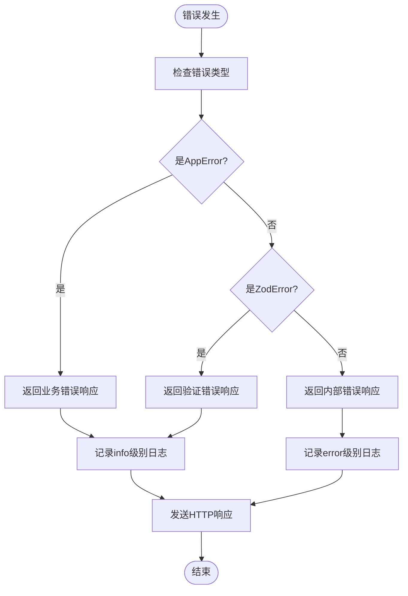
```mermaid
flowchart TD
Start([错误发生]) --> CheckType["检查错误类型"]
CheckType --> IsAppError{"是AppError?"}
IsAppError --> |是| HandleAppError["返回业务错误响应"]
IsAppError --> |否| IsZodError{"是ZodError?"}
IsZodError --> |是| HandleValidationError["返回验证错误响应"]
IsZodError --> |否| HandleUnexpectedError["返回内部错误响应"]
HandleAppError --> LogInfo["记录info级别日志"]
HandleValidationError --> LogInfo
HandleUnexpectedError --> LogError["记录error级别日志"]
LogInfo --> SendResponse["发送HTTP响应"]
LogError --> SendResponse
SendResponse --> End([结束])
```

**图示来源**
- [errors.ts](file://backend/src/utils/errors.ts#L61-L112)

**本节来源**
- [errors.ts](file://backend/src/utils/errors.ts#L1-L114)
- [auth.ts](file://backend/src/routes/auth.ts#L140-L151)

## 日志记录规范

日志记录遵循结构化原则，包含必要的上下文信息，便于问题排查和系统监控。

### 日志级别

日志分为四个级别：debug、info、warn、error，生产环境默认为info级别。

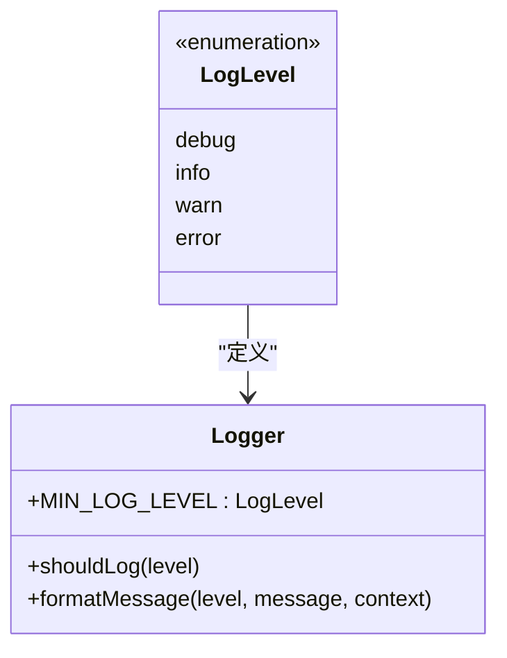
```mermaid
classDiagram
class LogLevel {
<<enumeration>>
debug
info
warn
error
}
class Logger {
+MIN_LOG_LEVEL : LogLevel
+shouldLog(level)
+formatMessage(level, message, context)
}
LogLevel --> Logger : "定义"
```

**图示来源**
- [logger.ts](file://backend/src/utils/logger.ts#L6-L23)

### 日志内容

日志内容包含时间戳、日志级别、消息和上下文信息，确保日志的可读性和可追溯性。

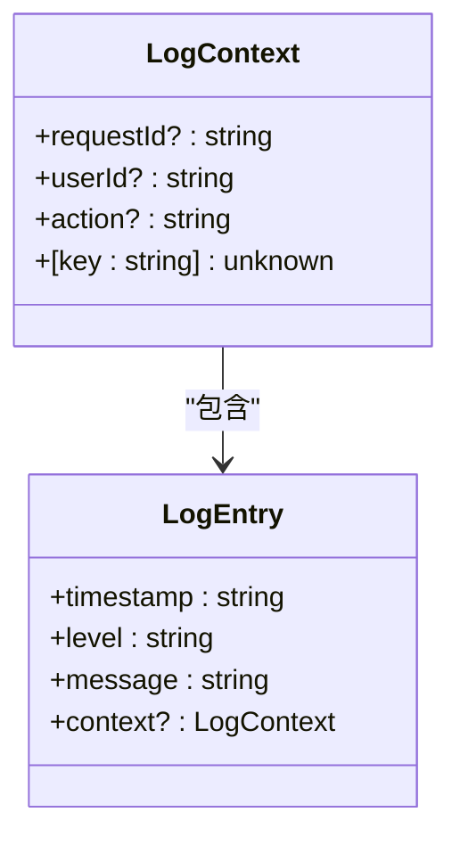
```mermaid
classDiagram
class LogContext {
+requestId? : string
+userId? : string
+action? : string
+[key : string] : unknown
}
class LogEntry {
+timestamp : string
+level : string
+message : string
+context? : LogContext
}
LogContext --> LogEntry : "包含"
```

**图示来源**
- [logger.ts](file://backend/src/utils/logger.ts#L8-L13)

**本节来源**
- [logger.ts](file://backend/src/utils/logger.ts#L1-L84)

## Hono框架中的业务实现示例

以下示例展示如何在Hono框架中正确实现业务逻辑、数据校验与权限控制。

### 认证流程实现

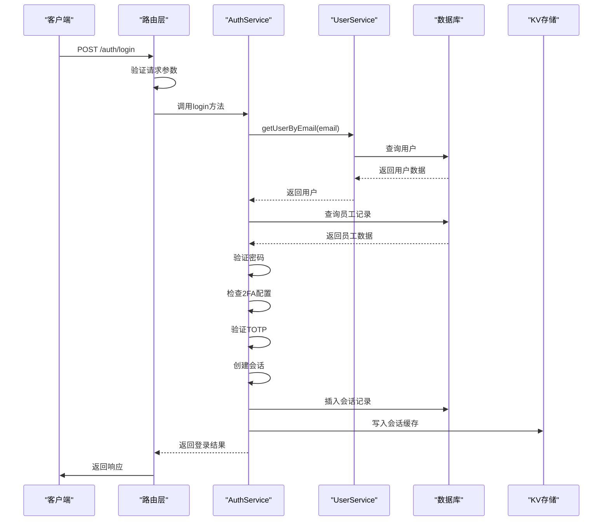
```mermaid
sequenceDiagram
participant Client as "客户端"
participant Route as "路由层"
participant Auth as "AuthService"
participant User as "UserService"
participant DB as "数据库"
participant KV as "KV存储"
Client->>Route : POST /auth/login
Route->>Route : 验证请求参数
Route->>Auth : 调用login方法
Auth->>User : getUserByEmail(email)
User->>DB : 查询用户
DB-->>User : 返回用户数据
User-->>Auth : 返回用户
Auth->>DB : 查询员工记录
DB-->>Auth : 返回员工数据
Auth->>Auth : 验证密码
Auth->>Auth : 检查2FA配置
Auth->>Auth : 验证TOTP
Auth->>Auth : 创建会话
Auth->>DB : 插入会话记录
Auth->>KV : 写入会话缓存
Auth-->>Route : 返回登录结果
Route->>Client : 返回响应
```

**图示来源**
- [auth.ts](file://backend/src/routes/auth.ts#L58-L121)
- [AuthService.ts](file://backend/src/services/AuthService.ts#L29-L131)

### 权限控制实现

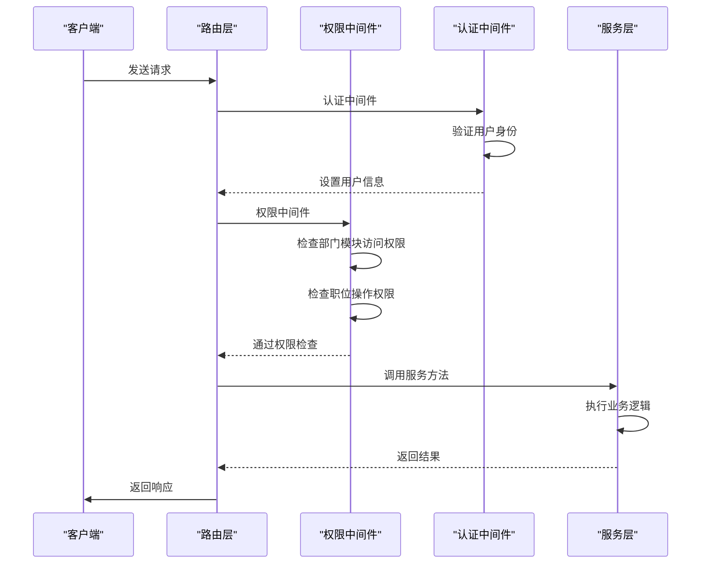
```mermaid
sequenceDiagram
participant Client as "客户端"
participant Route as "路由层"
participant Permission as "权限中间件"
participant Auth as "认证中间件"
participant Service as "服务层"
Client->>Route : 发送请求
Route->>Auth : 认证中间件
Auth->>Auth : 验证用户身份
Auth-->>Route : 设置用户信息
Route->>Permission : 权限中间件
Permission->>Permission : 检查部门模块访问权限
Permission->>Permission : 检查职位操作权限
Permission-->>Route : 通过权限检查
Route->>Service : 调用服务方法
Service->>Service : 执行业务逻辑
Service-->>Route : 返回结果
Route->>Client : 返回响应
```

**图示来源**
- [index.ts](file://backend/src/index.ts#L89-L90)
- [permission.ts](file://backend/src/middleware/permission.ts#L12-L18)
- [middleware.ts](file://backend/src/middleware.ts#L11-L72)

**本节来源**
- [auth.ts](file://backend/src/routes/auth.ts#L12-L417)
- [AuthService.ts](file://backend/src/services/AuthService.ts#L16-L305)
- [permission.ts](file://backend/src/middleware/permission.ts#L12-L38)
- [middleware.ts](file://backend/src/middleware.ts#L11-L72)