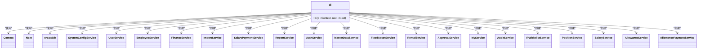

# 编码规范

<cite>
**本文档引用的文件**
- [useBusinessData.ts](file://frontend/src/hooks/useBusinessData.ts)
- [useApiQuery.ts](file://frontend/src/utils/useApiQuery.ts)
- [useEmployees.ts](file://frontend/src/hooks/business/useEmployees.ts)
- [useDepartments.ts](file://frontend/src/hooks/business/useDepartments.ts)
- [api.ts](file://frontend/src/config/api.ts)
- [di.ts](file://backend/src/middleware/di.ts)
- [permission.ts](file://backend/src/middleware/permission.ts)
- [permissions.ts](file://backend/src/utils/permissions.ts)
- [logger.ts](file://backend/src/utils/logger.ts)
- [validation.ts](file://backend/src/utils/validation.ts)
- [business.ts](file://frontend/src/types/business.ts)
- [PageContainer.tsx](file://frontend/src/components/PageContainer.tsx)
- [useZodForm.ts](file://frontend/src/hooks/forms/useZodForm.ts)
</cite>

## 目录
1. [简介](#简介)
2. [项目结构](#项目结构)
3. [核心组件](#核心组件)
4. [架构概述](#架构概述)
5. [详细组件分析](#详细组件分析)
6. [依赖分析](#依赖分析)
7. [性能考虑](#性能考虑)
8. [故障排除指南](#故障排除指南)
9. [结论](#结论)
10. [附录](#附录)（如有必要）

## 简介
本文档旨在为财务主项目制定统一的TypeScript和React编码规范。文档详细说明了前端组件设计原则、目录组织约定、命名规范，以及后端服务层与中间件的编码模式。通过分析项目代码库，我们制定了前后端共用的工具函数设计原则，并提供了实际代码示例来展示如何正确使用自定义Hook进行数据获取与状态同步。

## 项目结构
项目采用前后端分离的架构，前端使用React和TypeScript构建，后端使用Hono框架。前端代码组织遵循功能模块化原则，将代码分为features、hooks、components等目录。后端代码采用服务层架构，通过依赖注入实现各服务间的解耦。

```mermaid
graph TB
subgraph "前端"
F[frontend]
F --> features
F --> hooks
F --> components
F --> utils
F --> types
end
subgraph "后端"
B[backend]
B --> services
B --> middleware
B --> routes
B --> utils
B --> db
end
F < --> B
```

**Diagram sources**
- [frontend/src](file://frontend/src)
- [backend/src](file://backend/src)

**Section sources**
- [frontend](file://frontend)
- [backend](file://backend)

## 核心组件
本项目的核心组件包括前端的数据获取Hook、状态管理、UI组件，以及后端的服务层、中间件和数据库访问层。这些组件通过清晰的接口和约定进行交互，确保了系统的可维护性和可扩展性。

**Section sources**
- [frontend/src/hooks](file://frontend/src/hooks)
- [backend/src/services](file://backend/src/services)

## 架构概述
系统采用现代化的前后端分离架构，前端使用React函数式组件和Hooks进行UI构建和状态管理，后端使用Hono框架提供RESTful API服务。前后端通过HTTP API进行通信，数据格式采用JSON。


**Diagram sources**
- [frontend/src](file://frontend/src)
- [backend/src](file://backend/src)

## 详细组件分析
本节将深入分析项目中的关键组件，包括前端Hook、后端中间件和服务层，以及它们之间的交互方式。

### 前端Hook分析
前端使用React Query作为数据获取和缓存的解决方案，通过自定义Hook封装业务逻辑，提高代码的复用性和可维护性。

#### useApiQuery Hook
```mermaid
classDiagram
class useApiQuery {
+useApiQuery<T>(key : any, url : string, options? : { enabled? : boolean, staleTime? : number, refetchInterval? : number, select? : (data : any) => any })
+useApiMutation<TData, TVariables>(onSuccessCallback? : (data : TData) => void)
+useReportQuery<T>(reportName : string, url : string, params? : Record<string, any>)
}
useApiQuery --> "1" useQuery : "使用"
useApiQuery --> "1" useMutation : "使用"
useApiQuery --> "1" useQueryClient : "使用"
```

**Diagram sources**
- [frontend/src/utils/useApiQuery.ts](file://frontend/src/utils/useApiQuery.ts#L1-L94)

**Section sources**
- [frontend/src/utils/useApiQuery.ts](file://frontend/src/utils/useApiQuery.ts#L1-L94)

#### useBusinessData Hook


**Diagram sources**
- [frontend/src/hooks/useBusinessData.ts](file://frontend/src/hooks/useBusinessData.ts#L1-L132)

**Section sources**
- [frontend/src/hooks/useBusinessData.ts](file://frontend/src/hooks/useBusinessData.ts#L1-L132)

### 后端中间件分析
后端使用中间件模式实现横切关注点的处理，如依赖注入、权限校验等。

#### 依赖注入中间件


**Diagram sources**
- [backend/src/middleware/di.ts](file://backend/src/middleware/di.ts#L1-L76)

**Section sources**
- [backend/src/middleware/di.ts](file://backend/src/middleware/di.ts#L1-L76)

#### 权限校验中间件


**Diagram sources**
- [backend/src/middleware/permission.ts](file://backend/src/middleware/permission.ts#L1-L39)

**Section sources**
- [backend/src/middleware/permission.ts](file://backend/src/middleware/permission.ts#L1-L39)

### 工具函数分析
项目中的工具函数设计遵循单一职责原则，每个函数只负责一个特定的功能。

#### 权限工具函数


**Diagram sources**
- [backend/src/utils/permissions.ts](file://backend/src/utils/permissions.ts#L1-L330)

**Section sources**
- [backend/src/utils/permissions.ts](file://backend/src/utils/permissions.ts#L1-L330)

#### 日志工具函数


**Diagram sources**
- [backend/src/utils/logger.ts](file://backend/src/utils/logger.ts#L1-L84)

**Section sources**
- [backend/src/utils/logger.ts](file://backend/src/utils/logger.ts#L1-L84)

#### 验证工具函数


**Diagram sources**
- [backend/src/utils/validation.ts](file://backend/src/utils/validation.ts#L1-L21)

**Section sources**
- [backend/src/utils/validation.ts](file://backend/src/utils/validation.ts#L1-L21)

## 依赖分析
项目依赖关系清晰，前端和后端各自管理自己的依赖，通过API进行通信。后端服务层通过依赖注入实现解耦，提高了代码的可测试性和可维护性。

```mermaid
graph TD
subgraph "前端依赖"
A[React] --> B[Ant Design]
B --> C[React Router]
C --> D[TanStack Query]
D --> E[Zod]
end
subgraph "后端依赖"
F[Hono] --> G[Drizzle ORM]
G --> H[Cloudflare Workers]
end
A < --> F
```

**Diagram sources**
- [frontend/package.json](file://frontend/package.json)
- [backend/package.json](file://backend/package.json)

**Section sources**
- [frontend/package.json](file://frontend/package.json)
- [backend/package.json](file://backend/package.json)

## 性能考虑
项目在性能方面做了多项优化，包括数据缓存、懒加载、代码分割等。前端使用React Query进行数据缓存，减少不必要的API调用。后端通过数据库索引和查询优化提高数据访问性能。

## 故障排除指南
当遇到问题时，首先检查日志输出，使用统一的日志系统可以帮助快速定位问题。对于权限相关的问题，检查用户角色和权限配置。对于数据获取问题，检查API端点和网络连接。

**Section sources**
- [backend/src/utils/logger.ts](file://backend/src/utils/logger.ts#L1-L84)
- [backend/src/middleware/permission.ts](file://backend/src/middleware/permission.ts#L1-L39)

## 结论
本文档详细说明了项目的编码规范，包括前端组件设计原则、目录组织约定、命名规范，以及后端服务层与中间件的编码模式。通过遵循这些规范，可以确保代码的一致性和可维护性，提高开发效率。

## 附录
### 前端命名规范
- 函数式组件：PascalCase（如PageContainer）
- Hook：use前缀+PascalCase（如useApiQuery）
- 变量：camelCase
- 常量：UPPER_CASE

### 后端命名规范
- 服务类：PascalCase+Service（如EmployeeService）
- 中间件：camelCase（如di）
- 工具函数：camelCase（如hasPermission）

**Section sources**
- [frontend/src/components/PageContainer.tsx](file://frontend/src/components/PageContainer.tsx#L1-L59)
- [frontend/src/hooks/useApiQuery.ts](file://frontend/src/utils/useApiQuery.ts#L1-L94)
- [backend/src/services/EmployeeService.ts](file://backend/src/services/EmployeeService.ts)
- [backend/src/middleware/di.ts](file://backend/src/middleware/di.ts#L1-L76)
- [backend/src/utils/permissions.ts](file://backend/src/utils/permissions.ts#L1-L330)