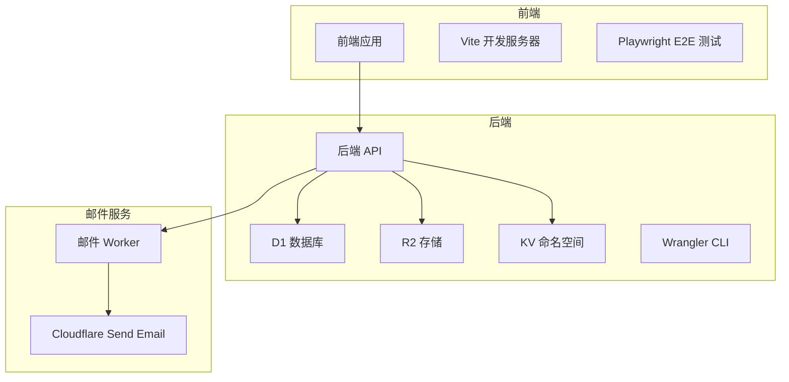
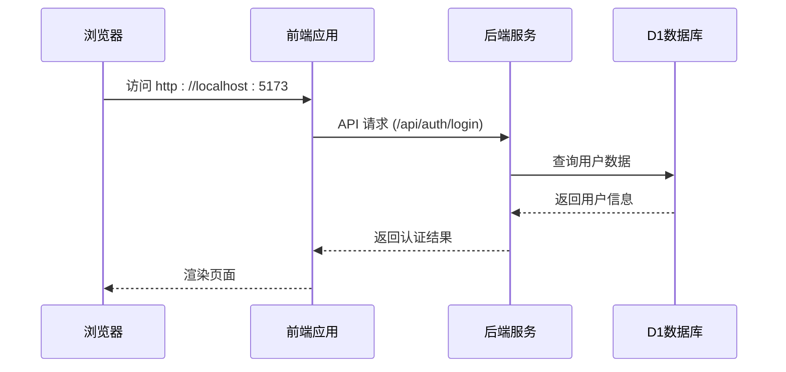

# 快速入门

<cite>
**本文档中引用的文件**  
- [backend/package.json](file://backend/package.json)
- [frontend/package.json](file://frontend/package.json)
- [backend/wrangler.toml](file://backend/wrangler.toml)
- [frontend/vite.config.ts](file://frontend/vite.config.ts)
- [backend/vitest.config.ts](file://backend/vitest.config.ts)
- [frontend/playwright.config.ts](file://frontend/playwright.config.ts)
- [frontend/README.md](file://frontend/README.md)
- [backend/drizzle.config.ts](file://backend/drizzle.config.ts)
- [frontend/src/config/api.ts](file://frontend/src/config/api.ts)
- [backend/src/config/paths.ts](file://backend/src/config/paths.ts)
</cite>

## 目录
1. [简介](#简介)
2. [项目结构](#项目结构)
3. [克隆仓库与初始化](#克隆仓库与初始化)
4. [依赖安装](#依赖安装)
5. [开发环境配置](#开发环境配置)
6. [前后端启动命令](#前后端启动命令)
7. [运行测试](#运行测试)
8. [常见问题排查](#常见问题排查)
9. [总结](#总结)

## 简介
本指南旨在帮助新开发者在15分钟内完成财务管理系统（caiwu-main）的本地环境搭建。涵盖从克隆仓库到运行单元测试和端到端测试的完整流程，确保开发者能够快速投入开发工作。

## 项目结构
该项目采用前后端分离架构，基于 Cloudflare Workers 技术栈构建。主要包含三个核心模块：后端服务、前端应用和邮件处理 Worker。



**Diagram sources**
- [backend/wrangler.toml](file://backend/wrangler.toml)
- [frontend/vite.config.ts](file://frontend/vite.config.ts)
- [email-worker/wrangler.toml](file://email-worker/wrangler.toml)

**Section sources**
- [project_structure](file://project_structure)

## 克隆仓库与初始化
首先，克隆项目仓库并进入项目目录：

```bash
git clone https://github.com/your-org/caiwu-main.git
cd caiwu-main
```

项目包含三个主要目录：
- `backend/`: 基于 Hono 和 Cloudflare Workers 的后端服务
- `frontend/`: 基于 React + TypeScript + Vite 的前端应用
- `email-worker/`: 处理邮件发送的独立 Worker

**Section sources**
- [project_structure](file://project_structure)

## 依赖安装
分别在前后端目录中安装依赖：

```bash
# 安装后端依赖
cd backend
npm install

# 安装前端依赖
cd ../frontend
npm install

# 安装邮件服务依赖
cd ../email-worker
npm install
```

**Section sources**
- [backend/package.json](file://backend/package.json)
- [frontend/package.json](file://frontend/package.json)
- [email-worker/package.json](file://email-worker/package.json)

## 开发环境配置
### Cloudflare CLI 配置
确保已安装最新版本的 Wrangler CLI：

```bash
npm install -g wrangler
```

登录 Cloudflare 账户：

```bash
wrangler login
```

### 环境变量配置
后端开发环境需要配置 JWT 密钥。在 `backend/.env` 文件中添加：

```env
AUTH_JWT_SECRET=your-dev-jwt-secret-here
```

或者使用 Wrangler secret 命令：

```bash
cd backend
wrangler secret put AUTH_JWT_SECRET
```

### 数据库迁移
初始化本地数据库并应用所有迁移：

```bash
# 在 backend 目录下执行
npm run migrate:all
```

此命令会执行 `src/db/migration_*.sql` 所有迁移文件。

**Section sources**
- [backend/wrangler.toml](file://backend/wrangler.toml)
- [backend/package.json](file://backend/package.json)
- [backend/drizzle.config.ts](file://backend/drizzle.config.ts)

## 前后端启动命令
### 启动后端服务
在 `backend` 目录中运行：

```bash
npm run dev
```

这将启动本地开发服务器，默认监听 `http://127.0.0.1:8787`。

### 启动前端服务
在 `frontend` 目录中运行：

```bash
npm run dev
```

前端开发服务器将在 `http://localhost:5173` 启动，并通过代理将 `/api` 请求转发到后端。

### 同时启动前后端（推荐）
可以使用两个终端窗口分别启动，或使用并发工具：

```bash
# 在项目根目录
cd backend && npm run dev
# 新终端窗口
cd frontend && npm run dev
```

**Section sources**
- [backend/package.json](file://backend/package.json)
- [frontend/package.json](file://frontend/package.json)
- [frontend/vite.config.ts](file://frontend/vite.config.ts)

## 运行测试
### 单元测试
#### 后端单元测试
```bash
cd backend
npm run test
```

使用 Vitest 框架，测试文件位于 `backend/test/` 目录。

#### 前端单元测试
```bash
cd frontend
npm run test
```

**Section sources**
- [backend/vitest.config.ts](file://backend/vitest.config.ts)
- [frontend/package.json](file://frontend/package.json)

### 端到端测试
使用 Playwright 进行端到端测试：

```bash
cd frontend
npx playwright test
```

Playwright 配置文件位于 `frontend/playwright.config.ts`，测试用例在 `frontend/tests/` 目录。



**Diagram sources**
- [frontend/playwright.config.ts](file://frontend/playwright.config.ts)
- [frontend/src/config/api.ts](file://frontend/src/config/api.ts)

**Section sources**
- [frontend/playwright.config.ts](file://frontend/playwright.config.ts)
- [backend/test/setup.ts](file://backend/test/setup.ts)

## 常见问题排查
### 端口冲突
如果 `8787` 或 `5173` 端口被占用：

```bash
# 查看端口占用
lsof -i :8787
lsof -i :5173

# 终止占用进程
kill -9 <PID>
```

或在 `wrangler.toml` 中修改端口：

```toml
[dev]
port = 8788
```

### 环境变量缺失
确保 `AUTH_JWT_SECRET` 已正确设置。检查方式：

```bash
# 在 backend 目录
wrangler secret list
```

### 数据库迁移失败
常见原因及解决方案：

1. **D1 数据库未正确绑定**：
   ```bash
   wrangler d1 list
   ```

2. **迁移文件语法错误**：
   检查 `backend/src/db/migration_*.sql` 文件。

3. **重复执行迁移**：
   使用 `wrangler d1 execute` 手动执行单个文件进行调试。

### API 无法访问
检查前端代理配置：

```ts
// frontend/vite.config.ts
server: {
  proxy: {
    '/api': {
      target: 'http://127.0.0.1:8787', // 确保端口匹配
      changeOrigin: true
    }
  }
}
```

**Section sources**
- [backend/wrangler.toml](file://backend/wrangler.toml)
- [frontend/vite.config.ts](file://frontend/vite.config.ts)
- [backend/src/config/paths.ts](file://backend/src/config/paths.ts)

## 总结
通过以上步骤，您应该能够在15分钟内成功运行本地开发实例。关键步骤包括：正确配置 Cloudflare CLI、设置必要的环境变量、顺序执行数据库迁移，以及并行启动前后端服务。遇到问题时，优先检查端口占用和环境变量配置。

**Section sources**
- [frontend/README.md](file://frontend/README.md)