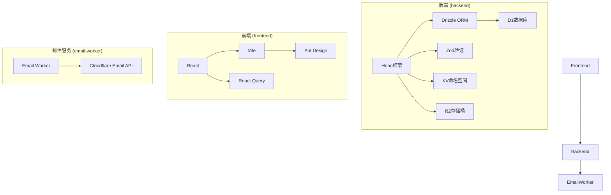
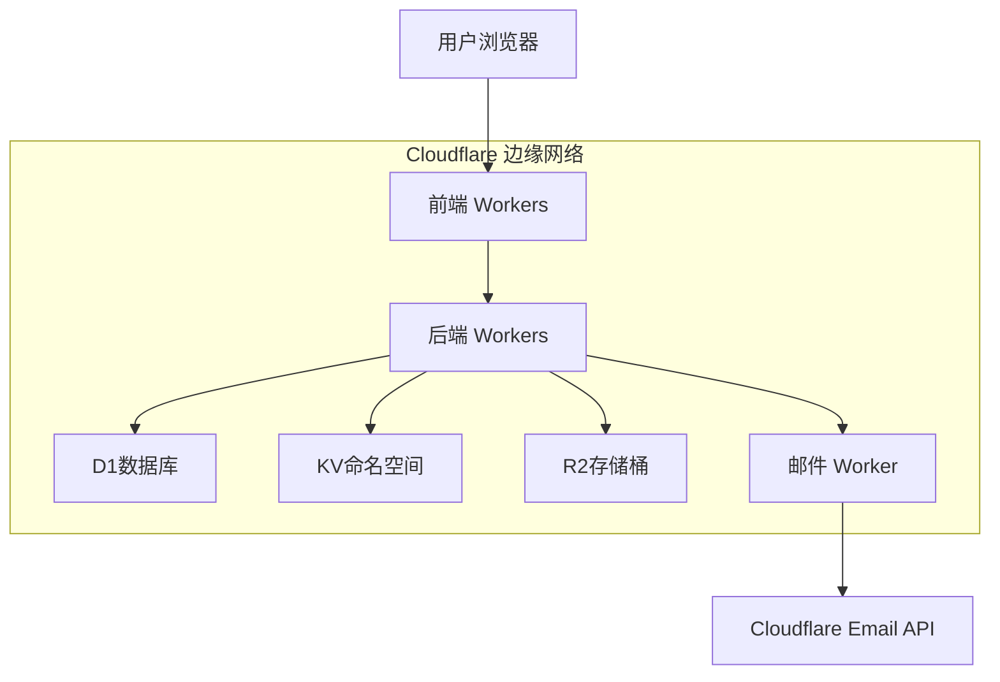
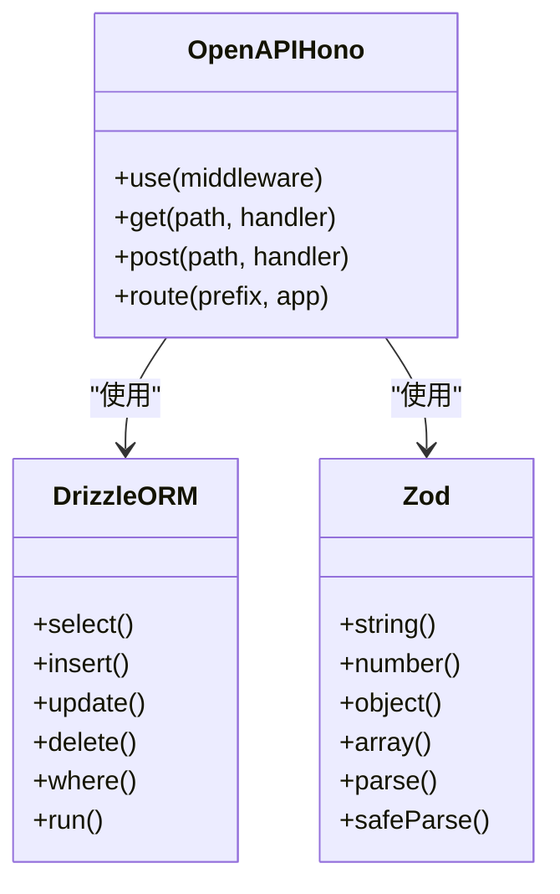
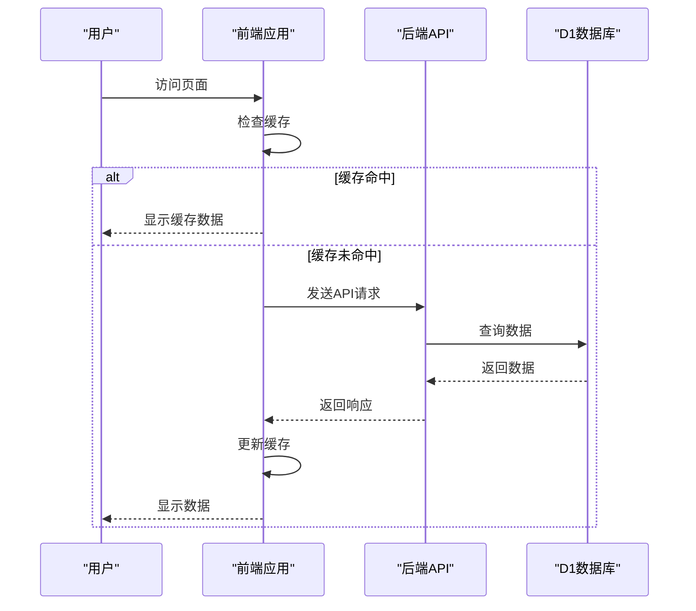
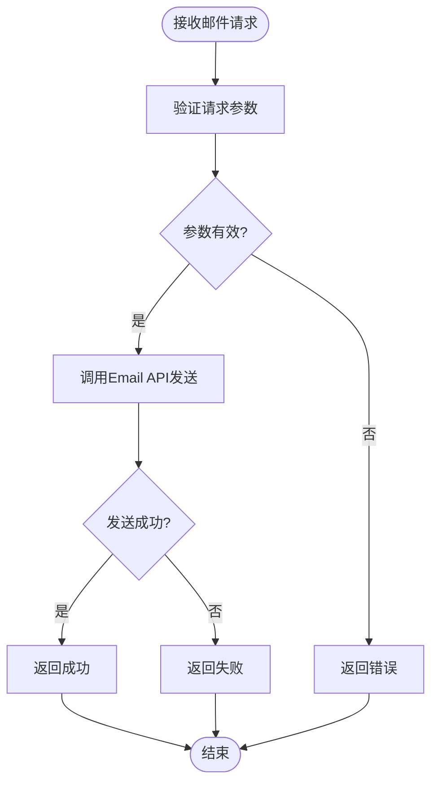
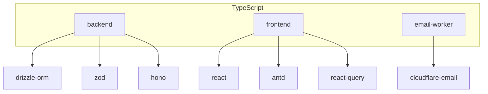

# 技术栈与架构

<cite>
**本文档引用的文件**
- [backend/package.json](file://backend/package.json)
- [frontend/package.json](file://frontend/package.json)
- [email-worker/package.json](file://email-worker/package.json)
- [backend/src/index.ts](file://backend/src/index.ts)
- [frontend/src/main.tsx](file://frontend/src/main.tsx)
- [email-worker/src/index.ts](file://email-worker/src/index.ts)
- [backend/wrangler.toml](file://backend/wrangler.toml)
- [frontend/vite.config.ts](file://frontend/vite.config.ts)
- [backend/drizzle.config.ts](file://backend/drizzle.config.ts)
- [backend/src/db/index.ts](file://backend/src/db/index.ts)
- [backend/src/utils/validation.ts](file://backend/src/utils/validation.ts)
- [frontend/src/api/http.ts](file://frontend/src/api/http.ts)
- [backend/src/routes/v2/auth.ts](file://backend/src/routes/v2/auth.ts)
- [backend/src/services/AuthService.ts](file://backend/src/services/AuthService.ts)
- [backend/src/schemas/common.schema.ts](file://backend/src/schemas/common.schema.ts)
- [frontend/src/router/index.tsx](file://frontend/src/router/index.tsx)
- [backend/src/middleware.ts](file://backend/src/middleware.ts)
</cite>

## 目录
1. [简介](#简介)
2. [项目结构](#项目结构)
3. [核心组件](#核心组件)
4. [架构概述](#架构概述)
5. [详细组件分析](#详细组件分析)
6. [依赖分析](#依赖分析)
7. [性能考虑](#性能考虑)
8. [故障排除指南](#故障排除指南)
9. [结论](#结论)
10. [附录](#附录) (如有必要)

## 简介
本项目是一个基于Cloudflare Workers平台的财务管理系统，采用现代化的技术栈构建。系统分为三个主要部分：后端API服务、前端用户界面和独立的邮件服务Worker。后端使用Hono框架构建轻量级API，结合Drizzle ORM进行类型安全的数据库操作，并使用Zod进行运行时验证。前端基于React + Vite构建现代化UI，使用Ant Design组件库和React Query进行状态管理。邮件服务通过Cloudflare Email Workers实现异步通信。整个系统部署在Cloudflare的全球边缘网络上，利用D1数据库的无服务器特性，确保高可用性和低延迟。

## 项目结构
项目采用多包结构，包含三个主要模块：backend、frontend和email-worker。每个模块都有独立的package.json和配置文件，实现了关注点分离。后端模块使用Hono框架处理API请求，Drizzle ORM管理D1数据库操作，并通过Zod进行请求验证。前端模块使用React + Vite构建用户界面，Ant Design提供UI组件，React Query管理数据状态。邮件服务模块独立处理所有邮件发送任务，通过Cloudflare Email API实现可靠的邮件投递。

**图示来源**
- [backend/package.json](file://backend/package.json)
- [frontend/package.json](file://frontend/package.json)
- [email-worker/package.json](file://email-worker/package.json)

**本节来源**
- [backend/package.json](file://backend/package.json)
- [frontend/package.json](file://frontend/package.json)
- [email-worker/package.json](file://email-worker/package.json)

## 核心组件
系统的核心组件包括后端API服务、前端用户界面和邮件服务Worker。后端API服务使用Hono框架构建，提供RESTful API接口，处理所有业务逻辑。前端用户界面使用React + Vite构建，提供现代化的用户交互体验。邮件服务Worker独立处理所有邮件发送任务，确保主应用的响应性能。三个组件通过API进行通信，实现了松耦合的设计。

**本节来源**
- [backend/src/index.ts](file://backend/src/index.ts)
- [frontend/src/main.tsx](file://frontend/src/main.tsx)
- [email-worker/src/index.ts](file://email-worker/src/index.ts)

## 架构概述
系统采用分层架构设计，前端、后端和邮件服务分别部署在Cloudflare Workers平台上。后端API服务作为中心枢纽，处理前端的请求并与D1数据库交互。邮件服务Worker通过服务绑定与后端通信，实现异步邮件发送。整个系统利用Cloudflare的全球边缘网络，确保用户无论身处何地都能获得低延迟的访问体验。

**图示来源**
- [backend/wrangler.toml](file://backend/wrangler.toml)
- [email-worker/src/index.ts](file://email-worker/src/index.ts)

**本节来源**
- [backend/wrangler.toml](file://backend/wrangler.toml)
- [email-worker/src/index.ts](file://email-worker/src/index.ts)

## 详细组件分析

### 后端API服务分析
后端API服务使用Hono框架构建，提供轻量级、高性能的API接口。通过OpenAPIHono扩展，系统自动生成OpenAPI规范和Swagger UI文档，便于API的开发和维护。Drizzle ORM提供类型安全的数据库操作，与D1数据库无缝集成。Zod用于运行时验证，确保API请求的数据完整性。

#### 类图

**图示来源**
- [backend/src/index.ts](file://backend/src/index.ts)
- [backend/drizzle.config.ts](file://backend/drizzle.config.ts)
- [backend/src/schemas/common.schema.ts](file://backend/src/schemas/common.schema.ts)

### 前端用户界面分析
前端用户界面基于React + Vite构建，使用Ant Design组件库提供一致的UI体验。React Query用于管理数据状态，实现高效的数据获取和缓存。系统采用懒加载和代码分割技术，优化首屏加载性能。通过Service Worker实现离线访问能力，提升用户体验。

#### 序列图

**图示来源**
- [frontend/src/main.tsx](file://frontend/src/main.tsx)
- [frontend/src/api/http.ts](file://frontend/src/api/http.ts)
- [frontend/vite.config.ts](file://frontend/vite.config.ts)

**本节来源**
- [frontend/src/main.tsx](file://frontend/src/main.tsx)
- [frontend/src/api/http.ts](file://frontend/src/api/http.ts)
- [frontend/vite.config.ts](file://frontend/vite.config.ts)

### 邮件服务分析
邮件服务Worker独立处理所有邮件发送任务，通过Cloudflare Email API实现可靠的邮件投递。服务采用异步处理模式，避免阻塞主应用的响应。通过简单的HTTP接口接收邮件发送请求，验证后调用Cloudflare Email API发送邮件。

#### 流程图

**图示来源**
- [email-worker/src/index.ts](file://email-worker/src/index.ts)

**本节来源**
- [email-worker/src/index.ts](file://email-worker/src/index.ts)

## 依赖分析
系统依赖关系清晰，各组件之间松耦合。后端API服务依赖Drizzle ORM进行数据库操作，依赖Zod进行数据验证。前端应用依赖React Query进行状态管理，依赖Ant Design提供UI组件。邮件服务Worker依赖Cloudflare Email API进行邮件发送。所有组件都使用TypeScript，确保全栈类型一致性。

**图示来源**
- [backend/package.json](file://backend/package.json)
- [frontend/package.json](file://frontend/package.json)
- [email-worker/package.json](file://email-worker/package.json)

**本节来源**
- [backend/package.json](file://backend/package.json)
- [frontend/package.json](file://frontend/package.json)
- [email-worker/package.json](file://email-worker/package.json)

## 性能考虑
系统在设计时充分考虑了性能因素。后端API服务利用Cloudflare Workers的边缘计算能力，将计算任务分布到全球边缘节点，减少延迟。前端应用采用代码分割和懒加载技术，优化首屏加载时间。React Query的缓存机制减少了不必要的API调用。D1数据库的无服务器架构确保了数据库操作的高效性。KV命名空间用于缓存会话数据，提高读取性能。

## 故障排除指南
常见问题包括API响应慢、邮件发送失败和前端加载问题。对于API响应慢，应检查数据库查询性能和网络延迟。邮件发送失败通常与Email API配置或网络问题有关。前端加载问题可能由缓存或网络问题引起。系统提供了健康检查端点(/api/health)，可用于监控系统状态。

**本节来源**
- [backend/src/index.ts](file://backend/src/index.ts#L101-L187)
- [frontend/src/api/http.ts](file://frontend/src/api/http.ts)

## 结论
本项目采用现代化的技术栈，构建了一个高性能、可扩展的财务管理系统。通过Cloudflare Workers平台，系统实现了全球部署和低延迟访问。Hono框架提供了轻量级的API服务，Drizzle ORM确保了数据库操作的类型安全，Zod保证了数据验证的可靠性。前端使用React + Vite构建现代化UI，React Query优化了数据管理。独立的邮件服务Worker确保了邮件发送的可靠性。整个系统体现了现代Web应用的最佳实践，具有良好的可维护性和扩展性。

## 附录

### 环境变量配置
系统使用环境变量进行配置，主要环境变量包括：

| 环境变量 | 描述 | 来源 |
|---------|------|------|
| AUTH_JWT_SECRET | JWT签名密钥 | backend/wrangler.toml |
| INIT_ADMIN_PASSWORD_HASH | 初始化管理员密码哈希 | backend/wrangler.toml |
| EMAIL_TOKEN | 邮件服务鉴权令牌 | email-worker/src/index.ts |
| EMAIL_FROM | 发件人地址 | email-worker/src/index.ts |

**本节来源**
- [backend/wrangler.toml](file://backend/wrangler.toml)
- [email-worker/src/index.ts](file://email-worker/src/index.ts)

### API版本管理
系统采用API版本管理策略，通过路径前缀区分不同版本的API。当前主要版本为v2，通过/api/v2/*路径访问。系统同时支持/api/*路径作为v2版本的别名，便于客户端迁移。

**本节来源**
- [backend/src/index.ts](file://backend/src/index.ts#L344-L347)