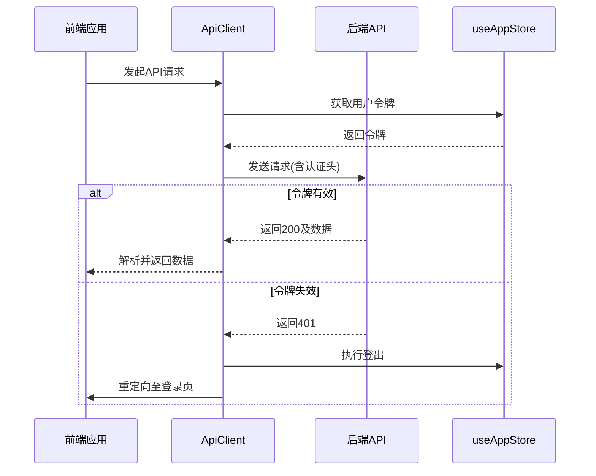
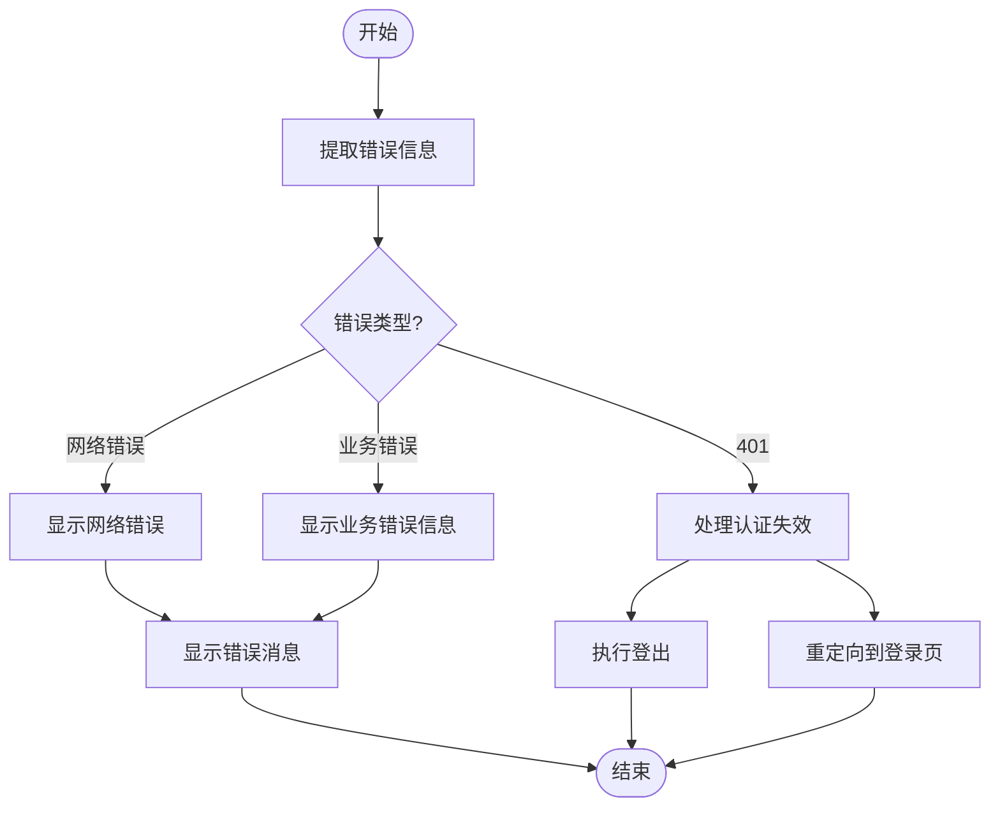
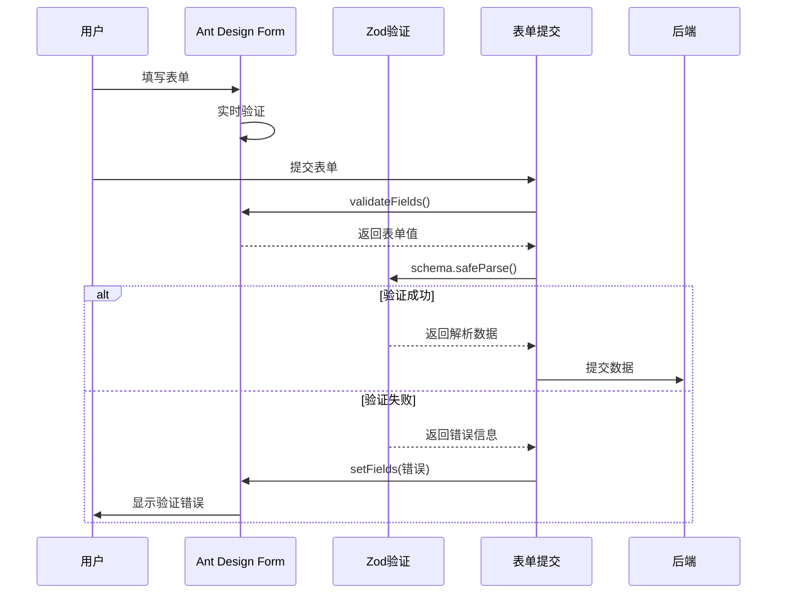
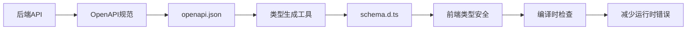
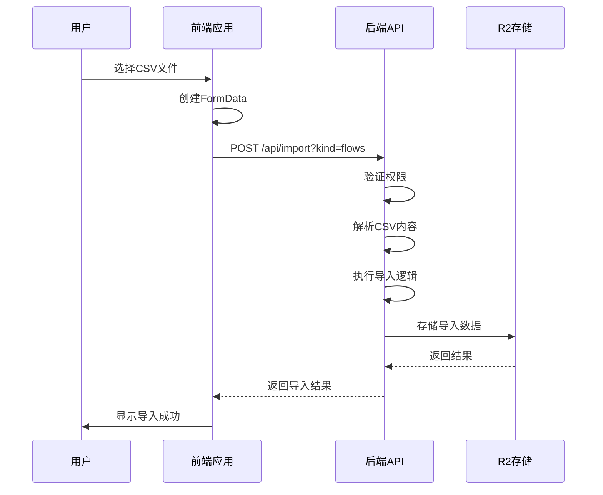
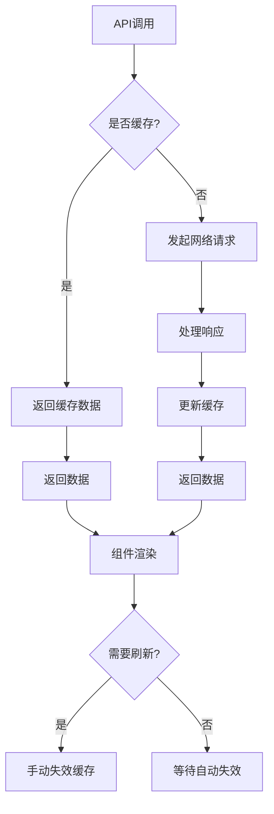

# API集成

<cite>
**本文档引用的文件**
- [http.ts](file://frontend/src/api/http.ts)
- [api.ts](file://frontend/src/config/api.ts)
- [errorHandler.ts](file://frontend/src/utils/errorHandler.ts)
- [useZodForm.ts](file://frontend/src/hooks/forms/useZodForm.ts)
- [openapi.json](file://backend/openapi.json)
- [schema.d.ts](file://frontend/src/types/schema.d.ts)
- [useImport.ts](file://frontend/src/hooks/business/useImport.ts)
- [import.ts](file://backend/src/routes/import.ts)
- [Login.tsx](file://frontend/src/features/auth/pages/Login.tsx)
- [useEmployees.ts](file://frontend/src/hooks/business/useEmployees.ts)
- [useFlows.ts](file://frontend/src/hooks/business/useFlows.ts)
- [API_BEST_PRACTICES.md](file://frontend/docs/API_BEST_PRACTICES.md)
</cite>

## 目录
1. [HTTP客户端封装](#http客户端封装)
2. [API端点集中管理](#api端点集中管理)
3. [全局错误处理机制](#全局错误处理机制)
4. [前后端表单验证一致性](#前后端表单验证一致性)
5. [API契约与类型自动生成](#api契约与类型自动生成)
6. [文件上传与CSV导入处理](#文件上传与csv导入处理)
7. [API调用性能监控与调试](#api调用性能监控与调试)

## HTTP客户端封装

前端通过 `http.ts` 文件中的 `ApiClient` 类对 Fetch API 进行了封装，实现了统一的请求拦截、响应处理和认证令牌管理。该客户端自动注入 JWT 认证令牌，并在令牌失效时执行登出操作。

**客户端核心功能：**
- **请求拦截**：在请求头中自动设置 `Content-Type` 和 `Authorization` 头
- **认证管理**：从 `useAppStore` 获取 JWT 令牌并注入到请求头中
- **响应处理**：根据响应内容类型自动解析 JSON、文本或 Blob 数据
- **错误处理**：对非 2xx 响应状态码进行统一错误处理
- **401 处理**：当收到 401 响应时，自动清除用户状态并重定向到登录页



**图源**
- [http.ts](file://frontend/src/api/http.ts#L11-L98)

**本节来源**
- [http.ts](file://frontend/src/api/http.ts#L1-L98)

## API端点集中管理

项目通过 `config/api.ts` 文件对所有 API 端点进行集中管理，实现了基础 URL 配置、环境适配和端点组织。这种集中式管理方式提高了代码的可维护性和一致性。

**环境适配方案：**
- **开发环境**：使用 `http://127.0.0.1:8787` 作为基础 URL
- **生产环境**：使用相对路径，通过 Cloudflare Pages 内部绑定 Worker

**端点组织策略：**
- 按业务模块组织端点（如 auth、me、departments、flows 等）
- 使用函数式端点处理动态路由参数
- 统一的命名空间管理，避免命名冲突

```mermaid
graph TB
subgraph "API配置"
A[基础URL] --> B[开发环境]
A --> C[生产环境]
D[端点管理] --> E[认证模块]
D --> F[员工模块]
D --> G[财务模块]
D --> H[报表模块]
E --> E1[/api/auth/login/]
E --> E2[/api/auth/logout/]
F --> F1[/api/employees/]
F --> F2[/api/employees/{id}/]
G --> G1[/api/flows/]
G --> G2[/api/flows/{id}/]
end
```

**图源**
- [api.ts](file://frontend/src/config/api.ts#L1-L179)

**本节来源**
- [api.ts](file://frontend/src/config/api.ts#L1-L179)

## 全局错误处理机制

通过 `errorHandler.ts` 文件实现了全局错误处理流程，对网络异常、认证失效和业务校验错误进行分类处理，并提供用户友好的提示。

**错误处理分类：**
- **网络异常**：显示"网络错误"提示
- **认证失效**：自动重定向到登录页
- **业务校验错误**：显示具体的错误信息
- **401 错误**：特殊处理，执行登出并重定向

**错误处理工具：**
- `handleApiError`：基础错误处理函数
- `withErrorHandler`：高阶函数，包装异步操作
- `useErrorHandler`：React Hook 形式的错误处理
- `withRetry`：重试机制，增强网络请求的可靠性



**图源**
- [errorHandler.ts](file://frontend/src/utils/errorHandler.ts#L1-L173)

**本节来源**
- [errorHandler.ts](file://frontend/src/utils/errorHandler.ts#L1-L173)

## 前后端表单验证一致性

通过 `useZodForm` Hook 实现了前后端表单验证的一致性。前端使用 Zod 模式与后端保持一致，确保验证规则的统一。

**实现机制：**
- 使用 `useZodForm` Hook 将 Ant Design Form 与 Zod 验证结合
- 先通过 Ant Design 的 `validateFields` 进行基础验证
- 再使用 Zod 模式进行深度验证
- 将 Zod 错误转换为 Ant Design Form 可识别的错误格式



**图源**
- [useZodForm.ts](file://frontend/src/hooks/forms/useZodForm.ts#L1-L61)

**本节来源**
- [useZodForm.ts](file://frontend/src/hooks/forms/useZodForm.ts#L1-L61)

## API契约与类型自动生成

基于 `openapi.json` 文件实现了 TypeScript 类型的自动生成，确保了 API 契约的一致性。

**实现流程：**
- 后端使用 OpenAPI 规范定义 API 契约
- 生成 `openapi.json` 文件
- 使用工具将 OpenAPI 规范转换为 TypeScript 类型
- 生成 `schema.d.ts` 文件，包含所有 API 端点的类型定义

**类型定义优势：**
- 确保前后端数据结构一致
- 提供编译时类型检查
- 增强代码可维护性
- 减少因 API 变更导致的错误



**图源**
- [openapi.json](file://backend/openapi.json#L1-L800)
- [schema.d.ts](file://frontend/src/types/schema.d.ts#L1-L800)

**本节来源**
- [openapi.json](file://backend/openapi.json#L1-L800)
- [schema.d.ts](file://frontend/src/types/schema.d.ts#L1-L800)

## 文件上传与CSV导入处理

项目实现了文件上传和 CSV 导入的特殊请求处理范式，满足了财务系统对文档管理的需求。

**文件上传处理：**
- 使用 `FormData` 对象处理文件上传
- 自动设置正确的 `Content-Type`
- 支持多文件上传
- 后端使用 Cloudflare R2 存储凭证文件

**CSV导入处理：**
- 通过 `useImportData` Hook 实现 CSV 导入
- 支持多种导入类型（flows、AR、AP、opening）
- 前端设置 `Content-Type: text/csv`
- 后端验证用户权限后处理导入



**图源**
- [useImport.ts](file://frontend/src/hooks/business/useImport.ts#L1-L15)
- [import.ts](file://backend/src/routes/import.ts#L1-L64)

**本节来源**
- [useImport.ts](file://frontend/src/hooks/business/useImport.ts#L1-L15)
- [import.ts](file://backend/src/routes/import.ts#L1-L64)

## API调用性能监控与调试

项目提供了完善的 API 调用性能监控与调试工具，帮助开发者优化系统性能。

**性能监控机制：**
- 使用 React Query 进行数据缓存管理
- 设置合理的缓存时间（如报表缓存3分钟）
- 自动失效相关查询缓存
- 提供查询状态监控

**调试工具：**
- 开发环境 API 状态显示
- 错误日志记录
- 网络请求监控
- 性能分析工具集成



**图源**
- [useApiQuery.ts](file://frontend/src/utils/useApiQuery.ts#L1-L94)
- [API_BEST_PRACTICES.md](file://frontend/docs/API_BEST_PRACTICES.md#L82-L159)

**本节来源**
- [useApiQuery.ts](file://frontend/src/utils/useApiQuery.ts#L1-L94)
- [API_BEST_PRACTICES.md](file://frontend/docs/API_BEST_PRACTICES.md#L82-L159)