# UI组件体系

<cite>
**本文档引用文件**  
- [PageContainer.tsx](file://frontend/src/components/PageContainer.tsx)
- [PageContainer.css](file://frontend/src/components/PageContainer.css)
- [VirtualTable.tsx](file://frontend/src/components/VirtualTable.tsx)
- [FormModal.tsx](file://frontend/src/components/FormModal.tsx)
- [GlobalSearch.tsx](file://frontend/src/components/GlobalSearch.tsx)
- [MultiTabs.tsx](file://frontend/src/components/MultiTabs.tsx)
- [ActionColumn.tsx](file://frontend/src/components/ActionColumn.tsx)
- [SensitiveField.tsx](file://frontend/src/components/SensitiveField.tsx)
- [WorkScheduleEditor.tsx](file://frontend/src/components/WorkScheduleEditor.tsx)
- [EmployeeForm.tsx](file://frontend/src/features/employees/components/forms/EmployeeForm.tsx)
- [theme.ts](file://frontend/src/config/theme.ts)
- [menu.ts](file://frontend/src/config/menu.ts)
- [useDebounce.ts](file://frontend/src/hooks/useDebounce.ts)
- [permissions.ts](file://frontend/src/utils/permissions.ts)
</cite>

## 目录
1. [简介](#简介)
2. [项目结构](#项目结构)
3. [核心组件](#核心组件)
4. [架构概览](#架构概览)
5. [详细组件分析](#详细组件分析)
6. [依赖分析](#依赖分析)
7. [性能考量](#性能考量)
8. [故障排除指南](#故障排除指南)
9. [结论](#结论)

## 简介
本文档深入解析caiwu-main前端UI组件体系的设计与实现。详细说明PageContainer布局组件的响应式设计与权限控制集成机制，分析VirtualTable虚拟滚动性能优化原理及其在大数据量场景下的应用。阐述FormModal表单模态框的通用化设计模式，包括表单状态管理、提交流程控制与错误反馈机制。解释GlobalSearch全局搜索组件的防抖策略与异步加载实现，以及MultiTabs多标签页的状态持久化方案。描述ActionColumn操作列组件的权限敏感渲染逻辑，以及SensitiveField敏感字段加密显示技术。结合EmployeeForm实际案例，展示复杂业务表单的组件组合模式与校验规则集成。提供WorkScheduleEditor等专业组件的使用方法与扩展接口，说明Ant Design主题定制（theme.ts）在项目中的落地实践。

## 项目结构
caiwu-main前端项目采用模块化架构设计，主要分为components、features、hooks、config等核心目录。components目录存放可复用的UI组件，features目录按业务领域组织页面和组件，hooks目录封装业务逻辑和状态管理，config目录管理全局配置。这种分层架构提高了代码的可维护性和可扩展性。

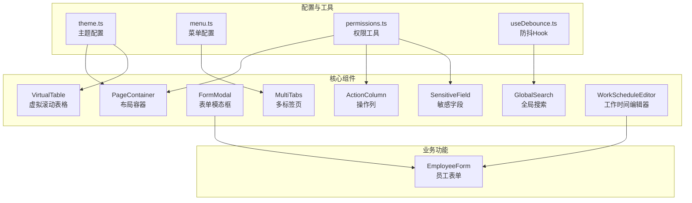

**图表来源**
- [PageContainer.tsx](file://frontend/src/components/PageContainer.tsx)
- [VirtualTable.tsx](file://frontend/src/components/VirtualTable.tsx)
- [FormModal.tsx](file://frontend/src/components/FormModal.tsx)
- [GlobalSearch.tsx](file://frontend/src/components/GlobalSearch.tsx)
- [MultiTabs.tsx](file://frontend/src/components/MultiTabs.tsx)
- [ActionColumn.tsx](file://frontend/src/components/ActionColumn.tsx)
- [SensitiveField.tsx](file://frontend/src/components/SensitiveField.tsx)
- [WorkScheduleEditor.tsx](file://frontend/src/components/WorkScheduleEditor.tsx)
- [EmployeeForm.tsx](file://frontend/src/features/employees/components/forms/EmployeeForm.tsx)
- [theme.ts](file://frontend/src/config/theme.ts)
- [menu.ts](file://frontend/src/config/menu.ts)
- [useDebounce.ts](file://frontend/src/hooks/useDebounce.ts)
- [permissions.ts](file://frontend/src/utils/permissions.ts)

**章节来源**
- [PageContainer.tsx](file://frontend/src/components/PageContainer.tsx)
- [VirtualTable.tsx](file://frontend/src/components/VirtualTable.tsx)
- [FormModal.tsx](file://frontend/src/components/FormModal.tsx)
- [GlobalSearch.tsx](file://frontend/src/components/GlobalSearch.tsx)
- [MultiTabs.tsx](file://frontend/src/components/MultiTabs.tsx)
- [ActionColumn.tsx](file://frontend/src/components/ActionColumn.tsx)
- [SensitiveField.tsx](file://frontend/src/components/SensitiveField.tsx)
- [WorkScheduleEditor.tsx](file://frontend/src/components/WorkScheduleEditor.tsx)
- [EmployeeForm.tsx](file://frontend/src/features/employees/components/forms/EmployeeForm.tsx)
- [theme.ts](file://frontend/src/config/theme.ts)
- [menu.ts](file://frontend/src/config/menu.ts)
- [useDebounce.ts](file://frontend/src/hooks/useDebounce.ts)
- [permissions.ts](file://frontend/src/utils/permissions.ts)

## 核心组件
本文档涵盖的UI组件体系包括布局容器、数据展示、表单交互、搜索导航等多个维度。PageContainer提供标准化的页面布局框架，VirtualTable解决大数据量表格渲染性能问题，FormModal实现表单模态框的通用化封装。GlobalSearch和MultiTabs分别提供全局搜索和多标签页导航功能，ActionColumn和SensitiveField处理操作权限和敏感数据展示。WorkScheduleEditor和EmployeeForm展示了专业组件和复杂表单的实现模式。

**章节来源**
- [PageContainer.tsx](file://frontend/src/components/PageContainer.tsx)
- [VirtualTable.tsx](file://frontend/src/components/VirtualTable.tsx)
- [FormModal.tsx](file://frontend/src/components/FormModal.tsx)
- [GlobalSearch.tsx](file://frontend/src/components/GlobalSearch.tsx)
- [MultiTabs.tsx](file://frontend/src/components/MultiTabs.tsx)
- [ActionColumn.tsx](file://frontend/src/components/ActionColumn.tsx)
- [SensitiveField.tsx](file://frontend/src/components/SensitiveField.tsx)
- [WorkScheduleEditor.tsx](file://frontend/src/components/WorkScheduleEditor.tsx)
- [EmployeeForm.tsx](file://frontend/src/features/employees/components/forms/EmployeeForm.tsx)

## 架构概览
caiwu-main前端UI组件体系采用分层架构设计，基于React和Ant Design构建。基础层包含主题配置和权限工具，通用组件层提供可复用的UI组件，业务组件层实现特定业务功能。组件间通过props和hooks进行通信，使用Zustand进行全局状态管理。整个体系注重性能优化、权限控制和用户体验。

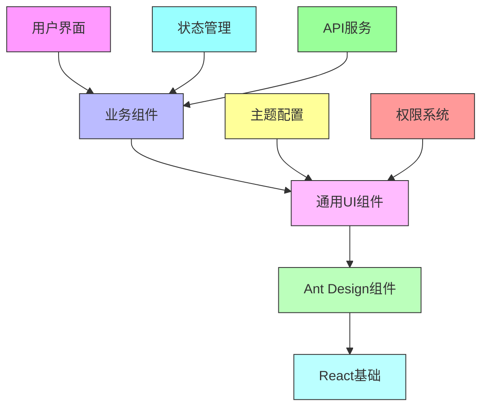

**图表来源**
- [theme.ts](file://frontend/src/config/theme.ts)
- [permissions.ts](file://frontend/src/utils/permissions.ts)
- [useAppStore.ts](file://frontend/src/store/useAppStore.ts)
- [http.ts](file://frontend/src/api/http.ts)

## 详细组件分析

### PageContainer布局组件分析
PageContainer组件是页面布局的基础容器，提供标题、面包屑和额外操作区域的标准化布局。该组件通过CSS Flex布局实现响应式设计，在移动端自动调整布局方向。组件集成了权限控制机制，可以根据用户权限动态显示或隐藏操作按钮。

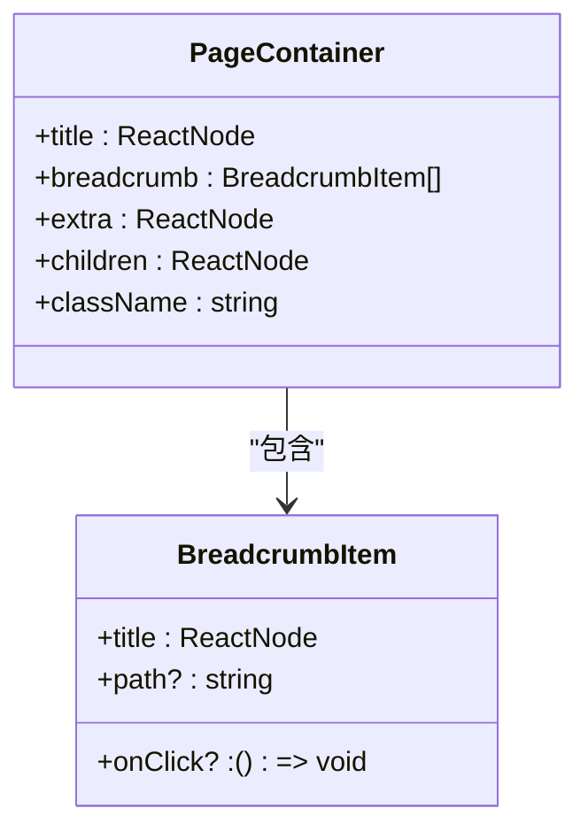

**图表来源**
- [PageContainer.tsx](file://frontend/src/components/PageContainer.tsx)
- [PageContainer.css](file://frontend/src/components/PageContainer.css)

**章节来源**
- [PageContainer.tsx](file://frontend/src/components/PageContainer.tsx)
- [PageContainer.css](file://frontend/src/components/PageContainer.css)

### VirtualTable虚拟表格分析
VirtualTable组件基于rc-virtual-list实现虚拟滚动，解决大数据量表格渲染性能问题。组件通过计算可视区域内的行数，只渲染可见行，大幅减少DOM节点数量。表格宽度自适应容器大小，支持固定列宽和等分布局。

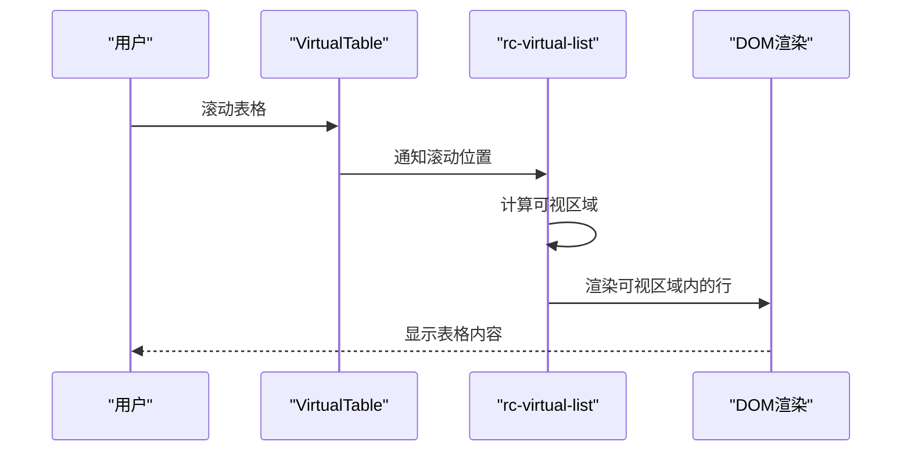

**图表来源**
- [VirtualTable.tsx](file://frontend/src/components/VirtualTable.tsx)

**章节来源**
- [VirtualTable.tsx](file://frontend/src/components/VirtualTable.tsx)

### FormModal表单模态框分析
FormModal组件提供通用的表单模态框封装，统一管理表单的显示、提交和关闭逻辑。组件接受Ant Design Form实例作为props，实现表单状态与模态框状态的解耦。支持自定义宽度、加载状态和按钮文本，具有良好的可扩展性。

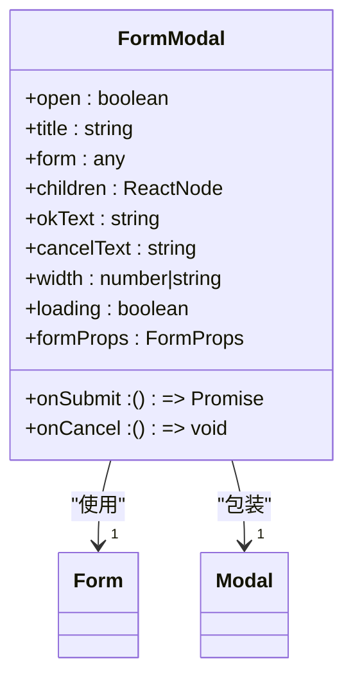

**图表来源**
- [FormModal.tsx](file://frontend/src/components/FormModal.tsx)

**章节来源**
- [FormModal.tsx](file://frontend/src/components/FormModal.tsx)

### GlobalSearch全局搜索分析
GlobalSearch组件实现全局搜索功能，支持员工、资产、供应商和账户等多类型数据搜索。组件采用防抖策略优化性能，避免频繁触发API请求。搜索结果按类型分组显示，点击结果可导航到相应页面。

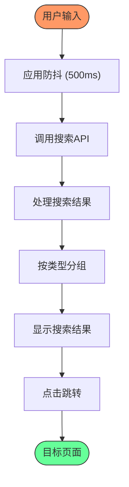

**图表来源**
- [GlobalSearch.tsx](file://frontend/src/components/GlobalSearch.tsx)
- [useDebounce.ts](file://frontend/src/hooks/useDebounce.ts)

**章节来源**
- [GlobalSearch.tsx](file://frontend/src/components/GlobalSearch.tsx)
- [useDebounce.ts](file://frontend/src/hooks/useDebounce.ts)

### MultiTabs多标签页分析
MultiTabs组件实现多标签页导航功能，支持标签页的打开、关闭和刷新。组件通过React Router的useLocation Hook监听路由变化，自动同步标签页状态。右键菜单提供丰富的操作选项，包括关闭当前、关闭其他、关闭右侧等。

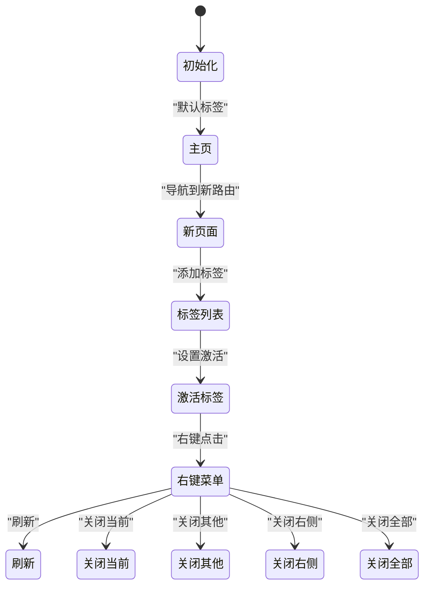

**图表来源**
- [MultiTabs.tsx](file://frontend/src/components/MultiTabs.tsx)
- [menu.ts](file://frontend/src/config/menu.ts)

**章节来源**
- [MultiTabs.tsx](file://frontend/src/components/MultiTabs.tsx)
- [menu.ts](file://frontend/src/config/menu.ts)

### ActionColumn操作列分析
ActionColumn组件提供通用的操作列封装，支持编辑、删除和自定义操作。组件通过权限控制决定是否显示编辑和删除按钮，确保数据安全。删除操作使用Popconfirm组件防止误操作，支持自定义确认文本和描述。

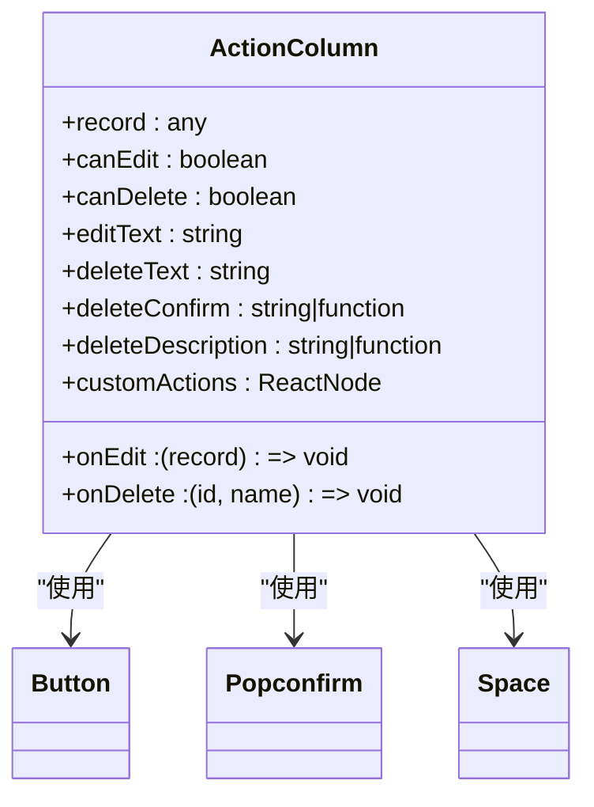

**图表来源**
- [ActionColumn.tsx](file://frontend/src/components/ActionColumn.tsx)

**章节来源**
- [ActionColumn.tsx](file://frontend/src/components/ActionColumn.tsx)

### SensitiveField敏感字段分析
SensitiveField组件用于安全地显示敏感信息，如薪资、手机号等。组件默认显示脱敏值，用户点击眼睛图标可临时查看明文。查看敏感信息会记录审计日志，确保操作可追溯。组件支持多种脱敏模式，包括薪资、手机号和地址。

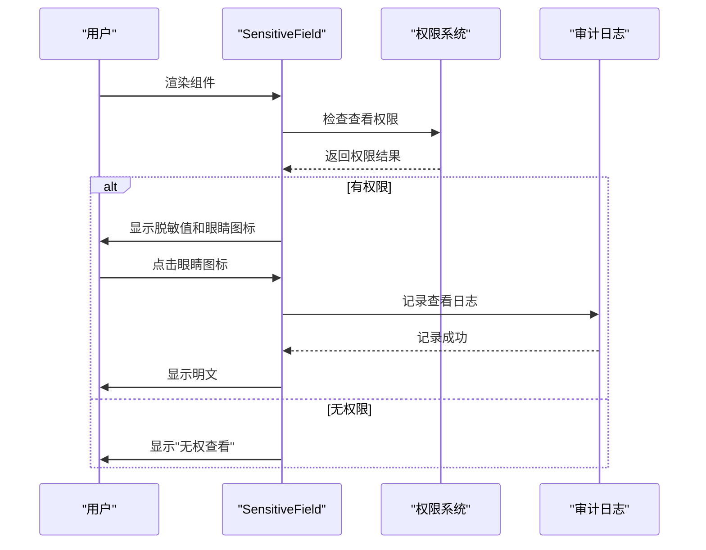

**图表来源**
- [SensitiveField.tsx](file://frontend/src/components/SensitiveField.tsx)
- [permissions.ts](file://frontend/src/utils/permissions.ts)
- [useAuditLogs.ts](file://frontend/src/hooks/business/useAuditLogs.ts)

**章节来源**
- [SensitiveField.tsx](file://frontend/src/components/SensitiveField.tsx)
- [permissions.ts](file://frontend/src/utils/permissions.ts)

### WorkScheduleEditor工作时间编辑器分析
WorkScheduleEditor组件提供工作时间的可视化编辑界面，支持选择工作日和设置上下班时间。组件使用Ant Design的Checkbox.Group、TimePicker等组件构建，界面简洁易用。支持分钟步长为30的精确时间选择，符合企业考勤管理需求。

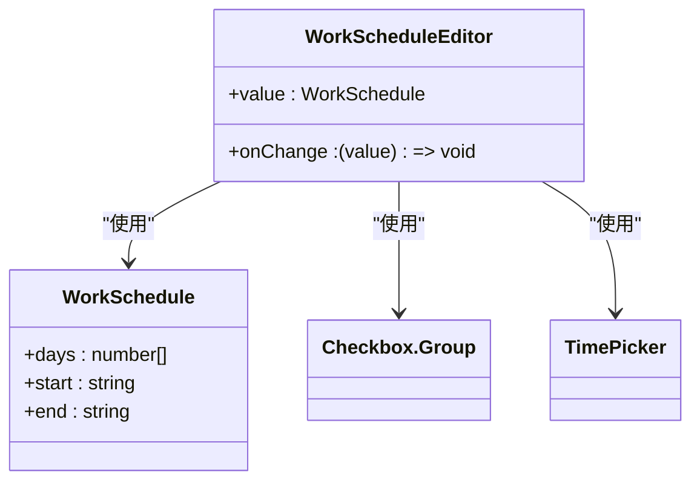

**图表来源**
- [WorkScheduleEditor.tsx](file://frontend/src/components/WorkScheduleEditor.tsx)

**章节来源**
- [WorkScheduleEditor.tsx](file://frontend/src/components/WorkScheduleEditor.tsx)

### EmployeeForm员工表单分析
EmployeeForm组件展示复杂业务表单的实现模式，包含多个表单项和级联选择。表单使用Ant Design的Tabs组件分组显示，提高可读性。部门和职位选择实现级联逻辑，选择项目后动态加载对应部门，选择部门后动态加载对应职位。

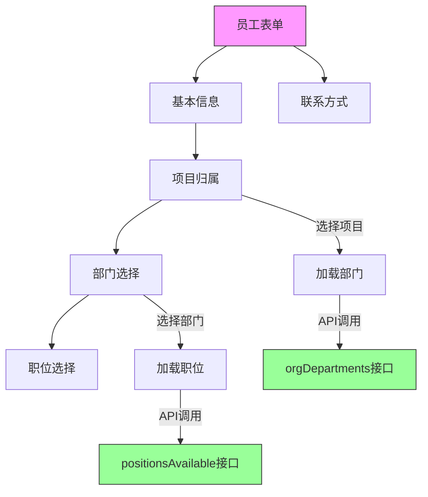

**图表来源**
- [EmployeeForm.tsx](file://frontend/src/features/employees/components/forms/EmployeeForm.tsx)
- [useApiQuery.ts](file://frontend/src/utils/useApiQuery.ts)

**章节来源**
- [EmployeeForm.tsx](file://frontend/src/features/employees/components/forms/EmployeeForm.tsx)

## 依赖分析
UI组件体系的依赖关系清晰，基础组件依赖Ant Design和React，通用组件依赖基础组件和工具函数，业务组件依赖通用组件和业务逻辑。主题配置和权限系统作为全局依赖，被多个组件使用。这种依赖结构确保了组件的可复用性和系统的可维护性。

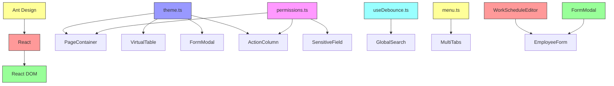

**图表来源**
- [theme.ts](file://frontend/src/config/theme.ts)
- [permissions.ts](file://frontend/src/utils/permissions.ts)
- [useDebounce.ts](file://frontend/src/hooks/useDebounce.ts)
- [menu.ts](file://frontend/src/config/menu.ts)
- [WorkScheduleEditor.tsx](file://frontend/src/components/WorkScheduleEditor.tsx)
- [FormModal.tsx](file://frontend/src/components/FormModal.tsx)
- [EmployeeForm.tsx](file://frontend/src/features/employees/components/forms/EmployeeForm.tsx)

**章节来源**
- [theme.ts](file://frontend/src/config/theme.ts)
- [permissions.ts](file://frontend/src/utils/permissions.ts)
- [useDebounce.ts](file://frontend/src/hooks/useDebounce.ts)
- [menu.ts](file://frontend/src/config/menu.ts)

## 性能考量
UI组件体系在设计时充分考虑了性能优化。VirtualTable通过虚拟滚动减少DOM节点数量，GlobalSearch使用防抖避免频繁API调用，FormModal通过状态管理避免不必要的重渲染。主题配置使用Ant Design的Token系统，确保样式变更的高效性。整体架构遵循React最佳实践，确保应用的流畅运行。

## 故障排除指南
当遇到UI组件相关问题时，可按以下步骤排查：首先检查组件props是否正确传递，其次验证依赖的Hook是否正常工作，然后确认样式文件是否正确引入，最后检查权限配置是否影响组件显示。对于性能问题，可使用React DevTools分析重渲染原因，对于数据问题，可检查API响应是否符合预期。

**章节来源**
- [PageContainer.tsx](file://frontend/src/components/PageContainer.tsx)
- [VirtualTable.tsx](file://frontend/src/components/VirtualTable.tsx)
- [FormModal.tsx](file://frontend/src/components/FormModal.tsx)
- [GlobalSearch.tsx](file://frontend/src/components/GlobalSearch.tsx)
- [MultiTabs.tsx](file://frontend/src/components/MultiTabs.tsx)
- [ActionColumn.tsx](file://frontend/src/components/ActionColumn.tsx)
- [SensitiveField.tsx](file://frontend/src/components/SensitiveField.tsx)
- [WorkScheduleEditor.tsx](file://frontend/src/components/WorkScheduleEditor.tsx)
- [EmployeeForm.tsx](file://frontend/src/features/employees/components/forms/EmployeeForm.tsx)

## 结论
caiwu-main前端UI组件体系设计合理，实现了高复用性、高性能和良好的用户体验。通过标准化的组件封装，提高了开发效率和代码质量。权限控制和审计日志确保了数据安全，主题定制和响应式设计提升了用户体验。该体系为财务管理系统提供了坚实的基础，具有良好的可扩展性和维护性。