# 前端架构

<cite>
**本文档中引用的文件**  
- [package.json](file://frontend/package.json)
- [vite.config.ts](file://frontend/vite.config.ts)
- [main.tsx](file://frontend/src/main.tsx)
- [router/index.tsx](file://frontend/src/router/index.tsx)
- [store/useAppStore.ts](file://frontend/src/store/useAppStore.ts)
- [config/theme.ts](file://frontend/src/config/theme.ts)
- [config/menu.ts](file://frontend/src/config/menu.ts)
- [config/api.ts](file://frontend/src/config/api.ts)
- [layouts/MainLayout.tsx](file://frontend/src/layouts/MainLayout.tsx)
- [components/PageContainer.tsx](file://frontend/src/components/PageContainer.tsx)
- [api/http.ts](file://frontend/src/api/http.ts)
- [utils/errorHandler.ts](file://frontend/src/utils/errorHandler.ts)
- [features/employees/components/forms/EmployeeForm.tsx](file://frontend/src/features/employees/components/forms/EmployeeForm.tsx)
- [hooks/business/useEmployees.ts](file://frontend/src/hooks/business/useEmployees.ts)
- [utils/useApiQuery.ts](file://frontend/src/utils/useApiQuery.ts)
- [router/PrivateRoute.tsx](file://frontend/src/router/PrivateRoute.tsx)
</cite>

## 目录
1. [项目结构](#项目结构)
2. [技术栈与工程化体系](#技术栈与工程化体系)
3. [核心架构设计](#核心架构设计)
4. [前端路由与懒加载机制](#前端路由与懒加载机制)
5. [状态管理方案](#状态管理方案)
6. [UI组件库与主题定制](#ui组件库与主题定制)
7. [核心布局组件设计](#核心布局组件设计)
8. [前后端通信机制](#前后端通信机制)
9. [组件分层与开发规范](#组件分层与开发规范)
10. [最佳实践与开发模式](#最佳实践与开发模式)

## 项目结构

caiwu-main项目的前端部分采用清晰的模块化分层结构，遵循现代前端工程化最佳实践。项目根目录下的`frontend`文件夹包含完整的前端代码，其结构设计体现了功能分离和职责单一的原则。

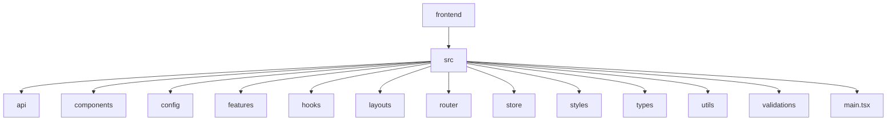

**Diagram sources**
- [frontend](file://frontend)
- [src](file://frontend/src)

**本节来源**
- [frontend](file://frontend)

## 技术栈与工程化体系

项目基于React 18与Vite构建，形成了现代化的前端工程化体系。Vite作为构建工具，提供了极速的开发服务器启动和热更新体验，同时通过Rollup进行生产环境的高效打包。

### 依赖管理

项目通过`package.json`明确定义了所有依赖关系，核心依赖包括：
- **React 18**: 采用最新的并发渲染特性
- **React Router v7**: 提供声明式路由管理
- **Ant Design**: 企业级UI组件库
- **Zustand**: 轻量级全局状态管理
- **@tanstack/react-query**: 服务端状态管理与数据同步

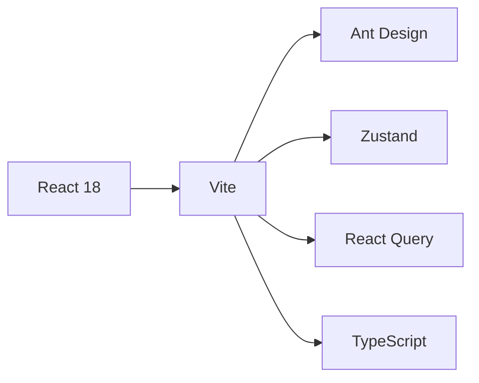

**Diagram sources**
- [package.json](file://frontend/package.json)

**本节来源**
- [package.json](file://frontend/package.json)

### 构建配置

Vite配置文件`vite.config.ts`实现了多项性能优化策略，包括代码压缩、代理设置和构建分块。

```typescript
// vite.config.ts 核心配置
export default defineConfig({
  plugins: [
    react(),
    // Gzip压缩
    viteCompression({ algorithm: 'gzip', ext: '.gz' }),
    // Brotli压缩
    viteCompression({ algorithm: 'brotliCompress', ext: '.br' })
  ],
  server: {
    proxy: {
      '/api': {
        target: 'https://caiwu-backend.bingyizhou6u.workers.dev',
        changeOrigin: true
      }
    }
  },
  build: {
    rollupOptions: {
      output: {
        manualChunks: {
          'react-vendor': ['react', 'react-dom', 'react-router-dom'],
          'antd': ['antd'],
          'vendor': ['@tanstack/react-query', 'dayjs', 'zustand']
        }
      }
    }
  }
})
```

通过`manualChunks`配置，将第三方库拆分为独立的代码块，实现按需加载，显著提升首屏加载性能。

**本节来源**
- [vite.config.ts](file://frontend/vite.config.ts)

## 核心架构设计

前端应用的核心架构设计遵循分层原则，确保代码的可维护性和可扩展性。应用入口`main.tsx`通过组合多个Provider，构建了完整的应用上下文。

### 应用入口

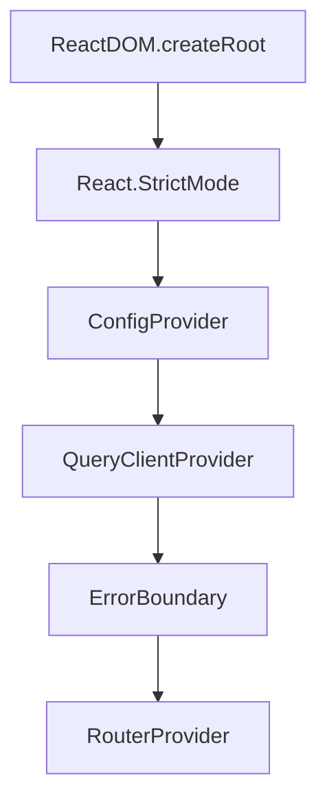

**Diagram sources**
- [main.tsx](file://frontend/src/main.tsx)

**本节来源**
- [main.tsx](file://frontend/src/main.tsx)

### 核心依赖注入

在`main.tsx`中，通过以下方式初始化核心依赖：

1. **React Query客户端配置**：设置全局数据缓存策略
2. **Ant Design配置**：应用主题和国际化
3. **路由提供者**：注入路由系统
4. **错误边界**：捕获未处理的异常

```typescript
// React Query配置
const queryClient = new QueryClient({
  defaultOptions: {
    queries: {
      staleTime: 5 * 60 * 1000, // 5分钟数据新鲜期
      gcTime: 10 * 60 * 1000,  // 10分钟垃圾回收时间
      retry: 1,                // 失败重试1次
      refetchOnWindowFocus: false // 窗口聚焦时不自动刷新
    }
  }
})
```

这种配置平衡了数据新鲜度和网络请求频率，优化了用户体验。

**本节来源**
- [main.tsx](file://frontend/src/main.tsx)

## 前端路由与懒加载机制

项目采用React Router v7实现路由管理，通过懒加载和Suspense机制优化性能。

### 路由配置

`router/index.tsx`文件定义了应用的路由结构，采用模块化配置方式。

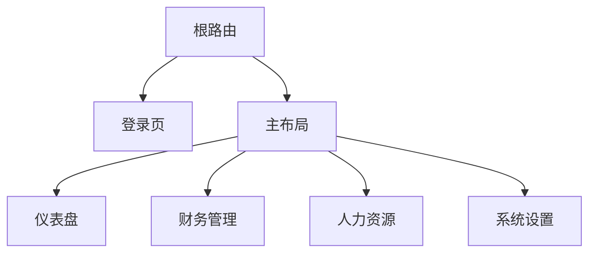

**Diagram sources**
- [router/index.tsx](file://frontend/src/router/index.tsx)

**本节来源**
- [router/index.tsx](file://frontend/src/router/index.tsx)

### 懒加载实现

路由系统通过`lazy`和`import()`语法实现组件的懒加载，配合`Suspense`提供加载状态。

```typescript
// 懒加载组件
const Dashboard = lazy(() => import('../features/dashboard/pages/Dashboard'))

// 路由配置中的Suspense包装
{
  path: 'dashboard', 
  element: <Suspense fallback={<Loading />}><Dashboard /></Suspense>
}
```

这种模式确保只有当用户导航到特定页面时，才加载对应的代码块，有效减少了初始包体积。

### 私有路由保护

通过`PrivateRoute`组件实现路由权限控制，确保未认证用户无法访问受保护的页面。

```typescript
export function PrivateRoute({ children }: { children: React.ReactNode }) {
    const { isAuthenticated, token, userInfo } = useAppStore()
    
    if (!isAuthenticated || !token || !userInfo) {
        return <Navigate to="/login" state={{ from: location }} replace />
    }
    
    return <>{children}</>
}
```

**本节来源**
- [router/index.tsx](file://frontend/src/router/index.tsx)
- [router/PrivateRoute.tsx](file://frontend/src/router/PrivateRoute.tsx)

## 状态管理方案

项目采用混合状态管理策略，结合Zustand和React Query解决不同场景的状态管理需求。

### 全局应用状态

`useAppStore`使用Zustand管理全局应用状态，包括UI状态和认证信息。

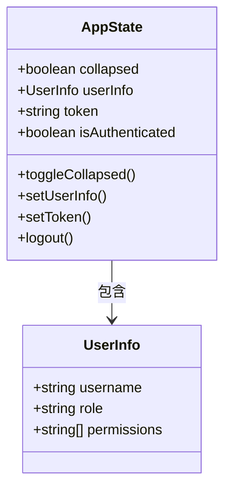

**Diagram sources**
- [store/useAppStore.ts](file://frontend/src/store/useAppStore.ts)

**本节来源**
- [store/useAppStore.ts](file://frontend/src/store/useAppStore.ts)

#### 状态持久化

通过Zustand的`persist`中间件，将关键状态持久化到localStorage。

```typescript
export const useAppStore = create<AppState>()(
  persist(
    (set) => ({
      collapsed: false,
      userInfo: null,
      token: null,
      isAuthenticated: false,
      // ...其他状态和方法
    }),
    {
      name: 'caiwu-app-storage',
      partialize: (state) => ({
        collapsed: state.collapsed,
        userInfo: state.userInfo,
        token: state.token,
      }),
      onRehydrateStorage: () => (state) => {
        if (state) {
          state.isAuthenticated = !!(state.token && state.userInfo)
        }
      },
    }
  )
)
```

### 服务端状态管理

React Query用于管理服务端状态，提供数据获取、缓存、同步和更新功能。

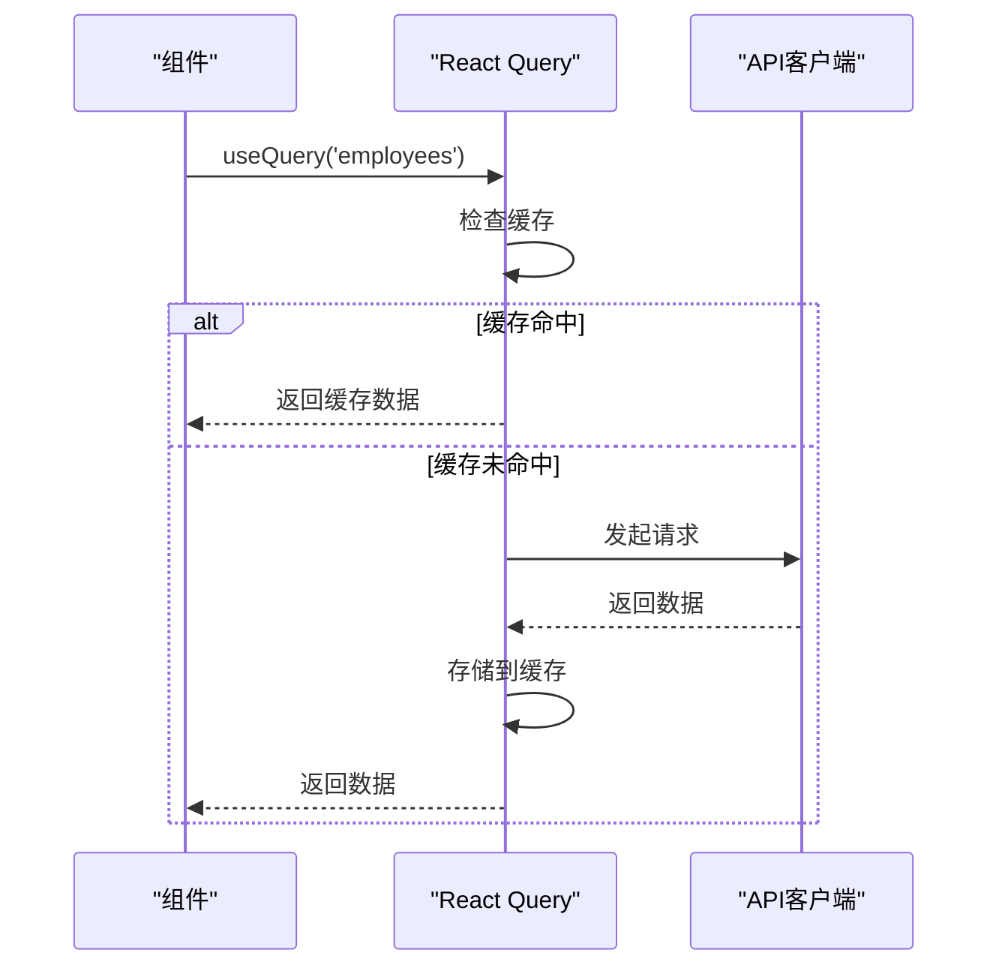

**Diagram sources**
- [hooks/business/useEmployees.ts](file://frontend/src/hooks/business/useEmployees.ts)
- [utils/useApiQuery.ts](file://frontend/src/utils/useApiQuery.ts)

**本节来源**
- [store/useAppStore.ts](file://frontend/src/store/useAppStore.ts)
- [hooks/business/useEmployees.ts](file://frontend/src/hooks/business/useEmployees.ts)
- [utils/useApiQuery.ts](file://frontend/src/utils/useApiQuery.ts)

## UI组件库与主题定制

项目集成Ant Design作为UI组件库，并进行了深度定制以满足企业级应用需求。

### 主题配置

`config/theme.ts`文件定义了统一的设计系统，包括颜色、字体、圆角等设计令牌。

```typescript
export const theme: ThemeConfig = {
    token: {
        colorPrimary: '#6366f1', // 主色调
        colorSuccess: '#10b981',
        colorWarning: '#f59e0b',
        colorError: '#ef4444',
        fontFamily: 'Inter, system-ui, -apple-system, BlinkMacSystemFont, "Segoe UI", Roboto, "Helvetica Neue", Arial, "Noto Sans", sans-serif',
        fontSize: 14,
        borderRadius: 8,
    },
    components: {
        Layout: {
            bodyBg: '#f8fafc',
            headerBg: 'rgba(255, 255, 255, 0.8)',
            siderBg: '#0f172a',
        },
        Button: {
            borderRadius: 8,
            controlHeight: 36,
            primaryShadow: '0 4px 6px -1px rgba(99, 102, 241, 0.4), 0 2px 4px -1px rgba(99, 102, 241, 0.2)',
        }
    }
}
```

### 国际化支持

在应用入口处配置Ant Design的中文语言包，实现界面的本地化。

```typescript
import zhCN from 'antd/locale/zh_CN'

<ConfigProvider
  locale={zhCN}
  theme={theme}
>
  {/* 应用内容 */}
</ConfigProvider>
```

**本节来源**
- [config/theme.ts](file://frontend/src/config/theme.ts)
- [main.tsx](file://frontend/src/main.tsx)

## 核心布局组件设计

项目设计了多个可复用的布局组件，其中`PageContainer`是核心的页面容器组件。

### PageContainer组件

`PageContainer`组件提供了一致的页面布局模式，包含面包屑导航、标题和操作区域。

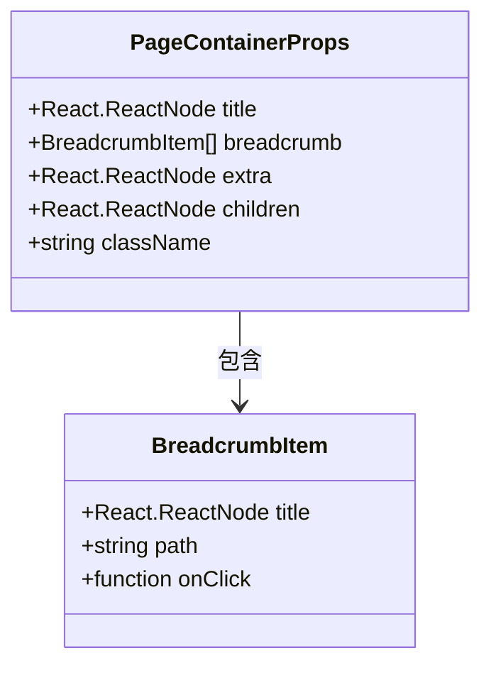

**Diagram sources**
- [components/PageContainer.tsx](file://frontend/src/components/PageContainer.tsx)

**本节来源**
- [components/PageContainer.tsx](file://frontend/src/components/PageContainer.tsx)

### 主布局设计

`MainLayout`组件实现了应用的整体布局，包含侧边栏、头部和内容区域。

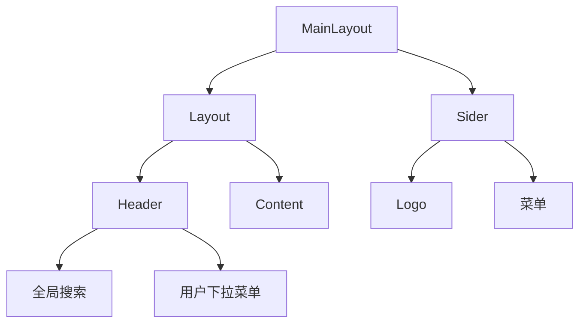

**Diagram sources**
- [layouts/MainLayout.tsx](file://frontend/src/layouts/MainLayout.tsx)

**本节来源**
- [layouts/MainLayout.tsx](file://frontend/src/layouts/MainLayout.tsx)

## 前后端通信机制

项目建立了完善的前后端通信机制，确保数据交互的安全性和可靠性。

### HTTP客户端封装

`api/http.ts`文件封装了底层的HTTP请求，提供了统一的错误处理和认证机制。

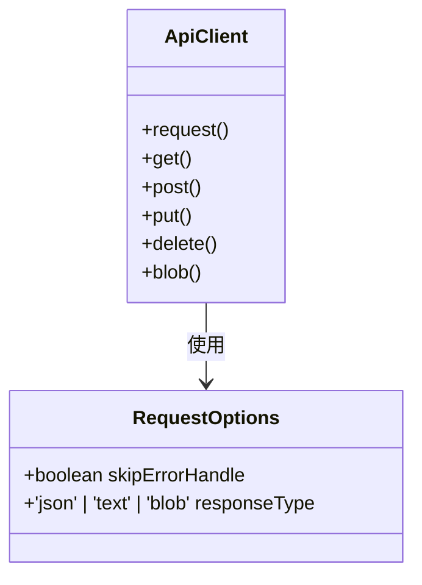

**Diagram sources**
- [api/http.ts](file://frontend/src/api/http.ts)

**本节来源**
- [api/http.ts](file://frontend/src/api/http.ts)

### API配置管理

`config/api.ts`文件集中管理所有API端点，支持开发和生产环境的差异化配置。

```typescript
const API_BASE = import.meta.env.DEV
  ? 'http://127.0.0.1:8787'
  : ''

export const api = {
  base: API_BASE,
  auth: {
    login: `${API_BASE}/api/auth/login`,
    logout: `${API_BASE}/api/auth/logout`,
  },
  employees: `${API_BASE}/api/employees`,
  // ...其他API端点
}
```

### 错误处理策略

项目实现了多层次的错误处理机制，包括全局错误处理和操作级错误处理。

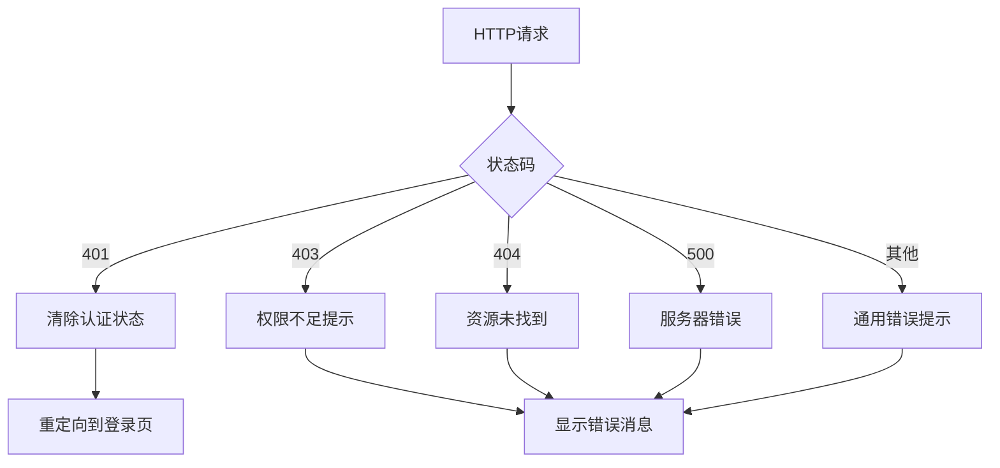

**Diagram sources**
- [utils/errorHandler.ts](file://frontend/src/utils/errorHandler.ts)

**本节来源**
- [api/http.ts](file://frontend/src/api/http.ts)
- [config/api.ts](file://frontend/src/config/api.ts)
- [utils/errorHandler.ts](file://frontend/src/utils/errorHandler.ts)

## 组件分层与开发规范

项目遵循清晰的组件分层结构，确保代码的可维护性和团队协作效率。

### 目录结构规范

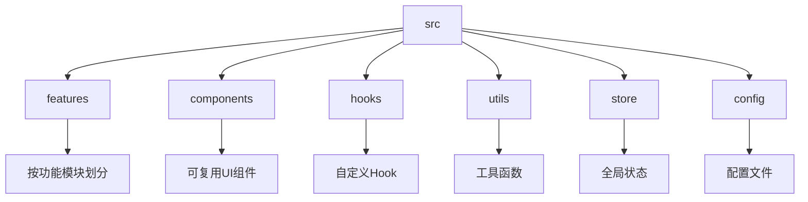

**Diagram sources**
- [frontend/src](file://frontend/src)

**本节来源**
- [frontend/src](file://frontend/src)

### 功能模块组织

`features`目录按业务功能组织，每个功能模块包含页面、组件和表单。

```
features/
├── employees/
│   ├── pages/
│   ├── components/
│   │   └── forms/
│   │       └── EmployeeForm.tsx
│   └── modals/
└── finance/
    ├── pages/
    └── components/
```

### Hook设计模式

项目通过自定义Hook封装业务逻辑，提高代码复用性。

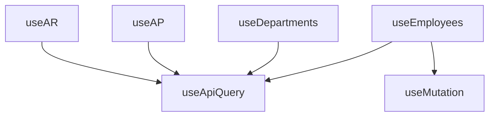

**Diagram sources**
- [hooks/business/useEmployees.ts](file://frontend/src/hooks/business/useEmployees.ts)
- [utils/useApiQuery.ts](file://frontend/src/utils/useApiQuery.ts)

**本节来源**
- [hooks/business/useEmployees.ts](file://frontend/src/hooks/business/useEmployees.ts)
- [utils/useApiQuery.ts](file://frontend/src/utils/useApiQuery.ts)

## 最佳实践与开发模式

项目通过一系列最佳实践确保代码质量和开发效率。

### 标准开发模式

以`EmployeeForm`为例，展示了标准的表单开发模式。

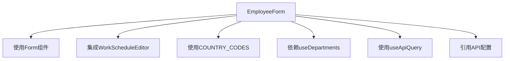

**Diagram sources**
- [features/employees/components/forms/EmployeeForm.tsx](file://frontend/src/features/employees/components/forms/EmployeeForm.tsx)

**本节来源**
- [features/employees/components/forms/EmployeeForm.tsx](file://frontend/src/features/employees/components/forms/EmployeeForm.tsx)

### 权限控制实现

通过`config/menu.ts`文件实现基于角色的菜单权限控制。

```typescript
export const buildMenuItems = (userInfo: any): MenuProps['items'] => {
    const items: MenuProps['items'] = []
    
    // 根据用户权限动态生成菜单
    if (hasPermission(userInfo, 'finance', 'flow', 'view')) {
        finance.push({ key: 'flows', label: '收支记账' })
    }
    
    return items
}
```

### 数据缓存策略

React Query的缓存策略确保了数据的一致性和性能优化。

```typescript
// 数据新鲜期5分钟
staleTime: 5 * 60 * 1000,
// 垃圾回收时间10分钟
gcTime: 10 * 60 * 1000,
// 窗口聚焦时不自动刷新
refetchOnWindowFocus: false
```

**本节来源**
- [features/employees/components/forms/EmployeeForm.tsx](file://frontend/src/features/employees/components/forms/EmployeeForm.tsx)
- [config/menu.ts](file://frontend/src/config/menu.ts)
- [main.tsx](file://frontend/src/main.tsx)