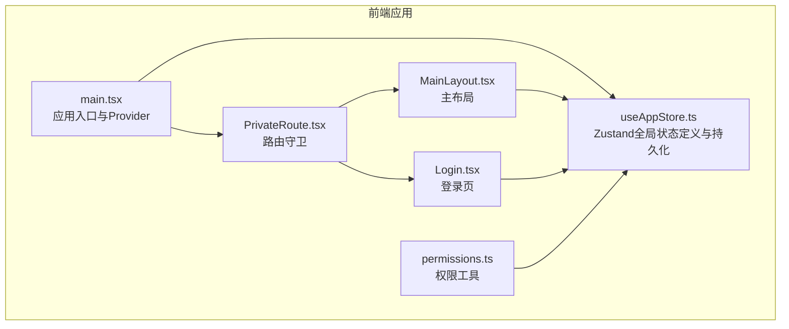
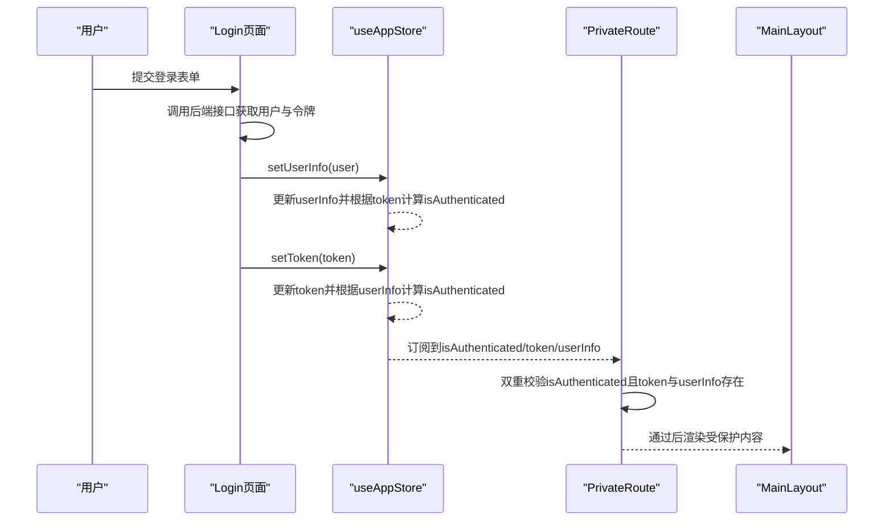
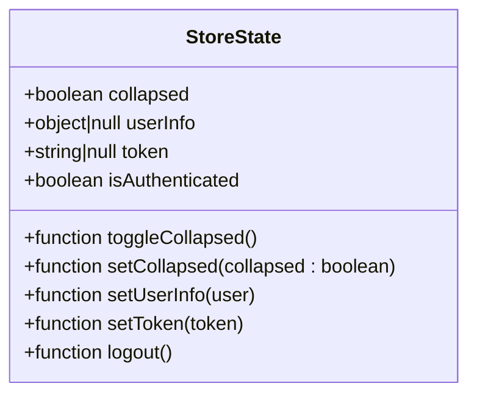
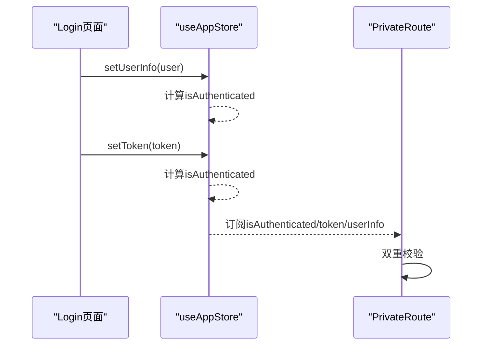
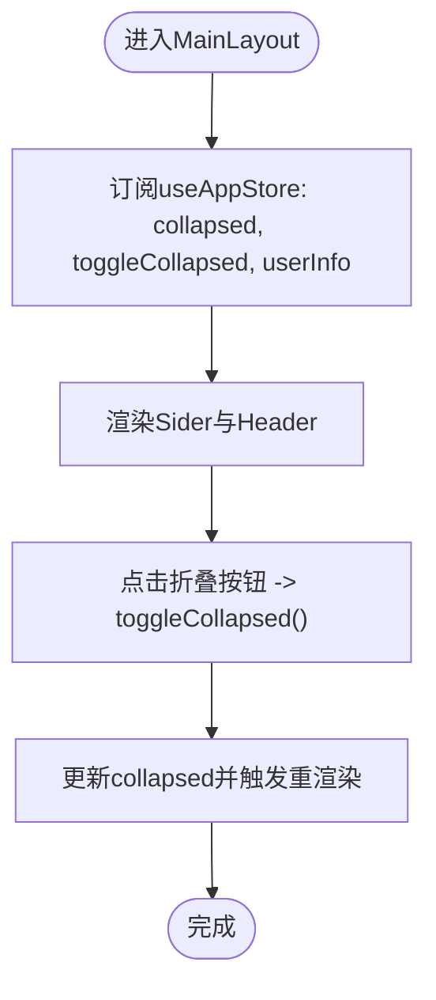
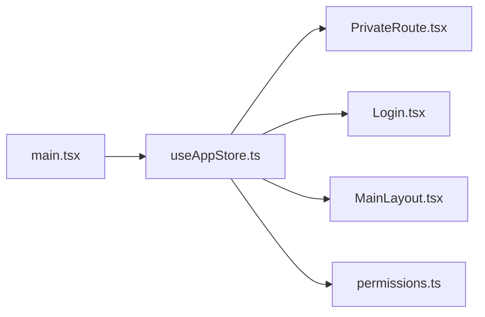

# 全局状态管理

<cite>
**本文引用的文件列表**
- [useAppStore.ts](file://frontend/src/store/useAppStore.ts)
- [PrivateRoute.tsx](file://frontend/src/router/PrivateRoute.tsx)
- [Login.tsx](file://frontend/src/features/auth/pages/Login.tsx)
- [MainLayout.tsx](file://frontend/src/layouts/MainLayout.tsx)
- [permissions.ts](file://frontend/src/utils/permissions.ts)
- [domain.ts](file://frontend/src/types/domain.ts)
- [auth.ts](file://frontend/src/types/auth.ts)
- [main.tsx](file://frontend/src/main.tsx)
</cite>

## 目录
1. [引言](#引言)
2. [项目结构](#项目结构)
3. [核心组件](#核心组件)
4. [架构总览](#架构总览)
5. [详细组件分析](#详细组件分析)
6. [依赖关系分析](#依赖关系分析)
7. [性能考量](#性能考量)
8. [故障排查指南](#故障排查指南)
9. [结论](#结论)
10. [附录](#附录)

## 引言
本文件围绕前端仓库中的全局状态管理实现进行深入解析，重点聚焦于基于 Zustand 的 useAppStore，阐述其对用户会话、权限信息与 UI 状态（如侧边栏折叠状态）的集中管理机制；详解 persist 中间件如何通过 localStorage 实现登录态与界面偏好的持久化；并深入分析 onRehydrateStorage 在状态恢复时重新计算 isAuthenticated 字段的实现逻辑。同时，结合代码示例路径，展示 setUserInfo、setToken、logout 等核心方法的调用流程及其对全局状态的影响；解释状态选择器（state selectors）在组件中高效订阅局部状态、避免不必要重渲染的实践方式；最后提供状态初始化、跨组件状态共享、持久化安全考量及调试技巧等高级主题指导。

## 项目结构
本项目的全局状态集中在前端 store 目录下，采用 Zustand 管理应用状态，配合 persist 中间件实现本地持久化。路由守卫与页面组件通过 useAppStore 订阅所需状态，形成清晰的“状态定义—持久化—订阅—使用”的闭环。

图表来源
- [main.tsx](file://frontend/src/main.tsx#L1-L43)
- [useAppStore.ts](file://frontend/src/store/useAppStore.ts#L1-L64)
- [PrivateRoute.tsx](file://frontend/src/router/PrivateRoute.tsx#L1-L15)
- [Login.tsx](file://frontend/src/features/auth/pages/Login.tsx#L1-L258)
- [MainLayout.tsx](file://frontend/src/layouts/MainLayout.tsx#L1-L146)
- [permissions.ts](file://frontend/src/utils/permissions.ts#L1-L100)

章节来源
- [main.tsx](file://frontend/src/main.tsx#L1-L43)
- [useAppStore.ts](file://frontend/src/store/useAppStore.ts#L1-L64)

## 核心组件
- useAppStore：定义了 UI 状态（collapsed、toggleCollapsed、setCollapsed）与认证/用户状态（userInfo、token、isAuthenticated），以及 setUserInfo、setToken、logout 方法；通过 persist 中间件实现部分状态的本地持久化，并在恢复后重新计算 isAuthenticated。
- PrivateRoute：基于 useAppStore 的 isAuthenticated、token、userInfo 进行双重校验，确保即使 localStorage 被篡改也能防止未授权访问。
- Login 页面：在登录成功后调用 setUserInfo 与 setToken，从而驱动全局状态更新并触发路由跳转。
- MainLayout：展示侧边栏折叠控制与用户信息显示，体现 UI 状态与用户信息的联动。
- permissions 工具：从 useAppStore 中读取 userInfo，封装权限判断与角色判定逻辑，供页面组件使用。

章节来源
- [useAppStore.ts](file://frontend/src/store/useAppStore.ts#L1-L64)
- [PrivateRoute.tsx](file://frontend/src/router/PrivateRoute.tsx#L1-L15)
- [Login.tsx](file://frontend/src/features/auth/pages/Login.tsx#L1-L258)
- [MainLayout.tsx](file://frontend/src/layouts/MainLayout.tsx#L1-L146)
- [permissions.ts](file://frontend/src/utils/permissions.ts#L1-L100)

## 架构总览
下面以序列图展示登录流程中状态变化的关键步骤，包括 setUserInfo、setToken 对 isAuthenticated 的影响，以及路由守卫的校验逻辑。

图表来源
- [Login.tsx](file://frontend/src/features/auth/pages/Login.tsx#L1-L258)
- [useAppStore.ts](file://frontend/src/store/useAppStore.ts#L1-L64)
- [PrivateRoute.tsx](file://frontend/src/router/PrivateRoute.tsx#L1-L15)

## 详细组件分析

### useAppStore：状态模型与持久化策略
- 数据模型
  - UI 状态：collapsed（布尔）、toggleCollapsed（切换函数）、setCollapsed（设置函数）
  - 认证/用户状态：userInfo（用户信息或空）、token（令牌或空）、isAuthenticated（布尔，由 token 与 userInfo 共同决定）
- 方法
  - setUserInfo：更新 userInfo，并根据当前 token 重新计算 isAuthenticated
  - setToken：更新 token，并根据当前 userInfo 重新计算 isAuthenticated
  - logout：清空 userInfo、token 与 isAuthenticated
- 持久化配置
  - name：存储键名前缀
  - partialize：仅持久化 collapsed、userInfo、token，不持久化 computed 字段 isAuthenticated
  - onRehydrateStorage：从 localStorage 恢复后，重新计算 isAuthenticated，确保状态一致性
- 设计要点
  - 将 isAuthenticated 设为 computed 字段，避免重复持久化导致的不一致
  - 通过 onRehydrateStorage 在恢复阶段统一校正，保证即使手动篡改 localStorage 也不会破坏一致性

图表来源
- [useAppStore.ts](file://frontend/src/store/useAppStore.ts#L1-L64)

章节来源
- [useAppStore.ts](file://frontend/src/store/useAppStore.ts#L1-L64)

### 登录流程与状态更新
- 登录成功后，Login 页面调用 setUserInfo 与 setToken，分别更新用户信息与令牌
- 由于 isAuthenticated 是 computed 字段，每次 setUserInfo 或 setToken 后都会根据双方是否存在自动更新
- 路由守卫 PrivateRoute 会基于 isAuthenticated、token、userInfo 进行二次校验，确保安全

图表来源
- [Login.tsx](file://frontend/src/features/auth/pages/Login.tsx#L1-L258)
- [useAppStore.ts](file://frontend/src/store/useAppStore.ts#L1-L64)
- [PrivateRoute.tsx](file://frontend/src/router/PrivateRoute.tsx#L1-L15)

章节来源
- [Login.tsx](file://frontend/src/features/auth/pages/Login.tsx#L1-L258)
- [useAppStore.ts](file://frontend/src/store/useAppStore.ts#L1-L64)
- [PrivateRoute.tsx](file://frontend/src/router/PrivateRoute.tsx#L1-L15)

### 侧边栏折叠状态与用户信息联动
- MainLayout 通过 useAppStore 订阅 collapsed、toggleCollapsed、userInfo 等状态
- 侧边栏宽度与图标随 collapsed 变化，用户头像与名称来自 userInfo
- 该模式体现了 UI 状态与用户信息的解耦与组合使用

图表来源
- [MainLayout.tsx](file://frontend/src/layouts/MainLayout.tsx#L1-L146)
- [useAppStore.ts](file://frontend/src/store/useAppStore.ts#L1-L64)

章节来源
- [MainLayout.tsx](file://frontend/src/layouts/MainLayout.tsx#L1-L146)
- [useAppStore.ts](file://frontend/src/store/useAppStore.ts#L1-L64)

### 权限工具与状态选择器实践
- permissions 工具通过 useAppStore 读取 userInfo，封装 hasPermission、isManager、isHQ、isFinance、isHR 等便捷方法
- 该模式体现了“状态选择器”的思想：组件仅订阅自身需要的部分状态，避免不必要的重渲染
- 与直接在组件内解构整个 store 不同，permissions 将状态选择与业务逻辑分离，提升可维护性

章节来源
- [permissions.ts](file://frontend/src/utils/permissions.ts#L1-L100)
- [useAppStore.ts](file://frontend/src/store/useAppStore.ts#L1-L64)

### 路由守卫与安全校验
- PrivateRoute 基于 isAuthenticated、token、userInfo 进行三重校验，即便 localStorage 被篡改，只要内存态为空也不会放行
- 这种设计提升了安全性，防止恶意伪造登录态

章节来源
- [PrivateRoute.tsx](file://frontend/src/router/PrivateRoute.tsx#L1-L15)

## 依赖关系分析
- 应用入口 main.tsx 配置了 React Query 与主题 Provider，为全局状态提供运行环境
- useAppStore 作为全局状态源，被路由守卫、登录页、主布局、权限工具等多处组件依赖
- 路由守卫依赖 useAppStore 的认证状态，登录页依赖 useAppStore 更新认证状态，主布局依赖 useAppStore 渲染 UI 与用户信息

图表来源
- [main.tsx](file://frontend/src/main.tsx#L1-L43)
- [useAppStore.ts](file://frontend/src/store/useAppStore.ts#L1-L64)
- [PrivateRoute.tsx](file://frontend/src/router/PrivateRoute.tsx#L1-L15)
- [Login.tsx](file://frontend/src/features/auth/pages/Login.tsx#L1-L258)
- [MainLayout.tsx](file://frontend/src/layouts/MainLayout.tsx#L1-L146)
- [permissions.ts](file://frontend/src/utils/permissions.ts#L1-L100)

章节来源
- [main.tsx](file://frontend/src/main.tsx#L1-L43)
- [useAppStore.ts](file://frontend/src/store/useAppStore.ts#L1-L64)
- [PrivateRoute.tsx](file://frontend/src/router/PrivateRoute.tsx#L1-L15)
- [Login.tsx](file://frontend/src/features/auth/pages/Login.tsx#L1-L258)
- [MainLayout.tsx](file://frontend/src/layouts/MainLayout.tsx#L1-L146)
- [permissions.ts](file://frontend/src/utils/permissions.ts#L1-L100)

## 性能考量
- 状态选择器（state selectors）：组件仅订阅所需字段，避免因全局状态变更引发不必要的重渲染。例如在权限工具中，仅读取 userInfo，不在组件内部解构整个 store。
- 计算字段与持久化：isAuthenticated 作为 computed 字段不参与持久化，减少冗余存储与恢复时的复杂度。
- onRehydrateStorage：在恢复阶段统一修正 computed 字段，避免持久化数据与运行时状态不一致带来的额外判断成本。
- 事件驱动更新：setUserInfo、setToken 采用函数式更新，确保在并发场景下状态计算稳定。

[本节为通用性能建议，无需列出具体文件来源]

## 故障排查指南
- 登录后仍提示未登录
  - 检查 setUserInfo 与 setToken 是否按顺序调用，确保两者均非空才使 isAuthenticated 为真
  - 查看 localStorage 中存储的 collapsed、userInfo、token 是否完整
  - 确认 onRehydrateStorage 是否执行，恢复后 isAuthenticated 是否被正确重算
- 路由跳转异常
  - 检查 PrivateRoute 的三重校验逻辑，确认 isAuthenticated、token、userInfo 均存在
- 侧边栏状态不同步
  - 确认 MainLayout 中订阅的 collapsed 与 toggleCollapsed 是否正确使用
- 权限判断失效
  - 检查 permissions 工具中对 userInfo 的读取是否正确，以及权限结构是否符合预期

章节来源
- [useAppStore.ts](file://frontend/src/store/useAppStore.ts#L1-L64)
- [PrivateRoute.tsx](file://frontend/src/router/PrivateRoute.tsx#L1-L15)
- [MainLayout.tsx](file://frontend/src/layouts/MainLayout.tsx#L1-L146)
- [permissions.ts](file://frontend/src/utils/permissions.ts#L1-L100)

## 结论
本项目通过 Zustand 与 persist 中间件实现了简洁而安全的全局状态管理：
- 将认证状态与 UI 状态集中在一个 store 中，便于跨组件共享
- 采用 computed 字段与 onRehydrateStorage，确保状态一致性与安全性
- 通过状态选择器与路由守卫，实现高效订阅与严格校验
- 登录流程清晰，setUserInfo、setToken、logout 等方法职责明确，易于扩展与维护

[本节为总结性内容，无需列出具体文件来源]

## 附录

### 关键方法与调用流程示例路径
- 登录成功后设置用户信息与令牌
  - [Login.tsx](file://frontend/src/features/auth/pages/Login.tsx#L1-L258)
- 退出登录清理状态
  - [MainLayout.tsx](file://frontend/src/layouts/MainLayout.tsx#L1-L146)
  - [useAppStore.ts](file://frontend/src/store/useAppStore.ts#L1-L64)
- 路由守卫校验
  - [PrivateRoute.tsx](file://frontend/src/router/PrivateRoute.tsx#L1-L15)

### 类型与数据模型参考
- 用户与权限类型
  - [domain.ts](file://frontend/src/types/domain.ts#L1-L200)
- 认证相关类型
  - [auth.ts](file://frontend/src/types/auth.ts#L1-L26)