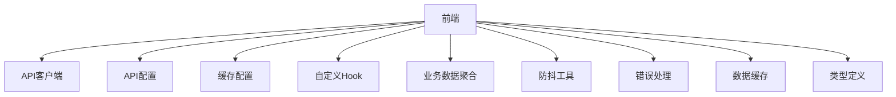
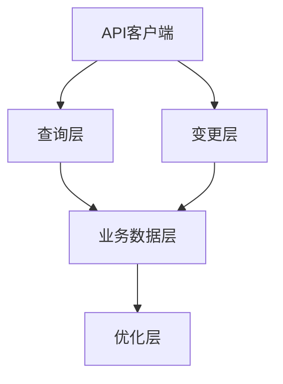
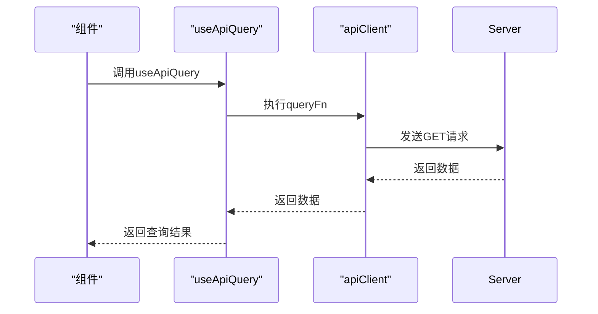
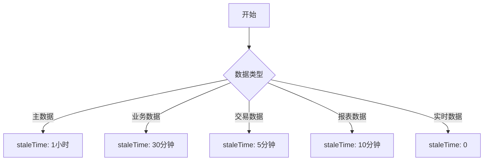
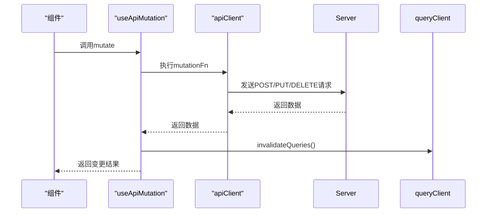
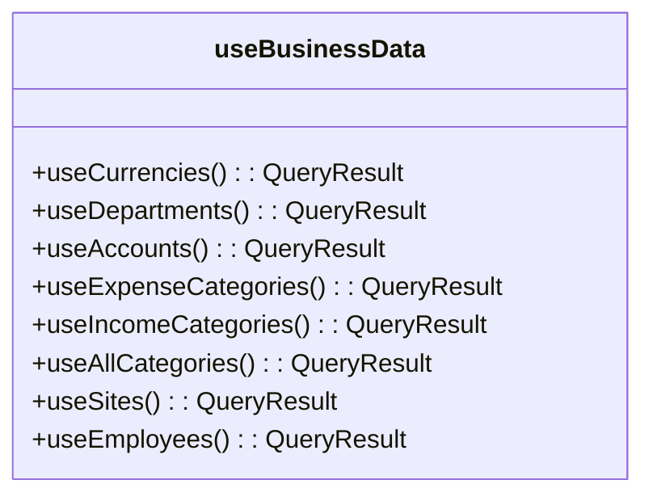
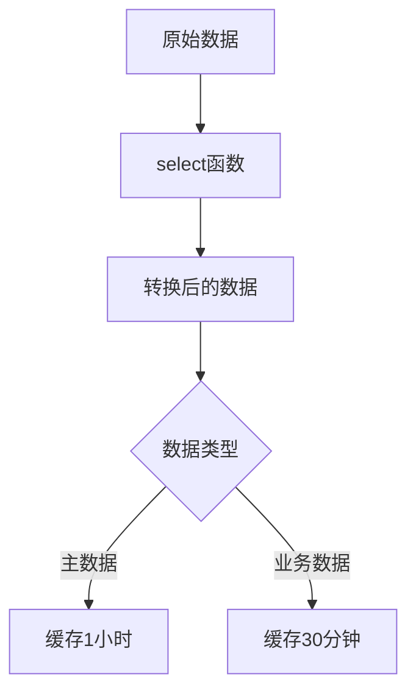
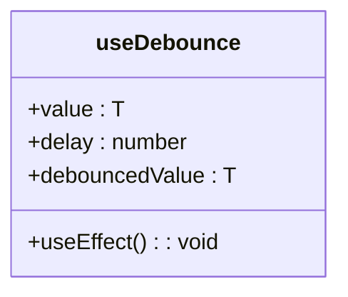
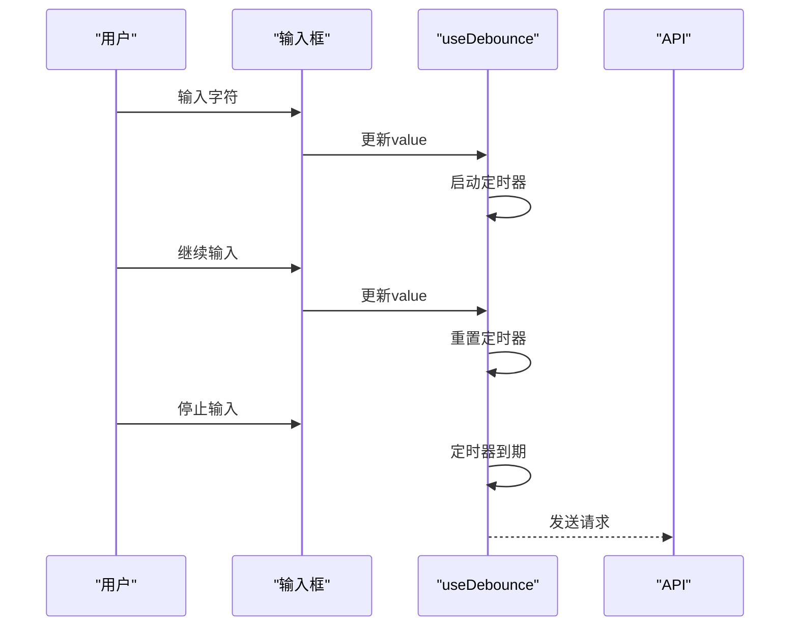

# 服务端状态管理

<cite>
**本文档引用的文件**  
- [useApiQuery.ts](file://frontend/src/utils/useApiQuery.ts)
- [useBusinessData.ts](file://frontend/src/hooks/useBusinessData.ts)
- [useDebounce.ts](file://frontend/src/hooks/useDebounce.ts)
- [cache.ts](file://frontend/src/config/cache.ts)
- [http.ts](file://frontend/src/api/http.ts)
- [errorHandler.ts](file://frontend/src/utils/errorHandler.ts)
- [useCurrencies.ts](file://frontend/src/hooks/business/useCurrencies.ts)
- [useDepartments.ts](file://frontend/src/hooks/business/useDepartments.ts)
- [useEmployees.ts](file://frontend/src/hooks/business/useEmployees.ts)
- [useFlows.ts](file://frontend/src/hooks/business/useFlows.ts)
- [api.ts](file://frontend/src/config/api.ts)
- [business.ts](file://frontend/src/types/business.ts)
- [loaders.ts](file://frontend/src/utils/loaders.ts)
</cite>

## 目录
1. [简介](#简介)
2. [项目结构](#项目结构)
3. [核心组件](#核心组件)
4. [架构概述](#架构概述)
5. [详细组件分析](#详细组件分析)
6. [依赖分析](#依赖分析)
7. [性能考虑](#性能考虑)
8. [故障排除指南](#故障排除指南)
9. [结论](#结论)

## 简介
本文档全面阐述了基于React Query的服务端状态管理架构，重点解析了`useApiQuery`封装的统一数据获取策略、`useApiMutation`在变更操作中的处理逻辑、`useBusinessData`中业务数据聚合层的实现，以及`useDebounce`在高频交互场景中的性能优化作用。文档还涵盖了错误处理、加载状态管理、乐观更新实现及查询性能调优等实战指南。

## 项目结构
项目采用分层架构，前端代码位于`frontend`目录下，主要结构如下：
- `src/api/http.ts`: API客户端实现，封装了HTTP请求逻辑
- `src/config/api.ts`: API端点配置
- `src/config/cache.ts`: 缓存时间配置
- `src/hooks/`: 自定义Hook，包括`useApiQuery`、`useApiMutation`等
- `src/hooks/business/`: 业务相关的自定义Hook
- `src/hooks/useBusinessData.ts`: 业务数据聚合层
- `src/hooks/useDebounce.ts`: 防抖Hook
- `src/utils/errorHandler.ts`: 错误处理工具
- `src/utils/cache.ts`: 数据缓存工具
- `src/types/business.ts`: 业务类型定义



**Diagram sources**
- [http.ts](file://frontend/src/api/http.ts)
- [api.ts](file://frontend/src/config/api.ts)
- [cache.ts](file://frontend/src/config/cache.ts)
- [useApiQuery.ts](file://frontend/src/utils/useApiQuery.ts)
- [useBusinessData.ts](file://frontend/src/hooks/useBusinessData.ts)
- [useDebounce.ts](file://frontend/src/hooks/useDebounce.ts)
- [errorHandler.ts](file://frontend/src/utils/errorHandler.ts)
- [cache.ts](file://frontend/src/utils/cache.ts)
- [business.ts](file://frontend/src/types/business.ts)

**Section sources**
- [http.ts](file://frontend/src/api/http.ts)
- [api.ts](file://frontend/src/config/api.ts)
- [cache.ts](file://frontend/src/config/cache.ts)
- [useApiQuery.ts](file://frontend/src/utils/useApiQuery.ts)
- [useBusinessData.ts](file://frontend/src/hooks/useBusinessData.ts)
- [useDebounce.ts](file://frontend/src/hooks/useDebounce.ts)
- [errorHandler.ts](file://frontend/src/utils/errorHandler.ts)
- [cache.ts](file://frontend/src/utils/cache.ts)
- [business.ts](file://frontend/src/types/business.ts)

## 核心组件
核心组件包括`useApiQuery`、`useApiMutation`、`useBusinessData`和`useDebounce`。这些组件共同构成了服务端状态管理的基础。

**Section sources**
- [useApiQuery.ts](file://frontend/src/utils/useApiQuery.ts)
- [useBusinessData.ts](file://frontend/src/hooks/useBusinessData.ts)
- [useDebounce.ts](file://frontend/src/hooks/useDebounce.ts)

## 架构概述
系统采用React Query作为服务端状态管理的核心库，通过自定义Hook封装了统一的数据获取和变更策略。架构分为以下几个层次：
1. **API客户端层**: 封装HTTP请求逻辑
2. **查询层**: 使用`useApiQuery`进行数据获取
3. **变更层**: 使用`useApiMutation`进行数据变更
4. **业务数据层**: 使用`useBusinessData`聚合业务数据
5. **优化层**: 使用`useDebounce`优化高频交互



**Diagram sources**
- [useApiQuery.ts](file://frontend/src/utils/useApiQuery.ts)
- [useBusinessData.ts](file://frontend/src/hooks/useBusinessData.ts)
- [useDebounce.ts](file://frontend/src/hooks/useDebounce.ts)

## 详细组件分析

### useApiQuery分析
`useApiQuery`是统一的数据获取Hook，封装了React Query的`useQuery`功能。

```mermaid
classDiagram
class useApiQuery {
+queryKey : any
+url : string
+options : {
enabled? : boolean
staleTime? : number
refetchInterval? : number
select? : (data : any) => any
}
+useQuery() : QueryResult
}
```

**Diagram sources**
- [useApiQuery.ts](file://frontend/src/utils/useApiQuery.ts)

#### 查询键设计规范
查询键采用数组形式，便于参数化和缓存管理。例如：
- `['currencies']`: 币种列表
- `['departments', 'options', includeHQ]`: 部门选项，包含是否包含总部的参数

**Section sources**
- [useApiQuery.ts](file://frontend/src/utils/useApiQuery.ts)

#### 异步请求执行机制
通过`queryFn`执行异步请求，使用`apiClient.get`方法获取数据。



**Diagram sources**
- [useApiQuery.ts](file://frontend/src/utils/useApiQuery.ts)
- [http.ts](file://frontend/src/api/http.ts)

#### 缓存策略配置
通过`staleTime`和`refetchInterval`配置缓存策略，不同数据类型有不同的缓存时间。



**Diagram sources**
- [cache.ts](file://frontend/src/config/cache.ts)
- [useApiQuery.ts](file://frontend/src/utils/useApiQuery.ts)

### useApiMutation分析
`useApiMutation`是统一的变更Hook，封装了React Query的`useMutation`功能。

```mermaid
classDiagram
class useApiMutation {
+onSuccessCallback? : (data : TData) => void
+mutationFn : async ({ url, method, body }) => TData
+onSuccess : (data) => void
+useMutation() : MutationResult
}
```

**Diagram sources**
- [useApiQuery.ts](file://frontend/src/utils/useApiQuery.ts)

#### 变更处理逻辑
在创建、更新、删除操作中，`useApiMutation`处理变更逻辑。



**Diagram sources**
- [useApiQuery.ts](file://frontend/src/utils/useApiQuery.ts)
- [http.ts](file://frontend/src/api/http.ts)

#### 自动缓存更新机制
在`onSuccess`回调中，通过`queryClient.invalidateQueries()`触发自动缓存更新。

```mermaid
flowchart TD
A[变更成功] --> B[调用onSuccess]
B --> C[queryClient.invalidateQueries()]
C --> D[相关查询重新获取数据]
D --> E[UI自动更新]
```

**Diagram sources**
- [useApiQuery.ts](file://frontend/src/utils/useApiQuery.ts)

### useBusinessData分析
`useBusinessData`是业务数据聚合层，封装了API调用并应用数据转换与缓存分层策略。



**Diagram sources**
- [useBusinessData.ts](file://frontend/src/hooks/useBusinessData.ts)

#### 数据转换与缓存分层
通过`select`函数进行数据转换，应用不同的缓存时间。



**Diagram sources**
- [useBusinessData.ts](file://frontend/src/hooks/useBusinessData.ts)
- [cache.ts](file://frontend/src/config/cache.ts)

### useDebounce分析
`useDebounce`在搜索输入等高频交互场景中优化性能。



**Diagram sources**
- [useDebounce.ts](file://frontend/src/hooks/useDebounce.ts)

#### 高频交互性能优化
通过防抖减少不必要的API调用。



**Diagram sources**
- [useDebounce.ts](file://frontend/src/hooks/useDebounce.ts)

## 依赖分析
系统依赖关系如下：

```mermaid
graph TD
A[useApiQuery] --> B[React Query]
A --> C[apiClient]
D[useApiMutation] --> B
D --> C
E[useBusinessData] --> A
F[useDebounce] --> React
G[errorHandler] --> Ant Design
H[cache] --> Map
```

**Diagram sources**
- [useApiQuery.ts](file://frontend/src/utils/useApiQuery.ts)
- [useBusinessData.ts](file://frontend/src/hooks/useBusinessData.ts)
- [useDebounce.ts](file://frontend/src/hooks/useDebounce.ts)
- [errorHandler.ts](file://frontend/src/utils/errorHandler.ts)
- [cache.ts](file://frontend/src/utils/cache.ts)

**Section sources**
- [useApiQuery.ts](file://frontend/src/utils/useApiQuery.ts)
- [useBusinessData.ts](file://frontend/src/hooks/useBusinessData.ts)
- [useDebounce.ts](file://frontend/src/hooks/useDebounce.ts)
- [errorHandler.ts](file://frontend/src/utils/errorHandler.ts)
- [cache.ts](file://frontend/src/utils/cache.ts)

## 性能考虑
- 使用`staleTime`和`refetchInterval`优化缓存策略
- 通过`useDebounce`减少高频交互的API调用
- 使用`select`函数进行数据转换，避免在组件中进行复杂计算
- 通过`invalidateQueries`精确控制缓存更新

## 故障排除指南
- **401错误**: 检查token是否过期，重新登录
- **网络错误**: 检查网络连接，重试请求
- **数据不更新**: 检查`invalidateQueries`是否正确调用
- **性能问题**: 检查防抖设置，优化缓存策略

**Section sources**
- [http.ts](file://frontend/src/api/http.ts)
- [errorHandler.ts](file://frontend/src/utils/errorHandler.ts)

## 结论
本文档详细阐述了基于React Query的服务端状态管理架构，展示了如何通过`useApiQuery`、`useApiMutation`、`useBusinessData`和`useDebounce`等自定义Hook构建高效、可维护的状态管理方案。通过合理的缓存策略、自动缓存更新机制和性能优化，系统能够提供流畅的用户体验。