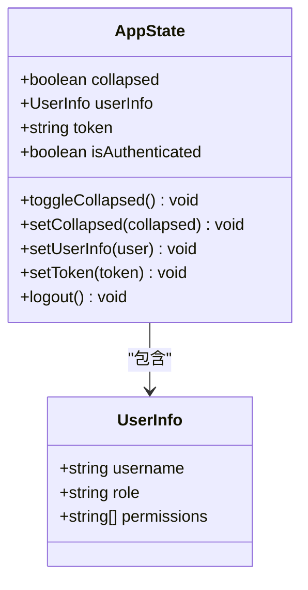
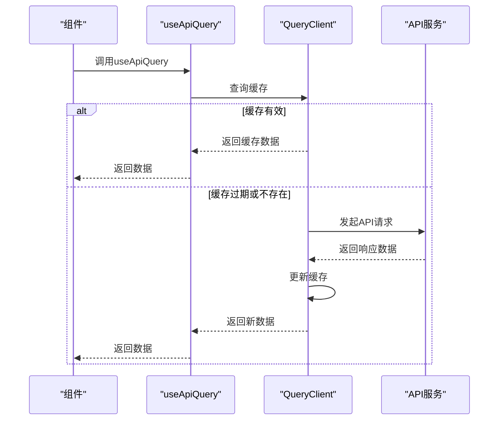
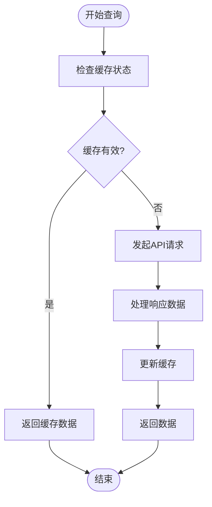
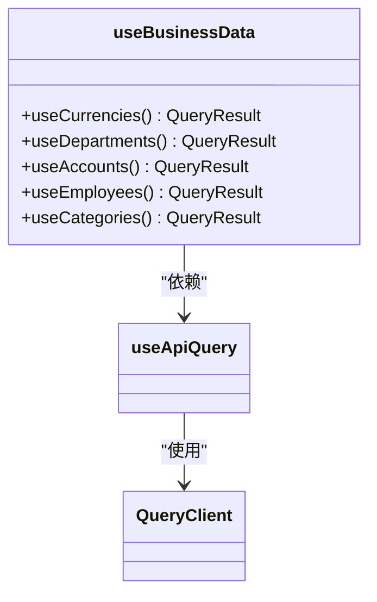
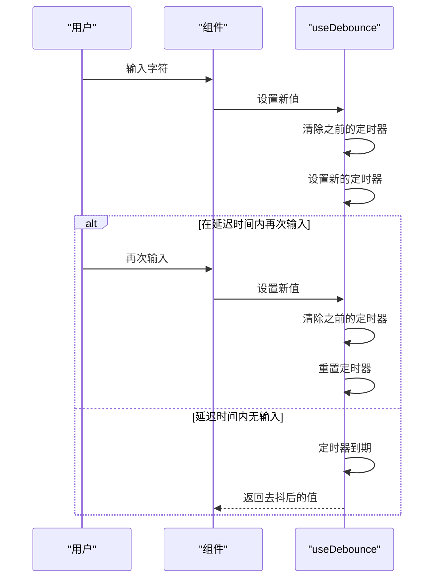

# 状态管理

<cite>
**本文档引用的文件**
- [useAppStore.ts](file://frontend/src/store/useAppStore.ts)
- [useApiQuery.ts](file://frontend/src/utils/useApiQuery.ts)
- [useBusinessData.ts](file://frontend/src/hooks/useBusinessData.ts)
- [useDebounce.ts](file://frontend/src/hooks/useDebounce.ts)
- [cache.ts](file://frontend/src/config/cache.ts)
- [api.ts](file://frontend/src/config/api.ts)
- [main.tsx](file://frontend/src/main.tsx)
- [useAccounts.ts](file://frontend/src/hooks/business/useAccounts.ts)
- [useEmployees.ts](file://frontend/src/hooks/business/useEmployees.ts)
- [useCategories.ts](file://frontend/src/hooks/business/useCategories.ts)
- [useCurrencies.ts](file://frontend/src/hooks/business/useCurrencies.ts)
- [useDepartments.ts](file://frontend/src/hooks/business/useDepartments.ts)
</cite>

## 目录
1. [简介](#简介)
2. [全局状态管理](#全局状态管理)
3. [服务端状态同步](#服务端状态同步)
4. [业务数据聚合](#业务数据聚合)
5. [性能优化策略](#性能优化策略)
6. [查询与变更操作组合](#查询与变更操作组合)
7. [状态管理性能调优](#状态管理性能调优)

## 简介
caiwu-main项目采用Zustand和React Query相结合的状态管理架构，分别处理全局状态和服务端状态。Zustand用于管理用户会话、UI状态等全局共享数据，而React Query则负责服务端数据的获取、缓存和同步。这种分层架构实现了关注点分离，提高了应用的可维护性和性能。

**Section sources**
- [useAppStore.ts](file://frontend/src/store/useAppStore.ts)
- [useApiQuery.ts](file://frontend/src/utils/useApiQuery.ts)

## 全局状态管理

### Zustand在useAppStore中的应用
项目使用Zustand库创建`useAppStore`来管理全局状态，包括用户会话、权限配置和UI状态。该store通过`persist`中间件实现状态持久化，将关键数据存储在localStorage中。

`useAppStore`定义了以下核心状态：
- **UI状态**：侧边栏折叠状态（collapsed）
- **认证状态**：用户信息（userInfo）、认证令牌（token）、认证状态（isAuthenticated）

状态持久化策略通过`partialize`配置实现，仅持久化`collapsed`、`userInfo`和`token`状态，而`isAuthenticated`作为计算状态不进行持久化。在`onRehydrateStorage`回调中，从存储中恢复状态后重新计算`isAuthenticated`值。

**Diagram sources**
- [useAppStore.ts](file://frontend/src/store/useAppStore.ts#L11-L64)

**Section sources**
- [useAppStore.ts](file://frontend/src/store/useAppStore.ts#L1-L64)

## 服务端状态同步

### React Query核心作用
React Query在项目中作为服务端状态管理的核心，通过`useApiQuery`封装提供统一的数据获取和缓存机制。在`main.tsx`中配置了QueryClient的默认选项，包括staleTime（5分钟）、gcTime（10分钟）、重试次数（1次）和窗口聚焦时不自动刷新等策略。

**Diagram sources**
- [main.tsx](file://frontend/src/main.tsx#L16-L25)
- [useApiQuery.ts](file://frontend/src/utils/useApiQuery.ts#L11-L32)

### useApiQuery封装策略
`useApiQuery`函数封装了React Query的`useQuery`，提供统一的查询接口。它支持以下配置选项：
- **queryKey**：查询键，用于标识和缓存查询
- **staleTime**：数据新鲜时间，决定何时需要重新获取
- **select**：数据选择器，用于从响应中提取所需数据
- **enabled**：条件性查询，控制查询是否执行

项目定义了详细的缓存时间策略，根据不同数据类型设置不同的staleTime：
- 主数据（MASTER_DATA）：1小时
- 业务数据（BUSINESS_DATA）：30分钟  
- 交易数据（TRANSACTION_DATA）：5分钟
- 报表数据（REPORT_DATA）：10分钟

**Diagram sources**
- [useApiQuery.ts](file://frontend/src/utils/useApiQuery.ts#L11-L32)
- [cache.ts](file://frontend/src/config/cache.ts#L5-L20)

**Section sources**
- [useApiQuery.ts](file://frontend/src/utils/useApiQuery.ts#L1-L94)
- [cache.ts](file://frontend/src/config/cache.ts#L1-L20)
- [main.tsx](file://frontend/src/main.tsx#L16-L25)

## 业务数据聚合

### useBusinessData自定义Hook
`useBusinessData`文件包含一系列自定义Hook，用于聚合和处理业务数据。这些Hook基于`useApiQuery`构建，提供特定业务场景下的数据获取逻辑。

主要业务数据Hook包括：
- `useCurrencies`：获取币种数据
- `useDepartments`：获取部门数据  
- `useAccounts`：获取账户数据
- `useEmployees`：获取员工数据
- `useCategories`：获取类别数据

这些Hook通过`select`配置对原始API响应进行转换，提取出适用于UI组件的数据格式。例如，`useCurrencies`将原始数据转换为Select组件所需的选项格式。

**Diagram sources**
- [useBusinessData.ts](file://frontend/src/hooks/useBusinessData.ts#L1-L132)
- [useApiQuery.ts](file://frontend/src/utils/useApiQuery.ts#L11-L32)

**Section sources**
- [useBusinessData.ts](file://frontend/src/hooks/useBusinessData.ts#L1-L132)

## 性能优化策略

### useDebounce防抖Hook
`useDebounce`Hook用于优化搜索交互的性能，避免在用户输入过程中频繁触发API请求。该Hook通过setTimeout实现防抖逻辑，仅在用户停止输入指定延迟时间后才更新状态。

**Diagram sources**
- [useDebounce.ts](file://frontend/src/hooks/useDebounce.ts#L1-L18)

### 查询键设计
项目采用数组形式的查询键，支持更精细的缓存控制。查询键通常包含资源类型和过滤条件，例如`['employees', filter]`，当过滤条件变化时会触发新的查询。

**Section sources**
- [useDebounce.ts](file://frontend/src/hooks/useDebounce.ts#L1-L18)
- [useEmployees.ts](file://frontend/src/hooks/business/useEmployees.ts#L20-L33)

## 查询与变更操作组合

### 乐观更新与错误回滚
项目通过React Query的mutation机制实现数据变更操作，并结合乐观更新提高用户体验。在`useApiMutation`中，变更成功后自动调用`invalidateQueries`使相关查询失效，触发数据刷新。

业务Hook如`useEmployees`中的变更操作（`useCreateEmployee`、`useUpdateEmployee`等）遵循统一模式：
1. 执行API变更请求
2. 成功回调中使相关查询失效
3. 触发UI自动更新

对于需要乐观更新的场景，可以在mutation中使用`onMutate`回调暂存当前状态，在错误时进行回滚。

**Section sources**
- [useApiQuery.ts](file://frontend/src/utils/useApiQuery.ts#L37-L71)
- [useEmployees.ts](file://frontend/src/hooks/business/useEmployees.ts#L36-L147)
- [useCategories.ts](file://frontend/src/hooks/business/useCategories.ts#L52-L89)

## 状态管理性能调优

### 数据选择器优化
通过`select`配置仅提取组件所需的数据字段，减少不必要的渲染。例如，`useAccountOptions`仅提取id和name字段用于Select组件。

### 内存泄漏防范
`useDebounce`Hook在清理函数中清除定时器，防止组件卸载后定时器继续执行导致内存泄漏。

### 缓存策略优化
根据数据变化频率设置合理的staleTime，平衡数据新鲜度和网络请求频率。主数据设置较长的缓存时间，交易数据设置较短的缓存时间。

**Section sources**
- [useApiQuery.ts](file://frontend/src/utils/useApiQuery.ts#L30)
- [useDebounce.ts](file://frontend/src/hooks/useDebounce.ts#L11-L13)
- [cache.ts](file://frontend/src/config/cache.ts#L5-L20)