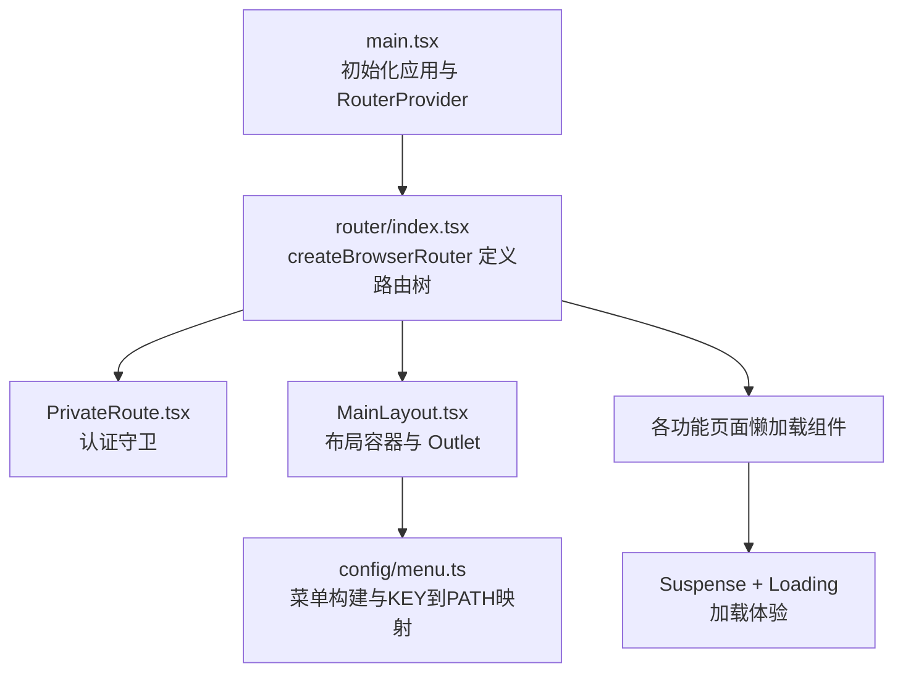
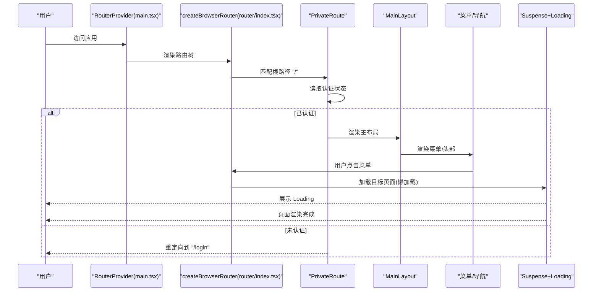
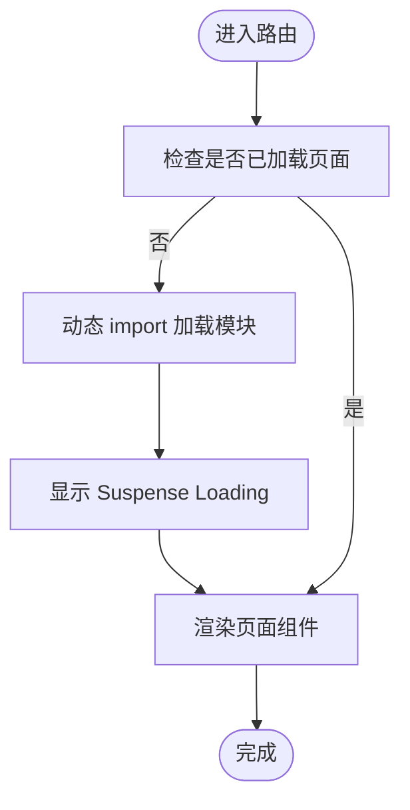
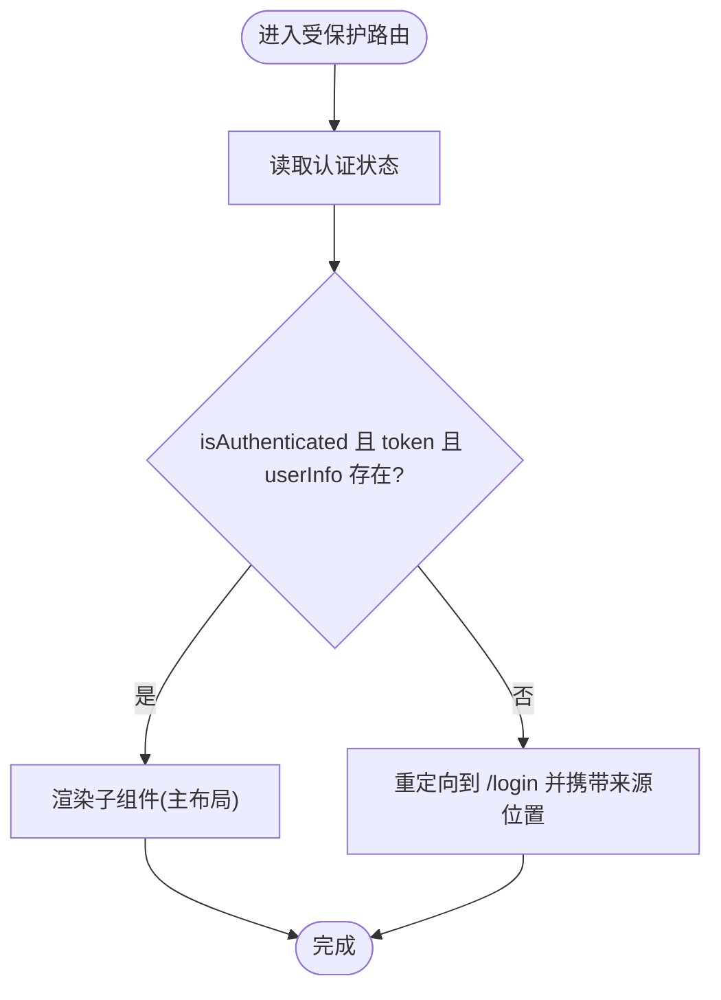
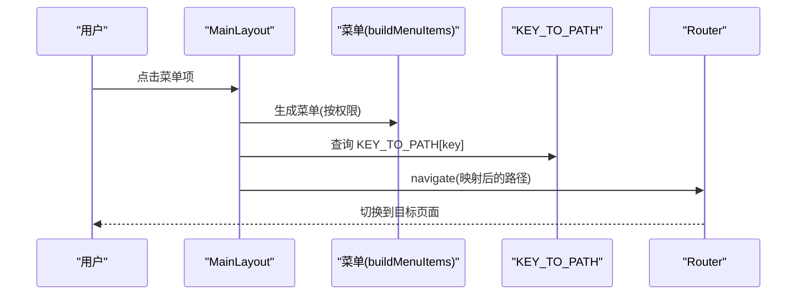
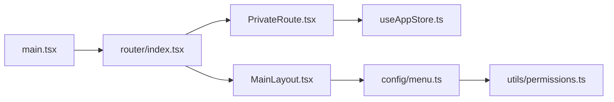

# 路由与导航

<cite>
**本文引用的文件**
- [frontend/src/router/index.tsx](file://frontend/src/router/index.tsx)
- [frontend/src/router/PrivateRoute.tsx](file://frontend/src/router/PrivateRoute.tsx)
- [frontend/src/main.tsx](file://frontend/src/main.tsx)
- [frontend/src/layouts/MainLayout.tsx](file://frontend/src/layouts/MainLayout.tsx)
- [frontend/src/config/menu.ts](file://frontend/src/config/menu.ts)
- [frontend/src/store/useAppStore.ts](file://frontend/src/store/useAppStore.ts)
- [frontend/src/utils/permissions.ts](file://frontend/src/utils/permissions.ts)
- [frontend/src/features/hr/pages/CreateEmployee.tsx](file://frontend/src/features/hr/pages/CreateEmployee.tsx)
- [frontend/src/components/MultiTabs.tsx](file://frontend/src/components/MultiTabs.tsx)
- [frontend/tests/navigation.spec.ts](file://frontend/tests/navigation.spec.ts)
</cite>

## 目录
1. [引言](#引言)
2. [项目结构](#项目结构)
3. [核心组件](#核心组件)
4. [架构总览](#架构总览)
5. [详细组件分析](#详细组件分析)
6. [依赖分析](#依赖分析)
7. [性能考虑](#性能考虑)
8. [故障排查指南](#故障排查指南)
9. [结论](#结论)
10. [附录](#附录)

## 引言
本文件系统性阐述 caiwu-main 前端在 React Router v7 下的路由与导航设计与实现，重点覆盖：
- 模块化路由配置结构与 createBrowserRouter 初始化流程
- 懒加载（lazy）与 Suspense 的代码分割策略及 Loading 体验
- PrivateRoute 高阶组件的认证保护机制（路由守卫、权限验证、重定向）
- MainLayout 布局组件与路由的集成方式
- 多级菜单路径（如 /hr/employees/create）的匹配规则
- 功能模块与 URL 的映射关系、路由参数传递、嵌套路由配置与编程式导航最佳实践

## 项目结构
前端路由系统位于 frontend/src/router，核心入口为 main.tsx 中的 RouterProvider，路由配置集中于 router/index.tsx，并通过 PrivateRoute 实现认证守卫，MainLayout 作为主布局承载菜单、头部与内容区域，菜单项与路径映射由 config/menu.ts 提供。

图表来源
- [frontend/src/main.tsx](file://frontend/src/main.tsx#L1-L43)
- [frontend/src/router/index.tsx](file://frontend/src/router/index.tsx#L1-L152)
- [frontend/src/router/PrivateRoute.tsx](file://frontend/src/router/PrivateRoute.tsx#L1-L16)
- [frontend/src/layouts/MainLayout.tsx](file://frontend/src/layouts/MainLayout.tsx#L1-L146)
- [frontend/src/config/menu.ts](file://frontend/src/config/menu.ts#L1-L293)

章节来源
- [frontend/src/main.tsx](file://frontend/src/main.tsx#L1-L43)
- [frontend/src/router/index.tsx](file://frontend/src/router/index.tsx#L1-L152)

## 核心组件
- createBrowserRouter：在 router/index.tsx 中定义根路由与嵌套路由，包含登录页、主布局与所有业务模块路由。
- PrivateRoute：在 router/index.tsx 中包裹 MainLayout，实现认证守卫；在 PrivateRoute.tsx 中读取 useAppStore 判断 token、userInfo 与 isAuthenticated，未满足条件则重定向至 /login。
- MainLayout：在 layouts/MainLayout.tsx 中渲染侧边栏菜单、头部用户下拉、内容区 Outlet，负责菜单点击导航与折叠切换。
- 菜单与路径映射：config/menu.ts 提供 buildMenuItems 构建菜单树，KEY_TO_PATH 将菜单 key 映射到具体路径，支持多级菜单与权限控制。
- 懒加载与 Suspense：router/index.tsx 对所有业务页面使用 lazy 动态 import，并以 Suspense 包裹，Loading 组件提供加载指示。
- 编程式导航：MainLayout 与组件内部广泛使用 useNavigate/navigate 进行跳转；MultiTabs 支持标签页切换与关闭后的导航。

章节来源
- [frontend/src/router/index.tsx](file://frontend/src/router/index.tsx#L1-L152)
- [frontend/src/router/PrivateRoute.tsx](file://frontend/src/router/PrivateRoute.tsx#L1-L16)
- [frontend/src/layouts/MainLayout.tsx](file://frontend/src/layouts/MainLayout.tsx#L1-L146)
- [frontend/src/config/menu.ts](file://frontend/src/config/menu.ts#L1-L293)
- [frontend/src/store/useAppStore.ts](file://frontend/src/store/useAppStore.ts#L1-L65)

## 架构总览
React Router v7 在 SPA 中通过 createBrowserRouter 创建路由树，顶层 RouterProvider 注入到应用根节点。路由树采用嵌套路由模式：根路径 / 下挂载 PrivateRoute，再由 MainLayout 承载菜单与 Outlet，子路由按模块划分并懒加载。

图表来源
- [frontend/src/main.tsx](file://frontend/src/main.tsx#L1-L43)
- [frontend/src/router/index.tsx](file://frontend/src/router/index.tsx#L76-L152)
- [frontend/src/router/PrivateRoute.tsx](file://frontend/src/router/PrivateRoute.tsx#L1-L16)
- [frontend/src/layouts/MainLayout.tsx](file://frontend/src/layouts/MainLayout.tsx#L1-L146)

## 详细组件分析

### 路由初始化与模块化配置
- 初始化流程：main.tsx 中创建 QueryClient、ConfigProvider、ErrorBoundary 包裹 RouterProvider，并注入 router 实例。
- 路由树：router/index.tsx 使用 createBrowserRouter 定义根路由与嵌套路由，包含登录页、首页重定向、各模块路由。
- 模块化组织：路由按功能域分组（My/Finance/Sites/Assets/HR/Reports/System），每组路由集中声明，便于维护与扩展。
- 嵌套路由：根路由下通过 children 定义子路由，形成清晰的层级关系。

章节来源
- [frontend/src/main.tsx](file://frontend/src/main.tsx#L1-L43)
- [frontend/src/router/index.tsx](file://frontend/src/router/index.tsx#L76-L152)

### 懒加载与 Suspense 的代码分割策略
- 动态 import：router/index.tsx 中对每个业务页面使用 lazy(() => import(...))，实现按需加载。
- Suspense 包裹：每个懒加载页面外层以 Suspense 包裹，并提供 Loading 组件，保证切换路由时的流畅体验。
- 性能收益：减少首屏包体积，提升初始加载速度；仅在访问对应页面时下载对应模块。

图表来源
- [frontend/src/router/index.tsx](file://frontend/src/router/index.tsx#L1-L75)
- [frontend/src/router/index.tsx](file://frontend/src/router/index.tsx#L70-L75)

章节来源
- [frontend/src/router/index.tsx](file://frontend/src/router/index.tsx#L1-L75)
- [frontend/src/router/index.tsx](file://frontend/src/router/index.tsx#L70-L75)

### PrivateRoute 认证守卫与重定向逻辑
- 认证判断：PrivateRoute 读取 useAppStore 的 isAuthenticated、token、userInfo，三者缺一不可。
- 双重校验：即使本地存储被篡改，只要 token 或 userInfo 不存在，仍会被拒绝访问。
- 重定向：未通过认证时，使用 Navigate 重定向到 /login，并携带 from 字段记录来源位置，便于登录后返回。

图表来源
- [frontend/src/router/PrivateRoute.tsx](file://frontend/src/router/PrivateRoute.tsx#L1-L16)
- [frontend/src/store/useAppStore.ts](file://frontend/src/store/useAppStore.ts#L1-L65)

章节来源
- [frontend/src/router/PrivateRoute.tsx](file://frontend/src/router/PrivateRoute.tsx#L1-L16)
- [frontend/src/store/useAppStore.ts](file://frontend/src/store/useAppStore.ts#L1-L65)

### MainLayout 布局与菜单集成
- 布局结构：MainLayout 使用 Ant Design Layout，包含侧边栏、头部、内容区与 Outlet。
- 菜单构建：buildMenuItems 根据用户权限动态生成菜单树，支持多级分组与权限过滤。
- 路径映射：KEY_TO_PATH 将菜单 key 映射到具体 URL，例如 'employee-create' -> '/hr/employees/create'。
- 导航行为：菜单点击 onMenuClick 通过 KEY_TO_PATH 获取路径并调用 navigate；支持手风琴展开逻辑与选中状态同步。
- 退出登录：顶部用户下拉触发 logout 并跳转到 /login。

图表来源
- [frontend/src/layouts/MainLayout.tsx](file://frontend/src/layouts/MainLayout.tsx#L1-L146)
- [frontend/src/config/menu.ts](file://frontend/src/config/menu.ts#L63-L236)
- [frontend/src/config/menu.ts](file://frontend/src/config/menu.ts#L238-L293)

章节来源
- [frontend/src/layouts/MainLayout.tsx](file://frontend/src/layouts/MainLayout.tsx#L1-L146)
- [frontend/src/config/menu.ts](file://frontend/src/config/menu.ts#L1-L293)

### 多级菜单路径匹配与路由参数传递
- 多级菜单路径：config/menu.ts 中定义了多级菜单键值，如 'employee-create' -> '/hr/employees/create'，与 router/index.tsx 中的路径严格一致。
- 匹配规则：router/index.tsx 中 path: 'hr/employees/create' 与 KEY_TO_PATH 映射完全对应，确保菜单点击与 URL 一致。
- 参数传递：当前路由配置未显式声明参数占位符（如 :id），但组件内部可通过 useNavigate 与 navigate('/hr/employees') 进行导航；若需参数，可在路由中使用动态段并在组件内使用 useSearchParams/useParams。

章节来源
- [frontend/src/config/menu.ts](file://frontend/src/config/menu.ts#L238-L293)
- [frontend/src/router/index.tsx](file://frontend/src/router/index.tsx#L118-L126)

### 功能模块与 URL 对应关系
- 模块到路径映射：router/index.tsx 中将各功能模块（My/Finance/Sites/Assets/HR/Reports/System）映射到对应的路径前缀，如 /my、/finance、/hr 等。
- 页面到路径映射：每个页面组件在 router/index.tsx 中以 path: '模块/页面' 的形式注册，例如 /hr/employees、/hr/employees/create。
- 菜单到路径映射：config/menu.ts 中 KEY_TO_PATH 将菜单键映射到具体路径，保证菜单点击与路由一致。

章节来源
- [frontend/src/router/index.tsx](file://frontend/src/router/index.tsx#L83-L151)
- [frontend/src/config/menu.ts](file://frontend/src/config/menu.ts#L238-L293)

### 嵌套路由与编程式导航最佳实践
- 嵌套路由：根路由 '/' 下通过 children 定义多个子路由，形成清晰的模块化嵌套结构。
- 编程式导航：MainLayout 内部使用 useNavigate/navigate 进行菜单跳转；组件内部也广泛使用 navigate 进行返回、跳转等操作（如 CreateEmployee.tsx 中返回列表）。
- 标签页导航：MultiTabs 支持标签页的增删与切换，切换时通过 navigate(key) 实现路由同步。

章节来源
- [frontend/src/router/index.tsx](file://frontend/src/router/index.tsx#L78-L151)
- [frontend/src/layouts/MainLayout.tsx](file://frontend/src/layouts/MainLayout.tsx#L69-L72)
- [frontend/src/features/hr/pages/CreateEmployee.tsx](file://frontend/src/features/hr/pages/CreateEmployee.tsx#L107-L109)
- [frontend/src/components/MultiTabs.tsx](file://frontend/src/components/MultiTabs.tsx#L41-L100)

## 依赖分析
- 路由依赖链：
  - main.tsx 依赖 router/index.tsx 的 router 实例
  - router/index.tsx 依赖 PrivateRoute、MainLayout、各功能页面懒加载组件
  - PrivateRoute 依赖 useAppStore
  - MainLayout 依赖 config/menu.ts 的菜单构建与 KEY_TO_PATH
  - 菜单权限依赖 utils/permissions.ts 的 hasPermission
- 耦合与内聚：
  - 路由配置集中于 router/index.tsx，职责清晰，耦合度低
  - 认证与权限分离：PrivateRoute 负责守卫，权限工具负责菜单与按钮级权限
  - 菜单与路由解耦：KEY_TO_PATH 提供映射，避免硬编码路径散落各处

图表来源
- [frontend/src/main.tsx](file://frontend/src/main.tsx#L1-L43)
- [frontend/src/router/index.tsx](file://frontend/src/router/index.tsx#L1-L152)
- [frontend/src/router/PrivateRoute.tsx](file://frontend/src/router/PrivateRoute.tsx#L1-L16)
- [frontend/src/layouts/MainLayout.tsx](file://frontend/src/layouts/MainLayout.tsx#L1-L146)
- [frontend/src/config/menu.ts](file://frontend/src/config/menu.ts#L1-L293)
- [frontend/src/store/useAppStore.ts](file://frontend/src/store/useAppStore.ts#L1-L65)
- [frontend/src/utils/permissions.ts](file://frontend/src/utils/permissions.ts#L1-L100)

章节来源
- [frontend/src/main.tsx](file://frontend/src/main.tsx#L1-L43)
- [frontend/src/router/index.tsx](file://frontend/src/router/index.tsx#L1-L152)
- [frontend/src/router/PrivateRoute.tsx](file://frontend/src/router/PrivateRoute.tsx#L1-L16)
- [frontend/src/layouts/MainLayout.tsx](file://frontend/src/layouts/MainLayout.tsx#L1-L146)
- [frontend/src/config/menu.ts](file://frontend/src/config/menu.ts#L1-L293)
- [frontend/src/store/useAppStore.ts](file://frontend/src/store/useAppStore.ts#L1-L65)
- [frontend/src/utils/permissions.ts](file://frontend/src/utils/permissions.ts#L1-L100)

## 性能考虑
- 代码分割：通过 lazy 与 Suspense 将页面按模块拆分，降低首屏体积，提升加载速度。
- 懒加载粒度：建议保持页面级懒加载，避免过度细分导致网络请求过多。
- Loading 体验：Loading 组件提供统一的加载反馈，建议在关键页面保持一致的加载样式与高度。
- 路由缓存：当前未见路由级缓存策略，可结合业务场景评估是否引入缓存或预加载策略。

## 故障排查指南
- 登录后无法进入受保护页面
  - 检查 useAppStore 是否正确设置 token 与 userInfo，并确保 isAuthenticated 被计算为 true
  - 参考 PrivateRoute 的认证判断逻辑
- 菜单点击无响应
  - 检查 KEY_TO_PATH 是否包含对应 key 的映射
  - 确认 router/index.tsx 中是否存在相同路径的路由
- 路由跳转后页面不更新
  - 检查 MultiTabs 是否正确维护 activeKey 与 items，并在切换时调用 navigate
- 自动化测试断言
  - navigation.spec.ts 展示了从登录到 HR 员工管理的导航流程，可用于回归验证

章节来源
- [frontend/src/router/PrivateRoute.tsx](file://frontend/src/router/PrivateRoute.tsx#L1-L16)
- [frontend/src/store/useAppStore.ts](file://frontend/src/store/useAppStore.ts#L1-L65)
- [frontend/src/config/menu.ts](file://frontend/src/config/menu.ts#L238-L293)
- [frontend/src/router/index.tsx](file://frontend/src/router/index.tsx#L78-L151)
- [frontend/src/components/MultiTabs.tsx](file://frontend/src/components/MultiTabs.tsx#L41-L100)
- [frontend/tests/navigation.spec.ts](file://frontend/tests/navigation.spec.ts#L1-L68)

## 结论
本路由系统以 React Router v7 为基础，采用模块化路由配置与懒加载策略，结合 PrivateRoute 实现强认证守卫，配合 MainLayout 与菜单映射实现清晰的导航体验。整体设计具备良好的可维护性与扩展性，适合在大型前端应用中推广使用。

## 附录
- 最佳实践清单
  - 路由配置集中管理，按模块分组
  - 使用 lazy 与 Suspense 提升首屏性能
  - 认证守卫与权限工具分离，职责清晰
  - 菜单与路由通过 KEY_TO_PATH 解耦，避免硬编码
  - 编程式导航统一使用 useNavigate，保持一致性
  - 多级菜单路径与路由路径保持一致，确保用户体验连贯