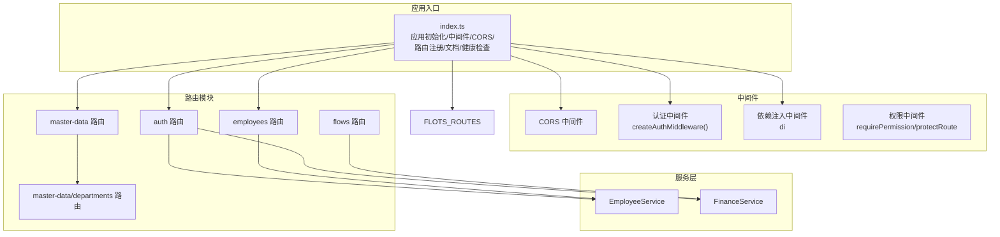
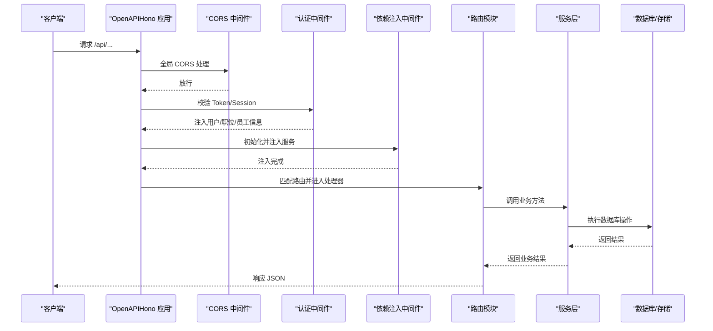
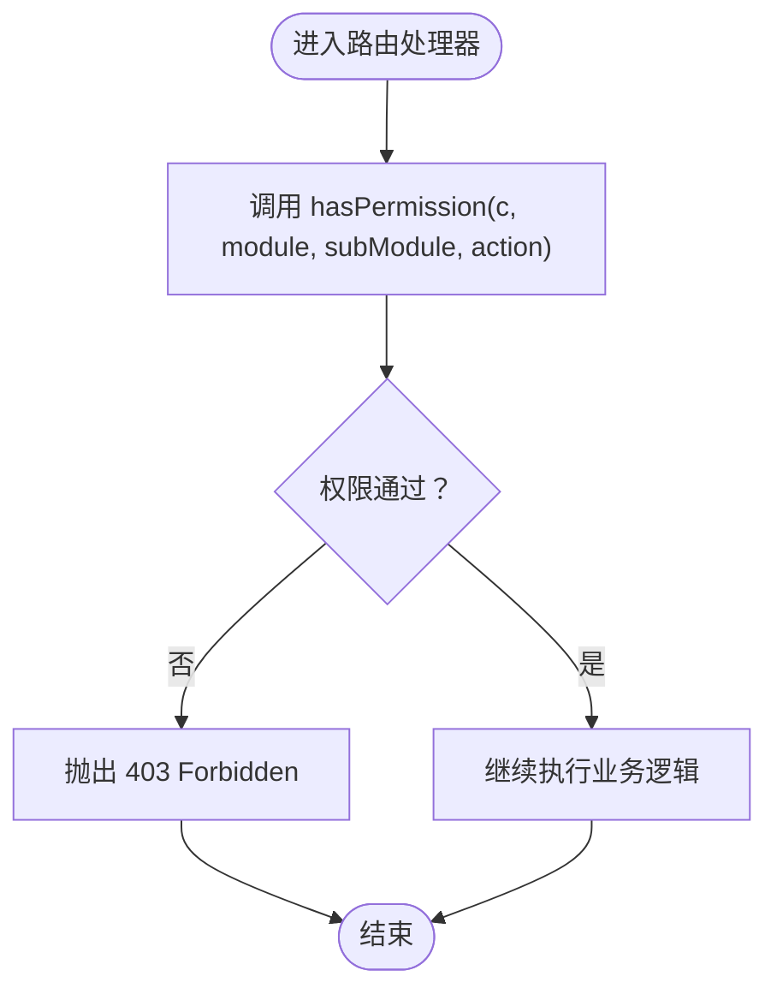
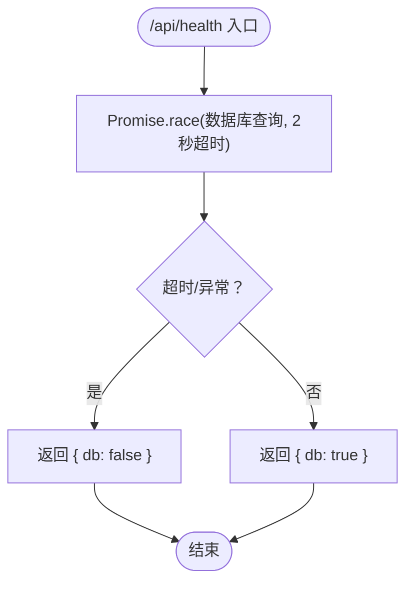
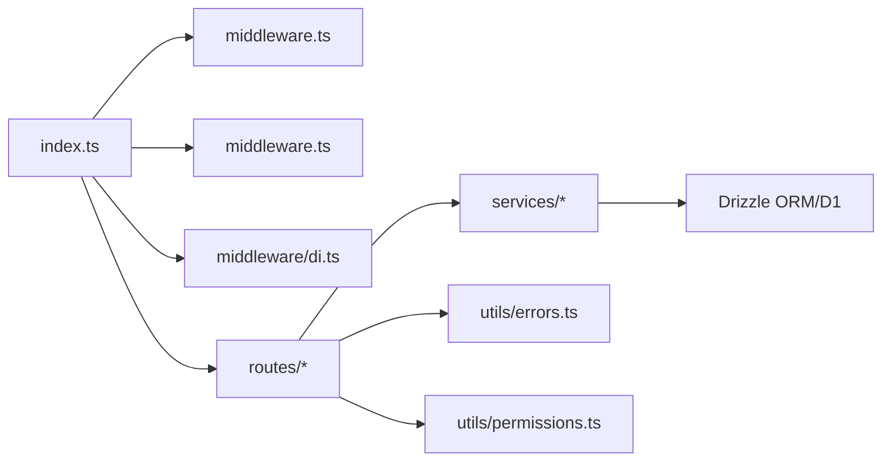

# API设计

<cite>
**本文引用的文件**
- [backend/src/index.ts](file://backend/src/index.ts)
- [backend/src/middleware.ts](file://backend/src/middleware.ts)
- [backend/src/middleware/di.ts](file://backend/src/middleware/di.ts)
- [backend/src/middleware/permission.ts](file://backend/src/middleware/permission.ts)
- [backend/src/utils/errors.ts](file://backend/src/utils/errors.ts)
- [backend/src/utils/permissions.ts](file://backend/src/utils/permissions.ts)
- [backend/src/config/paths.ts](file://backend/src/config/paths.ts)
- [backend/src/routes/employees.ts](file://backend/src/routes/employees.ts)
- [backend/src/routes/flows.ts](file://backend/src/routes/flows.ts)
- [backend/src/routes/auth.ts](file://backend/src/routes/auth.ts)
- [backend/src/routes/master-data.ts](file://backend/src/routes/master-data.ts)
- [backend/src/routes/master-data/departments.ts](file://backend/src/routes/master-data/departments.ts)
- [backend/src/types.ts](file://backend/src/types.ts)
- [backend/scripts/export-openapi.ts](file://backend/scripts/export-openapi.ts)
</cite>

## 目录
1. [引言](#引言)
2. [项目结构](#项目结构)
3. [核心组件](#核心组件)
4. [架构总览](#架构总览)
5. [详细组件分析](#详细组件分析)
6. [依赖关系分析](#依赖关系分析)
7. [性能考量](#性能考量)
8. [故障排查指南](#故障排查指南)
9. [结论](#结论)
10. [附录](#附录)

## 引言
本文件面向基于 Hono 的后端 API 设计体系进行深入解析，重点覆盖：
- OpenAPIHono 的集成方式与类型安全路由定义的优势
- index.ts 中的模块化路由注册模式
- 全局中间件链（CORS、认证、DI）的执行顺序与作用域
- RESTful 端点设计规范、错误处理机制（errorHandler）与 OpenAPI 文档自动生成流程
- 权限中间件（requirePermission）与 API 端点的集成方式，展示装饰器式权限控制
- 健康检查端点（/api/health）的超时控制与数据库连接验证策略
- Swagger UI 的集成配置

## 项目结构
后端采用分层与模块化组织：
- 应用入口与路由注册：backend/src/index.ts
- 中间件：认证、DI、权限
- 路由模块：按业务域划分（如 employees、flows、master-data 等）
- 服务层：业务逻辑封装（FinanceService、EmployeeService 等）
- 类型与环境：types.ts 定义运行时注入的服务与变量
- OpenAPI 文档导出脚本：scripts/export-openapi.ts

图表来源
- [backend/src/index.ts](file://backend/src/index.ts#L42-L136)
- [backend/src/routes/auth.ts](file://backend/src/routes/auth.ts#L1-L418)
- [backend/src/routes/employees.ts](file://backend/src/routes/employees.ts#L1-L462)
- [backend/src/routes/flows.ts](file://backend/src/routes/flows.ts#L1-L424)
- [backend/src/routes/master-data.ts](file://backend/src/routes/master-data.ts#L1-L23)
- [backend/src/routes/master-data/departments.ts](file://backend/src/routes/master-data/departments.ts#L1-L327)

章节来源
- [backend/src/index.ts](file://backend/src/index.ts#L42-L136)

## 核心组件
- OpenAPIHono：统一的 Hono 实例，启用 OpenAPI 文档与 Swagger UI
- 全局中间件链：CORS、认证、DI
- 错误处理：统一的 errorHandler，区分业务错误、验证错误与未预期错误
- 权限系统：基于职位的细粒度权限模型，支持模块级与操作级权限
- 依赖注入：在 DI 中间件中创建服务实例并注入上下文
- 健康检查：/api/health 提供超时控制与数据库连通性检测

章节来源
- [backend/src/index.ts](file://backend/src/index.ts#L42-L136)
- [backend/src/utils/errors.ts](file://backend/src/utils/errors.ts#L1-L114)
- [backend/src/utils/permissions.ts](file://backend/src/utils/permissions.ts#L1-L330)
- [backend/src/middleware/di.ts](file://backend/src/middleware/di.ts#L1-L76)
- [backend/src/middleware.ts](file://backend/src/middleware.ts#L1-L82)

## 架构总览
下图展示了从客户端请求到响应返回的关键路径，包括中间件执行顺序与路由注册位置。

图表来源
- [backend/src/index.ts](file://backend/src/index.ts#L42-L136)
- [backend/src/middleware.ts](file://backend/src/middleware.ts#L1-L82)
- [backend/src/middleware/di.ts](file://backend/src/middleware/di.ts#L1-L76)
- [backend/src/routes/employees.ts](file://backend/src/routes/employees.ts#L1-L462)
- [backend/src/routes/flows.ts](file://backend/src/routes/flows.ts#L1-L424)

## 详细组件分析

### OpenAPIHono 集成与类型安全路由
- 在应用入口创建 OpenAPIHono 实例，启用 OpenAPI 文档与 Swagger UI
- 路由模块均使用 OpenAPIHono 定义，结合 createRoute 与 zod schema 进行类型安全的请求/响应校验
- 优点：
  - 自动导出 OpenAPI 规范，便于前端对接与 SDK 生成
  - 通过 schema 保证请求体与响应体结构一致，减少运行期错误
  - 与 Swagger UI 集成，可视化调试 API

章节来源
- [backend/src/index.ts](file://backend/src/index.ts#L42-L136)
- [backend/src/routes/employees.ts](file://backend/src/routes/employees.ts#L1-L462)
- [backend/src/routes/flows.ts](file://backend/src/routes/flows.ts#L1-L424)
- [backend/src/routes/auth.ts](file://backend/src/routes/auth.ts#L1-L418)
- [backend/scripts/export-openapi.ts](file://backend/scripts/export-openapi.ts#L1-L16)

### 模块化路由注册（index.ts）
- 全局错误处理置于最前
- 全局 CORS 对特定来源放行
- 健康检查与版本信息无需认证
- 认证中间件与 DI 中间件作用于 /api/*
- 通过 app.route('/api', ...) 注册各业务路由模块，形成清晰的模块边界

章节来源
- [backend/src/index.ts](file://backend/src/index.ts#L42-L136)

### 全局中间件链：执行顺序与作用域
- 执行顺序（从外到内）：
  1) CORS（全局）
  2) 认证中间件（/api/*）
  3) DI 中间件（/api/*）
- 作用域：
  - CORS 对所有请求生效
  - 认证与 DI 仅对 /api/* 生效
- 认证中间件职责：
  - 解析多种鉴权来源（Header、Cookie、Alt Header）
  - 校验 JWT 并从 KV 或数据库加载会话与职位信息
  - 注入 userId、sessionId、userPosition、userEmployee、departmentModules 到上下文
- DI 中间件职责：
  - 初始化数据库连接
  - 创建各类服务实例并注入到上下文

章节来源
- [backend/src/index.ts](file://backend/src/index.ts#L42-L136)
- [backend/src/middleware.ts](file://backend/src/middleware.ts#L1-L82)
- [backend/src/middleware/di.ts](file://backend/src/middleware/di.ts#L1-L76)
- [backend/src/config/paths.ts](file://backend/src/config/paths.ts#L1-L23)
- [backend/src/types.ts](file://backend/src/types.ts#L1-L88)

### RESTful 端点设计规范与 OpenAPI 文档自动生成
- 规范要点：
  - 路径使用名词复数形式，资源明确（如 /employees、/flows）
  - 动作通过 HTTP 方法表达（GET/POST/PUT/DELETE）
  - 查询参数与请求体通过 schema 明确约束
  - 响应体统一使用 JSON，状态码遵循 REST 语义
- OpenAPI 文档：
  - 通过 app.doc('/api/doc', ...) 配置文档元信息
  - 通过 swaggerUI('/api/ui', ...) 提供交互式 UI
  - 提供脚本导出 openapi.json，便于 CI/CD 或外部工具消费

章节来源
- [backend/src/index.ts](file://backend/src/index.ts#L122-L133)
- [backend/scripts/export-openapi.ts](file://backend/scripts/export-openapi.ts#L1-L16)
- [backend/src/routes/employees.ts](file://backend/src/routes/employees.ts#L1-L462)
- [backend/src/routes/flows.ts](file://backend/src/routes/flows.ts#L1-L424)

### 错误处理机制（errorHandler）
- 统一错误处理：
  - 业务错误（AppError）：保留状态码与错误码，输出结构化错误
  - Zod 验证错误：输出标准化的验证错误数组
  - 未预期错误：输出通用内部错误，并记录堆栈
- 日志结构：
  - 记录时间戳、URL、方法、用户标识、IP、UA、错误详情

章节来源
- [backend/src/utils/errors.ts](file://backend/src/utils/errors.ts#L1-L114)
- [backend/src/index.ts](file://backend/src/index.ts#L42-L60)

### 权限中间件与装饰器式访问控制
- requirePermission 装饰器：
  - 以模块/子模块/动作维度进行权限校验
  - 未通过则抛出业务错误（403）
- protectRoute 包装器：
  - 以函数包装方式在处理器执行前进行权限校验
- 权限模型：
  - 基于职位的权限矩阵（模块 -> 子模块 -> 操作集合）
  - 支持部门模块白名单与通配符匹配
  - 支持数据访问范围过滤（总部/项目/组/个人）

图表来源
- [backend/src/middleware/permission.ts](file://backend/src/middleware/permission.ts#L1-L39)
- [backend/src/utils/permissions.ts](file://backend/src/utils/permissions.ts#L1-L330)
- [backend/src/routes/employees.ts](file://backend/src/routes/employees.ts#L118-L161)
- [backend/src/routes/flows.ts](file://backend/src/routes/flows.ts#L198-L271)

章节来源
- [backend/src/middleware/permission.ts](file://backend/src/middleware/permission.ts#L1-L39)
- [backend/src/utils/permissions.ts](file://backend/src/utils/permissions.ts#L1-L330)

### 健康检查端点（/api/health）的超时控制与数据库验证
- 设计目标：快速判断服务可用性与数据库连通性
- 超时控制：Promise.race + setTimeout，2 秒超时
- 数据库验证：执行最小代价查询（select 1），捕获异常并返回 db=false

图表来源
- [backend/src/index.ts](file://backend/src/index.ts#L66-L82)

章节来源
- [backend/src/index.ts](file://backend/src/index.ts#L66-L82)

### Swagger UI 集成配置
- 文档端点：/api/doc（OpenAPI 文档）
- UI 端点：/api/ui（Swagger UI）
- 两者通过 app.doc 与 swaggerUI 配置关联

章节来源
- [backend/src/index.ts](file://backend/src/index.ts#L122-L133)

### 典型路由文件分析

#### 员工管理（employees.ts）
- 路由设计：
  - GET /employees：分页/过滤列表（受权限与数据范围控制）
  - GET /employees/:id：单个员工详情
  - POST /employees：创建员工（含自动创建用户账号、发送欢迎邮件等）
  - PUT /employees/:id：更新员工信息
  - POST /employees/:id/regularize、/leave、/rejoin：状态变更
  - POST /employees/:id/reset-password：重置密码并发送邮件
- 权限控制：
  - 多处使用 hasPermission 进行细粒度控制（如 hr.employee.create/update）
- 错误处理：
  - 使用 Errors 工具类抛出标准错误
  - 审计日志记录关键操作

章节来源
- [backend/src/routes/employees.ts](file://backend/src/routes/employees.ts#L1-L462)
- [backend/src/utils/errors.ts](file://backend/src/utils/errors.ts#L1-L114)
- [backend/src/utils/permissions.ts](file://backend/src/utils/permissions.ts#L1-L330)

#### 现金流（flows.ts）
- 路由设计：
  - GET /flows/next-voucher：生成下一个凭证号
  - GET /flows：列表（按职位层级与部门范围过滤）
  - POST /upload/voucher：凭证图片上传（R2）
  - GET /vouchers/*：凭证下载
  - POST /flows：创建现金流记录（同时生成会计分录）
  - PUT /flows/{id}/voucher：更新凭证链接
- 权限控制：
  - 多处使用 hasPermission 控制财务模块操作
- 文件上传：
  - 严格的文件类型与大小校验，WebP 格式要求
  - R2 存储并设置缓存头

章节来源
- [backend/src/routes/flows.ts](file://backend/src/routes/flows.ts#L1-L424)

#### 主数据（master-data 与 departments）
- 路由设计：
  - 部门：GET/POST/PUT/DELETE /departments
  - 站点：GET/POST/PUT/DELETE /sites
- 权限控制：
  - system.department 与 site.info 模块下的 create/update/delete 权限校验
- 数据过滤：
  - 部门列表支持 activeOnly 与 search 参数后端过滤

章节来源
- [backend/src/routes/master-data.ts](file://backend/src/routes/master-data.ts#L1-L23)
- [backend/src/routes/master-data/departments.ts](file://backend/src/routes/master-data/departments.ts#L1-L327)

#### 认证（auth）
- 路由设计：
  - 登录、首次改密、TOTP 二维码、绑定 TOTP、登出、获取当前用户、我的权限
- 安全特性：
  - 多种鉴权来源解析
  - 登录通知邮件异步发送
  - 会话与职位信息注入上下文

章节来源
- [backend/src/routes/auth.ts](file://backend/src/routes/auth.ts#L1-L418)

## 依赖关系分析
- 应用入口依赖：
  - 中间件：CORS、认证、DI
  - 路由模块：auth、employees、flows、master-data 等
  - 错误处理与权限工具
- 路由到服务：
  - 路由通过 c.get('services').xxx 调用服务层
  - 服务层使用 Drizzle ORM 访问数据库
- 类型与注入：
  - types.ts 定义 Env 与 AppVariables，确保编译期类型安全
  - DI 中间件集中注入服务，避免路由层直接依赖具体实现

图表来源
- [backend/src/index.ts](file://backend/src/index.ts#L42-L136)
- [backend/src/middleware.ts](file://backend/src/middleware.ts#L1-L82)
- [backend/src/middleware/di.ts](file://backend/src/middleware/di.ts#L1-L76)
- [backend/src/routes/employees.ts](file://backend/src/routes/employees.ts#L1-L462)
- [backend/src/routes/flows.ts](file://backend/src/routes/flows.ts#L1-L424)
- [backend/src/utils/errors.ts](file://backend/src/utils/errors.ts#L1-L114)
- [backend/src/utils/permissions.ts](file://backend/src/utils/permissions.ts#L1-L330)

章节来源
- [backend/src/types.ts](file://backend/src/types.ts#L1-L88)
- [backend/src/middleware/di.ts](file://backend/src/middleware/di.ts#L1-L76)

## 性能考量
- 认证中间件：
  - 会话缓存：优先从 KV 获取，未命中回源数据库并异步写回 KV
  - 会话活跃时间异步刷新，避免阻塞请求
- 健康检查：
  - 最小代价查询 + 2 秒超时，兼顾快速与稳定性
- DI 中间件：
  - 服务实例按需注入，避免重复创建
- 数据访问：
  - 职位层级与部门范围过滤减少不必要的数据扫描

章节来源
- [backend/src/middleware.ts](file://backend/src/middleware.ts#L1-L82)
- [backend/src/index.ts](file://backend/src/index.ts#L66-L82)
- [backend/src/middleware/di.ts](file://backend/src/middleware/di.ts#L1-L76)
- [backend/src/utils/permissions.ts](file://backend/src/utils/permissions.ts#L266-L330)

## 故障排查指南
- 401 未授权：
  - 检查鉴权来源（Authorization、Cookie、Alt Header）
  - 确认 JWT 有效且会话未过期
- 403 权限不足：
  - 核对职位权限矩阵与模块/子模块/动作
  - 检查部门模块白名单与通配符匹配
- 404 资源不存在：
  - 确认资源 ID 与数据范围过滤条件
- 500 服务器内部错误：
  - 查看统一错误日志（包含 URL、方法、用户、IP、UA、错误详情）
- OpenAPI 文档问题：
  - 使用 /api/ui 检查 UI 是否正常
  - 使用脚本导出 openapi.json 校验规范

章节来源
- [backend/src/utils/errors.ts](file://backend/src/utils/errors.ts#L1-L114)
- [backend/src/config/paths.ts](file://backend/src/config/paths.ts#L1-L23)
- [backend/scripts/export-openapi.ts](file://backend/scripts/export-openapi.ts#L1-L16)

## 结论
本项目以 Hono 为核心，结合 OpenAPIHono 实现了类型安全的 API 设计；通过模块化路由与中间件链实现了清晰的职责分离；基于职位的权限模型与装饰器式权限控制提供了细粒度的安全保障；统一错误处理与 OpenAPI 文档自动生成提升了开发效率与可观测性。健康检查与数据库连通性验证确保了服务可用性。

## 附录
- OpenAPI 文档导出脚本路径：backend/scripts/export-openapi.ts
- Swagger UI 访问路径：/api/ui
- 健康检查路径：/api/health
- 版本信息路径：/api/version