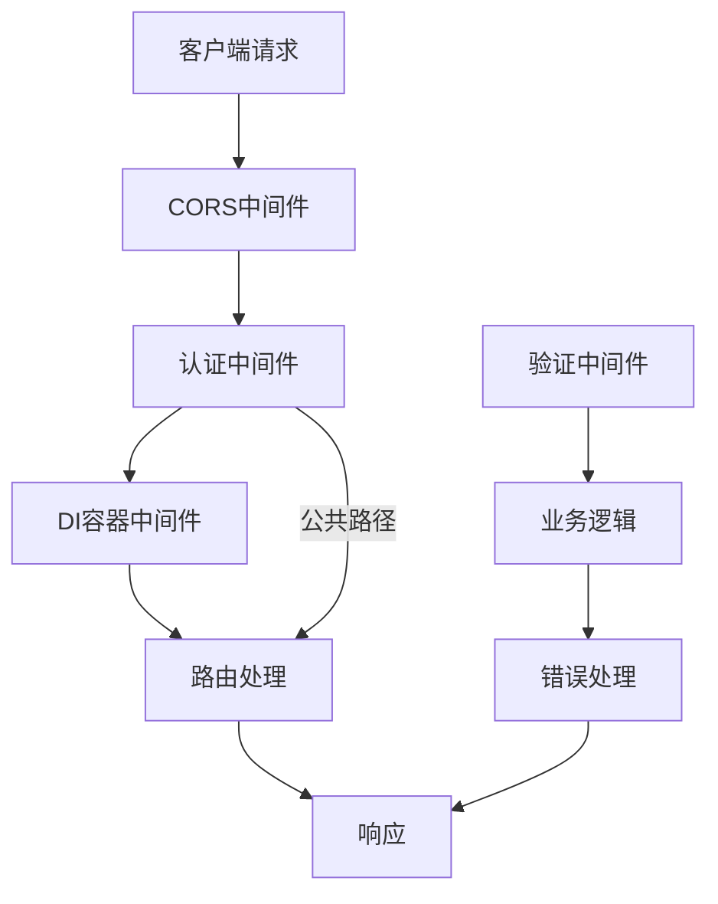
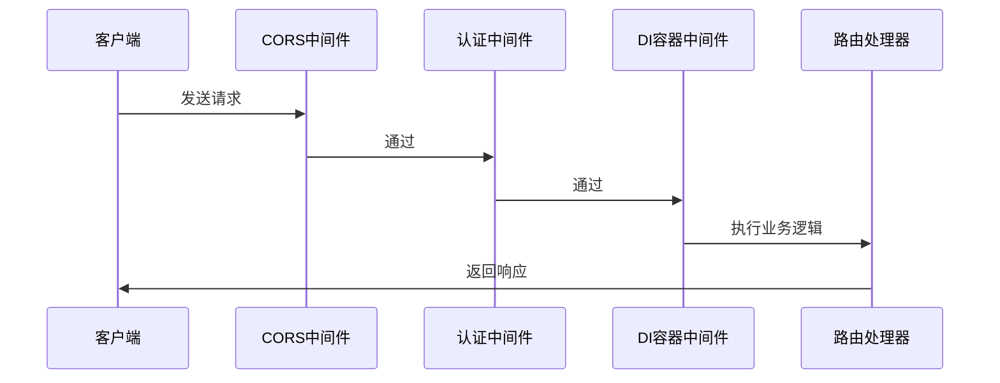
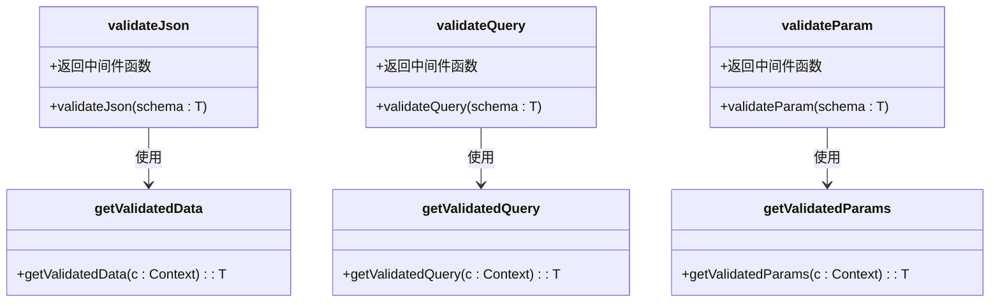
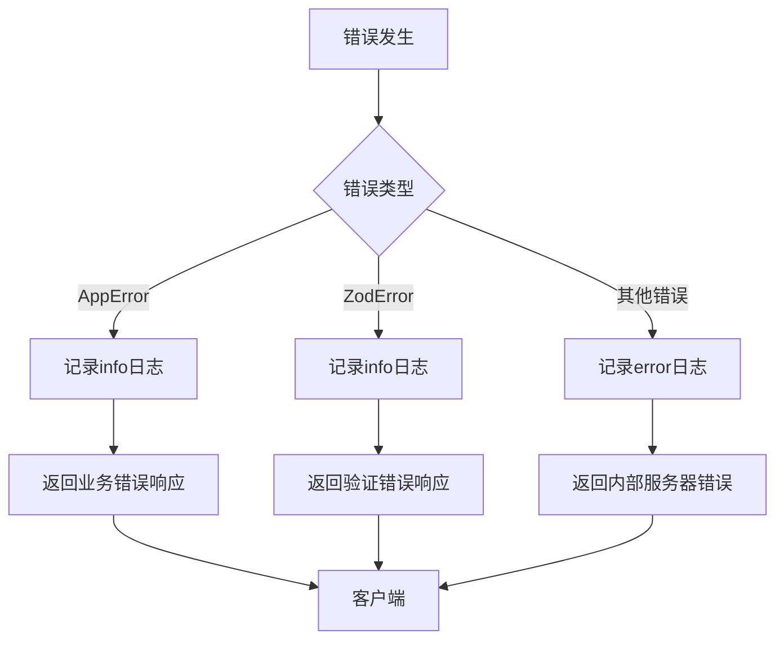
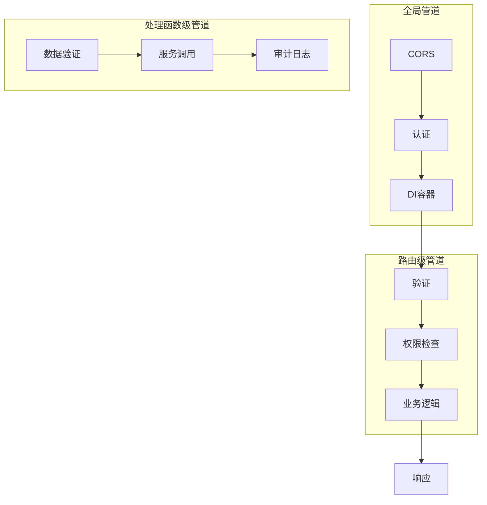

# 中间件机制

<cite>
**本文档引用的文件**
- [index.ts](file://backend/src/index.ts)
- [middleware.ts](file://backend/src/middleware.ts)
- [utils/validator.ts](file://backend/src/utils/validator.ts)
- [utils/errors.ts](file://backend/src/utils/errors.ts)
- [middleware/di.ts](file://backend/src/middleware/di.ts)
- [types.ts](file://backend/src/types.ts)
- [config/paths.ts](file://backend/src/config/paths.ts)
- [routes/auth.ts](file://backend/src/routes/auth.ts)
- [routes/employees.ts](file://backend/src/routes/employees.ts)
</cite>

## 目录
1. [中间件链设计](#中间件链设计)
2. [全局中间件注册与执行顺序](#全局中间件注册与执行顺序)
3. [基于Zod的请求验证中间件](#基于zod的请求验证中间件)
4. [全局错误处理机制](#全局错误处理机制)
5. [中间件间的数据传递](#中间件间的数据传递)
6. [中间件组合与功能管道](#中间件组合与功能管道)

## 中间件链设计

本系统采用Hono框架构建API服务，通过精心设计的中间件链实现安全、高效、可维护的请求处理流程。中间件链的设计遵循分层原则，从最外层的CORS处理到内层的业务逻辑执行，形成了一条清晰的处理管道。这种设计不仅确保了安全性，还通过依赖注入和数据验证等机制提升了代码的可测试性和可维护性。



**图示来源**
- [index.ts](file://backend/src/index.ts#L52-L90)
- [middleware.ts](file://backend/src/middleware.ts#L11-L72)
- [middleware/di.ts](file://backend/src/middleware/di.ts#L25-L75)

## 全局中间件注册与执行顺序

系统在`index.ts`文件中定义了全局中间件的注册顺序，这一顺序对系统的安全性和功能实现至关重要。中间件按照以下顺序注册：

1. **CORS中间件**：处理跨域请求，允许特定的前端域名访问API
2. **认证中间件**：验证用户身份，确保只有授权用户才能访问受保护的资源
3. **DI容器中间件**：初始化服务实例并注入到请求上下文中

这种顺序确保了在处理任何业务逻辑之前，请求已经通过了安全检查，并且所有必要的服务实例都已准备好。



**图示来源**
- [index.ts](file://backend/src/index.ts#L52-L90)
- [middleware.ts](file://backend/src/middleware.ts#L11-L72)
- [middleware/di.ts](file://backend/src/middleware/di.ts#L25-L75)

**本节来源**
- [index.ts](file://backend/src/index.ts#L45-L90)
- [middleware.ts](file://backend/src/middleware.ts#L11-L72)
- [middleware/di.ts](file://backend/src/middleware/di.ts#L25-L75)

## 基于Zod的请求验证中间件

系统使用Zod库实现类型安全的请求验证，提供了`validateJson`、`validateQuery`和`validateParam`三个中间件函数，分别用于验证请求体、查询参数和路径参数。

### 验证中间件实现原理

验证中间件通过泛型参数实现类型安全的输入验证。当请求到达时，中间件会根据预定义的Zod模式验证输入数据，并将验证后的数据存储在请求上下文中，供后续处理函数使用。



**图示来源**
- [utils/validator.ts](file://backend/src/utils/validator.ts#L12-L62)

### 类型安全的输入验证

通过泛型参数，验证中间件能够确保验证后的数据类型与预期一致。例如，在`employees.ts`路由中，创建员工的请求体通过`CreateEmployeeSchema`进行验证：

```typescript
const createEmployeeRoute = createRoute({
  method: 'post',
  path: '/employees',
  request: {
    body: {
      content: {
        'application/json': {
          schema: CreateEmployeeSchema
        }
      }
    }
  }
})
```

验证通过后，可以在处理函数中安全地使用`c.req.valid('json')`获取类型安全的验证数据。

**本节来源**
- [utils/validator.ts](file://backend/src/utils/validator.ts#L12-L62)
- [routes/employees.ts](file://backend/src/routes/employees.ts#L93-L116)

## 全局错误处理机制

系统通过`errorHandler`中间件实现全局错误处理，能够捕获Zod验证错误、业务错误（AppError）和未预期异常，并生成结构化的错误响应。

### 错误类型处理

`errorHandler`函数根据错误类型进行不同的处理：

1. **AppError**：业务错误，记录为info级别日志，返回结构化的错误响应
2. **ZodError**：验证错误，记录为info级别日志，返回详细的验证错误信息
3. **其他错误**：未预期的错误，记录为error级别日志，返回内部服务器错误响应



**图示来源**
- [utils/errors.ts](file://backend/src/utils/errors.ts#L59-L113)

### 结构化错误响应

错误处理中间件生成的响应包含错误码、错误消息和详细信息，便于客户端进行错误处理。例如，验证错误会返回详细的字段验证信息：

```json
{
  "error": "验证失败",
  "code": "VALIDATION_ERROR",
  "details": {
    "errors": [
      {
        "path": "email",
        "message": "邮箱格式不正确",
        "code": "invalid_string"
      }
    ]
  }
}
```

**本节来源**
- [utils/errors.ts](file://backend/src/utils/errors.ts#L59-L113)
- [index.ts](file://backend/src/index.ts#L46)

## 中间件间的数据传递

系统通过Hono框架的`c.set`和`c.get`方法实现中间件间的数据传递。这种方法允许在请求处理链中共享数据，而无需通过参数传递。

### 上下文数据存储

在`middleware.ts`文件中，认证中间件将用户信息存储在上下文中：

```typescript
c.set('userId', sessionData.session.user_id)
c.set('sessionId', payload.sid)
c.set('userPosition', sessionData.position)
c.set('userEmployee', sessionData.employee)
c.set('departmentModules', sessionData.departmentModules || ['*'])
```

在`di.ts`文件中，DI容器中间件将数据库实例和服务实例存储在上下文中：

```typescript
c.set('db', db)
c.set('services', {
    systemConfig: systemConfigService,
    finance: financeService,
    // ... 其他服务
})
```

### 类型安全的数据访问

通过在`types.ts`文件中定义`AppVariables`接口，系统实现了类型安全的数据访问：

```typescript
export type AppVariables = {
  userId?: string
  sessionId?: string
  userPosition?: {
    id: string
    code: string
    name: string
    level: number
    can_manage_subordinates: number
    permissions: Record<string, Record<string, string[]>>
  }
  // ... 其他属性
}
```

这确保了在调用`c.get()`时能够获得正确的类型提示和编译时检查。

**本节来源**
- [middleware.ts](file://backend/src/middleware.ts#L48-L68)
- [middleware/di.ts](file://backend/src/middleware/di.ts#L51-L72)
- [types.ts](file://backend/src/types.ts#L20-L61)

## 中间件组合与功能管道

系统通过中间件组合实现复杂的功能管道，将不同的中间件按需组合，形成特定的处理流程。

### 中间件组合示例

在`auth.ts`路由中，可以看到中间件的组合使用：

```typescript
authRoutes.openapi(loginRoute, handleLogin)
```

这里，`openapi`中间件负责验证请求参数，`handleLogin`处理函数则执行具体的业务逻辑。这种组合方式使得每个中间件只关注自己的职责，提高了代码的可维护性。

### 功能管道设计

系统通过以下方式实现功能管道：

1. **全局管道**：在`index.ts`中定义的全局中间件链
2. **路由级管道**：在特定路由中组合使用的中间件
3. **处理函数级管道**：在处理函数中调用的验证和业务逻辑

这种分层的管道设计使得系统既保持了全局的一致性，又允许在特定场景下进行灵活的定制。



**图示来源**
- [index.ts](file://backend/src/index.ts#L52-L90)
- [routes/auth.ts](file://backend/src/routes/auth.ts#L159)
- [routes/employees.ts](file://backend/src/routes/employees.ts#L32)

**本节来源**
- [index.ts](file://backend/src/index.ts#L52-L90)
- [routes/auth.ts](file://backend/src/routes/auth.ts#L159)
- [routes/employees.ts](file://backend/src/routes/employees.ts#L32)
- [middleware.ts](file://backend/src/middleware.ts#L11-L72)