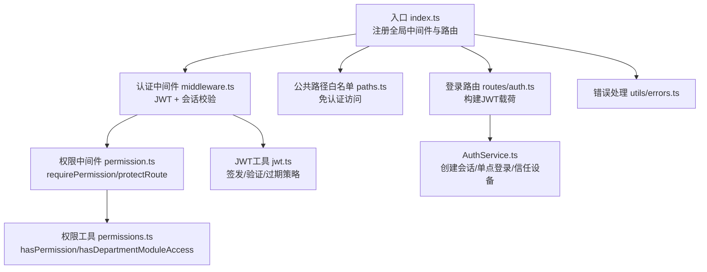
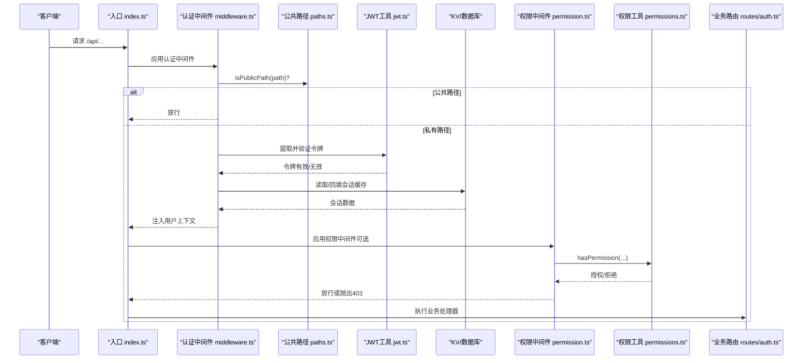
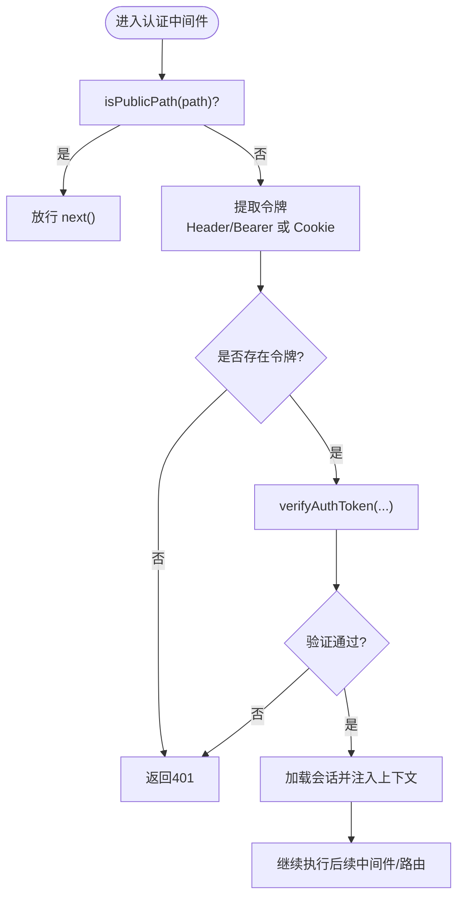
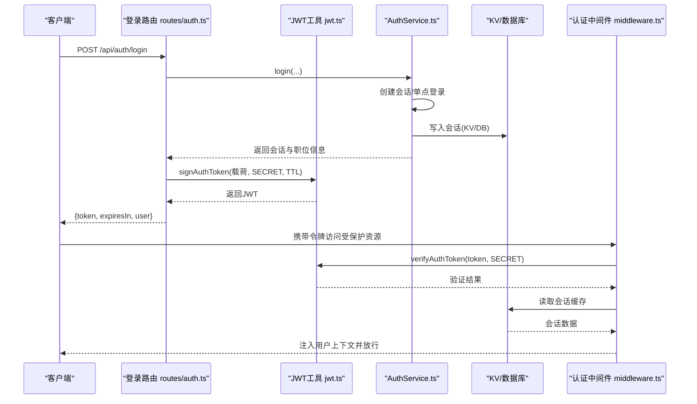
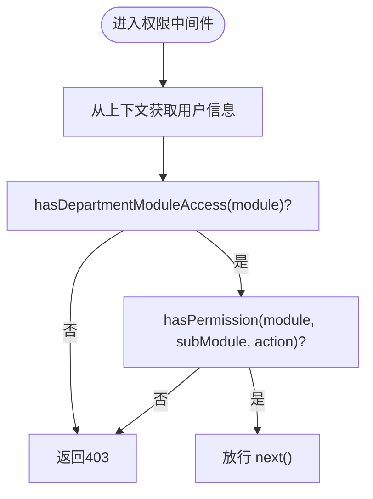
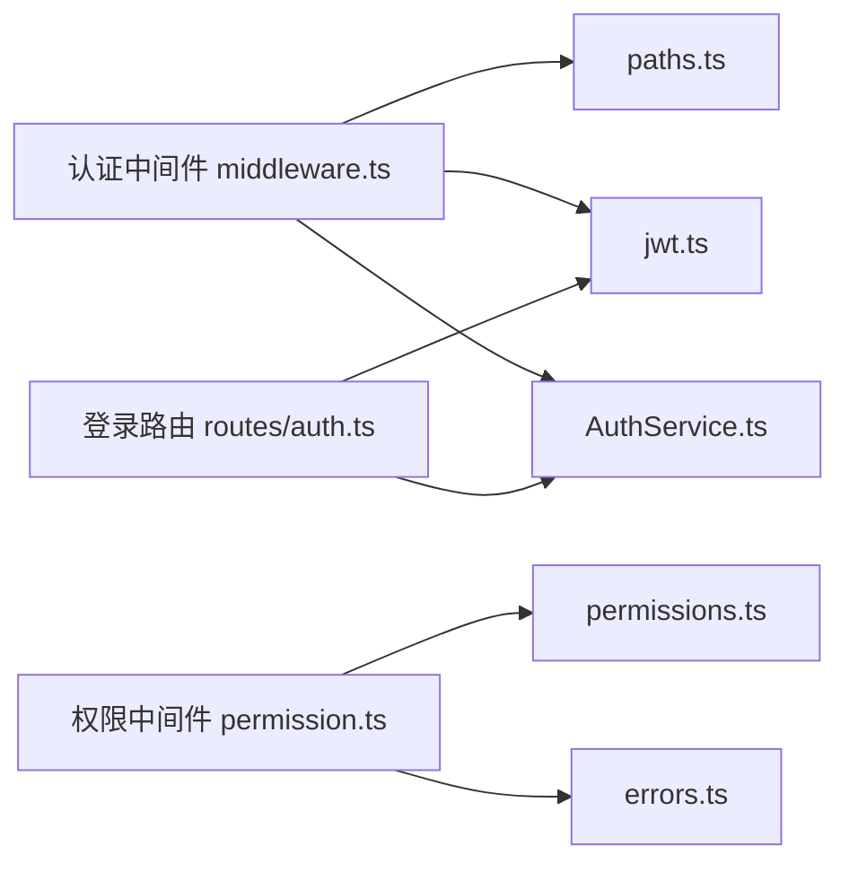

# 安全与认证

<cite>
**本文引用的文件**
- [backend/src/index.ts](file://backend/src/index.ts)
- [backend/src/middleware.ts](file://backend/src/middleware.ts)
- [backend/src/config/paths.ts](file://backend/src/config/paths.ts)
- [backend/src/middleware/permission.ts](file://backend/src/middleware/permission.ts)
- [backend/src/utils/jwt.ts](file://backend/src/utils/jwt.ts)
- [backend/src/utils/permissions.ts](file://backend/src/utils/permissions.ts)
- [backend/src/routes/auth.ts](file://backend/src/routes/auth.ts)
- [backend/src/services/AuthService.ts](file://backend/src/services/AuthService.ts)
- [backend/src/utils/errors.ts](file://backend/src/utils/errors.ts)
- [backend/test/services/RBAC.test.ts](file://backend/test/services/RBAC.test.ts)
</cite>

## 目录
1. [引言](#引言)
2. [项目结构](#项目结构)
3. [核心组件](#核心组件)
4. [架构总览](#架构总览)
5. [详细组件分析](#详细组件分析)
6. [依赖关系分析](#依赖关系分析)
7. [性能考量](#性能考量)
8. [故障排查指南](#故障排查指南)
9. [结论](#结论)
10. [附录](#附录)

## 引言
本文件深入剖析该系统的三层防护机制：
- 第一层：公共路径白名单与免认证访问
- 第二层：JWT认证与会话验证（含Cookie/Header/Bearer多来源）
- 第三层：RBAC权限控制（模块/子模块/操作三元组）

文档将结合index.ts中的全局中间件注册、paths.ts中的白名单集合、middleware.ts中的认证中间件、permission.ts中的权限中间件、以及jwt.ts中的令牌签发/验证策略，给出可操作的安全最佳实践与排障建议。

## 项目结构
后端采用Hono框架，按功能模块组织路由与服务。安全相关的关键位置如下：
- 入口与中间件注册：backend/src/index.ts
- 认证中间件：backend/src/middleware.ts
- 公共路径白名单：backend/src/config/paths.ts
- 权限中间件：backend/src/middleware/permission.ts
- JWT工具：backend/src/utils/jwt.ts
- 权限工具与RBAC：backend/src/utils/permissions.ts
- 登录与会话：backend/src/routes/auth.ts、backend/src/services/AuthService.ts
- 错误处理：backend/src/utils/errors.ts

图表来源
- [backend/src/index.ts](file://backend/src/index.ts#L87-L121)
- [backend/src/middleware.ts](file://backend/src/middleware.ts#L1-L72)
- [backend/src/config/paths.ts](file://backend/src/config/paths.ts#L1-L23)
- [backend/src/middleware/permission.ts](file://backend/src/middleware/permission.ts#L1-L39)
- [backend/src/utils/permissions.ts](file://backend/src/utils/permissions.ts#L1-L115)
- [backend/src/utils/jwt.ts](file://backend/src/utils/jwt.ts#L56-L119)
- [backend/src/routes/auth.ts](file://backend/src/routes/auth.ts#L1-L120)
- [backend/src/services/AuthService.ts](file://backend/src/services/AuthService.ts#L133-L175)
- [backend/src/utils/errors.ts](file://backend/src/utils/errors.ts#L59-L114)

章节来源
- [backend/src/index.ts](file://backend/src/index.ts#L87-L121)

## 核心组件
- 全局认证中间件：在所有/api/*路径上启用，负责公共路径放行、令牌提取与验证、会话加载与上下文注入。
- 公共路径白名单：通过Set集合快速判定是否免认证。
- RBAC权限中间件：基于模块/子模块/操作三元组进行细粒度权限校验。
- JWT工具：HMAC-SHA256签名、2小时TTL、多来源令牌提取（Header Bearer、自定义Header、Cookie）。
- 登录与会话：登录成功后签发JWT并创建会话，支持单点登录与信任设备策略。

章节来源
- [backend/src/middleware.ts](file://backend/src/middleware.ts#L1-L72)
- [backend/src/config/paths.ts](file://backend/src/config/paths.ts#L1-L23)
- [backend/src/middleware/permission.ts](file://backend/src/middleware/permission.ts#L1-L39)
- [backend/src/utils/jwt.ts](file://backend/src/utils/jwt.ts#L56-L119)
- [backend/src/routes/auth.ts](file://backend/src/routes/auth.ts#L27-L56)
- [backend/src/services/AuthService.ts](file://backend/src/services/AuthService.ts#L133-L175)

## 架构总览
下图展示了三层防护机制在请求生命周期中的交互顺序。

图表来源
- [backend/src/index.ts](file://backend/src/index.ts#L87-L121)
- [backend/src/middleware.ts](file://backend/src/middleware.ts#L1-L72)
- [backend/src/config/paths.ts](file://backend/src/config/paths.ts#L1-L23)
- [backend/src/utils/jwt.ts](file://backend/src/utils/jwt.ts#L56-L119)
- [backend/src/middleware/permission.ts](file://backend/src/middleware/permission.ts#L1-L39)
- [backend/src/utils/permissions.ts](file://backend/src/utils/permissions.ts#L80-L115)
- [backend/src/routes/auth.ts](file://backend/src/routes/auth.ts#L1-L120)

## 详细组件分析

### 第一层：公共路径白名单机制
- 白名单集合：通过Set维护，包含健康检查、登录、初始化等免认证端点。
- 判定逻辑：isPublicPath(path)用于快速判断；可在扩展中加入前缀匹配。
- 生效范围：认证中间件在进入令牌校验前先调用isPublicPath，命中则直接放行。

图表来源
- [backend/src/middleware.ts](file://backend/src/middleware.ts#L1-L72)
- [backend/src/config/paths.ts](file://backend/src/config/paths.ts#L1-L23)
- [backend/src/utils/jwt.ts](file://backend/src/utils/jwt.ts#L92-L111)

章节来源
- [backend/src/config/paths.ts](file://backend/src/config/paths.ts#L1-L23)
- [backend/src/middleware.ts](file://backend/src/middleware.ts#L1-L72)

### 第二层：JWT认证流程与会话验证
- 令牌来源：优先从自定义Header读取，其次从Authorization头提取Bearer，最后从Cookie读取。
- 签发策略：HMAC-SHA256签名，2小时TTL；签发时自动填充iat/exp。
- 验证策略：校验签名有效性与过期时间；过期或签名无效均返回401。
- 会话验证：KV缓存命中优先；未命中则回退数据库查询并异步写回KV；同时异步更新会话最后活跃时间；缺失会话或职位信息返回401/403。

图表来源
- [backend/src/routes/auth.ts](file://backend/src/routes/auth.ts#L27-L56)
- [backend/src/utils/jwt.ts](file://backend/src/utils/jwt.ts#L72-L111)
- [backend/src/services/AuthService.ts](file://backend/src/services/AuthService.ts#L133-L175)
- [backend/src/middleware.ts](file://backend/src/middleware.ts#L1-L72)

章节来源
- [backend/src/utils/jwt.ts](file://backend/src/utils/jwt.ts#L56-L119)
- [backend/src/routes/auth.ts](file://backend/src/routes/auth.ts#L27-L56)
- [backend/src/services/AuthService.ts](file://backend/src/services/AuthService.ts#L133-L175)
- [backend/src/middleware.ts](file://backend/src/middleware.ts#L1-L72)

### 第三层：RBAC权限控制（模块/子模块/操作）
- 中间件封装：requirePermission(module, subModule, action)与protectRoute(handler)对OpenAPI路由进行权限保护。
- 校验逻辑：
  - 部门模块访问：总部人员(level=1)不受模块限制；否则需满足部门允许的模块集合（支持通配符）。
  - 职位权限：从上下文中获取职位权限JSON，逐层匹配模块、子模块与操作数组。
- 辅助能力：canManageSubordinates、isHeadquartersStaff、canViewEmployee、canApproveApplication、getDataAccessFilter等，支撑更细粒度的数据访问控制与审批流。

图表来源
- [backend/src/middleware/permission.ts](file://backend/src/middleware/permission.ts#L1-L39)
- [backend/src/utils/permissions.ts](file://backend/src/utils/permissions.ts#L50-L115)

章节来源
- [backend/src/middleware/permission.ts](file://backend/src/middleware/permission.ts#L1-L39)
- [backend/src/utils/permissions.ts](file://backend/src/utils/permissions.ts#L50-L115)
- [backend/test/services/RBAC.test.ts](file://backend/test/services/RBAC.test.ts#L155-L206)

## 依赖关系分析
- 认证中间件依赖：
  - 路径白名单：paths.ts
  - JWT工具：jwt.ts
  - 会话加载：AuthService.ts（通过KV/DB）
- 权限中间件依赖：
  - 权限工具：permissions.ts
  - 错误处理：errors.ts
- 登录路由依赖：
  - JWT工具：jwt.ts
  - AuthService：创建会话、信任设备、审计日志

图表来源
- [backend/src/middleware.ts](file://backend/src/middleware.ts#L1-L72)
- [backend/src/config/paths.ts](file://backend/src/config/paths.ts#L1-L23)
- [backend/src/utils/jwt.ts](file://backend/src/utils/jwt.ts#L56-L119)
- [backend/src/services/AuthService.ts](file://backend/src/services/AuthService.ts#L133-L175)
- [backend/src/middleware/permission.ts](file://backend/src/middleware/permission.ts#L1-L39)
- [backend/src/utils/permissions.ts](file://backend/src/utils/permissions.ts#L1-L115)
- [backend/src/utils/errors.ts](file://backend/src/utils/errors.ts#L59-L114)
- [backend/src/routes/auth.ts](file://backend/src/routes/auth.ts#L1-L120)

章节来源
- [backend/src/middleware.ts](file://backend/src/middleware.ts#L1-L72)
- [backend/src/middleware/permission.ts](file://backend/src/middleware/permission.ts#L1-L39)
- [backend/src/utils/permissions.ts](file://backend/src/utils/permissions.ts#L1-L115)
- [backend/src/utils/jwt.ts](file://backend/src/utils/jwt.ts#L56-L119)
- [backend/src/routes/auth.ts](file://backend/src/routes/auth.ts#L1-L120)
- [backend/src/services/AuthService.ts](file://backend/src/services/AuthService.ts#L133-L175)
- [backend/src/utils/errors.ts](file://backend/src/utils/errors.ts#L59-L114)

## 性能考量
- 令牌验证：HMAC-SHA256在Edge运行时具备良好性能；建议保持2小时TTL以平衡安全性与刷新频率。
- 会话缓存：KV优先、DB回退，并在命中后异步写回KV，减少数据库压力。
- 异步更新：会话最后活跃时间与KV写入均使用waitUntil异步执行，避免阻塞主请求。
- 路由白名单：Set查找O(1)，路径判定高效。

章节来源
- [backend/src/middleware.ts](file://backend/src/middleware.ts#L26-L42)
- [backend/src/utils/jwt.ts](file://backend/src/utils/jwt.ts#L56-L60)

## 故障排查指南
- 401未授权
  - 检查是否携带令牌（Header Bearer、自定义Header或Cookie），确认SECRET一致。
  - 核对令牌是否过期（exp）。
- 403权限不足
  - 确认部门模块是否允许访问目标模块（总部人员不受模块限制）。
  - 检查职位权限JSON中是否存在对应子模块与操作。
- 会话异常
  - KV中无会话：确认AuthService是否正确写入KV与DB。
  - 会话过期：确认TTL与刷新策略。
- 登录问题
  - 2FA策略：新设备首次登录可能需要TOTP验证或绑定。
  - 单点登录：登录会清理旧会话，确保并发场景下一致性。

章节来源
- [backend/src/utils/errors.ts](file://backend/src/utils/errors.ts#L59-L114)
- [backend/src/services/AuthService.ts](file://backend/src/services/AuthService.ts#L133-L175)
- [backend/src/utils/permissions.ts](file://backend/src/utils/permissions.ts#L50-L115)
- [backend/test/services/RBAC.test.ts](file://backend/test/services/RBAC.test.ts#L1-L209)

## 结论
该系统通过“公共路径白名单 + JWT认证 + RBAC权限控制”形成清晰的三层防护。认证中间件统一处理令牌提取与会话校验，权限中间件以模块/子模块/操作三元组实现细粒度控制，JWT工具提供标准化的签发与验证策略。配合单点登录、信任设备与审计日志，整体安全体系兼顾易用性与可控性。

## 附录

### 安全最佳实践
- 防止JWT泄露
  - 仅通过HTTPS传输，避免明文Cookie；必要时设置HttpOnly与SameSite属性（若前端为同源页面，可考虑严格SameSite；跨域场景需评估CSRF风险）。
  - 控制令牌TTL（当前2小时），对高危操作可要求二次验证。
- CSRF防护
  - 对于非浏览器客户端或跨域场景，建议引入CSRF Token或使用Origin/CORS策略限制来源。
- 敏感端点的双重认证
  - 对高风险操作（如修改密码、注销、权限变更）启用TOTP二次验证或生物识别。
- 会话治理
  - 启用单点登录，登录即清理旧会话；定期清理过期会话；监控异常登录行为并触发审计告警。