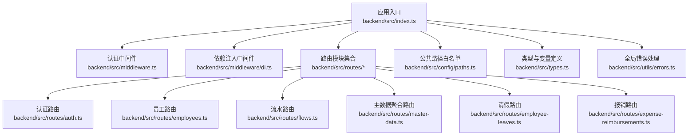
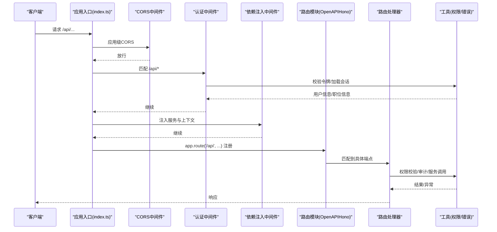
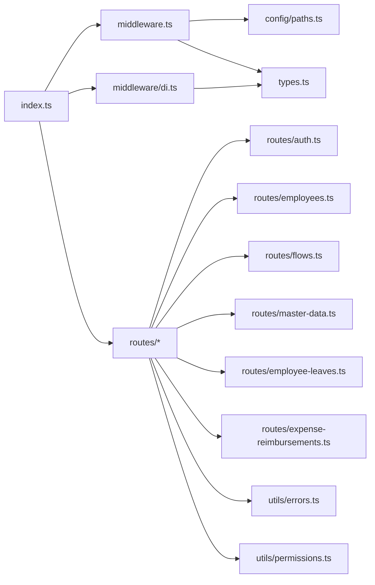

# 路由系统

<cite>
**本文引用的文件**
- [backend/src/index.ts](file://backend/src/index.ts)
- [backend/src/middleware.ts](file://backend/src/middleware.ts)
- [backend/src/middleware/di.ts](file://backend/src/middleware/di.ts)
- [backend/src/config/paths.ts](file://backend/src/config/paths.ts)
- [backend/src/types.ts](file://backend/src/types.ts)
- [backend/src/utils/errors.ts](file://backend/src/utils/errors.ts)
- [backend/src/utils/permissions.ts](file://backend/src/utils/permissions.ts)
- [backend/src/routes/auth.ts](file://backend/src/routes/auth.ts)
- [backend/src/routes/employees.ts](file://backend/src/routes/employees.ts)
- [backend/src/routes/flows.ts](file://backend/src/routes/flows.ts)
- [backend/src/routes/master-data.ts](file://backend/src/routes/master-data.ts)
- [backend/src/routes/employee-leaves.ts](file://backend/src/routes/employee-leaves.ts)
- [backend/src/routes/expense-reimbursements.ts](file://backend/src/routes/expense-reimbursements.ts)
</cite>

## 目录
1. [引言](#引言)
2. [项目结构](#项目结构)
3. [核心组件](#核心组件)
4. [架构总览](#架构总览)
5. [详细组件分析](#详细组件分析)
6. [依赖关系分析](#依赖关系分析)
7. [性能考量](#性能考量)
8. [故障排查指南](#故障排查指南)
9. [结论](#结论)

## 引言
本文件面向希望深入理解基于 Hono 的模块化路由架构的读者，围绕以下目标展开：
- 解析 index.ts 中通过 app.route() 方法集中注册各功能模块路由的设计模式
- 阐述路由前缀（/api）的统一管理机制与中间件作用域
- 展示 RESTful 端点定义规范（HTTP 方法、URL 命名约定、版本控制策略）
- 解释 OpenAPIHono 如何实现类型安全的路由定义
- 说明路由自动注册机制如何提升开发效率
- 分析路由加载顺序对中间件执行的影响
- 总结路由模块化拆分带来的维护性优势
- 提供路由调试技巧与常见 404 排查方法

## 项目结构
后端采用“按功能域划分”的路由组织方式，入口文件负责初始化应用、注册全局中间件与路由模块，并导出最终的 Hono 应用实例。关键目录与职责如下：
- backend/src/index.ts：应用入口，集中注册路由模块与中间件，暴露 OpenAPI 文档与 UI
- backend/src/routes/*：按领域拆分的路由模块，每个模块导出路由容器（OpenAPIHono 实例），内部定义 RESTful 端点
- backend/src/middleware/*：认证、依赖注入、权限等中间件
- backend/src/config/paths.ts：公共路径白名单（无需鉴权）
- backend/src/utils/*：错误处理、权限校验、审计等通用工具

图表来源
- [backend/src/index.ts](file://backend/src/index.ts#L42-L136)
- [backend/src/middleware.ts](file://backend/src/middleware.ts#L1-L82)
- [backend/src/middleware/di.ts](file://backend/src/middleware/di.ts#L1-L76)
- [backend/src/config/paths.ts](file://backend/src/config/paths.ts#L1-L23)
- [backend/src/types.ts](file://backend/src/types.ts#L1-L88)
- [backend/src/utils/errors.ts](file://backend/src/utils/errors.ts#L1-L114)
- [backend/src/routes/auth.ts](file://backend/src/routes/auth.ts#L1-L418)
- [backend/src/routes/employees.ts](file://backend/src/routes/employees.ts#L1-L462)
- [backend/src/routes/flows.ts](file://backend/src/routes/flows.ts#L1-L424)
- [backend/src/routes/master-data.ts](file://backend/src/routes/master-data.ts#L1-L23)
- [backend/src/routes/employee-leaves.ts](file://backend/src/routes/employee-leaves.ts#L1-L210)
- [backend/src/routes/expense-reimbursements.ts](file://backend/src/routes/expense-reimbursements.ts#L1-L263)

章节来源
- [backend/src/index.ts](file://backend/src/index.ts#L42-L136)

## 核心组件
- 应用与中间件
  - OpenAPIHono：提供类型安全的路由定义与 OpenAPI 文档生成能力
  - CORS 中间件：统一跨域配置
  - 认证中间件：校验令牌、加载用户会话与职位信息
  - 依赖注入中间件：初始化服务层并注入上下文
- 路由模块
  - 每个领域模块导出一个 OpenAPIHono 实例，内部通过 createRoute 定义端点
  - 主数据模块进一步 route 子模块，形成二级聚合
- 公共路径与白名单
  - PUBLIC_PATHS：无需鉴权的端点集合
- 类型与变量
  - Env：Cloudflare Workers 环境变量与绑定
  - AppVariables：运行时注入的服务与用户上下文

章节来源
- [backend/src/index.ts](file://backend/src/index.ts#L42-L136)
- [backend/src/middleware.ts](file://backend/src/middleware.ts#L1-L82)
- [backend/src/middleware/di.ts](file://backend/src/middleware/di.ts#L1-L76)
- [backend/src/config/paths.ts](file://backend/src/config/paths.ts#L1-L23)
- [backend/src/types.ts](file://backend/src/types.ts#L1-L88)

## 架构总览
下图展示了从请求进入应用到路由处理的整体流程，以及中间件与路由模块的交互关系。

图表来源
- [backend/src/index.ts](file://backend/src/index.ts#L42-L136)
- [backend/src/middleware.ts](file://backend/src/middleware.ts#L1-L82)
- [backend/src/middleware/di.ts](file://backend/src/middleware/di.ts#L1-L76)
- [backend/src/utils/permissions.ts](file://backend/src/utils/permissions.ts#L44-L122)
- [backend/src/utils/errors.ts](file://backend/src/utils/errors.ts#L1-L114)

## 详细组件分析

### 入口与路由注册（index.ts）
- 初始化 OpenAPIHono 并设置全局错误处理
- 注册 CORS、健康检查、版本信息等根路径端点
- 注册中间件：认证中间件与依赖注入中间件均作用于 /api/*
- 通过 app.route('/api', moduleRoutes) 将各模块挂载到统一前缀下；部分模块使用更深层前缀（如 /api/reports、/api/employee-leaves、/api/expense-reimbursements）
- 生成 OpenAPI 文档与 Swagger UI

章节来源
- [backend/src/index.ts](file://backend/src/index.ts#L42-L136)

### 认证中间件（middleware.ts）
- 公共路径白名单：通过 isPublicPath 判断是否放行
- 令牌提取：优先从自定义头、Authorization Bearer、Cookie 中读取
- 令牌校验：使用 AUTH_JWT_SECRET 验证
- 会话与职位加载：优先从 KV 缓存读取，未命中则回源数据库并异步写入 KV
- 设置上下文变量：userId、sessionId、userPosition、userEmployee、departmentModules
- 异步刷新会话活跃时间，避免阻塞请求

章节来源
- [backend/src/middleware.ts](file://backend/src/middleware.ts#L1-L82)
- [backend/src/config/paths.ts](file://backend/src/config/paths.ts#L1-L23)

### 依赖注入中间件（middleware/di.ts）
- 初始化数据库连接与各类服务实例
- 将 db 与 services 注入上下文，供路由处理器直接使用
- 保证路由层无需关心服务初始化细节，提升可测试性与可维护性

章节来源
- [backend/src/middleware/di.ts](file://backend/src/middleware/di.ts#L1-L76)
- [backend/src/types.ts](file://backend/src/types.ts#L1-L88)

### 路由模块设计（OpenAPIHono）
- 每个模块导出一个 OpenAPIHono 实例，内部使用 createRoute 定义端点
- 类型安全：通过 zod schema 定义请求体、查询参数、路径参数与响应结构
- 文档生成：openapi() 方法将路由元数据注册到 OpenAPI 文档
- 权限控制：在处理器内调用 hasPermission 进行细粒度权限校验
- 审计日志：在关键操作前后记录审计事件

章节来源
- [backend/src/routes/auth.ts](file://backend/src/routes/auth.ts#L1-L418)
- [backend/src/routes/employees.ts](file://backend/src/routes/employees.ts#L1-L462)
- [backend/src/routes/flows.ts](file://backend/src/routes/flows.ts#L1-L424)
- [backend/src/routes/employee-leaves.ts](file://backend/src/routes/employee-leaves.ts#L1-L210)
- [backend/src/routes/expense-reimbursements.ts](file://backend/src/routes/expense-reimbursements.ts#L1-L263)

### 主数据聚合路由（routes/master-data.ts）
- 作为聚合层，将多个子模块路由（总部、部门、账户、币种、分类、岗位、组织部门、供应商）挂载到统一前缀下
- 体现“领域内聚合”的模块化思想，便于维护与扩展

章节来源
- [backend/src/routes/master-data.ts](file://backend/src/routes/master-data.ts#L1-L23)

### RESTful 端点定义规范
- HTTP 方法选择
  - GET：列表与详情查询
  - POST：创建资源
  - PUT：更新资源
  - DELETE：删除资源（如存在）
- URL 命名约定
  - 使用小写复数名词作为资源路径（如 /employees、/flows、/reports）
  - 动作路径采用动词短语（如 /employees/:id/regularize、/flows/{id}/voucher）
- 版本控制策略
  - 当前代码未显式使用路径版本号（如 v1），而是通过 /api 前缀统一管理
  - 建议未来在 /api 下增加版本前缀（如 /api/v1）以支持向后兼容与平滑迁移

章节来源
- [backend/src/routes/employees.ts](file://backend/src/routes/employees.ts#L1-L462)
- [backend/src/routes/flows.ts](file://backend/src/routes/flows.ts#L1-L424)
- [backend/src/routes/employee-leaves.ts](file://backend/src/routes/employee-leaves.ts#L1-L210)
- [backend/src/routes/expense-reimbursements.ts](file://backend/src/routes/expense-reimbursements.ts#L1-L263)

### 类型安全的路由定义（OpenAPIHono）
- 使用 createRoute 定义端点元数据，包括方法、路径、请求体 schema、响应 schema
- 在处理器中通过 c.req.valid('json'|'query'|'param') 获取并校验输入
- 通过 zod schema 自动推导响应结构，结合 openapi() 生成 OpenAPI 文档
- 优点：编译期类型检查、文档即契约、减少手写 DTO 的重复劳动

章节来源
- [backend/src/routes/auth.ts](file://backend/src/routes/auth.ts#L1-L418)
- [backend/src/routes/employees.ts](file://backend/src/routes/employees.ts#L1-L462)
- [backend/src/routes/flows.ts](file://backend/src/routes/flows.ts#L1-L424)

### 路由自动注册机制与开发效率
- 入口文件集中导入并注册路由模块，无需手动拼接路径
- 通过 app.route('/api', moduleRoutes) 一次注册多个端点，减少样板代码
- 依赖注入中间件将服务注入上下文，路由处理器可直接调用服务，降低耦合
- OpenAPI 文档自动生成，便于联调与前端对接

章节来源
- [backend/src/index.ts](file://backend/src/index.ts#L95-L121)
- [backend/src/middleware/di.ts](file://backend/src/middleware/di.ts#L1-L76)

### 路由加载顺序与中间件执行影响
- 中间件注册顺序决定执行顺序：CORS -> 认证 -> 依赖注入
- 认证中间件仅作用于 /api/*，避免对根路径与公共接口产生不必要的开销
- 依赖注入中间件在认证之后，确保处理器能拿到 userId、userPosition、services 等上下文

章节来源
- [backend/src/index.ts](file://backend/src/index.ts#L52-L91)
- [backend/src/middleware.ts](file://backend/src/middleware.ts#L1-L82)
- [backend/src/middleware/di.ts](file://backend/src/middleware/di.ts#L1-L76)

### 路由模块化拆分的维护性优势
- 按领域拆分路由，职责清晰，易于定位问题与扩展新功能
- 聚合路由（如 master-data）将相关子模块组合，降低入口复杂度
- 统一的错误处理与权限校验在中间件层实现，避免重复代码

章节来源
- [backend/src/routes/master-data.ts](file://backend/src/routes/master-data.ts#L1-L23)
- [backend/src/utils/errors.ts](file://backend/src/utils/errors.ts#L1-L114)
- [backend/src/utils/permissions.ts](file://backend/src/utils/permissions.ts#L44-L122)

## 依赖关系分析
- 入口文件依赖各路由模块与中间件
- 路由模块依赖工具类（权限、错误、审计）、服务层与数据库
- 中间件依赖配置（公共路径）、环境变量与服务层

图表来源
- [backend/src/index.ts](file://backend/src/index.ts#L1-L136)
- [backend/src/middleware.ts](file://backend/src/middleware.ts#L1-L82)
- [backend/src/middleware/di.ts](file://backend/src/middleware/di.ts#L1-L76)
- [backend/src/config/paths.ts](file://backend/src/config/paths.ts#L1-L23)
- [backend/src/types.ts](file://backend/src/types.ts#L1-L88)
- [backend/src/utils/errors.ts](file://backend/src/utils/errors.ts#L1-L114)
- [backend/src/utils/permissions.ts](file://backend/src/utils/permissions.ts#L44-L122)
- [backend/src/routes/auth.ts](file://backend/src/routes/auth.ts#L1-L418)
- [backend/src/routes/employees.ts](file://backend/src/routes/employees.ts#L1-L462)
- [backend/src/routes/flows.ts](file://backend/src/routes/flows.ts#L1-L424)
- [backend/src/routes/master-data.ts](file://backend/src/routes/master-data.ts#L1-L23)
- [backend/src/routes/employee-leaves.ts](file://backend/src/routes/employee-leaves.ts#L1-L210)
- [backend/src/routes/expense-reimbursements.ts](file://backend/src/routes/expense-reimbursements.ts#L1-L263)

## 性能考量
- 认证中间件优先从 KV 缓存读取会话，未命中再回源数据库并异步写入 KV，降低延迟与数据库压力
- 依赖注入中间件在请求链路早期完成服务初始化，避免在处理器中重复初始化
- 健康检查使用快速查询并带超时保护，防止 DB 故障拖垮整体可用性
- 建议：对高频端点引入本地缓存、批量查询与分页优化；对大文件上传增加 CDN 与预签名 URL

[本节为通用建议，不直接分析具体文件]

## 故障排查指南
- 404 未找到
  - 检查路由前缀是否正确：/api 与各模块前缀是否一致
  - 确认 app.route 注册顺序与路径是否覆盖目标端点
  - 核对路径参数与查询参数是否符合 schema
- 401 未授权
  - 确认令牌来源（自定义头、Authorization Bearer、Cookie）是否正确
  - 检查 AUTH_JWT_SECRET 是否配置正确
  - 核对公共路径白名单是否遗漏
- 403 权限不足
  - 检查职位权限与部门模块访问控制
  - 确认 hasPermission 的模块、子模块与动作是否匹配
- 500 服务器内部错误
  - 查看全局错误处理日志，定位具体异常
  - 检查服务层调用与数据库事务
- OpenAPI 文档无法访问
  - 确认 app.doc 与 swaggerUI 路径是否正确注册
  - 检查中间件顺序与静态资源访问

章节来源
- [backend/src/index.ts](file://backend/src/index.ts#L122-L133)
- [backend/src/middleware.ts](file://backend/src/middleware.ts#L1-L82)
- [backend/src/config/paths.ts](file://backend/src/config/paths.ts#L1-L23)
- [backend/src/utils/errors.ts](file://backend/src/utils/errors.ts#L1-L114)
- [backend/src/utils/permissions.ts](file://backend/src/utils/permissions.ts#L44-L122)

## 结论
该系统通过 Hono 的 OpenAPIHono 实现了类型安全的路由定义与自动生成的 API 文档；通过中间件与依赖注入实现了认证、权限与服务注入的统一管理；通过模块化路由与聚合路由实现了清晰的领域拆分与可维护性。建议在未来引入版本前缀与更完善的缓存策略，以进一步提升可扩展性与性能。