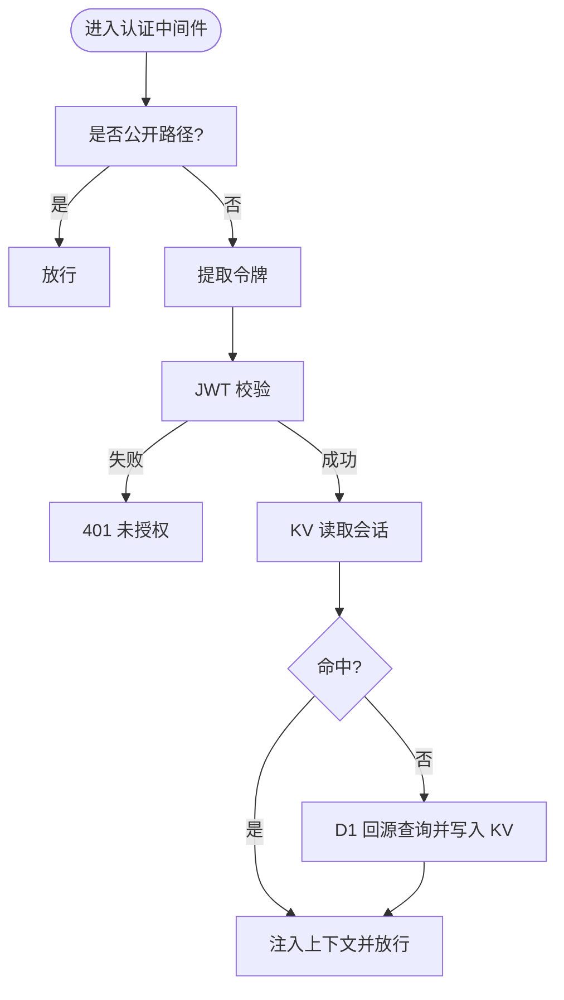

# 后端架构

<cite>
**本文引用的文件**
- [backend/src/index.ts](file://backend/src/index.ts)
- [backend/src/middleware.ts](file://backend/src/middleware.ts)
- [backend/src/middleware/di.ts](file://backend/src/middleware/di.ts)
- [backend/src/middleware/permission.ts](file://backend/src/middleware/permission.ts)
- [backend/src/db/schema.ts](file://backend/src/db/schema.ts)
- [backend/src/db/index.ts](file://backend/src/db/index.ts)
- [backend/src/utils/permissions.ts](file://backend/src/utils/permissions.ts)
- [backend/src/utils/errors.ts](file://backend/src/utils/errors.ts)
- [backend/src/utils/jwt.ts](file://backend/src/utils/jwt.ts)
- [backend/src/utils/db.ts](file://backend/src/utils/db.ts)
- [backend/src/routes/employees.ts](file://backend/src/routes/employees.ts)
- [backend/src/routes/auth.ts](file://backend/src/routes/auth.ts)
- [backend/src/services/FinanceService.ts](file://backend/src/services/FinanceService.ts)
- [backend/src/services/EmployeeService.ts](file://backend/src/services/EmployeeService.ts)
- [backend/src/services/AuthService.ts](file://backend/src/services/AuthService.ts)
- [backend/src/types.ts](file://backend/src/types.ts)
- [backend/src/config/paths.ts](file://backend/src/config/paths.ts)
- [backend/wrangler.toml](file://backend/wrangler.toml)
- [backend/package.json](file://backend/package.json)
</cite>

## 目录
1. [引言](#引言)
2. [项目结构](#项目结构)
3. [核心组件](#核心组件)
4. [架构总览](#架构总览)
5. [详细组件分析](#详细组件分析)
6. [依赖分析](#依赖分析)
7. [性能考量](#性能考量)
8. [故障排查指南](#故障排查指南)
9. [结论](#结论)
10. [附录](#附录)

## 引言
本文件面向希望理解“caiwu-main”后端在 Cloudflare Workers 上的无服务器架构与实现细节的开发者。文档重点覆盖：
- Hono 框架作为轻量级 API 路由与 OpenAPI 集成的优势
- 中间件链式调用、类型安全路由定义与全局错误处理
- 服务层（services）职责划分与依赖注入机制
- 基于 Drizzle ORM 的类型安全数据访问模式
- 权限控制中间件（RBAC）与 JWT 令牌验证流程
- RESTful API 设计规范与错误处理机制，并提供构建新 API 端点的标准模板

## 项目结构
后端采用按功能域分层的组织方式：
- 入口与路由：src/index.ts 注册中间件与路由模块
- 中间件：认证、依赖注入、权限控制
- 服务层：FinanceService、EmployeeService、AuthService 等封装业务逻辑
- 数据访问：Drizzle ORM + D1 + KV 缓存
- 工具与配置：权限工具、错误处理、JWT、路径白名单、类型定义、Wrangler 配置

图表来源
- [backend/src/index.ts](file://backend/src/index.ts#L1-L137)
- [backend/src/middleware.ts](file://backend/src/middleware.ts#L1-L82)
- [backend/src/middleware/di.ts](file://backend/src/middleware/di.ts#L1-L76)
- [backend/src/middleware/permission.ts](file://backend/src/middleware/permission.ts#L1-L39)
- [backend/src/services/FinanceService.ts](file://backend/src/services/FinanceService.ts#L1-L614)
- [backend/src/services/EmployeeService.ts](file://backend/src/services/EmployeeService.ts#L1-L593)
- [backend/src/services/AuthService.ts](file://backend/src/services/AuthService.ts#L1-L306)
- [backend/src/db/schema.ts](file://backend/src/db/schema.ts#L1-L644)

章节来源
- [backend/src/index.ts](file://backend/src/index.ts#L1-L137)
- [backend/src/types.ts](file://backend/src/types.ts#L1-L88)
- [backend/wrangler.toml](file://backend/wrangler.toml#L1-L45)

## 核心组件
- Hono 应用与 OpenAPI 集成：通过 OpenAPIHono 提供类型安全路由与自动文档生成
- 中间件链：全局 CORS、健康检查、认证、依赖注入、权限控制
- 服务层：每个领域服务封装业务规则，统一通过 Drizzle 访问数据库
- 数据层：Drizzle ORM + D1（SQLite 兼容）+ KV（会话缓存）
- 错误处理：统一 AppError 与全局 errorHandler，区分业务错误、验证错误与未预期错误

章节来源
- [backend/src/index.ts](file://backend/src/index.ts#L1-L137)
- [backend/src/utils/errors.ts](file://backend/src/utils/errors.ts#L1-L114)
- [backend/src/db/index.ts](file://backend/src/db/index.ts#L1-L7)

## 架构总览
下图展示了从客户端请求到服务层与数据层的交互路径，以及中间件在其中的作用。

图表来源
- [backend/src/index.ts](file://backend/src/index.ts#L43-L137)
- [backend/src/middleware.ts](file://backend/src/middleware.ts#L1-L82)
- [backend/src/middleware/di.ts](file://backend/src/middleware/di.ts#L1-L76)
- [backend/src/middleware/permission.ts](file://backend/src/middleware/permission.ts#L1-L39)
- [backend/src/services/FinanceService.ts](file://backend/src/services/FinanceService.ts#L1-L614)
- [backend/src/services/EmployeeService.ts](file://backend/src/services/EmployeeService.ts#L1-L593)
- [backend/src/services/AuthService.ts](file://backend/src/services/AuthService.ts#L1-L306)
- [backend/src/db/index.ts](file://backend/src/db/index.ts#L1-L7)

## 详细组件分析

### Hono 与 OpenAPI 集成
- 使用 OpenAPIHono 定义路由与响应结构，结合 zod 校验，实现类型安全的请求/响应
- 自动导出路由文档与 Swagger UI，便于前后端协作与联调
- 全局错误处理在应用启动时注册，确保所有异常被结构化输出

章节来源
- [backend/src/index.ts](file://backend/src/index.ts#L1-L137)
- [backend/src/utils/errors.ts](file://backend/src/utils/errors.ts#L1-L114)

### 认证中间件（JWT + 会话）
- 支持多来源令牌提取（Header、Cookie、Alt Header），兼容多种客户端
- 会话缓存：优先从 KV 读取，未命中则回源 D1 并异步写回 KV；同时异步刷新会话活跃时间
- 用户上下文注入：将 userId、sessionId、userPosition、userEmployee、departmentModules 写入上下文，供后续中间件与路由使用

图表来源
- [backend/src/middleware.ts](file://backend/src/middleware.ts#L1-L82)
- [backend/src/utils/jwt.ts](file://backend/src/utils/jwt.ts)
- [backend/src/utils/db.ts](file://backend/src/utils/db.ts)

章节来源
- [backend/src/middleware.ts](file://backend/src/middleware.ts#L1-L82)
- [backend/src/config/paths.ts](file://backend/src/config/paths.ts#L1-L23)

### 依赖注入中间件（DI）
- 在请求生命周期内创建 Drizzle 实例并初始化各 Service，注入到上下文
- 服务实例包括 FinanceService、EmployeeService、AuthService、MasterDataService、RentalService、ApprovalService、ReportService、IPWhitelistService、PositionService、SalaryService、AllowanceService、AllowancePaymentService 等
- 通过上下文统一访问 db 与 services，避免在路由中重复构造

章节来源
- [backend/src/middleware/di.ts](file://backend/src/middleware/di.ts#L1-L76)
- [backend/src/types.ts](file://backend/src/types.ts#L1-L88)

### 权限控制中间件（RBAC）
- requirePermission 与 protectRoute 两种形式：前者用于中间件链，后者用于 OpenAPI 路由包装
- 权限检查顺序：部门模块白名单（总部跳过）→ 职位权限矩阵（模块/子模块/动作）
- 辅助工具：hasDepartmentModuleAccess、hasPermission、canManageSubordinates、getDataAccessFilter 等

图表来源
- [backend/src/middleware/permission.ts](file://backend/src/middleware/permission.ts#L1-L39)
- [backend/src/utils/permissions.ts](file://backend/src/utils/permissions.ts#L1-L330)

章节来源
- [backend/src/middleware/permission.ts](file://backend/src/middleware/permission.ts#L1-L39)
- [backend/src/utils/permissions.ts](file://backend/src/utils/permissions.ts#L1-L330)

### 服务层（FinanceService、EmployeeService、AuthService）
- FinanceService：封装现金流、转账、AR/AP、借款/还款、站点账单等财务核心流程，负责凭证号生成、余额计算、状态同步等
- EmployeeService：员工生命周期管理（创建、迁移、更新、定职、离职、返岗）、与用户与邮箱路由联动
- AuthService：登录、会话管理、TOTP 绑定与验证、首次登录改密、审计日志

图表来源
- [backend/src/services/FinanceService.ts](file://backend/src/services/FinanceService.ts#L1-L614)
- [backend/src/services/EmployeeService.ts](file://backend/src/services/EmployeeService.ts#L1-L593)
- [backend/src/services/AuthService.ts](file://backend/src/services/AuthService.ts#L1-L306)
- [backend/src/db/index.ts](file://backend/src/db/index.ts#L1-L7)

章节来源
- [backend/src/services/FinanceService.ts](file://backend/src/services/FinanceService.ts#L1-L614)
- [backend/src/services/EmployeeService.ts](file://backend/src/services/EmployeeService.ts#L1-L593)
- [backend/src/services/AuthService.ts](file://backend/src/services/AuthService.ts#L1-L306)

### 数据访问与 Drizzle ORM
- Drizzle 初始化：createDb 将 D1Database 封装为 DrizzleD1Database，绑定 schema
- 类型安全：schema.ts 定义实体关系，服务层使用 Drizzle API 进行查询与更新
- 性能策略：KV 缓存会话，D1 作为持久化与审计备份；部分复杂查询使用 LEFT JOIN 与聚合

章节来源
- [backend/src/db/index.ts](file://backend/src/db/index.ts#L1-L7)
- [backend/src/db/schema.ts](file://backend/src/db/schema.ts#L1-L644)

### 路由与 RESTful 设计
- 路由模块：employees、auth 等均使用 OpenAPIHono 定义 createRoute，统一请求体与响应体的类型校验
- 权限控制：在路由层使用 requirePermission 或 protectRoute 包裹，确保 RBAC 生效
- 审计日志：对关键操作调用 logAuditAction 记录审计

图表来源
- [backend/src/routes/employees.ts](file://backend/src/routes/employees.ts#L1-L462)
- [backend/src/middleware/permission.ts](file://backend/src/middleware/permission.ts#L1-L39)
- [backend/src/services/EmployeeService.ts](file://backend/src/services/EmployeeService.ts#L1-L593)

章节来源
- [backend/src/routes/employees.ts](file://backend/src/routes/employees.ts#L1-L462)
- [backend/src/routes/auth.ts](file://backend/src/routes/auth.ts#L1-L418)

### 错误处理与统一响应
- AppError：统一业务错误类型，携带状态码、错误码与详情
- errorHandler：捕获 AppError、Zod 验证错误与未预期错误，输出结构化 JSON
- 401/403/404/409/400/500 分级处理，便于前端统一处理

章节来源
- [backend/src/utils/errors.ts](file://backend/src/utils/errors.ts#L1-L114)

## 依赖分析
- 外部依赖：Hono、@hono/zod-openapi、@hono/swagger-ui、drizzle-orm、bcryptjs、otplib、qrcode-svg、uuid、zod
- Cloudflare 绑定：D1、KV、R2、Service Binding（邮件 Worker）、Vars（JWT 密钥）

图表来源
- [backend/package.json](file://backend/package.json#L1-L43)
- [backend/wrangler.toml](file://backend/wrangler.toml#L1-L45)

章节来源
- [backend/package.json](file://backend/package.json#L1-L43)
- [backend/wrangler.toml](file://backend/wrangler.toml#L1-L45)

## 性能考量
- 会话缓存：KV 作为会话缓存，D1 作为持久化备份，减少数据库压力
- 异步写入：会话活跃时间更新、KV 写入、邮件通知等异步执行，避免阻塞主请求
- 查询优化：使用 LEFT JOIN 与 inArray 减少 N+1 查询；对高频查询进行 KV 缓存
- 健康检查：最小代价查询与超时控制，快速判断数据库可用性

[本节为通用指导，不直接分析具体文件]

## 故障排查指南
- 认证失败：检查 Authorization/Alt Header/Cookie 是否正确传递；确认 JWT 密钥与签名一致
- 会话未命中：确认 KV 命名空间绑定与 TTL 设置；检查回源 D1 是否正常
- 权限拒绝：核对职位权限矩阵与部门模块白名单；确认 hasPermission 参数（模块/子模块/动作）
- 业务错误：查看 AppError 的错误码与详情；结合审计日志定位问题
- 数据库异常：检查 D1 迁移脚本与 schema；确认 Drizzle 初始化与表结构一致

章节来源
- [backend/src/utils/errors.ts](file://backend/src/utils/errors.ts#L1-L114)
- [backend/src/middleware.ts](file://backend/src/middleware.ts#L1-L82)
- [backend/src/utils/permissions.ts](file://backend/src/utils/permissions.ts#L1-L330)

## 结论
本项目在 Cloudflare Workers 上实现了高内聚、低耦合的无服务器后端架构：
- Hono + OpenAPI 提供类型安全与自动化文档
- 中间件链清晰分离认证、注入与权限控制
- 服务层围绕业务域拆分，职责明确
- Drizzle ORM 保证数据访问的类型安全与可维护性
- RBAC 与 JWT 验证形成完善的权限体系
- 统一错误处理与审计日志提升可观测性与可维护性

[本节为总结，不直接分析具体文件]

## 附录

### 构建新 API 端点的标准模板（步骤）
- 定义路由：使用 OpenAPIHono 与 createRoute，声明请求体与响应体 schema
- 权限控制：在路由层使用 requirePermission 或 protectRoute 包裹
- 服务调用：从上下文获取 services，调用对应 Service 方法
- 数据访问：使用 Drizzle API 进行查询与更新，必要时使用 KV 缓存
- 错误处理：抛出 Errors.* 或 AppError；全局 errorHandler 会统一处理
- 审计日志：对关键操作调用审计日志工具

章节来源
- [backend/src/routes/employees.ts](file://backend/src/routes/employees.ts#L1-L462)
- [backend/src/middleware/permission.ts](file://backend/src/middleware/permission.ts#L1-L39)
- [backend/src/services/EmployeeService.ts](file://backend/src/services/EmployeeService.ts#L1-L593)
- [backend/src/utils/errors.ts](file://backend/src/utils/errors.ts#L1-L114)