# Drizzle ORM集成

<cite>
**本文档引用的文件**   
- [drizzle.config.ts](file://backend/drizzle.config.ts)
- [schema.ts](file://backend/src/db/schema.ts)
- [index.ts](file://backend/src/db/index.ts)
- [MasterDataService.ts](file://backend/src/services/MasterDataService.ts)
- [db.ts](file://backend/src/utils/db.ts)
- [departments.ts](file://backend/src/routes/master-data/departments.ts)
- [accounts.ts](file://backend/src/routes/master-data/accounts.ts)
- [categories.ts](file://backend/src/routes/master-data/categories.ts)
- [currencies.ts](file://backend/src/routes/master-data/currencies.ts)
- [vendors.ts](file://backend/src/routes/master-data/vendors.ts)
- [schema.sql](file://backend/src/db/schema.sql)
- [migration_add_audit_ip.sql](file://backend/src/db/archive/migration_add_audit_ip.sql)
- [migration_create_support_depts.sql](file://backend/src/db/archive/migration_create_support_depts.sql)
- [migration_performance_indexes.sql](file://backend/src/db/archive/migration_performance_indexes.sql)
</cite>

## 目录
1. [核心实体定义与数据库映射](#核心实体定义与数据库映射)
2. [Drizzle ORM初始化与D1适配器](#drizzle-orm初始化与d1适配器)
3. [类型安全的数据库操作](#类型安全的数据库操作)
4. [数据库迁移管理](#数据库迁移管理)
5. [总结](#总结)

## 核心实体定义与数据库映射

Drizzle ORM通过TypeScript在`schema.ts`文件中定义了项目的核心实体，实现了类型安全的数据库模式定义。这些实体包括用户、员工、财务流水、组织架构等，与SQLite数据库表结构精确映射。

用户实体（users）用于系统认证，包含邮箱、密码哈希、状态等字段。员工实体（employees）包含员工的详细信息，如姓名、职位、薪资、联系方式等。财务流水实体（cash_flows）记录了所有资金流动，包括业务日期、金额、账户、类别等关键信息。

组织架构通过多个表实现：departments表示项目（总部下的部门），org_departments表示组织部门（支持多层级结构），positions表示职位。这种设计支持复杂的组织结构，如总部、项目、组三级架构。

所有实体都使用`sqliteTable`函数定义，字段类型如`text`、`integer`、`real`等与SQLite数据类型对应。主键、唯一约束、默认值等数据库约束在TypeScript中直接声明，确保了代码与数据库的一致性。

```mermaid
erDiagram
USER {
string id PK
string email UK
string password_hash
integer active
integer must_change_password
integer password_changed
string totp_secret
integer last_login_at
string position_id FK
string department_id FK
string org_department_id FK
integer created_at
}
EMPLOYEE {
string id PK
string email UK
string name
string position_id FK
string org_department_id FK
string department_id FK
string join_date
integer probation_salary_cents
integer regular_salary_cents
integer living_allowance_cents
integer housing_allowance_cents
integer transportation_allowance_cents
integer meal_allowance_cents
string status
integer active
string phone
string usdt_address
string emergency_contact
string emergency_phone
string address
string memo
string birthday
string regular_date
string work_schedule
integer annual_leave_cycle_months
integer annual_leave_days
integer created_at
integer updated_at
}
POSITION {
string id PK
string code UK
string name
integer level
string function_role
integer can_manage_subordinates
string description
string permissions
integer sort_order
integer active
integer created_at
integer updated_at
}
DEPARTMENT {
string id PK
string hq_id FK
string name
string code
integer active
integer created_at
integer updated_at
}
ORG_DEPARTMENT {
string id PK
string project_id FK
string parent_id FK
string name
string code
string description
string allowed_modules
string allowed_positions
string default_position_id FK
integer active
integer sort_order
integer created_at
integer updated_at
}
CASH_FLOW {
string id PK
string voucher_no
string biz_date
string type
string account_id FK
string category_id FK
string method
integer amount_cents
string site_id FK
string department_id FK
string counterparty
string memo
string voucher_url
string created_by FK
integer created_at
}
ACCOUNT {
string id PK
string name
string type
string currency
string alias
string account_number
integer opening_cents
integer active
}
CATEGORY {
string id PK
string name
string kind
string parent_id FK
integer sort_order
integer active
}
USER ||--o{ EMPLOYEE : "1对多"
USER ||--o{ SESSION : "1对多"
USER ||--o{ BORROWING : "1对多"
USER ||--o{ TRUSTED_DEVICE : "1对多"
USER ||--o{ ALLOWANCE_PAYMENT : "创建"
USER ||--o{ SALARY_PAYMENT : "创建"
USER ||--o{ CASH_FLOW : "创建"
USER ||--o{ ACCOUNT_TRANSFER : "创建"
USER ||--o{ SITE_BILL : "创建"
USER ||--o{ EXPENSE_REIMBURSEMENT : "创建"
USER ||--o{ FIXED_ASSET : "创建"
USER ||--o{ RENTAL_PAYMENT : "创建"
USER ||--o{ RENTAL_PAYABLE_BILL : "创建"
USER ||--o{ AUDIT_LOG : "操作者"
EMPLOYEE ||--|| POSITION : "职位"
EMPLOYEE ||--|| DEPARTMENT : "部门"
EMPLOYEE ||--|| ORG_DEPARTMENT : "组织部门"
EMPLOYEE ||--o{ EMPLOYEE_SALARY : "薪资"
EMPLOYEE ||--o{ EMPLOYEE_ALLOWANCE : "津贴"
EMPLOYEE ||--o{ EMPLOYEE_LEAVE : "请假"
EMPLOYEE ||--o{ SALARY_PAYMENT : "薪资支付"
EMPLOYEE ||--o{ ALLOWANCE_PAYMENT : "津贴支付"
EMPLOYEE ||--o{ EXPENSE_REIMBURSEMENT : "报销"
EMPLOYEE ||--o{ ATTENDANCE_RECORD : "考勤"
EMPLOYEE ||--o{ FIXED_ASSET_ALLOCATION : "资产分配"
EMPLOYEE ||--o{ DORMITORY_ALLOCATION : "宿舍分配"
POSITION ||--o{ ORG_DEPARTMENT : "默认职位"
POSITION ||--o{ USER : "用户职位"
POSITION ||--o{ EMPLOYEE : "员工职位"
DEPARTMENT ||--|| HEADQUARTERS : "总部"
DEPARTMENT ||--o{ SITE : "站点"
DEPARTMENT ||--o{ ORG_DEPARTMENT : "组织部门"
DEPARTMENT ||--o{ CASH_FLOW : "财务流水"
DEPARTMENT ||--o{ AR_AP_DOC : "应收应付"
DEPARTMENT ||--o{ FIXED_ASSET : "固定资产"
DEPARTMENT ||--o{ RENTAL_PROPERTY : "租赁物业"
ORG_DEPARTMENT ||--o{ ORG_DEPARTMENT : "父子关系"
ORG_DEPARTMENT ||--o{ EMPLOYEE : "员工"
ORG_DEPARTMENT ||--o{ USER : "用户"
CASH_FLOW ||--|| ACCOUNT : "账户"
CASH_FLOW ||--|| CATEGORY : "类别"
CASH_FLOW ||--|| SITE : "站点"
CASH_FLOW ||--|| DEPARTMENT : "部门"
CASH_FLOW ||--o{ ACCOUNT_TRANSACTION : "交易记录"
CASH_FLOW ||--o{ SETTLEMENT : "结算"
ACCOUNT ||--|| CURRENCY : "币种"
ACCOUNT ||--o{ ACCOUNT_TRANSACTION : "交易记录"
ACCOUNT ||--o{ CASH_FLOW : "财务流水"
ACCOUNT ||--o{ BORROWING : "借款"
ACCOUNT ||--o{ REPAYMENT : "还款"
ACCOUNT ||--o{ ACCOUNT_TRANSFER : "转账"
ACCOUNT ||--o{ SITE_BILL : "站点账单"
ACCOUNT ||--o{ FIXED_ASSET : "固定资产"
ACCOUNT ||--o{ RENTAL_PAYMENT : "租金支付"
ACCOUNT ||--o{ RENTAL_PAYABLE_BILL : "应付账单"
CATEGORY ||--o{ CATEGORY : "父子关系"
CATEGORY ||--o{ CASH_FLOW : "财务流水"
CATEGORY ||--o{ AR_AP_DOC : "应收应付"
CATEGORY ||--o{ SITE_BILL : "站点账单"
CATEGORY ||--o{ RENTAL_PAYMENT : "租金支付"
SITE ||--|| DEPARTMENT : "部门"
SITE ||--o{ CASH_FLOW : "财务流水"
SITE ||--o{ AR_AP_DOC : "应收应付"
SITE ||--o{ SITE_BILL : "账单"
SITE ||--o{ FIXED_ASSET : "固定资产"
HEADQUARTERS ||--o{ DEPARTMENT : "部门"
CURRENCY ||--o{ ACCOUNT : "账户"
CURRENCY ||--o{ EMPLOYEE_SALARY : "员工薪资"
CURRENCY ||--o{ EMPLOYEE_ALLOWANCE : "员工津贴"
CURRENCY ||--o{ ALLOWANCE_PAYMENT : "津贴支付"
CURRENCY ||--o{ SALARY_PAYMENT_ALLOCATION : "薪资分配"
CURRENCY ||--o{ EXPENSE_REIMBURSEMENT : "报销"
CURRENCY ||--o{ FIXED_ASSET : "固定资产"
CURRENCY ||--o{ RENTAL_PROPERTY : "租赁物业"
CURRENCY ||--o{ RENTAL_PAYMENT : "租金支付"
CURRENCY ||--o{ RENTAL_PAYABLE_BILL : "应付账单"
BORROWING ||--|| USER : "借款人"
BORROWING ||--|| ACCOUNT : "账户"
BORROWING ||--|| BORROWER : "借款对象"
BORROWING ||--o{ REPAYMENT : "还款"
BORROWING ||--o{ ALLOWANCE_PAYMENT : "津贴支付"
BORROWING ||--o{ SALARY_PAYMENT : "薪资支付"
REPAYMENT ||--|| BORROWING : "借款"
REPAYMENT ||--|| ACCOUNT : "账户"
REPAYMENT ||--|| USER : "创建者"
ACCOUNT_TRANSACTION ||--|| CASH_FLOW : "财务流水"
ACCOUNT_TRANSFER ||--|| ACCOUNT : "转出账户"
ACCOUNT_TRANSFER ||--|| ACCOUNT : "转入账户"
ACCOUNT_TRANSFER ||--|| USER : "创建者"
VENDOR ||--o{ CASH_FLOW : "财务流水"
VENDOR ||--o{ AR_AP_DOC : "应收应付"
VENDOR ||--o{ FIXED_ASSET : "固定资产"
SITE_BILL ||--|| SITE : "站点"
SITE_BILL ||--|| ACCOUNT : "账户"
SITE_BILL ||--|| CATEGORY : "类别"
SITE_BILL ||--|| USER : "创建者"
EXPENSE_REIMBURSEMENT ||--|| EMPLOYEE : "员工"
EXPENSE_REIMBURSEMENT ||--|| CURRENCY : "币种"
EXPENSE_REIMBURSEMENT ||--|| USER : "创建者"
FIXED_ASSET ||--|| VENDOR : "供应商"
FIXED_ASSET ||--|| DEPARTMENT : "部门"
FIXED_ASSET ||--|| SITE : "站点"
FIXED_ASSET ||--|| ACCOUNT : "账户"
FIXED_ASSET ||--|| CURRENCY : "币种"
FIXED_ASSET ||--|| USER : "创建者"
FIXED_ASSET ||--o{ FIXED_ASSET_DEPRECIATION : "折旧"
FIXED_ASSET ||--o{ FIXED_ASSET_CHANGE : "变更"
FIXED_ASSET ||--o{ FIXED_ASSET_ALLOCATION : "分配"
FIXED_ASSET_ALLOCATION ||--|| EMPLOYEE : "员工"
FIXED_ASSET_ALLOCATION ||--|| USER : "创建者"
RENTAL_PROPERTY ||--|| DEPARTMENT : "部门"
RENTAL_PROPERTY ||--|| ACCOUNT : "付款账户"
RENTAL_PROPERTY ||--|| CURRENCY : "币种"
RENTAL_PROPERTY ||--o{ RENTAL_PAYMENT : "租金支付"
RENTAL_PROPERTY ||--o{ RENTAL_CHANGE : "变更"
RENTAL_PROPERTY ||--o{ DORMITORY_ALLOCATION : "宿舍分配"
RENTAL_PROPERTY ||--o{ RENTAL_PAYABLE_BILL : "应付账单"
RENTAL_PAYMENT ||--|| RENTAL_PROPERTY : "物业"
RENTAL_PAYMENT ||--|| ACCOUNT : "账户"
RENTAL_PAYMENT ||--|| CATEGORY : "类别"
RENTAL_PAYMENT ||--|| USER : "创建者"
RENTAL_PAYABLE_BILL ||--|| RENTAL_PROPERTY : "物业"
RENTAL_PAYABLE_BILL ||--|| ACCOUNT : "付款账户"
RENTAL_PAYABLE_BILL ||--|| USER : "创建者"
```

**图源**
- [schema.ts](file://backend/src/db/schema.ts#L1-L644)

**本节来源**
- [schema.ts](file://backend/src/db/schema.ts#L1-L644)
- [schema.sql](file://backend/src/db/schema.sql#L1-L662)

## Drizzle ORM初始化与D1适配器

Drizzle ORM通过`drizzle-orm/d1`适配器与Cloudflare D1数据库集成。初始化流程在`src/db/index.ts`文件中实现，通过`createDb`函数完成。

`createDb`函数接收一个`D1Database`实例作为参数，使用`drizzle`函数创建数据库实例。该函数将D1数据库连接与在`schema.ts`中定义的模式（schema）关联起来，从而提供类型安全的数据库访问接口。

在`utils/db.ts`文件中也实现了相同的`createDb`函数，确保在整个应用中使用一致的数据库初始化方式。这种设计使得数据库连接可以在不同的服务和工具之间共享和复用。

D1数据库连接通过依赖注入的方式传递给`createDb`函数。在应用启动时，从环境变量中获取D1数据库实例，并将其注入到需要数据库访问的服务中。这种依赖注入模式提高了代码的可测试性和可维护性。

**本节来源**
- [index.ts](file://backend/src/db/index.ts#L1-L7)
- [db.ts](file://backend/src/utils/db.ts#L1-L314)

## 类型安全的数据库操作

Drizzle ORM在`MasterDataService.ts`等服务类中展示了类型安全的SELECT、INSERT、UPDATE、DELETE操作。通过链式调用，可以构建复杂的查询。

例如，在`MasterDataService`中，`getDepartments`方法使用`select().from(departments).all()`执行SELECT查询。`createDepartment`方法使用`insert(departments).values({...}).execute()`执行INSERT操作。`updateDepartment`方法使用`update(departments).set({...}).where(eq(departments.id, id)).execute()`执行UPDATE操作。`deleteDepartment`方法使用`delete(departments).where(eq(departments.id, id)).execute()`执行DELETE操作。

链式调用如`leftJoin`、`where`、`orderBy`等提供了强大的查询构建能力。例如，在`getAccounts`方法中，使用`leftJoin(currencies, eq(currencies.code, accounts.currency))`进行表连接，使用`where(or(...))`构建复杂的条件查询，使用`orderBy(accounts.name)`进行排序。

在路由处理函数中，如`departments.ts`、`accounts.ts`等，服务实例通过依赖注入获取，并调用其方法执行数据库操作。错误处理和审计日志记录在这些处理函数中实现，确保了操作的安全性和可追溯性。

**图源**
- [MasterDataService.ts](file://backend/src/services/MasterDataService.ts#L1-L608)
- [departments.ts](file://backend/src/routes/master-data/departments.ts#L1-L327)

**本节来源**
- [MasterDataService.ts](file://backend/src/services/MasterDataService.ts#L1-L608)
- [departments.ts](file://backend/src/routes/master-data/departments.ts#L1-L327)
- [accounts.ts](file://backend/src/routes/master-data/accounts.ts#L1-L253)
- [categories.ts](file://backend/src/routes/master-data/categories.ts#L1-L155)
- [currencies.ts](file://backend/src/routes/master-data/currencies.ts#L1-L165)
- [vendors.ts](file://backend/src/routes/master-data/vendors.ts#L1-L237)

## 数据库迁移管理

Drizzle ORM的配置在`drizzle.config.ts`文件中定义，支持数据库迁移管理。配置指定了方言为"sqlite"，模式文件为"./src/db/schema.ts"，迁移输出目录为"./drizzle"。

数据库迁移通过SQL文件实现，存放在`src/db/archive/`目录中。每个迁移文件都有清晰的注释，说明迁移的目的和创建时间。例如，`migration_add_audit_ip.sql`为审计日志表添加IP和IP归属地字段，`migration_create_support_depts.sql`批量创建客服部门，`migration_performance_indexes.sql`创建性能优化索引。

迁移脚本通过`package.json`中的`migrate:all`和`migrate:remote`脚本执行。这些脚本使用`wrangler d1 execute`命令在本地或远程执行所有迁移文件。这种自动化迁移流程确保了数据库模式在不同环境中的同步。

通过将模式定义与迁移脚本分离，项目实现了模式的版本控制和可追溯性。`schema.sql`文件包含了完整的数据库模式，可以作为参考和初始化数据库的基础。

**本节来源**
- [drizzle.config.ts](file://backend/drizzle.config.ts#L1-L8)
- [migration_add_audit_ip.sql](file://backend/src/db/archive/migration_add_audit_ip.sql#L1-L5)
- [migration_create_support_depts.sql](file://backend/src/db/archive/migration_create_support_depts.sql#L1-L255)
- [migration_performance_indexes.sql](file://backend/src/db/archive/migration_performance_indexes.sql#L1-L42)
- [package.json](file://backend/package.json#L1-L43)

## 总结

Drizzle ORM在项目中提供了类型安全的数据库访问，通过TypeScript定义模式，实现了代码与数据库的一致性。初始化流程简单明了，通过`createDb`函数将D1数据库连接与模式关联。类型安全的查询操作提高了开发效率，减少了运行时错误。数据库迁移管理通过SQL文件和自动化脚本实现，确保了模式的版本控制和环境同步。整体集成方案高效、可靠，为项目的稳定运行提供了坚实的基础。

**本节来源**
- [drizzle.config.ts](file://backend/drizzle.config.ts#L1-L8)
- [schema.ts](file://backend/src/db/schema.ts#L1-L644)
- [index.ts](file://backend/src/db/index.ts#L1-L7)
- [MasterDataService.ts](file://backend/src/services/MasterDataService.ts#L1-L608)