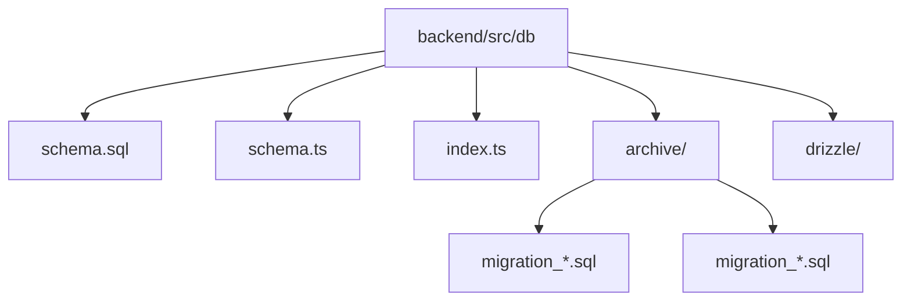

# 数据库迁移

<cite>
**本文档引用的文件**
- [schema.sql](file://backend/src/db/schema.sql)
- [schema.ts](file://backend/src/db/schema.ts)
- [drizzle.config.ts](file://backend/drizzle.config.ts)
- [setup.ts](file://backend/test/setup.ts)
- [migration_remove_users_name.sql](file://backend/src/db/archive/migration_remove_users_name.sql)
- [migration_performance_indexes.sql](file://backend/src/db/archive/migration_performance_indexes.sql)
- [migration_add_audit_ip.sql](file://backend/src/db/archive/migration_add_audit_ip.sql)
- [migration_vendors_add_columns.sql](file://backend/src/db/archive/migration_vendors_add_columns.sql)
- [migration_cleanup.sql](file://backend/src/db/archive/migration_cleanup.sql)
</cite>

## 目录
1. [引言](#引言)
2. [项目结构](#项目结构)
3. [核心迁移策略](#核心迁移策略)
4. [Schema权威源与同步](#schema权威源与同步)
5. [迁移配置与执行](#迁移配置与执行)
6. [测试环境中的Schema应用](#测试环境中的schema应用)
7. [迁移执行顺序与回滚策略](#迁移执行顺序与回滚策略)
8. [团队协作最佳实践](#团队协作最佳实践)
9. [结论](#结论)

## 引言
本文档全面解析基于SQL脚本的数据库迁移策略，重点分析`migration_*.sql`系列脚本的版本控制逻辑和原子性操作模式。文档阐述了`schema.sql`作为单一权威源的作用及其与`schema.ts`的同步关系，并说明了如何通过`drizzle.config.ts`配置迁移输出目录。同时，结合`test/setup.ts`中的`applySchema`函数，解释在测试环境中如何通过编程方式应用Schema。最后，讨论迁移脚本的执行顺序、回滚策略以及在团队协作中的最佳实践。

## 项目结构
项目后端数据库相关文件组织清晰，主要迁移文件位于`backend/src/db/`目录下。核心Schema定义文件`schema.sql`和`schema.ts`位于该目录根部，而历史迁移脚本则存放在`archive/`子目录中。这种结构有助于区分当前状态与历史变更。



**Diagram sources**
- [schema.sql](file://backend/src/db/schema.sql)
- [schema.ts](file://backend/src/db/schema.ts)

**Section sources**
- [schema.sql](file://backend/src/db/schema.sql)
- [schema.ts](file://backend/src/db/schema.ts)

## 核心迁移策略

本文档分析了多个关键的SQL迁移脚本，揭示了项目中采用的安全迁移技术。这些技术包括使用`PRAGMA foreign_keys`、创建备份表、重建表结构等，确保了数据的完整性和迁移的原子性。

### 移除字段的原子性迁移
以`migration_remove_users_name.sql`为例，该脚本展示了如何安全地从`users`表中移除`name`字段。此操作遵循了典型的原子性迁移模式：

1.  **禁用外键约束**：通过`PRAGMA foreign_keys = OFF;`暂时禁用外键检查，避免在重建表过程中出现约束冲突。
2.  **创建备份表**：使用`CREATE TABLE users_backup_name_removal AS SELECT * FROM users;`创建一个包含所有数据的备份表，作为安全网。
3.  **创建新表结构**：定义一个名为`users_new`的新表，其结构不包含`name`字段。
4.  **迁移数据**：将旧表中的数据（排除`name`字段）复制到新表中。
5.  **原子性切换**：通过`DROP TABLE users;`删除旧表，然后使用`ALTER TABLE users_new RENAME TO users;`将新表重命名为原表名。这个操作在数据库层面是原子的，确保了服务的连续性。
6.  **重建索引并启用外键**：为新表创建必要的索引，并通过`PRAGMA foreign_keys = ON;`重新启用外键约束。

这种模式确保了即使迁移过程失败，也可以通过备份表恢复数据。

**Section sources**
- [migration_remove_users_name.sql](file://backend/src/db/archive/migration_remove_users_name.sql)

### 添加字段的增量迁移
对于添加字段的场景，如`migration_add_audit_ip.sql`，策略更为直接。该脚本使用`ALTER TABLE`语句为`audit_logs`表添加了`ip`和`ip_location`两个新字段。这是一种非破坏性的增量变更，不会影响现有数据。

```sql
ALTER TABLE audit_logs ADD COLUMN ip TEXT;
ALTER TABLE audit_logs ADD COLUMN ip_location TEXT;
```

**Section sources**
- [migration_add_audit_ip.sql](file://backend/src/db/archive/migration_add_audit_ip.sql)

### 数据库清理与优化
`migration_cleanup.sql`脚本展示了如何清理废弃的列和表。它使用`ALTER TABLE ... DROP COLUMN`语句移除了`positions`表的`scope`列和`employees`表的`job_role`列。同时，该脚本还负责清理在之前迁移中创建的临时备份表，保持数据库的整洁。

**Section sources**
- [migration_cleanup.sql](file://backend/src/db/archive/migration_cleanup.sql)

### 性能优化索引迁移
`migration_performance_indexes.sql`脚本专注于数据库性能优化。它通过创建一系列复合索引来加速关键查询。例如，为`cash_flows`表创建了`(biz_date, department_id)`和`(biz_date, site_id)`等索引，以优化按业务日期和部门/站点进行查询的性能。这种迁移通常在数据量增长后进行，对查询性能有显著提升。

**Section sources**
- [migration_performance_indexes.sql](file://backend/src/db/archive/migration_performance_indexes.sql)

## Schema权威源与同步

### schema.sql 作为单一权威源
在本项目中，`backend/src/db/schema.sql`文件扮演着数据库Schema的单一权威源（Single Source of Truth）的角色。该文件包含了数据库所有表、索引和视图的完整定义。其主要作用包括：

- **初始化数据库**：在创建新环境（如开发、测试）时，可以直接执行`schema.sql`来快速构建完整的数据库结构。
- **提供完整视图**：开发者可以通过阅读此文件获得数据库的完整、最新的结构视图，而无需追溯所有历史迁移脚本。
- **保证一致性**：作为权威源，它确保了所有环境的数据库结构最终都与该文件定义的结构保持一致。

### schema.ts 与 schema.sql 的同步关系
`backend/src/db/schema.ts`是使用Drizzle ORM定义的TypeScript Schema。它与`schema.sql`之间存在紧密的同步关系：

- **代码生成**：`schema.sql`文件是由`schema.ts`通过Drizzle Kit工具自动生成的。开发人员在`schema.ts`中定义数据库结构，然后运行`drizzle-kit`命令生成对应的`schema.sql`文件。
- **类型安全**：`schema.ts`为TypeScript代码提供了类型安全，使得数据库操作可以在编译时进行类型检查，减少运行时错误。
- **双向同步**：虽然主要流程是从`schema.ts`生成`schema.sql`，但为了保证权威性，任何对`schema.sql`的手动修改都应被视为最终状态，并需要反向更新`schema.ts`以保持同步。然而，最佳实践是始终通过修改`schema.ts`来驱动Schema变更。


**Diagram sources**
- [schema.sql](file://backend/src/db/schema.sql)
- [schema.ts](file://backend/src/db/schema.ts)

**Section sources**
- [schema.sql](file://backend/src/db/schema.sql)
- [schema.ts](file://backend/src/db/schema.ts)

## 迁移配置与执行

### drizzle.config.ts 配置
`drizzle.config.ts`文件是Drizzle ORM的配置文件，它定义了迁移系统的关键参数。其核心配置如下：

- **dialect**: 设置为`"sqlite"`，指明目标数据库为SQLite。
- **schema**: 指向`"./src/db/schema.ts"`，这是Drizzle Kit生成`schema.sql`时的源文件。
- **out**: 设置为`"./drizzle"`，这是生成的迁移文件（migration files）的输出目录。

此配置确保了Drizzle Kit工具能够正确地从TypeScript定义生成SQL迁移脚本，并将它们存放在指定的`drizzle/`目录中，以便后续的迁移工具（如Wrangler）执行。

**Section sources**
- [drizzle.config.ts](file://backend/drizzle.config.ts)

### 迁移执行脚本
项目的`package.json`文件中定义了多个用于执行迁移的npm脚本，这为团队提供了标准化的操作方式：

- **`npm run migrate`**: 使用`wrangler d1 execute`命令执行`schema.sql`文件，通常用于初始化数据库。
- **`npm run migrate:all` 和 `npm run migrate:remote`**: 这些脚本使用bash循环，按文件名顺序执行`src/db/migration_*.sql`目录下的所有迁移脚本。`migrate:remote`明确指定了`--remote`标志，用于在远程生产环境中执行。

这种通过npm脚本管理的方式，简化了迁移流程，降低了人为操作错误的风险。

**Section sources**
- [package.json](file://backend/package.json)

## 测试环境中的Schema应用

在测试环境中，项目采用了一种直接应用完整Schema的策略，而不是逐个执行历史迁移脚本。这通过`backend/test/setup.ts`文件中的`applySchema`函数实现。

### applySchema 函数分析
`applySchema`函数的工作流程如下：

1.  **加载SQL文件**：使用ES模块的`import()`函数动态加载`schema.sql`文件的原始内容（`?raw`后缀确保加载为字符串）。
2.  **分割SQL语句**：将整个SQL文件内容按分号(`;`)分割成多个独立的语句。
3.  **逐条执行**：遍历分割后的语句数组，过滤掉空语句，并使用D1Database的`prepare().run()`方法逐条执行。

这种方法的优势在于**速度极快**。对于单元测试和集成测试，每次运行前都需要一个干净的数据库状态。如果执行所有历史迁移脚本，耗时会很长。而直接应用`schema.sql`可以瞬间构建出最新的数据库结构，极大地提高了测试效率。

```mermaid
sequenceDiagram
participant Test as 测试框架
participant Setup as setup.ts
participant DB as D1数据库
Test->>Setup : 调用 applySchema(db)
Setup->>Setup : 加载 schema.sql?raw
Setup->>Setup : 按';'分割SQL语句
loop 每条SQL语句
Setup->>DB : prepare(statement).run()
end
DB-->>Setup : 执行成功
Setup-->>Test : 返回完成
```

**Diagram sources**
- [setup.ts](file://backend/test/setup.ts)

**Section sources**
- [setup.ts](file://backend/test/setup.ts)

## 迁移执行顺序与回滚策略

### 执行顺序
迁移脚本的执行顺序至关重要。本项目通过两种方式保证顺序：
1.  **命名约定**：迁移脚本采用`migration_*.sql`的命名模式，`package.json`中的脚本通过`migration_*.sql`通配符匹配，这依赖于文件系统的字母顺序。因此，建议在脚本名中加入时间戳（如`migration_20251130_add_index.sql`）来确保正确的执行顺序。
2.  **依赖管理**：每个迁移脚本应只依赖于其之前已执行的脚本所创建的结构。开发人员在编写新迁移时，必须确保其依赖的表或列已经存在。

### 回滚策略
从提供的文件来看，项目主要采用**前向迁移**（Forward-only Migration）策略，即不提供自动回滚脚本。其回滚策略体现在：
- **备份表**：如`migration_remove_users_name.sql`所示，关键的破坏性操作会创建备份表。如果迁移后发现问题，可以手动执行SQL将数据从备份表恢复。
- **幂等性**：脚本中大量使用`IF NOT EXISTS`和`IF EXISTS`等条件语句，使得脚本可以安全地重复执行，这在部分失败后重新运行时非常有用。
- **手动恢复**：对于严重问题，最可靠的回滚方式是使用数据库备份进行恢复，而不是依赖复杂的自动回滚逻辑。

## 团队协作最佳实践

为了确保团队在数据库迁移上的高效协作，建议遵循以下最佳实践：
1.  **小步快跑**：每次迁移只做一件事，保持脚本简短、专注。这降低了出错风险，也便于代码审查。
2.  **清晰的注释**：每个迁移脚本都应包含详细的注释，说明其目的、影响范围和执行步骤，如示例脚本所示。
3.  **代码审查**：所有迁移脚本在合并前都必须经过严格的代码审查，重点关注数据完整性和性能影响。
4.  **测试先行**：在生产环境执行前，必须在预发布环境中充分测试迁移脚本。
5.  **文档化**：重要的架构变更应在项目文档中进行记录，而不仅仅依赖于迁移脚本的注释。

## 结论
该项目的数据库迁移策略结合了安全的原子性操作、清晰的权威源管理以及高效的测试环境搭建。通过使用`PRAGMA`、备份表和重建模式，确保了复杂变更的安全性。`schema.sql`作为单一权威源，与`schema.ts`协同工作，实现了类型安全与结构完整性的统一。在测试中直接应用完整Schema的策略，显著提升了开发效率。虽然缺乏自动回滚机制，但通过创建备份表和依赖数据库备份，提供了一种可靠的手动恢复方案。遵循小步快跑、充分测试和严格审查的团队协作实践，是维护数据库健康和系统稳定的关键。