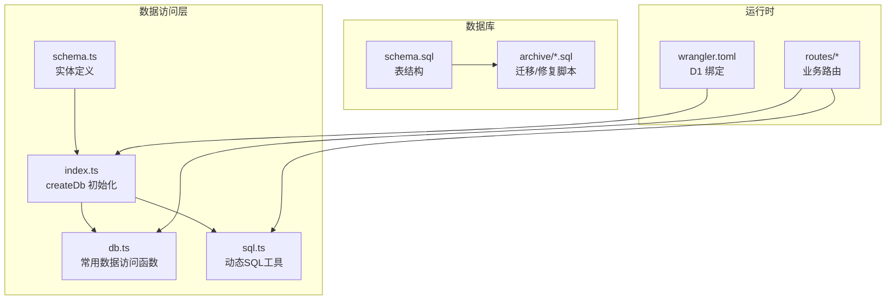
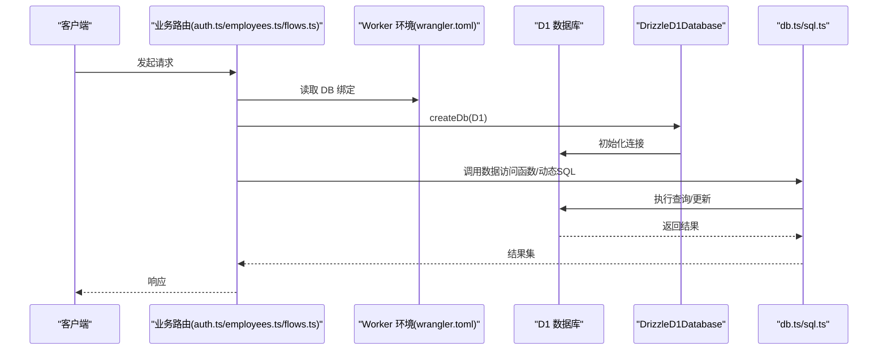
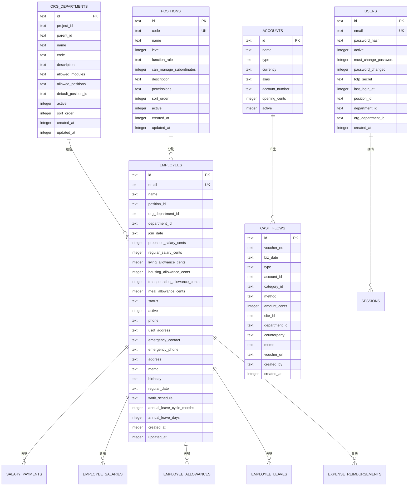
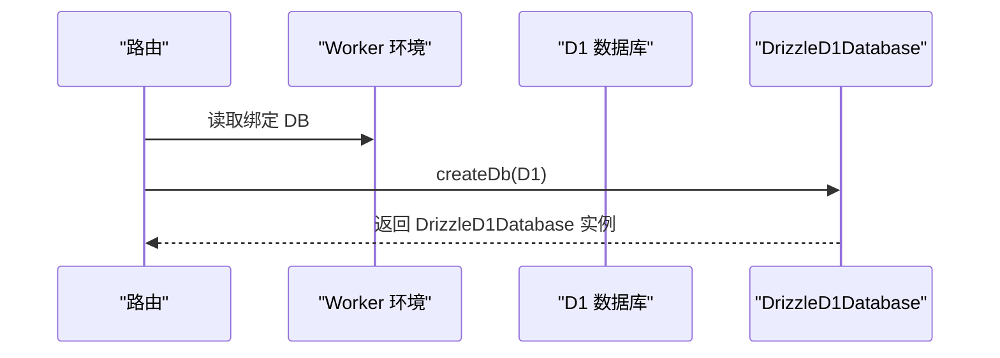
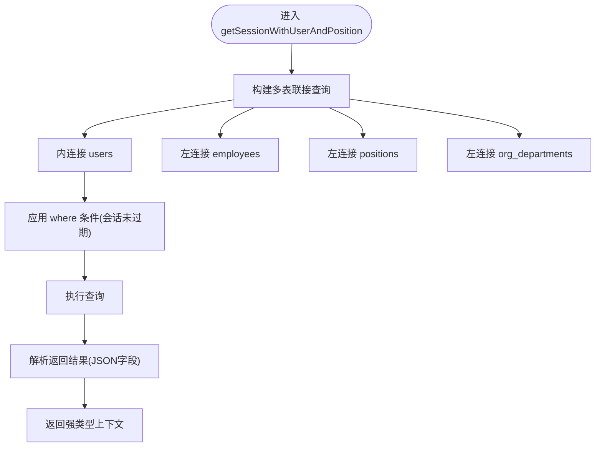
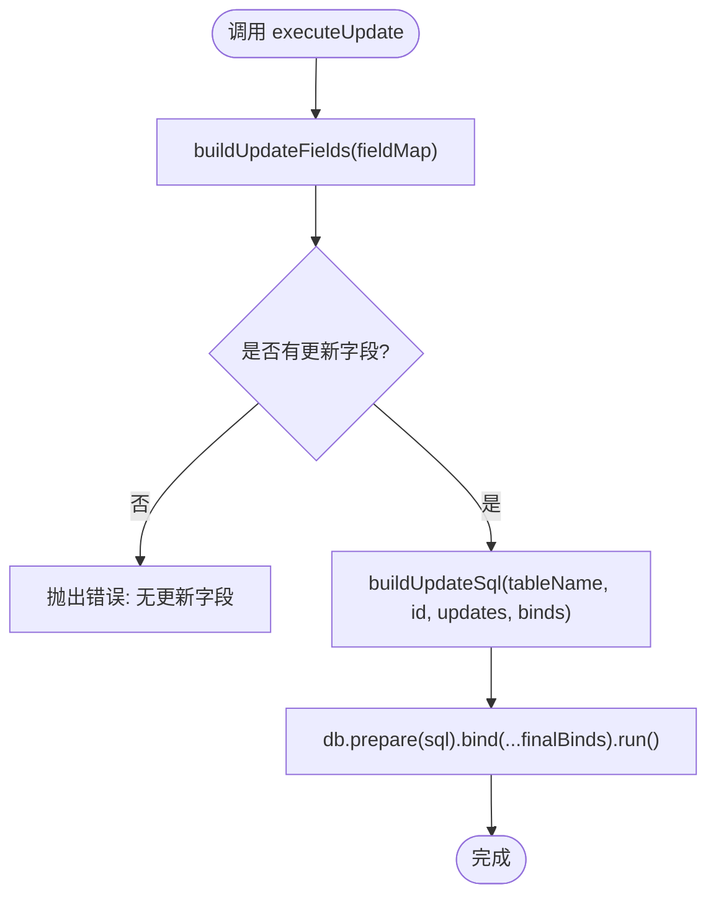
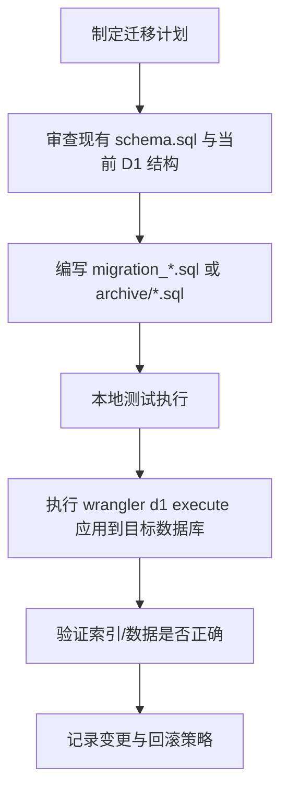
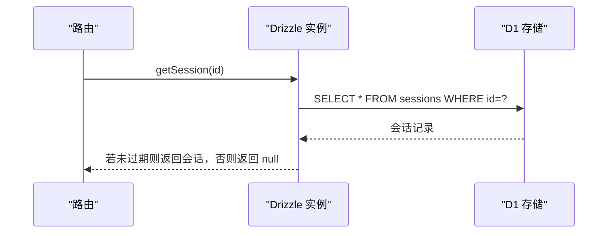
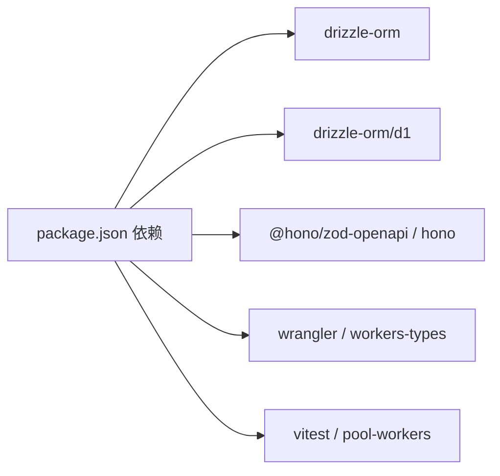

# 数据访问层

<cite>
**本文引用的文件**
- [schema.ts](file://backend/src/db/schema.ts)
- [index.ts](file://backend/src/db/index.ts)
- [db.ts](file://backend/src/utils/db.ts)
- [sql.ts](file://backend/src/utils/sql.ts)
- [schema.sql](file://backend/src/db/schema.sql)
- [migration_performance_indexes.sql](file://backend/src/db/archive/migration_performance_indexes.sql)
- [fix_employees.sql](file://backend/src/db/archive/fix_employees.sql)
- [drizzle.config.ts](file://backend/drizzle.config.ts)
- [wrangler.toml](file://backend/wrangler.toml)
- [package.json](file://backend/package.json)
- [auth.ts](file://backend/src/routes/auth.ts)
- [employees.ts](file://backend/src/routes/employees.ts)
- [flows.ts](file://backend/src/routes/flows.ts)
</cite>

## 目录
1. [简介](#简介)
2. [项目结构](#项目结构)
3. [核心组件](#核心组件)
4. [架构总览](#架构总览)
5. [详细组件分析](#详细组件分析)
6. [依赖分析](#依赖分析)
7. [性能考量](#性能考量)
8. [故障排查指南](#故障排查指南)
9. [结论](#结论)
10. [附录](#附录)

## 简介
本文件系统性阐述基于 Drizzle ORM 的类型安全数据访问层设计，重点覆盖：
- schema.ts 中实体关系模型（用户、财务流水、组织架构等）的 TypeScript 定义与数据库表结构映射关系
- 类型推导在查询操作中的优势
- drizzle-orm/d1 适配器的初始化流程（createDb 函数）与 D1 数据库连接管理
- SQL 迁移脚本（migration_*.sql）的版本控制策略与执行机制，包括索引优化（migration_performance_indexes.sql）与数据修复脚本（fix_employees.sql）
- 自定义 SQL 查询工具（sql.ts）在复杂查询场景下的应用
- 数据库连接复用（getSession）的最佳实践

## 项目结构
后端采用分层架构，数据访问层由 Drizzle ORM + Cloudflare D1 提供支持，核心文件分布如下：
- schema.ts：定义所有实体表的 TypeScript 映射
- index.ts：Drizzle D1 适配器初始化入口
- db.ts：常用数据访问函数（会话、用户、员工、权限等）
- sql.ts：动态 SQL 构造与执行工具
- schema.sql：完整数据库表结构定义
- archive 下的迁移脚本：版本化演进与性能优化
- drizzle.config.ts：Drizzle Kit 配置
- wrangler.toml：Cloudflare Workers 绑定 D1 数据库
- routes/*：业务路由层调用数据访问层与 Drizzle 查询

图表来源
- [schema.ts](file://backend/src/db/schema.ts#L1-L644)
- [index.ts](file://backend/src/db/index.ts#L1-L7)
- [db.ts](file://backend/src/utils/db.ts#L1-L314)
- [sql.ts](file://backend/src/utils/sql.ts#L1-L75)
- [schema.sql](file://backend/src/db/schema.sql#L1-L662)
- [migration_performance_indexes.sql](file://backend/src/db/archive/migration_performance_indexes.sql#L1-L42)
- [fix_employees.sql](file://backend/src/db/archive/fix_employees.sql#L1-L26)
- [wrangler.toml](file://backend/wrangler.toml#L1-L45)

章节来源
- [schema.ts](file://backend/src/db/schema.ts#L1-L644)
- [schema.sql](file://backend/src/db/schema.sql#L1-L662)
- [drizzle.config.ts](file://backend/drizzle.config.ts#L1-L8)
- [wrangler.toml](file://backend/wrangler.toml#L1-L45)

## 核心组件
- 实体定义（schema.ts）：以 sqliteTable 定义各业务表，字段类型与约束与 schema.sql 保持一致，确保类型安全与数据库一致性
- Drizzle 初始化（index.ts）：通过 createDb 将 D1 数据库实例与 schema 绑定，返回 DrizzleD1Database 实例
- 数据访问函数（db.ts）：封装常用查询、插入、会话校验、用户上下文聚合等逻辑
- 动态 SQL 工具（sql.ts）：提供动态更新语句构建与执行，适用于复杂或非标准化更新场景
- 迁移与修复（archive/*.sql）：版本化演进与性能优化，如索引优化与数据修复
- 路由层集成：业务路由通过 createDb 或直接使用 D1 实例进行查询与事务处理

章节来源
- [index.ts](file://backend/src/db/index.ts#L1-L7)
- [db.ts](file://backend/src/utils/db.ts#L1-L314)
- [sql.ts](file://backend/src/utils/sql.ts#L1-L75)
- [schema.ts](file://backend/src/db/schema.ts#L1-L644)
- [schema.sql](file://backend/src/db/schema.sql#L1-L662)

## 架构总览
Drizzle ORM 在 Cloudflare Workers 环境下通过 drizzle-orm/d1 适配器与 D1 数据库交互。路由层在请求生命周期内获取 D1 绑定，创建 Drizzle 实例，随后调用 db.ts 中的函数或直接使用 Drizzle 查询 DSL 完成业务操作。

图表来源
- [auth.ts](file://backend/src/routes/auth.ts#L1-L200)
- [employees.ts](file://backend/src/routes/employees.ts#L1-L200)
- [flows.ts](file://backend/src/routes/flows.ts#L1-L200)
- [wrangler.toml](file://backend/wrangler.toml#L1-L45)
- [index.ts](file://backend/src/db/index.ts#L1-L7)
- [db.ts](file://backend/src/utils/db.ts#L1-L314)
- [sql.ts](file://backend/src/utils/sql.ts#L1-L75)

## 详细组件分析

### 实体关系模型与类型推导
- schema.ts 使用 sqliteTable 定义了用户、员工、职位、部门、组织部门、账户、现金流、报销、借款、固定资产管理、租赁等核心业务实体
- 字段类型涵盖 text、integer、real、primaryKey 等，与 schema.sql 保持一致，确保类型安全
- 通过 Drizzle 的类型系统，查询返回值具备强类型推导，减少运行时错误

图表来源
- [schema.ts](file://backend/src/db/schema.ts#L1-L644)

章节来源
- [schema.ts](file://backend/src/db/schema.ts#L1-L644)
- [schema.sql](file://backend/src/db/schema.sql#L1-L662)

### Drizzle 初始化与 D1 连接管理
- createDb(d1: D1Database)：将 D1 数据库实例与 schema 绑定，返回 DrizzleD1Database 实例
- 路由层通常在每次请求中调用 createDb 获取会话级数据库句柄
- wrangler.toml 中通过 [[d1_databases]] binding 指定 DB 绑定名称，确保 Worker 可访问 D1

图表来源
- [index.ts](file://backend/src/db/index.ts#L1-L7)
- [wrangler.toml](file://backend/wrangler.toml#L1-L45)

章节来源
- [index.ts](file://backend/src/db/index.ts#L1-L7)
- [wrangler.toml](file://backend/wrangler.toml#L1-L45)

### 类型安全查询与复杂场景
- db.ts 中的 getUserByEmail/getUserById/getSession 等函数展示了类型安全的查询写法：返回值类型由 Drizzle 推断，避免手动转换
- 复杂联表查询（getSessionWithUserAndPosition）通过 innerJoin/leftJoin 聚合用户、员工、职位、组织部门模块信息，返回强类型结果
- flows.ts 中对 cash_flows 的过滤逻辑使用 sql 条件拼接，结合 Drizzle 查询构建器实现灵活权限控制

图表来源
- [db.ts](file://backend/src/utils/db.ts#L116-L222)

章节来源
- [db.ts](file://backend/src/utils/db.ts#L1-L314)
- [flows.ts](file://backend/src/routes/flows.ts#L120-L195)

### 自定义 SQL 工具与最佳实践
- sql.ts 提供动态更新语句构建与执行：
  - buildUpdateFields：根据传入字段映射构造更新片段与绑定值
  - buildUpdateSql：拼装最终 SQL 并追加 id 参数
  - executeUpdate：组合上述步骤并执行
- 最佳实践：
  - 仅在需要动态更新或非标准更新时使用
  - 对外部输入进行严格校验，防止注入
  - 与事务配合使用，保证原子性

图表来源
- [sql.ts](file://backend/src/utils/sql.ts#L1-L75)

章节来源
- [sql.ts](file://backend/src/utils/sql.ts#L1-L75)

### 迁移脚本与版本控制策略
- 迁移脚本位于 backend/src/db/migration_*.sql 与 archive/*.sql
- 版本控制策略：
  - 以文件名前缀区分功能域（如 migration_performance_indexes.sql、fix_employees.sql）
  - 通过脚本注释记录创建时间与目的
  - 使用 wrangler d1 execute 执行，支持本地与远程数据库
- 索引优化脚本（migration_performance_indexes.sql）：
  - 为 cash_flows、borrowings、employee_leaves、expense_reimbursements、ar_ap_docs、employee_salaries、fixed_assets、sites 等表添加复合索引，提升常见查询性能
- 数据修复脚本（fix_employees.sql）：
  - 重建 employees 表并恢复唯一索引与常用索引，解决历史数据问题

图表来源
- [migration_performance_indexes.sql](file://backend/src/db/archive/migration_performance_indexes.sql#L1-L42)
- [fix_employees.sql](file://backend/src/db/archive/fix_employees.sql#L1-L26)
- [package.json](file://backend/package.json#L1-L43)

章节来源
- [migration_performance_indexes.sql](file://backend/src/db/archive/migration_performance_indexes.sql#L1-L42)
- [fix_employees.sql](file://backend/src/db/archive/fix_employees.sql#L1-L26)
- [package.json](file://backend/package.json#L1-L43)

### 会话与连接复用最佳实践
- getSession：从 sessions 表查询指定 id 的会话，并检查过期时间，返回 null 或会话对象
- 复用建议：
  - 在路由中间件中统一创建 Drizzle 实例（createDb），避免重复初始化
  - 对于高频查询，优先使用 Drizzle 查询构建器而非原生 SQL，以获得类型安全与可维护性
  - 对于复杂条件，可在服务层封装查询，路由层只负责参数校验与调用

图表来源
- [db.ts](file://backend/src/utils/db.ts#L41-L50)

章节来源
- [db.ts](file://backend/src/utils/db.ts#L1-L314)

## 依赖分析
- Drizzle ORM 依赖：drizzle-orm、drizzle-orm/d1
- Cloudflare Workers：wrangler、@cloudflare/workers-types
- 路由与 OpenAPI：@hono/zod-openapi、hono
- 测试：vitest、@cloudflare/vitest-pool-workers

图表来源
- [package.json](file://backend/package.json#L1-L43)

章节来源
- [package.json](file://backend/package.json#L1-L43)

## 性能考量
- 索引优化：迁移脚本已为高频查询字段建立复合索引，建议持续监控慢查询并补充必要索引
- 查询模式：优先使用 Drizzle 查询构建器，减少手写 SQL；对复杂权限过滤，可在服务层封装
- 连接管理：在 Worker 请求生命周期内按需创建 Drizzle 实例，避免全局共享长连接
- 数据类型：金额类字段统一使用整数存储（cents），避免浮点误差

## 故障排查指南
- 迁移失败：
  - 检查 wrangler.toml 中 D1 绑定名称与数据库 ID 是否正确
  - 使用 package.json 中的 migrate/migrate:all 脚本逐个执行迁移脚本
- 类型不匹配：
  - 确认 schema.ts 与 schema.sql 字段定义一致
  - 使用 drizzle-kit 重新生成迁移或同步 schema
- 会话失效：
  - 检查 getSession 过期逻辑与时间戳单位（毫秒）
- 动态 SQL 注入风险：
  - 严格校验字段映射，避免直接拼接不受控输入
  - 使用绑定参数与白名单字段

章节来源
- [wrangler.toml](file://backend/wrangler.toml#L1-L45)
- [package.json](file://backend/package.json#L1-L43)
- [db.ts](file://backend/src/utils/db.ts#L41-L50)
- [sql.ts](file://backend/src/utils/sql.ts#L1-L75)

## 结论
本数据访问层以 Drizzle ORM 为核心，结合 Cloudflare D1 实现类型安全与高性能的数据访问。schema.ts 与 schema.sql 保持一致，配合迁移脚本与索引优化，确保系统在演进过程中保持稳定与高效。db.ts 与 sql.ts 分别覆盖常规查询与复杂动态更新场景，路由层通过 createDb 实现连接复用与类型安全。建议持续完善服务层封装与测试，进一步提升可维护性与可靠性。

## 附录
- Drizzle Kit 配置：drizzle.config.ts 指定方言、schema 文件与输出目录
- 路由示例：
  - 登录路由（auth.ts）：演示会话创建与用户上下文聚合
  - 员工路由（employees.ts）：展示列表与创建流程
  - 现金流路由（flows.ts）：演示复杂过滤与权限控制

章节来源
- [drizzle.config.ts](file://backend/drizzle.config.ts#L1-L8)
- [auth.ts](file://backend/src/routes/auth.ts#L1-L200)
- [employees.ts](file://backend/src/routes/employees.ts#L1-L200)
- [flows.ts](file://backend/src/routes/flows.ts#L1-L200)