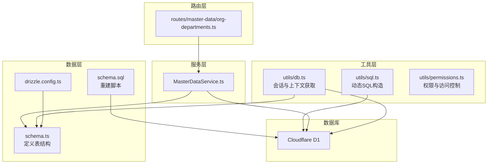
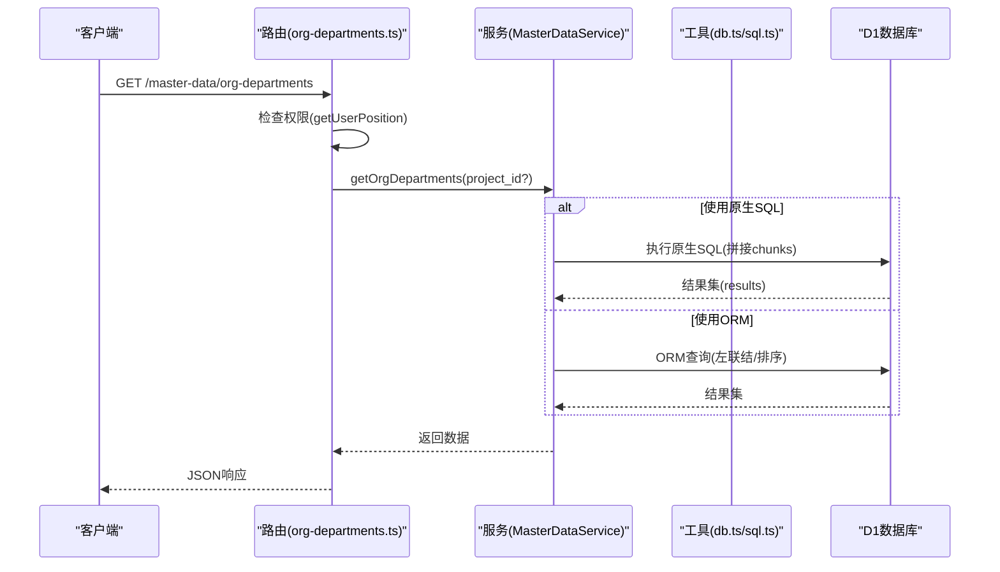
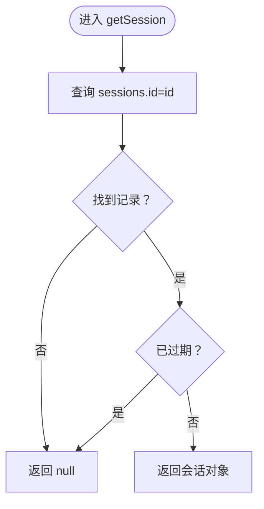
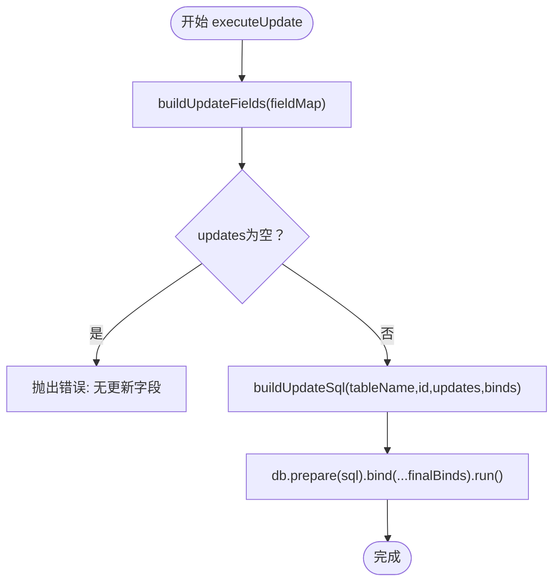
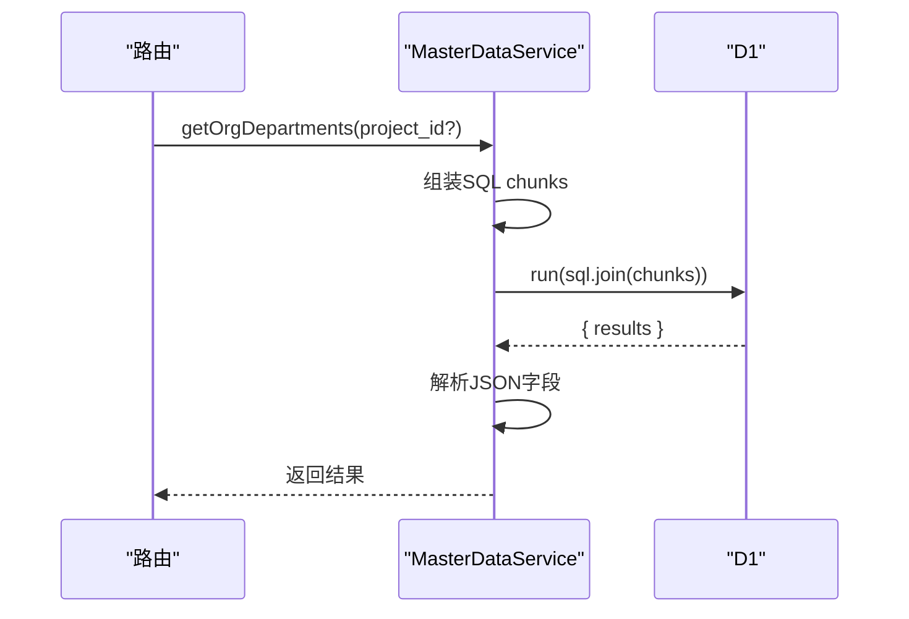
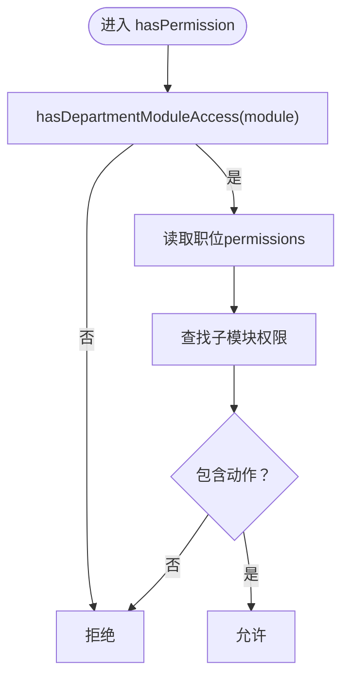
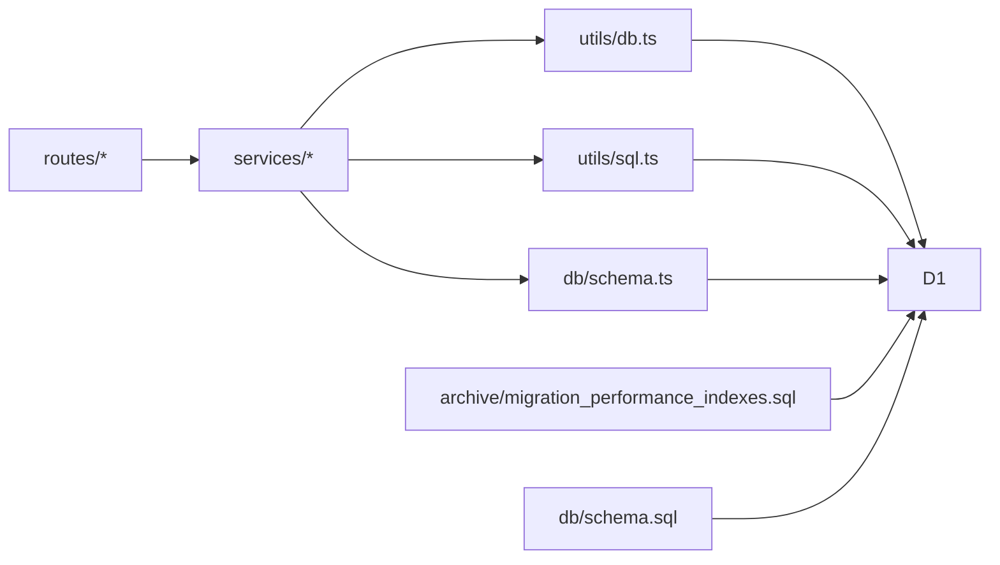

# 连接与性能优化

<cite>
**本文引用的文件**
- [backend/src/utils/db.ts](file://backend/src/utils/db.ts)
- [backend/src/utils/sql.ts](file://backend/src/utils/sql.ts)
- [backend/src/services/MasterDataService.ts](file://backend/src/services/MasterDataService.ts)
- [backend/src/db/schema.ts](file://backend/src/db/schema.ts)
- [backend/src/db/schema.sql](file://backend/src/db/schema.sql)
- [backend/src/db/archive/migration_performance_indexes.sql](file://backend/src/db/archive/migration_performance_indexes.sql)
- [backend/src/utils/permissions.ts](file://backend/src/utils/permissions.ts)
- [backend/src/routes/master-data/org-departments.ts](file://backend/src/routes/master-data/org-departments.ts)
- [backend/drizzle.config.ts](file://backend/drizzle.config.ts)
</cite>

## 目录
1. [简介](#简介)
2. [项目结构](#项目结构)
3. [核心组件](#核心组件)
4. [架构总览](#架构总览)
5. [详细组件分析](#详细组件分析)
6. [依赖关系分析](#依赖关系分析)
7. [性能考量](#性能考量)
8. [故障排查指南](#故障排查指南)
9. [结论](#结论)

## 简介
本文件聚焦于数据库连接管理与查询性能优化方案，围绕以下主题展开：
- 如何在 Worker/D1 环境中封装数据库会话（getSession）与事务处理，确保连接高效复用与生命周期管理
- 自定义 SQL 构造函数的设计目的与适用场景，特别是复杂聚合、全文检索或 ORM 难以表达的高级 SQL
- 在 MasterDataService 中混合使用 Drizzle ORM 与原始 SQL 的实践，平衡类型安全与查询灵活性
- 索引优化策略（migration_performance_indexes.sql）对查询性能的影响及 EXPLAIN QUERY PLAN 的使用建议

## 项目结构
后端采用 Drizzle ORM + Cloudflare Workers D1 的组合，数据层通过 schema.ts 定义表结构，服务层通过 MasterDataService 使用 ORM 查询，同时在特定场景下使用原生 SQL 提升灵活性。权限与会话管理由工具函数与路由共同实现。

图表来源
- [backend/src/services/MasterDataService.ts](file://backend/src/services/MasterDataService.ts#L1-L608)
- [backend/src/utils/db.ts](file://backend/src/utils/db.ts#L1-L314)
- [backend/src/utils/sql.ts](file://backend/src/utils/sql.ts#L1-L75)
- [backend/src/utils/permissions.ts](file://backend/src/utils/permissions.ts#L1-L330)
- [backend/src/routes/master-data/org-departments.ts](file://backend/src/routes/master-data/org-departments.ts#L1-L125)
- [backend/src/db/schema.ts](file://backend/src/db/schema.ts#L1-L644)
- [backend/src/db/schema.sql](file://backend/src/db/schema.sql#L1-L662)
- [backend/drizzle.config.ts](file://backend/drizzle.config.ts#L1-L8)

章节来源
- [backend/src/services/MasterDataService.ts](file://backend/src/services/MasterDataService.ts#L1-L608)
- [backend/src/utils/db.ts](file://backend/src/utils/db.ts#L1-L314)
- [backend/src/utils/sql.ts](file://backend/src/utils/sql.ts#L1-L75)
- [backend/src/utils/permissions.ts](file://backend/src/utils/permissions.ts#L1-L330)
- [backend/src/routes/master-data/org-departments.ts](file://backend/src/routes/master-data/org-departments.ts#L1-L125)
- [backend/src/db/schema.ts](file://backend/src/db/schema.ts#L1-L644)
- [backend/src/db/schema.sql](file://backend/src/db/schema.sql#L1-L662)
- [backend/drizzle.config.ts](file://backend/drizzle.config.ts#L1-L8)

## 核心组件
- 数据库会话与上下文获取：通过 getSession 与 getSessionWithUserAndPosition 实现会话校验、过期判断与多表联结上下文组装，减少多次查询与重复连接开销
- 动态 SQL 构造：buildUpdateFields/buildUpdateSql/executeUpdate 提供安全的动态更新能力，避免手写 SQL 的脆弱性
- 服务层混合查询：MasterDataService 大量使用 Drizzle ORM，同时在 org-departments 场景使用原生 SQL，兼顾类型安全与灵活性
- 权限与访问控制：permissions.ts 提供基于职位层级与部门模块的访问控制，配合路由层进行权限拦截

章节来源
- [backend/src/utils/db.ts](file://backend/src/utils/db.ts#L41-L222)
- [backend/src/utils/sql.ts](file://backend/src/utils/sql.ts#L1-L75)
- [backend/src/services/MasterDataService.ts](file://backend/src/services/MasterDataService.ts#L546-L607)
- [backend/src/utils/permissions.ts](file://backend/src/utils/permissions.ts#L1-L330)

## 架构总览
整体流程：路由层接收请求，调用服务层；服务层根据业务选择 ORM 或原生 SQL；工具层提供会话与权限控制；数据层通过 Drizzle schema 定义表结构，并由 D1 执行。

图表来源
- [backend/src/routes/master-data/org-departments.ts](file://backend/src/routes/master-data/org-departments.ts#L36-L79)
- [backend/src/services/MasterDataService.ts](file://backend/src/services/MasterDataService.ts#L546-L607)
- [backend/src/utils/db.ts](file://backend/src/utils/db.ts#L1-L314)
- [backend/src/utils/sql.ts](file://backend/src/utils/sql.ts#L1-L75)

## 详细组件分析

### 数据库会话与事务处理（db.ts）
- 会话获取与校验
  - getSession：按 id 查询 sessions 并校验过期时间，返回 null 或会话对象
  - getSessionWithUserAndPosition：一次性联结 sessions/users/employees/positions/orgDepartments，返回用户、职位、员工与部门模块上下文，减少 N+1 查询
  - getUserFullContext：从 users 出发，组装用户、职位、员工与部门模块上下文，便于缓存与鉴权
- 用户信息与职位信息
  - getUserByEmail/getUserById：基础用户查询
  - getUserEmployeeId：通过 email 匹配 employees 并筛选 active
  - getUserPosition：联结 users/employees/positions，解析 permissions JSON，返回职位结构
- 事务与连接复用
  - 通过 createDb(drizzle(d1, { schema })) 将 D1 实例与 schema 绑定，后续查询复用同一 Drizzle 实例，避免重复初始化
  - 在 getSessionWithUserAndPosition 中一次性执行联结查询，减少连接建立次数

图表来源
- [backend/src/utils/db.ts](file://backend/src/utils/db.ts#L41-L50)

章节来源
- [backend/src/utils/db.ts](file://backend/src/utils/db.ts#L1-L314)

### 动态 SQL 构造（sql.ts）
- 设计目标
  - 避免手写 SQL 的脆弱性与注入风险，提供类型安全的动态更新
  - 支持按需选择字段，仅更新非 undefined 的字段，减少冗余写入
- 关键函数
  - buildUpdateFields：将字段映射转换为“字段=?”占位符与绑定值数组
  - buildUpdateSql：拼接最终 SQL 与绑定值，统一 id 条件
  - executeUpdate：组合上述两步并执行，返回 Promise<void>
- 使用建议
  - 优先使用 ORM 的 update/set 接口；当 ORM 无法表达复杂条件或聚合时，再考虑原生 SQL
  - 对于高频更新路径，保持字段白名单，避免误更新敏感字段

图表来源
- [backend/src/utils/sql.ts](file://backend/src/utils/sql.ts#L1-L75)

章节来源
- [backend/src/utils/sql.ts](file://backend/src/utils/sql.ts#L1-L75)

### 服务层混合查询（MasterDataService.ts）
- ORM 为主，原生 SQL 为辅
  - 大多数 CRUD 使用 this.db.select/from/update/delete 等 ORM 接口，保证类型安全与可维护性
  - 在 org-departments 列表与详情场景，使用 sql.join 与 db.run 执行原生 SQL，直接返回 D1Result.results，提升灵活性与性能
- 典型场景
  - getOrgDepartments：拼接 chunks，支持 project_id='hq' 或具体项目 ID，最后排序并解析 JSON 字段
  - getOrgDepartment：单条查询，解析 allowed_modules/allowed_positions
- 与路由层协作
  - org-departments 路由在返回前做 schema 映射与类型修正，确保输出一致

图表来源
- [backend/src/services/MasterDataService.ts](file://backend/src/services/MasterDataService.ts#L546-L607)
- [backend/src/routes/master-data/org-departments.ts](file://backend/src/routes/master-data/org-departments.ts#L36-L79)

章节来源
- [backend/src/services/MasterDataService.ts](file://backend/src/services/MasterDataService.ts#L546-L607)
- [backend/src/routes/master-data/org-departments.ts](file://backend/src/routes/master-data/org-departments.ts#L1-L125)

### 权限与访问控制（permissions.ts）
- 模块访问控制
  - hasDepartmentModuleAccess：总部人员不受限制；部门模块列表包含 '*' 表示全放行；支持前缀通配符匹配
- 操作权限检查
  - hasPermission：先检查模块访问，再检查职位权限配置（JSON），支持子模块与动作集合
- 数据访问范围
  - getDataAccessFilter：根据职位层级返回 where 条件与绑定参数，总部可访问全部，项目/组/个人分别限定范围
- 与会话上下文联动
  - 通过 getUserPosition/getUserEmployee 从上下文中获取用户职位与员工信息，配合 db.ts 的上下文组装函数使用

图表来源
- [backend/src/utils/permissions.ts](file://backend/src/utils/permissions.ts#L55-L114)

章节来源
- [backend/src/utils/permissions.ts](file://backend/src/utils/permissions.ts#L1-L330)

## 依赖关系分析
- 服务层依赖数据层 schema.ts，通过 Drizzle ORM 生成的类型与查询接口进行交互
- 工具层 db.ts 与 sql.ts 分别提供会话与动态 SQL 能力，被服务层与路由层复用
- 路由层负责权限拦截与数据映射，调用服务层完成业务逻辑
- 索引迁移文件 migration_performance_indexes.sql 与 schema.sql 共同保障查询性能

图表来源
- [backend/src/services/MasterDataService.ts](file://backend/src/services/MasterDataService.ts#L1-L608)
- [backend/src/utils/db.ts](file://backend/src/utils/db.ts#L1-L314)
- [backend/src/utils/sql.ts](file://backend/src/utils/sql.ts#L1-L75)
- [backend/src/db/schema.ts](file://backend/src/db/schema.ts#L1-L644)
- [backend/src/db/archive/migration_performance_indexes.sql](file://backend/src/db/archive/migration_performance_indexes.sql#L1-L42)
- [backend/src/db/schema.sql](file://backend/src/db/schema.sql#L1-L662)

章节来源
- [backend/src/services/MasterDataService.ts](file://backend/src/services/MasterDataService.ts#L1-L608)
- [backend/src/utils/db.ts](file://backend/src/utils/db.ts#L1-L314)
- [backend/src/utils/sql.ts](file://backend/src/utils/sql.ts#L1-L75)
- [backend/src/db/schema.ts](file://backend/src/db/schema.ts#L1-L644)
- [backend/src/db/archive/migration_performance_indexes.sql](file://backend/src/db/archive/migration_performance_indexes.sql#L1-L42)
- [backend/src/db/schema.sql](file://backend/src/db/schema.sql#L1-L662)

## 性能考量
- 连接与会话复用
  - 使用 createDb(drizzle(d1, { schema })) 将 D1 实例与 schema 绑定，后续查询复用同一 Drizzle 实例，降低连接初始化成本
  - 通过 getSessionWithUserAndPosition 一次性联结多表，减少往返与连接数
- 索引优化
  - migration_performance_indexes.sql 为 cash_flows、borrowings、employee_leaves、expense_reimbursements、ar_ap_docs、employee_salaries、employee_allowances、fixed_assets、sites 等表创建复合索引，覆盖常见查询条件
  - schema.sql 中也包含基础索引（如 idx_users_email、idx_sessions_user_id、idx_cash_flows_biz_date 等），与迁移脚本互补
- 查询灵活性与类型安全平衡
  - ORM 适合常规 CRUD 与简单联结；当需要复杂聚合、全文检索或跨表统计时，使用原生 SQL（如 org-departments 的 getOrgDepartments/getOrgDepartment）
- EXPLAIN QUERY PLAN 建议
  - 在开发阶段对关键查询使用 EXPLAIN QUERY PLAN 分析执行计划，确认是否命中预期索引
  - 若发现回表或全表扫描，调整 where 条件顺序或补充复合索引
  - 对频繁使用的过滤列（如 biz_date、department_id、status）优先考虑复合索引

章节来源
- [backend/src/utils/db.ts](file://backend/src/utils/db.ts#L1-L314)
- [backend/src/db/archive/migration_performance_indexes.sql](file://backend/src/db/archive/migration_performance_indexes.sql#L1-L42)
- [backend/src/db/schema.sql](file://backend/src/db/schema.sql#L297-L314)
- [backend/src/services/MasterDataService.ts](file://backend/src/services/MasterDataService.ts#L546-L607)

## 故障排查指南
- 会话失效或为空
  - 检查 getSession 中的过期判断逻辑，确认 expiresAt 是否正确设置与比较
  - 使用 getSessionWithUserAndPosition 确认联结条件与过滤条件（gt(sessions.expiresAt, now)）
- 权限不足
  - 检查 hasDepartmentModuleAccess 与 hasPermission 的判定逻辑，确认 allowed_modules 与 permissions 的 JSON 结构
  - 使用 getDataAccessFilter 生成 where 条件，核对绑定参数
- 原生 SQL 执行异常
  - 确认 sql.join 拼接的 chunks 正确，且最终 SQL 符合 SQLite 语法
  - 检查 db.run 返回的 D1Result 结构，确保 results 存在且字段解析正常
- 索引未生效
  - 使用 EXPLAIN QUERY PLAN 分析查询计划，确认索引是否被使用
  - 调整 where 条件顺序或添加复合索引，避免隐式类型转换导致索引失效

章节来源
- [backend/src/utils/db.ts](file://backend/src/utils/db.ts#L41-L222)
- [backend/src/utils/permissions.ts](file://backend/src/utils/permissions.ts#L55-L114)
- [backend/src/services/MasterDataService.ts](file://backend/src/services/MasterDataService.ts#L546-L607)

## 结论
本项目通过 Drizzle ORM 与原生 SQL 的混合使用，在保证类型安全的同时兼顾查询灵活性；借助会话上下文的一次性联结与索引优化，有效提升了查询性能与连接复用效率。建议在新增查询时优先评估 ORM 可表达性，必要时再引入原生 SQL，并持续使用 EXPLAIN QUERY PLAN 与索引迁移脚本优化关键路径。