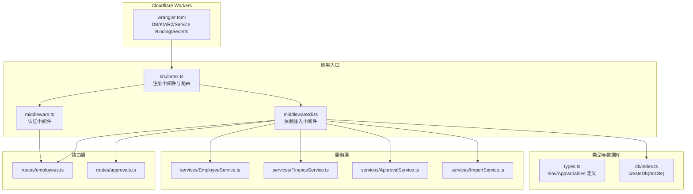
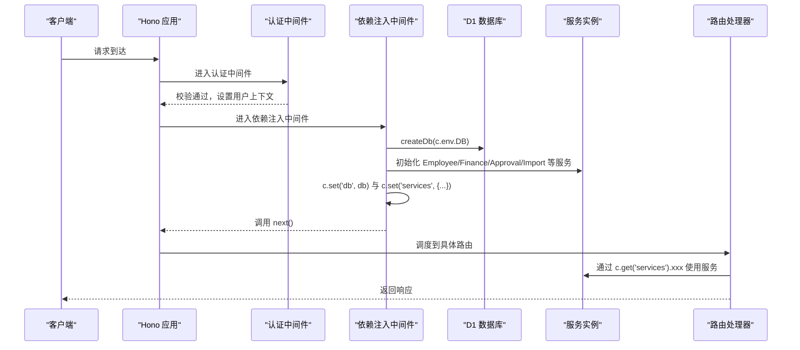
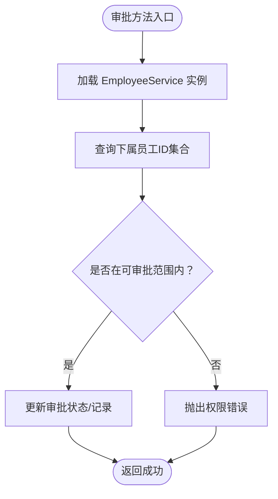
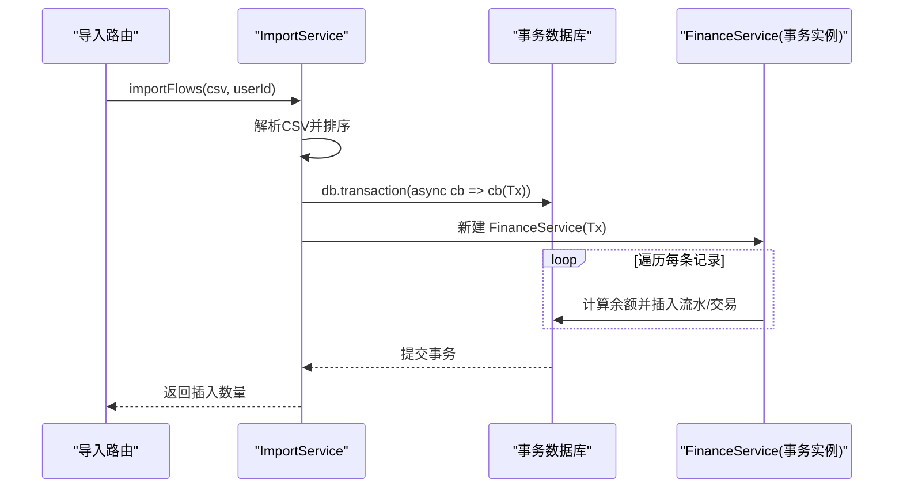
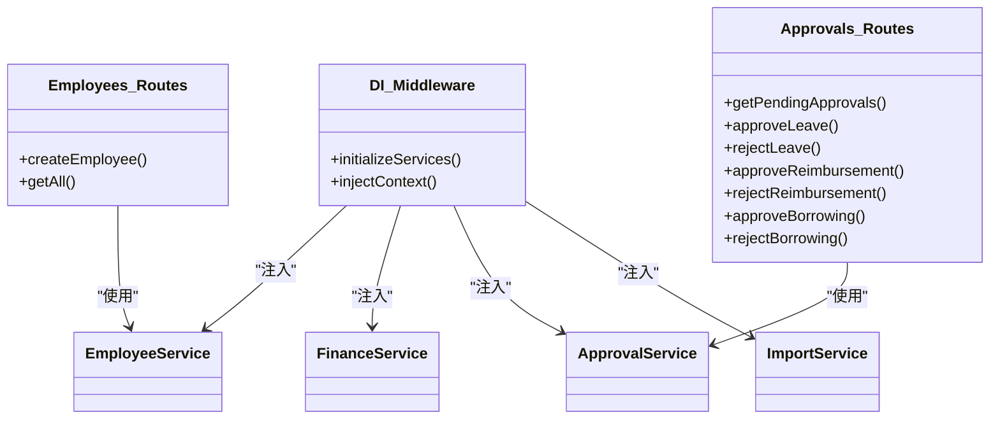

# 依赖注入

<cite>
**本文引用的文件**
- [backend/src/middleware/di.ts](file://backend/src/middleware/di.ts)
- [backend/src/middleware.ts](file://backend/src/middleware.ts)
- [backend/src/index.ts](file://backend/src/index.ts)
- [backend/src/types.ts](file://backend/src/types.ts)
- [backend/src/db/index.ts](file://backend/src/db/index.ts)
- [backend/src/routes/approvals.ts](file://backend/src/routes/approvals.ts)
- [backend/src/routes/employees.ts](file://backend/src/routes/employees.ts)
- [backend/src/services/ApprovalService.ts](file://backend/src/services/ApprovalService.ts)
- [backend/src/services/EmployeeService.ts](file://backend/src/services/EmployeeService.ts)
- [backend/src/services/FinanceService.ts](file://backend/src/services/FinanceService.ts)
- [backend/src/services/ImportService.ts](file://backend/src/services/ImportService.ts)
- [backend/wrangler.toml](file://backend/wrangler.toml)
- [backend/test/services/ApprovalService.test.ts](file://backend/test/services/ApprovalService.test.ts)
- [backend/test/services/ImportService.test.ts](file://backend/test/services/ImportService.test.ts)
</cite>

## 目录
1. [引言](#引言)
2. [项目结构](#项目结构)
3. [核心组件](#核心组件)
4. [架构总览](#架构总览)
5. [详细组件分析](#详细组件分析)
6. [依赖关系分析](#依赖关系分析)
7. [性能考量](#性能考量)
8. [故障排查指南](#故障排查指南)
9. [结论](#结论)
10. [附录](#附录)

## 引言
本文件围绕“基于中间件的依赖注入容器实现机制”展开，重点阐述以下内容：
- 在请求生命周期中，依赖注入中间件如何初始化并注入 EmployeeService、FinanceService 等核心服务实例；
- 如何与 Cloudflare Workers 环境集成（D1、KV、R2、Service Binding）；
- 通过 ApprovalService 在多个方法中实例化 EmployeeService 的案例，展示服务间依赖关系的管理策略；
- 依赖注入如何促进代码解耦与单元测试可模拟性；
- 结合 ImportService 中事务性服务实例的创建，说明在复杂业务场景下的灵活性；
- 提供自定义服务注入的扩展指南，包括环境变量传递与条件注入模式。

## 项目结构
后端采用 Hono 应用框架，通过全局中间件链路串联认证、依赖注入与各路由模块。依赖注入中间件负责在请求进入时构建服务实例并注入上下文，供后续路由处理器使用。

图表来源
- [backend/src/index.ts](file://backend/src/index.ts#L87-L119)
- [backend/src/middleware.ts](file://backend/src/middleware.ts#L1-L82)
- [backend/src/middleware/di.ts](file://backend/src/middleware/di.ts#L1-L76)
- [backend/src/db/index.ts](file://backend/src/db/index.ts#L1-L7)
- [backend/src/types.ts](file://backend/src/types.ts#L1-L88)
- [backend/src/services/EmployeeService.ts](file://backend/src/services/EmployeeService.ts#L1-L593)
- [backend/src/services/FinanceService.ts](file://backend/src/services/FinanceService.ts#L1-L614)
- [backend/src/services/ApprovalService.ts](file://backend/src/services/ApprovalService.ts#L1-L283)
- [backend/src/services/ImportService.ts](file://backend/src/services/ImportService.ts#L1-L113)
- [backend/src/routes/employees.ts](file://backend/src/routes/employees.ts#L1-L200)
- [backend/src/routes/approvals.ts](file://backend/src/routes/approvals.ts#L1-L393)
- [backend/wrangler.toml](file://backend/wrangler.toml#L1-L45)

章节来源
- [backend/src/index.ts](file://backend/src/index.ts#L87-L119)
- [backend/src/middleware.ts](file://backend/src/middleware.ts#L1-L82)
- [backend/src/middleware/di.ts](file://backend/src/middleware/di.ts#L1-L76)
- [backend/src/db/index.ts](file://backend/src/db/index.ts#L1-L7)
- [backend/src/types.ts](file://backend/src/types.ts#L1-L88)
- [backend/wrangler.toml](file://backend/wrangler.toml#L1-L45)

## 核心组件
- 依赖注入中间件：在请求进入时创建数据库连接与各类服务实例，并将 db 与 services 注入到上下文中，供后续处理器使用。
- 类型系统：通过 Env 与 AppVariables 明确环境变量与上下文变量的结构，确保类型安全与可维护性。
- 数据库适配：通过 createDb 将 D1 数据库包装为 drizzle 客户端，统一服务层的数据访问接口。
- 路由层：各路由通过 c.get('services').xxx 获取所需服务实例，避免在路由内部直接构造服务。

章节来源
- [backend/src/middleware/di.ts](file://backend/src/middleware/di.ts#L25-L76)
- [backend/src/types.ts](file://backend/src/types.ts#L1-L88)
- [backend/src/db/index.ts](file://backend/src/db/index.ts#L1-L7)
- [backend/src/routes/approvals.ts](file://backend/src/routes/approvals.ts#L113-L151)

## 架构总览
下图展示了请求在 Cloudflare Workers 环境中的生命周期与依赖注入流程：

图表来源
- [backend/src/index.ts](file://backend/src/index.ts#L87-L119)
- [backend/src/middleware.ts](file://backend/src/middleware.ts#L1-L82)
- [backend/src/middleware/di.ts](file://backend/src/middleware/di.ts#L25-L76)
- [backend/src/db/index.ts](file://backend/src/db/index.ts#L1-L7)

## 详细组件分析

### 依赖注入中间件（di.ts）
- 初始化顺序：先创建数据库连接，再依次初始化各服务实例；随后将 db 与 services 写入上下文。
- 服务注入：将 SystemConfigService、EmployeeService、FinanceService、ImportService、ApprovalService 等注入到 c.set('services')，键名与类型定义一致。
- 环境变量使用：部分服务构造时使用 c.env（如 KV、邮件 Worker 绑定、Cloudflare Token 等）。

章节来源
- [backend/src/middleware/di.ts](file://backend/src/middleware/di.ts#L25-L76)
- [backend/src/types.ts](file://backend/src/types.ts#L1-L88)

### 请求生命周期与服务获取
- 路由中通过 c.get('services').xxx 获取服务实例，例如 approvals 路由中获取 approval 服务进行审批相关操作。
- employees 路由中通过 c.get('services').employee 获取员工服务，并在创建员工时传入 c.env 以支持邮件与 Cloudflare 集成。

章节来源
- [backend/src/routes/approvals.ts](file://backend/src/routes/approvals.ts#L113-L151)
- [backend/src/routes/employees.ts](file://backend/src/routes/employees.ts#L118-L161)

### ApprovalService 与 EmployeeService 的协作
- 在 ApprovalService 的多个方法中，需要判断审批人与被审批人的层级关系，因此在方法内部临时实例化 EmployeeService 以查询下属员工 ID。
- 这体现了“按需实例化”的策略：核心服务通过依赖注入共享 db，但对跨模块的协作仍可局部实例化依赖服务，避免过度耦合。

图表来源
- [backend/src/services/ApprovalService.ts](file://backend/src/services/ApprovalService.ts#L10-L21)
- [backend/src/services/ApprovalService.ts](file://backend/src/services/ApprovalService.ts#L160-L196)
- [backend/src/services/ApprovalService.ts](file://backend/src/services/ApprovalService.ts#L198-L234)
- [backend/src/services/ApprovalService.ts](file://backend/src/services/ApprovalService.ts#L236-L281)

章节来源
- [backend/src/services/ApprovalService.ts](file://backend/src/services/ApprovalService.ts#L10-L21)
- [backend/src/services/ApprovalService.ts](file://backend/src/services/ApprovalService.ts#L160-L196)
- [backend/src/services/ApprovalService.ts](file://backend/src/services/ApprovalService.ts#L198-L234)
- [backend/src/services/ApprovalService.ts](file://backend/src/services/ApprovalService.ts#L236-L281)

### ImportService 的事务性服务实例创建
- ImportService 在导入流水时，先解析 CSV 并排序，然后开启事务逐条插入流水与交易记录。
- 为保证余额计算的正确性与一致性，导入逻辑在事务内重新构造 FinanceService 实例（以事务数据库对象作为依赖），从而确保后续余额查询与计算均基于同一事务上下文。

图表来源
- [backend/src/services/ImportService.ts](file://backend/src/services/ImportService.ts#L12-L113)
- [backend/src/services/FinanceService.ts](file://backend/src/services/FinanceService.ts#L1-L614)

章节来源
- [backend/src/services/ImportService.ts](file://backend/src/services/ImportService.ts#L12-L113)
- [backend/src/services/FinanceService.ts](file://backend/src/services/FinanceService.ts#L1-L614)

### Cloudflare Workers 环境集成
- 数据库：通过 D1 绑定 DB，依赖注入中间件使用 createDb 包装为 drizzle 客户端。
- KV：通过 SESSIONS_KV 绑定，用于会话缓存与回退查询。
- R2：通过 VOUCHERS 绑定，用于凭证存储。
- Service Binding：通过 EMAIL_SERVICE 绑定指向 email-worker，用于发送欢迎邮件等。
- 环境变量：AUTH_JWT_SECRET、CF_* 系列 Token、Zone/Account ID 等通过 wrangler.toml 的 vars 与 secrets 管理。

章节来源
- [backend/wrangler.toml](file://backend/wrangler.toml#L1-L45)
- [backend/src/middleware/di.ts](file://backend/src/middleware/di.ts#L25-L76)
- [backend/src/types.ts](file://backend/src/types.ts#L1-L88)

### 解耦与单元测试可模拟性
- 通过依赖注入，路由层不再直接依赖具体服务实现，而是依赖上下文中的服务抽象，便于替换与模拟。
- 测试中直接构造服务实例并注入 drizzle 的内存数据库，验证业务逻辑与边界条件，无需启动完整应用栈。

章节来源
- [backend/test/services/ApprovalService.test.ts](file://backend/test/services/ApprovalService.test.ts#L1-L332)
- [backend/test/services/ImportService.test.ts](file://backend/test/services/ImportService.test.ts#L1-L68)

## 依赖关系分析
- 依赖注入中间件与服务层：di.ts 依赖 db/index.ts 与各服务类，将服务实例注入到上下文。
- 路由层与服务层：路由通过 c.get('services') 获取服务，避免在路由内部直接构造服务，降低耦合。
- 服务层内部协作：ApprovalService 在审批流程中按需实例化 EmployeeService，体现“按需依赖”的策略。
- 事务与一致性：ImportService 在事务内重用 drizzle 事务对象，确保余额计算与数据一致性。

图表来源
- [backend/src/middleware/di.ts](file://backend/src/middleware/di.ts#L25-L76)
- [backend/src/routes/approvals.ts](file://backend/src/routes/approvals.ts#L113-L393)
- [backend/src/routes/employees.ts](file://backend/src/routes/employees.ts#L118-L161)
- [backend/src/services/ApprovalService.ts](file://backend/src/services/ApprovalService.ts#L1-L283)
- [backend/src/services/EmployeeService.ts](file://backend/src/services/EmployeeService.ts#L1-L593)
- [backend/src/services/FinanceService.ts](file://backend/src/services/FinanceService.ts#L1-L614)
- [backend/src/services/ImportService.ts](file://backend/src/services/ImportService.ts#L1-L113)

章节来源
- [backend/src/middleware/di.ts](file://backend/src/middleware/di.ts#L25-L76)
- [backend/src/routes/approvals.ts](file://backend/src/routes/approvals.ts#L113-L393)
- [backend/src/routes/employees.ts](file://backend/src/routes/employees.ts#L118-L161)
- [backend/src/services/ApprovalService.ts](file://backend/src/services/ApprovalService.ts#L1-L283)
- [backend/src/services/EmployeeService.ts](file://backend/src/services/EmployeeService.ts#L1-L593)
- [backend/src/services/FinanceService.ts](file://backend/src/services/FinanceService.ts#L1-L614)
- [backend/src/services/ImportService.ts](file://backend/src/services/ImportService.ts#L1-L113)

## 性能考量
- 事务批处理：ImportService 在事务内逐条插入，确保余额计算正确；对于大量数据，建议分批提交以平衡一致性与吞吐。
- 会话缓存：认证中间件优先从 KV 读取会话，未命中时回退数据库并异步写入 KV，减少数据库压力。
- 服务复用：依赖注入中间件在一次请求中复用同一服务实例，避免重复构造带来的开销。

章节来源
- [backend/src/services/ImportService.ts](file://backend/src/services/ImportService.ts#L52-L113)
- [backend/src/middleware.ts](file://backend/src/middleware.ts#L26-L69)

## 故障排查指南
- 依赖注入未生效：确认路由前已注册认证与依赖注入中间件，且顺序正确。
- 服务实例缺失：检查 di.ts 是否正确注入 c.set('services')，以及路由是否通过 c.get('services').xxx 获取。
- 环境变量问题：核对 wrangler.toml 中的 DB/KV/R2/Service Binding/Secrets 配置，确保运行环境变量与密钥可用。
- 事务异常：ImportService 在事务内发生错误会回滚，检查事务内的数据校验与余额计算逻辑。

章节来源
- [backend/src/index.ts](file://backend/src/index.ts#L87-L119)
- [backend/src/middleware/di.ts](file://backend/src/middleware/di.ts#L25-L76)
- [backend/wrangler.toml](file://backend/wrangler.toml#L1-L45)

## 结论
本项目通过“中间件驱动的依赖注入容器”，在请求生命周期内集中初始化并注入核心服务，实现了：
- 明确的服务边界与解耦；
- 与 Cloudflare Workers 环境的无缝集成；
- 在复杂业务（如导入流水）中通过事务性服务实例保障一致性；
- 为单元测试提供了良好的可模拟性基础。

## 附录

### 自定义服务注入与扩展指南
- 新增服务：在 types.ts 中的 AppVariables.services 增加新服务键名与类型约束；在 di.ts 中初始化并注入。
- 环境变量传递：若服务需要使用 c.env（如 KV、邮件 Worker、Cloudflare Token），在服务构造函数中显式传入或通过 c.env 访问。
- 条件注入：可在 di.ts 中根据环境变量或配置决定是否初始化某服务，或在路由层按需延迟实例化服务。

章节来源
- [backend/src/types.ts](file://backend/src/types.ts#L1-L88)
- [backend/src/middleware/di.ts](file://backend/src/middleware/di.ts#L25-L76)
- [backend/src/services/EmployeeService.ts](file://backend/src/services/EmployeeService.ts#L1-L593)