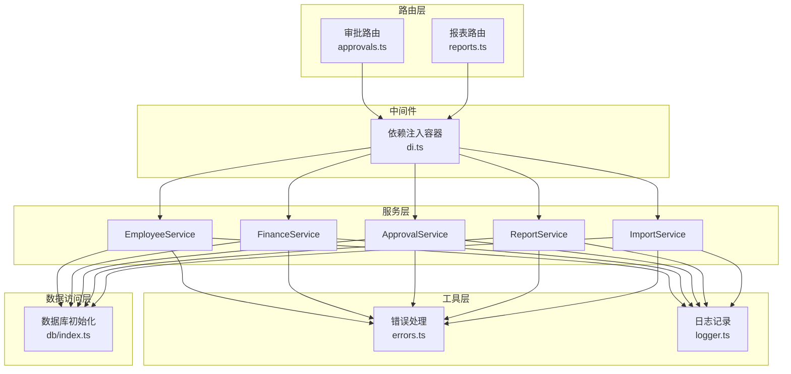
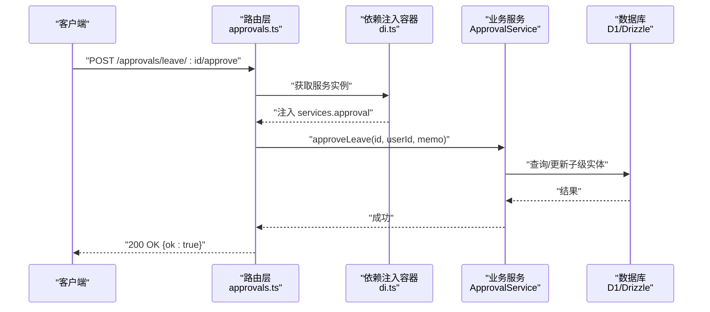
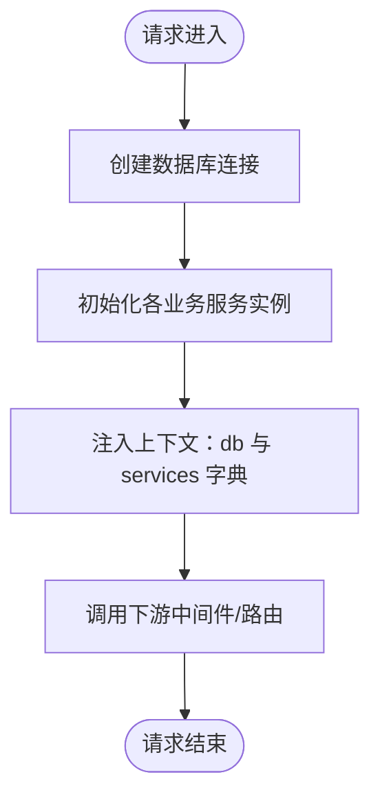
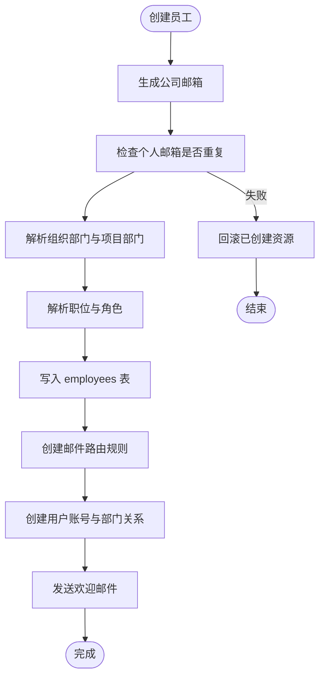
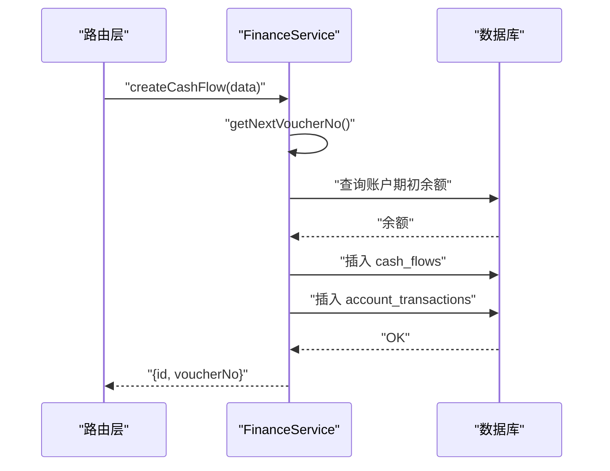
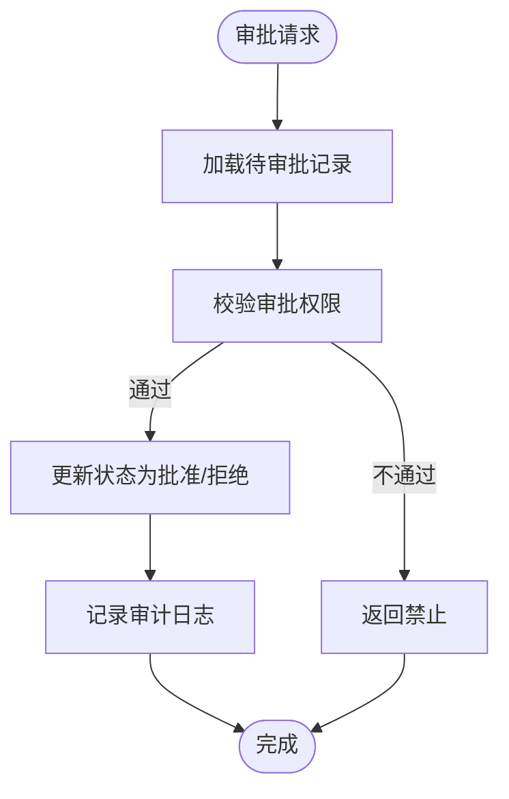
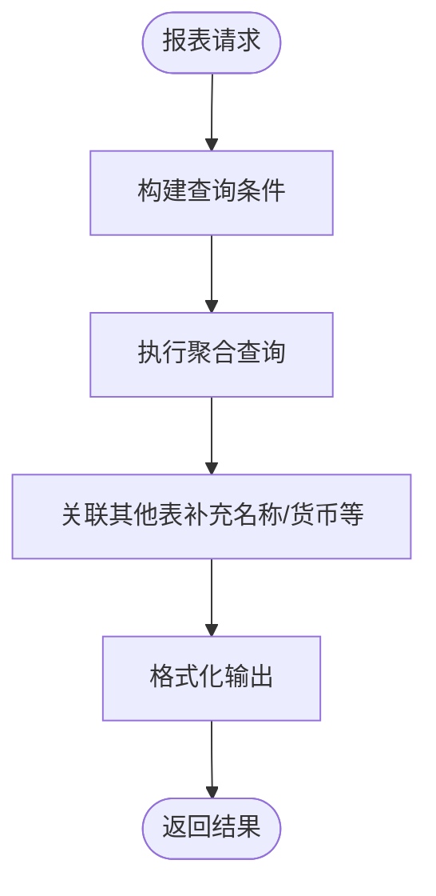
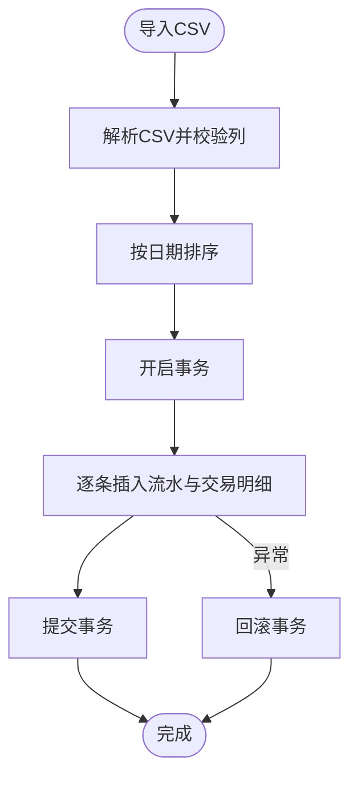
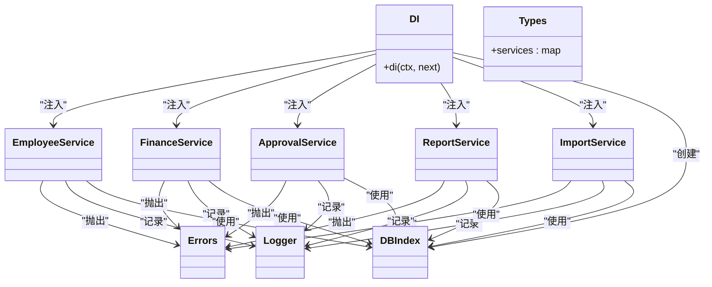

# 服务层架构

<cite>
**本文引用的文件**
- [backend/src/middleware/di.ts](file://backend/src/middleware/di.ts)
- [backend/src/types.ts](file://backend/src/types.ts)
- [backend/src/db/index.ts](file://backend/src/db/index.ts)
- [backend/src/services/EmployeeService.ts](file://backend/src/services/EmployeeService.ts)
- [backend/src/services/FinanceService.ts](file://backend/src/services/FinanceService.ts)
- [backend/src/services/ApprovalService.ts](file://backend/src/services/ApprovalService.ts)
- [backend/src/services/ReportService.ts](file://backend/src/services/ReportService.ts)
- [backend/src/services/ImportService.ts](file://backend/src/services/ImportService.ts)
- [backend/src/utils/errors.ts](file://backend/src/utils/errors.ts)
- [backend/src/utils/logger.ts](file://backend/src/utils/logger.ts)
- [backend/src/routes/approvals.ts](file://backend/src/routes/approvals.ts)
- [backend/src/routes/reports.ts](file://backend/src/routes/reports.ts)
- [backend/test/services/EmployeeService.test.ts](file://backend/test/services/EmployeeService.test.ts)
- [backend/test/services/FinanceService.test.ts](file://backend/test/services/FinanceService.test.ts)
- [backend/test/services/ReportService.test.ts](file://backend/test/services/ReportService.test.ts)
</cite>

## 目录
1. [引言](#引言)
2. [项目结构](#项目结构)
3. [核心组件](#核心组件)
4. [架构总览](#架构总览)
5. [详细组件分析](#详细组件分析)
6. [依赖关系分析](#依赖关系分析)
7. [性能考量](#性能考量)
8. [故障排查指南](#故障排查指南)
9. [结论](#结论)
10. [附录](#附录)

## 引言
本文件面向后端服务层的职责划分与依赖注入机制进行系统性解析。围绕 EmployeeService、FinanceService 等核心服务，阐述其如何封装复杂业务逻辑、协调多实体操作，并在 D1 数据库限制下通过事务与回滚策略保障数据一致性；同时深入剖析依赖注入容器（di.ts）的实现原理、服务实例生命周期管理与松耦合设计；并总结服务层与数据库访问层的交互模式、错误处理（Errors 类）与日志记录（logger.ts）的最佳实践。最后结合 ApprovalService 和 ReportService 的异步与批量化处理策略，给出创建新服务的标准范式。

## 项目结构
后端采用分层清晰的目录组织：
- middleware：运行时中间件，包含依赖注入容器与权限校验
- services：业务服务层，按领域拆分（员工、财务、审批、报表等）
- utils：通用工具（错误、日志、CSV、SQL、权限等）
- routes：HTTP 路由层，负责请求接入与参数校验
- db：数据库初始化与 Schema 定义
- test：服务层单元测试，覆盖关键流程与边界条件

图表来源
- [backend/src/middleware/di.ts](file://backend/src/middleware/di.ts#L1-L76)
- [backend/src/routes/approvals.ts](file://backend/src/routes/approvals.ts#L1-L393)
- [backend/src/routes/reports.ts](file://backend/src/routes/reports.ts#L1-L475)
- [backend/src/services/EmployeeService.ts](file://backend/src/services/EmployeeService.ts#L1-L593)
- [backend/src/services/FinanceService.ts](file://backend/src/services/FinanceService.ts#L1-L614)
- [backend/src/services/ApprovalService.ts](file://backend/src/services/ApprovalService.ts#L1-L283)
- [backend/src/services/ReportService.ts](file://backend/src/services/ReportService.ts#L1-L700)
- [backend/src/services/ImportService.ts](file://backend/src/services/ImportService.ts#L1-L113)
- [backend/src/utils/errors.ts](file://backend/src/utils/errors.ts#L1-L114)
- [backend/src/utils/logger.ts](file://backend/src/utils/logger.ts#L1-L84)
- [backend/src/db/index.ts](file://backend/src/db/index.ts#L1-L7)

章节来源
- [backend/src/middleware/di.ts](file://backend/src/middleware/di.ts#L1-L76)
- [backend/src/types.ts](file://backend/src/types.ts#L1-L88)
- [backend/src/db/index.ts](file://backend/src/db/index.ts#L1-L7)

## 核心组件
- 依赖注入容器（di.ts）：在每个请求进入时创建数据库连接与各业务服务实例，注入到上下文中，供路由层统一获取。
- 服务层（services）：以领域服务为核心，封装业务规则与跨实体操作，提供幂等、可组合的方法。
- 错误处理（errors.ts）：统一业务错误与异常结构，配合全局中间件输出标准化响应。
- 日志记录（logger.ts）：结构化日志输出，支持不同级别与上下文信息，便于审计与排障。
- 数据库初始化（db/index.ts）：Drizzle 初始化入口，确保 schema 与 D1 绑定一致。

章节来源
- [backend/src/middleware/di.ts](file://backend/src/middleware/di.ts#L1-L76)
- [backend/src/types.ts](file://backend/src/types.ts#L1-L88)
- [backend/src/utils/errors.ts](file://backend/src/utils/errors.ts#L1-L114)
- [backend/src/utils/logger.ts](file://backend/src/utils/logger.ts#L1-L84)
- [backend/src/db/index.ts](file://backend/src/db/index.ts#L1-L7)

## 架构总览
服务层通过依赖注入容器集中管理服务实例，路由层仅负责参数校验与鉴权，业务逻辑全部下沉至服务层。服务层内部通过 Drizzle 进行数据库访问，利用事务与回滚策略保证一致性；错误通过统一错误类抛出，由全局中间件捕获并格式化输出；日志通过统一 logger 输出，便于追踪与审计。

图表来源
- [backend/src/routes/approvals.ts](file://backend/src/routes/approvals.ts#L156-L191)
- [backend/src/middleware/di.ts](file://backend/src/middleware/di.ts#L25-L72)
- [backend/src/services/ApprovalService.ts](file://backend/src/services/ApprovalService.ts#L160-L177)

章节来源
- [backend/src/routes/approvals.ts](file://backend/src/routes/approvals.ts#L1-L393)
- [backend/src/middleware/di.ts](file://backend/src/middleware/di.ts#L1-L76)
- [backend/src/services/ApprovalService.ts](file://backend/src/services/ApprovalService.ts#L1-L283)

## 详细组件分析

### 依赖注入容器（di.ts）
- 实例化顺序：先创建数据库连接，再按需实例化各业务服务，最后将 db 与 services 注入到上下文变量中。
- 服务注册：在 types.ts 中声明了 services 字典的完整键集合，确保路由层可稳定获取所需服务。
- 生命周期：每个请求独立创建服务实例，避免跨请求状态污染；服务间通过共享 db 实例协作。
- 环境变量：部分服务依赖 KV、Fetcher 等绑定，注入时按需传入。

图表来源
- [backend/src/middleware/di.ts](file://backend/src/middleware/di.ts#L25-L72)
- [backend/src/types.ts](file://backend/src/types.ts#L20-L61)

章节来源
- [backend/src/middleware/di.ts](file://backend/src/middleware/di.ts#L1-L76)
- [backend/src/types.ts](file://backend/src/types.ts#L1-L88)

### EmployeeService：员工与用户协同创建与迁移
- 复杂业务封装：创建员工时需生成公司邮箱、检查重复、确定部门与职位、创建用户账号、同步用户部门关系、配置邮件路由、发送欢迎邮件等。
- 一致性保障：在 D1 不支持传统事务的情况下，采用“资源跟踪 + 反向删除”的回滚策略，确保原子性。
- 事务使用：提供迁移接口，使用 Drizzle 事务包裹跨表更新，保证用户与员工数据同步。
- 子级权限：根据职位层级与管理范围，计算可审批的下属员工集合。

图表来源
- [backend/src/services/EmployeeService.ts](file://backend/src/services/EmployeeService.ts#L1-L249)

章节来源
- [backend/src/services/EmployeeService.ts](file://backend/src/services/EmployeeService.ts#L1-L593)

### FinanceService：财务流水与对账
- 流水生成：按日期与时间戳计算余额快照，插入流水与交易明细，保持余额一致性。
- 对账能力：支持账户转账、AR/AP 单据创建与确认、借支与还款、站点账单等。
- 并发与顺序：导入场景通过排序与逐条插入，确保余额计算正确；批量导入使用事务包裹。
- 查询聚合：提供多种统计与明细查询，支持多表联结与分组聚合。

图表来源
- [backend/src/services/FinanceService.ts](file://backend/src/services/FinanceService.ts#L71-L128)

章节来源
- [backend/src/services/FinanceService.ts](file://backend/src/services/FinanceService.ts#L1-L614)

### ApprovalService：审批流与权限控制
- 下属识别：通过 EmployeeService 的子级计算逻辑，限定审批范围。
- 审批动作：支持请假、报销、借支三类记录的批准与拒绝，更新状态与审批人信息。
- 权限校验：路由层对特定审批类型进行权限校验，服务层进一步做业务约束（如状态判断、归属校验）。

图表来源
- [backend/src/services/ApprovalService.ts](file://backend/src/services/ApprovalService.ts#L160-L281)
- [backend/src/routes/approvals.ts](file://backend/src/routes/approvals.ts#L156-L393)

章节来源
- [backend/src/services/ApprovalService.ts](file://backend/src/services/ApprovalService.ts#L1-L283)
- [backend/src/routes/approvals.ts](file://backend/src/routes/approvals.ts#L1-L393)

### ReportService：报表聚合与统计
- 汇总统计：仪表盘、部门现金流、站点增长、AR/AP 摘要/明细、费用汇总/明细、账户余额、借支汇总/明细、员工薪资报告、年假统计等。
- 性能策略：大量使用联结与分组聚合，部分查询通过 Promise.all 并行拉取关联数据，减少往返。
- 时间窗口：严格使用日期范围与时间戳排序，确保统计口径一致。

图表来源
- [backend/src/services/ReportService.ts](file://backend/src/services/ReportService.ts#L1-L700)

章节来源
- [backend/src/services/ReportService.ts](file://backend/src/services/ReportService.ts#L1-L700)

### ImportService：批量导入与事务一致性
- CSV 解析：按列名映射，校验必填列，按日期排序以保证余额计算正确。
- 事务批量：逐条插入流水与交易明细，使用事务包裹，确保整批数据要么全部成功，要么全部失败。
- 余额计算：每条记录基于“日期+时间戳”计算前一笔余额，保证快照一致性。

图表来源
- [backend/src/services/ImportService.ts](file://backend/src/services/ImportService.ts#L1-L113)

章节来源
- [backend/src/services/ImportService.ts](file://backend/src/services/ImportService.ts#L1-L113)

## 依赖关系分析
- 路由层依赖：通过上下文变量获取服务实例，避免直接 new，降低耦合度。
- 服务层依赖：各服务均依赖 db 实例；部分服务之间存在协作（如 ApprovalService 使用 EmployeeService 的子级计算）。
- 错误与日志：服务层统一抛出业务错误，由全局中间件处理；服务层内部使用 logger 输出结构化日志。

图表来源
- [backend/src/middleware/di.ts](file://backend/src/middleware/di.ts#L25-L72)
- [backend/src/types.ts](file://backend/src/types.ts#L20-L61)
- [backend/src/services/EmployeeService.ts](file://backend/src/services/EmployeeService.ts#L1-L593)
- [backend/src/services/FinanceService.ts](file://backend/src/services/FinanceService.ts#L1-L614)
- [backend/src/services/ApprovalService.ts](file://backend/src/services/ApprovalService.ts#L1-L283)
- [backend/src/services/ReportService.ts](file://backend/src/services/ReportService.ts#L1-L700)
- [backend/src/services/ImportService.ts](file://backend/src/services/ImportService.ts#L1-L113)
- [backend/src/utils/errors.ts](file://backend/src/utils/errors.ts#L1-L114)
- [backend/src/utils/logger.ts](file://backend/src/utils/logger.ts#L1-L84)
- [backend/src/db/index.ts](file://backend/src/db/index.ts#L1-L7)

章节来源
- [backend/src/middleware/di.ts](file://backend/src/middleware/di.ts#L1-L76)
- [backend/src/types.ts](file://backend/src/types.ts#L1-L88)

## 性能考量
- 查询优化：ReportService 大量使用联结与分组聚合，建议在高频字段上建立索引；对大结果集设置 limit 与分页。
- 并行拉取：ImportService 与 ReportService 在获取关联数据时使用 Promise.all 并行，减少等待时间。
- 事务边界：ImportService 将整批导入放入单个事务，避免中间态；FinanceService 的批量插入也遵循相同原则。
- 日志成本：logger 默认 info 级别，生产环境避免输出 debug；对高频操作建议采样或降频。

[本节为通用指导，无需列出具体文件来源]

## 故障排查指南
- 错误分类与输出：统一使用 Errors 类型抛出，全局中间件按业务错误与验证错误分别处理，输出结构化 JSON。
- 审计与追踪：路由层在审批完成后记录审计日志，服务层使用 logger 输出关键操作上下文，便于定位问题。
- 回滚策略：EmployeeService 在创建失败时反向删除已创建记录，确保数据一致性；ImportService 使用事务回滚整批数据。
- 测试验证：通过单元测试覆盖关键路径（如迁移、流水创建、报表统计），快速发现边界条件与回归问题。

章节来源
- [backend/src/utils/errors.ts](file://backend/src/utils/errors.ts#L1-L114)
- [backend/src/routes/approvals.ts](file://backend/src/routes/approvals.ts#L180-L190)
- [backend/src/utils/logger.ts](file://backend/src/utils/logger.ts#L1-L84)
- [backend/src/services/EmployeeService.ts](file://backend/src/services/EmployeeService.ts#L225-L249)
- [backend/test/services/EmployeeService.test.ts](file://backend/test/services/EmployeeService.test.ts#L1-L100)
- [backend/test/services/FinanceService.test.ts](file://backend/test/services/FinanceService.test.ts#L1-L337)
- [backend/test/services/ReportService.test.ts](file://backend/test/services/ReportService.test.ts#L1-L115)

## 结论
本项目的服务层通过依赖注入容器实现了松耦合与可维护性，核心服务（EmployeeService、FinanceService、ApprovalService、ReportService）将复杂业务封装为高内聚、低耦合的领域对象。在 D1 数据库限制下，服务层采用事务与回滚策略保障一致性，配合统一错误与日志体系，形成清晰的错误处理与可观测性闭环。路由层仅承担参数校验与鉴权，业务逻辑全部下沉至服务层，符合现代后端架构的最佳实践。

[本节为总结性内容，无需列出具体文件来源]

## 附录

### 服务层与数据库访问层交互模式
- 服务层通过 db 实例进行数据访问，尽量将跨实体操作封装在单个服务方法内，减少路由层逻辑。
- 对于需要强一致性的场景（如创建员工、导入流水），使用事务或回滚策略保证原子性。
- 对于只读报表场景，优先使用联结与聚合，减少多次往返。

章节来源
- [backend/src/services/EmployeeService.ts](file://backend/src/services/EmployeeService.ts#L1-L593)
- [backend/src/services/FinanceService.ts](file://backend/src/services/FinanceService.ts#L1-L614)
- [backend/src/services/ImportService.ts](file://backend/src/services/ImportService.ts#L1-L113)
- [backend/src/services/ReportService.ts](file://backend/src/services/ReportService.ts#L1-L700)

### 异步处理与批量化策略
- 批量导入：ImportService 将整批数据放入事务，逐条插入流水与交易明细，确保余额计算正确且具备原子性。
- 报表并行：ReportService 在获取关联数据时使用 Promise.all 并行拉取，减少等待时间。
- 审批流程：ApprovalService 通过 EmployeeService 的子级计算，限定审批范围，避免越权操作。

章节来源
- [backend/src/services/ImportService.ts](file://backend/src/services/ImportService.ts#L1-L113)
- [backend/src/services/ReportService.ts](file://backend/src/services/ReportService.ts#L1-L700)
- [backend/src/services/ApprovalService.ts](file://backend/src/services/ApprovalService.ts#L1-L283)

### 创建新服务的标准范式
- 明确职责边界：将单一业务域的逻辑封装为一个服务类，避免跨域耦合。
- 依赖注入：在 di.ts 中注册服务，确保路由层通过上下文变量获取实例。
- 事务与一致性：对需要强一致性的操作使用事务或回滚策略；对只读场景使用联结与聚合。
- 错误与日志：统一使用 Errors 抛出业务错误，使用 logger 输出结构化日志。
- 测试覆盖：编写单元测试覆盖关键路径与边界条件，确保稳定性。

章节来源
- [backend/src/middleware/di.ts](file://backend/src/middleware/di.ts#L25-L72)
- [backend/src/utils/errors.ts](file://backend/src/utils/errors.ts#L1-L114)
- [backend/src/utils/logger.ts](file://backend/src/utils/logger.ts#L1-L84)
- [backend/test/services/EmployeeService.test.ts](file://backend/test/services/EmployeeService.test.ts#L1-L100)
- [backend/test/services/FinanceService.test.ts](file://backend/test/services/FinanceService.test.ts#L1-L337)
- [backend/test/services/ReportService.test.ts](file://backend/test/services/ReportService.test.ts#L1-L115)