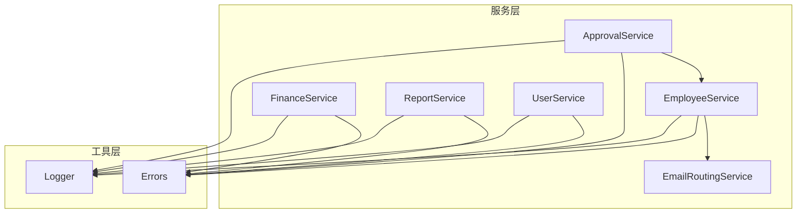
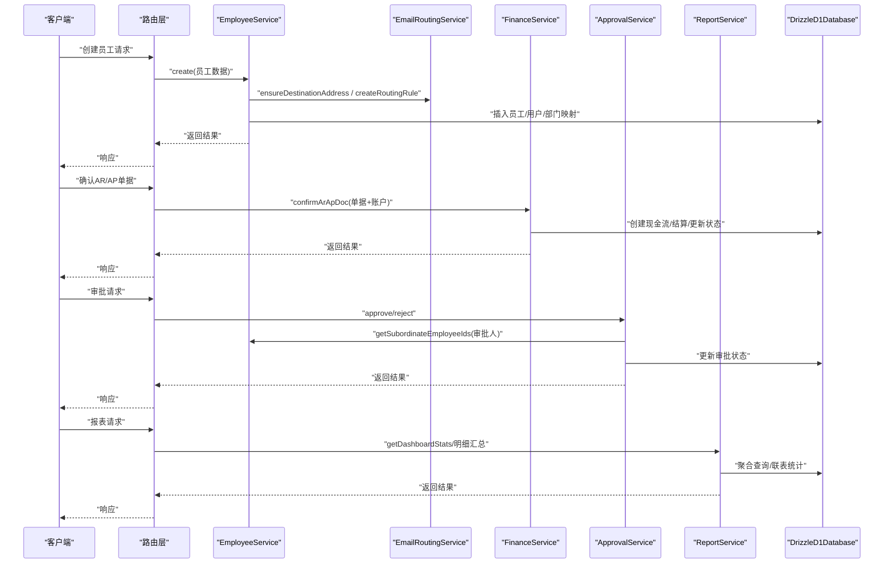
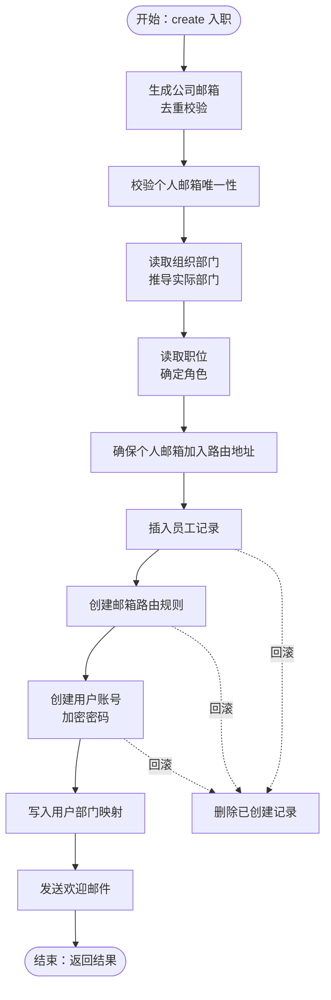
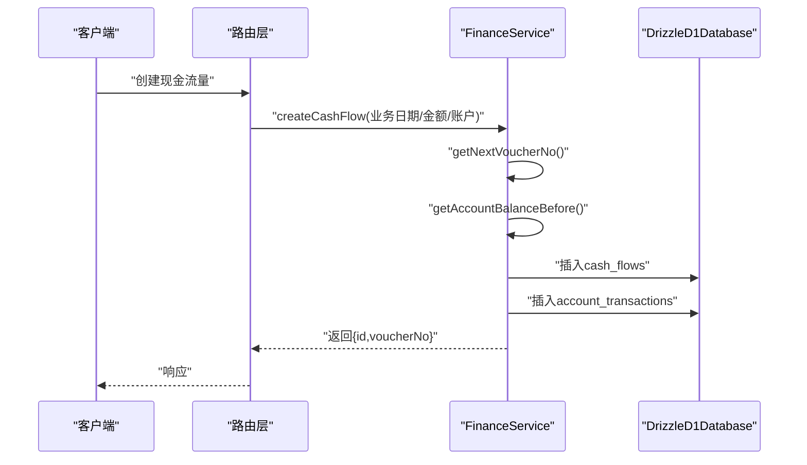
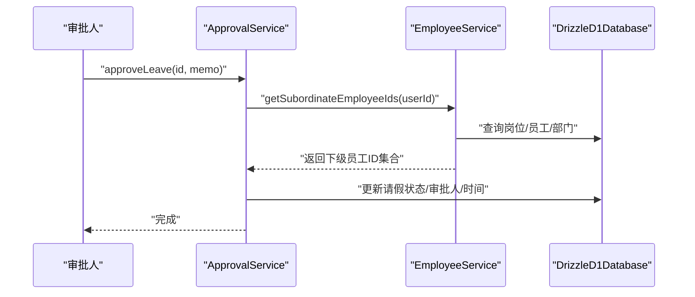
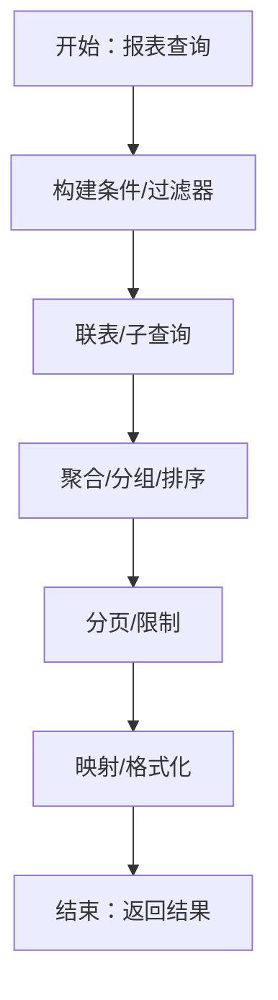
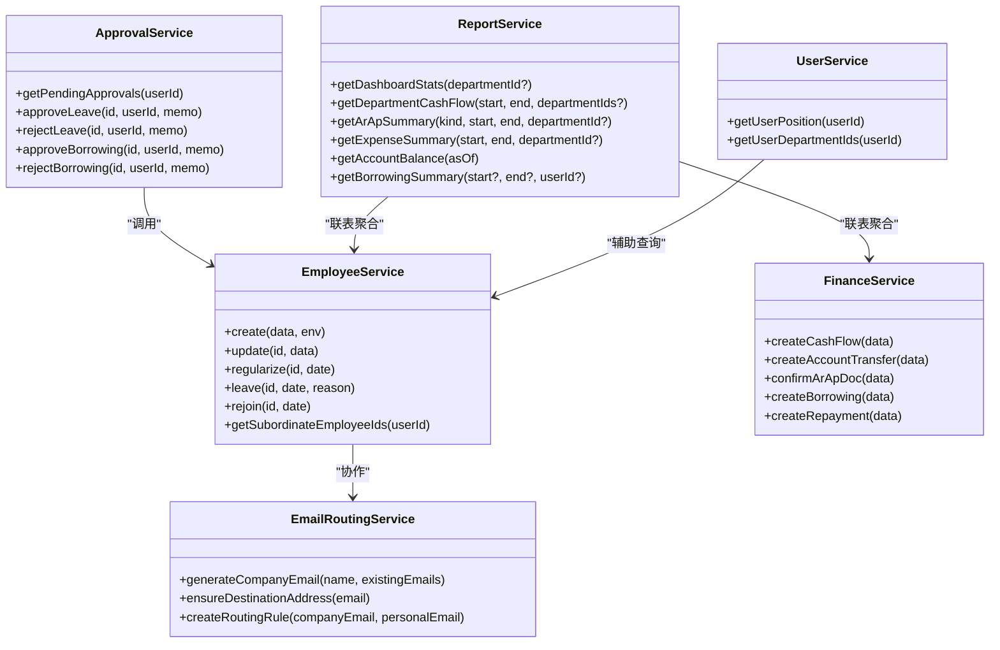

# 服务设计模式

<cite>
**本文引用的文件**
- [EmployeeService.ts](file://backend/src/services/EmployeeService.ts)
- [FinanceService.ts](file://backend/src/services/FinanceService.ts)
- [ApprovalService.ts](file://backend/src/services/ApprovalService.ts)
- [ReportService.ts](file://backend/src/services/ReportService.ts)
- [EmailRoutingService.ts](file://backend/src/services/EmailRoutingService.ts)
- [UserService.ts](file://backend/src/services/UserService.ts)
- [errors.ts](file://backend/src/utils/errors.ts)
- [logger.ts](file://backend/src/utils/logger.ts)
- [EmployeeService.test.ts](file://backend/test/services/EmployeeService.test.ts)
- [FinanceService.test.ts](file://backend/test/services/FinanceService.test.ts)
- [ReportService.test.ts](file://backend/test/services/ReportService.test.ts)
</cite>

## 目录
1. [引言](#引言)
2. [项目结构](#项目结构)
3. [核心组件](#核心组件)
4. [架构总览](#架构总览)
5. [详细组件分析](#详细组件分析)
6. [依赖关系分析](#依赖关系分析)
7. [性能考量](#性能考量)
8. [故障排查指南](#故障排查指南)
9. [结论](#结论)
10. [附录：创建新服务的标准模板](#附录创建新服务的标准模板)

## 引言
本文件聚焦财务管理系统中核心服务类的设计模式与实现范式，围绕 EmployeeService 与 FinanceService 展开，系统阐述：
- 员工入职流程中的多系统协同（用户创建、邮箱路由、权限分配）与事务处理机制
- 服务方法的职责单一性原则与标准 CRUD 实现模式
- 跨服务调用最佳实践（ApprovalService 如何协调 EmployeeService 完成审批流程）
- 报表类服务的性能优化策略（分页、缓存、异步生成思路）
- 新服务开发模板（错误处理、日志记录、测试可维护性）

## 项目结构
后端采用“按领域/功能划分”的服务层组织方式，服务类位于 backend/src/services，统一通过路由层注入并对外暴露接口。典型特征：
- 服务类以 DrizzleD1Database 作为数据库依赖注入，保证可测试性与解耦
- 服务间通过构造函数注入或局部实例化协作（如 EmployeeService 与 EmailRoutingService）
- 错误与日志工具集中管理，统一异常与结构化日志输出

图表来源
- [EmployeeService.ts](file://backend/src/services/EmployeeService.ts#L1-L593)
- [FinanceService.ts](file://backend/src/services/FinanceService.ts#L1-L614)
- [ApprovalService.ts](file://backend/src/services/ApprovalService.ts#L1-L283)
- [ReportService.ts](file://backend/src/services/ReportService.ts#L1-L700)
- [EmailRoutingService.ts](file://backend/src/services/EmailRoutingService.ts#L1-L248)
- [UserService.ts](file://backend/src/services/UserService.ts#L1-L183)
- [errors.ts](file://backend/src/utils/errors.ts#L1-L114)
- [logger.ts](file://backend/src/utils/logger.ts#L1-L84)

章节来源
- [EmployeeService.ts](file://backend/src/services/EmployeeService.ts#L1-L593)
- [FinanceService.ts](file://backend/src/services/FinanceService.ts#L1-L614)
- [errors.ts](file://backend/src/utils/errors.ts#L1-L114)
- [logger.ts](file://backend/src/utils/logger.ts#L1-L84)

## 核心组件
- EmployeeService：负责员工生命周期管理、入职协同（用户、邮箱路由、欢迎邮件）、组织与岗位同步、上下级关系查询等
- FinanceService：负责现金流、转账、应收应付、借支还款、站点账单等财务核心流程，强调余额快照与一致性
- ApprovalService：基于 EmployeeService 的上下级关系，协调请假、报销、借支的审批流
- ReportService：数据聚合类服务，提供仪表盘、流水、AR/AP、费用、账户余额、借支等报表
- EmailRoutingService：与 Cloudflare Email Routing 协作，生成公司邮箱、创建路由规则、验证目标地址
- UserService：用户维度的组织、部门、岗位、权限等查询辅助

章节来源
- [EmployeeService.ts](file://backend/src/services/EmployeeService.ts#L1-L593)
- [FinanceService.ts](file://backend/src/services/FinanceService.ts#L1-L614)
- [ApprovalService.ts](file://backend/src/services/ApprovalService.ts#L1-L283)
- [ReportService.ts](file://backend/src/services/ReportService.ts#L1-L700)
- [EmailRoutingService.ts](file://backend/src/services/EmailRoutingService.ts#L1-L248)
- [UserService.ts](file://backend/src/services/UserService.ts#L1-L183)

## 架构总览
服务层通过依赖注入与工具层协作，形成清晰的职责边界与调用链路。下图展示关键交互：

图表来源
- [EmployeeService.ts](file://backend/src/services/EmployeeService.ts#L1-L249)
- [EmailRoutingService.ts](file://backend/src/services/EmailRoutingService.ts#L75-L162)
- [FinanceService.ts](file://backend/src/services/FinanceService.ts#L388-L435)
- [ApprovalService.ts](file://backend/src/services/ApprovalService.ts#L160-L281)
- [ReportService.ts](file://backend/src/services/ReportService.ts#L12-L118)

## 详细组件分析

### EmployeeService：入职流程与事务处理
- 多系统协同
  - 生成公司邮箱并去重校验
  - 个人邮箱加入 Cloudflare Email Routing 地址并创建路由规则
  - 用户账号创建（随机密码、加密存储），同步用户部门与岗位
  - 欢迎邮件发送（可选）
- 事务处理机制
  - D1 不支持传统事务，采用“资源跟踪 + 反向删除”回滚策略
  - 关键路径上对每一步进行回滚清理，确保幂等性与一致性
- 职责单一性
  - create/update/delete/regularize/leave/rejoin 等方法各司其职，避免“大杂烩”
  - 上下级关系查询独立于业务流程，便于复用
- 代码片段路径
  - [create 入职主流程](file://backend/src/services/EmployeeService.ts#L15-L249)
  - [update 同步用户与部门映射](file://backend/src/services/EmployeeService.ts#L448-L491)
  - [getSubordinateEmployeeIds 上下级判定](file://backend/src/services/EmployeeService.ts#L548-L591)

图表来源
- [EmployeeService.ts](file://backend/src/services/EmployeeService.ts#L15-L249)

章节来源
- [EmployeeService.ts](file://backend/src/services/EmployeeService.ts#L1-L249)
- [EmployeeService.ts](file://backend/src/services/EmployeeService.ts#L448-L491)
- [EmployeeService.ts](file://backend/src/services/EmployeeService.ts#L548-L591)
- [EmailRoutingService.ts](file://backend/src/services/EmailRoutingService.ts#L75-L162)
- [errors.ts](file://backend/src/utils/errors.ts#L34-L54)

### FinanceService：财务交易与余额快照
- 现金流与转账
  - 现金流编号自增序列生成，余额计算基于“时间戳前一条记录”的余额快照
  - 转账同时在两账户分别产生出/入流水，保持借贷平衡
- 应收应付
  - 单据创建后根据结算累计自动刷新状态（open/partially_settled/settled）
  - 确认单据时联动创建现金流、结算并更新状态
- 借支与还款
  - 借支与还款分别记录，支持按用户汇总与明细查询
- 代码片段路径
  - [getNextVoucherNo 流水号生成](file://backend/src/services/FinanceService.ts#L28-L39)
  - [createCashFlow 余额快照与流水](file://backend/src/services/FinanceService.ts#L71-L128)
  - [createAccountTransfer 转账双记账](file://backend/src/services/FinanceService.ts#L181-L244)
  - [confirmArApDoc 单据确认](file://backend/src/services/FinanceService.ts#L388-L435)
  - [createBorrowing/createRepayment 借还记录](file://backend/src/services/FinanceService.ts#L482-L528)

图表来源
- [FinanceService.ts](file://backend/src/services/FinanceService.ts#L28-L128)

章节来源
- [FinanceService.ts](file://backend/src/services/FinanceService.ts#L1-L614)
- [FinanceService.test.ts](file://backend/test/services/FinanceService.test.ts#L107-L130)
- [FinanceService.test.ts](file://backend/test/services/FinanceService.test.ts#L132-L162)
- [FinanceService.test.ts](file://backend/test/services/FinanceService.test.ts#L164-L197)
- [FinanceService.test.ts](file://backend/test/services/FinanceService.test.ts#L199-L236)
- [FinanceService.test.ts](file://backend/test/services/FinanceService.test.ts#L238-L287)
- [FinanceService.test.ts](file://backend/test/services/FinanceService.test.ts#L289-L336)

### ApprovalService：跨服务审批协调
- 基于 EmployeeService 的上下级关系判断，限定审批范围
- 对请假、报销、借支三类业务分别提供 approve/reject 接口
- 代码片段路径
  - [getPendingApprovals 聚合待审](file://backend/src/services/ApprovalService.ts#L10-L99)
  - [approveLeave/rejectLeave 请假审批](file://backend/src/services/ApprovalService.ts#L160-L196)
  - [approveBorrowing/rejectBorrowing 借支审批](file://backend/src/services/ApprovalService.ts#L236-L281)

图表来源
- [ApprovalService.ts](file://backend/src/services/ApprovalService.ts#L160-L196)
- [EmployeeService.ts](file://backend/src/services/EmployeeService.ts#L548-L591)

章节来源
- [ApprovalService.ts](file://backend/src/services/ApprovalService.ts#L1-L283)
- [EmployeeService.ts](file://backend/src/services/EmployeeService.ts#L548-L591)

### ReportService：数据聚合与性能优化
- 聚合场景
  - 仪表盘：当日/当月收入/支出/笔数、账户数量、AR/AP 汇总、借支与还款
  - 部门现金流：按部门汇总收支与净额
  - 站点增长：同比口径计算收入变化率
  - 费用汇总/明细：按类别统计与明细联表
  - 账户余额：期初+期间变动=期末
  - 借支汇总/明细：按用户汇总与明细列表
- 性能优化策略
  - 分页与限制：多数查询带 limit 与 orderBy，避免全量扫描
  - 批量查询与映射：使用 inArray 与 Map/Reduce 减少多次往返
  - 条件动态拼装：按需添加过滤条件，降低不必要的 JOIN
  - 原生 SQL 片段：对复杂聚合使用 sql 模板，减少应用层计算
- 代码片段路径
  - [getDashboardStats 仪表盘](file://backend/src/services/ReportService.ts#L12-L118)
  - [getDepartmentCashFlow 部门流水](file://backend/src/services/ReportService.ts#L120-L156)
  - [getSiteGrowth 站点增长](file://backend/src/services/ReportService.ts#L158-L217)
  - [getArApSummary/Detail AR/AP 汇总/明细](file://backend/src/services/ReportService.ts#L219-L280)
  - [getExpenseSummary/Detail 费用统计](file://backend/src/services/ReportService.ts#L282-L337)
  - [getAccountBalance 账户余额](file://backend/src/services/ReportService.ts#L339-L413)
  - [getBorrowingSummary/Detail 借支统计](file://backend/src/services/ReportService.ts#L415-L478)
  - [getNewSiteRevenue 新站点收入](file://backend/src/services/ReportService.ts#L480-L513)
  - [getEmployeeSalaryReport 员工薪资报表](file://backend/src/services/ReportService.ts#L515-L664)
  - [getAnnualLeaveReport 年假统计](file://backend/src/services/ReportService.ts#L666-L699)

图表来源
- [ReportService.ts](file://backend/src/services/ReportService.ts#L120-L156)
- [ReportService.ts](file://backend/src/services/ReportService.ts#L219-L280)
- [ReportService.ts](file://backend/src/services/ReportService.ts#L339-L413)

章节来源
- [ReportService.ts](file://backend/src/services/ReportService.ts#L1-L700)
- [ReportService.test.ts](file://backend/test/services/ReportService.test.ts#L1-L115)

### EmailRoutingService：外部系统集成
- 功能要点
  - 生成公司邮箱（去重）
  - 确保目标地址存在并验证
  - 创建/删除/列出路由规则
- 代码片段路径
  - [generateCompanyEmail](file://backend/src/services/EmailRoutingService.ts#L33-L53)
  - [ensureDestinationAddress](file://backend/src/services/EmailRoutingService.ts#L75-L109)
  - [createRoutingRule](file://backend/src/services/EmailRoutingService.ts#L111-L162)

章节来源
- [EmailRoutingService.ts](file://backend/src/services/EmailRoutingService.ts#L1-L248)

### UserService：用户维度辅助
- 提供用户与员工、部门、组织部门、岗位、权限的查询与映射能力
- 代码片段路径
  - [getUserPosition](file://backend/src/services/UserService.ts#L41-L81)
  - [getUserDepartmentIds](file://backend/src/services/UserService.ts#L153-L176)

章节来源
- [UserService.ts](file://backend/src/services/UserService.ts#L1-L183)

## 依赖关系分析
- 内聚与耦合
  - EmployeeService 与 EmailRoutingService 为协作关系，通过构造函数注入环境参数
  - ApprovalService 依赖 EmployeeService 的上下级判定，耦合度低（仅依赖接口）
  - ReportService 与 FinanceService/EmployeeService 等多模块联表聚合，属于高内聚的数据服务
- 外部依赖
  - Cloudflare Email Routing API（仅在入职流程中使用）
  - DrizzleD1Database（统一数据访问）
- 循环依赖
  - 当前未发现循环依赖；若后续扩展，应避免服务间互相 new 实例导致的循环

图表来源
- [EmployeeService.ts](file://backend/src/services/EmployeeService.ts#L1-L593)
- [FinanceService.ts](file://backend/src/services/FinanceService.ts#L1-L614)
- [ApprovalService.ts](file://backend/src/services/ApprovalService.ts#L1-L283)
- [ReportService.ts](file://backend/src/services/ReportService.ts#L1-L700)
- [EmailRoutingService.ts](file://backend/src/services/EmailRoutingService.ts#L1-L248)
- [UserService.ts](file://backend/src/services/UserService.ts#L1-L183)

## 性能考量
- 查询性能
  - 使用 limit/offset 控制返回规模，避免一次性加载大量数据
  - inArray + Map 映射减少 N+1 查询
  - 条件动态拼装，按需 JOIN，避免不必要的表连接
- 计算性能
  - 余额快照采用“时间戳前一条记录”，避免复杂窗口函数
  - 报表聚合尽量下沉到数据库层（sql 模板），减少应用层遍历
- 缓存与异步
  - 报表类服务建议引入短期缓存（如按日期/部门维度）与异步生成队列，前端轮询或 SSE 推送
  - 对高频报表（仪表盘）可考虑预聚合表或物化视图（视平台能力而定）
- 日志与可观测性
  - 使用统一日志工具记录关键路径耗时与上下文，便于定位慢查询

[本节为通用指导，无需特定文件引用]

## 故障排查指南
- 统一错误处理
  - 使用 Errors 工具抛出业务错误，路由层统一捕获并返回结构化错误
  - 建议在服务方法入口处记录请求上下文，便于定位问题
- 日志记录
  - 在关键步骤（创建/更新/删除）前后记录结构化日志，包含操作、表、影响行数、耗时
- 常见问题
  - 入职失败回滚：检查回滚顺序与异常捕获是否完整
  - 邮箱路由失败：确认 Cloudflare 凭据配置与网络连通性
  - 余额不一致：核对余额快照逻辑与业务日期/时间戳顺序
- 测试参考
  - 员工迁移、财务流水、报表聚合均有单元测试覆盖，可对照用例定位差异

章节来源
- [errors.ts](file://backend/src/utils/errors.ts#L1-L114)
- [logger.ts](file://backend/src/utils/logger.ts#L1-L84)
- [EmployeeService.test.ts](file://backend/test/services/EmployeeService.test.ts#L1-L100)
- [FinanceService.test.ts](file://backend/test/services/FinanceService.test.ts#L1-L337)
- [ReportService.test.ts](file://backend/test/services/ReportService.test.ts#L1-L115)

## 结论
- EmployeeService 通过“资源跟踪 + 反向删除”的回滚策略，在 D1 限制下实现了近似事务的一致性
- FinanceService 的余额快照与双记账模型保证了财务数据的准确性与可追溯性
- ApprovalService 将审批域逻辑与员工域解耦，提升可维护性
- ReportService 以分页、批量查询与原生 SQL 为核心优化手段，满足报表性能需求
- 建议在新增服务时遵循职责单一、依赖注入、统一错误与日志、充分测试的原则

[本节为总结性内容，无需特定文件引用]

## 附录：创建新服务的标准模板
- 依赖注入
  - 构造函数注入 DrizzleD1Database，便于测试替换
- 方法设计
  - create/update/delete/select/list 等方法职责单一，输入参数明确，返回值结构化
  - 对外暴露的业务方法内部拆分为多个私有步骤，便于测试与复用
- 错误处理
  - 使用 Errors 工具抛出业务错误，路由层统一捕获
  - 对外部系统调用（如 Cloudflare API）增加 try/catch 与降级策略
- 日志记录
  - 在关键路径记录结构化日志，包含操作、表、影响行数、耗时、上下文
- 测试可维护性
  - 为每个方法编写单元测试，覆盖正常路径与边界条件
  - 使用测试工具模拟数据库事务（如 db.transaction = async (cb)=>cb(db)）
- 示例参考
  - [EmployeeService 测试模板](file://backend/test/services/EmployeeService.test.ts#L1-L100)
  - [FinanceService 测试模板](file://backend/test/services/FinanceService.test.ts#L1-L337)
  - [ReportService 测试模板](file://backend/test/services/ReportService.test.ts#L1-L115)

章节来源
- [EmployeeService.test.ts](file://backend/test/services/EmployeeService.test.ts#L1-L100)
- [FinanceService.test.ts](file://backend/test/services/FinanceService.test.ts#L1-L337)
- [ReportService.test.ts](file://backend/test/services/ReportService.test.ts#L1-L115)
- [errors.ts](file://backend/src/utils/errors.ts#L1-L114)
- [logger.ts](file://backend/src/utils/logger.ts#L1-L84)