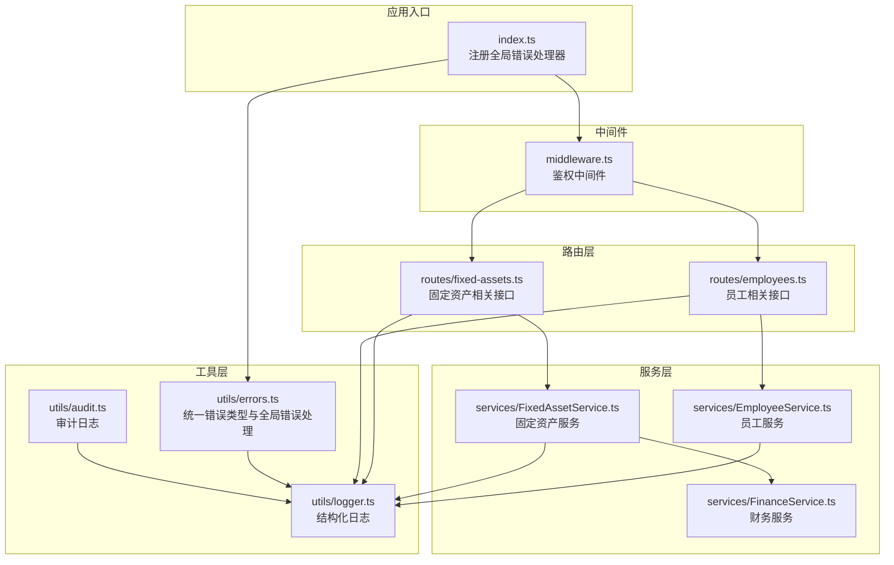
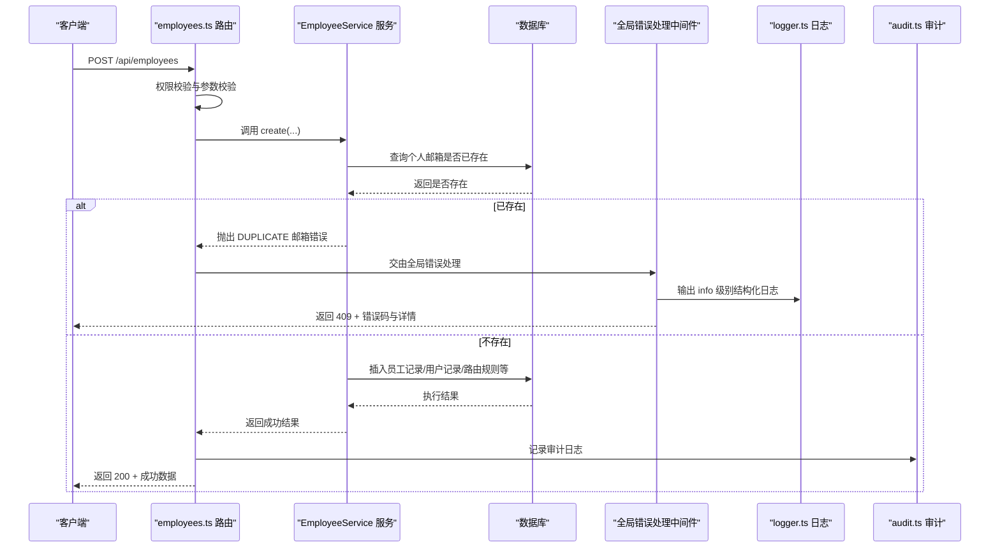
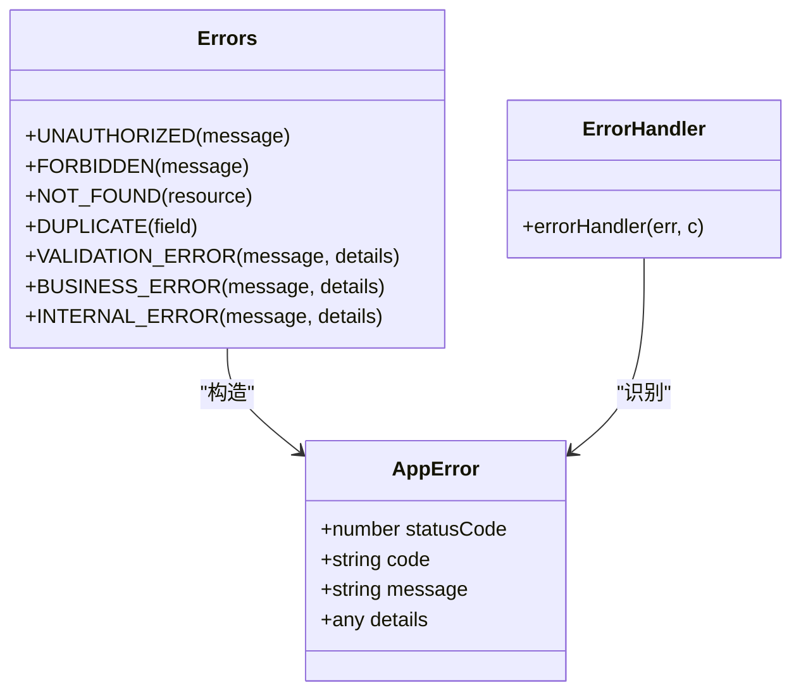
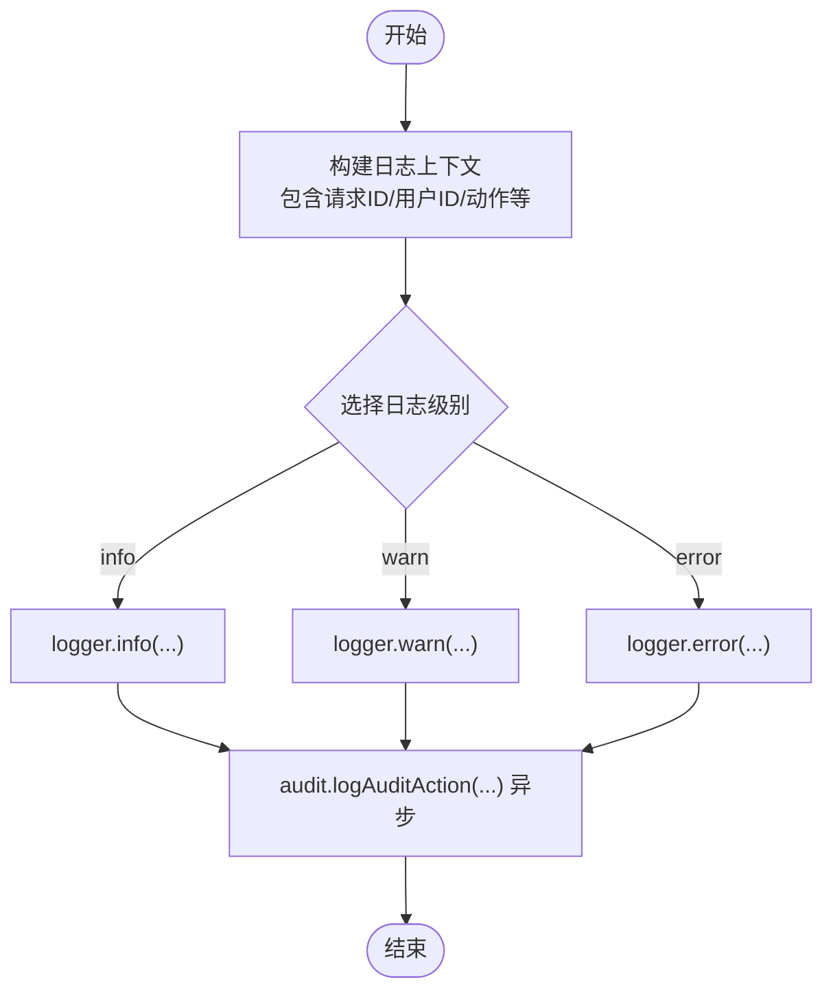
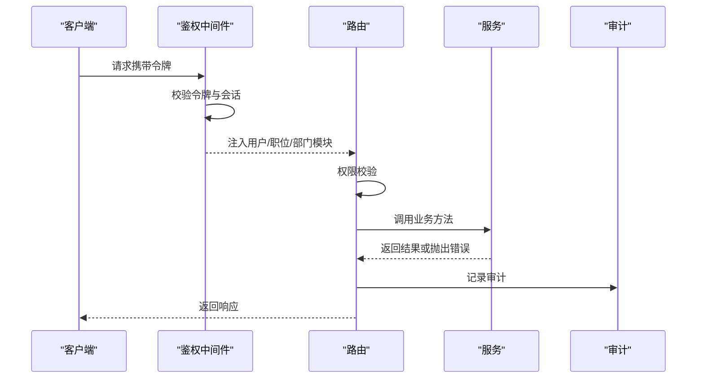
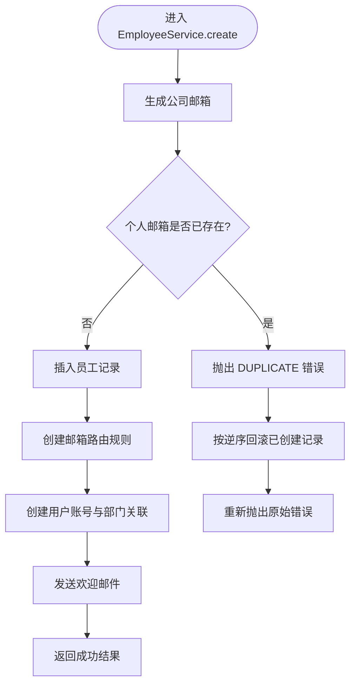
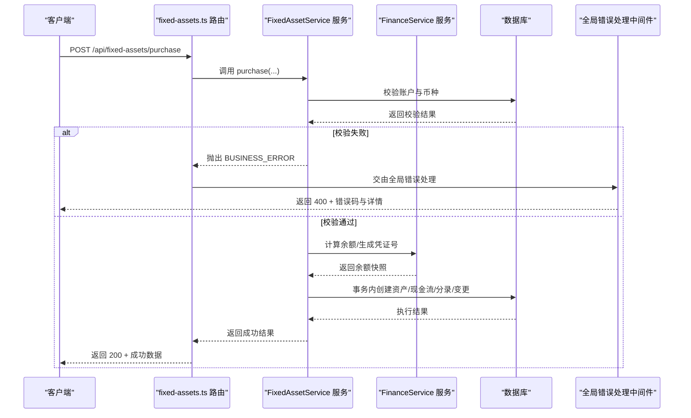
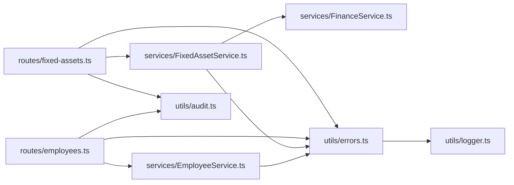

# 错误处理机制

<cite>
**本文引用的文件**
- [backend/src/utils/errors.ts](file://backend/src/utils/errors.ts)
- [backend/src/utils/logger.ts](file://backend/src/utils/logger.ts)
- [backend/src/utils/audit.ts](file://backend/src/utils/audit.ts)
- [backend/src/middleware.ts](file://backend/src/middleware.ts)
- [backend/src/index.ts](file://backend/src/index.ts)
- [backend/src/routes/employees.ts](file://backend/src/routes/employees.ts)
- [backend/src/routes/fixed-assets.ts](file://backend/src/routes/fixed-assets.ts)
- [backend/src/services/EmployeeService.ts](file://backend/src/services/EmployeeService.ts)
- [backend/src/services/FixedAssetService.ts](file://backend/src/services/FixedAssetService.ts)
- [backend/src/services/FinanceService.ts](file://backend/src/services/FinanceService.ts)
- [optimize-errors.js](file://backend/optimize-errors.js)
</cite>

## 目录
1. [引言](#引言)
2. [项目结构](#项目结构)
3. [核心组件](#核心组件)
4. [架构总览](#架构总览)
5. [详细组件分析](#详细组件分析)
6. [依赖关系分析](#依赖关系分析)
7. [性能考量](#性能考量)
8. [故障排查指南](#故障排查指南)
9. [结论](#结论)
10. [附录](#附录)

## 引言
本文件系统性阐述财务管理系统中的分层错误处理架构，围绕统一错误类型、业务服务抛出语义化异常、全局错误捕获与日志记录、以及跨服务调用中的错误传播与回滚策略展开。文档以 EmployeeService 创建员工时的邮箱冲突处理为例，展示从路由到服务、再到全局中间件的完整链路；并结合 FixedAssetService 在财务关联操作失败时的回滚策略，说明跨服务调用中的错误传播与一致性保障。同时给出错误分类、日志级别与监控告警建议，以及错误码设计规范与扩展方法，帮助开发者快速定位问题并正确实现错误处理。

## 项目结构
后端采用 Hono 应用，通过全局错误处理器统一拦截业务异常与未预期错误，并结合结构化日志与审计日志，形成“路由-服务-中间件-全局错误处理-日志”的完整链路。

图表来源
- [backend/src/index.ts](file://backend/src/index.ts#L43-L60)
- [backend/src/middleware.ts](file://backend/src/middleware.ts#L1-L82)
- [backend/src/routes/employees.ts](file://backend/src/routes/employees.ts#L1-L161)
- [backend/src/routes/fixed-assets.ts](file://backend/src/routes/fixed-assets.ts#L1-L120)
- [backend/src/services/EmployeeService.ts](file://backend/src/services/EmployeeService.ts#L1-L249)
- [backend/src/services/FixedAssetService.ts](file://backend/src/services/FixedAssetService.ts#L1-L120)
- [backend/src/services/FinanceService.ts](file://backend/src/services/FinanceService.ts#L1-L120)
- [backend/src/utils/errors.ts](file://backend/src/utils/errors.ts#L56-L112)
- [backend/src/utils/logger.ts](file://backend/src/utils/logger.ts#L1-L84)
- [backend/src/utils/audit.ts](file://backend/src/utils/audit.ts#L1-L92)

章节来源
- [backend/src/index.ts](file://backend/src/index.ts#L43-L60)
- [backend/src/middleware.ts](file://backend/src/middleware.ts#L1-L82)

## 核心组件
- 统一错误类型与全局错误处理：定义标准错误类与常用错误工厂函数，并在全局中间件中进行结构化日志与响应封装。
- 结构化日志：提供 info/warn/error 等日志级别，支持上下文信息与错误详情。
- 审计日志：记录用户行为、实体与详情，异步写入避免阻塞主流程。
- 业务服务：在服务层抛出语义化错误，配合事务与回滚策略保证一致性。
- 路由层：负责鉴权与权限校验，触发服务层业务逻辑并返回结果。

章节来源
- [backend/src/utils/errors.ts](file://backend/src/utils/errors.ts#L7-L112)
- [backend/src/utils/logger.ts](file://backend/src/utils/logger.ts#L1-L84)
- [backend/src/utils/audit.ts](file://backend/src/utils/audit.ts#L1-L92)

## 架构总览
下面的序列图展示了“创建员工”从路由到服务、再到全局错误处理与日志记录的完整链路。

图表来源
- [backend/src/routes/employees.ts](file://backend/src/routes/employees.ts#L118-L161)
- [backend/src/services/EmployeeService.ts](file://backend/src/services/EmployeeService.ts#L61-L100)
- [backend/src/utils/errors.ts](file://backend/src/utils/errors.ts#L34-L54)
- [backend/src/utils/logger.ts](file://backend/src/utils/logger.ts#L42-L81)
- [backend/src/utils/audit.ts](file://backend/src/utils/audit.ts#L61-L91)

章节来源
- [backend/src/routes/employees.ts](file://backend/src/routes/employees.ts#L118-L161)
- [backend/src/services/EmployeeService.ts](file://backend/src/services/EmployeeService.ts#L61-L100)
- [backend/src/utils/errors.ts](file://backend/src/utils/errors.ts#L34-L54)

## 详细组件分析

### 统一错误类型与全局错误处理
- 错误类与工厂：提供 AppError 类与 Errors 工厂，覆盖认证、资源、验证、业务、服务器等常见错误场景。
- 全局错误处理：对 AppError 输出 info 级别日志并返回结构化 JSON；对 Zod 验证错误输出结构化 JSON 并返回 400；对未预期错误输出 error 级别日志并返回 500。
- 日志上下文：包含时间戳、URL、方法、用户标识、角色、IP、UA、错误详情等，便于追踪与审计。

图表来源
- [backend/src/utils/errors.ts](file://backend/src/utils/errors.ts#L7-L54)
- [backend/src/utils/errors.ts](file://backend/src/utils/errors.ts#L56-L112)

章节来源
- [backend/src/utils/errors.ts](file://backend/src/utils/errors.ts#L7-L112)

### 结构化日志与审计日志
- 结构化日志：提供 info/warn/error 等级别，支持上下文注入（如请求ID、用户ID、动作等），并格式化输出。
- 审计日志：从请求头提取 IP 与归属地信息，异步记录操作者、实体、实体ID、详情与时间，避免阻塞主流程。

图表来源
- [backend/src/utils/logger.ts](file://backend/src/utils/logger.ts#L1-L84)
- [backend/src/utils/audit.ts](file://backend/src/utils/audit.ts#L1-L92)

章节来源
- [backend/src/utils/logger.ts](file://backend/src/utils/logger.ts#L1-L84)
- [backend/src/utils/audit.ts](file://backend/src/utils/audit.ts#L1-L92)

### 路由层与鉴权中间件
- 鉴权中间件：从 Cookie/Authorization/Bearer 头中提取令牌，校验并加载会话与职位信息，注入到上下文中，供路由与服务使用。
- 路由层：在路由中进行权限校验与参数校验，调用对应服务执行业务逻辑，并记录审计日志。

图表来源
- [backend/src/middleware.ts](file://backend/src/middleware.ts#L1-L82)
- [backend/src/routes/employees.ts](file://backend/src/routes/employees.ts#L1-L161)
- [backend/src/routes/fixed-assets.ts](file://backend/src/routes/fixed-assets.ts#L1-L120)
- [backend/src/utils/audit.ts](file://backend/src/utils/audit.ts#L61-L91)

章节来源
- [backend/src/middleware.ts](file://backend/src/middleware.ts#L1-L82)
- [backend/src/routes/employees.ts](file://backend/src/routes/employees.ts#L1-L161)
- [backend/src/routes/fixed-assets.ts](file://backend/src/routes/fixed-assets.ts#L1-L120)

### 业务服务：员工创建与邮箱冲突处理
- 业务要点：
  - 生成公司邮箱并检查个人邮箱是否已存在，若存在则抛出 DUPLICATE 错误。
  - 通过 EmailRoutingService 确保个人邮箱加入 Cloudflare Email Routing 地址，失败仅记录错误日志。
  - 使用 try/catch 包裹多步骤写入，发生错误时按逆序回滚已创建的记录，再重新抛出原始错误。
- 错误传播：服务层抛出的业务错误由全局错误处理中间件捕获并返回客户端。

图表来源
- [backend/src/services/EmployeeService.ts](file://backend/src/services/EmployeeService.ts#L61-L100)
- [backend/src/services/EmployeeService.ts](file://backend/src/services/EmployeeService.ts#L101-L249)
- [backend/src/utils/errors.ts](file://backend/src/utils/errors.ts#L34-L54)

章节来源
- [backend/src/services/EmployeeService.ts](file://backend/src/services/EmployeeService.ts#L61-L100)
- [backend/src/services/EmployeeService.ts](file://backend/src/services/EmployeeService.ts#L101-L249)

### 跨服务调用与错误传播：固定资产购买与财务关联
- 业务要点：
  - FixedAssetService.purchase 在事务中创建资产、现金流、会计分录与变更记录。
  - 在创建资产前，会校验账户状态与币种一致性，不符合条件时抛出 BUSINESS_ERROR。
  - 若财务关联失败（如账户不存在、余额计算异常），服务层抛出相应错误，由全局错误处理中间件统一响应。
- 回滚策略：
  - 由于 D1 不支持传统事务，服务层通过 try/catch 捕获错误并在 catch 中记录错误日志，随后重新抛出错误，交由上层处理。
  - 对于需要原子性的操作，建议在服务层使用批量写入或外部事务协调器（如队列+补偿）实现最终一致性。

图表来源
- [backend/src/routes/fixed-assets.ts](file://backend/src/routes/fixed-assets.ts#L511-L576)
- [backend/src/services/FixedAssetService.ts](file://backend/src/services/FixedAssetService.ts#L436-L539)
- [backend/src/services/FinanceService.ts](file://backend/src/services/FinanceService.ts#L28-L69)
- [backend/src/utils/errors.ts](file://backend/src/utils/errors.ts#L44-L54)

章节来源
- [backend/src/routes/fixed-assets.ts](file://backend/src/routes/fixed-assets.ts#L511-L576)
- [backend/src/services/FixedAssetService.ts](file://backend/src/services/FixedAssetService.ts#L436-L539)
- [backend/src/services/FinanceService.ts](file://backend/src/services/FinanceService.ts#L28-L69)

### 错误分类与日志级别、监控告警建议
- 客户端错误（4xx）：包括 UNAUTHORIZED/FORBIDDEN/NOT_FOUND/DUPLICATE/VALIDATION_ERROR 等。日志级别：info；监控告警：关注错误率与趋势，设置阈值告警。
- 业务错误（4xx）：BUSINESS_ERROR，通常由业务规则触发。日志级别：info；监控告警：关注业务错误占比与热点字段。
- 服务器错误（5xx）：INTERNAL_ERROR，表示未预期错误。日志级别：error；监控告警：立即告警，优先处理。
- 第三方服务错误：当调用外部服务（如邮件路由）失败时，服务层记录错误日志并继续流程（非致命），必要时在上层进行补偿或重试。

章节来源
- [backend/src/utils/errors.ts](file://backend/src/utils/errors.ts#L34-L54)
- [backend/src/utils/errors.ts](file://backend/src/utils/errors.ts#L56-L112)
- [backend/src/utils/logger.ts](file://backend/src/utils/logger.ts#L42-L81)

### 错误码设计规范与扩展方法
- 错误码命名规范：采用大写英文+下划线风格，语义明确，如 UNAUTHORIZED、FORBIDDEN、NOT_FOUND、DUPLICATE、VALIDATION_ERROR、BUSINESS_ERROR、INTERNAL_ERROR。
- 错误详情（details）：用于承载结构化信息（如验证错误数组、资源名等），便于前端展示与定位。
- 扩展方法：
  - 新增错误类型：在 Errors 工厂中新增条目，保持与现有风格一致。
  - 自定义业务异常：在服务层使用 Errors.BUSINESS_ERROR/Errors.VALIDATION_ERROR 抛出，确保被全局错误处理捕获并返回统一格式。
  - 代码迁移：通过脚本将路由层中直接返回 JSON 的错误处理替换为抛出 Errors 工厂方法，提升一致性与可维护性。

章节来源
- [backend/src/utils/errors.ts](file://backend/src/utils/errors.ts#L34-L54)
- [optimize-errors.js](file://backend/optimize-errors.js#L92-L153)
- [optimize-errors.js](file://backend/optimize-errors.js#L131-L287)

## 依赖关系分析
- 路由依赖服务：路由层通过上下文获取服务实例，调用服务方法并记录审计日志。
- 服务依赖工具：服务层依赖错误工厂与日志工具，保证错误语义化与可观测性。
- 全局错误处理依赖：全局中间件统一拦截错误，输出结构化日志并返回标准化响应。
- 审计依赖：审计日志异步写入，避免阻塞主流程。

图表来源
- [backend/src/routes/employees.ts](file://backend/src/routes/employees.ts#L1-L161)
- [backend/src/routes/fixed-assets.ts](file://backend/src/routes/fixed-assets.ts#L1-L120)
- [backend/src/services/EmployeeService.ts](file://backend/src/services/EmployeeService.ts#L1-L120)
- [backend/src/services/FixedAssetService.ts](file://backend/src/services/FixedAssetService.ts#L1-L120)
- [backend/src/services/FinanceService.ts](file://backend/src/services/FinanceService.ts#L1-L120)
- [backend/src/utils/errors.ts](file://backend/src/utils/errors.ts#L34-L54)
- [backend/src/utils/logger.ts](file://backend/src/utils/logger.ts#L1-L84)
- [backend/src/utils/audit.ts](file://backend/src/utils/audit.ts#L1-L92)

章节来源
- [backend/src/routes/employees.ts](file://backend/src/routes/employees.ts#L1-L161)
- [backend/src/routes/fixed-assets.ts](file://backend/src/routes/fixed-assets.ts#L1-L120)
- [backend/src/services/EmployeeService.ts](file://backend/src/services/EmployeeService.ts#L1-L120)
- [backend/src/services/FixedAssetService.ts](file://backend/src/services/FixedAssetService.ts#L1-L120)
- [backend/src/services/FinanceService.ts](file://backend/src/services/FinanceService.ts#L1-L120)
- [backend/src/utils/errors.ts](file://backend/src/utils/errors.ts#L34-L54)
- [backend/src/utils/logger.ts](file://backend/src/utils/logger.ts#L1-L84)
- [backend/src/utils/audit.ts](file://backend/src/utils/audit.ts#L1-L92)

## 性能考量
- 日志级别与开销：生产环境默认 info 级别，减少 debug/warn 输出；审计日志通过 waitUntil 异步写入，避免阻塞请求。
- 全局错误处理：仅在出现错误时输出结构化日志，正常路径不产生额外日志开销。
- 事务与回滚：D1 不支持传统事务，服务层通过 try/catch 实现回滚，注意回滚成本与幂等性设计。

[本节为通用指导，不涉及具体文件分析]

## 故障排查指南
- 定位错误来源：查看全局错误处理输出的结构化日志，包含 URL、方法、用户、IP、UA、错误详情等。
- 审计追踪：通过审计日志定位操作人、实体与时间，辅助复盘。
- 常见问题：
  - 401/403：检查鉴权中间件是否正确注入用户与职位信息。
  - 409 DUPLICATE：检查唯一约束字段（如个人邮箱、资产代码）是否重复。
  - 400 VALIDATION_ERROR：检查路由层参数校验与 Zod 规则。
  - 500 INTERNAL_ERROR：查看错误堆栈与日志，定位未预期异常。

章节来源
- [backend/src/utils/errors.ts](file://backend/src/utils/errors.ts#L56-L112)
- [backend/src/utils/audit.ts](file://backend/src/utils/audit.ts#L61-L91)
- [backend/src/middleware.ts](file://backend/src/middleware.ts#L1-L82)

## 结论
本系统通过统一错误类型、结构化日志与审计日志、以及全局错误处理中间件，实现了清晰、可追踪、可监控的错误处理体系。业务服务在服务层抛出语义化异常，路由层负责鉴权与权限校验，全局中间件统一响应与日志输出。对于跨服务调用，建议在服务层明确错误边界与回滚策略，并通过脚本持续规范化错误处理，提升整体一致性与可维护性。

[本节为总结性内容，不涉及具体文件分析]

## 附录
- 错误码设计规范与扩展方法参考：
  - [backend/src/utils/errors.ts](file://backend/src/utils/errors.ts#L34-L54)
  - [optimize-errors.js](file://backend/optimize-errors.js#L92-L153)
  - [optimize-errors.js](file://backend/optimize-errors.js#L131-L287)