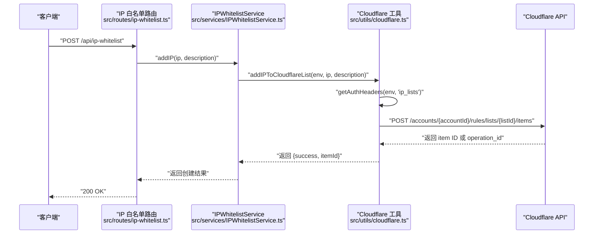
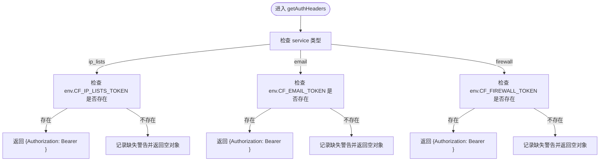
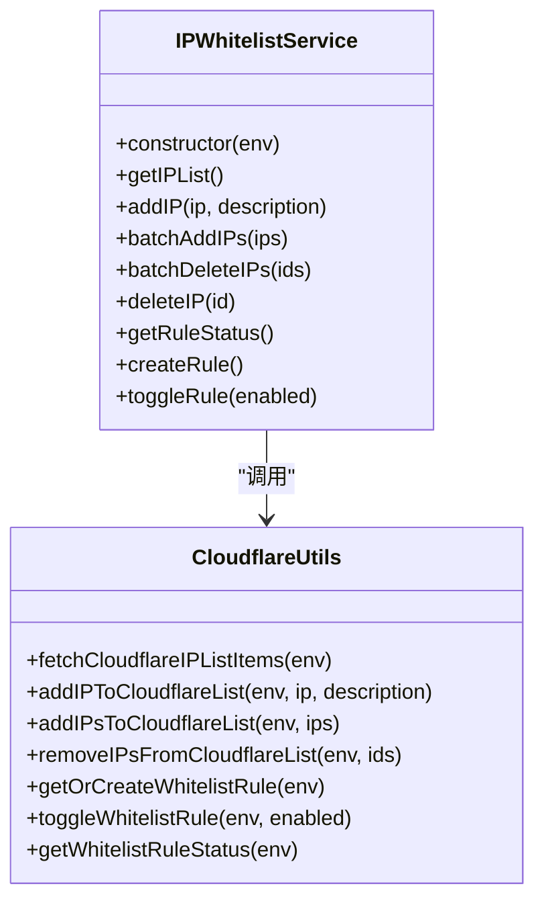
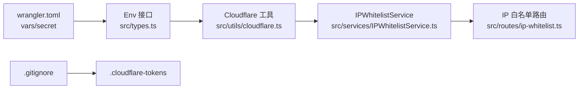

# 安全实践

<cite>
**本文引用的文件**
- [backend/.cloudflare-tokens](file://backend/.cloudflare-tokens)
- [backend/wrangler.toml](file://backend/wrangler.toml)
- [backend/src/types.ts](file://backend/src/types.ts)
- [backend/src/utils/cloudflare.ts](file://backend/src/utils/cloudflare.ts)
- [backend/src/services/IPWhitelistService.ts](file://backend/src/services/IPWhitelistService.ts)
- [backend/src/routes/ip-whitelist.ts](file://backend/src/routes/ip-whitelist.ts)
- [backend/.gitignore](file://backend/.gitignore)
- [email-worker/wrangler.toml](file://email-worker/wrangler.toml)
- [backend/src/utils/errors.ts](file://backend/src/utils/errors.ts)
</cite>

## 目录
1. [引言](#引言)
2. [项目结构](#项目结构)
3. [核心组件](#核心组件)
4. [架构总览](#架构总览)
5. [详细组件分析](#详细组件分析)
6. [依赖关系分析](#依赖关系分析)
7. [性能考虑](#性能考虑)
8. [故障排查指南](#故障排查指南)
9. [结论](#结论)
10. [附录](#附录)

## 引言
本文件围绕 caiwu-main 项目的“安全实践与敏感信息管理”展开，重点基于 .backend-tokens 文件，系统说明如何通过 Cloudflare API Tokens 实现最小权限原则，并区分代码运行时所需的 CF_IP_LISTS_TOKEN、CF_EMAIL_TOKEN、CF_FIREWALL_TOKEN 与 CLI 工具使用的 CLOUDFLARE_DEPLOY_TOKEN、CLOUDFLARE_LOGS_TOKEN。文档进一步解释这些 Token 在 wrangler.toml 的 vars 段落与 src/types.ts 的 Env 接口中的引用方式，以及通过 wrangler secret put 命令安全注入生产环境密钥的流程；分析 src/utils/cloudflare.ts 中 getAuthHeaders 函数如何依据服务类型（ip_lists/email/firewall）选择合适的 Token 进行认证；描述 IPWhitelistService 如何利用这些 Token 调用 Cloudflare API 实现 IP 白名单的动态管理；最后提供敏感文件 .gitignore 配置、Token 泄露应急响应与权限审计的完整安全指南。

## 项目结构
本项目采用多 Worker 分层组织，后端 Worker（caiwu-backend）负责业务逻辑与 Cloudflare API 调用；邮件 Worker（caiwu-email）负责邮件发送；前端通过 Cloudflare Pages 代理访问后端 API。安全相关的关键位置包括：
- 敏感令牌清单：backend/.cloudflare-tokens
- 部署配置与密钥注入：backend/wrangler.toml、email-worker/wrangler.toml
- 类型与运行时绑定：backend/src/types.ts
- Cloudflare API 认证与调用：backend/src/utils/cloudflare.ts
- IP 白名单服务与路由：backend/src/services/IPWhitelistService.ts、backend/src/routes/ip-whitelist.ts
- 版本控制忽略：backend/.gitignore

```mermaid
graph TB
subgraph "后端 Worker"
A["caiwu-backend<br/>src/index.ts"]
B["IPWhitelistService<br/>src/services/IPWhitelistService.ts"]
C["Cloudflare 工具<br/>src/utils/cloudflare.ts"]
D["IP 白名单路由<br/>src/routes/ip-whitelist.ts"]
E["类型定义 Env<br/>src/types.ts"]
F["部署配置<br/>backend/wrangler.toml"]
end
subgraph "邮件 Worker"
G["caiwu-email<br/>email-worker/wrangler.toml"]
end
subgraph "外部系统"
H["Cloudflare API"]
I["Git 版本库"]
end
A --> B
B --> C
D --> B
E --> C
F --> A
G --> H
C --> H
I -. 忽略敏感文件 .cloudflare-tokens .-> I
```

图表来源
- [backend/src/services/IPWhitelistService.ts](file://backend/src/services/IPWhitelistService.ts#L1-L138)
- [backend/src/utils/cloudflare.ts](file://backend/src/utils/cloudflare.ts#L1-L200)
- [backend/src/routes/ip-whitelist.ts](file://backend/src/routes/ip-whitelist.ts#L1-L120)
- [backend/src/types.ts](file://backend/src/types.ts#L1-L40)
- [backend/wrangler.toml](file://backend/wrangler.toml#L1-L45)
- [email-worker/wrangler.toml](file://email-worker/wrangler.toml#L1-L18)

章节来源
- [backend/.cloudflare-tokens](file://backend/.cloudflare-tokens#L1-L39)
- [backend/wrangler.toml](file://backend/wrangler.toml#L1-L45)
- [email-worker/wrangler.toml](file://email-worker/wrangler.toml#L1-L18)
- [backend/.gitignore](file://backend/.gitignore#L1-L2)

## 核心组件
- 敏感令牌清单：backend/.cloudflare-tokens 提供代码运行时与 CLI 工具两类 Token 的注释说明与示例值，明确最小权限范围与使用方式。
- 部署配置与密钥注入：backend/wrangler.toml 的 vars 段落声明 Cloudflare 账户与区域等常量，同时通过 wrangler secret put 注入生产密钥（如 JWT 密钥），避免明文写入仓库。
- 类型与运行时绑定：backend/src/types.ts 的 Env 接口声明各 Token 与常量，确保编译期约束与运行时可用性。
- Cloudflare API 认证与调用：backend/src/utils/cloudflare.ts 的 getAuthHeaders 依据服务类型选择对应 Token，hasCloudflareAPIConfig/hasCloudflareRuleConfig 校验必要参数，封装 IP 列表与防火墙规则的增删改查。
- IP 白名单服务与路由：backend/src/services/IPWhitelistService.ts 封装业务操作，backend/src/routes/ip-whitelist.ts 提供受控的 API 入口并记录审计日志。

章节来源
- [backend/.cloudflare-tokens](file://backend/.cloudflare-tokens#L1-L39)
- [backend/wrangler.toml](file://backend/wrangler.toml#L1-L45)
- [backend/src/types.ts](file://backend/src/types.ts#L1-L40)
- [backend/src/utils/cloudflare.ts](file://backend/src/utils/cloudflare.ts#L1-L120)
- [backend/src/services/IPWhitelistService.ts](file://backend/src/services/IPWhitelistService.ts#L1-L138)
- [backend/src/routes/ip-whitelist.ts](file://backend/src/routes/ip-whitelist.ts#L1-L120)

## 架构总览
下图展示从 API 请求到 Cloudflare API 的调用链路，以及最小权限 Token 的选择策略。



图表来源
- [backend/src/routes/ip-whitelist.ts](file://backend/src/routes/ip-whitelist.ts#L70-L115)
- [backend/src/services/IPWhitelistService.ts](file://backend/src/services/IPWhitelistService.ts#L25-L60)
- [backend/src/utils/cloudflare.ts](file://backend/src/utils/cloudflare.ts#L118-L210)

章节来源
- [backend/src/routes/ip-whitelist.ts](file://backend/src/routes/ip-whitelist.ts#L1-L120)
- [backend/src/services/IPWhitelistService.ts](file://backend/src/services/IPWhitelistService.ts#L1-L138)
- [backend/src/utils/cloudflare.ts](file://backend/src/utils/cloudflare.ts#L1-L210)

## 详细组件分析

### 最小权限与 Token 分类
- 代码运行时 Token（wrangler secrets）
  - CF_IP_LISTS_TOKEN：仅用于账户级规则列表（Account Rule Lists Write），支持 IP 白名单的增删改查。
  - CF_EMAIL_TOKEN：用于邮箱路由（Email Routing Addresses/Rules Write），支持邮件相关规则与地址管理。
  - CF_FIREWALL_TOKEN：用于防火墙服务（Zone Firewall Services Write），支持自定义规则集的创建与启用/禁用。
- CLI 工具 Token
  - CLOUDFLARE_DEPLOY_TOKEN：部署 Workers、KV、R2（Workers Scripts/KV/R2 Write）。
  - CLOUDFLARE_LOGS_TOKEN：读取 Workers Tail 日志（Workers Tail Read）。

上述分类与使用方法均在 backend/.cloudflare-tokens 中明确标注，遵循“最小权限”原则，避免将多个权限合并到单一 Token。

章节来源
- [backend/.cloudflare-tokens](file://backend/.cloudflare-tokens#L1-L39)

### wrangler.toml 的 vars 与 Env 接口
- wrangler.toml 的 vars 段落声明了 CF_ACCOUNT_ID、CF_ZONE_ID、CF_IP_LIST_ID 等常量，供运行时使用。
- src/types.ts 的 Env 接口声明了 EMAIL_TOKEN、RESEND_API_KEY、CF_* 系列 Token 与常量，确保编译期类型安全与运行时可用性。
- 生产密钥通过 wrangler secret put 注入（例如 AUTH_JWT_SECRET），避免明文写入仓库。

章节来源
- [backend/wrangler.toml](file://backend/wrangler.toml#L28-L45)
- [backend/src/types.ts](file://backend/src/types.ts#L1-L40)

### getAuthHeaders 的 Token 选择策略
- getAuthHeaders 根据 service 参数（'ip_lists' | 'email' | 'firewall'）选择对应的 Token 并返回 Authorization 头。
- hasCloudflareAPIConfig/hasCloudflareRuleConfig 用于校验执行 IP 列表或自定义规则操作所需的最小参数集合，防止误用。



图表来源
- [backend/src/utils/cloudflare.ts](file://backend/src/utils/cloudflare.ts#L1-L40)

章节来源
- [backend/src/utils/cloudflare.ts](file://backend/src/utils/cloudflare.ts#L1-L40)

### IPWhitelistService 的动态管理流程
- 读取：通过 fetchCloudflareIPListItems 获取远程列表，映射为本地结构。
- 新增：先检查远程是否存在重复 IP，再调用 addIPToCloudflareList，返回 Cloudflare 返回的 item ID。
- 批量新增/删除：addIPsToCloudflareList/removeIPsFromCloudflareList，返回统计结果与错误明细。
- 规则：getOrCreateWhitelistRule/toggleWhitelistRule/getWhitelistRuleStatus，不再持久化到数据库，以 Cloudflare 实时状态为准。



图表来源
- [backend/src/services/IPWhitelistService.ts](file://backend/src/services/IPWhitelistService.ts#L1-L138)
- [backend/src/utils/cloudflare.ts](file://backend/src/utils/cloudflare.ts#L118-L210)

章节来源
- [backend/src/services/IPWhitelistService.ts](file://backend/src/services/IPWhitelistService.ts#L1-L138)
- [backend/src/utils/cloudflare.ts](file://backend/src/utils/cloudflare.ts#L118-L210)

### API 路由与权限控制
- IP 白名单路由对每个操作均进行权限校验（如 system:config:update），并在成功后记录审计日志。
- 错误处理统一通过错误工具类抛出，便于集中处理与日志记录。

章节来源
- [backend/src/routes/ip-whitelist.ts](file://backend/src/routes/ip-whitelist.ts#L1-L120)
- [backend/src/utils/errors.ts](file://backend/src/utils/errors.ts#L1-L114)

## 依赖关系分析
- 组件耦合
  - IPWhitelistService 依赖 Cloudflare 工具函数，职责清晰，便于单元测试与替换。
  - 路由层仅负责鉴权与调用服务层，降低复杂度。
- 外部依赖
  - Cloudflare API：通过 getAuthHeaders 选择 Token，严格限制权限面。
  - Git：通过 .gitignore 忽略 .cloudflare-tokens，避免敏感信息入库。
- 潜在风险
  - 若未正确注入 wrangler secret，getAuthHeaders 可能返回空头导致认证失败。
  - 若缺少必要的 CF_ACCOUNT_ID/CF_ZONE_ID，相关操作会提前返回失败。



图表来源
- [backend/src/types.ts](file://backend/src/types.ts#L1-L40)
- [backend/src/utils/cloudflare.ts](file://backend/src/utils/cloudflare.ts#L1-L120)
- [backend/src/services/IPWhitelistService.ts](file://backend/src/services/IPWhitelistService.ts#L1-L138)
- [backend/src/routes/ip-whitelist.ts](file://backend/src/routes/ip-whitelist.ts#L1-L120)
- [backend/wrangler.toml](file://backend/wrangler.toml#L28-L45)
- [backend/.gitignore](file://backend/.gitignore#L1-L2)

章节来源
- [backend/src/types.ts](file://backend/src/types.ts#L1-L40)
- [backend/src/utils/cloudflare.ts](file://backend/src/utils/cloudflare.ts#L1-L120)
- [backend/src/services/IPWhitelistService.ts](file://backend/src/services/IPWhitelistService.ts#L1-L138)
- [backend/src/routes/ip-whitelist.ts](file://backend/src/routes/ip-whitelist.ts#L1-L120)
- [backend/wrangler.toml](file://backend/wrangler.toml#L28-L45)
- [backend/.gitignore](file://backend/.gitignore#L1-L2)

## 性能考虑
- 异步操作与重试
  - Cloudflare API 在批量添加/删除时可能返回 operation_id，工具函数内置短暂等待与二次查询以确认结果，避免立即返回导致的状态不一致。
- 成功/失败统计
  - 批量操作返回 successCount/failedCount 与错误明细，便于快速定位失败原因与重试策略。
- 调用频率与幂等
  - 新增前先检查远程是否存在重复 IP，减少无效调用；规则启用/禁用通过更新整个 ruleset 的方式保证一致性。

章节来源
- [backend/src/utils/cloudflare.ts](file://backend/src/utils/cloudflare.ts#L210-L380)

## 故障排查指南
- 认证失败
  - 检查 getAuthHeaders 是否返回空头（缺少对应 Token）。确认 wrangler secret 已注入且命名与 Env 接口一致。
  - 确认 CF_ACCOUNT_ID/CF_ZONE_ID 是否正确注入。
- 权限不足
  - Cloudflare 返回 401/403 时，检查 Token 权限范围是否满足操作需求（如 IP 列表写入 vs 防火墙写入）。
- 规则状态异常
  - toggleWhitelistRule 会获取并更新整个 ruleset，若 enabled 状态不一致，检查规则表达式与列表引用是否正确。
- 审计与日志
  - 路由层在成功操作后记录审计日志；错误通过统一错误处理器输出结构化日志，便于定位问题。

章节来源
- [backend/src/utils/cloudflare.ts](file://backend/src/utils/cloudflare.ts#L1-L120)
- [backend/src/routes/ip-whitelist.ts](file://backend/src/routes/ip-whitelist.ts#L1-L120)
- [backend/src/utils/errors.ts](file://backend/src/utils/errors.ts#L1-L114)

## 结论
本项目通过明确的 Token 分类与最小权限原则，结合 wrangler secret 的安全注入与 .gitignore 的敏感文件保护，实现了对 Cloudflare API 的可控访问。src/utils/cloudflare.ts 的 getAuthHeaders 与 Env 接口确保了运行时的类型安全与权限隔离；IPWhitelistService 将业务逻辑与 Cloudflare API 调用解耦，配合路由层的权限控制与审计日志，形成完整的安全闭环。

## 附录

### Token 注入与最小权限对照
- 代码运行时
  - CF_IP_LISTS_TOKEN：仅用于 IP 列表写入
  - CF_EMAIL_TOKEN：仅用于邮箱路由写入
  - CF_FIREWALL_TOKEN：仅用于防火墙规则写入
- CLI 工具
  - CLOUDFLARE_DEPLOY_TOKEN：部署写入
  - CLOUDFLARE_LOGS_TOKEN：日志读取

章节来源
- [backend/.cloudflare-tokens](file://backend/.cloudflare-tokens#L1-L39)

### 生产环境密钥注入流程
- 使用 wrangler secret put 注入生产密钥（如 AUTH_JWT_SECRET），避免明文写入仓库。
- 在 wrangler.toml 的 [env.dev.vars] 中仅保留开发环境示例值，生产环境通过 secret 注入。

章节来源
- [backend/wrangler.toml](file://backend/wrangler.toml#L39-L45)

### .gitignore 配置与敏感文件保护
- 将 .cloudflare-tokens 加入 .gitignore，避免敏感令牌被提交到版本库。

章节来源
- [backend/.gitignore](file://backend/.gitignore#L1-L2)

### Token 泄露应急响应
- 立即撤销受影响的 Token（在 Cloudflare 控制台或通过 CLI 重新生成）。
- 清理历史提交中的敏感信息（如 .cloudflare-tokens 曾被提交过），必要时重写历史。
- 重新注入新的 wrangler secret，并在所有环境（dev/prod）中更新。
- 审计受影响时间段内的操作日志与 Cloudflare API 调用记录，评估影响范围。

章节来源
- [backend/.cloudflare-tokens](file://backend/.cloudflare-tokens#L1-L39)
- [backend/wrangler.toml](file://backend/wrangler.toml#L39-L45)

### 权限审计与合规建议
- 路由层对敏感操作进行权限校验与审计日志记录，确保可追溯。
- 定期审查 Cloudflare Token 权限范围，遵循最小权限原则。
- 对邮件 Worker 的 EMAIL_TOKEN 也应通过 wrangler secret 注入，避免明文存储。

章节来源
- [backend/src/routes/ip-whitelist.ts](file://backend/src/routes/ip-whitelist.ts#L1-L120)
- [email-worker/wrangler.toml](file://email-worker/wrangler.toml#L1-L18)