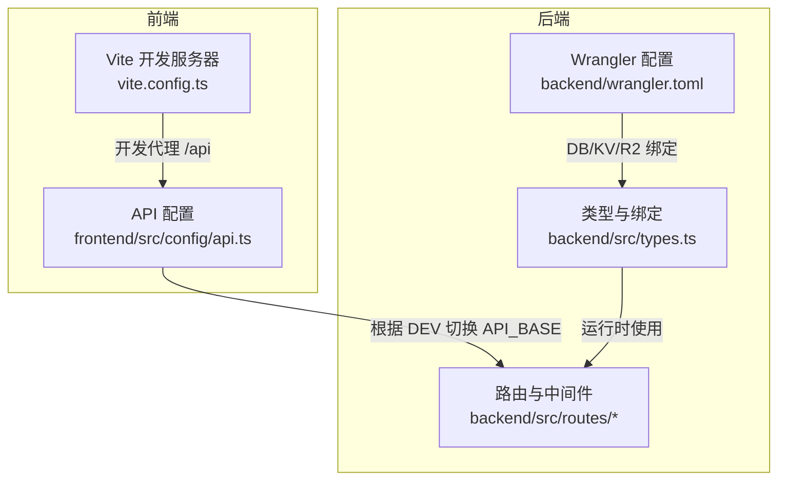
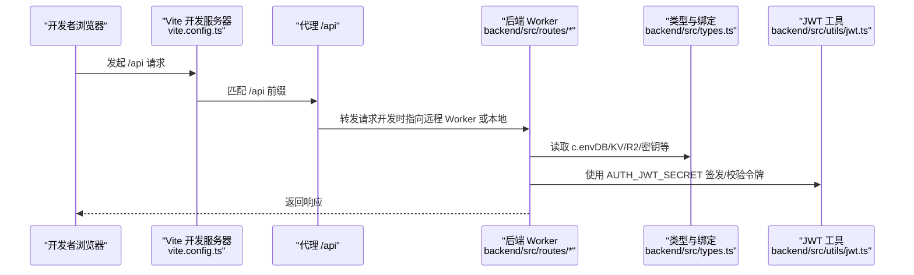
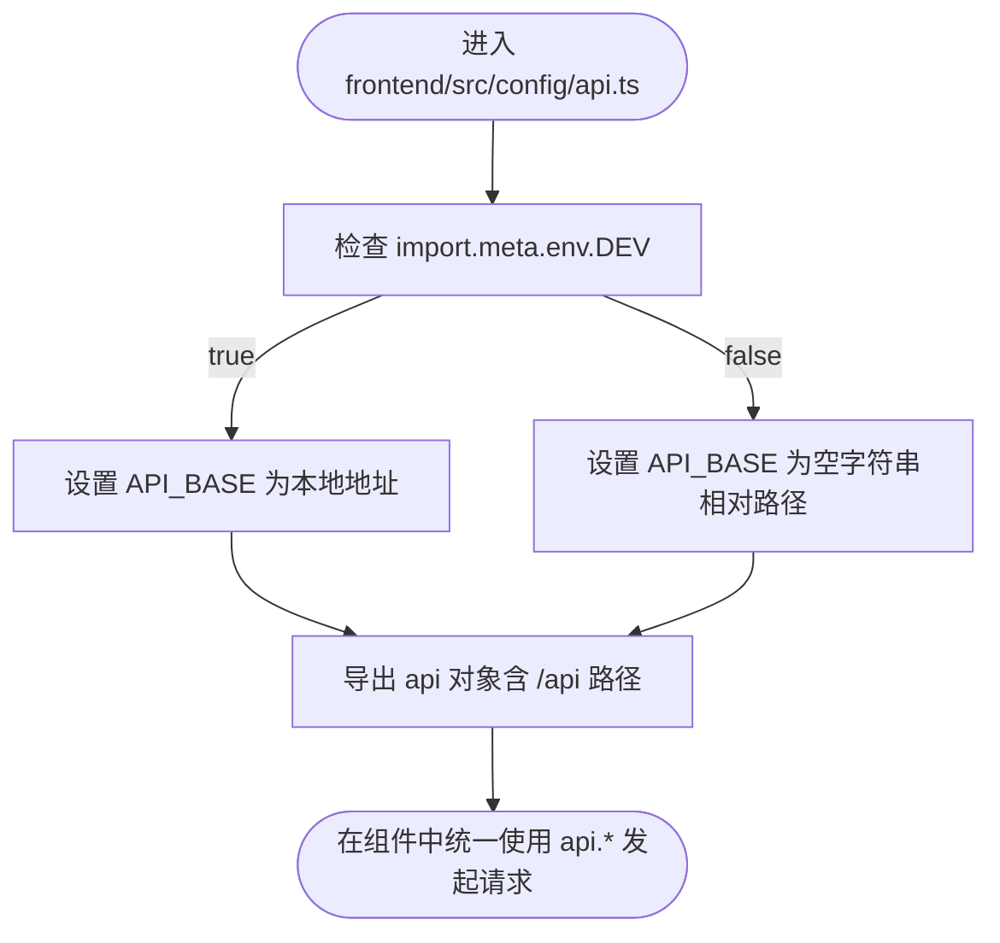
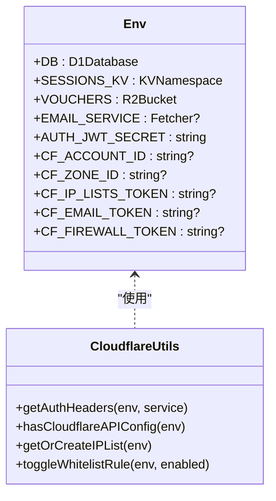
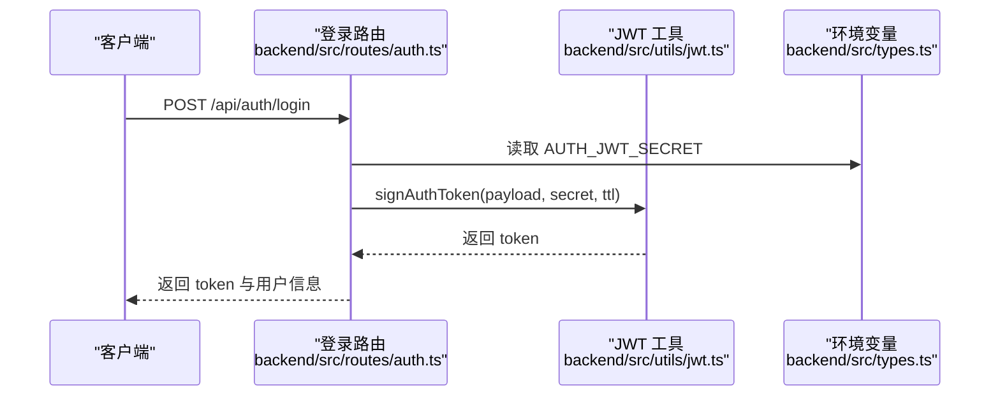
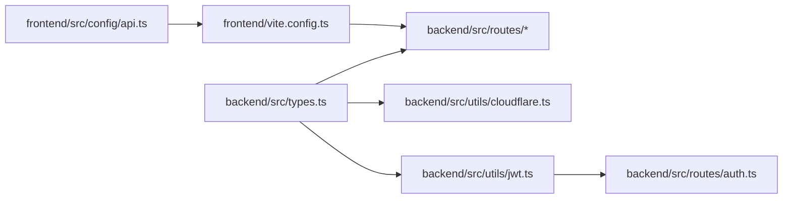

# 环境配置

<cite>
**本文引用的文件**
- [backend/wrangler.toml](file://backend/wrangler.toml)
- [frontend/vite.config.ts](file://frontend/vite.config.ts)
- [frontend/src/config/api.ts](file://frontend/src/config/api.ts)
- [backend/src/types.ts](file://backend/src/types.ts)
- [backend/src/utils/jwt.ts](file://backend/src/utils/jwt.ts)
- [backend/src/routes/auth.ts](file://backend/src/routes/auth.ts)
- [backend/src/utils/cloudflare.ts](file://backend/src/utils/cloudflare.ts)
- [backend/package.json](file://backend/package.json)
- [frontend/package.json](file://frontend/package.json)
</cite>

## 目录
1. [简介](#简介)
2. [项目结构](#项目结构)
3. [核心组件](#核心组件)
4. [架构总览](#架构总览)
5. [详细组件分析](#详细组件分析)
6. [依赖关系分析](#依赖关系分析)
7. [性能考量](#性能考量)
8. [故障排查指南](#故障排查指南)
9. [结论](#结论)
10. [附录](#附录)

## 简介
本文件系统化梳理 caiwu-main 项目的多环境配置策略，重点覆盖以下方面：
- 开发环境变量配置：wrangler.toml 中 [env.dev.vars] 的使用与最佳实践
- 生产环境敏感信息管理：通过 wrangler secret put 设置敏感变量（如 AUTH_JWT_SECRET）
- 前后端分离开发：前端 vite.config.ts 的 server.proxy 在开发阶段将 /api 请求代理至本地或远程后端
- 前端 API 地址动态切换：frontend/src/config/api.ts 基于 import.meta.env.DEV 的条件判断，确保开发与生产无缝衔接
- 后端资源绑定类型：backend/src/types.ts 中 Env 接口定义 D1Database、KVNamespace、R2Bucket 等 Cloudflare 资源绑定的使用方式
- 环境变量命名规范、敏感信息管理策略与环境切换最佳实践

## 项目结构
该项目采用前后端分离架构，分别在 backend 与 frontend 目录下维护各自的构建与运行配置。关键配置点如下：
- 后端：通过 Wrangler 在 Cloudflare Workers 上部署，wrangler.toml 定义数据库、存储与服务绑定，并区分 [env.dev.vars] 与生产密钥
- 前端：Vite 提供开发服务器与代理能力，vite.config.ts 将 /api 请求代理到后端；frontend/src/config/api.ts 动态决定 API_BASE

图表来源
- [frontend/vite.config.ts](file://frontend/vite.config.ts#L1-L48)
- [frontend/src/config/api.ts](file://frontend/src/config/api.ts#L1-L20)
- [backend/wrangler.toml](file://backend/wrangler.toml#L1-L45)
- [backend/src/types.ts](file://backend/src/types.ts#L1-L20)

章节来源
- [backend/wrangler.toml](file://backend/wrangler.toml#L1-L45)
- [frontend/vite.config.ts](file://frontend/vite.config.ts#L1-L48)
- [frontend/src/config/api.ts](file://frontend/src/config/api.ts#L1-L20)

## 核心组件
- 开发环境变量（wrangler.toml）
  - [env.dev.vars] 用于本地开发时注入敏感变量（例如 AUTH_JWT_SECRET），避免在仓库中暴露
  - 生产密钥通过 wrangler secret put 注入，不在配置文件中明文存放
- 前端代理与 API 基础地址
  - vite.config.ts 的 server.proxy 将 /api 请求代理到后端 Worker
  - frontend/src/config/api.ts 基于 import.meta.env.DEV 动态设置 API_BASE，开发时为本地地址，生产时为空字符串（相对路径）
- 后端资源绑定与类型约束
  - backend/src/types.ts 定义 Env 接口，声明 DB、SESSIONS_KV、VOUCHERS 等绑定类型
  - 后续业务通过 c.env 访问这些资源，保证类型安全与可维护性

章节来源
- [backend/wrangler.toml](file://backend/wrangler.toml#L42-L45)
- [frontend/vite.config.ts](file://frontend/vite.config.ts#L19-L26)
- [frontend/src/config/api.ts](file://frontend/src/config/api.ts#L1-L10)
- [backend/src/types.ts](file://backend/src/types.ts#L1-L18)

## 架构总览
下图展示开发与生产环境下，前端代理、API 基础地址、后端资源绑定与认证密钥之间的关系。

图表来源
- [frontend/vite.config.ts](file://frontend/vite.config.ts#L19-L26)
- [frontend/src/config/api.ts](file://frontend/src/config/api.ts#L1-L10)
- [backend/src/types.ts](file://backend/src/types.ts#L1-L18)
- [backend/src/utils/jwt.ts](file://backend/src/utils/jwt.ts#L1-L20)
- [backend/src/routes/auth.ts](file://backend/src/routes/auth.ts#L27-L40)

## 详细组件分析

### 开发环境变量与生产密钥管理（wrangler.toml）
- [env.dev.vars] 段落用于本地开发时注入敏感变量，如 AUTH_JWT_SECRET，便于本地联调
- 生产环境密钥通过命令行工具 wrangler secret put 注入，避免在仓库中泄露
- wrangler.toml 还定义了 D1 数据库、R2 存储桶、KV 命名空间等资源绑定，以及服务绑定（如 EMAIL_SERVICE）

建议
- 本地开发使用 [env.dev.vars] 注入临时密钥，禁止提交到版本控制
- 生产密钥通过 CI/CD 或手动执行 wrangler secret put 注入，确保最小权限原则
- 对于不同环境（如 staging、prod），可通过多环境配置文件或环境变量前缀进行区分

章节来源
- [backend/wrangler.toml](file://backend/wrangler.toml#L42-L45)
- [backend/wrangler.toml](file://backend/wrangler.toml#L1-L20)
- [backend/wrangler.toml](file://backend/wrangler.toml#L6-L18)

### 前端代理与 API 基础地址（vite.config.ts 与 api.ts）
- vite.config.ts 的 server.proxy 将 /api 请求代理到后端 Worker，支持本地联调与跨域场景
- frontend/src/config/api.ts 依据 import.meta.env.DEV 动态设置 API_BASE：
  - 开发环境：API_BASE 为本地地址，便于与本地或远程 Worker 通信
  - 生产环境：API_BASE 为空字符串，使用相对路径，由 Cloudflare Pages 内部转发到 Worker

建议
- 保持 /api 前缀一致性，便于代理与路由识别
- 生产环境尽量使用相对路径，减少硬编码后端地址带来的迁移成本

图表来源
- [frontend/src/config/api.ts](file://frontend/src/config/api.ts#L1-L10)

章节来源
- [frontend/vite.config.ts](file://frontend/vite.config.ts#L19-L26)
- [frontend/src/config/api.ts](file://frontend/src/config/api.ts#L1-L10)

### 后端资源绑定类型与使用（types.ts 与云服务集成）
- backend/src/types.ts 定义 Env 接口，包含：
  - D1Database（DB）
  - KVNamespace（SESSIONS_KV）
  - R2Bucket（VOUCHERS）
  - 可选的 Fetcher（EMAIL_SERVICE）、API Token（CF_*）、JWT 密钥（AUTH_JWT_SECRET）
- 业务层通过 c.env 访问上述资源，实现类型安全与可维护性
- 与 Cloudflare 服务交互的工具函数（如 IP 白名单、防火墙规则）同样依赖 Env 中的 Token 与账户信息

图表来源
- [backend/src/types.ts](file://backend/src/types.ts#L1-L18)
- [backend/src/utils/cloudflare.ts](file://backend/src/utils/cloudflare.ts#L1-L40)

章节来源
- [backend/src/types.ts](file://backend/src/types.ts#L1-L18)
- [backend/src/utils/cloudflare.ts](file://backend/src/utils/cloudflare.ts#L1-L40)

### 认证与密钥使用（jwt.ts 与 auth.ts）
- 后端使用 HMAC-SHA256 签发与校验 JWT，密钥来自 c.env.AUTH_JWT_SECRET
- 登录流程中签发令牌，后续中间件通过 verifyAuthToken 校验令牌有效性
- 该密钥在开发环境通过 [env.dev.vars] 注入，在生产环境通过 wrangler secret put 注入

图表来源
- [backend/src/routes/auth.ts](file://backend/src/routes/auth.ts#L27-L40)
- [backend/src/utils/jwt.ts](file://backend/src/utils/jwt.ts#L72-L90)
- [backend/src/types.ts](file://backend/src/types.ts#L17-L17)

章节来源
- [backend/src/utils/jwt.ts](file://backend/src/utils/jwt.ts#L72-L119)
- [backend/src/routes/auth.ts](file://backend/src/routes/auth.ts#L27-L40)
- [backend/src/types.ts](file://backend/src/types.ts#L17-L17)

## 依赖关系分析
- 前端依赖
  - vite.config.ts 的 server.proxy 依赖后端 Worker 的 /api 路由
  - frontend/src/config/api.ts 的 API_BASE 依赖 import.meta.env.DEV
- 后端依赖
  - backend/src/types.ts 的 Env 接口约束了资源绑定类型
  - 认证流程依赖 AUTH_JWT_SECRET，该密钥由 wrangler.toml 的 [env.dev.vars] 或生产密钥提供
  - 云服务集成依赖 CF_* Token 与账户信息

图表来源
- [frontend/src/config/api.ts](file://frontend/src/config/api.ts#L1-L10)
- [frontend/vite.config.ts](file://frontend/vite.config.ts#L19-L26)
- [backend/src/types.ts](file://backend/src/types.ts#L1-L18)
- [backend/src/utils/cloudflare.ts](file://backend/src/utils/cloudflare.ts#L1-L40)
- [backend/src/utils/jwt.ts](file://backend/src/utils/jwt.ts#L72-L90)
- [backend/src/routes/auth.ts](file://backend/src/routes/auth.ts#L27-L40)

章节来源
- [frontend/src/config/api.ts](file://frontend/src/config/api.ts#L1-L10)
- [frontend/vite.config.ts](file://frontend/vite.config.ts#L19-L26)
- [backend/src/types.ts](file://backend/src/types.ts#L1-L18)
- [backend/src/utils/cloudflare.ts](file://backend/src/utils/cloudflare.ts#L1-L40)
- [backend/src/utils/jwt.ts](file://backend/src/utils/jwt.ts#L72-L90)
- [backend/src/routes/auth.ts](file://backend/src/routes/auth.ts#L27-L40)

## 性能考量
- 前端代理仅在开发阶段生效，生产环境使用相对路径，减少一次代理层开销
- JWT 签发/校验为轻量计算，密钥长度与算法选择需平衡安全性与性能
- 云服务调用（如 IP 白名单）应避免频繁重复请求，必要时引入缓存与幂等处理

## 故障排查指南
常见问题与定位要点
- 开发环境无法访问 /api
  - 检查 vite.config.ts 的 server.proxy 是否正确指向后端 Worker
  - 确认 frontend/src/config/api.ts 的 API_BASE 在 DEV 下为本地地址
- 生产环境 API 404 或跨域
  - 确认生产环境 API_BASE 为空字符串，使用相对路径
  - 检查 Cloudflare Pages 与 Worker 的绑定关系
- 认证失败
  - 确认 AUTH_JWT_SECRET 在生产环境已通过 wrangler secret put 注入
  - 校验密钥长度与字符集，避免误传空值或特殊字符
- 云服务调用异常
  - 检查 CF_* Token 与账户信息是否完整
  - 关注 API 返回状态码与错误信息，按需调整权限范围

章节来源
- [frontend/vite.config.ts](file://frontend/vite.config.ts#L19-L26)
- [frontend/src/config/api.ts](file://frontend/src/config/api.ts#L1-L10)
- [backend/src/utils/jwt.ts](file://backend/src/utils/jwt.ts#L72-L119)
- [backend/src/utils/cloudflare.ts](file://backend/src/utils/cloudflare.ts#L1-L40)

## 结论
本项目通过明确的多环境配置策略实现了前后端分离开发与生产部署的平滑过渡：
- 开发环境使用 [env.dev.vars] 注入临时密钥，配合 vite 代理完成联调
- 生产环境通过 wrangler secret put 管理敏感信息，避免明文泄露
- 前端基于 import.meta.env.DEV 动态切换 API_BASE，确保开发与生产的无缝衔接
- 后端通过 Env 接口约束资源绑定类型，结合工具函数实现云服务集成与认证流程

## 附录

### 环境变量命名规范与敏感信息管理策略
- 命名规范
  - 通用变量：大写 + 下划线，如 CF_ACCOUNT_ID、CF_ZONE_ID
  - 敏感变量：以 AUTH_ 或 CF_* 前缀标识，便于审计与隔离
- 敏感信息管理
  - 开发：仅在本地临时使用 [env.dev.vars]，严禁提交到仓库
  - 生产：通过 wrangler secret put 注入，最小权限授权
- 环境切换最佳实践
  - 明确区分 dev/staging/prod 三类环境，使用独立的密钥与资源绑定
  - 在 CI/CD 中按环境注入对应密钥，避免硬编码
  - 对外暴露的前端仅使用相对路径，后端 Worker 作为唯一可信入口

章节来源
- [backend/wrangler.toml](file://backend/wrangler.toml#L42-L45)
- [backend/src/types.ts](file://backend/src/types.ts#L10-L18)
- [backend/src/utils/jwt.ts](file://backend/src/utils/jwt.ts#L72-L90)