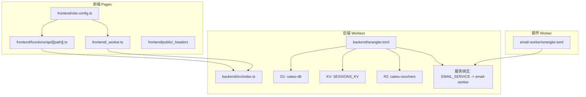
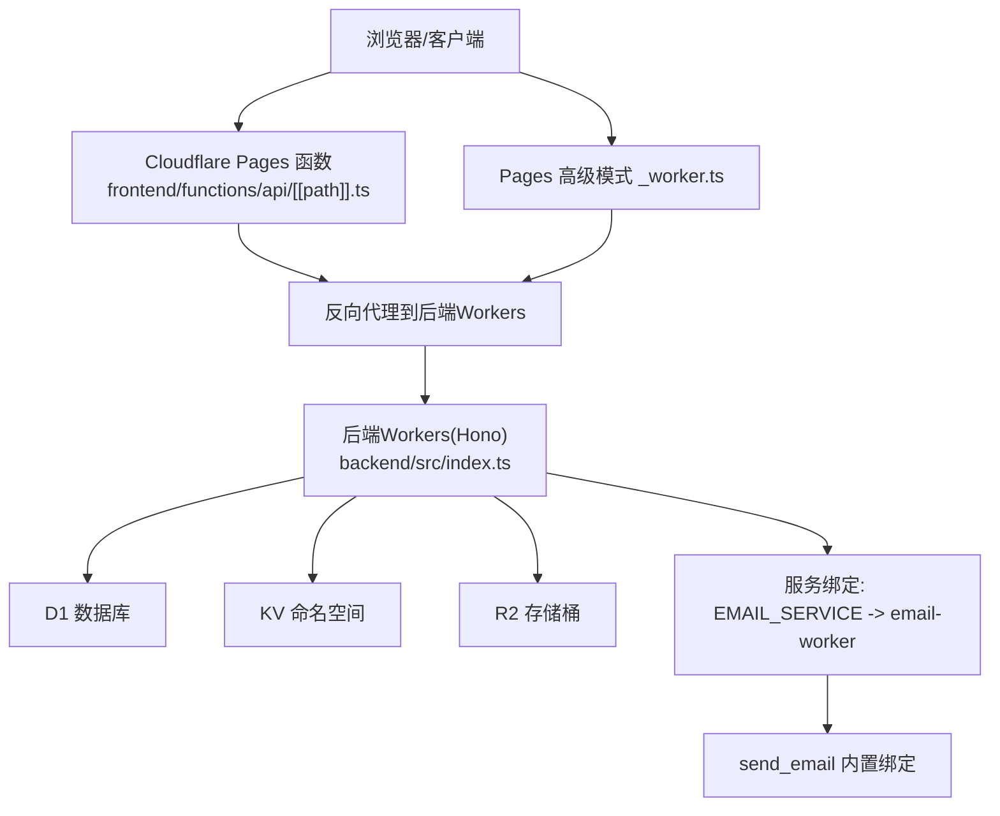
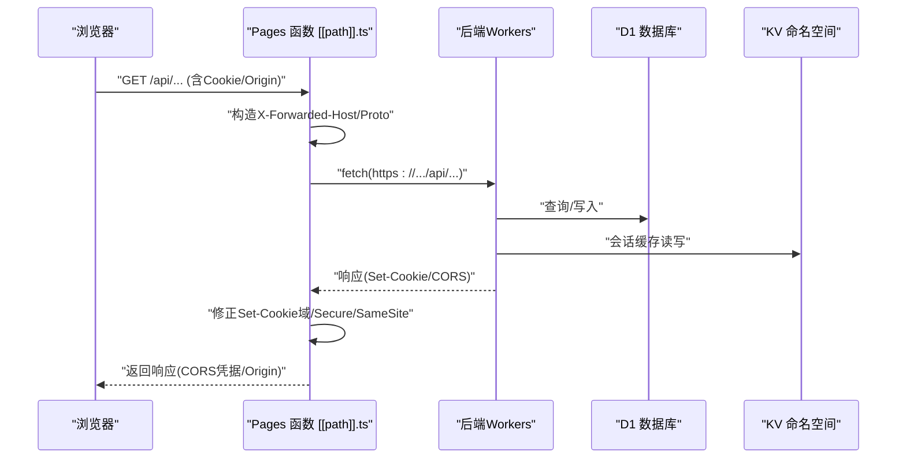
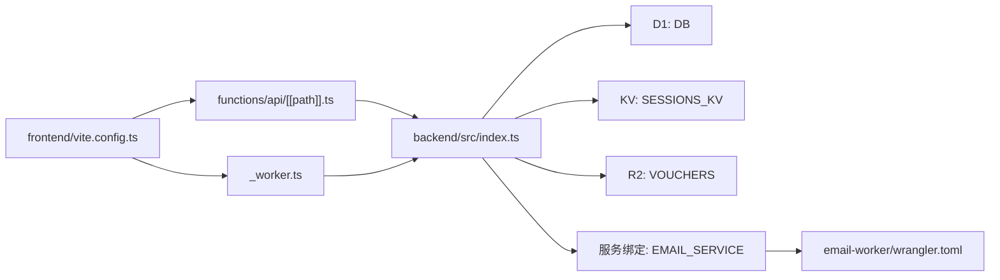

# 部署与基础设施

<cite>
**本文引用的文件**
- [backend/wrangler.toml](file://backend/wrangler.toml)
- [backend/drizzle.config.ts](file://backend/drizzle.config.ts)
- [backend/package.json](file://backend/package.json)
- [backend/src/index.ts](file://backend/src/index.ts)
- [backend/src/middleware.ts](file://backend/src/middleware.ts)
- [backend/src/config/paths.ts](file://backend/src/config/paths.ts)
- [backend/src/utils/cloudflare.ts](file://backend/src/utils/cloudflare.ts)
- [backend/src/utils/db.ts](file://backend/src/utils/db.ts)
- [frontend/vite.config.ts](file://frontend/vite.config.ts)
- [frontend/package.json](file://frontend/package.json)
- [frontend/functions/api/[[path]].ts](file://frontend/functions/api/[[path]].ts)
- [frontend/_worker.ts](file://frontend/_worker.ts)
- [frontend/public/_headers](file://frontend/public/_headers)
- [email-worker/wrangler.toml](file://email-worker/wrangler.toml)
- [backend/.cloudflare-tokens](file://backend/.cloudflare-tokens)
</cite>

## 目录
1. [简介](#简介)
2. [项目结构](#项目结构)
3. [核心组件](#核心组件)
4. [架构总览](#架构总览)
5. [详细组件分析](#详细组件分析)
6. [依赖关系分析](#依赖关系分析)
7. [性能考量](#性能考量)
8. [故障排查指南](#故障排查指南)
9. [结论](#结论)
10. [附录](#附录)

## 简介
本文件系统化说明“caiwu-main”在Cloudflare生态中的部署架构与运维实践，重点覆盖以下方面：
- Workers绑定资源（D1数据库、R2存储、KV命名空间）及环境隔离策略
- Vite构建配置对开发与生产的优化（代码分割、压缩、静态资源）
- Drizzle ORM迁移配置流程与安全发布
- Cloudflare Pages函数作为API网关的反向代理机制（统一前后端域名与CORS处理）
- .cloudflare-tokens中敏感凭证的管理规范与最小权限原则
- 部署脚本（wrangler deploy）的安全执行指南

## 项目结构
项目采用多包布局，分为后端Workers、前端Pages与独立邮件Worker三部分，分别通过各自的wrangler.toml进行Cloudflare资源绑定与环境变量配置。

图表来源
- [backend/wrangler.toml](file://backend/wrangler.toml#L1-L45)
- [backend/src/index.ts](file://backend/src/index.ts#L1-L137)
- [frontend/functions/api/[[path]].ts](file://frontend/functions/api/[[path]].#L1-L41)
- [frontend/_worker.ts](file://frontend/_worker.ts#L1-L71)
- [frontend/vite.config.ts](file://frontend/vite.config.ts#L1-L48)
- [frontend/public/_headers](file://frontend/public/_headers#L1-L4)
- [email-worker/wrangler.toml](file://email-worker/wrangler.toml#L1-L18)

章节来源
- [backend/wrangler.toml](file://backend/wrangler.toml#L1-L45)
- [frontend/vite.config.ts](file://frontend/vite.config.ts#L1-L48)
- [frontend/functions/api/[[path]].ts](file://frontend/functions/api/[[path]].#L1-L41)
- [frontend/_worker.ts](file://frontend/_worker.ts#L1-L71)
- [email-worker/wrangler.toml](file://email-worker/wrangler.toml#L1-L18)

## 核心组件
- 后端Workers（Hono应用）：负责API路由、鉴权中间件、健康检查、OpenAPI文档与Swagger UI。
- 前端Pages函数与高级模式_worker：提供统一的API反向代理，处理CORS与Cookie域与SameSite修正。
- Drizzle ORM：SQLite方言，配合drizzle-kit生成迁移与模式。
- Cloudflare资源绑定：D1、R2、KV命名空间；服务绑定指向email-worker。
- 邮件Worker：内置send_email绑定，支持通过后端服务调用。

章节来源
- [backend/src/index.ts](file://backend/src/index.ts#L1-L137)
- [backend/src/middleware.ts](file://backend/src/middleware.ts#L1-L82)
- [backend/src/utils/db.ts](file://backend/src/utils/db.ts#L1-L200)
- [backend/drizzle.config.ts](file://backend/drizzle.config.ts#L1-L8)
- [email-worker/wrangler.toml](file://email-worker/wrangler.toml#L1-L18)

## 架构总览
整体架构围绕“前端Pages函数/高级模式代理 + 后端Workers + Cloudflare资源”的组合展开。前端通过Pages函数或高级模式_worker将/api/*请求转发至后端Workers，后端Workers通过D1数据库、KV会话缓存与R2存储提供业务能力，并通过服务绑定调用邮件Worker。

图表来源
- [frontend/functions/api/[[path]].ts](file://frontend/functions/api/[[path]].#L1-L41)
- [frontend/_worker.ts](file://frontend/_worker.ts#L1-L71)
- [backend/src/index.ts](file://backend/src/index.ts#L1-L137)
- [backend/wrangler.toml](file://backend/wrangler.toml#L1-L45)
- [email-worker/wrangler.toml](file://email-worker/wrangler.toml#L1-L18)

## 详细组件分析

### 后端Workers（Hono应用）与资源绑定
- 绑定资源
  - D1数据库：DB（绑定名），数据库名称与ID在配置中声明。
  - R2存储：VOUCHERS（绑定名），桶名为caiwu-vouchers。
  - KV命名空间：SESSIONS_KV（绑定名），ID在配置中声明。
  - 服务绑定：EMAIL_SERVICE，指向email-worker的production环境。
  - 变量：CF_ACCOUNT_ID、CF_ZONE_ID、CF_IP_LIST_ID等。
- 环境隔离
  - 生产密钥通过Cloudflare Secrets注入（JWT密钥示例注释）。
  - 开发环境vars提供示例JWT密钥，仅用于本地测试。
- CORS与鉴权
  - 全局CORS中间件限制允许的前端域名与localhost等。
  - 鉴权中间件支持Cookie/JWT/Bearer头部，结合KV缓存与D1回退。
- 健康检查与版本
  - /api/health快速查询D1可用性并带超时保护。
  - /api/version返回版本信息。
- OpenAPI与Swagger UI
  - 提供/api/doc与/api/ui，便于联调与文档化。

章节来源
- [backend/wrangler.toml](file://backend/wrangler.toml#L1-L45)
- [backend/src/index.ts](file://backend/src/index.ts#L1-L137)
- [backend/src/middleware.ts](file://backend/src/middleware.ts#L1-L82)
- [backend/src/config/paths.ts](file://backend/src/config/paths.ts#L1-L23)

### Vite构建配置（前端）
- 压缩插件
  - 同时启用gzip与brotliCompress压缩，提升传输效率。
- 代理
  - 本地开发代理到后端Workers地址，便于前后端联调。
- 代码分割
  - 通过manualChunks将React生态、Ant Design、第三方库拆分，优化缓存与加载性能。
- 测试与构建
  - 测试环境配置与构建输出目录outDir。
- 安全头
  - public/_headers设置CSP与connect-src，限制资源来源与连接域。

章节来源
- [frontend/vite.config.ts](file://frontend/vite.config.ts#L1-L48)
- [frontend/public/_headers](file://frontend/public/_headers#L1-L4)

### Drizzle ORM迁移配置与发布流程
- 方言与Schema
  - drizzle.config.ts指定sqlite方言、schema路径与输出目录。
- 迁移脚本
  - backend/package.json提供migrate、migrate:all、migrate:remote等脚本，支持本地SQL与远程D1执行。
- 发布建议
  - 使用migrate:remote逐个文件执行，遇到冲突或已应用的文件会跳过，保证幂等与安全发布。

章节来源
- [backend/drizzle.config.ts](file://backend/drizzle.config.ts#L1-L8)
- [backend/package.json](file://backend/package.json#L1-L43)

### Cloudflare Pages函数反向代理（API网关）
- 功能概述
  - 将/api/*请求转发至后端Workers，同时修正X-Forwarded-*头，处理Set-Cookie域与SameSite/Lax，以及CORS凭据与Origin。
- 关键点
  - 通过X-Forwarded-Host与X-Forwarded-Proto传递原始主机与协议。
  - 对Set-Cookie进行域清理与Secure/SameSite修正，确保跨子域与凭据传输安全。
  - 若响应包含Origin，则将Access-Control-Allow-Origin设为该值，配合Access-Control-Allow-Credentials:true。

图表来源
- [frontend/functions/api/[[path]].ts](file://frontend/functions/api/[[path]].#L1-L41)
- [backend/src/middleware.ts](file://backend/src/middleware.ts#L1-L82)
- [backend/src/index.ts](file://backend/src/index.ts#L1-L137)

章节来源
- [frontend/functions/api/[[path]].ts](file://frontend/functions/api/[[path]].#L1-L41)

### Pages高级模式_worker（替代方案）
- 与Pages函数类似，但以高级模式实现，同样处理/api/*代理、CORS与Cookie修正。
- 静态资源由env.ASSETS.fetch提供，非/api/*请求走静态资源。

章节来源
- [frontend/_worker.ts](file://frontend/_worker.ts#L1-L71)

### 邮件Worker与服务绑定
- email-worker/wrangler.toml声明send_email内置绑定与EMAIL_FROM变量。
- backend/wrangler.toml通过[[services]]将EMAIL_SERVICE绑定到email-worker production环境。
- 邮件相关Token建议通过wrangler secret注入，避免明文。

章节来源
- [email-worker/wrangler.toml](file://email-worker/wrangler.toml#L1-L18)
- [backend/wrangler.toml](file://backend/wrangler.toml#L1-L45)

### 敏感凭证管理与最小权限原则（.cloudflare-tokens）
- 用途
  - 记录不同Cloudflare服务的API Token，区分“代码使用的Token”与“CLI工具使用的Token”两类。
- 最小权限
  - IP白名单管理、邮箱路由、防火墙规则分别使用专用Token，避免授予全局权限。
- CLI使用
  - 通过环境变量CLOUDFLARE_API_TOKEN执行wrangler命令，支持部署与日志读取。
- 安全建议
  - 仅在CI或受控环境中使用，避免提交至版本控制；定期轮换。

章节来源
- [backend/.cloudflare-tokens](file://backend/.cloudflare-tokens#L1-L39)

### 部署脚本与安全执行指南
- 后端部署
  - 使用wrangler deploy（或backend/package.json中的deploy脚本）。
  - 生产密钥通过wrangler secret put注入（如AUTH_JWT_SECRET）。
- 前端部署
  - 使用Pages托管，静态资源由public/_headers约束CSP与connect-src。
- 安全执行
  - 优先使用环境变量CLOUDFLARE_API_TOKEN执行wrangler命令，避免硬编码。
  - 在CI中使用只读Token进行日志读取，使用写入Token进行部署。

章节来源
- [backend/package.json](file://backend/package.json#L1-L43)
- [backend/wrangler.toml](file://backend/wrangler.toml#L1-L45)
- [frontend/public/_headers](file://frontend/public/_headers#L1-L4)
- [backend/.cloudflare-tokens](file://backend/.cloudflare-tokens#L1-L39)

## 依赖关系分析
- 后端Workers依赖
  - D1数据库（DB）、KV命名空间（SESSIONS_KV）、R2存储（VOUCHERS）、服务绑定（EMAIL_SERVICE）。
  - 鉴权中间件依赖JWT密钥（生产通过Secret注入）。
- 前端依赖
  - 通过Pages函数或高级模式_worker代理/api/*到后端Workers。
  - Vite插件与压缩策略影响构建产物体积与加载性能。
- 邮件Worker依赖
  - send_email内置绑定与EMAIL_FROM变量，通过服务绑定被后端调用。

图表来源
- [frontend/vite.config.ts](file://frontend/vite.config.ts#L1-L48)
- [frontend/functions/api/[[path]].ts](file://frontend/functions/api/[[path]].#L1-L41)
- [frontend/_worker.ts](file://frontend/_worker.ts#L1-L71)
- [backend/src/index.ts](file://backend/src/index.ts#L1-L137)
- [backend/wrangler.toml](file://backend/wrangler.toml#L1-L45)
- [email-worker/wrangler.toml](file://email-worker/wrangler.toml#L1-L18)

章节来源
- [backend/wrangler.toml](file://backend/wrangler.toml#L1-L45)
- [backend/src/index.ts](file://backend/src/index.ts#L1-L137)
- [frontend/vite.config.ts](file://frontend/vite.config.ts#L1-L48)

## 性能考量
- 代码分割
  - 通过manualChunks将React、Ant Design与第三方库拆分，减少首屏体积并提升缓存命中率。
- 压缩
  - gzip与brotli双重压缩，显著降低传输体积。
- 会话缓存
  - 鉴权中间件优先从KV获取会话，未命中时回退D1并异步写回KV，降低数据库压力。
- 健康检查
  - /api/health使用快速查询与超时保护，避免慢查询影响探活。

章节来源
- [frontend/vite.config.ts](file://frontend/vite.config.ts#L1-L48)
- [backend/src/middleware.ts](file://backend/src/middleware.ts#L1-L82)
- [backend/src/index.ts](file://backend/src/index.ts#L1-L137)

## 故障排查指南
- CORS与Cookie问题
  - 确认Pages函数/高级模式_worker正确设置X-Forwarded-Host/Proto与CORS凭据头。
  - 检查Set-Cookie域与SameSite修正逻辑是否生效。
- 鉴权失败
  - 确认JWT密钥已通过Secret注入（生产环境）。
  - 检查SESSIONS_KV是否可读写，必要时清理异常会话。
- 数据库连通性
  - 使用/api/health快速验证D1可用性，关注超时与错误日志。
- 邮件发送
  - 确认EMAIL_SERVICE绑定正确，email-worker的send_email与EMAIL_FROM配置无误。
  - 检查EMAIL_TOKEN是否通过Secret注入。

章节来源
- [frontend/functions/api/[[path]].ts](file://frontend/functions/api/[[path]].#L1-L41)
- [frontend/_worker.ts](file://frontend/_worker.ts#L1-L71)
- [backend/src/middleware.ts](file://backend/src/middleware.ts#L1-L82)
- [backend/src/index.ts](file://backend/src/index.ts#L1-L137)
- [email-worker/wrangler.toml](file://email-worker/wrangler.toml#L1-L18)

## 结论
本项目在Cloudflare生态中实现了清晰的前后端分离与资源绑定，通过Pages函数/高级模式_worker提供统一的API网关与CORS处理，后端Workers利用D1、KV与R2实现业务数据与会话缓存，Drizzle ORM保障数据库模式变更的可控发布。配合最小权限的Token管理与安全的部署流程，整体具备良好的可维护性与安全性。

## 附录
- 术语
  - D1：Cloudflare提供的SQLite数据库
  - R2：Cloudflare提供的对象存储
  - KV：Cloudflare提供的键值存储
  - Pages函数：Cloudflare Pages的边缘函数
  - 服务绑定：Workers之间的服务间调用绑定
- 参考
  - 后端Workers配置与资源绑定：[backend/wrangler.toml](file://backend/wrangler.toml#L1-L45)
  - 前端构建与代理：[frontend/vite.config.ts](file://frontend/vite.config.ts#L1-L48)
  - Drizzle配置与迁移脚本：[backend/drizzle.config.ts](file://backend/drizzle.config.ts#L1-L8)、[backend/package.json](file://backend/package.json#L1-L43)
  - API网关反向代理：[frontend/functions/api/[[path]].ts](file://frontend/functions/api/[[path]].#L1-L41)、[frontend/_worker.ts](file://frontend/_worker.ts#L1-L71)
  - 邮件Worker与服务绑定：[email-worker/wrangler.toml](file://email-worker/wrangler.toml#L1-L18)、[backend/wrangler.toml](file://backend/wrangler.toml#L1-L45)
  - 凭证管理与最小权限：[backend/.cloudflare-tokens](file://backend/.cloudflare-tokens#L1-L39)