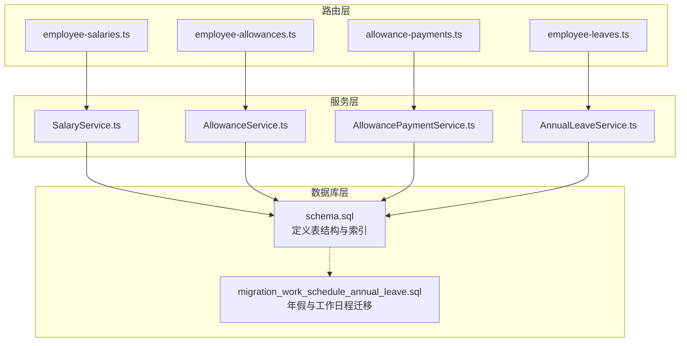
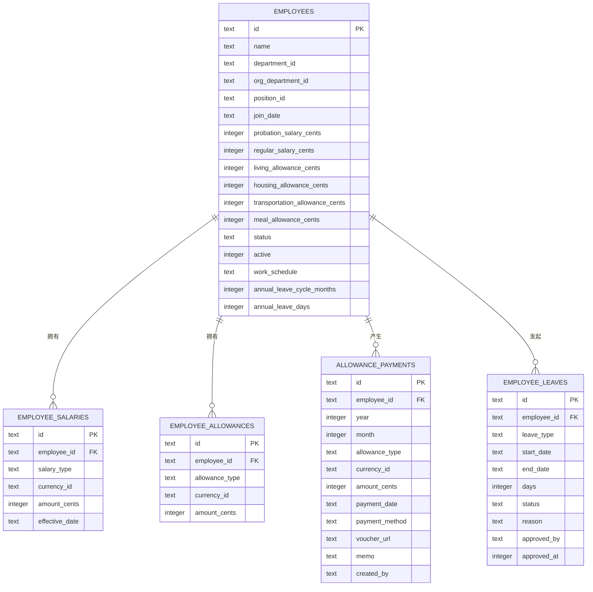
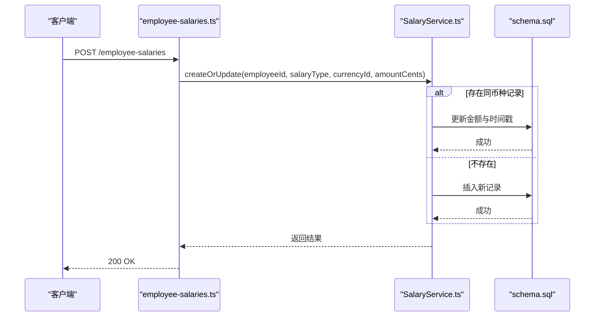
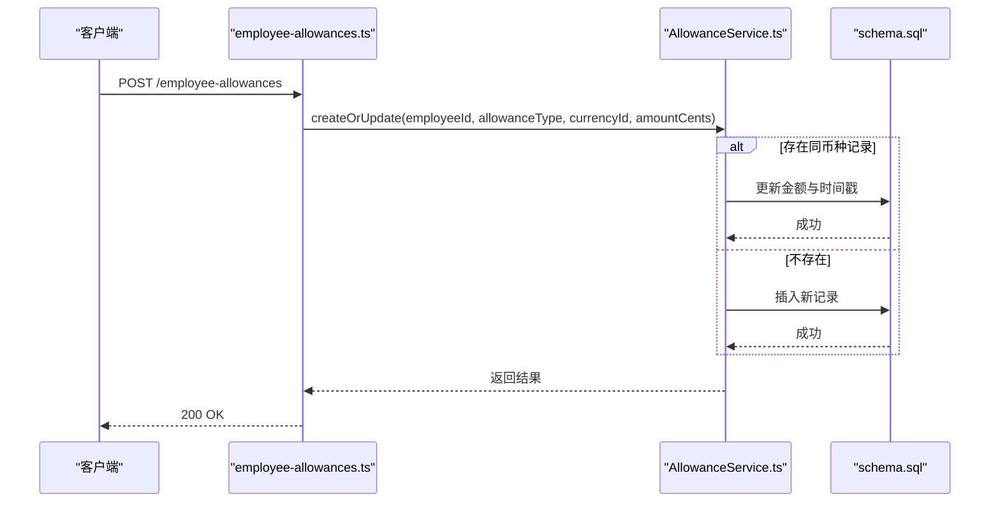
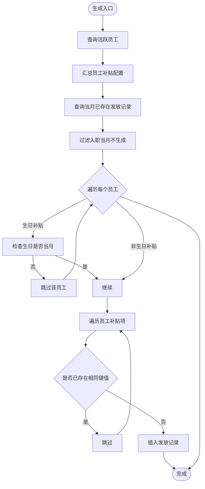
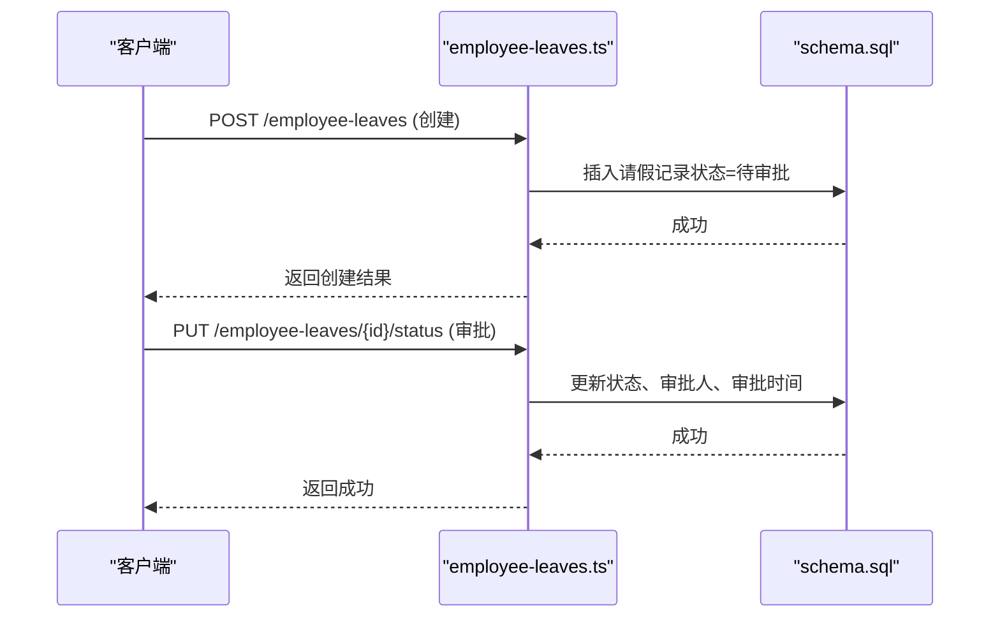
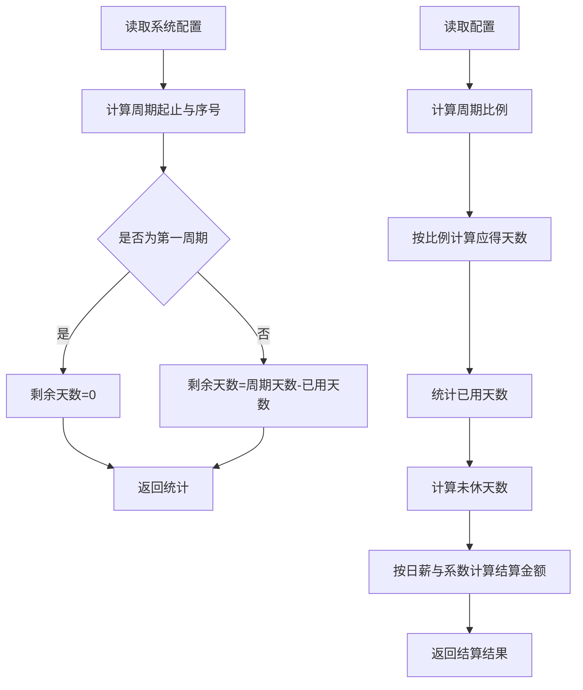
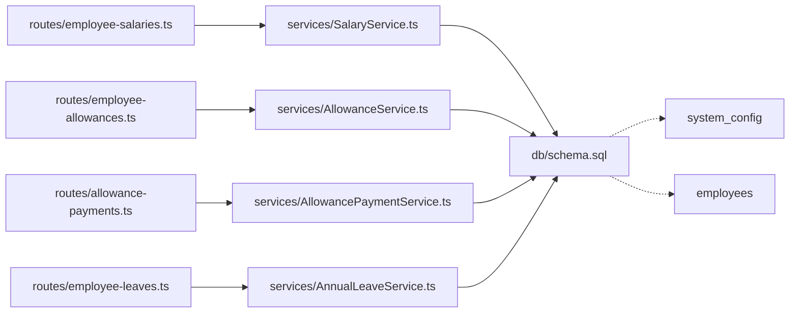

# 人力资源数据模型

<cite>
**本文引用的文件列表**
- [schema.sql](file://backend/src/db/schema.sql)
- [migration_work_schedule_annual_leave.sql](file://backend/src/db/archive/migration_work_schedule_annual_leave.sql)
- [employee-salaries.ts](file://backend/src/routes/employee-salaries.ts)
- [employee-allowances.ts](file://backend/src/routes/employee-allowances.ts)
- [allowance-payments.ts](file://backend/src/routes/allowance-payments.ts)
- [employee-leaves.ts](file://backend/src/routes/employee-leaves.ts)
- [SalaryService.ts](file://backend/src/services/SalaryService.ts)
- [AllowanceService.ts](file://backend/src/services/AllowanceService.ts)
- [AllowancePaymentService.ts](file://backend/src/services/AllowancePaymentService.ts)
- [AnnualLeaveService.ts](file://backend/src/services/AnnualLeaveService.ts)
- [employee.schema.ts](file://backend/src/schemas/employee.schema.ts)
- [employees.ts](file://backend/src/routes/employees.ts)
</cite>

## 目录
1. [简介](#简介)
2. [项目结构](#项目结构)
3. [核心组件](#核心组件)
4. [架构总览](#架构总览)
5. [详细组件分析](#详细组件分析)
6. [依赖关系分析](#依赖关系分析)
7. [性能考量](#性能考量)
8. [故障排查指南](#故障排查指南)
9. [结论](#结论)
10. [附录](#附录)

## 简介
本文件面向HR功能开发者，系统性梳理仓库中的人力资源核心数据模型，重点覆盖以下表结构与关联：
- 员工薪资（employee_salaries）：区分试用期与正式期，支持多币种记录与批量更新。
- 员工补贴（employee_allowances）：按类型维护补贴额度，支持多币种。
- 补贴发放（allowance_payments）：按年/月/员工/类型/币种生成与核对发放记录。
- 员工请假（employee_leaves）：支持年假、病假、事假等类型，含状态流转与审批字段。
- 年假周期与工作日程：通过迁移脚本引入工作日程字段，并在服务层实现年假周期计算与结算。

本文件同时结合迁移文件，阐述年假周期、工作日程等复杂业务规则在数据库层面的落地方式，并提供数据操作的完整视图。

## 项目结构
后端采用“路由-服务-数据库”分层设计，核心HR数据模型由schema.sql定义，路由层负责API契约与权限校验，服务层封装业务逻辑，迁移脚本负责演进式变更。

图表来源
- [employee-salaries.ts](file://backend/src/routes/employee-salaries.ts#L1-L251)
- [employee-allowances.ts](file://backend/src/routes/employee-allowances.ts#L1-L245)
- [allowance-payments.ts](file://backend/src/routes/allowance-payments.ts#L1-L367)
- [employee-leaves.ts](file://backend/src/routes/employee-leaves.ts#L1-L210)
- [SalaryService.ts](file://backend/src/services/SalaryService.ts#L1-L140)
- [AllowanceService.ts](file://backend/src/services/AllowanceService.ts#L1-L140)
- [AllowancePaymentService.ts](file://backend/src/services/AllowancePaymentService.ts#L1-L189)
- [AnnualLeaveService.ts](file://backend/src/services/AnnualLeaveService.ts#L1-L221)
- [schema.sql](file://backend/src/db/schema.sql#L202-L256)
- [migration_work_schedule_annual_leave.sql](file://backend/src/db/archive/migration_work_schedule_annual_leave.sql#L1-L11)

章节来源
- [schema.sql](file://backend/src/db/schema.sql#L202-L256)
- [migration_work_schedule_annual_leave.sql](file://backend/src/db/archive/migration_work_schedule_annual_leave.sql#L1-L11)
- [employee-salaries.ts](file://backend/src/routes/employee-salaries.ts#L1-L251)
- [employee-allowances.ts](file://backend/src/routes/employee-allowances.ts#L1-L245)
- [allowance-payments.ts](file://backend/src/routes/allowance-payments.ts#L1-L367)
- [employee-leaves.ts](file://backend/src/routes/employee-leaves.ts#L1-L210)

## 核心组件
- 员工薪资（employee_salaries）
  - 字段要点：员工ID、薪资类型（试用期/正式）、币种、金额（分）、生效日期、审计字段。
  - 路由能力：查询、创建/更新（同币种去重）、批量更新、删除。
  - 服务逻辑：按员工+类型查询；同类型下按币种去重；批量删除旧记录后重建。
- 员工补贴（employee_allowances）
  - 字段要点：员工ID、补贴类型（生活/住房/交通/餐补等）、币种、金额（分）、审计字段。
  - 路由能力：查询、创建/更新（同币种去重）、批量更新、删除。
  - 服务逻辑：按员工+类型查询；同类型下按币种去重；批量删除旧记录后重建。
- 补贴发放（allowance_payments）
  - 字段要点：员工ID、年、月、补贴类型、币种、金额（分）、发放日期、付款方式、凭证、备注、经办人、审计字段。
  - 路由能力：查询、生成（基于员工与补贴配置）、创建、更新、删除。
  - 服务逻辑：生成时按年/月过滤已存在记录，跳过重复；生日补贴仅在生日当月发放；入职当月不生成。
- 员工请假（employee_leaves）
  - 字段要点：员工ID、请假类型、起止日期、天数、状态、原因、审批人/时间、审计字段。
  - 路由能力：查询、创建、审批状态更新。
  - 服务逻辑：按类型、状态、时间范围过滤；审批时写入审批人与审批时间。

章节来源
- [schema.sql](file://backend/src/db/schema.sql#L202-L256)
- [employee-salaries.ts](file://backend/src/routes/employee-salaries.ts#L1-L251)
- [employee-allowances.ts](file://backend/src/routes/employee-allowances.ts#L1-L245)
- [allowance-payments.ts](file://backend/src/routes/allowance-payments.ts#L1-L367)
- [employee-leaves.ts](file://backend/src/routes/employee-leaves.ts#L1-L210)
- [SalaryService.ts](file://backend/src/services/SalaryService.ts#L1-L140)
- [AllowanceService.ts](file://backend/src/services/AllowanceService.ts#L1-L140)
- [AllowancePaymentService.ts](file://backend/src/services/AllowancePaymentService.ts#L1-L189)
- [AnnualLeaveService.ts](file://backend/src/services/AnnualLeaveService.ts#L1-L221)

## 架构总览
下图展示HR相关表之间的关系与关键业务流程。

图表来源
- [schema.sql](file://backend/src/db/schema.sql#L202-L256)

## 详细组件分析

### 员工薪资（employee_salaries）
- 数据模型要点
  - 试用期与正式期通过salary_type区分，支持多币种并存。
  - 生效日期用于历史追溯与合规管理。
- 路由行为
  - 列表：支持按员工与类型过滤。
  - 创建/更新：同类型+同币种自动去重，避免重复记录。
  - 批量更新：先清空该员工该类型的所有记录，再按新清单重建。
  - 删除：软删除返回被删除记录。
- 服务逻辑
  - 查询联结币种与员工姓名，便于前端展示。
  - 批量更新严格校验币种存在性，失败时抛出异常。

图表来源
- [employee-salaries.ts](file://backend/src/routes/employee-salaries.ts#L90-L154)
- [SalaryService.ts](file://backend/src/services/SalaryService.ts#L29-L83)
- [schema.sql](file://backend/src/db/schema.sql#L202-L212)

章节来源
- [schema.sql](file://backend/src/db/schema.sql#L202-L212)
- [employee-salaries.ts](file://backend/src/routes/employee-salaries.ts#L45-L154)
- [SalaryService.ts](file://backend/src/services/SalaryService.ts#L1-L140)

### 员工补贴（employee_allowances）
- 数据模型要点
  - 补贴类型涵盖生活、住房、交通、餐补等，支持多币种。
- 路由行为
  - 列表：支持按员工与类型过滤。
  - 创建/更新：同类型+同币种自动去重。
  - 批量更新：先清空该员工该类型的所有记录，再按新清单重建。
- 服务逻辑
  - 查询联结币种与员工姓名，便于前端展示。
  - 批量更新严格校验币种存在性，失败时抛出异常。

图表来源
- [employee-allowances.ts](file://backend/src/routes/employee-allowances.ts#L86-L149)
- [AllowanceService.ts](file://backend/src/services/AllowanceService.ts#L29-L83)
- [schema.sql](file://backend/src/db/schema.sql#L214-L222)

章节来源
- [schema.sql](file://backend/src/db/schema.sql#L214-L222)
- [employee-allowances.ts](file://backend/src/routes/employee-allowances.ts#L43-L149)
- [AllowanceService.ts](file://backend/src/services/AllowanceService.ts#L1-L140)

### 补贴发放（allowance_payments）
- 数据模型要点
  - 按年/月/员工/类型/币种唯一，避免重复发放。
  - 发放日期、付款方式、凭证URL、经办人等字段支撑财务归档。
- 路由行为
  - 列表：支持按年、月、员工、类型过滤。
  - 生成：基于活跃员工与补贴配置自动生成，跳过重复与入职当月。
  - 生日补贴：仅在生日当月生成。
  - 创建/更新/删除：标准CRUD。
- 服务逻辑
  - 生成算法：
    - 过滤活跃员工；
    - 汇总员工补贴配置；
    - 排除已存在的年/月组合；
    - 入职当月不生成；
    - 生日补贴仅当月匹配；
    - 写入经办人与时间戳。
  - 创建前校验重复，避免重复记录。

图表来源
- [allowance-payments.ts](file://backend/src/routes/allowance-payments.ts#L138-L189)
- [AllowancePaymentService.ts](file://backend/src/services/AllowancePaymentService.ts#L122-L188)
- [schema.sql](file://backend/src/db/schema.sql#L224-L239)

章节来源
- [schema.sql](file://backend/src/db/schema.sql#L224-L239)
- [allowance-payments.ts](file://backend/src/routes/allowance-payments.ts#L63-L189)
- [AllowancePaymentService.ts](file://backend/src/services/AllowancePaymentService.ts#L1-L189)

### 员工请假（employee_leaves）
- 数据模型要点
  - 类型：年假、病假、事假、其他。
  - 状态：待审批、已通过、已驳回。
  - 审批：记录审批人与审批时间。
- 路由行为
  - 列表：支持按员工与状态过滤。
  - 创建：默认状态为待审批。
  - 审批：更新状态并写入审批人与审批时间。
- 服务逻辑
  - 查询联结员工姓名，便于前端展示。
  - 审批时仅在状态变更时写入审批字段。

图表来源
- [employee-leaves.ts](file://backend/src/routes/employee-leaves.ts#L106-L209)
- [schema.sql](file://backend/src/db/schema.sql#L241-L256)

章节来源
- [schema.sql](file://backend/src/db/schema.sql#L241-L256)
- [employee-leaves.ts](file://backend/src/routes/employee-leaves.ts#L1-L210)

### 年假周期与工作日程（迁移与服务）
- 迁移脚本
  - 引入员工工作日程字段，默认JSON格式，支持每天工作时间段与周末设置。
  - 引入系统配置项：年假周期月数、每周期年假天数、未休年假折算系数。
- 年假服务
  - 配置读取：从系统配置表读取年假周期、天数与折算系数。
  - 周期计算：根据入职日期与目标日期计算当前周期起止、周期序号、周期内工作天数。
  - 统计与校验：统计本周期应得、已用、剩余天数；校验申请是否超限。
  - 离职结算：按比例计算应得年假与未休天数，结合日薪与折算系数计算结算金额。

图表来源
- [migration_work_schedule_annual_leave.sql](file://backend/src/db/archive/migration_work_schedule_annual_leave.sql#L1-L11)
- [AnnualLeaveService.ts](file://backend/src/services/AnnualLeaveService.ts#L43-L221)
- [schema.sql](file://backend/src/db/schema.sql#L202-L256)

章节来源
- [migration_work_schedule_annual_leave.sql](file://backend/src/db/archive/migration_work_schedule_annual_leave.sql#L1-L11)
- [AnnualLeaveService.ts](file://backend/src/services/AnnualLeaveService.ts#L1-L221)
- [schema.sql](file://backend/src/db/schema.sql#L202-L256)

## 依赖关系分析
- 路由到服务
  - 薪资路由调用SalaryService，补贴路由调用AllowanceService，发放路由调用AllowancePaymentService，请假路由直接操作数据库。
- 服务到数据库
  - 所有服务均通过Drizzle ORM访问schema.sql定义的表。
- 外部依赖
  - 系统配置表system_config用于年假参数存储。
  - 员工表employees承载工作日程与年假配置字段。

图表来源
- [employee-salaries.ts](file://backend/src/routes/employee-salaries.ts#L1-L251)
- [employee-allowances.ts](file://backend/src/routes/employee-allowances.ts#L1-L245)
- [allowance-payments.ts](file://backend/src/routes/allowance-payments.ts#L1-L367)
- [employee-leaves.ts](file://backend/src/routes/employee-leaves.ts#L1-L210)
- [SalaryService.ts](file://backend/src/services/SalaryService.ts#L1-L140)
- [AllowanceService.ts](file://backend/src/services/AllowanceService.ts#L1-L140)
- [AllowancePaymentService.ts](file://backend/src/services/AllowancePaymentService.ts#L1-L189)
- [AnnualLeaveService.ts](file://backend/src/services/AnnualLeaveService.ts#L1-L221)
- [schema.sql](file://backend/src/db/schema.sql#L202-L256)

章节来源
- [schema.sql](file://backend/src/db/schema.sql#L202-L256)
- [employee-salaries.ts](file://backend/src/routes/employee-salaries.ts#L1-L251)
- [employee-allowances.ts](file://backend/src/routes/employee-allowances.ts#L1-L245)
- [allowance-payments.ts](file://backend/src/routes/allowance-payments.ts#L1-L367)
- [employee-leaves.ts](file://backend/src/routes/employee-leaves.ts#L1-L210)
- [SalaryService.ts](file://backend/src/services/SalaryService.ts#L1-L140)
- [AllowanceService.ts](file://backend/src/services/AllowanceService.ts#L1-L140)
- [AllowancePaymentService.ts](file://backend/src/services/AllowancePaymentService.ts#L1-L189)
- [AnnualLeaveService.ts](file://backend/src/services/AnnualLeaveService.ts#L1-L221)

## 性能考量
- 索引建议
  - 对employee_salaries(employee_id, salary_type, currency_id)建立复合索引，加速按员工+类型+币种查询与去重。
  - 对employee_allowances(employee_id, allowance_type, currency_id)建立复合索引，加速补贴查询与去重。
  - 对allowance_payments(year, month, employee_id, allowance_type, currency_id)建立复合索引，加速生成与查询。
  - 对employee_leaves(employee_id, status, start_date)建立复合索引，加速请假查询与审批。
- 批量操作
  - 批量更新薪资/补贴时，先删除旧记录再批量插入，避免重复与脏数据。
- 生成策略
  - 生成发放记录时，先查询当月已存在记录集合，使用集合快速去重，减少重复插入。

[本节为通用性能建议，不直接分析具体文件]

## 故障排查指南
- 重复发放
  - 现象：生成发放记录时报重复。
  - 排查：确认allowance_payments的唯一键组合是否正确；检查生成逻辑是否正确过滤入职当月与重复键。
  - 参考路径
    - [AllowancePaymentService.ts](file://backend/src/services/AllowancePaymentService.ts#L53-L64)
    - [allowance-payments.ts](file://backend/src/routes/allowance-payments.ts#L138-L189)
- 申请超限
  - 现象：年假申请被拒绝或提示剩余不足。
  - 排查：确认系统配置的年假周期与天数；检查AnnualLeaveService的统计与校验逻辑。
  - 参考路径
    - [AnnualLeaveService.ts](file://backend/src/services/AnnualLeaveService.ts#L121-L221)
    - [migration_work_schedule_annual_leave.sql](file://backend/src/db/archive/migration_work_schedule_annual_leave.sql#L4-L11)
- 生日补贴未发放
  - 现象：生日当月未生成生日补贴。
  - 排查：确认员工birthday字段与当月匹配；检查生成逻辑中的生日条件。
  - 参考路径
    - [AllowancePaymentService.ts](file://backend/src/services/AllowancePaymentService.ts#L158-L162)
- 权限错误
  - 现象：接口返回禁止访问。
  - 排查：确认路由中权限校验是否满足；检查用户岗位与权限位。
  - 参考路径
    - [employee-salaries.ts](file://backend/src/routes/employee-salaries.ts#L117-L120)
    - [employee-allowances.ts](file://backend/src/routes/employee-allowances.ts#L113-L116)
    - [allowance-payments.ts](file://backend/src/routes/allowance-payments.ts#L168-L170)

章节来源
- [AllowancePaymentService.ts](file://backend/src/services/AllowancePaymentService.ts#L53-L64)
- [AnnualLeaveService.ts](file://backend/src/services/AnnualLeaveService.ts#L121-L221)
- [migration_work_schedule_annual_leave.sql](file://backend/src/db/archive/migration_work_schedule_annual_leave.sql#L4-L11)
- [employee-salaries.ts](file://backend/src/routes/employee-salaries.ts#L117-L120)
- [employee-allowances.ts](file://backend/src/routes/employee-allowances.ts#L113-L116)
- [allowance-payments.ts](file://backend/src/routes/allowance-payments.ts#L168-L170)

## 结论
本数据模型围绕“员工—薪资/补贴—发放—请假—年假周期”的主线构建，既满足多币种与多类型场景，又通过服务层实现生成、校验与结算的闭环。迁移脚本将工作日程与年假参数纳入系统配置，使业务规则在数据库层面清晰可追溯。开发者在扩展HR功能时，应遵循现有路由与服务边界，确保数据一致性与合规性。

[本节为总结性内容，不直接分析具体文件]

## 附录
- 关键字段与类型
  - 员工表（employees）：工作日程（work_schedule）、年假周期（annual_leave_cycle_months）、年假天数（annual_leave_days）。
  - 薪资表（employee_salaries）：salary_type（probation/regular）、currency_id、amount_cents。
  - 补贴表（employee_allowances）：allowance_type（living/housing/transportation/meal/birthday等）、currency_id、amount_cents。
  - 发放表（allowance_payments）：year、month、allowance_type、currency_id、amount_cents、payment_date、payment_method、voucher_url、memo、created_by。
  - 请假表（employee_leaves）：leave_type（annual/sick/personal/other）、start_date、end_date、days、status（pending/approved/rejected）、approved_by、approved_at。
- 建议的索引
  - employee_salaries(employee_id, salary_type, currency_id)
  - employee_allowances(employee_id, allowance_type, currency_id)
  - allowance_payments(year, month, employee_id, allowance_type, currency_id)
  - employee_leaves(employee_id, status, start_date)

章节来源
- [schema.sql](file://backend/src/db/schema.sql#L202-L256)
- [migration_work_schedule_annual_leave.sql](file://backend/src/db/archive/migration_work_schedule_annual_leave.sql#L1-L11)
- [employee.schema.ts](file://backend/src/schemas/employee.schema.ts#L1-L121)
- [employees.ts](file://backend/src/routes/employees.ts#L1-L200)