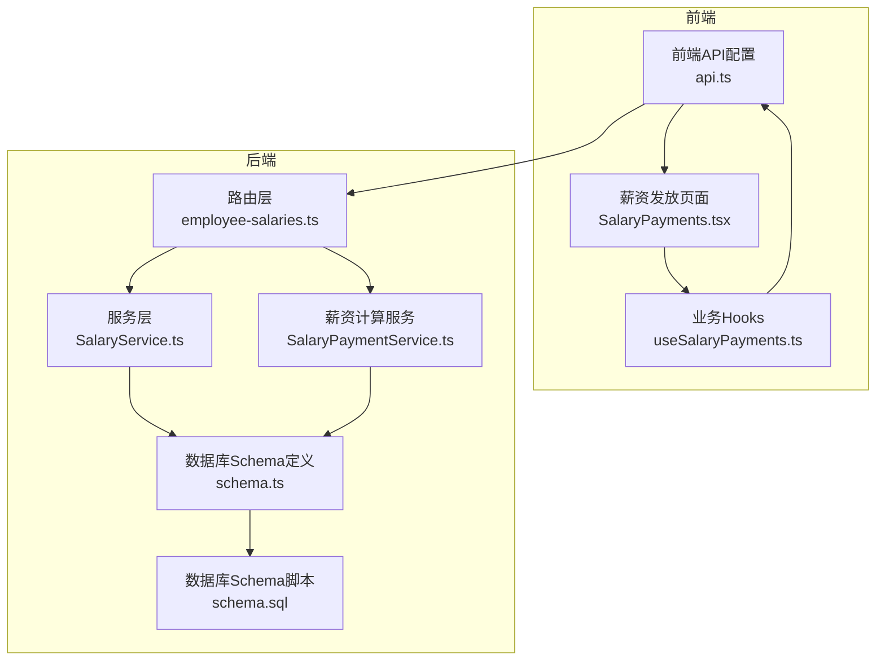
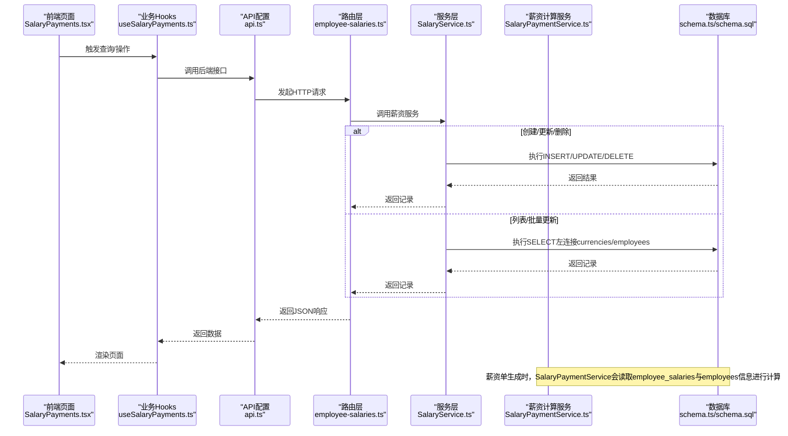
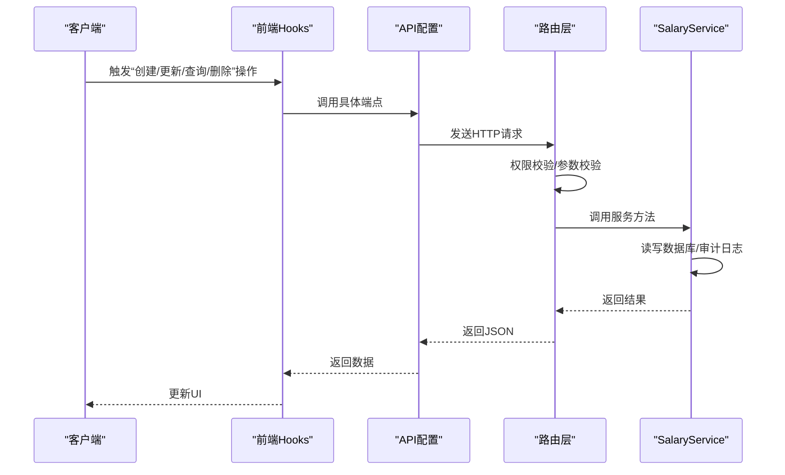
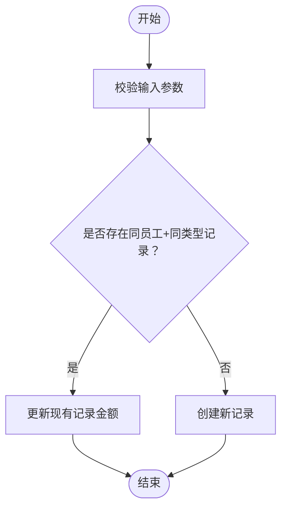
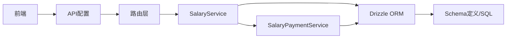
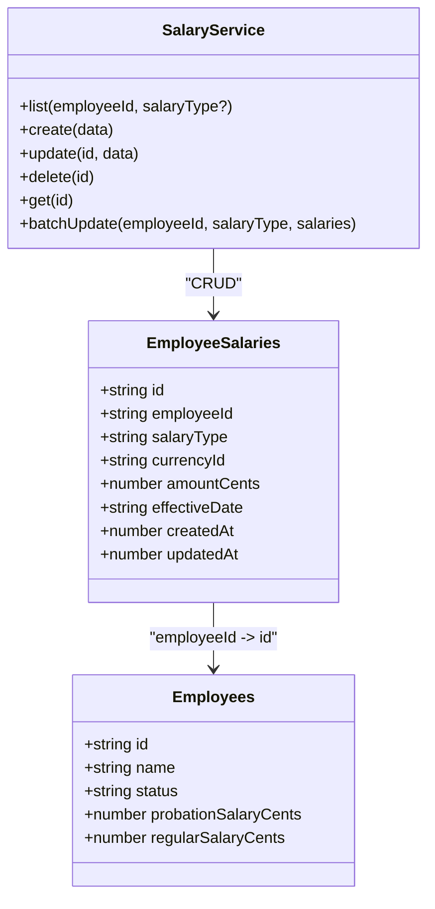

# 员工薪资数据模型

<cite>
**本文引用的文件**
- [backend/src/routes/employee-salaries.ts](file://backend/src/routes/employee-salaries.ts)
- [backend/src/services/SalaryService.ts](file://backend/src/services/SalaryService.ts)
- [backend/src/db/schema.ts](file://backend/src/db/schema.ts)
- [backend/src/db/schema.sql](file://backend/src/db/schema.sql)
- [backend/src/services/SalaryPaymentService.ts](file://backend/src/services/SalaryPaymentService.ts)
- [frontend/src/config/api.ts](file://frontend/src/config/api.ts)
- [frontend/src/features/hr/pages/SalaryPayments.tsx](file://frontend/src/features/hr/pages/SalaryPayments.tsx)
- [frontend/src/hooks/business/useSalaryPayments.ts](file://frontend/src/hooks/business/useSalaryPayments.ts)
- [backend/test/routes/employee-salaries.test.ts](file://backend/test/routes/employee-salaries.test.ts)
</cite>

## 目录
1. [简介](#简介)
2. [项目结构](#项目结构)
3. [核心组件](#核心组件)
4. [架构总览](#架构总览)
5. [详细组件分析](#详细组件分析)
6. [依赖分析](#依赖分析)
7. [性能考虑](#性能考虑)
8. [故障排查指南](#故障排查指南)
9. [结论](#结论)
10. [附录](#附录)

## 简介
本文件面向HR功能开发者，系统性梳理“员工薪资数据模型”，聚焦 employee_salaries 表的结构与业务逻辑，明确试用期（salary_type='probation'）与正式期（salary_type='regular'）薪资的区分机制，以及 effective_date 生效日期字段的设计意图。文档同时阐明该表与 employees 主表的关联关系，并给出在薪资计算服务（SalaryService）中的使用方式；结合API定义，说明薪资记录的创建、更新与查询操作流程，帮助开发者高效完成数据操作与集成。

## 项目结构
围绕员工薪资数据模型的关键文件分布如下：
- 后端路由层：处理HTTP请求与响应，定义OpenAPI Schema，调用服务层。
- 服务层：封装数据库操作，负责业务规则与事务控制。
- 数据库层：定义表结构与索引，确保数据一致性与查询效率。
- 前端：提供HR页面与Hooks，对接后端API，驱动薪资发放流程。

图表来源
- [backend/src/routes/employee-salaries.ts](file://backend/src/routes/employee-salaries.ts#L1-L251)
- [backend/src/services/SalaryService.ts](file://backend/src/services/SalaryService.ts#L1-L140)
- [backend/src/services/SalaryPaymentService.ts](file://backend/src/services/SalaryPaymentService.ts#L70-L166)
- [backend/src/db/schema.ts](file://backend/src/db/schema.ts#L1-L644)
- [backend/src/db/schema.sql](file://backend/src/db/schema.sql#L1-L662)
- [frontend/src/config/api.ts](file://frontend/src/config/api.ts#L1-L179)
- [frontend/src/features/hr/pages/SalaryPayments.tsx](file://frontend/src/features/hr/pages/SalaryPayments.tsx#L1-L690)
- [frontend/src/hooks/business/useSalaryPayments.ts](file://frontend/src/hooks/business/useSalaryPayments.ts#L1-L155)

章节来源
- [backend/src/routes/employee-salaries.ts](file://backend/src/routes/employee-salaries.ts#L1-L251)
- [backend/src/services/SalaryService.ts](file://backend/src/services/SalaryService.ts#L1-L140)
- [backend/src/db/schema.ts](file://backend/src/db/schema.ts#L1-L644)
- [backend/src/db/schema.sql](file://backend/src/db/schema.sql#L1-L662)
- [frontend/src/config/api.ts](file://frontend/src/config/api.ts#L1-L179)
- [frontend/src/features/hr/pages/SalaryPayments.tsx](file://frontend/src/features/hr/pages/SalaryPayments.tsx#L1-L690)
- [frontend/src/hooks/business/useSalaryPayments.ts](file://frontend/src/hooks/business/useSalaryPayments.ts#L1-L155)

## 核心组件
- 表结构与字段
  - employee_salaries：存储员工多币种薪资记录，支持按试用期/正式期区分，支持生效日期字段。
  - employees：员工主表，包含基础信息与历史薪资字段（如 probation_salary_cents、regular_salary_cents），用于薪资计算参考。
- 服务层职责
  - SalaryService：提供薪资记录的增删改查、批量更新等能力，内部进行权限校验与审计日志记录。
  - SalaryPaymentService：负责根据员工状态与当月工作天数计算应发薪资，生成薪资单。
- 路由层职责
  - 提供REST接口：列表、创建、批量更新、删除；对敏感操作进行权限校验与审计记录。
- 前端集成
  - 通过Hooks与API配置，调用后端接口，驱动HR页面的薪资管理流程。

章节来源
- [backend/src/db/schema.ts](file://backend/src/db/schema.ts#L202-L212)
- [backend/src/db/schema.ts](file://backend/src/db/schema.ts#L26-L56)
- [backend/src/services/SalaryService.ts](file://backend/src/services/SalaryService.ts#L1-L140)
- [backend/src/services/SalaryPaymentService.ts](file://backend/src/services/SalaryPaymentService.ts#L70-L166)
- [backend/src/routes/employee-salaries.ts](file://backend/src/routes/employee-salaries.ts#L1-L251)
- [frontend/src/config/api.ts](file://frontend/src/config/api.ts#L84-L118)

## 架构总览
下图展示从前端到后端再到数据库的整体交互，重点标注了薪资记录与员工主表的关联关系，以及薪资计算服务的参与。

图表来源
- [frontend/src/features/hr/pages/SalaryPayments.tsx](file://frontend/src/features/hr/pages/SalaryPayments.tsx#L1-L690)
- [frontend/src/hooks/business/useSalaryPayments.ts](file://frontend/src/hooks/business/useSalaryPayments.ts#L1-L155)
- [frontend/src/config/api.ts](file://frontend/src/config/api.ts#L84-L118)
- [backend/src/routes/employee-salaries.ts](file://backend/src/routes/employee-salaries.ts#L1-L251)
- [backend/src/services/SalaryService.ts](file://backend/src/services/SalaryService.ts#L1-L140)
- [backend/src/services/SalaryPaymentService.ts](file://backend/src/services/SalaryPaymentService.ts#L70-L166)
- [backend/src/db/schema.ts](file://backend/src/db/schema.ts#L1-L644)

## 详细组件分析

### 表结构与字段设计
- employee_salaries
  - 关键字段：id、employeeId、salaryType（枚举：probation/regular）、currencyId、amountCents、effectiveDate、createdAt、updatedAt。
  - 设计要点：
    - 多币种支持：同一员工在同一类型下可有多条记录，分别对应不同币种。
    - 生效日期：effectiveDate用于标识该记录自何时生效，便于历史追溯与合规审计。
    - 类型区分：salaryType将试用期与正式期薪资隔离，避免混淆。
- employees
  - 历史薪资字段：probation_salary_cents、regular_salary_cents，作为薪资单生成时的默认值来源之一。
  - 状态字段：status用于判断员工当前处于试用期还是正式期，影响薪资类型选择。

章节来源
- [backend/src/db/schema.ts](file://backend/src/db/schema.ts#L202-L212)
- [backend/src/db/schema.ts](file://backend/src/db/schema.ts#L26-L56)
- [backend/src/db/schema.sql](file://backend/src/db/schema.sql#L202-L212)

### 试用期与正式期薪资区分机制
- 区分依据
  - 优先级1：employee_salaries 中按 salary_type 分组的记录。
  - 优先级2：若无匹配记录，则回退到 employees.status 决定 salary_type，并使用 employees.probation_salary_cents 或 employees.regular_salary_cents 作为默认值。
- 实现位置
  - 薪资单生成逻辑中，会先按员工ID与salary_type聚合 employee_salaries 记录，若存在则取其amountCents；否则根据员工状态选择默认薪资字段。

章节来源
- [backend/src/services/SalaryPaymentService.ts](file://backend/src/services/SalaryPaymentService.ts#L70-L166)

### effective_date 生效日期设计
- 字段含义
  - effectiveDate用于标识某条薪资记录的生效时间，便于：
    - 历史版本对比与审计；
    - 合规要求的生效时间追溯；
    - 与其他系统（如薪酬发放、税务）的时间节点对齐。
- 使用建议
  - 在创建或更新薪资记录时，若涉及未来生效，应设置合理的生效日期；
  - 若未设置，则默认以当前时间或记录创建时间为准。

章节来源
- [backend/src/db/schema.ts](file://backend/src/db/schema.ts#L202-L212)

### 与 employees 主表的关联关系
- 关联方式
  - employee_salaries.employeeId -> employees.id。
  - 路由层在查询时通过LEFT JOIN获取员工姓名与币种名称，便于前端展示。
- 作用
  - 将员工基本信息与薪资记录解耦，保证数据一致性与可扩展性。

章节来源
- [backend/src/routes/employee-salaries.ts](file://backend/src/routes/employee-salaries.ts#L1-L251)
- [backend/src/services/SalaryService.ts](file://backend/src/services/SalaryService.ts#L1-L140)

### 薪资计算服务（SalaryService）中的使用方式
- 查询
  - 支持按 employeeId 与 salaryType 过滤，返回带员工名与币种名的结果集。
- 创建/更新
  - 创建新记录或基于现有记录更新金额；更新时记录updatedAt。
- 删除
  - 按id删除，返回被删除记录。
- 批量更新
  - 先删除指定员工与类型的全部记录，再插入新的多币种组合，确保唯一性与一致性。

章节来源
- [backend/src/services/SalaryService.ts](file://backend/src/services/SalaryService.ts#L1-L140)

### API定义与操作流程
- 接口清单（后端路由层）
  - GET /api/employee-salaries：查询员工薪资列表（支持 employeeId 与 salaryType 过滤）。
  - POST /api/employee-salaries：创建或更新薪资记录（若同员工同币种已存在则更新）。
  - PUT /api/employee-salaries/batch：批量更新薪资记录（按员工+类型全量替换）。
  - DELETE /api/employee-salaries/{id}：删除薪资记录。
- 权限与审计
  - 创建/更新需具备 hr:salary:create/update 权限；操作均记录审计日志。
- 前端集成
  - 前端通过 api.ts 中的 employeeSalaries、employeeSalariesBatch、employeeSalariesById 等端点进行调用。
  - 页面 SalaryPayments.tsx 与 Hooks useSalaryPayments.ts 驱动查询与操作。

图表来源
- [backend/src/routes/employee-salaries.ts](file://backend/src/routes/employee-salaries.ts#L1-L251)
- [frontend/src/config/api.ts](file://frontend/src/config/api.ts#L84-L118)
- [frontend/src/hooks/business/useSalaryPayments.ts](file://frontend/src/hooks/business/useSalaryPayments.ts#L1-L155)

章节来源
- [backend/src/routes/employee-salaries.ts](file://backend/src/routes/employee-salaries.ts#L1-L251)
- [frontend/src/config/api.ts](file://frontend/src/config/api.ts#L84-L118)
- [frontend/src/hooks/business/useSalaryPayments.ts](file://frontend/src/hooks/business/useSalaryPayments.ts#L1-L155)

### 复杂逻辑流程：批量更新薪资

图表来源
- [backend/src/routes/employee-salaries.ts](file://backend/src/routes/employee-salaries.ts#L116-L154)

章节来源
- [backend/src/routes/employee-salaries.ts](file://backend/src/routes/employee-salaries.ts#L116-L154)

### 薪资单生成与薪资记录的关系
- 薪资单（salary_payments）生成时，会读取 employee_salaries 与 employees 的信息：
  - 若存在按 salary_type 分组的多币种记录，则优先使用这些记录的amountCents；
  - 否则回退到 employees.probation_salary_cents 或 employees.regular_salary_cents。
- 该逻辑确保薪资单生成与员工薪资记录保持一致，避免重复或遗漏。

章节来源
- [backend/src/services/SalaryPaymentService.ts](file://backend/src/services/SalaryPaymentService.ts#L70-L166)

## 依赖分析
- 组件耦合
  - 路由层依赖服务层；服务层依赖数据库Schema；前端依赖API配置与路由层。
- 外部依赖
  - Drizzle ORM用于数据库访问与类型安全。
  - 前端React Query用于缓存与异步请求管理。
- 潜在风险
  - 若 employees 与 employee_salaries 的字段不一致，可能导致薪资单生成偏差。
  - 权限校验缺失可能引发越权操作。

图表来源
- [frontend/src/config/api.ts](file://frontend/src/config/api.ts#L84-L118)
- [backend/src/routes/employee-salaries.ts](file://backend/src/routes/employee-salaries.ts#L1-L251)
- [backend/src/services/SalaryService.ts](file://backend/src/services/SalaryService.ts#L1-L140)
- [backend/src/services/SalaryPaymentService.ts](file://backend/src/services/SalaryPaymentService.ts#L70-L166)
- [backend/src/db/schema.ts](file://backend/src/db/schema.ts#L1-L644)

章节来源
- [backend/src/services/SalaryService.ts](file://backend/src/services/SalaryService.ts#L1-L140)
- [backend/src/services/SalaryPaymentService.ts](file://backend/src/services/SalaryPaymentService.ts#L70-L166)
- [backend/src/db/schema.ts](file://backend/src/db/schema.ts#L1-L644)

## 性能考虑
- 索引建议
  - employee_salaries.employeeId + salaryType 组合索引，提升按员工与类型过滤的查询性能。
  - 建议在 schema.sql 中补充相应索引，以减少大表扫描。
- 批量更新策略
  - 批量更新采用“先删后插”的方式，确保幂等与一致性；建议在高并发场景下配合事务与锁策略，避免脏写。
- 前端缓存
  - 使用React Query的staleTime与invalidate策略，减少重复请求，提升交互体验。

[本节为通用指导，无需列出章节来源]

## 故障排查指南
- 常见问题
  - 权限不足：创建/更新接口需要 hr:salary:create/update 权限，否则返回禁止访问。
  - 未找到记录：删除接口在找不到目标记录时返回未找到错误。
  - 参数校验失败：路由层对请求体进行OpenAPI Schema校验，不符合规范将返回错误。
- 测试参考
  - 单元测试覆盖了列表、创建、批量更新与删除的基本行为，可作为回归测试的基准。

章节来源
- [backend/src/routes/employee-salaries.ts](file://backend/src/routes/employee-salaries.ts#L116-L154)
- [backend/test/routes/employee-salaries.test.ts](file://backend/test/routes/employee-salaries.test.ts#L1-L156)

## 结论
employee_salaries 表通过 salary_type 与 effective_date 字段，清晰地区分试用期与正式期薪资，并支持多币种记录与生效时间追溯。结合 SalaryService 的查询、创建、更新与批量更新能力，以及 SalaryPaymentService 的薪资单生成逻辑，形成了从数据模型到业务流程的完整闭环。前端通过API配置与Hooks与后端紧密协作，保障HR薪资管理的准确性与效率。

[本节为总结性内容，无需列出章节来源]

## 附录

### API端点一览（后端）
- GET /api/employee-salaries
  - 查询条件：employeeId（必填）、salaryType（可选）
  - 返回：薪资记录列表（含员工名、币种名）
- POST /api/employee-salaries
  - 请求体：employeeId、salaryType、currencyId、amountCents
  - 行为：若同员工同币种已存在则更新，否则创建
- PUT /api/employee-salaries/batch
  - 请求体：employeeId、salaryType、salaries（数组，每项含currencyId、amountCents）
  - 行为：按员工+类型全量替换
- DELETE /api/employee-salaries/{id}
  - 行为：删除指定薪资记录

章节来源
- [backend/src/routes/employee-salaries.ts](file://backend/src/routes/employee-salaries.ts#L1-L251)
- [frontend/src/config/api.ts](file://frontend/src/config/api.ts#L84-L118)

### 数据模型类图（代码映射）

图表来源
- [backend/src/db/schema.ts](file://backend/src/db/schema.ts#L202-L212)
- [backend/src/db/schema.ts](file://backend/src/db/schema.ts#L26-L56)
- [backend/src/services/SalaryService.ts](file://backend/src/services/SalaryService.ts#L1-L140)