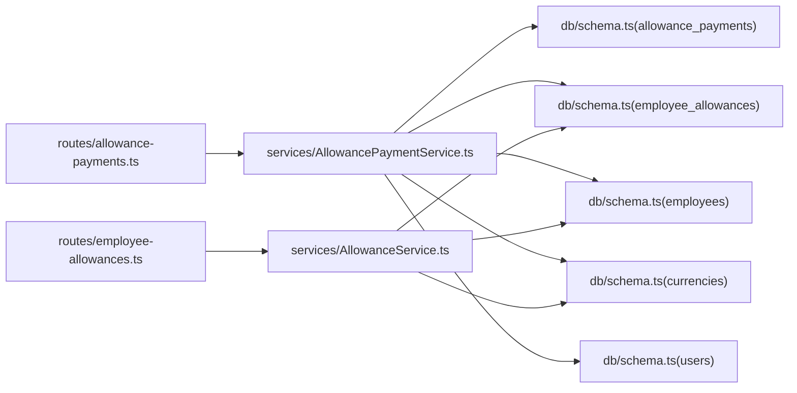

# 员工补贴数据模型

<cite>
**本文引用的文件列表**
- [backend/src/db/schema.ts](file://backend/src/db/schema.ts)
- [backend/src/db/schema.sql](file://backend/src/db/schema.sql)
- [backend/src/routes/allowance-payments.ts](file://backend/src/routes/allowance-payments.ts)
- [backend/src/services/AllowancePaymentService.ts](file://backend/src/services/AllowancePaymentService.ts)
- [backend/src/services/AllowanceService.ts](file://backend/src/services/AllowanceService.ts)
- [backend/src/routes/employee-allowances.ts](file://backend/src/routes/employee-allowances.ts)
- [backend/src/schemas/business.schema.ts](file://backend/src/schemas/business.schema.ts)
- [frontend/src/validations/allowance.schema.ts](file://frontend/src/validations/allowance.schema.ts)
- [backend/test/routes/allowance-payments.test.ts](file://backend/test/routes/allowance-payments.test.ts)
</cite>

## 目录
1. [简介](#简介)
2. [项目结构](#项目结构)
3. [核心组件](#核心组件)
4. [架构总览](#架构总览)
5. [详细组件分析](#详细组件分析)
6. [依赖关系分析](#依赖关系分析)
7. [性能考量](#性能考量)
8. [故障排查指南](#故障排查指南)
9. [结论](#结论)
10. [附录](#附录)

## 简介
本文件面向HR功能开发者，系统化梳理“员工补贴”数据模型，聚焦 allowance_payments 表的结构与业务逻辑，阐明按年/月维度(year/month)的设计意图，并解释 living/housing/transportation 等不同补贴类型(allowance_type)的处理机制。文档同时说明该表与 employees 表的关联关系，以及在 AllowancePaymentService 中的使用方式；结合API定义，阐述补贴记录的创建、批量生成与查询操作流程，帮助开发者高效完成数据操作与集成。

## 项目结构
围绕“员工补贴”的后端实现主要分布在以下模块：
- 数据库层：定义 allowance_payments 与 employee_allowances 等核心表结构
- 服务层：AllowancePaymentService 提供补贴发放记录的增删改查与批量生成
- 路由层：allowance-payments 路由暴露补贴记录的查询、创建、更新、删除与批量生成接口
- 校验层：前端与后端均提供字段校验，确保 year/month/allowance_type/currencyId/amountCents 等关键字段合法
- 业务Schema：统一定义创建/更新/生成等请求体与响应体结构

图表来源
- [backend/src/db/schema.ts](file://backend/src/db/schema.ts#L213-L238)
- [backend/src/services/AllowancePaymentService.ts](file://backend/src/services/AllowancePaymentService.ts#L1-L189)
- [backend/src/services/AllowanceService.ts](file://backend/src/services/AllowanceService.ts#L1-L140)
- [backend/src/routes/allowance-payments.ts](file://backend/src/routes/allowance-payments.ts#L1-L367)
- [backend/src/routes/employee-allowances.ts](file://backend/src/routes/employee-allowances.ts#L1-L245)
- [frontend/src/validations/allowance.schema.ts](file://frontend/src/validations/allowance.schema.ts#L1-L28)
- [backend/src/schemas/business.schema.ts](file://backend/src/schemas/business.schema.ts#L400-L515)

章节来源
- [backend/src/db/schema.ts](file://backend/src/db/schema.ts#L213-L238)
- [backend/src/routes/allowance-payments.ts](file://backend/src/routes/allowance-payments.ts#L1-L367)
- [backend/src/services/AllowancePaymentService.ts](file://backend/src/services/AllowancePaymentService.ts#L1-L189)
- [backend/src/services/AllowanceService.ts](file://backend/src/services/AllowanceService.ts#L1-L140)
- [backend/src/routes/employee-allowances.ts](file://backend/src/routes/employee-allowances.ts#L1-L245)
- [frontend/src/validations/allowance.schema.ts](file://frontend/src/validations/allowance.schema.ts#L1-L28)
- [backend/src/schemas/business.schema.ts](file://backend/src/schemas/business.schema.ts#L400-L515)

## 核心组件
- allowance_payments 表：存储“员工补贴发放记录”，包含年/月维度、补贴类型、币种、金额、发放日期、支付方式、凭证链接、备注及审计字段
- employee_allowances 表：存储“员工补贴配置”，描述每位员工在各币种下的各类补贴标准
- AllowancePaymentService：负责查询、创建、更新、删除、批量生成 allowance_payments 记录
- AllowanceService：负责查询、创建、更新、删除、批量更新 employee_allowances 配置
- 路由 allowance-payments：提供查询、创建、更新、删除、批量生成接口
- 路由 employee-allowances：提供查询、创建/更新、批量更新、删除接口
- 校验层：前后端共同约束 year/month/allowance_type/currencyId/amountCents/paymentDate 等字段

章节来源
- [backend/src/db/schema.ts](file://backend/src/db/schema.ts#L213-L238)
- [backend/src/services/AllowancePaymentService.ts](file://backend/src/services/AllowancePaymentService.ts#L1-L189)
- [backend/src/services/AllowanceService.ts](file://backend/src/services/AllowanceService.ts#L1-L140)
- [backend/src/routes/allowance-payments.ts](file://backend/src/routes/allowance-payments.ts#L1-L367)
- [backend/src/routes/employee-allowances.ts](file://backend/src/routes/employee-allowances.ts#L1-L245)
- [frontend/src/validations/allowance.schema.ts](file://frontend/src/validations/allowance.schema.ts#L1-L28)
- [backend/src/schemas/business.schema.ts](file://backend/src/schemas/business.schema.ts#L400-L515)

## 架构总览
下图展示“员工补贴”从配置到发放的端到端流程，包括数据模型、服务调用与API交互。

图表来源
- [backend/src/routes/allowance-payments.ts](file://backend/src/routes/allowance-payments.ts#L138-L190)
- [backend/src/services/AllowancePaymentService.ts](file://backend/src/services/AllowancePaymentService.ts#L122-L187)
- [backend/src/db/schema.ts](file://backend/src/db/schema.ts#L213-L238)

## 详细组件分析

### 数据模型：allowance_payments 表
- 关键字段
  - id：主键
  - employeeId：外键，关联 employees.id
  - year/month：年/月维度，用于按周期聚合与对账
  - allowanceType：补贴类型，枚举值包括 living、housing、transportation、meal、birthday
  - currencyId：币种代码，关联 currencies.code
  - amountCents：金额（分）
  - paymentDate：发放日期
  - paymentMethod：支付方式，默认 cash
  - voucherUrl：凭证链接
  - memo：备注
  - createdBy/createdAt/updatedAt：审计字段
- 业务要点
  - 年/月维度：便于HR按月统计、报表汇总与预算核对
  - 去重策略：同一员工、同一年/月、同一补贴类型、同一币种的组合视为唯一
  - 生效条件：仅对入职日期早于等于该年/月的员工生效（生日补贴按月生效）

章节来源
- [backend/src/db/schema.ts](file://backend/src/db/schema.ts#L223-L238)
- [backend/src/db/schema.sql](file://backend/src/db/schema.sql#L224-L239)
- [backend/src/services/AllowancePaymentService.ts](file://backend/src/services/AllowancePaymentService.ts#L122-L187)

### 数据模型：employee_allowances 表
- 作用：存储员工在各币种下的各类补贴标准，作为批量生成 allowance_payments 的依据
- 字段：id、employeeId、allowanceType、currencyId、amountCents、createdAt、updatedAt
- 与 allowance_payments 的关系：批量生成时，基于该表的配置推导出每条发放记录

章节来源
- [backend/src/db/schema.ts](file://backend/src/db/schema.ts#L213-L222)
- [backend/src/db/schema.sql](file://backend/src/db/schema.sql#L214-L222)
- [backend/src/services/AllowancePaymentService.ts](file://backend/src/services/AllowancePaymentService.ts#L122-L187)

### 服务层：AllowancePaymentService
- 查询 list(query)
  - 支持按 year、month、employeeId、allowanceType 过滤
  - 多表联接返回员工姓名、部门名称、币种名称、创建人邮箱
- 创建 create(data)
  - 基于唯一性约束进行重复检测
  - 默认 paymentMethod 为 cash
- 更新 update(id, data)
  - 支持更新金额、发放日期、支付方式、凭证链接、备注
- 删除 delete(id)
  - 返回被删除记录
- 获取 get(id)
  - 单条详情，含联接信息
- 批量生成 generate(year, month, paymentDate, userId)
  - 步骤
    1) 读取所有 active=1 的员工
    2) 读取所有员工的补贴配置(employee_allowances)，按 employeeId 分组
    3) 查询当期已存在的发放记录，构建去重集合
    4) 对每个员工的每条配置，按规则生成发放记录（生日补贴按月生效）
    5) 写入数据库并返回 created 与 ids

图表来源
- [backend/src/services/AllowancePaymentService.ts](file://backend/src/services/AllowancePaymentService.ts#L122-L187)

章节来源
- [backend/src/services/AllowancePaymentService.ts](file://backend/src/services/AllowancePaymentService.ts#L1-L189)

### 路由层：allowance-payments
- 查询 GET /allowance-payments
  - 支持 year、month、employeeId、allowanceType 查询参数
  - 返回 results 数组，包含联接后的员工/部门/币种/创建人信息
- 批量生成 POST /allowance-payments/generate
  - 请求体包含 year、month、paymentDate
  - 返回 created 与 ids
- 创建 POST /allowance-payments
  - 请求体包含 employeeId、year、month、allowanceType、currencyId、amountCents、paymentDate、paymentMethod、voucherUrl、memo
  - 返回单条发放记录
- 更新 PUT /allowance-payments/{id}
  - 支持更新 amountCents、paymentDate、paymentMethod、voucherUrl、memo
- 删除 DELETE /allowance-payments/{id}
  - 返回 { ok: true }

章节来源
- [backend/src/routes/allowance-payments.ts](file://backend/src/routes/allowance-payments.ts#L62-L367)

### 校验层：前后端 schema
- 前端校验
  - allowancePaymentSchema：校验 employeeId/year/month/allowanceType/currencyId/amount/paymentDate/paymentMethod/memo
  - allowancePaymentUpdateSchema：校验 paymentDate/paymentMethod/voucherUrl/memo
  - allowancePaymentGenerateSchema：校验 year/month/paymentDate
- 后端业务schema
  - createAllowancePaymentSchema/updateAllowancePaymentSchema/generateAllowancePaymentsSchema
  - 与路由层的请求体保持一致

章节来源
- [frontend/src/validations/allowance.schema.ts](file://frontend/src/validations/allowance.schema.ts#L1-L28)
- [backend/src/schemas/business.schema.ts](file://backend/src/schemas/business.schema.ts#L400-L515)

### 与 employees 表的关联关系
- allowance_payments.employeeId -> employees.id
- 查询时通过左连接获取员工姓名、部门名称、币种名称、创建人邮箱
- 批量生成时仅对 active=1 的员工生效，并根据入职日期控制生效时间

章节来源
- [backend/src/services/AllowancePaymentService.ts](file://backend/src/services/AllowancePaymentService.ts#L1-L119)
- [backend/src/db/schema.ts](file://backend/src/db/schema.ts#L213-L238)

### API 定义与使用方式
- 查询
  - 方法：GET
  - 路径：/allowance-payments
  - 参数：year、month、employeeId、allowanceType
  - 返回：results 数组
- 批量生成
  - 方法：POST
  - 路径：/allowance-payments/generate
  - 请求体：year、month、paymentDate
  - 返回：created、ids
- 创建
  - 方法：POST
  - 路径：/allowance-payments
  - 请求体：employeeId、year、month、allowanceType、currencyId、amountCents、paymentDate、paymentMethod、voucherUrl、memo
  - 返回：单条发放记录
- 更新
  - 方法：PUT
  - 路径：/allowance-payments/{id}
  - 请求体：amountCents、paymentDate、paymentMethod、voucherUrl、memo
  - 返回：更新后的发放记录
- 删除
  - 方法：DELETE
  - 路径：/allowance-payments/{id}
  - 返回：{ ok: true }

章节来源
- [backend/src/routes/allowance-payments.ts](file://backend/src/routes/allowance-payments.ts#L62-L367)
- [backend/src/schemas/business.schema.ts](file://backend/src/schemas/business.schema.ts#L400-L515)

## 依赖关系分析
- 模块耦合
  - 路由层依赖服务层；服务层依赖数据库层；前端校验与后端业务schema共同约束请求体
- 外部依赖
  - drizzle-orm：SQL 构建与执行
  - uuid：生成主键
  - zod：OpenAPI schema 定义与校验
- 关键依赖链
  - /allowance-payments 路由 -> AllowancePaymentService -> allowance_payments/employee_allowances/employees/currencies/users
  - /employee-allowances 路由 -> AllowanceService -> employee_allowances/currencies/employees

图表来源
- [backend/src/routes/allowance-payments.ts](file://backend/src/routes/allowance-payments.ts#L1-L367)
- [backend/src/services/AllowancePaymentService.ts](file://backend/src/services/AllowancePaymentService.ts#L1-L189)
- [backend/src/routes/employee-allowances.ts](file://backend/src/routes/employee-allowances.ts#L1-L245)
- [backend/src/services/AllowanceService.ts](file://backend/src/services/AllowanceService.ts#L1-L140)
- [backend/src/db/schema.ts](file://backend/src/db/schema.ts#L213-L238)

章节来源
- [backend/src/routes/allowance-payments.ts](file://backend/src/routes/allowance-payments.ts#L1-L367)
- [backend/src/services/AllowancePaymentService.ts](file://backend/src/services/AllowancePaymentService.ts#L1-L189)
- [backend/src/routes/employee-allowances.ts](file://backend/src/routes/employee-allowances.ts#L1-L245)
- [backend/src/services/AllowanceService.ts](file://backend/src/services/AllowanceService.ts#L1-L140)
- [backend/src/db/schema.ts](file://backend/src/db/schema.ts#L213-L238)

## 性能考量
- 查询排序与过滤
  - list 接口按 year、month 降序、员工名升序排序，有利于分页与展示
- 去重与生成效率
  - 批量生成时先查询当期已存在记录并构建集合，避免重复写入
- 索引建议
  - 建议在 allowance_payments 上建立复合索引：(year, month, employeeId, allowanceType, currencyId)，以提升批量生成与查询性能
- 数据规模
  - 年/月维度天然利于按月切片与归档，减少单表扫描范围

[本节为通用性能建议，无需特定文件引用]

## 故障排查指南
- 重复记录
  - 现象：创建时报重复
  - 原因：同一员工、年/月、补贴类型、币种组合已存在
  - 处理：先查询再更新，或调整组合键
- 权限不足
  - 现象：403 Forbidden
  - 原因：缺少 finance.allowance.create 权限
  - 处理：确认用户岗位权限
- 入职日期限制
  - 现象：批量生成未覆盖某些员工
  - 原因：入职日期晚于目标年/月
  - 处理：检查员工 joinDate
- 生日补贴生效
  - 现象：生日补贴未按月触发
  - 原因：生日月份与目标月不一致
  - 处理：确认员工 birthday 与目标 month

章节来源
- [backend/src/services/AllowancePaymentService.ts](file://backend/src/services/AllowancePaymentService.ts#L53-L63)
- [backend/src/routes/allowance-payments.ts](file://backend/src/routes/allowance-payments.ts#L168-L189)
- [backend/test/routes/allowance-payments.test.ts](file://backend/test/routes/allowance-payments.test.ts#L1-L179)

## 结论
allowance_payments 表通过 year/month 维度清晰地刻画了“员工补贴发放”的时间切片，配合 allowance_type 与 currencyId 实现多类型、多币种的灵活管理。AllowancePaymentService 在批量生成环节严格遵循生效条件与去重策略，确保数据一致性与可追溯性。结合前后端校验与审计日志，开发者可快速、安全地完成补贴发放的全生命周期管理。

[本节为总结性内容，无需特定文件引用]

## 附录

### API 使用示例路径
- 查询
  - GET /allowance-payments?year=2024&month=1&employeeId=xxx&allowanceType=living
- 批量生成
  - POST /allowance-payments/generate { year: 2024, month: 1, paymentDate: "2024-01-05" }
- 创建
  - POST /allowance-payments { employeeId, year, month, allowanceType, currencyId, amountCents, paymentDate, paymentMethod, voucherUrl, memo }
- 更新
  - PUT /allowance-payments/{id} { amountCents, paymentDate, paymentMethod, voucherUrl, memo }
- 删除
  - DELETE /allowance-payments/{id}

章节来源
- [backend/src/routes/allowance-payments.ts](file://backend/src/routes/allowance-payments.ts#L62-L367)
- [backend/src/schemas/business.schema.ts](file://backend/src/schemas/business.schema.ts#L400-L515)