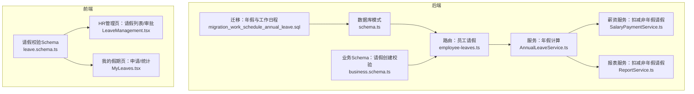
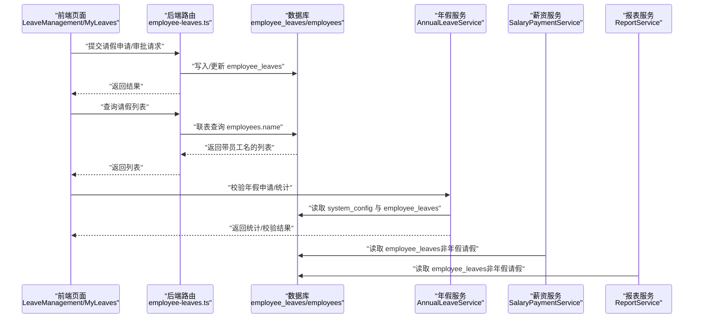
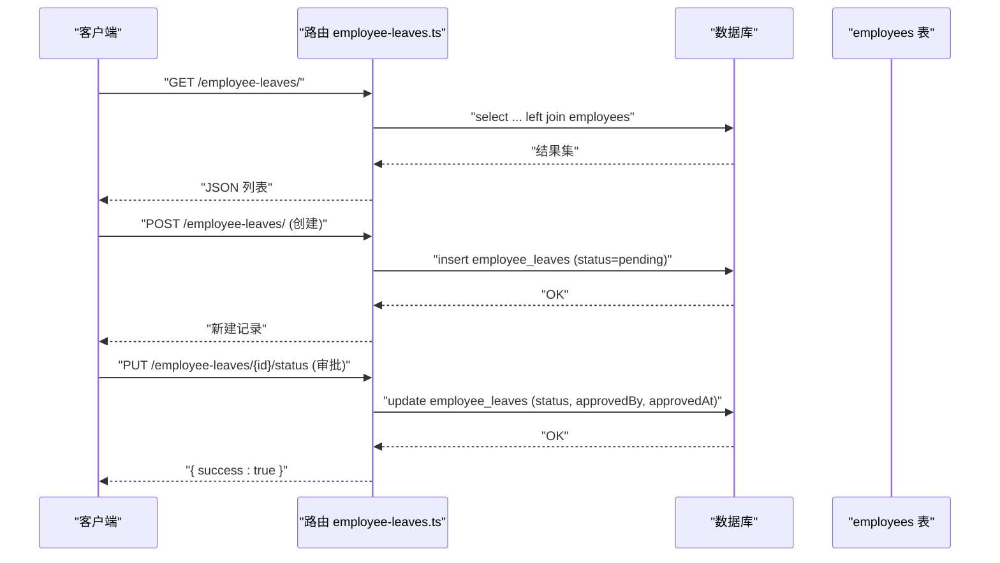
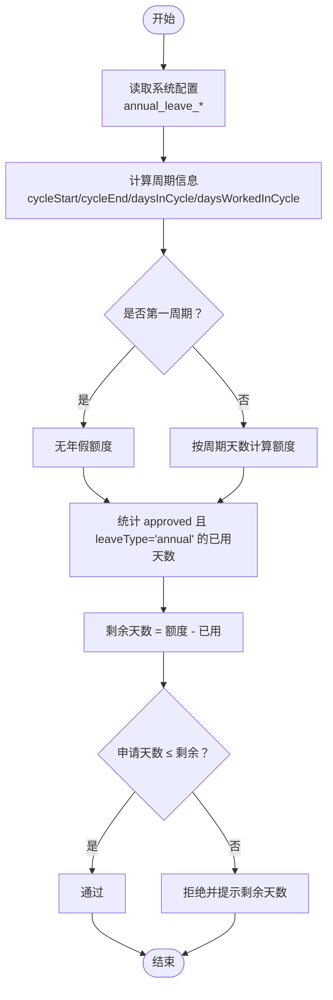
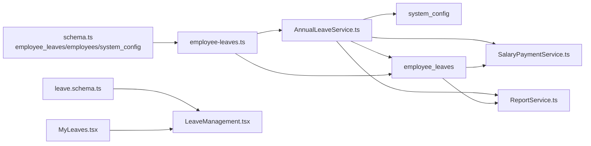

# 员工请假数据模型

<cite>
**本文引用的文件列表**
- [schema.ts](file://backend/src/db/schema.ts)
- [employee-leaves.ts](file://backend/src/routes/employee-leaves.ts)
- [AnnualLeaveService.ts](file://backend/src/services/AnnualLeaveService.ts)
- [migration_work_schedule_annual_leave.sql](file://backend/src/db/archive/migration_work_schedule_annual_leave.sql)
- [leave.schema.ts](file://frontend/src/validations/leave.schema.ts)
- [LeaveManagement.tsx](file://frontend/src/features/hr/pages/LeaveManagement.tsx)
- [MyLeaves.tsx](file://frontend/src/features/my/pages/MyLeaves.tsx)
- [business.schema.ts](file://backend/src/schemas/business.schema.ts)
- [SalaryPaymentService.ts](file://backend/src/services/SalaryPaymentService.ts)
- [ReportService.ts](file://backend/src/services/ReportService.ts)
</cite>

## 目录
1. [引言](#引言)
2. [项目结构](#项目结构)
3. [核心组件](#核心组件)
4. [架构总览](#架构总览)
5. [详细组件分析](#详细组件分析)
6. [依赖关系分析](#依赖关系分析)
7. [性能考量](#性能考量)
8. [故障排查指南](#故障排查指南)
9. [结论](#结论)
10. [附录](#附录)

## 引言
本文件面向HR功能开发者，系统化梳理“员工请假”数据模型与业务流程，重点覆盖：
- 表 employee_leaves 的结构与字段语义
- 请假类型（如年假 annual、病假 sick、事假 personal、其他 other）的处理边界
- 核心字段 startDate/endDate/days 的设计与约束
- 借助 migration_work_schedule_annual_leave.sql 实现的年假周期 annual_leave_cycle_months 与工作日程 work_schedule 的数据库层面规则
- AnnualLeaveService 中年假统计与校验的实现逻辑
- 与前端校验、路由接口、薪资与报表模块的集成点

## 项目结构
围绕“员工请假”的关键代码分布在后端数据库模式、路由、服务与前端校验/页面之间，形成“数据模型—接口—业务服务—前端交互”的闭环。

图表来源
- [schema.ts](file://backend/src/db/schema.ts#L240-L254)
- [employee-leaves.ts](file://backend/src/routes/employee-leaves.ts#L1-L210)
- [AnnualLeaveService.ts](file://backend/src/services/AnnualLeaveService.ts#L1-L221)
- [migration_work_schedule_annual_leave.sql](file://backend/src/db/archive/migration_work_schedule_annual_leave.sql#L1-L11)
- [leave.schema.ts](file://frontend/src/validations/leave.schema.ts#L1-L32)
- [LeaveManagement.tsx](file://frontend/src/features/hr/pages/LeaveManagement.tsx#L1-L36)
- [MyLeaves.tsx](file://frontend/src/features/my/pages/MyLeaves.tsx#L1-L239)
- [business.schema.ts](file://backend/src/schemas/business.schema.ts#L800-L817)
- [SalaryPaymentService.ts](file://backend/src/services/SalaryPaymentService.ts#L119-L144)
- [ReportService.ts](file://backend/src/services/ReportService.ts#L602-L650)

章节来源
- [schema.ts](file://backend/src/db/schema.ts#L240-L254)
- [employee-leaves.ts](file://backend/src/routes/employee-leaves.ts#L1-L210)
- [AnnualLeaveService.ts](file://backend/src/services/AnnualLeaveService.ts#L1-L221)
- [migration_work_schedule_annual_leave.sql](file://backend/src/db/archive/migration_work_schedule_annual_leave.sql#L1-L11)
- [leave.schema.ts](file://frontend/src/validations/leave.schema.ts#L1-L32)
- [LeaveManagement.tsx](file://frontend/src/features/hr/pages/LeaveManagement.tsx#L1-L36)
- [MyLeaves.tsx](file://frontend/src/features/my/pages/MyLeaves.tsx#L1-L239)
- [business.schema.ts](file://backend/src/schemas/business.schema.ts#L800-L817)
- [SalaryPaymentService.ts](file://backend/src/services/SalaryPaymentService.ts#L119-L144)
- [ReportService.ts](file://backend/src/services/ReportService.ts#L602-L650)

## 核心组件
- 数据表 employee_leaves
  - 字段要点：leaveType、startDate、endDate、days、status、approvedBy/approvedAt、reason/memo 等
  - 与 employees 表通过外键关联，便于展示员工姓名
- 路由接口
  - 列表查询、创建请假、更新状态（审批）
- 年假服务 AnnualLeaveService
  - 配置读取（系统配置 annual_leave_*）
  - 周期计算（按 6/12 月周期）
  - 年假统计与校验（剩余天数、超额判断）
  - 离职结算（按比例未休年假折算）
- 迁移脚本 migration_work_schedule_annual_leave.sql
  - 为 employees 添加 work_schedule 字段
  - 初始化系统配置 annual_leave_cycle_months、annual_leave_days_per_cycle、annual_leave_overtime_multiplier
- 前端校验与页面
  - leave.schema.ts 定义请假类型枚举与日期范围校验
  - HR 与 MyLeaves 页面承载申请、审批、统计

章节来源
- [schema.ts](file://backend/src/db/schema.ts#L240-L254)
- [employee-leaves.ts](file://backend/src/routes/employee-leaves.ts#L1-L210)
- [AnnualLeaveService.ts](file://backend/src/services/AnnualLeaveService.ts#L1-L221)
- [migration_work_schedule_annual_leave.sql](file://backend/src/db/archive/migration_work_schedule_annual_leave.sql#L1-L11)
- [leave.schema.ts](file://frontend/src/validations/leave.schema.ts#L1-L32)
- [LeaveManagement.tsx](file://frontend/src/features/hr/pages/LeaveManagement.tsx#L1-L36)
- [MyLeaves.tsx](file://frontend/src/features/my/pages/MyLeaves.tsx#L1-L239)

## 架构总览
下图展示“请假数据模型”在系统中的位置与调用链路。

图表来源
- [employee-leaves.ts](file://backend/src/routes/employee-leaves.ts#L1-L210)
- [schema.ts](file://backend/src/db/schema.ts#L240-L254)
- [AnnualLeaveService.ts](file://backend/src/services/AnnualLeaveService.ts#L1-L221)
- [SalaryPaymentService.ts](file://backend/src/services/SalaryPaymentService.ts#L119-L144)
- [ReportService.ts](file://backend/src/services/ReportService.ts#L602-L650)

## 详细组件分析

### 数据表：employee_leaves
- 关键字段与含义
  - employeeId：关联 employees.id
  - leaveType：请假类型，前端校验包含 sick、annual、personal、other
  - startDate/endDate：起止日期（字符串，YYYY-MM-DD）
  - days：请假天数（数值）
  - status：申请状态（默认 pending），支持 approved/rejected
  - approvedBy/approvedAt：审批人与审批时间
  - reason/memo：原因与备注
  - createdAt/updatedAt：记录创建与更新时间戳
- 业务约束
  - 路由层对 status 更新进行权限控制
  - 年假统计与校验仅针对 leaveType='annual' 的已批准记录
- 与 employees 的联结
  - 路由查询时左连接 employees.name，便于展示

章节来源
- [schema.ts](file://backend/src/db/schema.ts#L240-L254)
- [employee-leaves.ts](file://backend/src/routes/employee-leaves.ts#L60-L103)

### 路由：员工请假接口
- 列表查询
  - 支持按 employeeId、status 过滤
  - 返回带员工姓名的列表
- 创建请假
  - 权限：需要 hr.leave.create
  - 默认状态为 pending，自动填充 createdAt/updatedAt
- 更新状态（审批）
  - 权限：需要 hr.leave.approve
  - 审批通过/拒绝时，自动填充 approvedBy/approvedAt
  - 可选 memo 备注

图表来源
- [employee-leaves.ts](file://backend/src/routes/employee-leaves.ts#L44-L209)

章节来源
- [employee-leaves.ts](file://backend/src/routes/employee-leaves.ts#L1-L210)

### 年假服务：AnnualLeaveService
- 配置来源
  - system_config 表中以 annual_leave 开头的键值对
  - 关键键：annual_leave_cycle_months（周期月数）、annual_leave_days_per_cycle（每周期天数）、annual_leave_overtime_multiplier（未休折算系数）
- 周期计算
  - 以员工 joinDate 为起点，按 cycleMonths（6 或 12）划分周期
  - 计算当前周期开始/结束日期、周期总天数、周期内已工作天数
- 年假统计
  - 第一周期无年假；其余周期按 daysPerCycle 计算
  - 统计 approved 且 leaveType='annual' 的已使用天数
  - remaining = entitled - used
- 申请校验
  - 若处于第一周期，直接拒绝
  - 否则若申请天数超过 remaining，则拒绝并提示剩余天数
- 离职结算
  - 按比例计算本周期应得年假：entitled = daysPerCycle × (daysWorkedInCycle/daysInCycle)
  - unused = entitled - used
  - settlement = unused × dailySalary × overtimeMultiplier

图表来源
- [AnnualLeaveService.ts](file://backend/src/services/AnnualLeaveService.ts#L43-L221)

章节来源
- [AnnualLeaveService.ts](file://backend/src/services/AnnualLeaveService.ts#L1-L221)

### 迁移脚本：年假与工作日程
- 为 employees 表新增 work_schedule 字段，默认值为包含工作日与上下班时间的 JSON 文本
- 在 system_config 中插入三条年假相关配置项，确保服务可读取

章节来源
- [migration_work_schedule_annual_leave.sql](file://backend/src/db/archive/migration_work_schedule_annual_leave.sql#L1-L11)

### 前端校验与页面
- 请假类型枚举：sick、annual、personal、other
- 日期范围校验：结束日期不得早于开始日期
- MyLeaves 页面支持发起年假/病假/事假/其他类型的申请，并显示统计与状态
- HR 页面支持查看、审批请假

章节来源
- [leave.schema.ts](file://frontend/src/validations/leave.schema.ts#L1-L32)
- [LeaveManagement.tsx](file://frontend/src/features/hr/pages/LeaveManagement.tsx#L1-L36)
- [MyLeaves.tsx](file://frontend/src/features/my/pages/MyLeaves.tsx#L1-L239)

### 与薪资与报表的集成
- 非年假请假在薪资计算与报表统计中会被扣除相应工作日
  - 重叠区间计算：与当月起止日期求交集，按整日计算重叠天数
  - 扣减 leaveDaysToDeduct 后再计算实际工资

章节来源
- [SalaryPaymentService.ts](file://backend/src/services/SalaryPaymentService.ts#L119-L144)
- [ReportService.ts](file://backend/src/services/ReportService.ts#L602-L650)

## 依赖关系分析
- 数据模型依赖
  - employee_leaves 依赖 employees（联结查询）
  - 年假统计依赖 system_config（配置）
- 服务依赖
  - AnnualLeaveService 依赖 employeeLeaves 与 systemConfig
  - 薪资与报表服务依赖 employeeLeaves（过滤非年假请假）
- 接口依赖
  - 路由依赖权限工具与错误处理
- 前端依赖
  - 校验 Schema 与页面组件

图表来源
- [schema.ts](file://backend/src/db/schema.ts#L240-L254)
- [employee-leaves.ts](file://backend/src/routes/employee-leaves.ts#L1-L210)
- [AnnualLeaveService.ts](file://backend/src/services/AnnualLeaveService.ts#L1-L221)
- [SalaryPaymentService.ts](file://backend/src/services/SalaryPaymentService.ts#L119-L144)
- [ReportService.ts](file://backend/src/services/ReportService.ts#L602-L650)
- [leave.schema.ts](file://frontend/src/validations/leave.schema.ts#L1-L32)
- [LeaveManagement.tsx](file://frontend/src/features/hr/pages/LeaveManagement.tsx#L1-L36)
- [MyLeaves.tsx](file://frontend/src/features/my/pages/MyLeaves.tsx#L1-L239)

## 性能考量
- 查询优化
  - 列表查询支持按 employeeId/status 过滤，建议在对应列建立索引以提升过滤效率
- 年假统计
  - getUsedAnnualLeaveDays 使用精确条件过滤 approved 且 leaveType='annual'，避免全表扫描
- 周期计算
  - calculateCycleInfo 为纯内存计算，开销极低
- 报表与薪资
  - 重叠区间计算为 O(n) 遍历，n 为某员工当月请假条数；建议按月聚合或缓存减少重复计算

[本节为通用性能建议，不直接分析具体文件]

## 故障排查指南
- 无法创建请假
  - 检查权限：hr.leave.create 是否具备
  - 检查请求体字段：employeeId、leaveType、startDate、endDate、days、reason/memo
- 审批失败
  - 检查权限：hr.leave.approve 是否具备
  - 检查状态更新是否传入合法 status（pending/approved/rejected）
- 年假申请被拒
  - 可能处于第一周期或剩余天数不足
  - 使用 AnnualLeaveService.validateAnnualLeaveRequest 获取明确提示
- 离职结算异常
  - 确认 system_config 中 annual_leave_* 配置正确
  - 确认员工 joinDate、leaveDate 与 dailySalary 输入正确
- 报表/薪资扣减异常
  - 检查非年假请假是否正确计入重叠天数
  - 确保 startDate/endDate 格式为 YYYY-MM-DD

章节来源
- [employee-leaves.ts](file://backend/src/routes/employee-leaves.ts#L133-L209)
- [AnnualLeaveService.ts](file://backend/src/services/AnnualLeaveService.ts#L191-L221)
- [migration_work_schedule_annual_leave.sql](file://backend/src/db/archive/migration_work_schedule_annual_leave.sql#L1-L11)
- [SalaryPaymentService.ts](file://backend/src/services/SalaryPaymentService.ts#L119-L144)
- [ReportService.ts](file://backend/src/services/ReportService.ts#L602-L650)

## 结论
本数据模型以 employee_leaves 为核心，结合 system_config 的年假配置与 AnnualLeaveService 的统计/校验能力，实现了灵活的年假周期管理与合规的审批流程。配合前端校验与路由接口，HR 可高效完成请假管理；同时，薪资与报表模块对非年假请假的扣减逻辑保证了薪酬核算的准确性。迁移脚本为工作日程与年假配置提供了数据库层面的基础支撑。

[本节为总结性内容，不直接分析具体文件]

## 附录

### 字段与类型参考
- 表 employee_leaves
  - employeeId：文本
  - leaveType：文本（枚举：sick、annual、personal、other）
  - startDate/endDate：文本（日期字符串）
  - days：数值（天数）
  - status：文本（默认 pending）
  - approvedBy/approvedAt：文本/数值
  - reason/memo：文本
  - createdAt/updatedAt：数值（时间戳）

章节来源
- [schema.ts](file://backend/src/db/schema.ts#L240-L254)
- [leave.schema.ts](file://frontend/src/validations/leave.schema.ts#L1-L32)

### 年假配置项
- annual_leave_cycle_months：年假周期月数（6 或 12）
- annual_leave_days_per_cycle：每周期获得的年假天数
- annual_leave_overtime_multiplier：未休年假折算工资系数

章节来源
- [migration_work_schedule_annual_leave.sql](file://backend/src/db/archive/migration_work_schedule_annual_leave.sql#L1-L11)
- [AnnualLeaveService.ts](file://backend/src/services/AnnualLeaveService.ts#L43-L59)

### 请假类型与处理边界
- 年假 annual：参与年假统计与校验，离职结算按比例折算
- 病假 sick、事假 personal、其他 other：不参与年假额度计算，但会作为非年假请假在薪资/报表中扣减工作日

章节来源
- [AnnualLeaveService.ts](file://backend/src/services/AnnualLeaveService.ts#L99-L119)
- [SalaryPaymentService.ts](file://backend/src/services/SalaryPaymentService.ts#L119-L144)
- [ReportService.ts](file://backend/src/services/ReportService.ts#L602-L650)