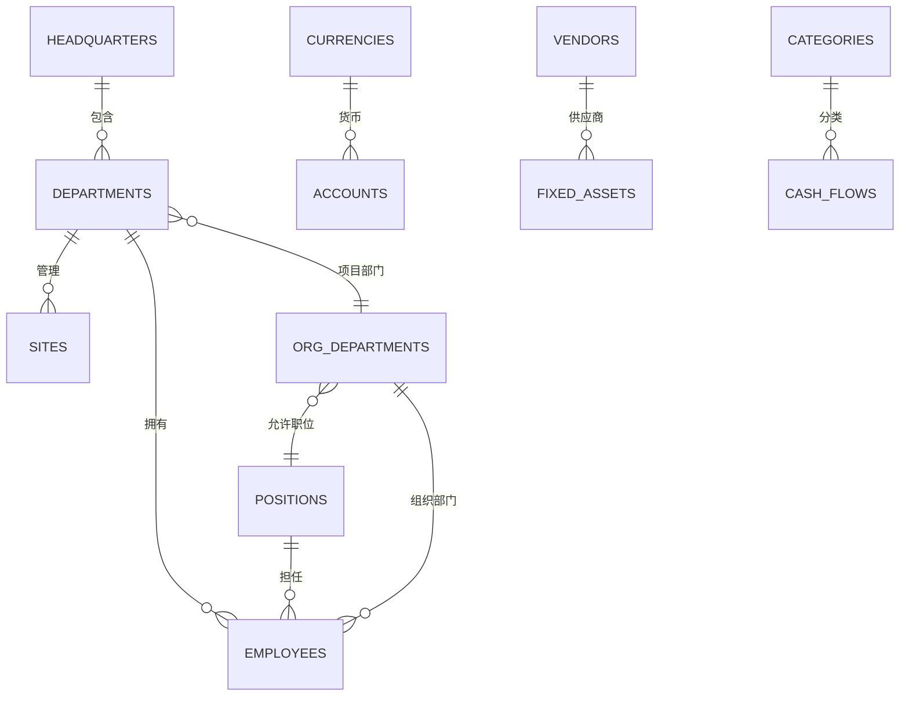
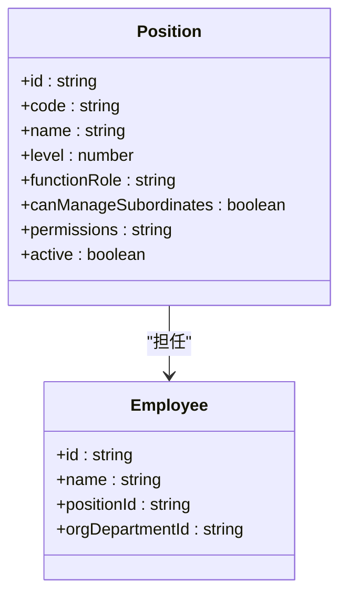
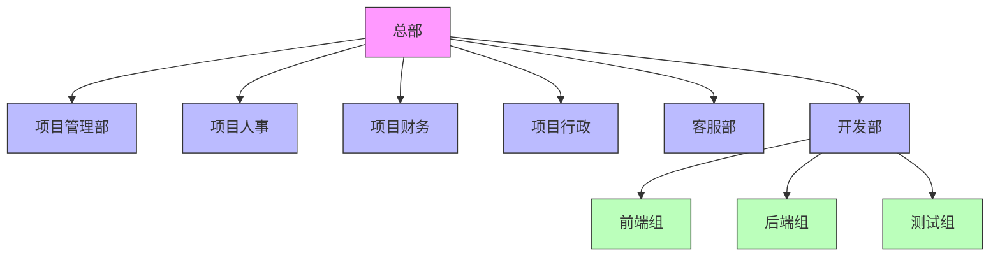
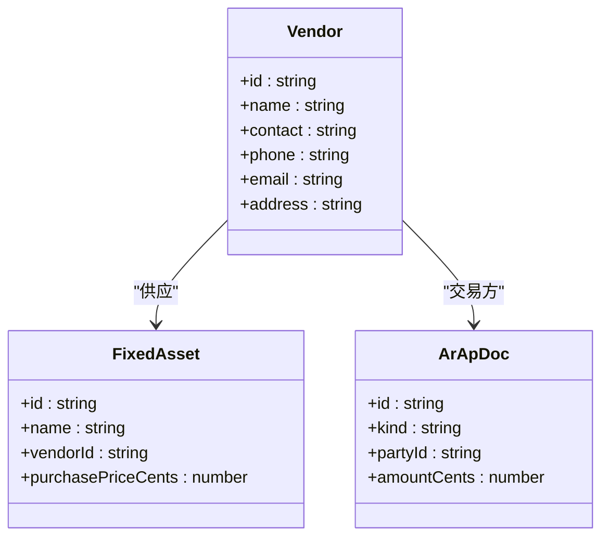
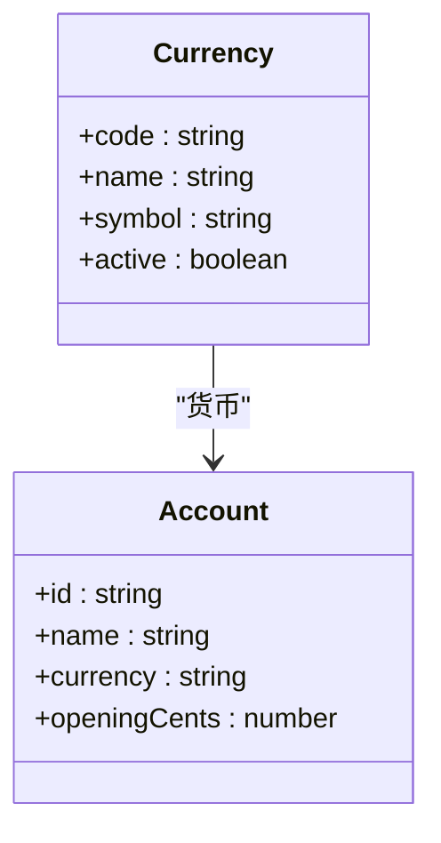
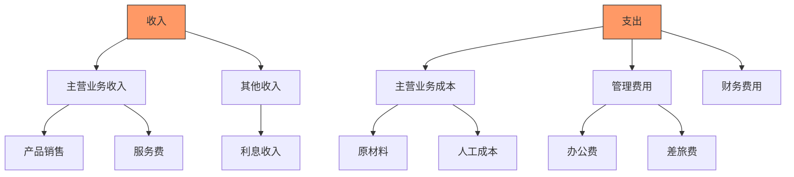
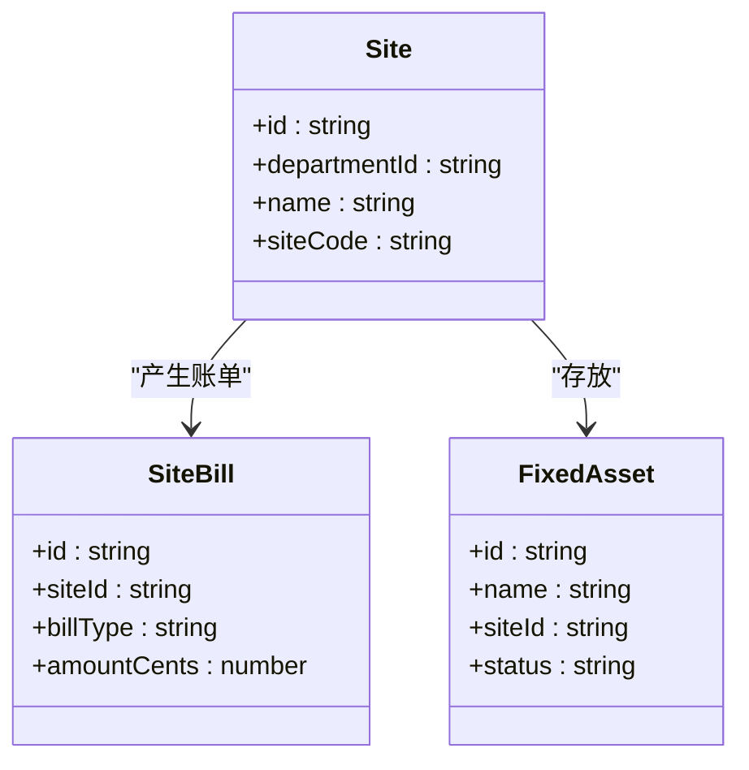
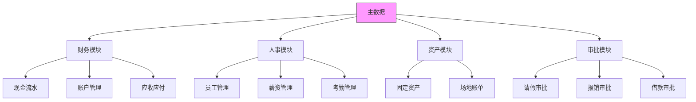
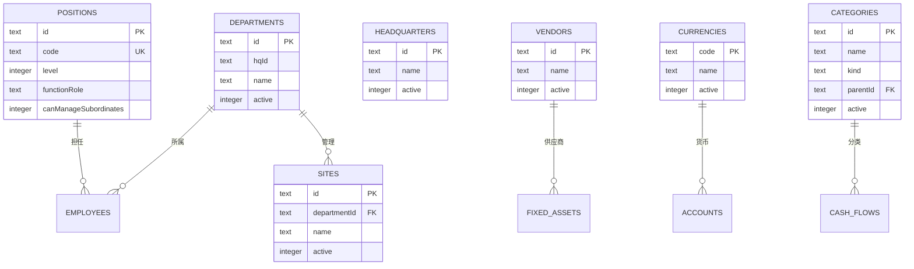

# 主数据模型

<cite>
**本文档引用的文件**  
- [schema.ts](file://backend/src/db/schema.ts)
- [master-data.schema.ts](file://backend/src/schemas/master-data.schema.ts)
- [MasterDataService.ts](file://backend/src/services/MasterDataService.ts)
- [PositionService.ts](file://backend/src/services/PositionService.ts)
- [DepartmentService.ts](file://backend/src/services/DepartmentService.ts)
- [HeadquartersService.ts](file://backend/src/services/HeadquartersService.ts)
- [VendorService.ts](file://backend/src/services/VendorService.ts)
- [CurrencyService.ts](file://backend/src/services/CurrencyService.ts)
- [SiteService.ts](file://backend/src/services/SiteService.ts)
- [CategoryService.ts](file://backend/src/services/CategoryService.ts)
- [positions.ts](file://backend/src/routes/v2/master-data/positions.ts)
- [departments.ts](file://backend/src/routes/v2/master-data/departments.ts)
- [categories.ts](file://backend/src/routes/v2/master-data/categories.ts)
</cite>

## 目录
1. [简介](#简介)
2. [核心主数据表结构](#核心主数据表结构)
3. [职位表（positions）详解](#职位表positions详解)
4. [部门与总部组织架构](#部门与总部组织架构)
5. [供应商管理（vendors）](#供应商管理vendors)
6. [币种支持（currencies）](#币种支持currencies)
7. [收支分类（categories）](#收支分类categories)
8. [场地管理（sites）](#场地管理sites)
9. [主数据在业务模块中的引用](#主数据在业务模块中的引用)
10. [索引与性能优化](#索引与性能优化)

## 简介
本系统采用主数据管理模式，将核心配置信息如职位、部门、供应商等作为主数据进行统一管理。这些主数据表构成了系统的基础配置层，为财务、人事等业务模块提供数据支持和引用。主数据通过服务层（Service Layer）和API路由对外提供增删改查功能，并在数据库层面通过索引优化查询性能。所有主数据操作均记录审计日志，确保操作可追溯。

**Section sources**
- [schema.ts](file://backend/src/db/schema.ts#L50-L350)
- [MasterDataService.ts](file://backend/src/services/MasterDataService.ts#L1-L261)

## 核心主数据表结构
系统定义了七个核心主数据表，其结构和关系如下：

**Diagram sources**
- [schema.ts](file://backend/src/db/schema.ts#L50-L350)

**Section sources**
- [schema.ts](file://backend/src/db/schema.ts#L50-L350)

## 职位表（positions）详解
`positions` 表用于定义系统中的所有职位，是权限管理和组织架构的基础。

### 表结构
| 字段名 | 类型 | 必填 | 默认值 | 描述 |
|-------|------|------|--------|------|
| id | TEXT | 是 | - | 主键，UUID |
| code | TEXT | 是 | - | 职位代码，唯一 |
| name | TEXT | 是 | - | 职位名称 |
| level | INTEGER | 是 | - | 职位层级（1:总部, 2:项目, 3:组级） |
| functionRole | TEXT | 是 | - | 功能角色 |
| canManageSubordinates | INTEGER | 否 | 0 | 是否可管理下属（0/1） |
| description | TEXT | 否 | - | 描述 |
| permissions | TEXT | 否 | - | 权限配置（JSON字符串） |
| sortOrder | INTEGER | 否 | 0 | 排序序号 |
| active | INTEGER | 否 | 1 | 是否激活（0/1） |

### 职位层级与功能角色
职位通过 `level` 字段实现三层级架构：
- **Level 1 (总部)**: 如CEO、CFO，拥有全局管理权限
- **Level 2 (项目)**: 如项目经理、项目财务，管理特定项目
- **Level 3 (组级)**: 如前端组长、后端工程师，管理具体开发组

`functionRole` 字段定义了职位的功能角色，用于权限分配和业务逻辑判断。

### 权限配置
`permissions` 字段存储JSON格式的权限配置，与 `canManageSubordinates` 字段结合，实现基于角色的访问控制（RBAC）。例如，`canManageSubordinates=1` 的职位可以审批下属的请假和报销。

**Diagram sources**
- [schema.ts](file://backend/src/db/schema.ts#L50-L63)
- [PositionService.ts](file://backend/src/services/PositionService.ts#L1-L224)

**Section sources**
- [schema.ts](file://backend/src/db/schema.ts#L50-L63)
- [PositionService.ts](file://backend/src/services/PositionService.ts#L1-L224)
- [positions.ts](file://backend/src/routes/v2/master-data/positions.ts#L1-L88)

## 部门与总部组织架构
系统通过 `headquarters`、`departments` 和 `orgDepartments` 三张表构建了灵活的组织架构。

### 表关系
- `headquarters` 表存储总部信息
- `departments` 表存储部门信息，通过 `hqId` 关联总部
- `orgDepartments` 表实现项目部门的树形结构，通过 `parentId` 实现层级

### 组织架构实现
`orgDepartments` 表是组织架构的核心，其 `allowedPositions` 字段通过JSON数组限制该部门可使用的职位，`allowedModules` 字段定义了模块访问权限。

**Diagram sources**
- [schema.ts](file://backend/src/db/schema.ts#L65-L109)
- [DepartmentService.ts](file://backend/src/services/DepartmentService.ts#L1-L182)

**Section sources**
- [schema.ts](file://backend/src/db/schema.ts#L65-L109)
- [DepartmentService.ts](file://backend/src/services/DepartmentService.ts#L1-L182)
- [departments.ts](file://backend/src/routes/v2/master-data/departments.ts#L1-L439)

## 供应商管理（vendors）
`vendors` 表用于管理所有供应商信息，是应付账款（AP）和固定资产采购的基础。

### 表结构
| 字段名 | 类型 | 必填 | 默认值 | 描述 |
|-------|------|------|--------|------|
| id | TEXT | 是 | - | 主键，UUID |
| name | TEXT | 是 | - | 供应商名称 |
| contact | TEXT | 否 | - | 联系人 |
| phone | TEXT | 否 | - | 电话 |
| email | TEXT | 否 | - | 邮箱 |
| address | TEXT | 否 | - | 地址 |
| memo | TEXT | 否 | - | 备注 |
| active | INTEGER | 否 | 1 | 是否激活 |

### 业务集成
供应商信息被 `fixedAssets` 表引用，用于记录固定资产的采购来源。同时，供应商也是应付账款（AP）文档的交易方。

**Diagram sources**
- [schema.ts](file://backend/src/db/schema.ts#L82-L93)
- [VendorService.ts](file://backend/src/services/VendorService.ts#L1-L94)

**Section sources**
- [schema.ts](file://backend/src/db/schema.ts#L82-L93)
- [VendorService.ts](file://backend/src/services/VendorService.ts#L1-L94)

## 币种支持（currencies）
`currencies` 表定义了系统支持的所有币种，是多币种财务管理的基础。

### 表结构
| 字段名 | 类型 | 必填 | 默认值 | 描述 |
|-------|------|------|--------|------|
| code | TEXT | 是 | - | 币种代码（主键，3位） |
| name | TEXT | 是 | - | 币种名称 |
| symbol | TEXT | 否 | - | 符号 |
| active | INTEGER | 否 | 1 | 是否激活 |

### 业务规则
- 币种代码必须为3位大写字母（如CNY, USD）
- 删除币种前需检查是否有账户使用该币种
- 所有金额字段均以"分"为单位存储，避免浮点数精度问题

**Diagram sources**
- [schema.ts](file://backend/src/db/schema.ts#L213-L218)
- [CurrencyService.ts](file://backend/src/services/CurrencyService.ts#L1-L78)

**Section sources**
- [schema.ts](file://backend/src/db/schema.ts#L213-L218)
- [CurrencyService.ts](file://backend/src/services/CurrencyService.ts#L1-L78)

## 收支分类（categories）
`categories` 表实现了树形结构的收支分类体系，通过 `parentId` 字段实现层级。

### 表结构
| 字段名 | 类型 | 必填 | 默认值 | 描述 |
|-------|------|------|--------|------|
| id | TEXT | 是 | - | 主键，UUID |
| name | TEXT | 是 | - | 分类名称 |
| kind | TEXT | 是 | - | 类型（income/expense） |
| parentId | TEXT | 否 | - | 父分类ID |
| sortOrder | INTEGER | 否 | 0 | 排序序号 |
| active | INTEGER | 否 | 1 | 是否激活 |

### 树形结构实现
系统通过递归查询或前端构建树形结构来展示分类。每个分类必须指定 `kind`（收入或支出），形成两个独立的分类树。

**Diagram sources**
- [schema.ts](file://backend/src/db/schema.ts#L343-L350)
- [CategoryService.ts](file://backend/src/services/CategoryService.ts#L1-L78)

**Section sources**
- [schema.ts](file://backend/src/db/schema.ts#L343-L350)
- [CategoryService.ts](file://backend/src/services/CategoryService.ts#L1-L78)
- [categories.ts](file://backend/src/routes/v2/master-data/categories.ts#L1-L232)

## 场地管理（sites）
`sites` 表用于管理各个场地，与部门关联，是场地账单和固定资产管理的基础。

### 表结构
| 字段名 | 类型 | 必填 | 默认值 | 描述 |
|-------|------|------|--------|------|
| id | TEXT | 是 | - | 主键，UUID |
| departmentId | TEXT | 是 | - | 所属部门 |
| name | TEXT | 是 | - | 场地名称 |
| siteCode | TEXT | 否 | - | 场地代码 |
| active | INTEGER | 否 | 1 | 是否激活 |

### 业务集成
场地信息被 `siteBills` 表引用，用于记录水电费等场地账单。同时，`fixedAssets` 表也引用场地ID，用于固定资产的物理位置管理。

**Diagram sources**
- [schema.ts](file://backend/src/db/schema.ts#L333-L341)
- [SiteService.ts](file://backend/src/services/SiteService.ts#L1-L89)

**Section sources**
- [schema.ts](file://backend/src/db/schema.ts#L333-L341)
- [SiteService.ts](file://backend/src/services/SiteService.ts#L1-L89)

## 主数据在业务模块中的引用
主数据作为系统的基础配置，被多个业务模块广泛引用：

- **财务模块**: 使用 `currencies`、`categories`、`accounts` 进行账务处理
- **人事模块**: 使用 `positions`、`departments`、`employees` 进行组织管理
- **资产模块**: 使用 `vendors`、`sites`、`categories` 进行资产管理
- **审批模块**: 使用 `positions` 的权限配置进行审批流控制

**Diagram sources**
- [schema.ts](file://backend/src/db/schema.ts#L50-L350)

**Section sources**
- [schema.ts](file://backend/src/db/schema.ts#L50-L350)

## 索引与性能优化
系统在关键字段上建立了索引，以优化查询性能：

**Diagram sources**
- [schema.ts](file://backend/src/db/schema.ts#L50-L350)

**Section sources**
- [schema.ts](file://backend/src/db/schema.ts#L50-L350)