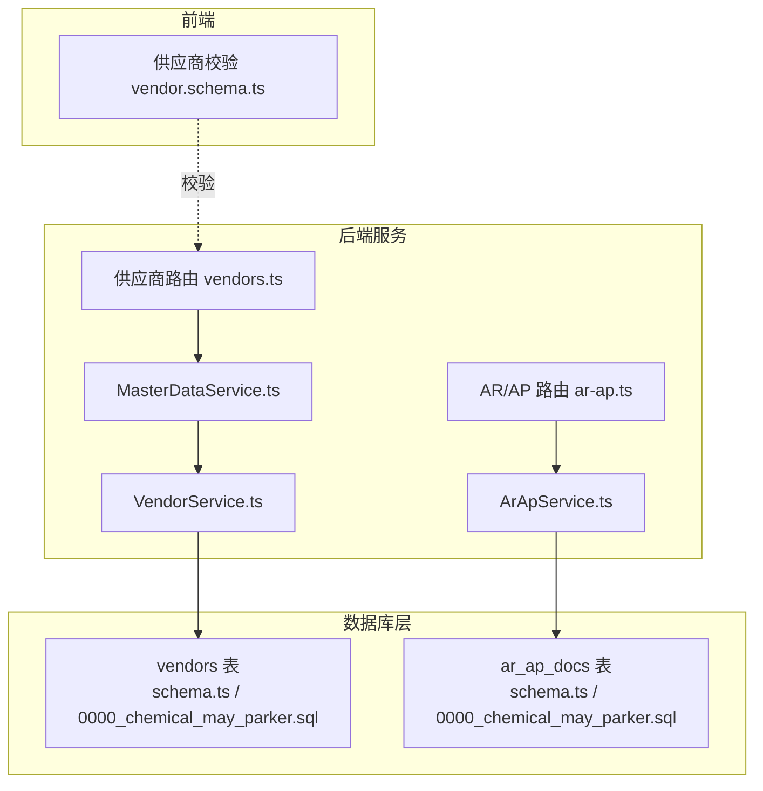
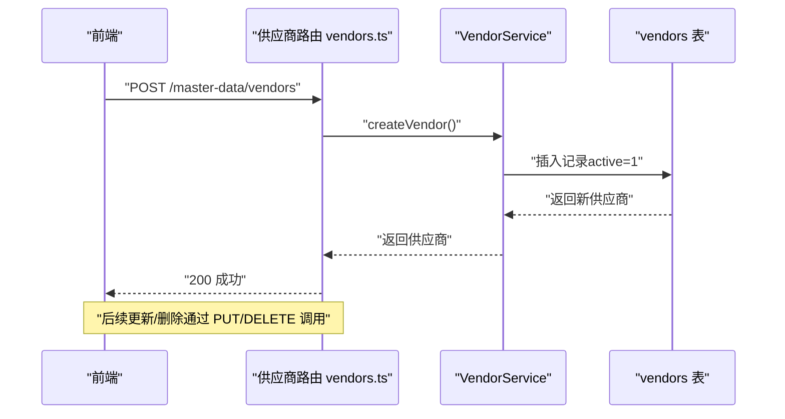
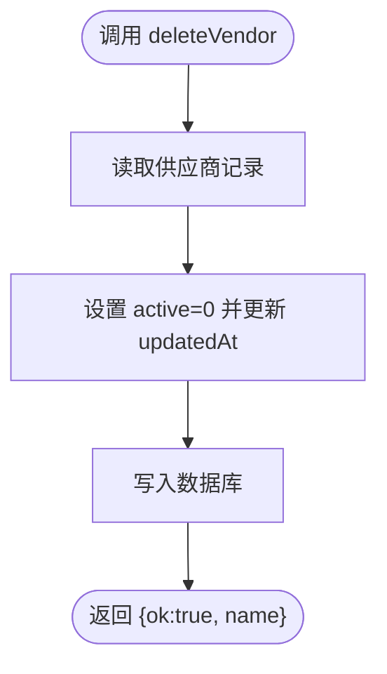
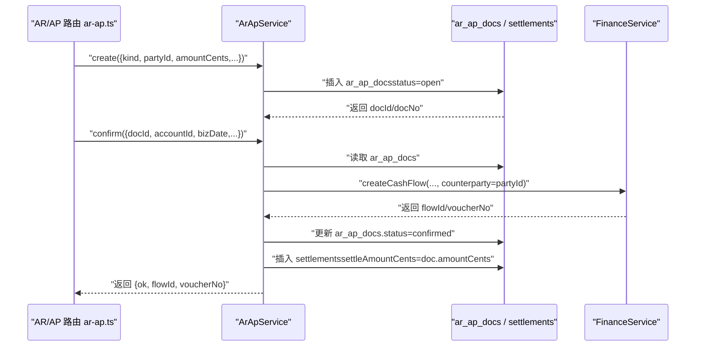
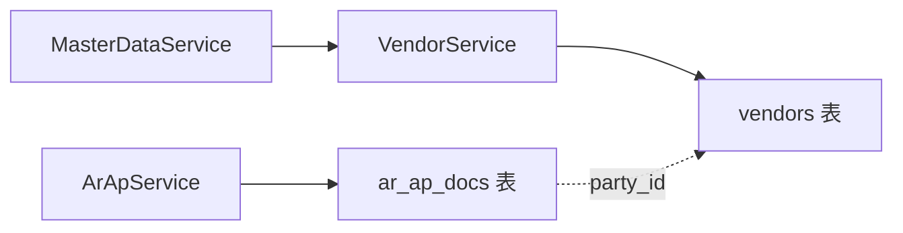

# 供应商表 (vendors)

<cite>
**本文档引用的文件**
- [schema.ts](file://backend/src/db/schema.ts)
- [0000_chemical_may_parker.sql](file://backend/drizzle/0000_chemical_may_parker.sql)
- [master-data.schema.ts](file://backend/src/schemas/master-data.schema.ts)
- [vendor.schema.ts](file://frontend/src/validations/vendor.schema.ts)
- [vendors.ts](file://backend/src/routes/v2/master-data/vendors.ts)
- [VendorService.ts](file://backend/src/services/VendorService.ts)
- [MasterDataService.ts](file://backend/src/services/MasterDataService.ts)
- [ar-ap.ts](file://backend/src/routes/v2/ar-ap.ts)
- [ArApService.ts](file://backend/src/services/ArApService.ts)
- [0000_snapshot.json](file://backend/drizzle/meta/0000_snapshot.json)
</cite>

## 目录
1. [简介](#简介)
2. [项目结构](#项目结构)
3. [核心组件](#核心组件)
4. [架构总览](#架构总览)
5. [详细组件分析](#详细组件分析)
6. [依赖关系分析](#依赖关系分析)
7. [性能考量](#性能考量)
8. [故障排查指南](#故障排查指南)
9. [结论](#结论)
10. [附录](#附录)

## 简介
本文件系统性地阐述供应商表 vendors 的结构与使用方式，重点说明：
- 字段定义与语义（id、name、contact、phone、email、address、memo、active、createdAt、updatedAt）
- 在应收应付（AR/AP）模块中的角色：通过 ar_ap_docs 表的 party_id 引用供应商
- active 字段的软删除机制
- 供应商在采购与付款流程中的核心作用
- 数据完整性约束与业务规则
- 提供代码级定位路径，便于查阅真实实现

## 项目结构
围绕 vendors 表的关键文件分布如下：
- 数据库模式定义：backend/src/db/schema.ts、backend/drizzle/0000_chemical_may_parker.sql
- 前后端校验模式：backend/src/schemas/master-data.schema.ts、frontend/src/validations/vendor.schema.ts
- 供应商路由与服务：backend/src/routes/v2/master-data/vendors.ts、backend/src/services/VendorService.ts、backend/src/services/MasterDataService.ts
- AR/AP 模块：backend/src/routes/v2/ar-ap.ts、backend/src/services/ArApService.ts
- 迁移快照：backend/drizzle/meta/0000_snapshot.json

图表来源
- [schema.ts](file://backend/src/db/schema.ts#L82-L93)
- [0000_chemical_may_parker.sql](file://backend/drizzle/0000_chemical_may_parker.sql#L635-L647)
- [vendors.ts](file://backend/src/routes/v2/master-data/vendors.ts#L1-L260)
- [VendorService.ts](file://backend/src/services/VendorService.ts#L1-L94)
- [MasterDataService.ts](file://backend/src/services/MasterDataService.ts#L116-L155)
- [ar-ap.ts](file://backend/src/routes/v2/ar-ap.ts#L1-L626)
- [ArApService.ts](file://backend/src/services/ArApService.ts#L1-L264)
- [vendor.schema.ts](file://frontend/src/validations/vendor.schema.ts#L1-L9)

章节来源
- [schema.ts](file://backend/src/db/schema.ts#L82-L93)
- [0000_chemical_may_parker.sql](file://backend/drizzle/0000_chemical_may_parker.sql#L635-L647)
- [vendors.ts](file://backend/src/routes/v2/master-data/vendors.ts#L1-L260)
- [VendorService.ts](file://backend/src/services/VendorService.ts#L1-L94)
- [MasterDataService.ts](file://backend/src/services/MasterDataService.ts#L116-L155)
- [ar-ap.ts](file://backend/src/routes/v2/ar-ap.ts#L1-L626)
- [ArApService.ts](file://backend/src/services/ArApService.ts#L1-L264)
- [vendor.schema.ts](file://frontend/src/validations/vendor.schema.ts#L1-L9)

## 核心组件
- vendors 表：存储供应商基础信息，支持软删除（active 字段）
- VendorService：封装供应商 CRUD 与软删除逻辑
- MasterDataService：对外暴露统一主数据接口，内部委托 VendorService
- AR/AP 模块：通过 ar_ap_docs 的 party_id 关联供应商，支撑采购与付款流程

章节来源
- [schema.ts](file://backend/src/db/schema.ts#L82-L93)
- [VendorService.ts](file://backend/src/services/VendorService.ts#L1-L94)
- [MasterDataService.ts](file://backend/src/services/MasterDataService.ts#L116-L155)
- [ar-ap.ts](file://backend/src/routes/v2/ar-ap.ts#L1-L626)
- [ArApService.ts](file://backend/src/services/ArApService.ts#L1-L264)

## 架构总览
供应商在系统中的关键流转：
- 供应商管理：通过 vendors 路由与服务进行增删改查
- AR/AP 使用：在创建 AR/AP 单据时，将 party_id 指向供应商；确认单据时生成现金流并更新状态
- 数据一致性：vendors 的 active=1 作为默认可见条件；软删除通过 active=0 实现

图表来源
- [vendors.ts](file://backend/src/routes/v2/master-data/vendors.ts#L139-L163)
- [VendorService.ts](file://backend/src/services/VendorService.ts#L27-L51)

章节来源
- [vendors.ts](file://backend/src/routes/v2/master-data/vendors.ts#L139-L163)
- [VendorService.ts](file://backend/src/services/VendorService.ts#L27-L51)

## 详细组件分析

### 1) vendors 表结构与字段说明
- 字段清单与含义
  - id：主键，文本型
  - name：供应商名称，必填
  - contact：联系人，可选
  - phone：电话，可选
  - email：邮箱，可选
  - address：地址，可选
  - memo：备注，可选
  - active：软删除标志，默认 1（启用），0 表示删除
  - createdAt / updatedAt：时间戳
- 数据完整性与约束
  - Drizzle 定义：非空约束、默认值、索引等
  - SQL 迁移：主键、默认值、字段类型
  - 前后端校验：必填、长度、邮箱格式等

章节来源
- [schema.ts](file://backend/src/db/schema.ts#L82-L93)
- [0000_chemical_may_parker.sql](file://backend/drizzle/0000_chemical_may_parker.sql#L635-L647)
- [master-data.schema.ts](file://backend/src/schemas/master-data.schema.ts#L102-L118)
- [vendor.schema.ts](file://frontend/src/validations/vendor.schema.ts#L1-L9)

### 2) 软删除机制（active 字段）
- 查询策略：VendorService 默认只查询 active=1 的供应商
- 删除操作：deleteVendor 将 active 设为 0，并更新时间戳
- 前端过滤：供应商列表路由支持 activeOnly=true 过滤启用状态

图表来源
- [VendorService.ts](file://backend/src/services/VendorService.ts#L80-L91)
- [vendors.ts](file://backend/src/routes/v2/master-data/vendors.ts#L245-L259)

章节来源
- [VendorService.ts](file://backend/src/services/VendorService.ts#L15-L17)
- [VendorService.ts](file://backend/src/services/VendorService.ts#L80-L91)
- [vendors.ts](file://backend/src/routes/v2/master-data/vendors.ts#L43-L69)

### 3) 在 AR/AP 模块中的引用与使用
- 引用关系：ar_ap_docs 表包含 party_id 字段，用于指向 vendors.id
- 业务流程：
  - 创建 AR/AP 单据时，填写 party_id 指向供应商
  - 确认单据时，ArApService 会基于 kind 决定现金流类型，并将 counterparty 设置为 partyId
  - 结算与状态刷新：根据 settlements 计算已结清金额，自动更新 ar_ap_docs.status

图表来源
- [ar-ap.ts](file://backend/src/routes/v2/ar-ap.ts#L163-L221)
- [ArApService.ts](file://backend/src/services/ArApService.ts#L84-L118)
- [ArApService.ts](file://backend/src/services/ArApService.ts#L178-L243)
- [0000_chemical_may_parker.sql](file://backend/drizzle/0000_chemical_may_parker.sql#L60-L74)

章节来源
- [ar-ap.ts](file://backend/src/routes/v2/ar-ap.ts#L163-L221)
- [ArApService.ts](file://backend/src/services/ArApService.ts#L84-L118)
- [ArApService.ts](file://backend/src/services/ArApService.ts#L178-L243)
- [0000_chemical_may_parker.sql](file://backend/drizzle/0000_chemical_may_parker.sql#L60-L74)

### 4) 供应商在采购与付款流程中的核心作用
- 采购（AP）：partyId 指向供应商，确认单据后生成付款现金流，支持按供应商对账
- 付款（AR）：在 AR 场景下，partyId 可指向客户；此处聚焦 AP 流程
- 数据一致性：VendorService.getVendors 默认只返回 active=1 的供应商，避免误用已删除供应商

章节来源
- [vendors.ts](file://backend/src/routes/v2/master-data/vendors.ts#L43-L69)
- [VendorService.ts](file://backend/src/services/VendorService.ts#L15-L17)
- [ArApService.ts](file://backend/src/services/ArApService.ts#L178-L243)

### 5) 数据完整性约束与前后端校验
- 后端 Drizzle 定义：字段类型、是否非空、默认值、索引
- SQL 迁移：主键、默认值、字段类型
- 前端 Zod 校验：必填项、长度限制、邮箱格式
- 后端 OpenAPI Schema：统一的请求/响应结构

章节来源
- [schema.ts](file://backend/src/db/schema.ts#L82-L93)
- [0000_chemical_may_parker.sql](file://backend/drizzle/0000_chemical_may_parker.sql#L635-L647)
- [master-data.schema.ts](file://backend/src/schemas/master-data.schema.ts#L102-L118)
- [vendor.schema.ts](file://frontend/src/validations/vendor.schema.ts#L1-L9)

## 依赖关系分析
- VendorService 依赖 Drizzle ORM 对 vendors 表进行 CRUD
- MasterDataService 作为门面，聚合 VendorService
- AR/AP 模块依赖 vendors 的 active=1 查询策略，间接保证 AR/AP 单据引用的有效性
- ar_ap_docs 与 vendors 无外键约束，通过 party_id 逻辑关联

图表来源
- [MasterDataService.ts](file://backend/src/services/MasterDataService.ts#L116-L155)
- [VendorService.ts](file://backend/src/services/VendorService.ts#L1-L94)
- [ArApService.ts](file://backend/src/services/ArApService.ts#L1-L264)
- [0000_chemical_may_parker.sql](file://backend/drizzle/0000_chemical_may_parker.sql#L60-L74)

章节来源
- [MasterDataService.ts](file://backend/src/services/MasterDataService.ts#L116-L155)
- [VendorService.ts](file://backend/src/services/VendorService.ts#L1-L94)
- [ArApService.ts](file://backend/src/services/ArApService.ts#L1-L264)
- [0000_chemical_may_parker.sql](file://backend/drizzle/0000_chemical_may_parker.sql#L60-L74)

## 性能考量
- 查询优化：VendorService 默认按 active=1 排序查询，减少无效数据扫描
- 批量过滤：供应商列表路由支持后端过滤（activeOnly、search），降低前端负担
- AR/AP 列表：ArApService 并行查询结算与站点信息，提升分页列表性能

章节来源
- [VendorService.ts](file://backend/src/services/VendorService.ts#L15-L17)
- [vendors.ts](file://backend/src/routes/v2/master-data/vendors.ts#L43-L69)
- [ArApService.ts](file://backend/src/services/ArApService.ts#L27-L82)

## 故障排查指南
- 供应商不存在
  - 现象：查询单个供应商时报错
  - 处理：检查 id 是否正确；确认未被软删除（active=0）
  - 参考：[VendorService.getVendor](file://backend/src/services/VendorService.ts#L19-L25)
- 无法在 AR/AP 中选择供应商
  - 现象：供应商不在列表中
  - 处理：确认供应商 active=1；检查 activeOnly 过滤参数
  - 参考：[VendorService.getVendors](file://backend/src/services/VendorService.ts#L15-L17)、[vendors 路由过滤](file://backend/src/routes/v2/master-data/vendors.ts#L43-L69)
- 删除供应商后仍出现在 AR/AP 单据
  - 现象：partyId 指向的供应商显示异常
  - 处理：确认删除操作已执行（active=0）；如需恢复，请更新 active=1
  - 参考：[VendorService.deleteVendor](file://backend/src/services/VendorService.ts#L80-L91)
- 邮箱格式错误
  - 现象：创建/更新供应商报邮箱格式错误
  - 处理：修正邮箱格式；参考前端校验规则
  - 参考：[vendor.schema.ts](file://frontend/src/validations/vendor.schema.ts#L1-L9)、[master-data.schema.ts](file://backend/src/schemas/master-data.schema.ts#L102-L118)

章节来源
- [VendorService.ts](file://backend/src/services/VendorService.ts#L19-L25)
- [VendorService.ts](file://backend/src/services/VendorService.ts#L80-L91)
- [vendors.ts](file://backend/src/routes/v2/master-data/vendors.ts#L43-L69)
- [vendor.schema.ts](file://frontend/src/validations/vendor.schema.ts#L1-L9)
- [master-data.schema.ts](file://backend/src/schemas/master-data.schema.ts#L102-L118)

## 结论
vendors 表是 AR/AP 模块的核心主数据之一，通过 party_id 与 ar_ap_docs 建立逻辑关联。系统采用 active 字段实现软删除，确保历史单据的可追溯性。VendorService 与 MasterDataService 提供清晰的接口边界，AR/AP 模块在创建、确认、结算过程中充分利用供应商信息完成资金流处理。前后端校验共同保障数据质量与用户体验。

## 附录

### A. 表定义与迁移对照
- Drizzle 定义位置：[vendors 表定义](file://backend/src/db/schema.ts#L82-L93)
- SQL 迁移位置：[vendors 表迁移](file://backend/drizzle/0000_chemical_may_parker.sql#L635-L647)
- 迁移快照位置：[vendors 字段快照](file://backend/drizzle/meta/0000_snapshot.json#L385-L439)

章节来源
- [schema.ts](file://backend/src/db/schema.ts#L82-L93)
- [0000_chemical_may_parker.sql](file://backend/drizzle/0000_chemical_may_parker.sql#L635-L647)
- [0000_snapshot.json](file://backend/drizzle/meta/0000_snapshot.json#L385-L439)

### B. 供应商 CRUD 与 AR/AP 集成示例路径
- 创建供应商：[vendors 路由 POST](file://backend/src/routes/v2/master-data/vendors.ts#L139-L163) → [VendorService.createVendor](file://backend/src/services/VendorService.ts#L27-L51)
- 更新供应商：[vendors 路由 PUT](file://backend/src/routes/v2/master-data/vendors.ts#L196-L219) → [VendorService.updateVendor](file://backend/src/services/VendorService.ts#L53-L78)
- 删除供应商：[vendors 路由 DELETE](file://backend/src/routes/v2/master-data/vendors.ts#L221-L259) → [VendorService.deleteVendor](file://backend/src/services/VendorService.ts#L80-L91)
- 在 AR/AP 中引用供应商：
  - 创建单据：[ar-ap 路由 POST](file://backend/src/routes/v2/ar-ap.ts#L163-L221) → [ArApService.create](file://backend/src/services/ArApService.ts#L84-L118)
  - 确认单据并生成现金流：[ArApService.confirm](file://backend/src/services/ArApService.ts#L178-L243)

章节来源
- [vendors.ts](file://backend/src/routes/v2/master-data/vendors.ts#L139-L163)
- [VendorService.ts](file://backend/src/services/VendorService.ts#L27-L91)
- [ar-ap.ts](file://backend/src/routes/v2/ar-ap.ts#L163-L221)
- [ArApService.ts](file://backend/src/services/ArApService.ts#L84-L118)
- [ArApService.ts](file://backend/src/services/ArApService.ts#L178-L243)