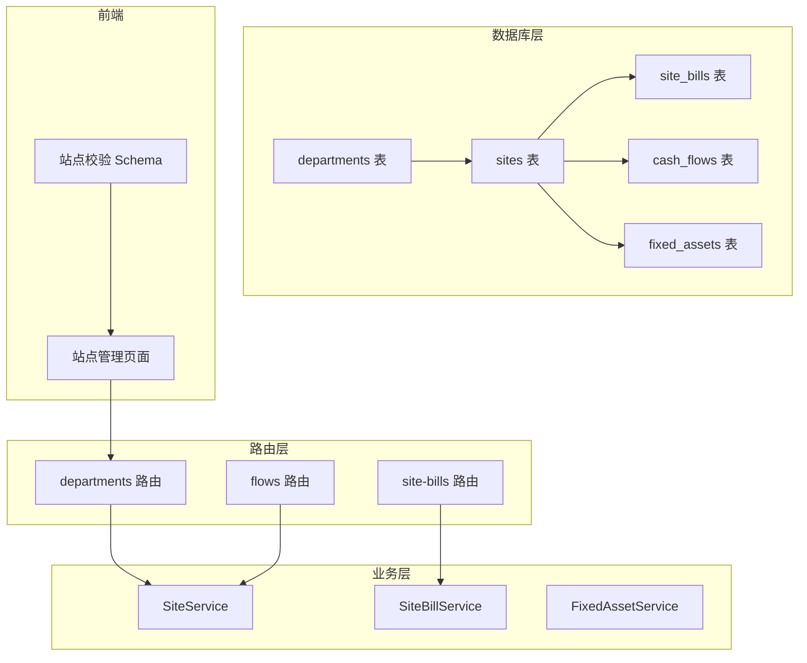
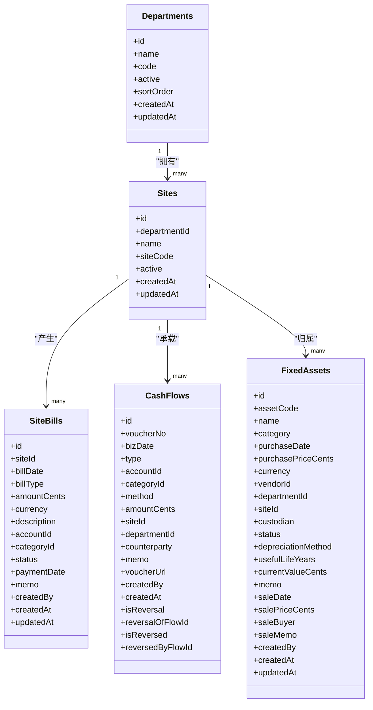
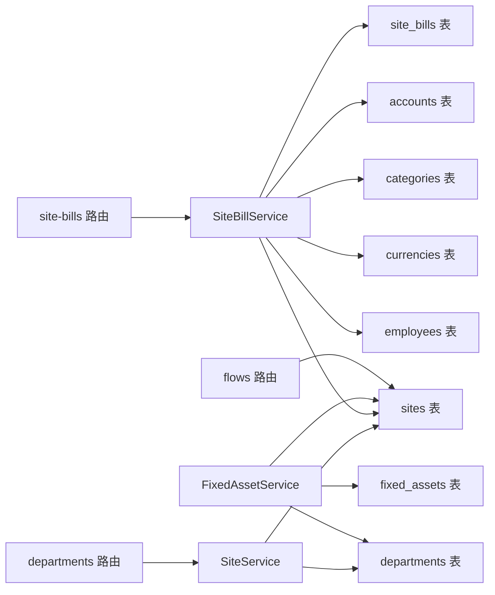

# 场地表 (sites)

<cite>
**本文引用的文件**
- [schema.ts](file://backend/src/db/schema.ts)
- [schema.sql](file://backend/src/db/schema.sql)
- [0000_snapshot.json](file://backend/drizzle/meta/0000_snapshot.json)
- [SiteService.ts](file://backend/src/services/SiteService.ts)
- [MasterDataService.ts](file://backend/src/services/MasterDataService.ts)
- [departments.ts](file://backend/src/routes/v2/master-data/departments.ts)
- [site-bills.ts](file://backend/src/routes/v2/site-bills.ts)
- [SiteBillService.ts](file://backend/src/services/SiteBillService.ts)
- [flows.ts](file://backend/src/routes/v2/flows.ts)
- [BusinessReportService.ts](file://backend/src/services/BusinessReportService.ts)
- [fixed-assets.ts](file://backend/src/routes/v2/fixed-assets.ts)
- [FixedAssetService.ts](file://backend/src/services/FixedAssetService.ts)
- [schema.ts（前端校验）](file://frontend/src/validations/site.schema.ts)
- [SiteManagementPage.tsx](file://frontend/src/features/sites/pages/SiteManagementPage.tsx)
</cite>

## 目录
1. [简介](#简介)
2. [项目结构](#项目结构)
3. [核心组件](#核心组件)
4. [架构总览](#架构总览)
5. [详细组件分析](#详细组件分析)
6. [依赖关系分析](#依赖关系分析)
7. [性能考量](#性能考量)
8. [故障排查指南](#故障排查指南)
9. [结论](#结论)
10. [附录](#附录)

## 简介
本文件系统性梳理“场地表 (sites)”的结构与使用，明确其字段语义、与“部门表 (departments)”的关联关系，并说明其在“场地账单 (site_bills)”与“固定资产 (fixed_assets)”等模块中的引用方式，以及在财务流水与报表中的成本核算落地路径。同时提供面向开发者的代码片段路径，帮助快速定位实现位置并进行二次开发或集成。

## 项目结构
- 数据库层：通过 Drizzle ORM 定义了 sites 表及与其关联的 cash_flows、site_bills、fixed_assets 等表。
- 业务层：SiteService、SiteBillService、FixedAssetService 等服务封装对表的增删改查与跨表联结查询。
- 路由层：departments 路由提供站点的 CRUD 接口；site-bills 路由提供场地账单接口；flows 路由在创建流水时根据 siteId 推导 departmentId。
- 前端层：SiteManagementPage 页面负责站点的增删改查与状态切换；前端校验 schema 对站点字段进行约束。

图表来源
- [schema.ts](file://backend/src/db/schema.ts#L333-L341)
- [schema.ts](file://backend/src/db/schema.ts#L478-L494)
- [schema.ts](file://backend/src/db/schema.ts#L159-L188)
- [schema.ts](file://backend/src/db/schema.ts#L506-L530)
- [SiteService.ts](file://backend/src/services/SiteService.ts#L1-L87)
- [SiteBillService.ts](file://backend/src/services/SiteBillService.ts#L1-L119)
- [FixedAssetService.ts](file://backend/src/services/FixedAssetService.ts#L1-L412)
- [departments.ts](file://backend/src/routes/v2/master-data/departments.ts#L240-L439)
- [site-bills.ts](file://backend/src/routes/v2/site-bills.ts#L1-L491)
- [flows.ts](file://backend/src/routes/v2/flows.ts#L326-L375)
- [SiteManagementPage.tsx](file://frontend/src/features/sites/pages/SiteManagementPage.tsx#L60-L213)
- [schema.ts（前端校验）](file://frontend/src/validations/site.schema.ts#L1-L14)

章节来源
- [schema.ts](file://backend/src/db/schema.ts#L333-L341)
- [schema.sql](file://backend/src/db/schema.sql#L471-L496)
- [0000_snapshot.json](file://backend/drizzle/meta/0000_snapshot.json#L3814-L3867)

## 核心组件
- 数据模型：sites 表包含 id、departmentId、name、siteCode、active、createdAt、updatedAt 等字段，其中 departmentId 作为外键指向 departments。
- 服务层：
  - SiteService：提供站点列表、创建、更新、删除能力，并在查询时拼接部门名称。
  - SiteBillService：围绕 site_bills 表进行查询、创建、更新、删除，并联结 sites、accounts、categories、currencies、employees 获取丰富信息。
  - FixedAssetService：在固定资产管理中使用 siteId 字段，支持按站点筛选与转移。
- 路由层：
  - departments 路由：提供站点的 CRUD 接口，权限控制与审计日志。
  - site-bills 路由：提供按站点维度的账单查询、创建、更新、删除。
  - flows 路由：在创建流水时，若仅提供 siteId，会回查 sites 表推导出 departmentId。
- 前端：
  - SiteManagementPage：站点管理界面，支持启用/停用、编辑、新建等。
  - 前端校验 schema：对站点字段进行长度、必填、URL 格式等约束。

章节来源
- [SiteService.ts](file://backend/src/services/SiteService.ts#L1-L87)
- [SiteBillService.ts](file://backend/src/services/SiteBillService.ts#L1-L119)
- [FixedAssetService.ts](file://backend/src/services/FixedAssetService.ts#L1-L412)
- [departments.ts](file://backend/src/routes/v2/master-data/departments.ts#L240-L439)
- [site-bills.ts](file://backend/src/routes/v2/site-bills.ts#L1-L491)
- [flows.ts](file://backend/src/routes/v2/flows.ts#L326-L375)
- [schema.ts（前端校验）](file://frontend/src/validations/site.schema.ts#L1-L14)
- [SiteManagementPage.tsx](file://frontend/src/features/sites/pages/SiteManagementPage.tsx#L60-L213)

## 架构总览
下图展示了站点表在系统中的角色与与其他模块的关系：

图表来源
- [schema.ts](file://backend/src/db/schema.ts#L333-L341)
- [schema.ts](file://backend/src/db/schema.ts#L478-L494)
- [schema.ts](file://backend/src/db/schema.ts#L159-L188)
- [schema.ts](file://backend/src/db/schema.ts#L506-L530)

## 详细组件分析

### 数据模型：sites 表
- 字段说明
  - id：主键，字符串类型。
  - departmentId：非空，外键，指向 departments.id。
  - name：非空，字符串，场地名称。
  - siteCode：可空，字符串，场地编号。
  - active：可空，默认 1，启用/停用标志。
  - createdAt/updatedAt：时间戳，用于审计与排序。
- 关系
  - 与 departments：一对多，一个部门可包含多个物理场地。
  - 与 site_bills：一对多，每个场地可有多条账单。
  - 与 cash_flows：一对多，每条流水可绑定到某个场地。
  - 与 fixed_assets：一对多，资产可归属到某场地。

章节来源
- [schema.ts](file://backend/src/db/schema.ts#L333-L341)
- [schema.sql](file://backend/src/db/schema.sql#L471-L496)
- [0000_snapshot.json](file://backend/drizzle/meta/0000_snapshot.json#L3814-L3867)

### 服务层：SiteService
- 能力
  - 列表：返回站点列表，并拼接部门名称。
  - 创建：校验同部门下同名站点唯一性后创建。
  - 更新：支持更新名称、部门、启用状态。
  - 删除：软/硬删除策略取决于业务需求。
- 查询细节
  - 使用 Map 将部门 id 映射为名称，减少多次联结。

章节来源
- [SiteService.ts](file://backend/src/services/SiteService.ts#L1-L87)

### 服务层：SiteBillService
- 能力
  - 按 id/列表查询：联结 sites、accounts、categories、currencies、employees，返回带名称的丰富结果。
  - 创建/更新/删除：标准 CRUD。
- 查询条件
  - 支持按 siteId、billDate 范围、billType、status 过滤。

章节来源
- [SiteBillService.ts](file://backend/src/services/SiteBillService.ts#L1-L119)

### 路由层：departments 路由（站点接口）
- 提供站点的 GET/POST/PUT/DELETE 接口，权限控制与审计日志。
- 前端页面 SiteManagementPage 与之对接。

章节来源
- [departments.ts](file://backend/src/routes/v2/master-data/departments.ts#L240-L439)
- [SiteManagementPage.tsx](file://frontend/src/features/sites/pages/SiteManagementPage.tsx#L60-L213)

### 路由层：site-bills 路由
- 提供按站点维度的账单查询、创建、更新、删除。
- 返回字段包含站点名称、站点编号、账户、分类、币种、创建人等。

章节来源
- [site-bills.ts](file://backend/src/routes/v2/site-bills.ts#L1-L491)

### 财务流水与部门推导：flows 路由
- 在创建流水时，若仅提供 siteId，会通过 SQL 查询 sites 表获取 departmentId 并写入流水记录。
- 便于后续按部门/站点进行财务核算与报表汇总。

章节来源
- [flows.ts](file://backend/src/routes/v2/flows.ts#L326-L375)

### 报表与成本核算：BusinessReportService
- 报表按站点维度统计收入/支出，联结 sites 与 cash_flows，支持按部门过滤。
- 可用于生成“站点级”财务报表，支撑成本分摊与预算执行分析。

章节来源
- [BusinessReportService.ts](file://backend/src/services/BusinessReportService.ts#L40-L141)

### 固定资产模块：FixedAssetService
- 固定资产表包含 siteId 字段，支持按站点筛选与转移。
- 前端固定资产管理页面也暴露 siteId 字段，便于资产与场地绑定。

章节来源
- [FixedAssetService.ts](file://backend/src/services/FixedAssetService.ts#L1-L412)
- [fixed-assets.ts](file://backend/src/routes/v2/fixed-assets.ts#L249-L287)

### 前端：站点管理页面与校验
- 页面支持启用/停用、编辑、新建、刷新等操作。
- 前端校验对字段长度、必填、URL 格式进行约束，确保数据质量。

章节来源
- [SiteManagementPage.tsx](file://frontend/src/features/sites/pages/SiteManagementPage.tsx#L60-L213)
- [schema.ts（前端校验）](file://frontend/src/validations/site.schema.ts#L1-L14)

## 依赖关系分析
- 组件耦合
  - SiteService 依赖 sites、departments。
  - SiteBillService 依赖 siteBills、sites、accounts、categories、currencies、employees。
  - FixedAssetService 依赖 fixedAssets、sites、departments 等。
  - flows 路由依赖 sites 表进行 departmentId 推导。
- 外部依赖
  - Drizzle ORM：统一的数据访问层。
  - 前端校验：Zod Schema，保障表单输入规范。

图表来源
- [SiteService.ts](file://backend/src/services/SiteService.ts#L1-L87)
- [SiteBillService.ts](file://backend/src/services/SiteBillService.ts#L1-L119)
- [FixedAssetService.ts](file://backend/src/services/FixedAssetService.ts#L1-L412)
- [flows.ts](file://backend/src/routes/v2/flows.ts#L326-L375)
- [departments.ts](file://backend/src/routes/v2/master-data/departments.ts#L240-L439)
- [site-bills.ts](file://backend/src/routes/v2/site-bills.ts#L1-L491)

## 性能考量
- 查询优化
  - 在 SiteBillService 中使用 LEFT JOIN 获取多表信息，建议在 siteId、billDate、status 等常用过滤字段上建立索引。
  - 在 BusinessReportService 中按站点统计时，确保 sites.id 与 cash_flows.siteId 的联结高效。
- 写入优化
  - flows 路由在创建流水时进行一次站点查询以推导 departmentId，建议缓存部门映射或在批量导入时预计算。
- 前端渲染
  - 站点列表在前端页面中进行二次过滤（如 activeOnly、search），建议后端提供更细粒度的过滤参数以减少传输。

## 故障排查指南
- 站点重复
  - 现象：创建站点时报重名错误。
  - 原因：同部门下同名站点唯一性校验触发。
  - 处理：修改名称或选择不同部门。
- 权限不足
  - 现象：调用站点/账单接口返回 403。
  - 原因：缺少相应权限。
  - 处理：检查用户权限配置。
- 流水部门缺失
  - 现象：创建流水时 departmentId 为空导致后续报表异常。
  - 原因：仅提供了 siteId。
  - 处理：在创建流水时提供 departmentId，或依赖路由自动推导逻辑。

章节来源
- [SiteService.ts](file://backend/src/services/SiteService.ts#L35-L61)
- [departments.ts](file://backend/src/routes/v2/master-data/departments.ts#L317-L346)
- [site-bills.ts](file://backend/src/routes/v2/site-bills.ts#L311-L369)
- [flows.ts](file://backend/src/routes/v2/flows.ts#L326-L375)

## 结论
sites 表作为物理场地的抽象，在系统中承担着“成本核算与资产管理”的基础角色。通过与 departments、site_bills、cash_flows、fixed_assets 的紧密协作，实现了从“场地账单”到“财务流水”再到“资产登记”的闭环。建议在生产环境中完善索引、权限与审计机制，并结合前端校验与路由推导，确保数据一致性与可追溯性。

## 附录

### 实际代码示例（路径）
- 站点表定义（Drizzle ORM）
  - [sites 表定义](file://backend/src/db/schema.ts#L333-L341)
- 站点表定义（SQL）
  - [sites 表定义（SQL）](file://backend/src/db/schema.sql#L471-L496)
- 站点表快照（Drizzle 元数据）
  - [sites 快照](file://backend/drizzle/meta/0000_snapshot.json#L3814-L3867)
- 站点服务（CRUD 与联结）
  - [SiteService](file://backend/src/services/SiteService.ts#L1-L87)
- 站点账单服务（联结查询）
  - [SiteBillService](file://backend/src/services/SiteBillService.ts#L1-L119)
- 站点账单路由（查询/创建/更新/删除）
  - [site-bills 路由](file://backend/src/routes/v2/site-bills.ts#L1-L491)
- 部门路由（站点 CRUD）
  - [departments 路由（站点接口）](file://backend/src/routes/v2/master-data/departments.ts#L240-L439)
- 财务流水（departmentId 推导）
  - [flows 路由（创建流水）](file://backend/src/routes/v2/flows.ts#L326-L375)
- 报表（按站点统计）
  - [BusinessReportService](file://backend/src/services/BusinessReportService.ts#L40-L141)
- 固定资产（按站点筛选/转移）
  - [FixedAssetService](file://backend/src/services/FixedAssetService.ts#L1-L412)
  - [fixed-assets 路由](file://backend/src/routes/v2/fixed-assets.ts#L249-L287)
- 前端站点校验
  - [站点校验 Schema](file://frontend/src/validations/site.schema.ts#L1-L14)
- 前端站点管理页面
  - [站点管理页面](file://frontend/src/features/sites/pages/SiteManagementPage.tsx#L60-L213)