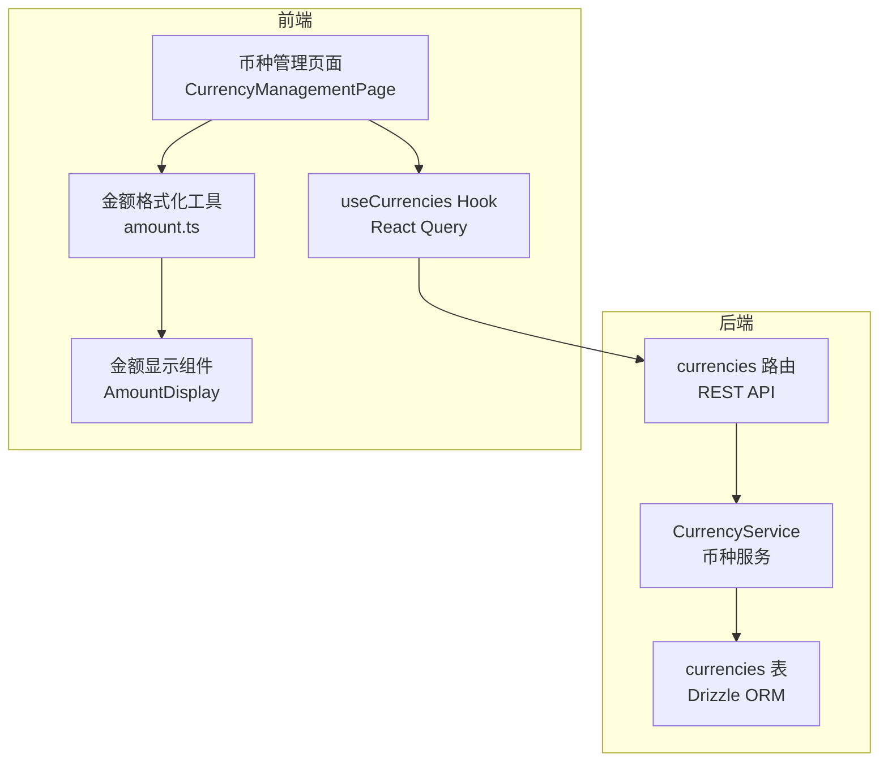
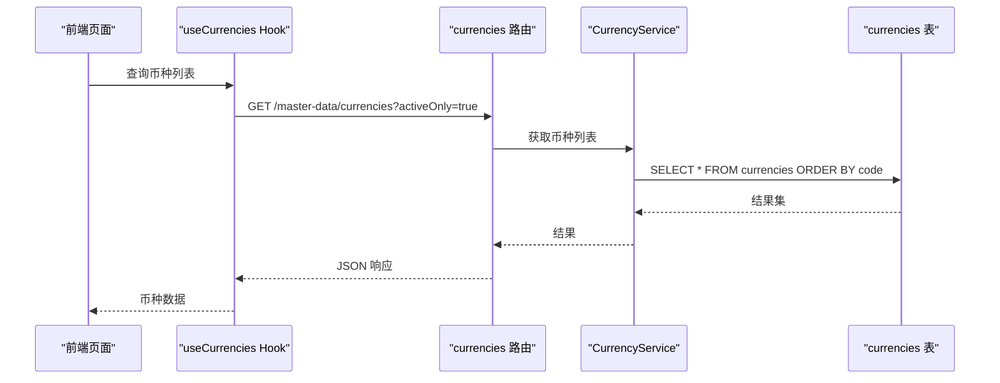
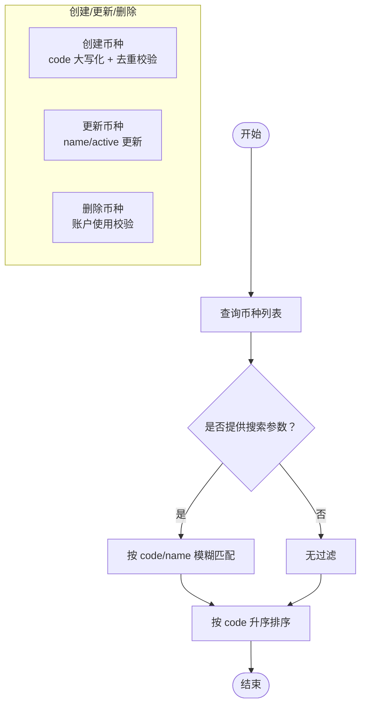
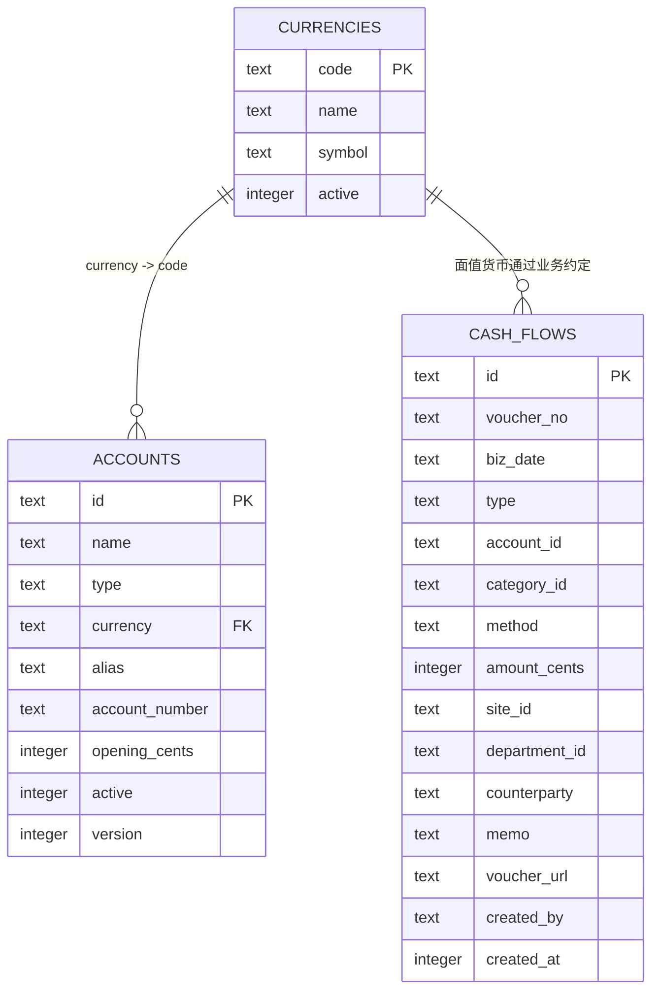
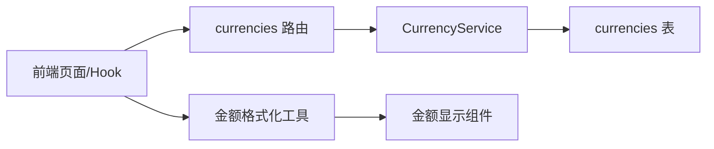

# 币种表 (currencies)

<cite>
**本文引用的文件**
- [schema.ts](file://backend/src/db/schema.ts)
- [schema.sql](file://backend/src/db/schema.sql)
- [0000_snapshot.json](file://backend/drizzle/meta/0000_snapshot.json)
- [CurrencyService.ts](file://backend/src/services/CurrencyService.ts)
- [currencies.ts](file://backend/src/routes/v2/master-data/currencies.ts)
- [CurrencyManagementPage.tsx](file://frontend/src/features/system/pages/CurrencyManagementPage.tsx)
- [useCurrencies.ts](file://frontend/src/hooks/business/useCurrencies.ts)
- [amount.ts](file://frontend/src/utils/amount.ts)
- [AmountDisplay.tsx](file://frontend/src/components/common/AmountDisplay.tsx)
- [AccountService.ts](file://backend/src/services/AccountService.ts)
- [AccountTransferService.test.ts](file://backend/test/services/AccountTransferService.test.ts)
- [SystemService.ts](file://backend/src/services/SystemService.ts)
- [currency.schema.ts](file://frontend/src/validations/currency.schema.ts)
- [CurrencyService.test.ts](file://backend/test/services/CurrencyService.test.ts)
</cite>

## 目录
1. [简介](#简介)
2. [项目结构与定位](#项目结构与定位)
3. [核心组件与职责](#核心组件与职责)
4. [架构总览](#架构总览)
5. [详细组件分析](#详细组件分析)
6. [依赖关系分析](#依赖关系分析)
7. [性能与扩展性](#性能与扩展性)
8. [故障排查指南](#故障排查指南)
9. [结论](#结论)
10. [附录：主要币种清单](#附录主要币种清单)

## 简介
本文件系统性地阐述“币种表（currencies）”的设计与实现，覆盖表结构、字段语义、业务约束、前后端集成方式，以及其在多财务子系统中的支撑作用。重点说明：
- code 字段作为主键与 ISO 货币代码的标准化作用
- symbol 字段在前端金额显示中的应用
- 与 accounts、cash_flows、salary_payments 等财务相关表的关联关系
- 通过服务层与路由层提供的增删改查与批量操作能力
- 默认币种初始化策略与前端校验规则

## 项目结构与定位
- 表定义位于后端数据库模式文件中，采用 Drizzle ORM 的 sqliteTable 定义，同时保留 schema.sql 的 SQL 版本以确保迁移一致性。
- 服务层提供币种管理能力，路由层暴露 REST API，前端通过 Hook 与页面组件消费数据。
- 前端金额显示统一由工具函数与组件负责，结合币种表的 code 与可选 symbol 字段进行格式化。

图表来源
- [schema.ts](file://backend/src/db/schema.ts#L213-L218)
- [CurrencyService.ts](file://backend/src/services/CurrencyService.ts#L1-L76)
- [currencies.ts](file://backend/src/routes/v2/master-data/currencies.ts#L1-L318)
- [CurrencyManagementPage.tsx](file://frontend/src/features/system/pages/CurrencyManagementPage.tsx#L1-L238)
- [useCurrencies.ts](file://frontend/src/hooks/business/useCurrencies.ts#L1-L122)
- [amount.ts](file://frontend/src/utils/amount.ts#L1-L104)
- [AmountDisplay.tsx](file://frontend/src/components/common/AmountDisplay.tsx#L1-L50)

章节来源
- [schema.ts](file://backend/src/db/schema.ts#L213-L218)
- [schema.sql](file://backend/src/db/schema.sql#L173-L228)
- [0000_snapshot.json](file://backend/drizzle/meta/0000_snapshot.json#L1084-L1122)

## 核心组件与职责
- 币种表（currencies）
  - 主键：code（文本，非空，唯一）
  - 名称：name（文本，非空）
  - 符号：symbol（文本，可空）
  - 状态：active（整数，默认 1，0/1 表示停用/启用）
- 币种服务（CurrencyService）
  - 提供查询、创建、更新、删除、批量操作等能力
  - 对币种代码进行大小写规范化（统一转为大写）
  - 删除前校验是否仍有账户使用
- 币种路由（currencies 路由）
  - 提供币种列表、创建、更新、删除、批量操作接口
  - 支持按 activeOnly 与 search 参数过滤
  - 使用查询缓存与审计日志
- 前端页面与 Hook
  - 页面支持搜索、筛选、启用/停用切换、删除
  - Hook 提供币种列表与下拉选项查询，自动失效缓存
- 金额显示工具
  - 提供基于币种代码与符号的金额格式化能力
  - 组件统一渲染金额，支持精度与符号开关

章节来源
- [CurrencyService.ts](file://backend/src/services/CurrencyService.ts#L1-L76)
- [currencies.ts](file://backend/src/routes/v2/master-data/currencies.ts#L1-L318)
- [CurrencyManagementPage.tsx](file://frontend/src/features/system/pages/CurrencyManagementPage.tsx#L1-L238)
- [useCurrencies.ts](file://frontend/src/hooks/business/useCurrencies.ts#L1-L122)
- [amount.ts](file://frontend/src/utils/amount.ts#L1-L104)
- [AmountDisplay.tsx](file://frontend/src/components/common/AmountDisplay.tsx#L1-L50)

## 架构总览
币种表作为主数据的核心之一，贯穿以下关键路径：
- 创建/更新账户时，校验币种是否有效且启用
- 流水与转账等财务交易以“分”为最小单位存储，但以币种代码标识面值货币
- 前端金额显示统一通过币种表的 code 与 symbol 进行格式化

图表来源
- [currencies.ts](file://backend/src/routes/v2/master-data/currencies.ts#L1-L120)
- [CurrencyService.ts](file://backend/src/services/CurrencyService.ts#L1-L26)
- [schema.ts](file://backend/src/db/schema.ts#L213-L218)

## 详细组件分析

### 表结构与字段语义
- code（主键）
  - 类型：文本
  - 约束：非空、主键
  - 用途：作为币种的标准化标识，通常采用 ISO 货币代码风格（如 CNY、USD、EUR），便于跨系统一致识别
- name
  - 类型：文本
  - 约束：非空
  - 用途：币种的中文名称，用于前端展示与用户理解
- symbol
  - 类型：文本
  - 约束：可空
  - 用途：前端金额显示时的货币符号，如 ¥、$、€；若为空则回退到 code 或自定义映射
- active
  - 类型：整数
  - 约束：默认 1（启用）
  - 用途：控制币种是否可用；路由与服务层均支持按 activeOnly 过滤与停用操作

章节来源
- [schema.ts](file://backend/src/db/schema.ts#L213-L218)
- [schema.sql](file://backend/src/db/schema.sql#L173-L228)
- [0000_snapshot.json](file://backend/drizzle/meta/0000_snapshot.json#L1084-L1122)

### 服务层：币种管理
- 查询币种列表
  - 支持按 code/name 模糊搜索（大小写不敏感）
  - 默认按 code 升序排序
- 创建币种
  - 自动将 code 转为大写
  - 拒绝重复的币种代码（大小写不敏感）
- 更新币种
  - 支持更新 name 与 active
  - 大小写不敏感更新
- 删除币种
  - 若仍有账户使用，则拒绝删除
  - 成功删除后返回币种名称
- 批量操作
  - 支持批量删除、启用/停用等操作（权限控制）

图表来源
- [CurrencyService.ts](file://backend/src/services/CurrencyService.ts#L1-L76)
- [CurrencyService.test.ts](file://backend/test/services/CurrencyService.test.ts#L1-L228)

章节来源
- [CurrencyService.ts](file://backend/src/services/CurrencyService.ts#L1-L76)
- [CurrencyService.test.ts](file://backend/test/services/CurrencyService.test.ts#L1-L228)

### 路由层：REST API
- GET /master-data/currencies
  - 查询参数：activeOnly（true/false）、search（字符串）
  - 响应：results 数组，元素为币种对象
  - 缓存策略：命中后端过滤 activeOnly，异步更新缓存
- POST /master-data/currencies
  - 请求体：code、name
  - 成功：返回创建后的币种对象
  - 清理币种列表缓存
- PUT /master-data/currencies/{code}
  - 请求体：name、active
  - 成功：返回空对象
  - 清理币种列表缓存
- DELETE /master-data/currencies/{code}
  - 成功：返回空对象
  - 清理币种列表缓存
- POST /master-data/currencies/batch
  - 请求体：operation（delete/activate/deactivate）、ids[]
  - 成功：返回批量操作结果

章节来源
- [currencies.ts](file://backend/src/routes/v2/master-data/currencies.ts#L1-L318)

### 前端：页面与 Hook
- 页面功能
  - 支持按 code/name 搜索与按启用/停用筛选
  - 支持启用/停用切换与删除
  - 新增/编辑弹窗，表单校验遵循 schema
- Hook
  - useCurrencies：查询币种列表，支持 activeOnly 过滤
  - useCurrencyOptions：生成下拉选项（code - name）
  - 提交后自动失效查询缓存，保证数据一致性

章节来源
- [CurrencyManagementPage.tsx](file://frontend/src/features/system/pages/CurrencyManagementPage.tsx#L1-L238)
- [useCurrencies.ts](file://frontend/src/hooks/business/useCurrencies.ts#L1-L122)
- [currency.schema.ts](file://frontend/src/validations/currency.schema.ts#L1-L12)

### 金额显示与币种符号
- 前端金额格式化工具
  - 支持将“分”转换为“元”，并按币种代码选择符号
  - 当 symbol 存在时优先使用；否则回退到 code 或自定义映射
- 金额显示组件
  - 统一渲染金额，支持精度与符号开关
  - 与币种表的 code/symbol 字段配合，实现一致的前端展示

章节来源
- [amount.ts](file://frontend/src/utils/amount.ts#L1-L104)
- [AmountDisplay.tsx](file://frontend/src/components/common/AmountDisplay.tsx#L1-L50)

### 与财务相关表的引用关系
- accounts
  - currency 字段引用 currencies.code
  - 创建/更新账户时会校验币种是否有效且启用
- cash_flows
  - 金额以“分”存储，但业务上以币种代码标识面值货币
  - 与 accounts 的 currency 字段共同决定金额的货币维度
- salary_payments / salary_payment_allocations
  - 以币种代码标识薪资支付的货币
- 其他财务表
  - 如 allowance_payments、expense_reimbursements、borrowings、repayments、site_bills、rental_payments 等，均以币种代码标识面值货币

图表来源
- [schema.ts](file://backend/src/db/schema.ts#L139-L218)
- [schema.sql](file://backend/src/db/schema.sql#L173-L228)
- [0000_snapshot.json](file://backend/drizzle/meta/0000_snapshot.json#L190-L264)

章节来源
- [schema.ts](file://backend/src/db/schema.ts#L139-L218)
- [schema.sql](file://backend/src/db/schema.sql#L173-L228)
- [AccountService.ts](file://backend/src/services/AccountService.ts#L81-L166)
- [AccountTransferService.test.ts](file://backend/test/services/AccountTransferService.test.ts#L114-L161)

## 依赖关系分析
- 服务层对数据库层的依赖
  - CurrencyService 直接使用 Drizzle ORM 查询 currencies 表
  - 在删除币种前检查 accounts 表是否存在使用该币种的账户
- 路由层对服务层的依赖
  - 路由处理函数调用服务层方法，完成业务逻辑
  - 使用查询缓存与审计日志
- 前端对后端的依赖
  - 页面与 Hook 通过 API 获取币种数据
  - 表单校验与权限控制在前端完成，后端同样进行权限与业务校验

图表来源
- [currencies.ts](file://backend/src/routes/v2/master-data/currencies.ts#L1-L318)
- [CurrencyService.ts](file://backend/src/services/CurrencyService.ts#L1-L76)
- [schema.ts](file://backend/src/db/schema.ts#L213-L218)
- [useCurrencies.ts](file://frontend/src/hooks/business/useCurrencies.ts#L1-L122)
- [amount.ts](file://frontend/src/utils/amount.ts#L1-L104)
- [AmountDisplay.tsx](file://frontend/src/components/common/AmountDisplay.tsx#L1-L50)

章节来源
- [currencies.ts](file://backend/src/routes/v2/master-data/currencies.ts#L1-L318)
- [CurrencyService.ts](file://backend/src/services/CurrencyService.ts#L1-L76)
- [useCurrencies.ts](file://frontend/src/hooks/business/useCurrencies.ts#L1-L122)

## 性能与扩展性
- 查询缓存
  - 路由层对币种列表使用查询缓存，支持按 search 参数生成缓存键
  - 支持后端过滤 activeOnly，减少前端负担
- 列表排序
  - 默认按 code 升序，利于前端排序与展示
- 批量操作
  - 提供批量删除/启用/停用，降低多次请求开销
- 前端缓存失效
  - 新增/更新/删除后主动失效相关查询缓存，保证一致性

章节来源
- [currencies.ts](file://backend/src/routes/v2/master-data/currencies.ts#L1-L120)
- [useCurrencies.ts](file://frontend/src/hooks/business/useCurrencies.ts#L1-L122)

## 故障排查指南
- 创建币种报错“已存在”
  - 可能原因：币种代码重复（大小写不敏感）
  - 解决方案：更换唯一 code 或确认是否已有同名币种
- 删除币种报错“无法删除，该币种还有账户使用”
  - 可能原因：仍有账户使用该币种
  - 解决方案：先迁移或删除相关账户，再尝试删除币种
- 更新币种时报错“不存在”
  - 可能原因：传入的 code 不存在或大小写不匹配
  - 解决方案：确认币种 code 是否正确，或先创建币种
- 前端金额显示异常
  - 可能原因：symbol 为空或币种代码不在映射表中
  - 解决方案：在币种表中补充 symbol，或调整前端映射逻辑

章节来源
- [CurrencyService.test.ts](file://backend/test/services/CurrencyService.test.ts#L1-L228)
- [CurrencyService.ts](file://backend/src/services/CurrencyService.ts#L1-L76)
- [amount.ts](file://frontend/src/utils/amount.ts#L1-L104)

## 结论
currencies 表通过 code（主键）与 name/symbol 字段，为系统提供了标准化、可扩展的多币种支持。服务层与路由层提供了完善的增删改查与批量操作能力，前端通过统一的金额格式化工具与组件，实现了良好的用户体验。与 accounts、cash_flows、salary_payments 等财务表的协作，使得金额的货币维度清晰明确，便于后续扩展与维护。

## 附录：主要币种清单
- 默认币种
  - CNY：人民币
  - USD：美元
- 其他常见币种（示例）
  - EUR：欧元
  - JPY：日元
  - HKD：港币
  - SGD：新加坡元
  - THB：泰铢
  - KRW：韩元
  - AUD：澳大利亚元
  - CAD：加拿大元
  - GBP：英镑
  - INR：印度卢比
  - VND：越南盾
  - IDR：印尼盾
  - MYR：马来西亚林吉特
  - PHP：菲律宾比索
  - TWD：新台币
  - SEK：瑞典克朗
  - NOK：挪威克朗
  - DKK：丹麦克朗
  - CHF：瑞士法郎
  - RUB：俄罗斯卢布
  - BRL：巴西雷亚尔
  - MXN：墨西哥比索
  - CLP：智利比索
  - COP：哥伦比亚比索
  - PEN：秘鲁索尔
  - ARS：阿根廷比索
  - ZAR：南非兰特
  - TRY：土耳其里拉
  - ILS：以色列谢克尔
  - AED：阿联酋迪拉姆
  - SAR：沙特里亚尔
  - QAR：卡塔尔里亚尔
  - KWD：科威特第纳尔
  - BHD：巴林第纳尔
  - OMR：阿曼里亚尔
  - YER：也门里亚尔
  - IQD：伊拉克第纳尔
  - LBP：黎巴嫩镑
  - EGP：埃及镑
  - MAD：摩洛哥迪拉姆
  - XAU：黄金（以金衡盎司计）
  - XAG：白银（以金衡盎司计）
  - USDT：泰达币（稳定币）

说明
- 上述列表为示例性汇总，具体可用币种以系统实际维护为准
- 建议在新增币种时，同时维护 symbol 字段，以便前端金额显示更友好

章节来源
- [SystemService.ts](file://backend/src/services/SystemService.ts#L45-L71)
- [CurrencyService.test.ts](file://backend/test/services/CurrencyService.test.ts#L1-L228)
- [amount.ts](file://frontend/src/utils/amount.ts#L1-L104)