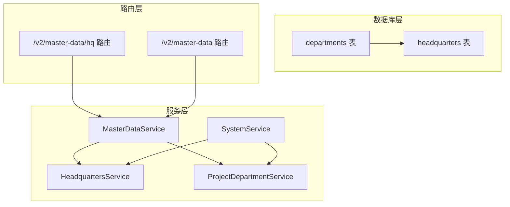
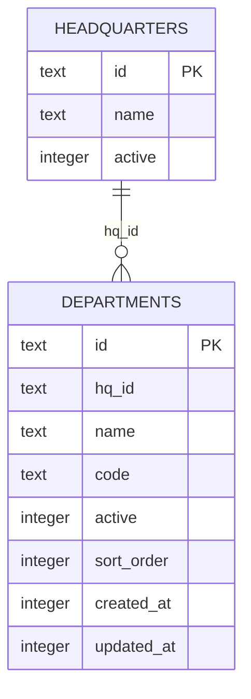
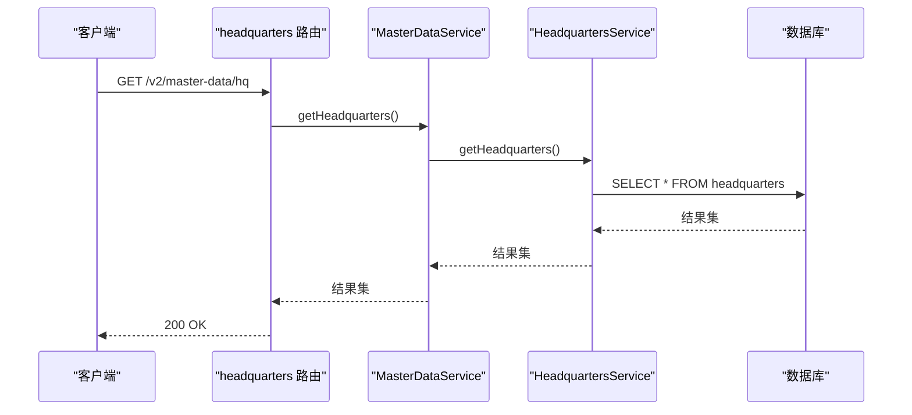
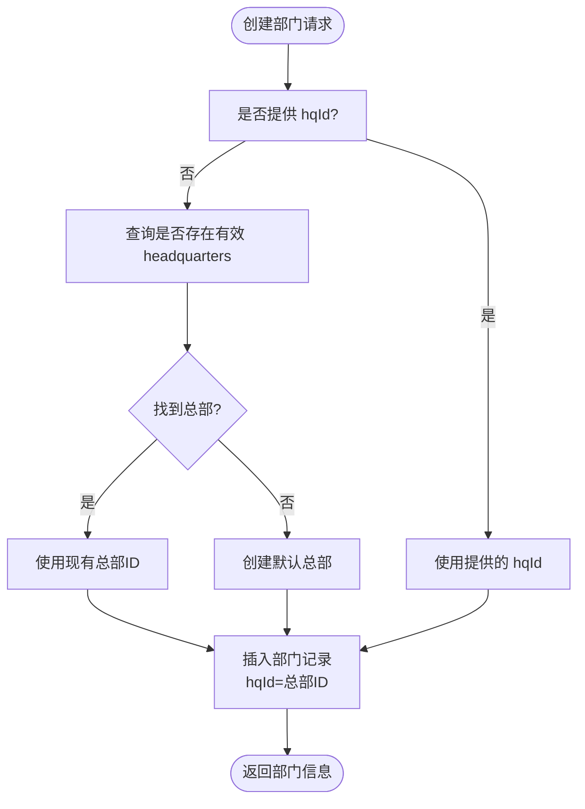
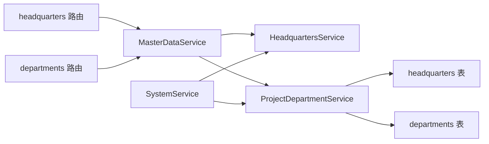

# 总部/项目表 (headquarters)

<cite>
**本文引用的文件**
- [schema.ts](file://backend/src/db/schema.ts)
- [schema.sql](file://backend/src/db/schema.sql)
- [headquarters.ts](file://backend/src/routes/v2/master-data/headquarters.ts)
- [HeadquartersService.ts](file://backend/src/services/HeadquartersService.ts)
- [MasterDataService.ts](file://backend/src/services/MasterDataService.ts)
- [departments.ts](file://backend/src/routes/v2/master-data/departments.ts)
- [ProjectDepartmentService.ts](file://backend/src/services/ProjectDepartmentService.ts)
- [SystemService.ts](file://backend/src/services/SystemService.ts)
- [generate-seed.ts](file://backend/scripts/generate-seed.ts)
- [migration_update_hq_org_departments.sql](file://backend/src/db/migration_update_hq_org_departments.sql)
- [migrate_hq_org_departments.ts](file://backend/src/db/migrate_hq_org_departments.ts)
- [master-data.ts](file://backend/src/routes/v2/master-data.ts)
</cite>

## 目录
1. [简介](#简介)
2. [项目结构](#项目结构)
3. [核心组件](#核心组件)
4. [架构总览](#架构总览)
5. [详细组件分析](#详细组件分析)
6. [依赖关系分析](#依赖关系分析)
7. [性能考量](#性能考量)
8. [故障排查指南](#故障排查指南)
9. [结论](#结论)
10. [附录](#附录)

## 简介
本文件聚焦“总部/项目表”（headquarters），系统性阐述其表结构、字段语义、在两级组织架构中的作用，以及如何通过 departments 表的 hq_id 字段与之关联，从而支撑“总部/项目 → 部门”的组织模型。同时说明该设计如何支持多项目或多分公司的管理模式，并给出表定义与系统内引用路径，帮助读者快速理解并正确使用。

## 项目结构
围绕 headquarters 表，涉及以下关键文件与职责：
- 数据库定义：schema.ts 与 schema.sql 定义了 headquarters 表及 departments 表的结构
- 路由层：headquarters 路由提供总部列表查询、更新、删除接口；部门路由提供部门 CRUD
- 服务层：HeadquartersService 提供总部查询、更新、软删除；MasterDataService 作为门面聚合调用
- 业务逻辑：ProjectDepartmentService 在创建部门时可自动选择或创建默认总部；SystemService 可确保系统启动时存在默认总部并创建默认组织部门
- 迁移与种子：迁移脚本与种子脚本演示了总部与部门的初始化与演进

图表来源
- [schema.ts](file://backend/src/db/schema.ts#L65-L81)
- [headquarters.ts](file://backend/src/routes/v2/master-data/headquarters.ts#L1-L166)
- [departments.ts](file://backend/src/routes/v2/master-data/departments.ts#L1-L439)
- [HeadquartersService.ts](file://backend/src/services/HeadquartersService.ts#L1-L45)
- [MasterDataService.ts](file://backend/src/services/MasterDataService.ts#L1-L261)
- [ProjectDepartmentService.ts](file://backend/src/services/ProjectDepartmentService.ts#L1-L123)
- [SystemService.ts](file://backend/src/services/SystemService.ts#L1-L43)

章节来源
- [schema.ts](file://backend/src/db/schema.ts#L65-L81)
- [schema.sql](file://backend/src/db/schema.sql#L141-L146)
- [headquarters.ts](file://backend/src/routes/v2/master-data/headquarters.ts#L1-L166)
- [departments.ts](file://backend/src/routes/v2/master-data/departments.ts#L1-L439)
- [MasterDataService.ts](file://backend/src/services/MasterDataService.ts#L1-L261)
- [HeadquartersService.ts](file://backend/src/services/HeadquartersService.ts#L1-L45)
- [ProjectDepartmentService.ts](file://backend/src/services/ProjectDepartmentService.ts#L1-L123)
- [SystemService.ts](file://backend/src/services/SystemService.ts#L1-L43)

## 核心组件
- headquarters 表
  - 字段
    - id：主键，文本型唯一标识
    - name：非空字符串，总部/项目的名称
    - active：整数，默认 1，0 表示停用/软删除
  - 作用：作为最高层级组织单元，可代表“总部”或“项目”，统一被 departments 表引用
- departments 表
  - 关键字段
    - id：主键
    - hqId：外键指向 headquarters.id，表示该部门所属的总部/项目
    - name、code、active、sortOrder、createdAt、updatedAt
  - 作用：承载具体业务部门，通过 hqId 归属到 headquarters

章节来源
- [schema.ts](file://backend/src/db/schema.ts#L65-L81)
- [schema.sql](file://backend/src/db/schema.sql#L66-L76)
- [headquarters.ts](file://backend/src/routes/v2/master-data/headquarters.ts#L1-L166)
- [departments.ts](file://backend/src/routes/v2/master-data/departments.ts#L1-L439)

## 架构总览
两级组织架构“总部/项目 → 部门”的核心在于：
- headquarters 作为最高层级，可同时代表“总部”和“项目”
- departments.hq_id 指向 headquarters.id，形成一对多关系
- 业务上，departments 用于承载具体业务单元；headquarters 用于标识组织层级的根节点

图表来源
- [schema.ts](file://backend/src/db/schema.ts#L65-L81)
- [schema.sql](file://backend/src/db/schema.sql#L66-L76)

## 详细组件分析

### 表定义与字段语义
- headquarters
  - id：全局唯一标识，驱动其他表的关联
  - name：组织名称，支持“总部”或“项目”等命名
  - active：启用/停用标志，0 表示停用
- departments
  - hqId：指向 headquarters.id，决定部门归属
  - name/code：部门名称与编码
  - active/sortOrder：控制可见性与排序
  - createdAt/updatedAt：审计时间戳

章节来源
- [schema.ts](file://backend/src/db/schema.ts#L65-L81)
- [schema.sql](file://backend/src/db/schema.sql#L141-L146)

### 路由与服务交互流程（总部）
- 列表查询：headquarters 路由 -> MasterDataService -> HeadquartersService -> 数据库
- 更新/删除：权限校验 -> MasterDataService -> HeadquartersService -> 数据库

图表来源
- [headquarters.ts](file://backend/src/routes/v2/master-data/headquarters.ts#L1-L166)
- [MasterDataService.ts](file://backend/src/services/MasterDataService.ts#L156-L169)
- [HeadquartersService.ts](file://backend/src/services/HeadquartersService.ts#L14-L16)

章节来源
- [headquarters.ts](file://backend/src/routes/v2/master-data/headquarters.ts#L1-L166)
- [MasterDataService.ts](file://backend/src/services/MasterDataService.ts#L156-L169)
- [HeadquartersService.ts](file://backend/src/services/HeadquartersService.ts#L14-L16)

### 部门创建与总部关联（自动默认总部）
- 当创建部门未显式传入 hqId 时，系统会：
  - 查找现有 headquarters 记录
  - 若无则自动创建默认总部（名称可为“总部”或“Default HQ”）
  - 以该总部 ID 作为部门的 hqId

图表来源
- [ProjectDepartmentService.ts](file://backend/src/services/ProjectDepartmentService.ts#L75-L108)
- [SystemService.ts](file://backend/src/services/SystemService.ts#L12-L43)

章节来源
- [ProjectDepartmentService.ts](file://backend/src/services/ProjectDepartmentService.ts#L75-L108)
- [SystemService.ts](file://backend/src/services/SystemService.ts#L12-L43)

### 多项目/多分公司管理模式
- 设计要点
  - headquarters 可同时代表“总部”和“项目”，便于统一管理
  - departments.hq_id 指向 headquarters.id，天然支持多项目/多分公司的组织形态
  - 业务上，departments 作为最小业务单元，hq_id 决定其归属
- 实践建议
  - 为每个项目创建一条 headquarters 记录，部门均以其 hq_id 归属
  - 通过 active 控制项目启停，不影响历史数据
  - 通过 sortOrder 控制项目/部门显示顺序

章节来源
- [schema.ts](file://backend/src/db/schema.ts#L65-L81)
- [departments.ts](file://backend/src/routes/v2/master-data/departments.ts#L1-L439)
- [ProjectDepartmentService.ts](file://backend/src/services/ProjectDepartmentService.ts#L75-L108)

### 表定义与系统内引用路径
- 表定义
  - headquarters：见 schema.ts 与 schema.sql 中的 CREATE TABLE
  - departments：见 schema.ts 与 schema.sql 中的 CREATE TABLE
- 系统内引用
  - 路由：/v2/master-data/hq（总部）、/v2/master-data（部门/站点）
  - 服务：MasterDataService 聚合调用；HeadquartersService 直接操作 headquarters
  - 业务：ProjectDepartmentService 在创建部门时自动处理总部关联
  - 初始化：SystemService 可确保系统启动时存在默认总部；generate-seed.ts 提供示例数据

章节来源
- [schema.ts](file://backend/src/db/schema.ts#L65-L81)
- [schema.sql](file://backend/src/db/schema.sql#L141-L146)
- [headquarters.ts](file://backend/src/routes/v2/master-data/headquarters.ts#L1-L166)
- [departments.ts](file://backend/src/routes/v2/master-data/departments.ts#L1-L439)
- [MasterDataService.ts](file://backend/src/services/MasterDataService.ts#L156-L169)
- [HeadquartersService.ts](file://backend/src/services/HeadquartersService.ts#L14-L16)
- [ProjectDepartmentService.ts](file://backend/src/services/ProjectDepartmentService.ts#L75-L108)
- [SystemService.ts](file://backend/src/services/SystemService.ts#L12-L43)
- [generate-seed.ts](file://backend/scripts/generate-seed.ts#L2-L17)

## 依赖关系分析
- 路由层依赖服务层
  - headquarters 路由 -> MasterDataService -> HeadquartersService
  - departments 路由 -> MasterDataService -> ProjectDepartmentService
- 服务层依赖数据库层
  - 通过 Drizzle ORM 对 headquarters/departments 表进行读写
- 业务层依赖
  - SystemService 与 ProjectDepartmentService 协作，保证系统启动时存在默认总部并创建默认组织部门
- 迁移与演进
  - 迁移脚本与 SQL 文件指导 org_departments 的项目 ID 从 NULL 迁移到总部部门 ID

图表来源
- [headquarters.ts](file://backend/src/routes/v2/master-data/headquarters.ts#L1-L166)
- [departments.ts](file://backend/src/routes/v2/master-data/departments.ts#L1-L439)
- [MasterDataService.ts](file://backend/src/services/MasterDataService.ts#L1-L261)
- [HeadquartersService.ts](file://backend/src/services/HeadquartersService.ts#L1-L45)
- [ProjectDepartmentService.ts](file://backend/src/services/ProjectDepartmentService.ts#L1-L123)
- [SystemService.ts](file://backend/src/services/SystemService.ts#L1-L43)

章节来源
- [headquarters.ts](file://backend/src/routes/v2/master-data/headquarters.ts#L1-L166)
- [departments.ts](file://backend/src/routes/v2/master-data/departments.ts#L1-L439)
- [MasterDataService.ts](file://backend/src/services/MasterDataService.ts#L1-L261)
- [HeadquartersService.ts](file://backend/src/services/HeadquartersService.ts#L1-L45)
- [ProjectDepartmentService.ts](file://backend/src/services/ProjectDepartmentService.ts#L1-L123)
- [SystemService.ts](file://backend/src/services/SystemService.ts#L1-L43)

## 性能考量
- 索引与查询
  - departments 表包含 sort_order、name 等字段，适合按排序与名称检索
  - 可根据业务需要在 hq_id 上建立索引以优化按总部/项目筛选
- 缓存策略
  - 部门列表接口已采用查询缓存，减少重复查询开销
- 软删除
  - 通过 active 字段实现软删除，避免物理删除带来的数据回溯成本

章节来源
- [departments.ts](file://backend/src/routes/v2/master-data/departments.ts#L1-L439)
- [schema.ts](file://backend/src/db/schema.ts#L65-L81)

## 故障排查指南
- 总部不存在或被停用
  - 现象：创建部门时报错或找不到默认总部
  - 排查：确认 headquarters 是否存在且 active=1；必要时通过 SystemService 创建默认总部
- 更新/删除权限不足
  - 现象：调用更新/删除接口返回权限错误
  - 排查：确认用户权限是否包含 system.headquarters.update 或 system.headquarters.delete
- 部门重名冲突
  - 现象：更新部门名称时报重名错误
  - 排查：确保同级部门名称唯一

章节来源
- [HeadquartersService.ts](file://backend/src/services/HeadquartersService.ts#L18-L42)
- [headquarters.ts](file://backend/src/routes/v2/master-data/headquarters.ts#L108-L166)
- [ProjectDepartmentService.ts](file://backend/src/services/ProjectDepartmentService.ts#L110-L123)

## 结论
headquarters 表作为最高层级组织单元，通过 departments.hq_id 与部门建立稳定的一对多关系，既可承载“总部”也可承载“项目”，从而自然支持多项目/多分公司的组织管理模式。配合 MasterDataService、HeadquartersService、ProjectDepartmentService 等服务层组件，系统实现了从路由到数据库的完整闭环，具备良好的扩展性与可维护性。

## 附录
- 表定义参考路径
  - headquarters：[schema.ts](file://backend/src/db/schema.ts#L76-L81)、[schema.sql](file://backend/src/db/schema.sql#L141-L146)
  - departments：[schema.ts](file://backend/src/db/schema.ts#L65-L74)、[schema.sql](file://backend/src/db/schema.sql#L66-L76)
- 路由挂载参考
  - 总部路由：[master-data.ts](file://backend/src/routes/v2/master-data.ts#L1-L22)
  - 部门路由：[master-data.ts](file://backend/src/routes/v2/master-data.ts#L1-L22)
- 初始化与迁移
  - 种子脚本：[generate-seed.ts](file://backend/scripts/generate-seed.ts#L2-L17)
  - 迁移脚本（SQL）：[migration_update_hq_org_departments.sql](file://backend/src/db/migration_update_hq_org_departments.sql#L1-L16)
  - 迁移脚本（TS）：[migrate_hq_org_departments.ts](file://backend/src/db/migrate_hq_org_departments.ts#L1-L41)