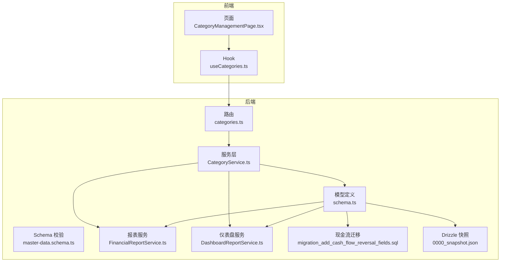
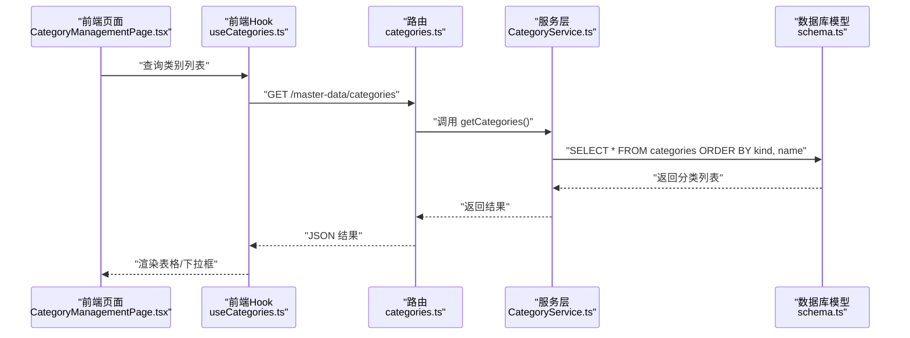
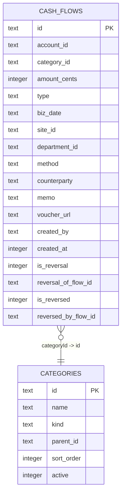
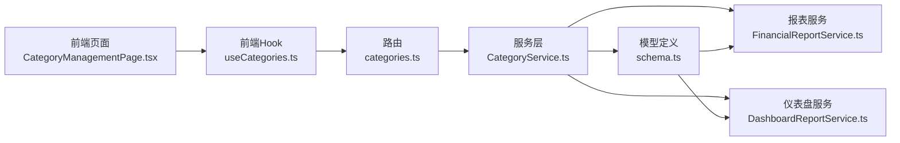

# 收支分类表 (categories)

<cite>
**本文引用的文件**
- [schema.ts](file://backend/src/db/schema.ts)
- [categories.ts](file://backend/src/routes/v2/master-data/categories.ts)
- [CategoryService.ts](file://backend/src/services/CategoryService.ts)
- [master-data.schema.ts](file://backend/src/schemas/master-data.schema.ts)
- [useCategories.ts](file://frontend/src/hooks/business/useCategories.ts)
- [CategoryManagementPage.tsx](file://frontend/src/features/system/pages/CategoryManagementPage.tsx)
- [FinancialReportService.ts](file://backend/src/services/FinancialReportService.ts)
- [DashboardReportService.ts](file://backend/src/services/DashboardReportService.ts)
- [migration_add_cash_flow_reversal_fields.sql](file://backend/src/db/migration_add_cash_flow_reversal_fields.sql)
- [0000_snapshot.json](file://backend/drizzle/meta/0000_snapshot.json)
</cite>

## 目录
1. [简介](#简介)
2. [项目结构](#项目结构)
3. [核心组件](#核心组件)
4. [架构总览](#架构总览)
5. [详细组件分析](#详细组件分析)
6. [依赖关系分析](#依赖关系分析)
7. [性能考量](#性能考量)
8. [故障排查指南](#故障排查指南)
9. [结论](#结论)
10. [附录](#附录)

## 简介
本文件系统性阐述“收支分类表（categories）”的设计与实现，重点覆盖以下方面：
- 表结构字段：id、name、kind（income/expense）、parentId、sortOrder、active 的语义与约束
- 树形分类结构：通过 parentId 实现无限层级的父子关系，支持层级化展示与聚合
- 业务关联：cash_flows 表通过 categoryId 关联分类，确保财务流水的准确归类
- 前后端交互：路由、服务层、Schema 校验与前端 Hook/页面的协作流程
- 查询与遍历：如何在服务层或应用层实现树形结构的构建与遍历

## 项目结构
围绕 categories 的前后端关键文件分布如下：
- 后端
  - 数据库模型定义：backend/src/db/schema.ts
  - 路由与控制器：backend/src/routes/v2/master-data/categories.ts
  - 服务层：backend/src/services/CategoryService.ts
  - Schema 校验：backend/src/schemas/master-data.schema.ts
  - 报表与仪表盘使用：backend/src/services/FinancialReportService.ts、backend/src/services/DashboardReportService.ts
  - 现金流迁移：backend/src/db/migration_add_cash_flow_reversal_fields.sql
  - Drizzle 元数据快照：backend/drizzle/meta/0000_snapshot.json
- 前端
  - Hook：frontend/src/hooks/business/useCategories.ts
  - 页面：frontend/src/features/system/pages/CategoryManagementPage.tsx



图表来源
- [categories.ts](file://backend/src/routes/v2/master-data/categories.ts#L1-L232)
- [CategoryService.ts](file://backend/src/services/CategoryService.ts#L1-L78)
- [schema.ts](file://backend/src/db/schema.ts#L343-L350)
- [master-data.schema.ts](file://backend/src/schemas/master-data.schema.ts#L71-L88)
- [FinancialReportService.ts](file://backend/src/services/FinancialReportService.ts#L94-L133)
- [DashboardReportService.ts](file://backend/src/services/DashboardReportService.ts#L131-L146)
- [migration_add_cash_flow_reversal_fields.sql](file://backend/src/db/migration_add_cash_flow_reversal_fields.sql#L1-L17)
- [0000_snapshot.json](file://backend/drizzle/meta/0000_snapshot.json#L1023-L1079)
- [useCategories.ts](file://frontend/src/hooks/business/useCategories.ts#L1-L90)
- [CategoryManagementPage.tsx](file://frontend/src/features/system/pages/CategoryManagementPage.tsx#L1-L180)

章节来源
- [schema.ts](file://backend/src/db/schema.ts#L343-L350)
- [categories.ts](file://backend/src/routes/v2/master-data/categories.ts#L1-L232)
- [CategoryService.ts](file://backend/src/services/CategoryService.ts#L1-L78)
- [master-data.schema.ts](file://backend/src/schemas/master-data.schema.ts#L71-L88)
- [useCategories.ts](file://frontend/src/hooks/business/useCategories.ts#L1-L90)
- [CategoryManagementPage.tsx](file://frontend/src/features/system/pages/CategoryManagementPage.tsx#L1-L180)
- [FinancialReportService.ts](file://backend/src/services/FinancialReportService.ts#L94-L133)
- [DashboardReportService.ts](file://backend/src/services/DashboardReportService.ts#L131-L146)
- [migration_add_cash_flow_reversal_fields.sql](file://backend/src/db/migration_add_cash_flow_reversal_fields.sql#L1-L17)
- [0000_snapshot.json](file://backend/drizzle/meta/0000_snapshot.json#L1023-L1079)

## 核心组件
- 表结构字段
  - id：主键，唯一标识一个分类
  - name：分类名称，必填且唯一（服务层校验）
  - kind：分类类型，取值为 income 或 expense，用于区分收入与支出
  - parentId：父级分类 id，形成树形层级；可为空表示根节点
  - sortOrder：排序权重，用于同级排序
  - active：启用状态，默认启用
- 业务关联
  - cash_flows 表的 categoryId 字段引用 categories.id，用于将每笔流水归类到具体收支分类
- 前后端协作
  - 路由层负责请求校验与权限控制，并调用服务层
  - 服务层执行 CRUD 操作、名称唯一性校验、删除前流水检查
  - Schema 校验确保入参合法
  - 前端 Hook 与页面负责查询、展示与交互

章节来源
- [schema.ts](file://backend/src/db/schema.ts#L343-L350)
- [categories.ts](file://backend/src/routes/v2/master-data/categories.ts#L38-L61)
- [CategoryService.ts](file://backend/src/services/CategoryService.ts#L15-L75)
- [master-data.schema.ts](file://backend/src/schemas/master-data.schema.ts#L71-L88)
- [FinancialReportService.ts](file://backend/src/services/FinancialReportService.ts#L94-L133)
- [DashboardReportService.ts](file://backend/src/services/DashboardReportService.ts#L131-L146)

## 架构总览
下图展示了“分类管理”的端到端流程：前端发起请求 -> 路由校验 -> 服务层处理 -> 数据库存取 -> 返回结果。



图表来源
- [CategoryManagementPage.tsx](file://frontend/src/features/system/pages/CategoryManagementPage.tsx#L1-L180)
- [useCategories.ts](file://frontend/src/hooks/business/useCategories.ts#L1-L90)
- [categories.ts](file://backend/src/routes/v2/master-data/categories.ts#L38-L61)
- [CategoryService.ts](file://backend/src/services/CategoryService.ts#L15-L17)
- [schema.ts](file://backend/src/db/schema.ts#L343-L350)

## 详细组件分析

### 表结构与字段语义
- 字段定义与约束
  - id：主键，文本型
  - name：非空，唯一性由服务层保证
  - kind：非空，枚举值为 income 或 expense
  - parentId：可空，指向自身表的 id，形成自引用树
  - sortOrder：整数，默认 0，用于排序
  - active：整数，默认 1，表示启用
- 约束与索引
  - Drizzle 快照显示 categories 表无显式索引，但 cash_flows 表对 categoryId 有外键约束（见迁移脚本），用于保证引用完整性
  - cash_flows 表包含 reversal 相关字段，不影响 categories 的结构

章节来源
- [schema.ts](file://backend/src/db/schema.ts#L343-L350)
- [0000_snapshot.json](file://backend/drizzle/meta/0000_snapshot.json#L1023-L1079)
- [migration_add_cash_flow_reversal_fields.sql](file://backend/src/db/migration_add_cash_flow_reversal_fields.sql#L1-L17)

### 树形分类结构与无限层级
- 设计原理
  - 通过 parentId 指向 categories.id，形成自引用的树形结构
  - 根节点的 parentId 为空；子节点通过 parentId 指向上级
  - 排序通过 sortOrder 字段实现同级顺序控制
- 展示与遍历
  - 服务层默认按 kind、name 排序，便于前端构建树形结构
  - 前端 Hook 提供按 kind 过滤的能力，便于分别渲染“收入/支出”树
  - 应用层可在内存中构建父子映射，实现无限层级的树形展示

```mermaid
flowchart TD
Start(["开始"]) --> Load["加载所有分类<br/>按 kind, name 排序"]
Load --> BuildMap["构建 id->分类 映射"]
BuildMap --> InitRoots["初始化根节点集合"]
InitRoots --> Iterate{"遍历每个分类"}
Iterate --> |是根节点(parentId为空)| AddRoot["加入根节点集合"]
Iterate --> |是子节点| LinkParent["根据 parentId 找到父节点并挂载"]
LinkParent --> Iterate
AddRoot --> Iterate
Iterate --> |完成| Done(["输出树形结构"])
```

图表来源
- [CategoryService.ts](file://backend/src/services/CategoryService.ts#L15-L17)
- [useCategories.ts](file://frontend/src/hooks/business/useCategories.ts#L14-L26)

章节来源
- [CategoryService.ts](file://backend/src/services/CategoryService.ts#L15-L17)
- [useCategories.ts](file://frontend/src/hooks/business/useCategories.ts#L14-L26)

### kind 字段：收入与支出的区分
- 作用
  - 通过 kind 字段区分“收入（income）”与“支出（expense）”，用于报表统计与流水归类
- 使用场景
  - 报表服务按 kind 进行过滤与聚合
  - 前端页面支持按 kind 过滤展示
- 枚举约束
  - Schema 中 updateCategorySchema 对 kind 的可选值限定为 income/expense

章节来源
- [schema.ts](file://backend/src/db/schema.ts#L343-L350)
- [master-data.schema.ts](file://backend/src/schemas/master-data.schema.ts#L83-L88)
- [FinancialReportService.ts](file://backend/src/services/FinancialReportService.ts#L94-L133)
- [CategoryManagementPage.tsx](file://frontend/src/features/system/pages/CategoryManagementPage.tsx#L16-L20)

### parentId 字段：树形结构的实现
- 自引用关系
  - categories.parentId 指向 categories.id，形成树形层级
- 无限层级支持
  - 通过递归或迭代方式遍历，即可支持任意深度的层级
- 前端展示
  - 前端 Hook 支持按 kind 过滤，页面提供“类型”筛选，便于分组查看

章节来源
- [schema.ts](file://backend/src/db/schema.ts#L343-L350)
- [useCategories.ts](file://frontend/src/hooks/business/useCategories.ts#L14-L26)
- [CategoryManagementPage.tsx](file://frontend/src/features/system/pages/CategoryManagementPage.tsx#L100-L117)

### 与 cash_flows 的关联与流水归类
- 关联方式
  - cash_flows.categoryId 外键引用 categories.id
  - 迁移脚本明确新增了 reversal 相关字段，但未改变 categoryId 的外键关系
- 业务意义
  - 每笔现金流都归属到某个分类，便于按分类统计与分析
- 查询示例
  - 报表服务通过 LEFT JOIN categories 与 cash_flows 进行连接，并按 kind 过滤
  - 仪表盘服务在最近流水查询中也通过 LEFT JOIN 获取分类名称



图表来源
- [schema.ts](file://backend/src/db/schema.ts#L159-L188)
- [schema.ts](file://backend/src/db/schema.ts#L343-L350)
- [migration_add_cash_flow_reversal_fields.sql](file://backend/src/db/migration_add_cash_flow_reversal_fields.sql#L1-L17)

章节来源
- [schema.ts](file://backend/src/db/schema.ts#L159-L188)
- [schema.ts](file://backend/src/db/schema.ts#L343-L350)
- [FinancialReportService.ts](file://backend/src/services/FinancialReportService.ts#L94-L133)
- [DashboardReportService.ts](file://backend/src/services/DashboardReportService.ts#L131-L146)
- [migration_add_cash_flow_reversal_fields.sql](file://backend/src/db/migration_add_cash_flow_reversal_fields.sql#L1-L17)

### 代码示例：表定义与树形遍历查询方法
- 表定义位置
  - categories 表定义位于数据库模型文件中，字段与约束清晰
- 树形遍历查询方法
  - 服务层默认按 kind、name 排序，便于前端构建树
  - 前端 Hook 支持按 kind 过滤，页面提供搜索与筛选
  - 应用层可在内存中构建父子映射，实现无限层级树形结构

章节来源
- [schema.ts](file://backend/src/db/schema.ts#L343-L350)
- [CategoryService.ts](file://backend/src/services/CategoryService.ts#L15-L17)
- [useCategories.ts](file://frontend/src/hooks/business/useCategories.ts#L14-L26)
- [CategoryManagementPage.tsx](file://frontend/src/features/system/pages/CategoryManagementPage.tsx#L41-L51)

## 依赖关系分析
- 组件耦合
  - 路由层依赖服务层；服务层依赖模型层；前端依赖路由层
  - Schema 校验贯穿前后端，确保输入合法性
- 外部依赖
  - Drizzle ORM 用于 SQLite 模型定义与查询
  - React Query 用于前端缓存与查询
- 潜在循环依赖
  - 当前结构为单向依赖，无循环依赖迹象



图表来源
- [CategoryManagementPage.tsx](file://frontend/src/features/system/pages/CategoryManagementPage.tsx#L1-L180)
- [useCategories.ts](file://frontend/src/hooks/business/useCategories.ts#L1-L90)
- [categories.ts](file://backend/src/routes/v2/master-data/categories.ts#L1-L232)
- [CategoryService.ts](file://backend/src/services/CategoryService.ts#L1-L78)
- [schema.ts](file://backend/src/db/schema.ts#L343-L350)
- [FinancialReportService.ts](file://backend/src/services/FinancialReportService.ts#L94-L133)
- [DashboardReportService.ts](file://backend/src/services/DashboardReportService.ts#L131-L146)

章节来源
- [categories.ts](file://backend/src/routes/v2/master-data/categories.ts#L1-L232)
- [CategoryService.ts](file://backend/src/services/CategoryService.ts#L1-L78)
- [schema.ts](file://backend/src/db/schema.ts#L343-L350)
- [useCategories.ts](file://frontend/src/hooks/business/useCategories.ts#L1-L90)
- [CategoryManagementPage.tsx](file://frontend/src/features/system/pages/CategoryManagementPage.tsx#L1-L180)
- [FinancialReportService.ts](file://backend/src/services/FinancialReportService.ts#L94-L133)
- [DashboardReportService.ts](file://backend/src/services/DashboardReportService.ts#L131-L146)

## 性能考量
- 查询排序
  - 服务层按 kind、name 排序，有利于前端一次性渲染树形结构
- 缓存策略
  - 路由层对分类列表使用查询缓存，减少数据库压力
- 前端缓存
  - 前端 Hook 设置合理的 staleTime，避免频繁重复请求
- 索引建议
  - categories 表可考虑为 parentId、kind、sortOrder 建立复合索引，以优化树形构建与层级查询
  - cash_flows 表已对 reversal 相关字段建立索引，有助于红冲查询

章节来源
- [categories.ts](file://backend/src/routes/v2/master-data/categories.ts#L44-L60)
- [useCategories.ts](file://frontend/src/hooks/business/useCategories.ts#L14-L26)
- [migration_add_cash_flow_reversal_fields.sql](file://backend/src/db/migration_add_cash_flow_reversal_fields.sql#L1-L17)

## 故障排查指南
- 删除分类失败
  - 若分类仍有对应流水记录，则会抛出业务错误；需先清理相关流水再删除
- 名称冲突
  - 创建/更新时若名称重复，会触发重复错误；请修改名称后重试
- 权限不足
  - 创建/更新/删除分类需要相应权限；请确认用户权限后再操作
- 前端无数据
  - 检查缓存是否过期；可通过“刷新”按钮重新拉取数据
- 树形不完整
  - 确认 parentId 是否正确设置；根节点 parentId 应为空

章节来源
- [CategoryService.ts](file://backend/src/services/CategoryService.ts#L62-L75)
- [categories.ts](file://backend/src/routes/v2/master-data/categories.ts#L94-L119)
- [categories.ts](file://backend/src/routes/v2/master-data/categories.ts#L164-L184)
- [categories.ts](file://backend/src/routes/v2/master-data/categories.ts#L214-L231)
- [CategoryManagementPage.tsx](file://frontend/src/features/system/pages/CategoryManagementPage.tsx#L120-L132)

## 结论
categories 表通过 id、name、kind、parentId、sortOrder 等字段，实现了灵活的收支分类体系。其树形结构由 parentId 自引用支撑，配合 sortOrder 实现层级化展示与聚合。cash_flows 通过 categoryId 与之关联，确保每笔流水都能准确归类。前后端协同完善：路由进行权限与校验，服务层负责业务规则与数据一致性，前端提供友好的交互与缓存体验。建议后续为 categories 增加必要的索引以提升树形构建与查询性能。

## 附录
- 表定义与字段参考路径
  - categories 表定义：[schema.ts](file://backend/src/db/schema.ts#L343-L350)
- 前后端交互参考路径
  - 路由与控制器：[categories.ts](file://backend/src/routes/v2/master-data/categories.ts#L38-L61)
  - 服务层：[CategoryService.ts](file://backend/src/services/CategoryService.ts#L15-L75)
  - Schema 校验：[master-data.schema.ts](file://backend/src/schemas/master-data.schema.ts#L71-L88)
  - 前端 Hook：[useCategories.ts](file://frontend/src/hooks/business/useCategories.ts#L14-L26)
  - 前端页面：[CategoryManagementPage.tsx](file://frontend/src/features/system/pages/CategoryManagementPage.tsx#L100-L117)
- 业务关联参考路径
  - 报表统计：[FinancialReportService.ts](file://backend/src/services/FinancialReportService.ts#L94-L133)
  - 仪表盘最近流水：[DashboardReportService.ts](file://backend/src/services/DashboardReportService.ts#L131-L146)
  - 现金流迁移（含 reversal 字段）：[migration_add_cash_flow_reversal_fields.sql](file://backend/src/db/migration_add_cash_flow_reversal_fields.sql#L1-L17)
- Drizzle 元数据快照
  - categories 表快照：[0000_snapshot.json](file://backend/drizzle/meta/0000_snapshot.json#L1023-L1079)