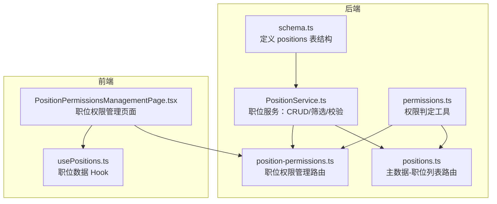
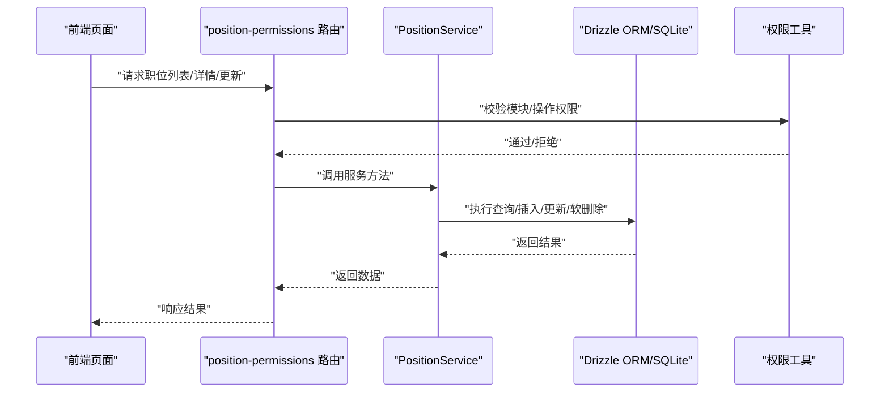
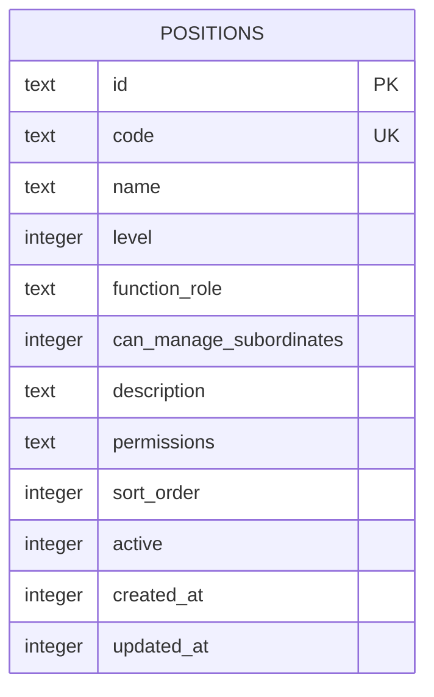
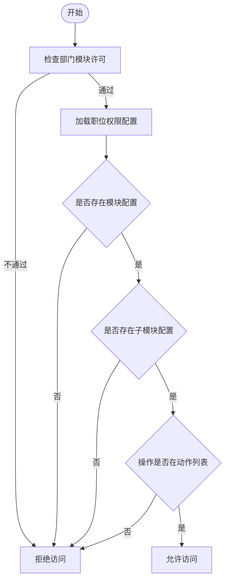
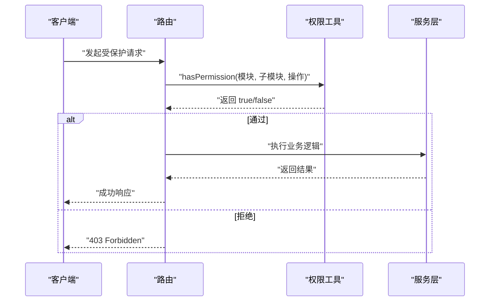
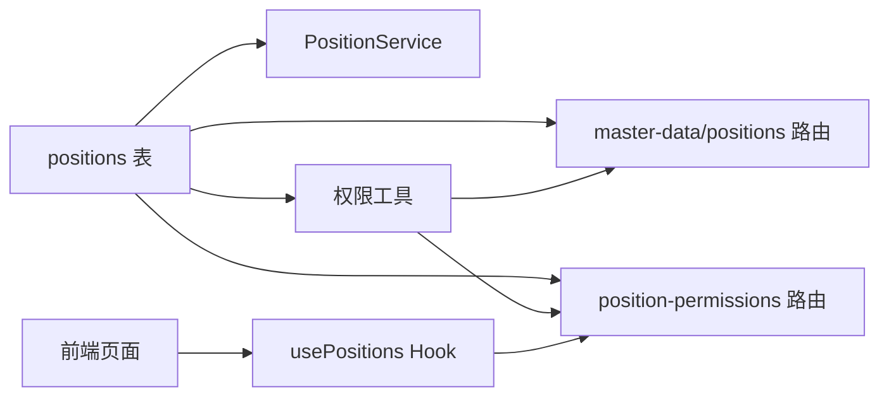

# 职位表 (positions)

<cite>
**本文引用的文件**
- [schema.ts](file://backend/src/db/schema.ts)
- [PositionService.ts](file://backend/src/services/PositionService.ts)
- [permissions.ts](file://backend/src/utils/permissions.ts)
- [position-permissions.ts](file://backend/src/routes/v2/position-permissions.ts)
- [positions.ts](file://backend/src/routes/v2/master-data/positions.ts)
- [master-data.schema.ts](file://backend/src/schemas/master-data.schema.ts)
- [PositionPermissionsManagementPage.tsx](file://frontend/src/features/system/pages/PositionPermissionsManagementPage.tsx)
- [usePositions.ts](file://frontend/src/hooks/business/usePositions.ts)
- [EmployeeService.test.ts](file://backend/test/services/EmployeeService.test.ts)
- [generate-seed.ts](file://backend/scripts/generate-seed.ts)
- [0000_snapshot.json](file://backend/drizzle/meta/0000_snapshot.json)
</cite>

## 目录
1. [简介](#简介)
2. [项目结构](#项目结构)
3. [核心组件](#核心组件)
4. [架构总览](#架构总览)
5. [详细组件分析](#详细组件分析)
6. [依赖关系分析](#依赖关系分析)
7. [性能考量](#性能考量)
8. [故障排查指南](#故障排查指南)
9. [结论](#结论)
10. [附录](#附录)

## 简介
本文件系统性地阐述“职位表（positions）”的设计与实现，覆盖字段语义、层级体系、功能角色、RBAC权限配置、与员工表的关联关系、索引与排序策略，以及前端排序的应用方式。目标是帮助开发者与产品/运维人员快速理解并正确使用该表支撑系统的权限控制与组织管理。

## 项目结构
围绕职位表的关键代码分布在后端数据库模式、服务层、路由层、权限工具与前端页面/Hook中：
- 后端数据库模式定义了 positions 表结构及字段约束
- 服务层负责 CRUD、可用职位筛选、软删除与业务校验
- 路由层提供对外 API，受权限中间件保护
- 权限工具层提供基于职位的模块/操作权限判定
- 前端页面负责职位权限配置的可视化编辑与展示

图表来源
- [schema.ts](file://backend/src/db/schema.ts#L50-L63)
- [PositionService.ts](file://backend/src/services/PositionService.ts#L1-L224)
- [position-permissions.ts](file://backend/src/routes/v2/position-permissions.ts#L53-L251)
- [permissions.ts](file://backend/src/utils/permissions.ts#L1-L273)
- [positions.ts](file://backend/src/routes/v2/master-data/positions.ts#L1-L88)
- [PositionPermissionsManagementPage.tsx](file://frontend/src/features/system/pages/PositionPermissionsManagementPage.tsx#L1-L457)
- [usePositions.ts](file://frontend/src/hooks/business/usePositions.ts#L1-L42)

章节来源
- [schema.ts](file://backend/src/db/schema.ts#L50-L63)
- [PositionService.ts](file://backend/src/services/PositionService.ts#L1-L224)
- [position-permissions.ts](file://backend/src/routes/v2/position-permissions.ts#L53-L251)
- [permissions.ts](file://backend/src/utils/permissions.ts#L1-L273)
- [positions.ts](file://backend/src/routes/v2/master-data/positions.ts#L1-L88)
- [PositionPermissionsManagementPage.tsx](file://frontend/src/features/system/pages/PositionPermissionsManagementPage.tsx#L1-L457)
- [usePositions.ts](file://frontend/src/hooks/business/usePositions.ts#L1-L42)

## 核心组件
- positions 表：存储职位的标识、层级、角色、权限、排序与状态等元数据
- PositionService：封装职位的增删改查、可用职位筛选、重复码校验、软删除等逻辑
- 路由层：提供职位列表、详情、创建、更新、删除等 API，并受权限中间件保护
- 权限工具：基于职位的 level、canManageSubordinates、permissions 实现模块/操作权限判定
- 前端页面：可视化展示与编辑职位权限配置，支持按 sortOrder 排序

章节来源
- [schema.ts](file://backend/src/db/schema.ts#L50-L63)
- [PositionService.ts](file://backend/src/services/PositionService.ts#L1-L224)
- [position-permissions.ts](file://backend/src/routes/v2/position-permissions.ts#L53-L251)
- [permissions.ts](file://backend/src/utils/permissions.ts#L1-L273)
- [PositionPermissionsManagementPage.tsx](file://frontend/src/features/system/pages/PositionPermissionsManagementPage.tsx#L1-L457)

## 架构总览
职位表在系统中的关键作用：
- 作为员工的“身份标签”，通过 employees.position_id 与员工建立一对一/多对一关系
- 作为 RBAC 的“角色载体”，通过 level、functionRole、canManageSubordinates、permissions 提供权限判定依据
- 作为前端排序与筛选的“顺序锚点”，通过 sortOrder 字段影响 UI 展示顺序

图表来源
- [position-permissions.ts](file://backend/src/routes/v2/position-permissions.ts#L53-L251)
- [PositionService.ts](file://backend/src/services/PositionService.ts#L1-L224)
- [permissions.ts](file://backend/src/utils/permissions.ts#L1-L273)

## 详细组件分析

### 表结构与字段语义
positions 表的核心字段如下：
- id：主键，UUID 文本
- code：唯一索引，职位编码（如 ADMIN/MGR/ENG/FIN）
- name：职位名称
- level：职位层级（1=总部、2=项目、3=组）
- functionRole：职能角色（如 manager、developer、finance 等）
- canManageSubordinates：是否可管理下属（0/1）
- description：描述
- permissions：JSON 字符串，存储模块/子模块/操作的权限配置
- sortOrder：排序权重，数值越小越靠前
- active：激活状态（1=启用，0=禁用）
- createdAt/updatedAt：时间戳

图表来源
- [schema.ts](file://backend/src/db/schema.ts#L50-L63)
- [0000_snapshot.json](file://backend/drizzle/meta/0000_snapshot.json#L2579-L2621)

章节来源
- [schema.ts](file://backend/src/db/schema.ts#L50-L63)
- [0000_snapshot.json](file://backend/drizzle/meta/0000_snapshot.json#L2579-L2621)

### 层级体系（level）
- 1：总部（Headquarters）
- 2：项目（Project）
- 3：组（Team）

服务层在“可用职位筛选”时会根据部门是否为总部来限定 level 的取值，并按 level、sortOrder、name 排序。

章节来源
- [PositionService.ts](file://backend/src/services/PositionService.ts#L24-L104)

### 功能角色（functionRole）
- 用于标识职位所属的职能域，如 manager、developer、finance 等
- 在路由层与服务层均有读写处理，且测试用例中出现过 developer/manager/finance 等示例

章节来源
- [position-permissions.ts](file://backend/src/routes/v2/position-permissions.ts#L131-L211)
- [generate-seed.ts](file://backend/scripts/generate-seed.ts#L19-L40)

### 权限配置（permissions）
- 结构：JSON 字符串，形如 { module: { subModule: [action,...] } }
- 前端页面定义了模块/子模块/操作的映射，与后端权限判定逻辑一致
- 权限判定流程：先校验部门模块许可，再校验职位权限配置

图表来源
- [permissions.ts](file://backend/src/utils/permissions.ts#L99-L125)

章节来源
- [permissions.ts](file://backend/src/utils/permissions.ts#L1-L273)
- [PositionPermissionsManagementPage.tsx](file://frontend/src/features/system/pages/PositionPermissionsManagementPage.tsx#L1-L457)

### 与 employees 表的关联
- employees.position_id 外键指向 positions.id
- 测试用例展示了将员工迁移时设置 position_id 的场景，验证了该关联的存在与用途

章节来源
- [EmployeeService.test.ts](file://backend/test/services/EmployeeService.test.ts#L188-L236)

### 索引与排序策略
- 唯一索引：positions.code（保证职位编码唯一）
- 排序策略：
  - 职位列表默认按 sortOrder、name 排序
  - 可用职位筛选时按 level、sortOrder、name 排序
- 前端排序：职位权限管理页面使用 sortOrder 作为主要排序字段，其次按名称排序

章节来源
- [schema.ts](file://backend/src/db/schema.ts#L50-L63)
- [PositionService.ts](file://backend/src/services/PositionService.ts#L15-L22)
- [PositionService.ts](file://backend/src/services/PositionService.ts#L59-L65)
- [PositionPermissionsManagementPage.tsx](file://frontend/src/features/system/pages/PositionPermissionsManagementPage.tsx#L340-L390)

### RBAC 权限控制流程
- 路由层通过 requirePermission/protectRoute 对模块/操作进行鉴权
- 权限判定依赖 getUserPosition 获取职位信息，结合 hasPermission 判断
- 支持“总部人员不受部门模块限制”的特殊规则

图表来源
- [position-permissions.ts](file://backend/src/routes/v2/position-permissions.ts#L53-L251)
- [permissions.ts](file://backend/src/utils/permissions.ts#L1-L273)

章节来源
- [position-permissions.ts](file://backend/src/routes/v2/position-permissions.ts#L53-L251)
- [permissions.ts](file://backend/src/utils/permissions.ts#L1-L273)

### 前端排序应用（sortOrder）
- 页面列定义中包含 level、sortOrder、permissions 等字段
- 排序逻辑：优先按 sortOrder 升序；若 sortOrder 相同，则按 name 排序
- 该策略与后端查询排序一致，确保前后端一致性

章节来源
- [PositionPermissionsManagementPage.tsx](file://frontend/src/features/system/pages/PositionPermissionsManagementPage.tsx#L340-L390)

## 依赖关系分析
- positions 表被多个服务与路由依赖：PositionService、主数据路由、职位权限路由
- 权限工具依赖 positions 中的 level、canManageSubordinates、permissions 字段
- 前端页面依赖后端 API 返回的 positions 数据，并以 sortOrder 作为排序锚点

图表来源
- [schema.ts](file://backend/src/db/schema.ts#L50-L63)
- [PositionService.ts](file://backend/src/services/PositionService.ts#L1-L224)
- [position-permissions.ts](file://backend/src/routes/v2/position-permissions.ts#L53-L251)
- [positions.ts](file://backend/src/routes/v2/master-data/positions.ts#L1-L88)
- [permissions.ts](file://backend/src/utils/permissions.ts#L1-L273)
- [usePositions.ts](file://frontend/src/hooks/business/usePositions.ts#L1-L42)

章节来源
- [schema.ts](file://backend/src/db/schema.ts#L50-L63)
- [PositionService.ts](file://backend/src/services/PositionService.ts#L1-L224)
- [position-permissions.ts](file://backend/src/routes/v2/position-permissions.ts#L53-L251)
- [positions.ts](file://backend/src/routes/v2/master-data/positions.ts#L1-L88)
- [permissions.ts](file://backend/src/utils/permissions.ts#L1-L273)
- [usePositions.ts](file://frontend/src/hooks/business/usePositions.ts#L1-L42)

## 性能考量
- 查询排序：positions 默认按 sortOrder、name 排序，避免全表扫描时的额外排序开销
- 唯一索引：positions.code 唯一索引确保插入/更新时的冲突检测高效
- 前端缓存：usePositions Hook 设置较长缓存时间，减少重复请求
- 软删除：删除职位采用 active=0 的软删除策略，避免级联删除带来的性能与数据风险

章节来源
- [PositionService.ts](file://backend/src/services/PositionService.ts#L15-L22)
- [PositionService.ts](file://backend/src/services/PositionService.ts#L59-L65)
- [schema.ts](file://backend/src/db/schema.ts#L50-L63)
- [usePositions.ts](file://frontend/src/hooks/business/usePositions.ts#L1-L42)

## 故障排查指南
- 职位编码冲突：创建/更新时若 code 已存在，将抛出重复错误
  - 参考路径：[PositionService.ts](file://backend/src/services/PositionService.ts#L116-L123)
- 删除受限：若仍有员工使用该职位，将阻止删除
  - 参考路径：[PositionService.ts](file://backend/src/services/PositionService.ts#L194-L213)
- 权限不足：路由层对受保护操作进行权限校验，未通过则返回 403
  - 参考路径：[position-permissions.ts](file://backend/src/routes/v2/position-permissions.ts#L53-L251)
- 前端排序异常：确认 sortOrder 字段是否正确设置，以及前端排序逻辑是否生效
  - 参考路径：[PositionPermissionsManagementPage.tsx](file://frontend/src/features/system/pages/PositionPermissionsManagementPage.tsx#L340-L390)

章节来源
- [PositionService.ts](file://backend/src/services/PositionService.ts#L116-L123)
- [PositionService.ts](file://backend/src/services/PositionService.ts#L194-L213)
- [position-permissions.ts](file://backend/src/routes/v2/position-permissions.ts#L53-L251)
- [PositionPermissionsManagementPage.tsx](file://frontend/src/features/system/pages/PositionPermissionsManagementPage.tsx#L340-L390)

## 结论
positions 表是系统 RBAC 的核心载体，通过 level、functionRole、canManageSubordinates、permissions 等字段，结合服务层与权限工具，实现了灵活的权限控制与数据访问范围管理。配合 sortOrder 的统一排序策略，既满足后端查询效率，又保障前端展示一致性。建议在新增/调整职位时，同步维护 permissions 配置与排序权重，确保权限与体验的一致性。

## 附录

### 表定义与索引策略（代码片段路径）
- 表定义与字段注释
  - [positions 表定义](file://backend/src/db/schema.ts#L50-L63)
- 唯一索引与排序
  - [positions.code 唯一索引](file://backend/src/db/schema.ts#L50-L63)
  - [职位列表排序：sortOrder、name](file://backend/src/services/PositionService.ts#L15-L22)
  - [可用职位筛选排序：level、sortOrder、name](file://backend/src/services/PositionService.ts#L59-L65)

### 权限配置结构（示例路径）
- 前端模块/子模块/操作映射
  - [权限模块配置](file://frontend/src/features/system/pages/PositionPermissionsManagementPage.tsx#L33-L101)
- 后端权限判定逻辑
  - [hasPermission 实现](file://backend/src/utils/permissions.ts#L99-L125)

### 与 employees 的关联（示例路径）
- 员工迁移时设置 position_id
  - [迁移测试用例](file://backend/test/services/EmployeeService.test.ts#L188-L236)