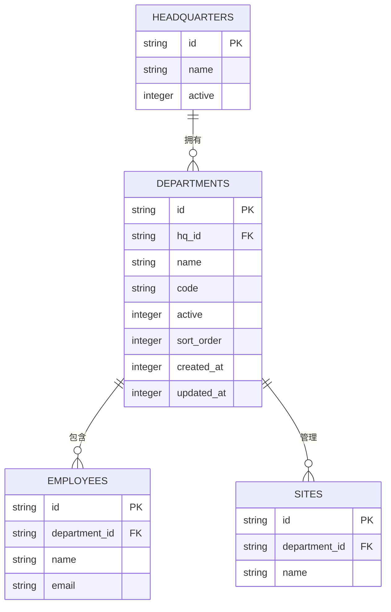
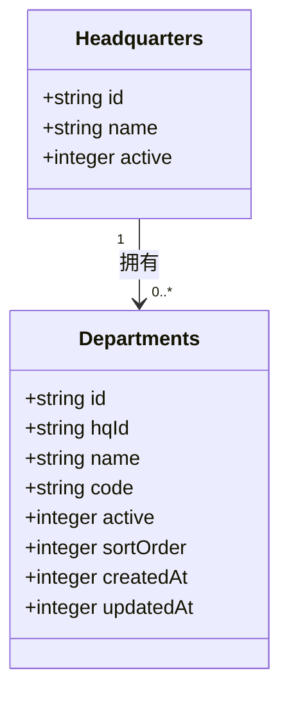
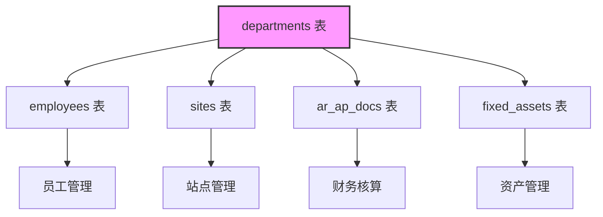
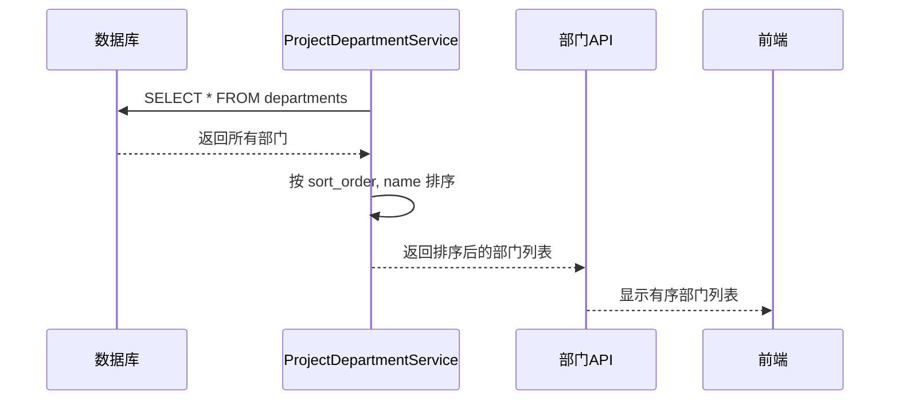

# 部门表 (departments)

<cite>
**本文档引用的文件**   
- [schema.ts](file://backend/src/db/schema.ts#L65-L74)
- [migration_add_departments_sort_order.sql](file://backend/src/db/migration_add_departments_sort_order.sql)
- [departments.ts](file://backend/src/routes/v2/master-data/departments.ts)
- [ProjectDepartmentService.ts](file://backend/src/services/ProjectDepartmentService.ts)
- [MasterDataService.ts](file://backend/src/services/MasterDataService.ts)
- [EmployeeService.ts](file://backend/src/services/EmployeeService.ts)
- [sites.ts](file://backend/src/db/schema.ts#L333-L341)
</cite>

## 目录
1. [表结构概览](#表结构概览)
2. [字段详细说明](#字段详细说明)
3. [与总部表的归属关系](#与总部表的归属关系)
4. [被引用关系分析](#被引用关系分析)
5. [排序字段(sortOrder)详解](#排序字段sortorder详解)
6. [代码示例](#代码示例)

## 表结构概览

`departments` 表是企业组织架构的核心组成部分，用于存储公司内部的部门信息。该表通过 `hq_id` 字段与 `headquarters` 表建立归属关系，形成企业组织架构的基础。同时，多个其他表如 `employees`、`sites` 等通过外键引用此表，实现部门级的数据隔离和统计。

**图表来源**
- [schema.ts](file://backend/src/db/schema.ts#L65-L80)
- [schema.ts](file://backend/src/db/schema.ts#L333-L341)

**章节来源**
- [schema.ts](file://backend/src/db/schema.ts#L65-L74)

## 字段详细说明

`departments` 表包含以下核心字段：

| 字段名 | 数据类型 | 是否必填 | 默认值 | 说明 |
| :--- | :--- | :--- | :--- | :--- |
| `id` | TEXT | 是 | 无 | 主键，部门唯一标识符 |
| `hq_id` | TEXT | 否 | 无 | 外键，关联 `headquarters` 表，表示部门所属的总部 |
| `name` | TEXT | 是 | 无 | 部门名称 |
| `code` | TEXT | 否 | 无 | 部门代码，用于系统内标识 |
| `active` | INTEGER | 否 | 1 | 状态标识，1表示启用，0表示禁用 |
| `sort_order` | INTEGER | 否 | 100 | 排序序号，数值越小越靠前 |
| `created_at` | INTEGER | 否 | 无 | 创建时间戳 |
| `updated_at` | INTEGER | 否 | 无 | 更新时间戳 |

**章节来源**
- [schema.ts](file://backend/src/db/schema.ts#L65-L74)

## 与总部表的归属关系

`departments` 表通过 `hq_id` 字段与 `headquarters` 表建立了一对多的归属关系。一个总部（`headquarters`）可以拥有多个部门（`departments`），而每个部门只能归属于一个总部。这种设计构成了企业组织架构的基础。

在系统初始化时，会自动创建一个名为“总部”的特殊部门，其 `sort_order` 值为0，确保在列表中始终排在最前面。`ProjectDepartmentService` 服务类提供了 `getOrCreateHQDepartmentId` 方法来获取或创建这个总部部门。

**图表来源**
- [schema.ts](file://backend/src/db/schema.ts#L65-L80)
- [ProjectDepartmentService.ts](file://backend/src/services/ProjectDepartmentService.ts#L18-L23)

**章节来源**
- [ProjectDepartmentService.ts](file://backend/src/services/ProjectDepartmentService.ts#L18-L54)

## 被引用关系分析

`departments` 表被多个核心业务表所引用，实现了部门级的数据隔离和统计功能：

1.  **员工表 (employees)**：`employees` 表中的 `department_id` 字段引用 `departments.id`，将员工分配到具体部门。这使得系统能够按部门进行员工管理、薪资统计和权限控制。
2.  **站点表 (sites)**：`sites` 表中的 `department_id` 字段引用 `departments.id`，将物理站点（如办公室、仓库）归属于特定部门进行管理。
3.  **其他引用**：`ar_ap_docs`（应收应付单据）、`fixed_assets`（固定资产）等表也引用了 `department_id`，实现了按部门的财务核算和资产管理。

这种设计模式确保了数据的部门级隔离，例如在生成报表时，可以通过 `department_id` 轻松筛选出特定部门的数据。

**图表来源**
- [schema.ts](file://backend/src/db/schema.ts#L65-L74)
- [schema.ts](file://backend/src/db/schema.ts#L333-L341)
- [schema.ts](file://backend/src/db/schema.ts#L14-L48)

**章节来源**
- [schema.ts](file://backend/src/db/schema.ts#L333-L341)
- [EmployeeService.ts](file://backend/src/services/EmployeeService.ts#L317-L318)

## 排序字段(sortOrder)详解

`sort_order` 字段用于控制部门在列表中的显示顺序。其设计特点如下：

- **默认值**：新创建的部门默认 `sort_order` 为100。
- **总部优先**：名为“总部”的部门其 `sort_order` 被设置为0，确保在排序时始终位于最前面。
- **排序逻辑**：在查询部门列表时，系统会优先按 `sort_order` 升序排列，其次按 `name` 字典序排列。

该字段的添加是通过 `migration_add_departments_sort_order.sql` 迁移脚本完成的，该脚本首先为表添加 `sort_order` 列，然后将现有“总部”部门的排序值更新为0。

**图表来源**
- [ProjectDepartmentService.ts](file://backend/src/services/ProjectDepartmentService.ts#L56-L63)
- [migration_add_departments_sort_order.sql](file://backend/src/db/migration_add_departments_sort_order.sql)

**章节来源**
- [ProjectDepartmentService.ts](file://backend/src/services/ProjectDepartmentService.ts#L56-L64)
- [migration_add_departments_sort_order.sql](file://backend/src/db/migration_add_departments_sort_order.sql)

## 代码示例

以下是 `departments` 表在代码中的定义和使用示例：

1.  **表定义**：在 `schema.ts` 中使用 Drizzle ORM 定义了表结构。
2.  **服务层调用**：`MasterDataService` 作为门面服务，将部门相关的操作委托给 `ProjectDepartmentService`。
3.  **API路由**：`departments.ts` 文件定义了创建、更新、删除和查询部门的API接口。

这些代码共同实现了对 `departments` 表的完整CRUD操作和业务逻辑。

**章节来源**
- [schema.ts](file://backend/src/db/schema.ts#L65-L74)
- [MasterDataService.ts](file://backend/src/services/MasterDataService.ts#L41-L57)
- [departments.ts](file://backend/src/routes/v2/master-data/departments.ts#L22-L133)