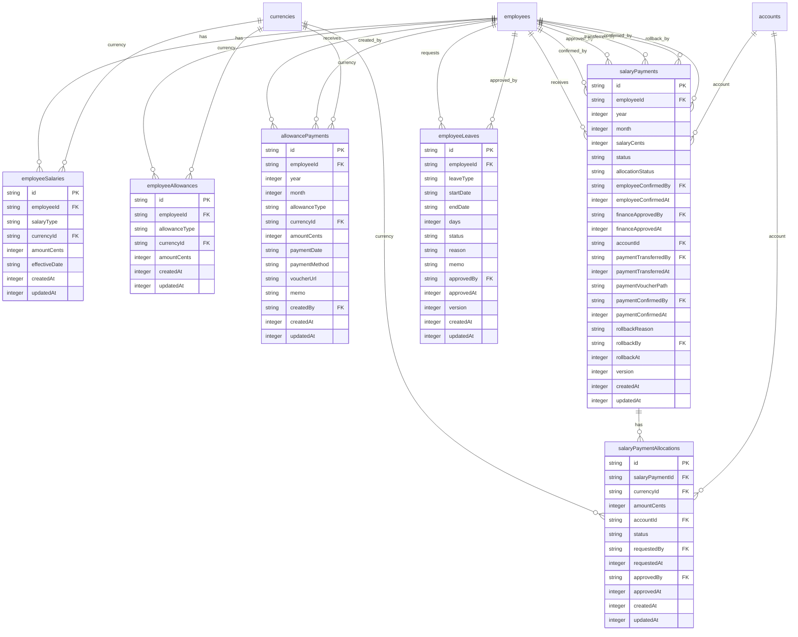
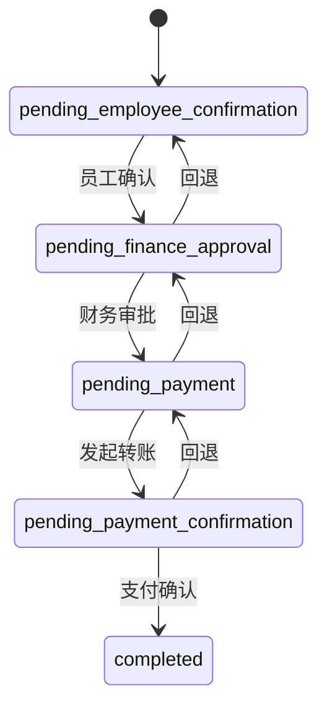

# 人事薪资数据模型

<cite>
**本文档引用文件**  
- [schema.ts](file://backend/src/db/schema.ts)
- [employee-salaries.ts](file://backend/src/routes/v2/employee-salaries.ts)
- [employee-allowances.ts](file://backend/src/routes/v2/employee-allowances.ts)
- [allowance-payments.ts](file://backend/src/routes/v2/allowance-payments.ts)
- [salary-payments.ts](file://backend/src/routes/v2/salary-payments.ts)
- [employee-leaves.ts](file://backend/src/routes/v2/employee-leaves.ts)
- [SalaryService.ts](file://backend/src/services/SalaryService.ts)
- [AllowanceService.ts](file://backend/src/services/AllowanceService.ts)
- [AllowancePaymentService.ts](file://backend/src/services/AllowancePaymentService.ts)
- [SalaryPaymentService.ts](file://backend/src/services/SalaryPaymentService.ts)
- [EmployeeLeaveService.ts](file://backend/src/services/EmployeeLeaveService.ts)
- [state-machine.ts](file://backend/src/utils/state-machine.ts)
- [optimistic-lock.ts](file://backend/src/utils/optimistic-lock.ts)
</cite>

## 目录
1. [简介](#简介)
2. [核心表结构与关系](#核心表结构与关系)
3. [员工薪资与津贴配置](#员工薪资与津贴配置)
4. [发放记录与多状态机](#发放记录与多状态机)
5. [跨币种发放分配机制](#跨币种发放分配机制)
6. [请假流程与状态管理](#请假流程与状态管理)
7. [Drizzle ORM 代码示例](#drizzle-orm-代码示例)
8. [结论](#结论)

## 简介
本文件详细描述了人事薪资系统中的六个核心数据表：`employeeSalaries`、`employeeAllowances`、`allowancePayments`、`salaryPayments`、`salaryPaymentAllocations` 和 `employeeLeaves`。这些表共同支撑了薪资计算、津贴发放、请假审批等人力资源核心功能。文档将深入解析各表的结构、字段含义、相互关系以及关键业务逻辑，特别是 `salaryPayments` 表中乐观锁版本号（version）在高并发发放场景下的作用。

## 核心表结构与关系



**图表来源**
- [schema.ts](file://backend/src/db/schema.ts)

**本节来源**
- [schema.ts](file://backend/src/db/schema.ts)

## 员工薪资与津贴配置

`employeeSalaries` 和 `employeeAllowances` 表用于存储员工的薪资和津贴配置信息，是薪资计算的基础。

- **`employeeSalaries` (员工薪资表)**:
  - `employeeId`: 外键，关联 `employees` 表，标识薪资所属员工。
  - `salaryType`: 薪资类型，区分试用期 (`probation`) 和正式 (`regular`) 薪资。
  - `currencyId`: 外键，关联 `currencies` 表，定义薪资币种。
  - `amountCents`: 薪资金额，以分为单位存储，避免浮点数精度问题。
  - `effectiveDate`: 生效日期，用于历史记录和未来调整。

- **`employeeAllowances` (员工津贴表)**:
  - `employeeId`: 外键，关联 `employees` 表，标识津贴所属员工。
  - `allowanceType`: 津贴类型，如 `living` (生活)、`housing` (住房)、`transportation` (交通)、`meal` (餐补) 等。
  - `currencyId`: 外键，关联 `currencies` 表，定义津贴币种。
  - `amountCents`: 津贴金额，以分为单位存储。

这两个表通过 `employeeId` 与 `employees` 表建立一对多关系，一个员工可以有多个不同币种的薪资和津贴记录。系统通过 `SalaryService` 和 `AllowanceService` 提供了创建、更新、批量更新和删除配置的API。

**本节来源**
- [schema.ts](file://backend/src/db/schema.ts)
- [SalaryService.ts](file://backend/src/services/SalaryService.ts)
- [AllowanceService.ts](file://backend/src/services/AllowanceService.ts)
- [employee-salaries.ts](file://backend/src/routes/v2/employee-salaries.ts)
- [employee-allowances.ts](file://backend/src/routes/v2/employee-allowances.ts)

## 发放记录与多状态机

`allowancePayments` 和 `salaryPayments` 表记录了薪资和津贴的实际发放过程，其核心是复杂的多状态机（State Machine）驱动的审批和支付流程。

### 状态机流程



**图表来源**
- [salary-payments.ts](file://backend/src/routes/v2/salary-payments.ts)
- [SalaryPaymentService.ts](file://backend/src/services/SalaryPaymentService.ts)

### 表结构与状态流转

- **`allowancePayments` (津贴发放表)**:
  - 记录了单次津贴的发放，包含 `year`、`month`、`paymentDate` 等时间信息。
  - 该表没有复杂的状态流转，创建即表示已发放，可通过 `voucherUrl` 上传凭证。
  - 通过 `generate` API 可以批量为所有在职员工生成当月的津贴发放记录。

- **`salaryPayments` (薪资发放表)**:
  - `status`: 核心状态字段，驱动整个流程。可能值包括：
    - `pending_employee_confirmation`: 待员工确认
    - `pending_finance_approval`: 待财务审批
    - `pending_payment`: 待支付
    - `pending_payment_confirmation`: 待支付确认
    - `completed`: 已完成
  - `allocationStatus`: 分配状态，与 `salaryPaymentAllocations` 表联动，控制 `pending_payment` 状态的进入。
  - 流程由 `SalaryPaymentService` 中的 `employeeConfirm`、`financeApprove`、`paymentTransfer`、`paymentConfirm` 等方法驱动，并通过 `state-machine.ts` 进行状态转换的合法性校验。

**本节来源**
- [schema.ts](file://backend/src/db/schema.ts)
- [allowance-payments.ts](file://backend/src/routes/v2/allowance-payments.ts)
- [salary-payments.ts](file://backend/src/routes/v2/salary-payments.ts)
- [AllowancePaymentService.ts](file://backend/src/services/AllowancePaymentService.ts)
- [SalaryPaymentService.ts](file://backend/src/services/SalaryPaymentService.ts)
- [state-machine.ts](file://backend/src/utils/state-machine.ts)

## 跨币种发放分配机制

`salaryPaymentAllocations` 表实现了薪资发放的跨币种分配功能，允许将一笔总薪资拆分到多个不同币种的账户中进行支付。

- **`salaryPaymentAllocations` (薪资发放分配表)**:
  - `salaryPaymentId`: 外键，关联 `salaryPayments` 表，标识该分配属于哪一笔薪资发放。
  - `currencyId`: 外键，关联 `currencies` 表，定义该笔分配的币种。
  - `amountCents`: 该币种分配的金额。
  - `accountId`: 外键，关联 `accounts` 表，指定支付该笔金额的账户。
  - `status`: 分配状态，`pending`、`approved`、`rejected`，用于财务审批。

### 分配流程

1.  **请求分配**: HR或财务人员通过 `requestAllocation` API 为一笔 `salaryPayment` 创建多个 `salaryPaymentAllocation` 记录。
2.  **审批分配**: 财务主管通过 `approveAllocation` API 审批这些分配请求。`salaryPayments` 的 `allocationStatus` 会变为 `approved`。
3.  **进入支付**: 只有当 `allocationStatus` 为 `approved` 时，`salaryPayments` 的状态才能从 `pending_finance_approval` 转移到 `pending_payment`，从而进入支付环节。

此机制确保了多币种支付的准确性和可审计性。

**本节来源**
- [schema.ts](file://backend/src/db/schema.ts)
- [salary-payments.ts](file://backend/src/routes/v2/salary-payments.ts)
- [SalaryPaymentService.ts](file://backend/src/services/SalaryPaymentService.ts)

## 请假流程与状态管理

`employeeLeaves` 表管理了员工的请假申请流程。

- **`employeeLeaves` (员工请假表)**:
  - `employeeId`: 外键，关联 `employees` 表。
  - `leaveType`: 请假类型，如年假、病假等。
  - `startDate` / `endDate`: 请假的起止日期。
  - `days`: 请假天数。
  - `status`: 请假状态，`pending` (待审批)、`approved` (已批准)、`rejected` (已拒绝)。
  - `approvedBy`: 外键，关联 `employees` 表，记录审批人。

### 流程与状态
请假流程由 `EmployeeLeaveService` 提供支持。员工提交申请后，状态为 `pending`。审批人通过 `updateLeaveStatus` API 将其状态更新为 `approved` 或 `rejected`，并记录 `approvedBy` 和 `approvedAt` 时间。该表也使用了乐观锁（`version` 字段），但在当前实现中，服务层并未强制校验版本号。

**本节来源**
- [schema.ts](file://backend/src/db/schema.ts)
- [employee-leaves.ts](file://backend/src/routes/v2/employee-leaves.ts)
- [EmployeeLeaveService.ts](file://backend/src/services/EmployeeLeaveService.ts)

## Drizzle ORM 代码示例

以下代码片段展示了如何使用 Drizzle ORM 查询和更新 `salaryPayments` 表，并利用乐观锁防止并发冲突。

```typescript
import { eq } from 'drizzle-orm';
import { salaryPayments } from '../db/schema.js';
import { validateVersion, incrementVersion } from '../utils/optimistic-lock.js';

// 模拟一个并发更新的场景
async function employeeConfirmSalary(paymentId: string, currentVersion: number, userId: string) {
  // 1. 获取当前记录
  const currentPayment = await db.select().from(salaryPayments).where(eq(salaryPayments.id, paymentId)).get();
  
  if (!currentPayment) {
    throw new Error('薪资记录未找到');
  }

  // 2. 乐观锁检查：确保版本号未被其他事务修改
  validateVersion(currentPayment.version, currentVersion);

  // 3. 验证状态机：检查是否允许从当前状态转换
  // (此处省略状态机校验逻辑)

  // 4. 准备更新数据
  const now = Date.now();
  const newVersion = incrementVersion(currentPayment.version);
  const updateData = {
    status: 'pending_finance_approval',
    employeeConfirmedBy: userId,
    employeeConfirmedAt: now,
    version: newVersion,
    updatedAt: now
  };

  // 5. 执行更新，使用 WHERE 子句确保原子性
  const result = await db
    .update(salaryPayments)
    .set(updateData)
    .where(
      and(
        eq(salaryPayments.id, paymentId),
        eq(salaryPayments.version, currentVersion) // 关键：在 WHERE 中检查版本号
      )
    )
    .returning()
    .get();

  // 6. 检查更新结果
  if (!result) {
    // 如果没有行被更新，说明版本号不匹配，已被其他事务修改
    throw new Error('更新失败，数据已被其他用户修改，请刷新后重试');
  }

  // 7. 返回成功结果
  return result;
}
```

**本节来源**
- [schema.ts](file://backend/src/db/schema.ts)
- [SalaryPaymentService.ts](file://backend/src/services/SalaryPaymentService.ts)
- [optimistic-lock.ts](file://backend/src/utils/optimistic-lock.ts)

## 结论
本文档详细阐述了人事薪资系统的核心数据模型。`employeeSalaries` 和 `employeeAllowances` 表构成了薪资配置的基础。`salaryPayments` 表通过一个严谨的多状态机和乐观锁机制，确保了薪资发放流程的安全性和一致性，特别是在高并发场景下。`salaryPaymentAllocations` 表提供了灵活的跨币种分配能力。`allowancePayments` 和 `employeeLeaves` 表则分别管理了津贴发放和请假审批流程。整个模型设计清晰，通过服务层和工具函数（如状态机、乐观锁）有效地将业务逻辑与数据持久化分离，保证了系统的健壮性和可维护性。