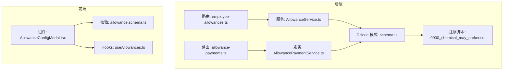
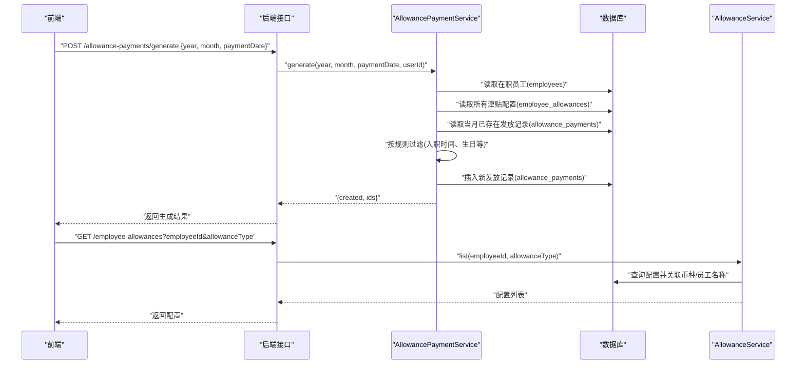
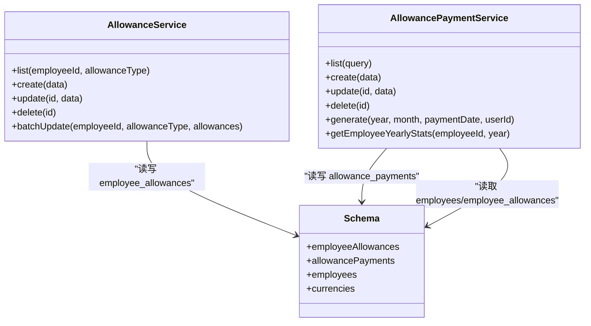

# 员工津贴配置

<cite>
**本文引用的文件**
- [backend/src/db/schema.ts](file://backend/src/db/schema.ts)
- [backend/drizzle/0000_chemical_may_parker.sql](file://backend/drizzle/0000_chemical_may_parker.sql)
- [backend/src/routes/v2/employee-allowances.ts](file://backend/src/routes/v2/employee-allowances.ts)
- [backend/src/services/AllowanceService.ts](file://backend/src/services/AllowanceService.ts)
- [backend/src/routes/v2/allowance-payments.ts](file://backend/src/routes/v2/allowance-payments.ts)
- [backend/src/services/AllowancePaymentService.ts](file://backend/src/services/AllowancePaymentService.ts)
- [frontend/src/features/employees/components/modals/AllowanceConfigModal.tsx](file://frontend/src/features/employees/components/modals/AllowanceConfigModal.tsx)
- [frontend/src/validations/allowance.schema.ts](file://frontend/src/validations/allowance.schema.ts)
- [frontend/src/hooks/business/useAllowances.ts](file://frontend/src/hooks/business/useAllowances.ts)
</cite>

## 目录
1. [简介](#简介)
2. [项目结构](#项目结构)
3. [核心组件](#核心组件)
4. [架构总览](#架构总览)
5. [详细组件分析](#详细组件分析)
6. [依赖关系分析](#依赖关系分析)
7. [性能考量](#性能考量)
8. [故障排查指南](#故障排查指南)
9. [结论](#结论)
10. [附录](#附录)

## 简介
本文件聚焦于“员工津贴配置”数据模型，围绕 employee_allowances 表的结构与业务逻辑进行深入解析，阐明以下关键点：
- 字段业务含义：employeeId、allowanceType（living/housing/transportation/meal/birthday 等）、currencyId、amountCents 的语义与取值范围
- 多币种支持：同一津贴类型可同时配置多种币种的固定金额
- 与 allowance_payments 的关系：配置数据驱动月度津贴发放记录生成
- Drizzle ORM 定义与查询封装
- 前端津贴类型标签映射与配置界面实现

## 项目结构
围绕“员工津贴配置”的后端与前端涉及的关键文件如下图所示：

图表来源
- [backend/src/routes/v2/employee-allowances.ts](file://backend/src/routes/v2/employee-allowances.ts#L1-L261)
- [backend/src/services/AllowanceService.ts](file://backend/src/services/AllowanceService.ts#L1-L177)
- [backend/src/routes/v2/allowance-payments.ts](file://backend/src/routes/v2/allowance-payments.ts#L34-L71)
- [backend/src/services/AllowancePaymentService.ts](file://backend/src/services/AllowancePaymentService.ts#L1-L269)
- [backend/src/db/schema.ts](file://backend/src/db/schema.ts#L231-L267)
- [backend/drizzle/0000_chemical_may_parker.sql](file://backend/drizzle/0000_chemical_may_parker.sql#L203-L211)
- [frontend/src/features/employees/components/modals/AllowanceConfigModal.tsx](file://frontend/src/features/employees/components/modals/AllowanceConfigModal.tsx#L1-L112)
- [frontend/src/validations/allowance.schema.ts](file://frontend/src/validations/allowance.schema.ts#L1-L28)
- [frontend/src/hooks/business/useAllowances.ts](file://frontend/src/hooks/business/useAllowances.ts#L42-L98)

章节来源
- [backend/src/db/schema.ts](file://backend/src/db/schema.ts#L231-L267)
- [backend/drizzle/0000_chemical_may_parker.sql](file://backend/drizzle/0000_chemical_may_parker.sql#L203-L211)
- [backend/src/routes/v2/employee-allowances.ts](file://backend/src/routes/v2/employee-allowances.ts#L1-L261)
- [backend/src/services/AllowanceService.ts](file://backend/src/services/AllowanceService.ts#L1-L177)
- [backend/src/routes/v2/allowance-payments.ts](file://backend/src/routes/v2/allowance-payments.ts#L34-L71)
- [backend/src/services/AllowancePaymentService.ts](file://backend/src/services/AllowancePaymentService.ts#L1-L269)
- [frontend/src/features/employees/components/modals/AllowanceConfigModal.tsx](file://frontend/src/features/employees/components/modals/AllowanceConfigModal.tsx#L1-L112)
- [frontend/src/validations/allowance.schema.ts](file://frontend/src/validations/allowance.schema.ts#L1-L28)
- [frontend/src/hooks/business/useAllowances.ts](file://frontend/src/hooks/business/useAllowances.ts#L42-L98)

## 核心组件
- 数据模型：employee_allowances 表用于存储“员工-津贴类型-币种”的固定金额配置；allowance_payments 表用于按月生成并记录实际发放记录
- 后端服务：
  - AllowanceService：提供查询、创建、批量更新、删除等配置 CRUD 能力
  - AllowancePaymentService：提供查询、创建、更新、删除、批量生成等发放流程能力
- 前端组件与校验：
  - AllowanceConfigModal：多币种配置界面，支持添加/删除币种行，金额在 UI 层以元为单位输入，转换为分存入数据库
  - allowance.schema.ts：定义前端校验规则，包含 allowanceType 枚举与金额范围
  - useAllowances：前端 Hooks，封装津贴发放的查询、新增、修改、删除与生成操作

章节来源
- [backend/src/db/schema.ts](file://backend/src/db/schema.ts#L231-L267)
- [backend/src/services/AllowanceService.ts](file://backend/src/services/AllowanceService.ts#L1-L177)
- [backend/src/services/AllowancePaymentService.ts](file://backend/src/services/AllowancePaymentService.ts#L1-L269)
- [frontend/src/features/employees/components/modals/AllowanceConfigModal.tsx](file://frontend/src/features/employees/components/modals/AllowanceConfigModal.tsx#L1-L112)
- [frontend/src/validations/allowance.schema.ts](file://frontend/src/validations/allowance.schema.ts#L1-L28)
- [frontend/src/hooks/business/useAllowances.ts](file://frontend/src/hooks/business/useAllowances.ts#L42-L98)

## 架构总览
下图展示了“配置驱动发放”的整体流程：配置数据（employee_allowances）作为输入，由 AllowancePaymentService 在指定年月生成 allowance_payments 记录，并支持后续查询与维护。

图表来源
- [backend/src/services/AllowancePaymentService.ts](file://backend/src/services/AllowancePaymentService.ts#L155-L231)
- [backend/src/services/AllowanceService.ts](file://backend/src/services/AllowanceService.ts#L11-L29)
- [backend/src/routes/v2/allowance-payments.ts](file://backend/src/routes/v2/allowance-payments.ts#L34-L71)
- [backend/src/routes/v2/employee-allowances.ts](file://backend/src/routes/v2/employee-allowances.ts#L45-L91)

## 详细组件分析

### 数据模型：employee_allowances
- 表结构要点
  - 主键：id
  - 关联：employeeId -> employees.id
  - 字段：
    - allowanceType：津贴类型，枚举值包括 living、housing、transportation、meal、birthday
    - currencyId：币种代码，外键约束于 currencies.code
    - amountCents：金额（分为单位），整数型
    - 时间戳：createdAt、updatedAt
- 设计意图
  - 支持“同一员工、同一津贴类型、多币种”的灵活配置
  - amountCents 采用整数存储，避免浮点误差
- 与 allowance_payments 的关系
  - allowance_payments 的发放金额来源于 employee_allowances 的 amountCents
  - 发放记录按 employeeId/year/month/allowanceType/currencyId 唯一索引，防止重复

章节来源
- [backend/src/db/schema.ts](file://backend/src/db/schema.ts#L231-L267)
- [backend/drizzle/0000_chemical_may_parker.sql](file://backend/drizzle/0000_chemical_may_parker.sql#L203-L211)
- [backend/src/services/AllowancePaymentService.ts](file://backend/src/services/AllowancePaymentService.ts#L155-L231)

### 后端服务：AllowanceService（配置 CRUD）
- 功能概览
  - 列表查询：支持按 employeeId 与 allowanceType 过滤，关联返回币种名与员工名
  - 单条创建：生成唯一 id，写入 createdAt/updatedAt
  - 更新：仅更新 amountCents 与 updatedAt
  - 删除：按 id 删除并返回被删除记录
  - 批量更新：先删除该员工该类型的所有配置，再按传入的币种+金额列表逐条插入
- 关键点
  - 批量更新时会对每个币种执行存在性校验
  - 返回结果包含关联字段，便于前端展示

章节来源
- [backend/src/services/AllowanceService.ts](file://backend/src/services/AllowanceService.ts#L1-L177)
- [backend/src/routes/v2/employee-allowances.ts](file://backend/src/routes/v2/employee-allowances.ts#L45-L91)

### 后端服务：AllowancePaymentService（发放生成与维护）
- 功能概览
  - 列表查询：支持按 year、month、employeeId、allowanceType 过滤，关联返回员工、部门、币种、创建人信息
  - 新增/更新/删除：标准 CRUD，更新时自动更新 updatedAt
  - 生成发放记录：
    - 读取所有在职员工
    - 读取全部津贴配置，按 employeeId 分组
    - 读取当月已存在的发放记录，去重集合
    - 遍历员工与配置，按规则生成发放记录（入职时间、生日等）
    - 插入 allowance_payments，返回创建数量与 ids
  - 年度统计：按员工与年份聚合月度总金额
- 关键点
  - 唯一索引保证同员工、同年月、同类型、同币种不重复
  - 生日津贴仅在生日当月发放

章节来源
- [backend/src/services/AllowancePaymentService.ts](file://backend/src/services/AllowancePaymentService.ts#L1-L269)
- [backend/src/routes/v2/allowance-payments.ts](file://backend/src/routes/v2/allowance-payments.ts#L34-L71)

### 前端：津贴配置界面与校验
- AllowanceConfigModal
  - 津贴类型标签映射：living/housing/transportation/meal/birthday 映射为中文标签
  - 多币种配置：支持动态添加/删除币种行
  - 金额转换：UI 输入以元为单位，提交前乘以 100 转换为分
- 前端校验
  - allowanceType 使用枚举限定
  - 金额必须大于 0
- Hooks
  - useAllowances 提供查询、新增、更新、删除、生成等操作的封装

章节来源
- [frontend/src/features/employees/components/modals/AllowanceConfigModal.tsx](file://frontend/src/features/employees/components/modals/AllowanceConfigModal.tsx#L1-L112)
- [frontend/src/validations/allowance.schema.ts](file://frontend/src/validations/allowance.schema.ts#L1-L28)
- [frontend/src/hooks/business/useAllowances.ts](file://frontend/src/hooks/business/useAllowances.ts#L42-L98)

### Drizzle ORM 定义与使用示例
- 表定义位置
  - employee_allowances：见 schema.ts 中的 sqliteTable 定义
  - allowance_payments：见 schema.ts 中的 sqliteTable 定义
- 查询与插入示例（路径引用）
  - 列表查询（配置）：[backend/src/services/AllowanceService.ts](file://backend/src/services/AllowanceService.ts#L11-L29)
  - 批量更新（配置）：[backend/src/services/AllowanceService.ts](file://backend/src/services/AllowanceService.ts#L103-L171)
  - 生成发放记录（服务层）：[backend/src/services/AllowancePaymentService.ts](file://backend/src/services/AllowancePaymentService.ts#L155-L231)
  - 唯一索引（发放记录）：[backend/src/db/schema.ts](file://backend/src/db/schema.ts#L241-L267)

章节来源
- [backend/src/db/schema.ts](file://backend/src/db/schema.ts#L231-L267)
- [backend/src/services/AllowanceService.ts](file://backend/src/services/AllowanceService.ts#L11-L29)
- [backend/src/services/AllowanceService.ts](file://backend/src/services/AllowanceService.ts#L103-L171)
- [backend/src/services/AllowancePaymentService.ts](file://backend/src/services/AllowancePaymentService.ts#L155-L231)

## 依赖关系分析
- 组件耦合
  - AllowanceService 依赖 Drizzle 模式 schema.ts，直接操作 employee_allowances
  - AllowancePaymentService 依赖 Drizzle 模式 schema.ts，操作 employees、employee_allowances、allowance_payments
  - 前端 AllowanceConfigModal 通过 useAllowances Hooks 与后端 allowance-payments 接口交互
- 外部依赖
  - Drizzle ORM（sqlite-core）
  - 前端 Ant Design 表单与校验库（zod）

图表来源
- [backend/src/services/AllowanceService.ts](file://backend/src/services/AllowanceService.ts#L1-L177)
- [backend/src/services/AllowancePaymentService.ts](file://backend/src/services/AllowancePaymentService.ts#L1-L269)
- [backend/src/db/schema.ts](file://backend/src/db/schema.ts#L231-L267)

## 性能考量
- 查询优化
  - 配置列表查询对 employeeId 与 allowanceType 建有索引条件，建议在高频过滤场景下保持参数齐全
  - 批量更新会先删除再插入，适合小规模配置变更；若配置量大，可考虑合并策略减少事务次数
- 生成发放记录
  - 生成流程会扫描在职员工与全部配置，建议在大规模组织中控制生成频率或分批处理
  - 唯一索引可有效避免重复生成，但插入操作仍需注意幂等性与并发控制

## 故障排查指南
- 重复发放记录
  - 现象：生成时抛出重复错误
  - 原因：allowance_payments 对 employeeId/year/month/allowanceType/currencyId 建有唯一索引
  - 处理：确认是否已存在该组合的发放记录，或调整年月/类型/币种
  - 参考：[backend/src/services/AllowancePaymentService.ts](file://backend/src/services/AllowancePaymentService.ts#L62-L79)
- 生日津贴未发放
  - 现象：生日津贴未出现在当月发放记录
  - 原因：仅当员工生日当月且存在生日配置时才会生成
  - 处理：检查员工 birthday 字段与配置的 allowanceType=birthday
  - 参考：[backend/src/services/AllowancePaymentService.ts](file://backend/src/services/AllowancePaymentService.ts#L199-L206)
- 币种不存在
  - 现象：批量更新配置时报错或忽略无效币种
  - 原因：服务端在插入前会校验币种存在性
  - 处理：确保币种已在 currencies 中存在
  - 参考：[backend/src/services/AllowanceService.ts](file://backend/src/services/AllowanceService.ts#L120-L133)
- 金额精度问题
  - 现象：前端以元为单位输入，数据库以分为单位存储
  - 处理：前端提交前乘以 100，后端不再做转换
  - 参考：[frontend/src/features/employees/components/modals/AllowanceConfigModal.tsx](file://frontend/src/features/employees/components/modals/AllowanceConfigModal.tsx#L52-L56)

章节来源
- [backend/src/services/AllowancePaymentService.ts](file://backend/src/services/AllowancePaymentService.ts#L62-L79)
- [backend/src/services/AllowancePaymentService.ts](file://backend/src/services/AllowancePaymentService.ts#L199-L206)
- [backend/src/services/AllowanceService.ts](file://backend/src/services/AllowanceService.ts#L120-L133)
- [frontend/src/features/employees/components/modals/AllowanceConfigModal.tsx](file://frontend/src/features/employees/components/modals/AllowanceConfigModal.tsx#L52-L56)

## 结论
- employee_allowances 提供了灵活的“员工-津贴类型-币种”配置能力，支持多币种并行
- allowance_payments 由配置驱动生成，形成“配置-发放”的闭环
- 前端通过 AllowanceConfigModal 与校验规则保障数据质量，配合 Hooks 实现高效操作
- 建议在大规模组织中关注生成流程的性能与幂等性，确保配置变更与发放生成的稳定性

## 附录

### 字段与枚举定义参考
- allowanceType 枚举（来自前端校验与服务端使用）
  - living、housing、transportation、meal、birthday
- amountCents 存储单位
  - 分（cent），整数型
- 币种 currencyId
  - 外键约束于 currencies.code

章节来源
- [frontend/src/validations/allowance.schema.ts](file://frontend/src/validations/allowance.schema.ts#L1-L28)
- [backend/src/services/AllowancePaymentService.ts](file://backend/src/services/AllowancePaymentService.ts#L155-L231)
- [backend/src/db/schema.ts](file://backend/src/db/schema.ts#L231-L267)